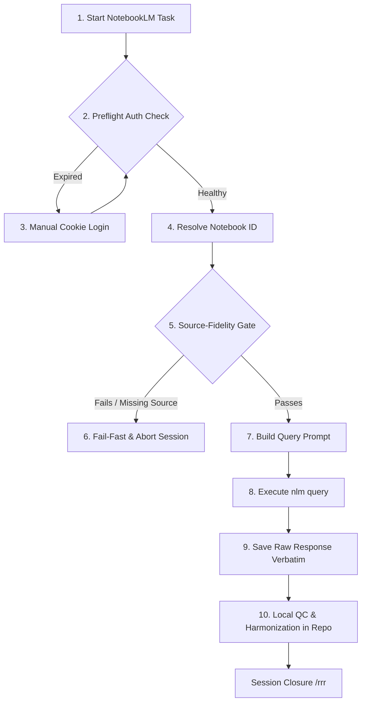

# NotebookLM CLI Rules & Workflow

> [!IMPORTANT]
> **MANDATORY SYSTEM DIRECTIVE - NOT A SUGGESTION**
> All instructions, guardrails, and workflows defined in this skill are **strict system constraints**.
> Any agent invoking or interacting with NotebookLM in this workspace **MUST** execute queries exclusively via the `nlm` CLI tool.
> Failure to follow these rules constitutes a direct violation of the core agent safety mandate.

---

## 1. Core Principles (Strictly Mandatory)

1. **"Nothing is Deleted" (Verbatim Capture)**
   * **REQUIRED:** All raw responses from the `nlm` CLI must be saved **verbatim as-is** in the repository under a timestamped run directory (e.g., `ψ/inbox/notebooklm_runs/YYYY-MM-DD_HHMM_raw.md` or as JSON) before any formatting, translation, or cleanup occurs. This ensures a transparent, uncorrupted audit trail of source data.
2. **Query-Only Policy (Absolute Restriction)**
   * **BANNED:** Generating podcasts (`audio`), mindmaps, slide decks, or video overviews is strictly prohibited.
   * **RESTRICTION:** Use only CLI query and source management commands (`nlm query`, `nlm list`, `nlm source`).
3. **Local Harmonisation**
   * **REQUIRED:** Deduplication, data cleaning, or register updates must be performed **locally in the repository files**, never inside NotebookLM.
4. **No Substitution on Tool Failure (Strict Source-Fidelity)**
   * **REQUIRED:** If a CLI query fails or times out, the agent **MUST** immediately report the error and stop.
   * **BANNED:** Under no circumstances is the agent allowed to bypass a failed query by pulling from local files, general search, or other workspace files to simulate a successful query. Doing so violates the source-fidelity gate and introduces the risk of out-of-date or hallucinated information.
5. **No Browser Automation**
   * **BANNED:** Browser automation tools (e.g., Playwright MCP `ask_question`) are strictly banned from execution due to bot-detection and timeout instability.
   * **REQUIRED:** Execute queries using the command: `nlm query notebook <notebook_id> "<question>"` (use `--json` when structured citation metadata is needed).

---

## 2. Parameter Discipline (Strictly Mandatory)

Every `nlm` command must specify the notebook and parameters explicitly to ensure non-interrupted, error-free execution:
*   **Notebook ID**: Always pass the exact UUID (e.g., `8bcbf9bb-fc5c-448a-839f-74a2d11b1a0e`) or its registered alias.
*   **JSON Flag**: Pass the `--json` option if downstream parsing of references or citations is required.
*   **Timeout**: Pass `--timeout 120` to guarantee a 2-minute API threshold.

---

## 3. Unified Workflow



### Step 1: Preflight Auth Check (MANDATORY GATE)
You **MUST** verify authentication status before executing any query by running `nlm login --check`. If the session is invalid, you **MUST** apply the **Manual Cookie Login** process immediately.

### Step 2: Resolve Notebook ID (MANDATORY GATE)
You **MUST** retrieve the notebook UUID (e.g., `8bcbf9bb-fc5c-448a-839f-74a2d11b1a0e`). Do not make active notebook assumptions.

### Step 3: Source-Fidelity Gate (MANDATORY GATE)
1. You **MUST** run `nlm list sources <notebook_id>` to retrieve and verify the actual titles of the documents in the target notebook.
2. You **MUST** group query targets into small packets of 1–3 exact titles.
3. You **MUST** instruct NotebookLM in the prompt to **stop and report** (Fail-Fast) if any of the target documents are missing or ambiguous.

### Step 4: Build Query Prompt
Formulate a focused extraction query. You **MUST** explicitly command NotebookLM to extract raw data without summarizing or generalizing across unrelated concepts.

### Step 5: Save Raw Response Verbatim (MANDATORY AUDIT GATE)
You **MUST** save the raw output from the CLI query into a timestamped file under `notebooklm_runs/` BEFORE applying any local changes, edits, or analysis.

### Step 6: Local Harmonisation (MANDATORY GATE)
You **MUST** clean, translate, or format the text locally in the repository files after the raw output has been written to the audit log.

---

## 4. Troubleshooting & Manual Cookie Login

When Google invalidates cookies (usually every 2-4 weeks), commands will fail with `Authentication expired` or `Failed to authenticate session`.

### Verification of Authentication:
Run the diagnostic command in the terminal to verify active profiles and credentials:
```bash
nlm login --check
```

### Manual Cookie Extraction Steps:
1. Log in to [https://notebooklm.google.com](https://notebooklm.google.com) in your web browser.
2. Open **Developer Tools** (`F12` or `Ctrl+Shift+I`).
3. Select the **Network** tab and filter by `batchexecute`.
4. Click on any notebook in the UI to trigger a background request.
5. Left-click the `batchexecute` request list item on the left.
6. In the right-hand details panel, select the **Headers** tab, scroll to **Request Headers**, and find `cookie:`.
7. Select the entire long cookie string, copy it, and paste it into a temporary local file (e.g., `cookie.txt`).
8. Run the CLI command:
   `nlm login --manual --file <path_to_cookie.txt>`
9. Delete the temporary `cookie.txt` file immediately for safety.

---

## 5. Query-Focused Command Reference

Use the following reference to construct exact `nlm` CLI calls for research and extraction tasks:

### 5.1. Chatting with Notebook Sources
* **Command**: `nlm query notebook <notebook_id_or_alias> "<question>"`
* **Description**: Queries all or specific sources within the designated notebook.
* **Syntax Examples**:
  ```bash
  # Standard JSON query with timeout parameters
  nlm query notebook 8bcbf9bb-fc5c-448a-839f-74a2d11b1a0e "What is the data ingestion model?" --json --timeout 120

  # Contextual follow-up query using conversation ID
  nlm query notebook 8bcbf9bb-fc5c-448a-839f-74a2d11b1a0e "Can you elaborate on the second point?" -c "session-12345" --json

  # Targeted query restricted to specific source UUIDs
  nlm query notebook 8bcbf9bb-fc5c-448a-839f-74a2d11b1a0e "Extract rainfall projections" -s "11a228e1-7073-4e93-b306-db150f0e3a15,0bc4f075-947a-48bb-bfae-b370b8b34a24" --json
  ```

### 5.2. Generating Notebook AI Summaries
* **Command**: `nlm notebook describe <notebook_id>`
* **Description**: Retrieves high-level notebook summaries and suggested topics.
* **Syntax Example**:
  ```bash
  nlm notebook describe 8bcbf9bb-fc5c-448a-839f-74a2d11b1a0e --json
  ```

### 5.3. Generating Source AI Summaries
* **Command**: `nlm source describe <source_id>`
* **Description**: Returns an AI-generated summary of a single source document, including extracted keywords.
* **Syntax Example**:
  ```bash
  nlm source describe 11a228e1-7073-4e93-b306-db150f0e3a15 --json
  ```

### 5.4. Fetching Source Details
* **Command**: `nlm source get <source_id>`
* **Description**: Gets source metadata and details.
* **Syntax Example**:
  ```bash
  nlm source get 11a228e1-7073-4e93-b306-db150f0e3a15 --json
  ```
