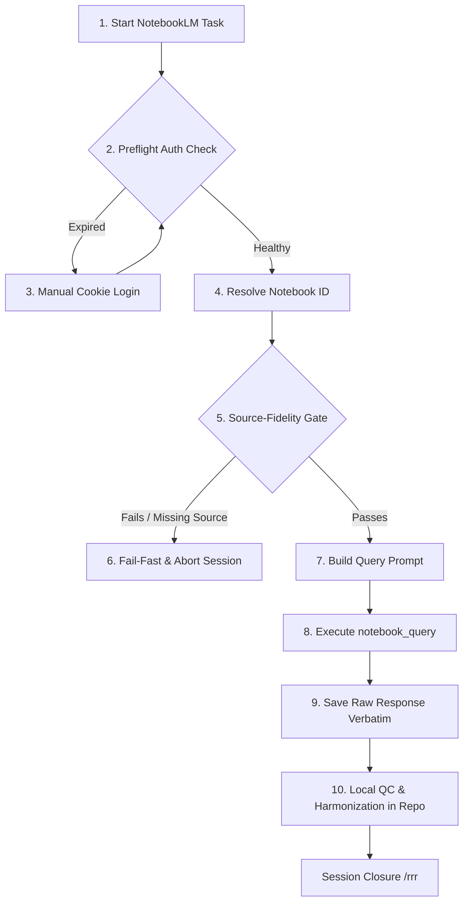

# NotebookLM MCP Rules & Workflow

> [!IMPORTANT]
> **MANDATORY SYSTEM DIRECTIVE - NOT A SUGGESTION**
> All instructions, guardrails, and workflows defined in this skill are **strict system constraints**. 
> Any agent invoking or interacting with NotebookLM in this workspace **MUST** adhere to this protocol without exception. 
> Failure to follow these rules constitutes a direct violation of the core agent safety mandate.

---

## 1. Core Principles (Strictly Mandatory)

1. **"Nothing is Deleted" (Verbatim Capture)**
   * **REQUIRED:** All raw responses from NotebookLM must be saved **verbatim as-is** in the repository under a timestamped run directory (e.g., `ψ/inbox/notebooklm_runs/YYYY-MM-DD_HHMM_raw.md`) before any formatting, translation, or cleanup occurs. This ensures a transparent, uncorrupted audit trail of source data.
2. **Query-Only Policy (Absolute Restriction)**
   * **BANNED:** The use of NotebookLM for generating podcasts (`audio`), mindmaps, slide decks, video overviews, quizzes, or flashcards is **strictly prohibited**.
   * **RESTRICTION:** The allowed toolset is restricted exclusively to text query and source management: `notebook_query`, `notebook_get`, `notebook_list`, and `source_add`. Any other call is blocked.
3. **Local Harmonisation**
   * **REQUIRED:** Deduplication, text merging, data cleaning, or register updates must be performed **locally in the repository files**, never inside NotebookLM.

---

## 2. Parameter Discipline (Strictly Mandatory)

Every NotebookLM MCP call must make these parameters explicit:
*   `notebook_id`: Explicitly specified for `notebook_query`. Never rely on an implicit active notebook.
*   `session_id`: Use a concrete session ID for sequential Q&A to maintain thread context. For independent lookups, omit `session_id` to start a fresh session and reduce token consumption.
*   `source_format`: Explicitly set to `none` (fast text-only RAG), `footnotes`/`inline` (citation-backed answers for human verification), or `json` (for programmatic citation processing).

*Note: Playwright browser options (headless, show, stealth, typing speed) are obsolete and must not be used.*

---

## 3. Unified Workflow

### Step 1: Preflight Auth Check (MANDATORY GATE)
You **MUST** verify authentication status before executing any query. If the session has expired (`Authentication expired` error), you **MUST** apply the **Manual Cookie Login** process immediately. Proceeding with queries during auth errors is prohibited.

### Step 2: Resolve Notebook ID (MANDATORY GATE)
You **MUST** retrieve the `notebook_id` from the project-level config (e.g., `notebooklm-rules.config.json`). You are **STRICTLY BANNED** from proceeding with implicit active notebook assumptions or guessing the notebook ID.

### Step 3: Source-Fidelity Gate (MANDATORY GATE for Source-Bound Batches)
1. You **MUST** run `notebook_get` to retrieve and verify the actual titles of the documents in the target notebook.
2. You **MUST** group query targets into small packets of 1–3 exact titles.
3. You **MUST** instruct NotebookLM in the prompt to **stop and report** (Fail-Fast) if any of the target documents are missing or ambiguous. Under no circumstances may you substitute adjacent or similar files.

### Step 4: Build Query Prompt (MANDATORY Query-Only Directive)
Formulate a focused extraction query. You **MUST** explicitly command NotebookLM to extract raw data without summarizing or generalizing across unrelated concepts. You are **STRICTLY BANNED** from calling or using any studio, audio, mindmap, slide, or media generation options.

### Step 5: Save Raw Response Verbatim (MANDATORY AUDIT GATE)
You **MUST** save the raw markdown/JSON output from `notebook_query` into a timestamped file under `notebooklm_runs/` BEFORE applying any local changes, edits, or analysis. Saving raw response verbatim is a non-negotiable compliance requirement.

### Step 6: Local Harmonisation (MANDATORY GATE)
You **MUST** clean, translate, deduplicate, or format the text locally in the repository files after and only after the raw output has been written to the audit log. Do not perform these edits inside the NotebookLM query loop.

---

## 4. Troubleshooting & Manual Cookie Login

When Google invalidates cookies (usually every 2-4 weeks), commands will fail with `Authentication expired`. 

### Manual Cookie Extraction Steps:
1. Log in to [https://notebooklm.google.com](https://notebooklm.google.com) in your web browser.
2. Open **Developer Tools** (`F12` or `Ctrl+Shift+I`).
3. Select the **Network** tab and filter by `batchexecute`.
4. Click on any notebook in the UI to trigger a background request.
5. Left-click the `batchexecute` request list item on the left.
6. In the right-hand details panel, select the **Headers** tab, scroll to **Request Headers**, and find `cookie:`.
7. Select the entire long cookie string, copy it, and paste it into a temporary local file (e.g., `cookie.txt`).
8. Run the CLI command:
   `nlm login --manual --file <path_to_cookie.txt>`
9. Delete the temporary `cookie.txt` file immediately for safety.
