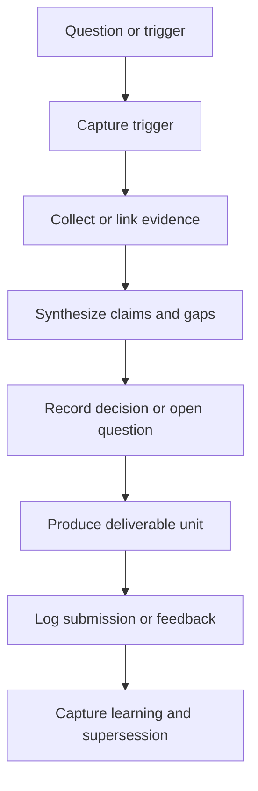
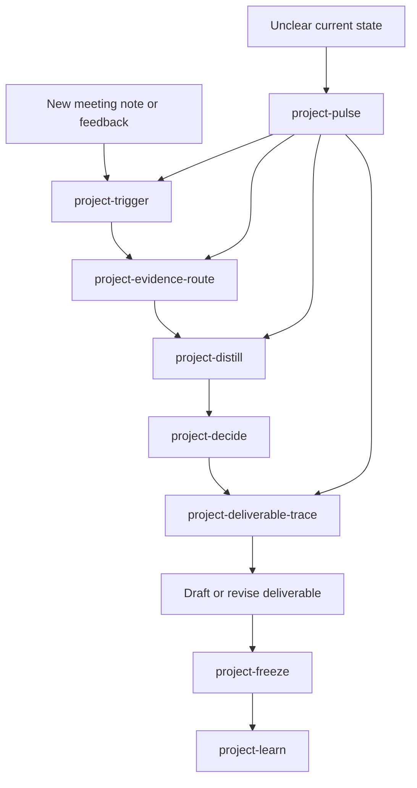
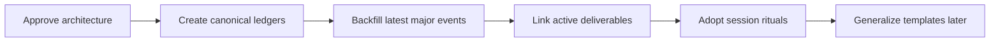

# CRDB Oracle-aligned project work cycle architecture plan

## Purpose

Design a **CRDB-first, reusable later** project management architecture that preserves:

- source traceability
- evolution of ideas and deliverables
- explicit decision rationale
- change triggers and directional shifts
- learning signals for later reuse

This plan aligns with the Oracle principles in [`CLAUDE.md`](CLAUDE.md) and builds on current CRDB evidence patterns already visible in:

- [`ψ/incubate/DCCE/CRDB/plan.md`](ψ/incubate/DCCE/CRDB/plan.md)
- [`ψ/incubate/DCCE/CRDB/output/CRDB-Evidence-Registry.md`](ψ/incubate/DCCE/CRDB/output/CRDB-Evidence-Registry.md)
- [`ψ/incubate/DCCE/CRDB/output/CRDB-Evidence-Coverage-Map.md`](ψ/incubate/DCCE/CRDB/output/CRDB-Evidence-Coverage-Map.md)
- [`ψ/incubate/DCCE/CRDB/output/phase1_decision_log.md`](ψ/incubate/DCCE/CRDB/output/phase1_decision_log.md)
- [`ψ/incubate/DCCE/CRDB/output/2026-03-23-CRDB-Interview-Ingestion-Traceability-Note.md`](ψ/incubate/DCCE/CRDB/output/2026-03-23-CRDB-Interview-Ingestion-Traceability-Note.md)

## What the current system already does well

1. **Preserves important syntheses** in stable markdown artifacts.
2. **Separates some evidence layers** such as source notes, synthesis notes, and decision logs.
3. **Records major project decisions** in [`ψ/incubate/DCCE/CRDB/output/phase1_decision_log.md`](ψ/incubate/DCCE/CRDB/output/phase1_decision_log.md).
4. **Tracks evidence coverage and confidence** in [`ψ/incubate/DCCE/CRDB/output/CRDB-Evidence-Coverage-Map.md`](ψ/incubate/DCCE/CRDB/output/CRDB-Evidence-Coverage-Map.md).
5. **Keeps verbatim sponsor notes** for auditability, for example [`ψ/incubate/DCCE/CRDB/output/2026-03-27_progress-meeting-summary_dir-toey.md`](ψ/incubate/DCCE/CRDB/output/2026-03-27_progress-meeting-summary_dir-toey.md).

## Gaps the architecture should close

1. **The work cycle is implicit, not explicit**  
   The repo has strong artifacts, but not yet one repeatable workflow for how a question becomes evidence, then a decision, then a deliverable, then a learning.

2. **Change triggers are not yet first-class objects**  
   Sponsor comments, new interviews, committee feedback, and org-structure shifts clearly affect direction, but they are not yet managed through one dedicated trigger log.

3. **Deliverables are traceable in pockets, not end to end**  
   Some report sections carry internal evidence references, but the architecture does not yet provide one standard path from report claim back to source, decision, and trigger.

4. **Operational roles and review rhythms are still under-specified**  
   This weakness is already visible in [`ψ/incubate/DCCE/CRDB/output/CRDB-Evidence-Coverage-Map.md`](ψ/incubate/DCCE/CRDB/output/CRDB-Evidence-Coverage-Map.md).

5. **Learning capture is incidental**  
   Important project lessons exist in retros and notes, but they are not yet tied systematically to the exact decision or failure pattern that produced them.

## Design thesis

The project should run as an **Oracle evidence operating system** with five linked layers:

1. **Trigger layer** — what changed in the environment
2. **Evidence layer** — what source material exists and how strong it is
3. **Sensemaking layer** — how evidence is interpreted into claims, gaps, and options
4. **Decision layer** — what stance is chosen, by whom, and why
5. **Delivery layer** — what output is produced and what it cites

Everything should be append-first and supersede-friendly, never destructive.

## Oracle principle alignment

| Principle | Architecture implication |
| --- | --- |
| Nothing is Deleted | Every trigger, draft, decision, and submission gets a durable timestamped artifact or supersession link |
| Patterns Over Intentions | Track observed changes, evidence strength, and actual deliverable deltas instead of relying on memory |
| External Brain, Not Command | The system surfaces options, constraints, and rationale, while keeping final judgment with the human |
| Curiosity Creates Existence | Every question can birth a traceable inquiry packet rather than an ephemeral chat outcome |
| Form and Formless | CRDB-specific templates are allowed, but the artifact model should be reusable for other projects |

## Core architecture

### 1. Canonical object types

The minimum system should treat the following as first-class project objects:

#### A. Trigger

Something that causes the project to reconsider direction.

Examples:

- sponsor feedback
- meeting decision
- committee comment
- new interview finding
- source contradiction
- org restructure
- submission event

Suggested artifact: `trigger log entry`

Minimum fields:

- trigger id
- date
- origin
- short description
- impact zone
- urgency
- linked evidence
- linked decisions
- linked deliverables
- status

#### B. Evidence asset

Any source or synthesis used to support reasoning.

Examples:

- transcript
- interview note
- literature note
- benchmark note
- comparison matrix
- evidence registry row

Suggested artifact: `evidence registry row` plus optional `evidence note`

Minimum fields:

- evidence id
- type
- provenance
- source location
- confidence or strength
- main topics
- used in
- follow-up need

#### C. Claim

An intermediate statement the team wants to make because the evidence appears to support it.

Examples:

- DCCE should act as architect and librarian, not platform builder
- baseline endorsement is a core trust mechanism
- catalog-first is safer than warehouse-first in phase 1

Suggested artifact: `claim note` or structured section inside a synthesis note

Minimum fields:

- claim id
- exact wording
- supporting evidence ids
- opposing or limiting evidence
- confidence level
- related deliverables

#### D. Decision

A locked or pending stance for project direction.

Examples already exist in [`ψ/incubate/DCCE/CRDB/output/phase1_decision_log.md`](ψ/incubate/DCCE/CRDB/output/phase1_decision_log.md).

Minimum fields:

- decision id
- decision statement
- status
- date
- owner or confirmer
- evidence basis
- trigger basis
- implications
- supersedes or superseded by

#### E. Deliverable unit

A report section, pack, slide, brief, template, or workshop output that consumes evidence and decisions.

Suggested artifact: `deliverable map row` or `section trace note`

Minimum fields:

- deliverable id
- output file
- audience
- purpose
- claims used
- evidence used
- decision dependencies
- open risks
- latest revision status

#### F. Learning

Reusable insight about process, framing, stakeholder handling, or evidence quality.

Suggested artifact: timestamped learning note in Oracle memory with links back to the triggering work.

Minimum fields:

- learning id
- pattern observed
- source episode
- affected workflow step
- recommended reuse rule

### 2. Standard lifecycle

Every significant project movement should follow this chain:

This is the repeatable project work cycle.

### 3. Operating model

The architecture should use **two parallel but linked streams**.

#### Stream A — thinking stream

Used to preserve reasoning quality.

- trigger log
- evidence registry
- claim or synthesis notes
- decision log
- learning notes

#### Stream B — delivery stream

Used to produce sponsor-facing outputs.

- report sections
- briefing packs
- workshop materials
- meeting agendas
- progress updates
- submissions and snapshots

The rule is:

**Delivery artifacts can summarize. Thinking artifacts must preserve the reasoning trail.**

## Proposed reusable artifact set

### Project-level canonical files

For CRDB first, then reusable later:

- `Hub.md` — project homepage and navigation
- `plan.md` — active priorities, now next later, and live anchors
- `output/decision_log.md` or project decision log — locked and pending decisions
- `output/evidence_registry.md` — active evidence index
- `output/evidence_coverage_map.md` — strength by gap lens or workstream
- `output/trigger_log.md` — what changed and why it matters
- `output/deliverable_map.md` — deliverables and their dependencies
- `output/claim_register.md` — reusable claims and their evidence basis
- `output/submission_log.md` — what was submitted, when, and from which source state
- `output/change_log.md` — human-readable evolution of major direction shifts

### Working-note artifact families

- `inbox_source/` for raw incoming materials
- `inbox_note/` for human or agent working notes
- `output/` for structured syntheses and decision-ready artifacts
- `archive/` for demoted but preserved material

### Deliverable-level support artifacts

For each major deliverable or report section:

- `section trace note`
- `evidence packet`
- `revision note`
- `submission snapshot`

## Recommended folder and naming conventions

Keep the current project structure, but add a small set of standard files under [`ψ/incubate/DCCE/CRDB/output/`](ψ/incubate/DCCE/CRDB/output/).

### New recommended files

- `CRDB-Trigger-Log.md`
- `CRDB-Deliverable-Map.md`
- `CRDB-Claim-Register.md`
- `CRDB-Submission-Log.md`
- `CRDB-Change-Log.md`

### Naming rule

Use one of these patterns only:

- `YYYY-MM-DD_short-description.md` for event-specific notes
- `Project-Canonical-Artifact.md` for continuously maintained indexes and ledgers
- `SectionId-DeliverableName-trace-note.md` for report-section support notes

This prevents drift between timestamped event notes and continuously maintained indexes.

## Linking rules

### Rule 1 — every decision must point both backward and forward

- backward to triggers and evidence
- forward to deliverables and next actions

### Rule 2 — every deliverable must declare its evidence basis

At minimum, each major report section or management pack should link to:

- source evidence ids
- decision ids
- unresolved risks
- latest snapshot or submission file

### Rule 3 — verbatim material and interpreted material must stay distinct

For example:

- verbatim meeting summary in [`ψ/incubate/DCCE/CRDB/output/2026-03-27_progress-meeting-summary_dir-toey.md`](ψ/incubate/DCCE/CRDB/output/2026-03-27_progress-meeting-summary_dir-toey.md)
- structured interpretation in [`ψ/incubate/DCCE/CRDB/output/2026-03-24_CRDB-Progress-Meeting-Decisions.md`](ψ/incubate/DCCE/CRDB/output/2026-03-24_CRDB-Progress-Meeting-Decisions.md)

This is already a strong local pattern and should become standard.

### Rule 4 — every major change must have an explicit trigger reference

When a plan or report direction changes, the system should answer:

- what changed
- why it changed
- who or what triggered it
- what artifacts are now superseded

### Rule 5 — submission creates a freeze point

Whenever something is submitted externally, create or link:

- a snapshot file
- a submission log entry
- the exact decision and evidence basis used at that time

## End-to-end work cycle by work type

### A. Idea development cycle

Use when shaping a new concept, strategy, or framing.

1. Create a trigger or question entry.
2. Open or update an evidence packet.
3. Draft a synthesis note with candidate claims.
4. Record open options and constraints.
5. Lock chosen framing in the decision log.
6. Update `plan.md` and any deliverable map rows.

### B. Source ingestion cycle

Use for interviews, documents, benchmark research, or sponsor notes.

1. Preserve raw source in `inbox_source` or equivalent.
2. Create a normalized note or extraction.
3. Add or update evidence registry row.
4. Record whether this source changes any existing claim or decision.
5. If yes, create a trigger entry and link affected artifacts.

### C. Deliverable drafting cycle

Use for report sections, briefs, decks, or packs.

1. Create a deliverable map row.
2. Link required decisions and evidence.
3. Draft from claim-level syntheses, not from raw source discovery.
4. Capture revision notes when wording or scope changes materially.
5. Freeze a snapshot at submission.
6. After feedback, log the trigger and update supersession chain.

### D. Direction-change cycle

Use when the sponsor, evidence, or context shifts the project.

1. Record the trigger.
2. Identify affected decisions, deliverables, and assumptions.
3. Write a short change note summarizing impact.
4. Supersede old direction without deleting it.
5. Update the canonical indexes.

## Minimum operating rituals

### Daily or session opening

- review [`ψ/incubate/DCCE/CRDB/plan.md`](ψ/incubate/DCCE/CRDB/plan.md)
- review newest trigger entries
- review newest submission or feedback events
- identify which decisions are stable and which are under pressure

### During analysis

- new source means evidence registry update
- new contradiction means trigger log update
- new framing means claim note or decision candidate

### Before drafting any external output

- confirm the active decision set
- confirm the evidence basis is explicit
- confirm open risks are either disclosed or parked

### After meetings or sponsor contact

- preserve verbatim note
- produce structured decision or implication note
- update trigger log
- update plan and deliverable map if the direction changed

### After submission

- create snapshot
- log submission event
- record what changed since previous version
- record expected feedback channel

### End of session

- handoff note
- update canonical indexes only if new stable information emerged
- record learning if a pattern became visible

## Blind spots the system should actively watch for

These are likely important even if not always obvious in the moment.

1. **Unspoken scope shifts**  
   The project can drift because wording changes faster than formal decisions.

2. **Evidence strength mismatch**  
   Some topics may sound mature in prose while the evidence base is still moderate or weak.

3. **Verbatim notes being mistaken for approved direction**  
   Human meeting notes are crucial, but they are not automatically final policy.

4. **Deliverable pressure collapsing reasoning hygiene**  
   During drafting, the team may skip trigger and decision logging.

5. **Implicit assumptions surviving too long**  
   A claim may continue operating even after sponsor signals or new evidence changed the context.

6. **Local fixes not becoming reusable patterns**  
   A one-off workaround can solve today’s problem but never enter the reusable operating model.

## Implementation phases

### Phase 1 — stabilize the architecture using current CRDB reality

Goal: add missing canonical indexes without restructuring the whole repo.

Introduce:

- trigger log
- deliverable map
- submission log
- claim register
- change log

Backfill only recent critical events, not the entire history.

### Phase 2 — connect active CRDB deliverables to the system

Goal: make current report work traceable end to end.

Apply the model first to:

- interim report v3 work
- progress meeting outputs
- workshop preparation outputs

Each gets a deliverable row and section trace support.

### Phase 3 — operationalize rituals

Goal: make the architecture a habit rather than a documentation exercise.

Add lightweight rules for:

- session opening review
- post-meeting update
- submission freeze point
- change-trigger logging

### Phase 4 — generalize beyond CRDB

Goal: extract a reusable project kit for other consulting projects.

Convert CRDB-tested patterns into generic templates after they survive real use.

## Recommended initial deliverables to implement next

1. Create [`plans/2026-03-27-crdb-oracle-project-work-cycle-architecture-plan.md`](plans/2026-03-27-crdb-oracle-project-work-cycle-architecture-plan.md) as the approved architecture reference.
2. Create project canonical ledgers in [`ψ/incubate/DCCE/CRDB/output/`](ψ/incubate/DCCE/CRDB/output/):
   - `CRDB-Trigger-Log.md`
   - `CRDB-Deliverable-Map.md`
   - `CRDB-Claim-Register.md`
   - `CRDB-Submission-Log.md`
   - `CRDB-Change-Log.md`
3. Update [`ψ/incubate/DCCE/CRDB/plan.md`](ψ/incubate/DCCE/CRDB/plan.md) to point to these ledgers as canonical workflow anchors.
4. Backfill only the latest high-impact events:
   - progress meeting decisions
   - interim report submission snapshot
   - org restructure governance signal
   - digital-tech coordination uncertainty
5. Define a section trace pattern for active report subsections so claims, evidence, and revisions are easier to audit.

## Skill design layer

The artifact architecture alone is not enough. To actively **trigger project progress**, the system should include a **skill layer** that pushes the work forward at the right moments in the cycle.

The design principle is:

**Artifacts preserve state. Skills create movement.**

### Why a skill layer is needed

The current CRDB workspace already preserves many important materials, but progress can still stall when:

- a trigger is noticed but not converted into action
- evidence accumulates without becoming a decision
- decisions exist without being propagated into deliverables
- a deliverable is submitted without a proper freeze point or learning capture

A good skill layer should therefore do more than document. It should detect where the project is in the cycle and push it to the next valid state.

### Skill roles in the work cycle

| Work-cycle stage | Artifact role | Skill role |
| --- | --- | --- |
| Trigger appears | Preserve what changed | Convert the signal into a logged trigger and impact scan |
| Evidence accumulates | Index and assess source material | Turn sources into structured evidence and identify changed claims |
| Sensemaking starts | Preserve synthesis and gaps | Force explicit claims, options, tensions, and open questions |
| Decision moment | Preserve rationale and consequences | Prompt decision locking or clearly mark pending decisions |
| Deliverable drafting | Preserve traceability | Assemble output from approved claims and evidence only |
| Submission or review | Preserve freeze point | Create snapshot, delta note, and feedback intake |
| Learning emerges | Preserve reusable pattern | Distill what should become reusable workflow guidance |

### Proposed skill stack

The architecture should eventually include a small suite of focused skills rather than one giant workflow skill.

#### 1. Progress pulse skill

Purpose: determine **where the project currently is in the cycle** and what the highest-leverage next move should be.

Working title:

- `project-pulse`

Main behavior:

- read current [`ψ/incubate/DCCE/CRDB/plan.md`](ψ/incubate/DCCE/CRDB/plan.md)
- inspect newest trigger, decision, submission, and deliverable artifacts
- detect stalled states such as:
  - evidence with no synthesis
  - changed direction with no trigger log
  - draft with no section trace note
  - submission with no snapshot or delta note
- output 2 to 4 valid next-cycle moves

This becomes the main **orientation and momentum skill**.

#### 2. Trigger capture skill

Purpose: convert a project-changing event into a structured update.

Working title:

- `project-trigger`

Main behavior:

- ingest a meeting outcome, sponsor comment, new evidence, committee note, or internal realization
- create or update trigger entry
- identify impacted decisions, claims, and deliverables
- produce a short impact summary

This skill is what stops important changes from remaining buried in chat or notes.

#### 3. Evidence routing skill

Purpose: transform raw material into usable evidence and route it into the correct reasoning layer.

Working title:

- `project-evidence-route`

Main behavior:

- preserve raw source location
- produce normalized extraction or evidence note
- add or update evidence registry row
- indicate whether the source:
  - strengthens an existing claim
  - weakens an existing claim
  - creates a new trigger
  - creates a new gap

This skill reduces the risk of evidence hoarding without synthesis.

#### 4. Claim and tension distillation skill

Purpose: force explicit reasoning between evidence and decisions.

Working title:

- `project-distill`

Main behavior:

- read evidence packet or synthesis notes
- extract candidate claims
- identify tensions, contradictions, and confidence levels
- separate what is validated, plausible, and still speculative
- prepare input for the decision log or deliverable brief

This skill enforces the missing middle layer between evidence and output.

#### 5. Decision lock skill

Purpose: turn a converged direction into a durable decision artifact.

Working title:

- `project-decide`

Main behavior:

- read current claims, triggers, and constraints
- draft decision-log entries in a standard format
- link backward to evidence and forward to deliverables
- mark whether the decision is:
  - confirmed
  - directional
  - pending validation
  - superseded

This skill protects the project from silent drift and memory-based decisions.

#### 6. Deliverable trace skill

Purpose: make report sections and other outputs traceable without slowing drafting to a halt.

Working title:

- `project-deliverable-trace`

Main behavior:

- create or update a deliverable map row
- generate a section trace note for a report clause or output artifact
- list claims used, evidence used, decision dependencies, and open risks
- prepare drafting anchors for sponsor-facing prose

This is the bridge from internal thinking to external writing.

#### 7. Submission freeze skill

Purpose: create a proper checkpoint whenever something leaves the workspace.

Working title:

- `project-freeze`

Main behavior:

- record submitted file or output snapshot
- write submission log entry
- write short delta note against previous version
- record expected review channel or feedback source

This skill makes external delivery a first-class event, not just a file save.

#### 8. Learning distillation skill

Purpose: turn recurring workflow patterns into reusable Oracle knowledge.

Working title:

- `project-learn`

Main behavior:

- review recent triggers, decisions, and revisions
- identify patterns in progress, blockage, rework, or misunderstanding
- write a reusable learning linked to the source episode
- optionally suggest refinement to project rituals or skill behavior

This is the mechanism that makes the system improve over time.

### Recommended activation map

Each skill should be triggered by a recognizable project situation.

### Skill design rules

To stay aligned with Oracle principles, the skills should follow these rules.

#### Rule 1 — skills must advance state, not just summarize

Every skill should either:

- create a missing artifact
- update a canonical ledger
- identify a blocked transition in the work cycle

#### Rule 2 — skills must preserve links between layers

No skill should produce a decision, claim, or deliverable note without linking:

- source inputs
- affected outputs
- unresolved risks

#### Rule 3 — skills should prefer lightweight updates to heavyweight rewriting

The skill layer should reduce friction, not create bureaucratic overhead.

#### Rule 4 — skills must distinguish observation from interpretation

If a source is verbatim, preserve it as verbatim.
If a note is interpreted, mark it as interpreted.

#### Rule 5 — skills should expose stalled states explicitly

For example:

- trigger with no decision impact
- decision with no deliverable mapping
- submission with no freeze point
- repeated revision without explicit change rationale

### Initial implementation recommendation for the skill layer

Do not build all skills at once.

Start with the three highest-leverage skills for CRDB:

1. `project-pulse`
2. `project-trigger`
3. `project-deliverable-trace`

Why these first:

- `project-pulse` keeps momentum and reveals blockages
- `project-trigger` captures directional change before it disappears
- `project-deliverable-trace` connects reasoning to outputs where current pressure is highest

Then add:

4. `project-decide`
5. `project-freeze`

Then later:

6. `project-evidence-route`
7. `project-distill`
8. `project-learn`

### What this means for the implementation plan

The implementation phase should now include **both artifact build-out and skill build-out**.

Revised implementation logic:

1. establish canonical ledgers
2. wire a minimal skill layer to keep them alive
3. backfill only recent CRDB events
4. test the cycle on one active deliverable stream
5. refine the skill prompts and ledgers from live use

### Revised success criteria with skills included

The design is working when:

1. the project can detect what stage it is in
2. stalled states are surfaced automatically by a skill
3. major direction changes become trigger entries, not forgotten context
4. major deliverables gain explicit trace notes without heavy manual effort
5. submissions reliably create freeze points and later comparison anchors
6. useful process lessons become reusable workflow knowledge

## Success criteria

The design is working when the team can answer these questions quickly:

1. What changed this week and why
2. Which evidence supports the current direction
3. Which decisions are locked vs pending
4. Which deliverables depend on which claims and evidence
5. What was submitted and from which source state
6. What lessons should be reused in the next project cycle

## Recommended next implementation order

