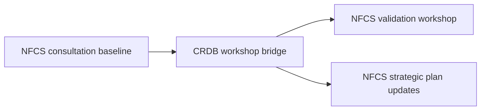

# CRDB workshop narrative strategies (to answer NFCS)

Approved decision anchor: `plans/2026-03-30-crdb-workshop-narrative-approved-plan-note.md`

Audience: **NFCS steering decision-makers** (technical detail captured as annex + breakout artifacts).

Non-negotiable nuance / constraints (important)
1) **NCAIF is sponsored by DCCE and remains TOR-literal.** Stakeholders will still expect to see a *website blueprint* (even if we are reframing “not just a website”). The workshop outputs must therefore include a **website-facing blueprint artifact** expressed in TOR language (e.g., sitemap / IA / page blueprint / content model), plus an annex that explains the underlying data system without fighting the bureaucracy.
2) **NFCS action plan belongs to high-level policymakers (not a line agency).** Workshop outputs must be framed as a **steering decision package** and avoid implying “NFCS will be hosted by DCCE/TMD”. Line agencies can be positioned as implementing actors in the value chain, but ownership sits higher.

Evidence anchors
- CRDB workshop design already includes explicit NFCS linkage in objectives + synthesis: [`ψ/incubate/DCCE/CRDB/output/2026-03-24_CRDB-Workshop-Preliminary-Plan.md`](ψ/incubate/DCCE/CRDB/output/2026-03-24_CRDB-Workshop-Preliminary-Plan.md:21)
- The desired “baton pass” logic and the facilitation gap from the NFCS consultation format are explicit: [`ψ/incubate/DCCE/CRDB/inbox_note/2026-03-27-CRDB-workshop-idea-transcript.md`](ψ/incubate/DCCE/CRDB/inbox_note/2026-03-27-CRDB-workshop-idea-transcript.md:2)
- NFCS reasoning surfaces already frame “value chain”, “fragmentation/official source”, and “impact-based design”: [`ψ/incubate/WMO-NFCS/WMO-NFCS-Claim-Register.md`](ψ/incubate/WMO-NFCS/WMO-NFCS-Claim-Register.md:17)
- WMO-aligned verbatim wording for governance/ownership, UIP (incl. “website”), and MEL/accountability: [`ψ/incubate/WMO-NFCS/output/WMO-NFCS_quote-bank_governance-uip-mel.md`](ψ/incubate/WMO-NFCS/output/WMO-NFCS_quote-bank_governance-uip-mel.md)

Working premise to state explicitly (steering-friendly)
- The NFCS final strategic plan requires **more design work and sharper decision artifacts** than the first consultation format produced.
- The CRDB workshop should not repeat the NFCS baseline meeting; it should **converge** on the decisions NFCS needs next.

---

## Baton-pass timeline (shared storyline)

What the CRDB workshop must *hand to* NFCS (common across all strategies)
1) **Priority service bundle(s)** for Human Settlement and Security (what we will build first)
2) **Baseline + access principles** (what is official now vs candidate, and how it is accessed)
3) **Governance roles + operating rhythm** (who owns, stewards, approves; update cycles)
4) **A steering-ready value chain map** that positions NCAIF and avoids “platform for platform’s sake”

What the CRDB workshop must *also hand to* DCCE (TOR-literal)
- **NCAIF website blueprint** (sitemap + page-level content blueprint + navigation logic)
- Mapping: website pages ↔ service tiers / use-case clusters ↔ baseline datasets (so the “website” artifact is grounded in the real system)

---

## Strategy 1 — Implementation Readiness Gate (NFCS decision package)

### Steering storyline
"NFCS needs an implementable action plan. The CRDB workshop is the readiness gate that turns baseline inventory into an executable cross-agency package for Human Settlement services."

### What to say about the consultation gap
- The consultation surfaced many services and opinions, but did not produce convergence on: (a) priorities, (b) rules, (c) roles.
- The CRDB workshop is designed specifically for **validation + convergence**, not scoping (consistent with CRDB plan): [`ψ/incubate/DCCE/CRDB/output/2026-03-24_CRDB-Workshop-Preliminary-Plan.md`](ψ/incubate/DCCE/CRDB/output/2026-03-24_CRDB-Workshop-Preliminary-Plan.md:17)

### Core outputs (what “answers NFCS”)
- **NFCS Steering Decision Package (Human Settlement)**: 1–2 pages of decisions, not narrative (written as recommendations for steering endorsement):
  - priority services (Phase 1)
  - named owners/stewards/approvers
  - baseline datasets + caveats
  - minimum interoperability expectations (metadata + identifiers)
- **Decision log** (steering version) + **technical annex** (breakout notes).

### TOR-safe DCCE deliverable (paired, to reduce risk)
- **NCAIF Website Blueprint (TOR literal)** packaged as a workshop annex:
  - sitemap + key pages
  - for each page: target user tier, decisions supported, data provenance/caveats links
  - explicit “not just a website” note kept as 5–7 bullet annex, not the headline

### How NCAIF is positioned
- NCAIF is the **integration layer** that makes NFCS operational:
  - demand backbone (use cases/service tiers) → catalog + CDM → baseline and access rails
  - not replacing agencies; making cross-agency services feasible and governable
- Tie to NFCS claims: value chain + fragmentation + impact-based design: [`ψ/incubate/WMO-NFCS/WMO-NFCS-Claim-Register.md`](ψ/incubate/WMO-NFCS/WMO-NFCS-Claim-Register.md:17)

### Pros
- Highly steering-aligned; outputs are directly consumable by NFCS strategic plan drafting.
- Minimizes perceived overlap: “baseline meeting found pieces; this meeting decides how we assemble them.”

### Cons / risks
- Risk of being seen as “too decisive” *for a workshop hosted by a line agency sponsor*; mitigate by framing outcomes as **decision options + recommended defaults** for steering endorsement.
- Requires disciplined facilitation to produce a crisp decision package.

### How it maps to CRDB sessions
- Session 1: establish the “readiness gate” objective + decision targets: [`ψ/incubate/DCCE/CRDB/output/2026-03-24_CRDB-Workshop-Preliminary-Plan.md`](ψ/incubate/DCCE/CRDB/output/2026-03-24_CRDB-Workshop-Preliminary-Plan.md:50)
- Session 2: confirm priority services + tiers: [`ψ/incubate/DCCE/CRDB/output/2026-03-24_CRDB-Workshop-Preliminary-Plan.md`](ψ/incubate/DCCE/CRDB/output/2026-03-24_CRDB-Workshop-Preliminary-Plan.md:57)
- Session 3: baseline endorsement rules: [`ψ/incubate/DCCE/CRDB/output/2026-03-24_CRDB-Workshop-Preliminary-Plan.md`](ψ/incubate/DCCE/CRDB/output/2026-03-24_CRDB-Workshop-Preliminary-Plan.md:65)
- Session 4: roles + rhythm: [`ψ/incubate/DCCE/CRDB/output/2026-03-24_CRDB-Workshop-Preliminary-Plan.md`](ψ/incubate/DCCE/CRDB/output/2026-03-24_CRDB-Workshop-Preliminary-Plan.md:74)
- Session 5: synthesize into NFCS planning package: [`ψ/incubate/DCCE/CRDB/output/2026-03-24_CRDB-Workshop-Preliminary-Plan.md`](ψ/incubate/DCCE/CRDB/output/2026-03-24_CRDB-Workshop-Preliminary-Plan.md:81)

---

## Strategy 2 — Service Bundle Demonstration (impact-based, decision-backwards)

### Steering storyline
"NFCS must be impact-based. We will walk through 1–2 concrete Human Settlement decision journeys, then lock the minimum service bundle and governance required to deliver them." 

### What the workshop produces
- **Two service blueprints** (steering-friendly visuals):
  1) Heat risk service for urban operations (planning + early warning)
  2) Flood/compound risk service for municipal planning and emergency coordination
- For each blueprint:
  - decision/action points
  - service tier (who needs what level)
  - data/model inputs and who provides them
  - baseline vs candidate datasets
  - required metadata/standards

### How NCAIF is positioned
- NCAIF becomes the **service architecture substrate**:
  - CDM makes the blueprint computable and comparable across agencies
  - catalog + baselines make “official source pathways” explicit
  - governance makes updates predictable

### TOR-safe DCCE deliverable (how this strategy pays the “website tax”)
- Convert the 1–2 journeys into a **website blueprint**:
  - “Service pages” as the top-level navigation (not “datasets”)
  - each service page includes: what decision it supports, who uses it, baseline datasets, caveats, contact/owner, and update rhythm

### Pros
- Strongly aligned with NFCS “impact-based design” claim; easier for steering to understand.
- Naturally avoids repetition of “inventory lists” and instead produces “how it works end-to-end”.

### Cons / risks
- Requires careful scoping of the 1–2 journeys to avoid rabbit holes.
- Some stakeholders may feel excluded if their domain is not selected; mitigate by positioning the journeys as templates.

### How it maps to CRDB sessions
- Session 2 becomes the main “journey validation” breakout using use-case cards: [`ψ/incubate/DCCE/CRDB/output/2026-03-24_CRDB-Workshop-Preliminary-Plan.md`](ψ/incubate/DCCE/CRDB/output/2026-03-24_CRDB-Workshop-Preliminary-Plan.md:59)
- Session 3 converts journeys into baseline/access decisions.
- Session 4 assigns owners/stewards per journey component.

---

## Strategy 3 — Access Rails and Official Source Pathways (governance-first)

### Steering storyline
"NFCS will fail if ‘official sources’ and access rules remain ambiguous. The CRDB workshop locks the national access rails and baseline endorsement rules that make cross-agency services trustworthy." 

### What the workshop produces
- **Baseline classification scheme** (steering endorsement level):
  - endorsed baselines (official for NFCS)
  - candidate/experimental datasets
  - interpreted/derived products (models/indices) with validation requirements
- **Access rails** (principles first, implementation later):
  - who can access what, at what resolution, under what terms
  - minimum metadata requirements and caveats
- **Governance charter excerpt**: who approves baseline changes and on what rhythm.

### How NCAIF is positioned
- NCAIF is the **railway station and timetable**, not the train:
  - the national registry of baselines, provenance, caveats
  - the integration contract (CDM + identifiers + metadata)
  - the audit trail for changes

### Pros
- Directly addresses the fragmentation + “official source pathway” bottleneck surfaced in NFCS reasoning.
- Produces policy-like artifacts steering bodies can adopt.

### Cons / risks
- Can feel abstract or bureaucratic unless anchored to a service bundle; mitigate by pairing with a single concrete exemplar.
- Political sensitivity: “official source” decisions can trigger institutional friction.
- Also higher-risk under TOR rigidity: a governance-first story can be rejected as “not a website deliverable” unless explicitly paired with the **website blueprint** annex.

### How it maps to CRDB sessions
- Session 3 is the centerpiece (baseline + access rails): [`ψ/incubate/DCCE/CRDB/output/2026-03-24_CRDB-Workshop-Preliminary-Plan.md`](ψ/incubate/DCCE/CRDB/output/2026-03-24_CRDB-Workshop-Preliminary-Plan.md:65)
- Session 4 becomes the approval + cadence mechanism.

---

## Decision prompt (what we must choose)

Pick **one primary strategy** (1/2/3) and treat the other two as supporting frames.

Recommendation heuristic (steering-focused)
- If NFCS drafting is blocked by lack of crisp decisions → choose **Strategy 1**.
- If steering alignment is weak and stakeholders need to *see* the end-to-end logic → choose **Strategy 2**.
- If institutional friction is about data authority/trust/access → choose **Strategy 3**.

Risk-aware recommendation under the nuance constraints
- Default safest: **Strategy 2 as the steering narrative** (journeys are comprehensible) packaged into **Strategy 1 outputs** (NFCS steering decision package) with **a mandatory website blueprint annex**.
- Treat Strategy 3 as **options-with-tradeoffs**, not as a “we decide official sources today” headline.

---

## Selected (Boss)

Primary narrative: **Strategy 2 — Service Bundle Demonstration**

Packaging:
1) **Strategy 1-style NFCS steering decision package** (recommendations for steering endorsement)
2) **Mandatory NCAIF website blueprint annex** (TOR-literal; sponsor-safe)

Why this is lowest-risk
- Journeys are steering-comprehensible and reduce workshop repetition.
- Still yields crisp decisions needed for NFCS action plan, without implying line-agency ownership.
- Pays the “website tax” explicitly, while treating the website as an interface onto a governed system.

---

## The deliverable pack (what must exist immediately after the workshop)

### A) NFCS steering decision package (2 pages max)
Format: **recommendations for steering endorsement** (avoid “DCCE/TMD will host NFCS”).

1) **Priority service bundles (Human Settlement & Security)**
   - Select 1–2 initial bundles to carry into NFCS validation.
2) **Minimum baseline + caveat rules**
   - endorsed baseline vs candidate vs interpreted products (high-level; details in annex)
3) **Implementing role map**
   - named implementing actors (owner/steward/custodian/reviewer/approver) but explicitly “under NFCS governance”.
4) **Operating rhythm**
   - update cycle + review moments (quarterly/biannual etc.)
5) **NCAIF positioning statement (one paragraph)**
   - “NCAIF enables cross-agency service delivery and auditability; it does not replace line agencies.”

### B) NCAIF website blueprint annex (TOR-literal)
This is deliberately **website-shaped** but system-grounded.

Minimum components
1) **Sitemap** (top-level navigation)
   - Organize by *service bundles* (not by datasets) to align with NFCS impact-based design.
2) **Page blueprint template** (repeatable)
   - Purpose (decision supported)
   - Target user tier
   - Inputs: baseline datasets + caveats
   - Outputs: products/services
   - Provenance + update rhythm
   - Owner/steward contacts
3) **Crosswalk table**
   - pages ↔ use-case clusters ↔ baseline datasets ↔ responsible agencies

---

## Session-by-session mapping (CRDB plan → chosen narrative)

All sessions align to the CRDB workshop structure: [`ψ/incubate/DCCE/CRDB/output/2026-03-24_CRDB-Workshop-Preliminary-Plan.md`](ψ/incubate/DCCE/CRDB/output/2026-03-24_CRDB-Workshop-Preliminary-Plan.md:48)

### Session 1 — Setting the frame (Plenary)
Source: [`ψ/incubate/DCCE/CRDB/output/2026-03-24_CRDB-Workshop-Preliminary-Plan.md`](ψ/incubate/DCCE/CRDB/output/2026-03-24_CRDB-Workshop-Preliminary-Plan.md:50)

Steering storyline (script)
- “NFCS baseline meeting surfaced assets; this workshop converges on 1–2 Human Settlement services and the minimum governance to make them real.”
- “NFCS action plan is owned by high-level policymakers; today we produce a decision package for that steering layer.”
- “NCAIF deliverables remain TOR-literal; you will see a website blueprint, grounded in an auditable data/service system.”

Output
- Agreement on which 1–2 decision journeys will anchor the day.

### Session 2 — Demand backbone and service tiers (Breakout)
Source: [`ψ/incubate/DCCE/CRDB/output/2026-03-24_CRDB-Workshop-Preliminary-Plan.md`](ψ/incubate/DCCE/CRDB/output/2026-03-24_CRDB-Workshop-Preliminary-Plan.md:57)

Breakout task
- Validate the journey(s): user tiers, decisions, “what good looks like”, service tiering.

Outputs
- **Service blueprint v0.9** per journey (one-page visual)
- Ranked “Phase 1 must-haves” per journey

### Session 3 — Baselines, scales, and access rails (Breakout)
Source: [`ψ/incubate/DCCE/CRDB/output/2026-03-24_CRDB-Workshop-Preliminary-Plan.md`](ψ/incubate/DCCE/CRDB/output/2026-03-24_CRDB-Workshop-Preliminary-Plan.md:65)

Breakout task
- For each journey: identify minimum baseline inputs; tag each as endorsed baseline vs candidate vs interpreted.
- Capture caveats + minimum metadata for steering-safe endorsement.

Outputs
- Baseline classification sheet per journey
- “Open questions” list (what must be resolved before NFCS validation)

### Session 4 — Governance roles and operating rhythm (Breakout)
Source: [`ψ/incubate/DCCE/CRDB/output/2026-03-24_CRDB-Workshop-Preliminary-Plan.md`](ψ/incubate/DCCE/CRDB/output/2026-03-24_CRDB-Workshop-Preliminary-Plan.md:74)

Breakout task
- Assign implementing roles per journey component (owner/steward/custodian/reviewer/approver).
- Define the minimum update cadence + review points.

Outputs
- Role map table per journey
- Draft operating rhythm (steering-ready bullets)

### Session 5 — Synthesis and next steps (Plenary)
Source: [`ψ/incubate/DCCE/CRDB/output/2026-03-24_CRDB-Workshop-Preliminary-Plan.md`](ψ/incubate/DCCE/CRDB/output/2026-03-24_CRDB-Workshop-Preliminary-Plan.md:81)

Synthesis structure
- 10-minute readout per journey (what we can recommend for steering endorsement)
- Confirm what will be packaged into:
  - NFCS steering decision package (2 pages)
  - NCAIF website blueprint annex (sitemap + page template + crosswalk)

Outputs
- Agreed contents of the two deliverables (A + B)

---

## NCAIF positioning in the national climate data/service value chain (steering-ready)

Use as the “one paragraph” in the NFCS decision package.

Position statement
- “NCAIF is DCCE-sponsored and TOR-delivered as a website-facing system, but its value is to make cross-agency climate services governable: it publishes service bundles, baselines, caveats, and provenance; it makes responsibilities and update cycles explicit; it supports NFCS steering-level ownership by giving a transparent implementation substrate.”
