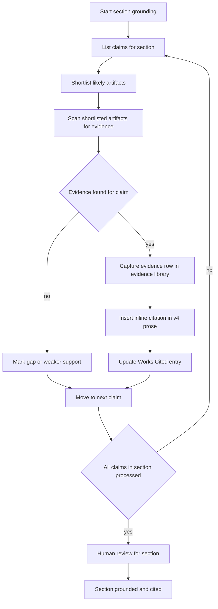

# Foresight 2590 – Efficient Citation and Final Revision Iteration Plan

This plan prioritizes **implementation efficiency** while still delivering a well‑cited, auditable report. It intentionally de‑scopes the heavy three‑map citation architecture and uses a lean, artifact‑first workflow aligned with [`ψ/inbox/2026-04-04-foresight-report-final-revision-and-citation.md`](ψ/inbox/2026-04-04-foresight-report-final-revision-and-citation.md).

Core working context:
- Main report draft (editing in progress): [`ψ/lab/foresight-report-wrting/2026-04-02_foresight-2590-integrated-rewrite-v3-edited.md`](ψ/lab/foresight-report-wrting/2026-04-02_foresight-2590-integrated-rewrite-v3-edited.md)
- Source artifacts: intended under [`ψ/lab/foresight-report-wrting/artifacts/source/`](ψ/lab/foresight-report-wrting/artifacts/source/)
- Existing plans: 
  - [`plans/2026-04-03_foresight-citation-trace-method-plan.md`](plans/2026-04-03_foresight-citation-trace-method-plan.md)
  - [`plans/2026-04-03_draft2-grounding-audit-and-citation-trace-plan.md`](plans/2026-04-03_draft2-grounding-audit-and-citation-trace-plan.md)

We use those earlier plans as background but not as strict implementation scaffolding.

---

## Overview of Iterations

**Iteration 0 – Infrastructure and conventions**  
Light setup to support fast, low‑friction work: a simple citation library and evidence library, plus clear inline citation conventions.

**Iteration 1 – Pilot grounding for Chapter 2 core sections (2.2–2.4)**  
Run the full efficient loop end‑to‑end on a limited scope to prove the workflow.

**Iteration 2 – Scale to remaining chapters and sections**  
Apply the same loop across the rest of the report, reusing the growing citation and evidence libraries.

**Iteration 3 – Global consistency, QA, and final clean‑up**  
Normalize citation style, reconcile Works Cited, and ensure no orphaned or missing references remain.

---

## Workflow Diagram

---

## Iteration 0 – Infrastructure and Conventions

Goal: Minimal but solid scaffolding so every later operation is fast and consistent.

### 0.1 Clarify directories and source inventory

- Confirm the actual path for source artifacts:
  - If necessary, normalize to [`ψ/lab/foresight-report-wrting/artifacts/source/`](ψ/lab/foresight-report-wrting/artifacts/source/)
- Make sure all current deep research reports, project synthesis notes, and primary PDFs that will be used for the foresight report are either:
  - Located under this directory, or
  - Clearly linked from a single index file (for example, `Sources.md`).

### 0.2 Create a simple citation library

Create a single, lean artifact‑level citation library file, for example:
- [`ψ/lab/foresight-report-wrting/citations/citation-library.md`](ψ/lab/foresight-report-wrting/citations/citation-library.md)

Initial fields per artifact could be:
- `ART_ID` – short stable ID (for example `DR01`, `SYN03`, `PDF07`).
- `Title` – human‑readable title.
- `Type` – deep research, synthesis, primary source, other.
- `Path` – relative path to the artifact file.
- `Core_Tags` – a few main topics (for example `adaptive capacity`, `urban resilience`).
- `Baseline_Citation` – the short bibliographic string to use in the report and Works Cited (for example `UNDP 2021`).

This library is the backbone for later search and reuse.

### 0.3 Create an evidence library for reused snippets

Create a single evidence database, for example:
- [`ψ/lab/foresight-report-wrting/citations/evidence-library.md`](ψ/lab/foresight-report-wrting/citations/evidence-library.md)

Each row records a **successful evidence use**:
- `EVID_ID` – unique evidence ID.
- `ART_ID` – which artifact this comes from (foreign key to the citation library).
- `Section` – report section where this evidence is used the first time.
- `Claim_Short` – one or two lines summarizing the claim.
- `Evidence_Snippet` – short quote or paraphrase from the artifact.
- `Keywords` – search keywords (topics, methods, populations, systems).
- `Geo_Scope` – if relevant (for example country, region, city).
- `Timeframe` – if relevant (past or future time window).
- `Source_Ref` – the citation shorthand used inline (for example `Smith 2023`).
- `Notes` – optional caveats or methodological notes.

This file grows only when evidence is actually used, so overhead stays low.

### 0.4 Decide inline citation and Works Cited conventions

- Choose one inline citation pattern and stick to it. For example:
  - Parenthetical author‑year: `(Smith 2023; UNDP 2021)`
  - Or bracketed: `[Smith 2023; UNDP 2021]`
- If there is value in traceability back to deep research reports, define a compact optional suffix, for example `[#DR05-12]` for artifact `DR05`, internal reference `12`.
- Create or designate a single Works Cited file for the report, for example:
  - [`ψ/lab/foresight-report-wrting/citations/works-cited.md`](ψ/lab/foresight-report-wrting/citations/works-cited.md)

Outcome of Iteration 0: A small set of files and conventions that make all later iterations consistent and searchable, without heavy table maintenance.

---

## Iteration 1 – Pilot Grounding for Chapter 2 Core Sections (2.2–2.4)

Goal: Prove the efficient loop on a limited scope and refine the workflow before scaling.

Scope sections (within the main integrated draft):
- Chapter 2 segment covering signals and early trends (section 2.2 as written in [`ψ/lab/foresight-report-wrting/2026-04-02_foresight-2590-integrated-rewrite-v3-edited.md`](ψ/lab/foresight-report-wrting/2026-04-02_foresight-2590-integrated-rewrite-v3-edited.md))
- Chapter 2 segment on life-course trends and vulnerability patterns (section 2.3 in the same file)
- Chapter 2 segment on system map narrative and feedback loops (section 2.4 in the same file)

### 1.1 Claim listing per section

For each section:
- Create a short claim list in a scratch file (for example `ch2-claims-notes.md` under the working set or lab directory).
- Roughly one bullet per distinct claim or cluster of closely related claims.

### 1.2 Artifact shortlist per claim

For each claim:
- Use the citation library and your own memory to shortlist 2–5 artifacts likely to contain supporting evidence.
- Record simple notes like:
  - `Section 2.2 – Claim A – candidates: DR03, DR07, SYN02`

### 1.3 Evidence search and capture

For each `(claim, artifact)` pair until you find satisfactory support:
- In the artifact, locate the paragraph or segment that supports the claim.
- If the artifact has numbered references (for example superscript numbers and a Works Cited section), identify which numbers are relevant.
- When a match is found:
  - Append one row to `evidence-library.md` with:
    - `EVID_ID` (new ID)
    - `ART_ID`
    - `Section`
    - `Claim_Short`
    - `Evidence_Snippet`
    - `Keywords`
    - `Source_Ref`
    - Optional `Geo_Scope`, `Timeframe`, `Notes` as needed.

### 1.4 Inline citation insertion

- In the main integrated draft for that section, insert inline citations directly after the claim.
- Use the chosen citation format plus optional artifact trace if desired, for example:
  - `(UNDP 2021; Smith 2023)` or `[UNDP 2021; Smith 2023]`
  - Optionally add `[#DR05-12]` when there is value in referencing the deep research artifact.

### 1.5 Works Cited update

- For every new `Source_Ref` used inline:
  - Add or confirm a complete entry in `works-cited.md`.
- Ensure each Works Cited entry can be traced back to the corresponding artifact in `citation-library.md`.

### 1.6 Style-pack benchmarking before human review

- After all claims in a section are processed and citations inserted in the main integrated draft, benchmark the section against the writing style pack at [`plans/foresight-report-writing-style-pack.md`](plans/foresight-report-writing-style-pack.md):
  - Check voice and tone (child‑centred, analytical, concise).
  - Check structural principles (paragraph missions, context → mechanism → impact on children → strategic implications).
  - Check concept handling (consistent terminology for systems, vulnerability, children and youth groups).
  - Check sentence‑level style (medium length, clear logic, minimal meta‑commentary).
- Make only minimal wording adjustments needed to align with the style pack **without** changing the underlying claims or evidence base.

### 1.7 Human review and small adjustments

- After style alignment:
  - Read through the section once with inline citations visible.
  - Check for over‑ or under‑citation and adjust.
  - Note any gaps where evidence is weak or missing so they can be addressed in later passes or clearly signposted in the text.

Outcome of Iteration 1: Chapter 2 core sections are grounded with inline citations, Works Cited entries, a small but useful evidence library that can be searched and reused, and prose aligned with the agreed style pack.

---

## Iteration 2 – Scale to Remaining Sections and Chapters

Goal: Apply the proven loop across the rest of the foresight report, using the growing citation and evidence libraries to accelerate work.

### 2.1 Prioritize sections

- Define an order of sections based on:
  - Importance for stakeholders.
  - Degree of uncertainty or risk (sections making strong or novel claims get grounded earlier).
  - Dependencies (sections that summarize others may benefit from coming later).

### 2.2 Reuse evidence before re‑searching

For each new claim:
- First search `evidence-library.md` by `Keywords`, `Geo_Scope`, `Timeframe` and `Claim_Short` patterns.
- If relevant evidence already exists:
  - Reuse the same `Source_Ref` and Works Cited entry.
  - Optionally add the new section to the `Notes` field for that evidence row.
- Only when no suitable evidence exists:
  - Run the full artifact shortlist and search process again.

### 2.3 Maintain incremental discipline

- Continue to add evidence rows only when evidence is actually used.
- Keep v4 prose files stable except where evidence genuinely demands rephrasing or restructuring.
- Avoid expanding into new mapping tables unless they directly reduce friction.

Outcome of Iteration 2: The bulk of the report is grounded with a manageable amount of work, benefiting from reuse and the growing evidence library.

---

## Iteration 3 – Global Consistency, QA, and Final Clean‑up

Goal: Ensure the final report has a consistent, credible citation surface and no obvious technical citation flaws.

### 3.1 Citation surface QA

- Pass through the full v4 report and check for:
  - Claims with no citations that clearly should have them.
  - Inconsistent inline formats.
  - Duplicated or conflicting citations.

### 3.2 Works Cited reconciliation

- Ensure:
  - Every inline citation has a corresponding Works Cited entry.
  - Every Works Cited entry is actually used in the text or is intentionally retained for context.
  - Names, years, and titles are consistent between inline references, `citation-library.md`, and `works-cited.md`.

### 3.3 Evidence library sanity check

- Spot check `evidence-library.md`:
  - Look for obvious duplicates that might be consolidated.
  - Confirm that the most critical claims in the report have at least one clear, high‑quality evidence entry.

### 3.4 Final governance snapshot

- Optionally create a short governance note (for example in `ψ/lab/foresight-report-wrting/citations/`) that explains:
  - How citations were generated.
  - How the evidence library relates to the report.
  - Any known limitations.

Outcome of Iteration 3: A report that is not only well written but presents a coherent, efficient, and explainable citation surface backed by a reusable internal evidence and citation library.

---

## TODO Checklist (Implementation View)

- [ ] Iteration 0: Confirm artifact directory structure for deep research reports, project synthesis, and primary sources.
- [ ] Iteration 0: Create and seed `citation-library.md` with an initial list of key artifacts and `ART_ID` values.
- [ ] Iteration 0: Create `evidence-library.md` with the agreed minimal schema.
- [ ] Iteration 0: Decide and document inline citation format and Works Cited conventions and create `works-cited.md`.
- [ ] Iteration 1: For section 2.2, list claims and shortlist artifacts for each claim.
- [ ] Iteration 1: For section 2.2, locate evidence, append rows to `evidence-library.md`, insert inline citations, and update `works-cited.md`.
- [ ] Iteration 1: Repeat claim listing, artifact shortlisting, evidence capture, and citation insertion for sections 2.3 and 2.4.
- [ ] Iteration 1: Human review of Chapter 2 core sections for citation adequacy and clarity.
- [ ] Iteration 2: Define a prioritized sequence of remaining sections and chapters for grounding.
- [ ] Iteration 2: For each new section, reuse existing evidence where possible before searching new artifacts.
- [ ] Iteration 2: Maintain and grow the evidence library as new sources are used.
- [ ] Iteration 3: Run a global pass for citation surface QA across the full v4 report.
- [ ] Iteration 3: Reconcile inline citations with `works-cited.md` and `citation-library.md`.
- [ ] Iteration 3: Sanity check the evidence library and document any limitations or known gaps.

