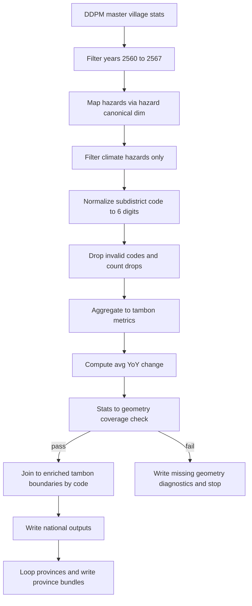

# Plan — National DDPM Tambon Impact Datasets (Gold) + Downstream Analysis Notebook | 2560–2567 | Climate Hazards Only

## Decision (locked for this implementation cycle)

- **Geography**: Tambon (subdistrict) nationwide
- **Years window**: **B.E. 2560–2567**
- **Hazard subset**: **Climate hazards only**, using canonical mapping in [`ψ/incubate/DCCE/CRI/data_system/data/2_gold/dim_hazard_canonical.csv`](ψ/incubate/DCCE/CRI/data_system/data/2_gold/dim_hazard_canonical.csv:1)
- **Primary join key**: **6-digit DOPA tambon code** only
- **No name-based fallback** joins (explicitly banned)
- **Metrics (per tambon)**:
  - `affected_households_sum`
  - `affected_people_sum`
  - `deaths_sum`
  - `avg_yoy_change` (definition below)
  - `percentile_rank` fields (definition below)
- **Outputs (two-layer design)**:
  - **Gold layer fact tables** (national, query-ready)
  - **Downstream analysis notebook** that reads Gold outputs and produces province-specific exports/visuals

### File format decision (locked for this implementation cycle)

- `output_format = csv` only (no Parquet yet)

This plan operationalizes the guardrails in [`ψ/incubate/DCCE/CRI/inbox_note/2026-05-18-task-national-disaster-analysis.md`](ψ/incubate/DCCE/CRI/inbox_note/2026-05-18-task-national-disaster-analysis.md:1) and treats the admin-spine + enriched boundaries as sealed per [`ψ/incubate/DCCE/CRI/inbox_note/2026-05-18-task-national-boundary-cleanup.md`](ψ/incubate/DCCE/CRI/inbox_note/2026-05-18-task-national-boundary-cleanup.md:1).

---

## 1) Inputs (authoritative)

### DDPM stats (Silver)

- Village-level master stats (already consolidated):
  - [`ψ/incubate/DCCE/CRI/data_system/data/1_silver/ddpm/master_village_disaster_stat_2557_2567.csv`](ψ/incubate/DCCE/CRI/data_system/data/1_silver/ddpm/master_village_disaster_stat_2557_2567.csv:1)
- Canonical hazard map (Gold):
  - [`ψ/incubate/DCCE/CRI/data_system/data/2_gold/dim_hazard_canonical.csv`](ψ/incubate/DCCE/CRI/data_system/data/2_gold/dim_hazard_canonical.csv:1)

### Tambon geometry (Silver; enriched and sealed)

- Enriched tambon boundaries (must contain the 6-digit DOPA tambon code column):
  - Locate the exact file/column by inspecting existing scripts (see Section 2).

### Location spine (Gold; sealed)

- Gold master location dimension:
  - (ref in boundary-cleanup note) `dim_location_master.csv` under `data/2_gold/dopa/`.

---

## 2) Starting point: Chiang Rai prototype logic to generalize

The most direct reusable implementation is in the Chiang Rai prototype notebook:

- [`ψ/incubate/DCCE/CRI/data_system/script/analysis_notebooks/ddpm_eda_disaster_dashboard.ipynb`](ψ/incubate/DCCE/CRI/data_system/script/analysis_notebooks/ddpm_eda_disaster_dashboard.ipynb:1)

What to extract from that notebook into a national pipeline:

1. **DDPM filtering**
   - years 2560–2567
   - hazard filter = climate hazards only (via canonical dim)
2. **Code normalization**
   - `Subdistrict Code` → strict 6-digit string
   - province filter = first 2 digits of tambon code (avoid Thai-name province filters)
3. **Aggregation**
   - group by `subdistrict_code` (and optionally year/hazard for side products)
4. **Integrity checks** (mandatory)
   - Stats → geometry coverage check per province (and for national run)
   - invalid-code drop counts
5. **Exports**
   - flat tables (no geometry) for web and Excel

Implementation note: the prototype currently includes logic and commentary around fallback matching (name-based). For national scaling, we must keep only the *diagnostic outputs* and delete the fallback behaviour.

---

## 3) Processing model (two-stage pipeline)

### Stage 0 — Split the work into two artifacts (so runs are fast + reproducible)

1) **ETL/ELT script (build Gold datasets)**
   - deterministic, non-interactive
   - produces national fact tables + QA artifacts
2) **Analysis notebook (read-only over Gold datasets)**
   - filters to a selected province
   - produces maps/plots and user-facing exports

This avoids coupling “data production” with “analysis UX” and keeps national runs repeatable.

---

## 3A) Gold dataset build stages (ETL/ELT)

### Stage A — Extract + normalize + filter (DDPM → working table)

From DDPM master stats, produce a cleaned working table with:

- `year_be` (int or string but normalized)
- `subdistrict_code` (string, 6 digits, strict)
- `affected_households`, `affected_people`, `deaths` (numeric)
- `canonical_hazard_id` or canonical hazard name fields (from dim)

Rules:

- Drop rows with invalid/blank/non-6-digit `subdistrict_code`.
- Count and report drops **per province**.

### Stage B — Tambon aggregation (national fact)

Aggregate to tambon-level for the full period 2560–2567:

- `affected_households_sum = sum(affected_households)`
- `affected_people_sum = sum(affected_people)`
- `deaths_sum = sum(deaths)`

### Stage C — Avg YoY Change (definition)

Define `avg_yoy_change` per tambon for a metric `M` (we can start with `affected_households_sum` at yearly resolution):

- Compute yearly `M_year` for each tambon for years 2560..2567.
- Compute YoY deltas: `Δ_y = M_y - M_(y-1)` for y=2561..2567.
- `avg_yoy_change = mean(Δ_y)`.

Constraints:

- Missing years for a tambon should be treated as 0 for `M_year` **only after** code hygiene + hazard filtering.
- Persist the yearly series as an optional side-output for reproducibility.

### Stage D — Join to geometry (QA only)

Join the tambon aggregates to the enriched tambon boundaries using (for QA only):

- `subdistrict_code` (6-digit DOPA tambon code)

Integrity check direction:

- required check: `stats_codes ⊆ geometry_codes` (Stats → geometry)
- allowed: `geometry_codes \ stats_codes` (no-disaster recorded) → fill stats to 0 for visualization

### Stage E — Write Gold outputs (national)

Write national, query-ready outputs first. Province bundles become *downstream* outputs in the analysis notebook.

Recommended Gold outputs:

- `fact_tambon_impact_2560_2567` (national)
- optional: `fact_tambon_impact_yearly_2560_2567` (national, for YoY transparency)
- `qa_invalid_code_drops_by_province`
- `qa_missing_geometry` (should be empty if assumptions hold)

Encoding/file format decisions are deferred to implementation (CSV-only vs Parquet+CSV), but the schema should be stable.

---

## 3B) Downstream analysis notebook stages (read Gold)

### Stage N1 — Select province

- Input: `province_code` (2 digits)
- Filter `subdistrict_code` startswith `province_code`

### Stage N2 — Province-level percentiles and ranks

- Use **national percentiles** already computed in Gold (preferred), or compute on-the-fly from the national fact table.

### Stage N3 — Join to geometry for visualization

- Join is still code-only (6-digit DOPA tambon code)

### Stage N4 — Exports (province bundle)

Export:

- `PP_tambon_stats_2560_2567.csv` (utf-8-sig)
- `PP_tambon_stats_2560_2567.xlsx`
- map metric CSVs as needed for the web app
- QA extracts for the selected province (invalid drops, missing geometry)

For each province code `PP` (2 digits):

- Filter tambon rows where `subdistrict_code` startswith `PP`.
- Export:
  - `PP_tambon_stats_2560_2567.csv`
  - `PP_tambon_stats_2560_2567.xlsx`
  - `PP_missing_geometry_diagnostics.csv` (should be empty if sealed boundary assumptions hold)
  - `PP_invalid_code_drops.csv` (counts + samples)

Encoding:

- CSV must be `utf-8-sig` for Excel.

### Stage F — Percentile ranking for comparability

Add percentile rank outputs to support interpretation and comparison.

Decision for this cycle:

- Compute **national percentiles only** (cross-province comparability).

For each metric `M` in:

- `affected_households_sum`
- `affected_people_sum`
- `deaths_sum`
- `avg_yoy_change`

Compute `pct_national_M`:

- percentile rank of tambon’s `M` among **all tambons nationwide**.

Implementation notes (for Code mode):

- Use a deterministic method (stable sort + explicit tie strategy) so re-runs match.
- Define percentile direction as “higher impact = higher percentile”.
- Decide whether percentile is `0..100` or `0..1` and keep it consistent across all outputs.

---

## 4) Output contracts (for web + analytics)

### Recommended directory layout

Under the CRI data system artifacts folder already used by the prototype:

- `ψ/incubate/DCCE/CRI/data_system/artifacts/output/national/2560-2567/`
  - `national_tambon_stats_2560_2567.csv`
  - `qa/`
    - `national_missing_geometry.csv`
    - `national_invalid_code_drops_by_province.csv`
  - `provinces/`
    - `PP/`
      - `PP_tambon_stats_2560_2567.csv`
      - `PP_tambon_stats_2560_2567.xlsx`
      - `PP_missing_geometry_diagnostics.csv`
    - `PP_invalid_code_drop_report.csv`

### Gold location (data-system contract)

To reduce ambiguity and make these datasets query-ready, treat the national aggregates as **Gold facts** inside the data system (not only as ad-hoc artifacts):

- Gold facts root (recommended):
  - `ψ/incubate/DCCE/CRI/data_system/data/2_gold/ddpm/`

Proposed Gold tables (filenames are the contract):

- `fact_ddpm_tambon_impact_climate_2560_2567`
  - CSV: `fact_ddpm_tambon_impact_climate_2560_2567.csv`
- `fact_ddpm_tambon_impact_climate_yearly_2560_2567` (optional but recommended for audit)
  - CSV: `fact_ddpm_tambon_impact_climate_yearly_2560_2567.csv`

QA outputs:

- `ψ/incubate/DCCE/CRI/data_system/data/2_gold/ddpm/qa/`
  - `qa_invalid_code_drops_by_province_2560_2567.csv`
  - `qa_missing_geometry_2560_2567.csv` (should be empty if sealed-boundary assumption holds)

### Web schema (flat, no geometry)

Keep geometry separate from metric tables for web:

- `dim_tambon_geometry` (GeoJSON/TopoJSON/MBTiles, decided later)
- `fact_tambon_impact_2560_2567` (Parquet/Arrow-friendly):
  - `subdistrict_code`
  - `subdistrict_name_th`
  - `district_name_th`
  - `province_name_th`
  - metrics listed above

Names should be inherited from the sealed spine (avoid using shapefile text as the authority).

---

## 5) QA gates (must pass before “publish-ready”)

These are hard gates (fail the run if violated):

1. **Stats → geometry coverage** per province: missing geometry for any stats code is a stop condition.
2. **No fallback join by name**: no merges on Thai name fields.
3. **Drop accounting**: invalid-code drops counted per province and recorded.
4. **Deterministic outputs**: re-run with same inputs yields identical row counts + checksums (at least stable row counts + sorted output).

---

## 6) Notebook structure (so it’s navigable and reusable)

Create a national notebook (or scripted notebook) with sections:

1. Configuration (year range, hazard filter, file paths)
2. Load DDPM + hazard dim
3. Clean/normalize tambon codes
4. Filter climate hazards + year window
5. Aggregate tambon metrics + avg YoY change
6. Join to geometry (for map preview only)
7. QA reports (national + per-province)
8. Exports (web tables + province bundles)

---

## 7) Mermaid workflow (implementation view)

---

## 8) Implementation handoff (what Code mode should build)

Minimum implementation units:

- A reproducible entrypoint (notebook or Python script) that:
  - reuses the prototype logic from [`ddpm_eda_disaster_dashboard.ipynb`](ψ/incubate/DCCE/CRI/data_system/script/analysis_notebooks/ddpm_eda_disaster_dashboard.ipynb:1)
  - enforces the guardrails from [`2026-05-18-task-national-disaster-analysis.md`](ψ/incubate/DCCE/CRI/inbox_note/2026-05-18-task-national-disaster-analysis.md:1)
- Province exporter (CSV + XLSX) with Thai names (from spine)
- QA report generator (missing geometry, invalid-code drops)
- README templates for the output folder(s)

### File format decision (defer, but make it configurable)

Implementation should support a single config switch:

- `output_format = parquet | csv | both`

For this cycle, run with `output_format=csv`.
