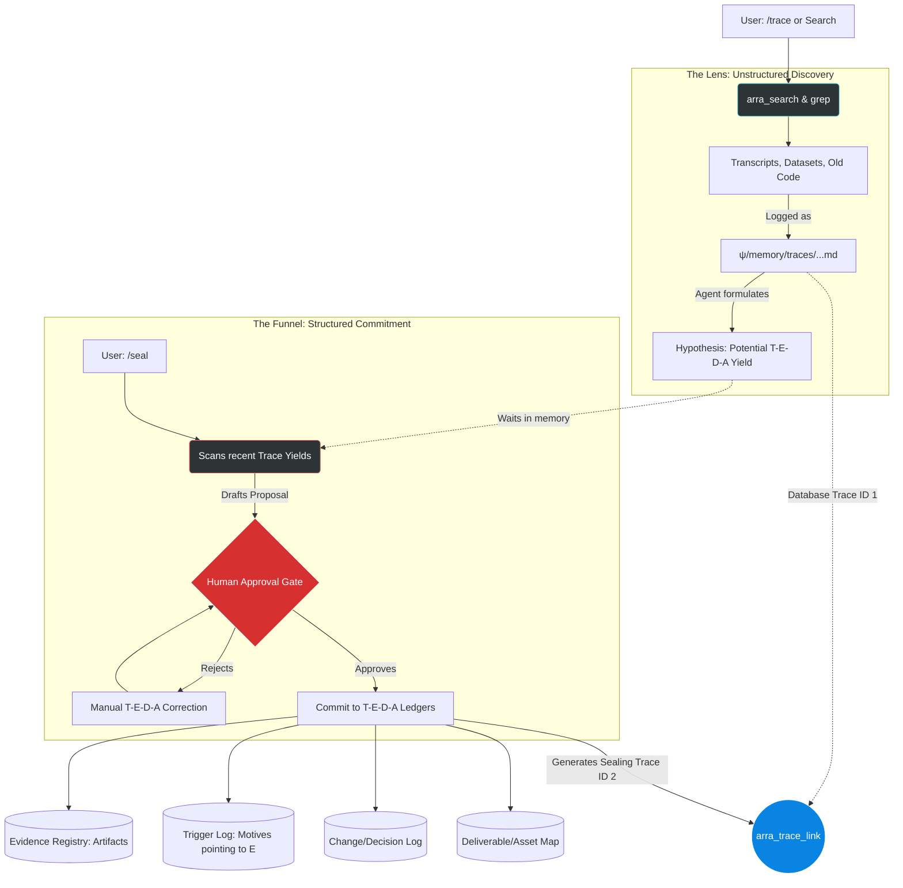

# Implementation Plan: Trace/Seal Ontology Upgrade (T-E-D-A)

## 1. The New Mechanisms (Highlights)

This upgrade eliminates ledger redundancy and bridges unstructured discovery with formal project management.

*   **Artifact vs. Motive Separation**: Files (PDFs, scripts, notebooks, datasets) are strictly **Evidence (E)**. The insight, mandate, or realization drawn from that evidence is the **Trigger (T)**. You will never log a file path in the Trigger ledger again.
*   **The T-E-D-A Pipeline**: The ledgers are upgraded from T-E-CH-D to **T-E-D-A** (Trigger &rarr; Evidence &rarr; Decision &rarr; Asset). This separates discovery (T/E) from execution (D/A) and removes the ambiguous "Change" verb.
*   **The "Trace Yield" (Lens)**: `/trace` remains an unstructured search tool, but it now appends a "Potential Ledger Yields" hypothesis at the bottom of its markdown logs, categorizing its messy findings into T-E-D-A format without touching the actual ledgers.
*   **The "Seal Intake" (Funnel)**: `/seal` actively scans `ψ/memory/traces/` for recent "Yields", uses them to draft the formal Audit-to-Asset chain, requests human approval, and then writes to the ledgers.
*   **Database Bonding**: `/seal` automatically executes `arra_trace_link()` to bond the formal Sealing Event to the chaotic `/trace` session that discovered it, ensuring "Nothing is Deleted."

---

## 2. Information Flow Diagram

---

## 3. Skill Design Requirements & Relationship

### A. `/trace` (The Lens)
**Role**: Discover reality and formulate hypotheses.
*   **Instruction Update**: Explicitly define the "Artifact vs. Motive" rule. Forbid the trace skill from considering a file as a Trigger.
*   **Output Update**: Require the markdown output to conclude with a `### Potential Ledger Yields (T-E-D-A Hypothesis)` section.
*   **Constraint**: Must never use `replace` or `write_file` on `ψ/incubate/<PROJECT>/` ledgers. It only writes to `ψ/memory/traces/`.
*   **Handoff Prompt**: At the end of execution, prompt the user: *"I have logged these findings. Use `/seal` if you wish to formalize them into the project ledgers."*

### B. `/seal` (The Funnel)
**Role**: Validate hypotheses and commit to canonical reality.
*   **Instruction Update**: Replace T-E-CH-D terminology with T-E-D-A terminology across the script.
*   **Intake Mechanism**: Before searching retrospectives, the skill must run a command to find the most recent file in `ψ/memory/traces/` and read its "Potential Ledger Yields".
*   **Validation Gate**: The proposed chain presented to the user must explicitly separate the Trigger (The Insight/Requirement) from the Evidence (The File).
*   **Execution**: Upon approval, update the 4 canonical ledgers.
*   **Linking**: Must call `arra_trace_link(prevId, nextId)` to bind the discovery trace ID to the sealing trace ID.

### C. Relationship
`/trace` operates in a state of "Zero Trust." It assumes nothing and gathers raw evidence. `/seal` acts as the "Executive." It takes the raw evidence gathered by `/trace`, forces the human to verify the narrative, and locks it into the project's permanent spine. They are bonded technically via the Oracle Database and conceptually via the T-E-D-A handoff.
