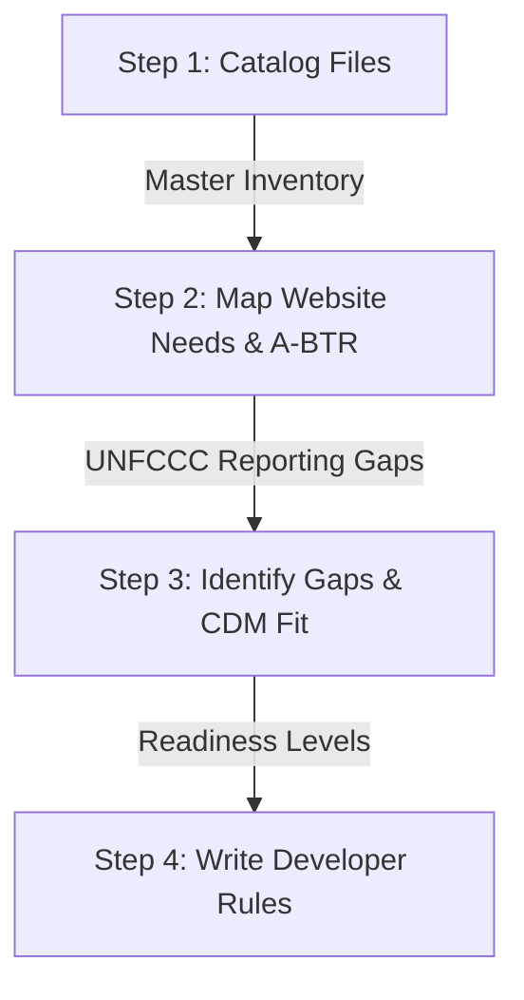

# Content Gap Analysis Plan (A-BTR Aligned)
**Date**: 2026-07-09
**Status**: APPROVED BASELINE

This plan outlines how DCCE will evaluate its current information baseline to ensure the proposed Climate Adaptation Platform supports both the **UNFCCC A-BTR reporting mandates** and the **Conceptual Data Model (CDM)** use cases.

---

## 1. The Workflow

### Step 1: Catalog Existing Documents & Files (Create the List)
*   **Action**: Compile a master inventory of all DCCE and partner datasets, publications, and reports (such as the 391 items in `DCCE_Unified_Digital_Asset_Database.csv`).
*   **Outputs**: A clean spreadsheet classifying assets by `asset_type` (Data Asset, Knowledge Asset, Data Product) and `format_type` (Dataset, Document, Web App).

### Step 2: Define Website Structure & A-BTR Requirements (The Target Map)
*   **Action**: Detail the target sitemap structure in `NCAIF_Detailed_Sitemap_v6.md` to explicitly map landing zones for UNFCCC A-BTR mandates:
    1.  *Institutional Arrangements & Coordination*: Institutional oversight and legal baselines (e.g., Climate Change Bill).
    2.  *Adaptation Actions Progress*: Sectoral projects labeled with simple status trackers (`yet to start`, `under implementation`, `completed`, `delayed`, `cancelled`).
    3.  *Support Needed & Received*: Comparative grids tracking requested vs. allocated international/domestic funding.
    4.  *Loss & Damage*: Clear sections tracking sudden-onset events (storms/floods) and slow-onset processes (salinity/subsidence), including non-economic losses.
    5.  *Social Safeguards*: Explicit tags for gender-disaggregated data and local wisdom.

### Step 3: Identify Gaps & CDM Compatibility (Compare List to Target)
*   **Action**: Cross-reference the cataloged files against the A-BTR target structure. Audit each sector to verify if the raw data can populate the Conceptual Data Model (CDM) entities:
    *   *Readiness Audit*: Can our current spreadsheets and reports map directly into database entities like `AdaptationAction`, `ActionStatus`, `AdaptationIndicator`, and `SupportNeededReceived`?
    *   *Outcome Gap Identification*: Is DCCE's data purely qualitative (describing plans/policies) or does it contain quantitative measurements (output and outcome metrics) needed to write the A-BTR?

### Step 4: Write Developer Rules (Drafting the Contract)
*   **Action**: Use the diagnosed gaps to write strict rules in the contractor Terms of Reference (TOR):
    *   *Database Requirements*: Mandate that the platform database must support the A-BTR CDM entities (e.g., tracking action status history and gender-disaggregated indicators).
    *   *Interface & API Rules*: Mandate automated data harvesting for missing variables, and simple CMS forms for updating project implementation statuses.
