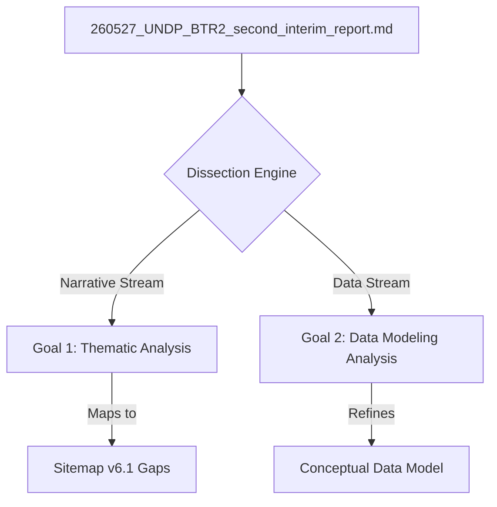

# A-BTR Dissection & Mapping Methodology Plan
**Date**: 2026-07-09
**Source Document**: `ψ/incubate/UNDP/BTR/inbox/260527_UNDP_BTR2_second_interim_report.md`
**Status**: PROPOSED BASELINE

This plan details the methodology to dissect the draft BTR report (`260527_UNDP_BTR2_second_interim_report.md`) to establish:
1. What **MUST** be reported (UNFCCC ETF/MPG mandates)
2. What **SHOULD** be reported (standard MPG best practices)
3. What **COULD** be reported (ambitious, developed-country standard)

---

## 1. Dissection Architecture (Data vs. Narrative)

### Stream A: Data Extraction (For CDM Refinement)
*   **Target Elements**: Grids, tables, quantitative indicators, climate projections, spatial variables, financial allocations, and historical disaster statistics.
*   **Goal**: Define database schema extensions (entities, attributes, relationships) in the Conceptual Data Model (CDM) to store and query this structured data.
*   **Grounding Source Examples**:
    *   *Table 1-1 (Climate platforms)* $\rightarrow$ Maps to `Platform` and `Dataset` entities.
    *   *Section 1.2.2 climate trend numbers* $\rightarrow$ Maps to `ClimateExtremeIndex` and `TmeanRecord` structures.

### Stream B: Narrative Curation (For Sitemap Gap Analysis)
*   **Target Elements**: Policy summaries, institutional coordination systems, legislative summaries, local case studies, and qualitative barrier descriptions.
*   **Goal**: Map these blocks to specific sitemap nodes in `NCAIF_Detailed_Sitemap_v6.md` and define the content templates required for the CMS.
*   **Grounding Source Examples**:
    *   *Subsection 1.1.2 (Gender Equality Act 2015)* $\rightarrow$ Maps to Sitemap Section 3.4.1 (Social Inclusion Data).
    *   *Subsection 1.1.2 (Ban Lim Thong water management)* $\rightarrow$ Maps to Sitemap Section 5.2 (Success Stories).

---

## 2. Execution Steps

1.  **Step 1: Systematic Parsing**: Extract key paragraphs, lists, and tables from `260527_UNDP_BTR2_second_interim_report.md`.
2.  **Step 2: Thematic Mapping (Sitemap Audit)**: Match each parsed block to its target sitemap node, highlighting:
    *   *Orphan Content*: BTR narratives that have no placeholders in the current sitemap.
    *   *Empty Sitemap Nodes*: Sitemap pages that currently have no corresponding text in the BTR draft.
3.  **Step 3: Schema Mapping (CDM Refinement)**: Identify all variables and tabular grids in the BTR, and map them to their corresponding entities/attributes in the Conceptual Data Model (CDM). Highlight any data fields in the report that are currently unsupported by the model.
4.  **Step 4: Output Compilation**: Compile the findings into a structured "Dissection Ledger" for DCCE's review.
