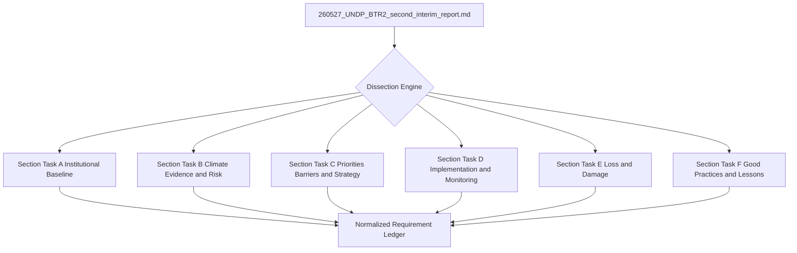

# A-BTR Dissection & Mapping Methodology Plan
**Date**: 2026-07-09
**Source Document**: `ψ/incubate/UNDP/BTR/inbox/260527_UNDP_BTR2_second_interim_report.md`
**Status**: PROPOSED BASELINE

This plan details the methodology to dissect the draft BTR report (`260527_UNDP_BTR2_second_interim_report.md`) to establish:
1. What **MUST** be reported (UNFCCC ETF/MPG mandates)
2. What **SHOULD** be reported (standard MPG best practices)
3. What **COULD** be reported (ambitious, developed-country standard)

---

## 1. Dissection Architecture

### Core focus
*   **Task scope**: This plan is limited to **A-BTR source dissection only**.
*   **Target elements**: headings, paragraphs, lists, tables, indicators, institutional descriptions, progress descriptions, loss-and-damage passages, case studies, and lessons learned inside the BTR draft.
*   **Goal**: extract and normalize what the BTR draft says must be reported, should be reported, and could be reported, with explicit source anchors.
*   **Primary output**: a normalized A-BTR requirement ledger built from section-cluster extraction passes.

---

## 2. Execution Steps

1.  **Step 1: Systematic Parsing**: Extract key paragraphs, lists, and tables from `260527_UNDP_BTR2_second_interim_report.md`.
2.  **Step 2: Section-Cluster Dissection**: Split the BTR draft into bounded analyst subtasks so that each cluster is read and extracted independently.
3.  **Step 3: Requirement Classification**: For each extracted item, assign `MUST`, `SHOULD`, or `COULD` and preserve the exact source anchor.
4.  **Step 4: Output Compilation**: Merge all cluster outputs into a structured "Dissection Ledger" for DCCE's review.

---

## 3. Orchestrator task-allocation structure

### 3.1 Output location
All execution artifacts for this run must be staged under:

`ψ/incubate/DCCE/CRDB/output/A-BTR_requirement_analysis/`

### 3.2 Section-task list

Each section task is a first-class task of equal importance. The orchestrator must treat them as parallel extraction tasks, not as minor outputs nested under a larger analysis block.

#### Section Task A — Institutional baseline
- **Mode**: analyst
- **Source scope**: [`1.1.1`](ψ/incubate/UNDP/BTR/inbox/260527_UNDP_BTR2_second_interim_report.md:28) to [`1.1.2`](ψ/incubate/UNDP/BTR/inbox/260527_UNDP_BTR2_second_interim_report.md:52)
- **Output**: [`section_A_institutional_baseline.md`](ψ/incubate/DCCE/CRDB/output/A-BTR_requirement_analysis/section_A_institutional_baseline.md:1)

#### Section Task B — Climate evidence and risk
- **Mode**: analyst
- **Source scope**: [`1.2.1`](ψ/incubate/UNDP/BTR/inbox/260527_UNDP_BTR2_second_interim_report.md:154) to [`1.2.3`](ψ/incubate/UNDP/BTR/inbox/260527_UNDP_BTR2_second_interim_report.md:384)
- **Output**: [`section_B_climate_evidence_and_risk.md`](ψ/incubate/DCCE/CRDB/output/A-BTR_requirement_analysis/section_B_climate_evidence_and_risk.md:1)

#### Section Task C — Priorities barriers and strategy
- **Mode**: analyst
- **Source scope**: [`1.3.1`](ψ/incubate/UNDP/BTR/inbox/260527_UNDP_BTR2_second_interim_report.md:438) to [`1.3.2`](ψ/incubate/UNDP/BTR/inbox/260527_UNDP_BTR2_second_interim_report.md:448) plus [`1.4`](ψ/incubate/UNDP/BTR/inbox/260527_UNDP_BTR2_second_interim_report.md:474)
- **Output**: [`section_C_priorities_barriers_and_strategy.md`](ψ/incubate/DCCE/CRDB/output/A-BTR_requirement_analysis/section_C_priorities_barriers_and_strategy.md:1)

#### Section Task D — Implementation and monitoring
- **Mode**: analyst
- **Source scope**: [`1.5`](ψ/incubate/UNDP/BTR/inbox/260527_UNDP_BTR2_second_interim_report.md:506) and [`1.6`](ψ/incubate/UNDP/BTR/inbox/260527_UNDP_BTR2_second_interim_report.md:666)
- **Output**: [`section_D_implementation_and_monitoring.md`](ψ/incubate/DCCE/CRDB/output/A-BTR_requirement_analysis/section_D_implementation_and_monitoring.md:1)

#### Section Task E — Loss and damage
- **Mode**: analyst
- **Source scope**: [`1.7.1`](ψ/incubate/UNDP/BTR/inbox/260527_UNDP_BTR2_second_interim_report.md:725) to [`1.7.3`](ψ/incubate/UNDP/BTR/inbox/260527_UNDP_BTR2_second_interim_report.md:809)
- **Output**: [`section_E_loss_and_damage.md`](ψ/incubate/DCCE/CRDB/output/A-BTR_requirement_analysis/section_E_loss_and_damage.md:1)

#### Section Task F — Good practices and lessons
- **Mode**: analyst
- **Source scope**: [`1.8.1`](ψ/incubate/UNDP/BTR/inbox/260527_UNDP_BTR2_second_interim_report.md:895) to [`1.8.6`](ψ/incubate/UNDP/BTR/inbox/260527_UNDP_BTR2_second_interim_report.md:985)
- **Output**: [`section_F_good_practices_and_lessons.md`](ψ/incubate/DCCE/CRDB/output/A-BTR_requirement_analysis/section_F_good_practices_and_lessons.md:1)

### 3.4 Orchestrator allocation design

The orchestrator does **not** analyze the BTR content itself. Its job is to allocate, sequence, and normalize the analyst subtasks.

#### Orchestrator responsibilities
1. Create one `analyst` task for each section task.
2. Pass the exact source scope and output filename for that section task only.
3. Enforce a common extraction schema across all section outputs.
4. Review returned section ledgers for consistency of labels and anchor style.
5. Re-dispatch only the affected section task if formatting or classification drifts.

#### Analyst task allocation map

| Section task | Source scope in [`260527_UNDP_BTR2_second_interim_report.md`](ψ/incubate/UNDP/BTR/inbox/260527_UNDP_BTR2_second_interim_report.md:1) | Output file | Assigned mode |
|---|---|---|---|
| Section Task A | [`1.1.1`](ψ/incubate/UNDP/BTR/inbox/260527_UNDP_BTR2_second_interim_report.md:28) to [`1.1.2`](ψ/incubate/UNDP/BTR/inbox/260527_UNDP_BTR2_second_interim_report.md:52) | [`section_A_institutional_baseline.md`](ψ/incubate/DCCE/CRDB/output/A-BTR_requirement_analysis/section_A_institutional_baseline.md:1) | `analyst` |
| Section Task B | [`1.2.1`](ψ/incubate/UNDP/BTR/inbox/260527_UNDP_BTR2_second_interim_report.md:154) to [`1.2.3`](ψ/incubate/UNDP/BTR/inbox/260527_UNDP_BTR2_second_interim_report.md:384) | [`section_B_climate_evidence_and_risk.md`](ψ/incubate/DCCE/CRDB/output/A-BTR_requirement_analysis/section_B_climate_evidence_and_risk.md:1) | `analyst` |
| Section Task C | [`1.3.1`](ψ/incubate/UNDP/BTR/inbox/260527_UNDP_BTR2_second_interim_report.md:438) to [`1.3.2`](ψ/incubate/UNDP/BTR/inbox/260527_UNDP_BTR2_second_interim_report.md:448) plus [`1.4`](ψ/incubate/UNDP/BTR/inbox/260527_UNDP_BTR2_second_interim_report.md:474) | [`section_C_priorities_barriers_and_strategy.md`](ψ/incubate/DCCE/CRDB/output/A-BTR_requirement_analysis/section_C_priorities_barriers_and_strategy.md:1) | `analyst` |
| Section Task D | [`1.5`](ψ/incubate/UNDP/BTR/inbox/260527_UNDP_BTR2_second_interim_report.md:506) and [`1.6`](ψ/incubate/UNDP/BTR/inbox/260527_UNDP_BTR2_second_interim_report.md:666) | [`section_D_implementation_and_monitoring.md`](ψ/incubate/DCCE/CRDB/output/A-BTR_requirement_analysis/section_D_implementation_and_monitoring.md:1) | `analyst` |
| Section Task E | [`1.7.1`](ψ/incubate/UNDP/BTR/inbox/260527_UNDP_BTR2_second_interim_report.md:725) to [`1.7.3`](ψ/incubate/UNDP/BTR/inbox/260527_UNDP_BTR2_second_interim_report.md:809) | [`section_E_loss_and_damage.md`](ψ/incubate/DCCE/CRDB/output/A-BTR_requirement_analysis/section_E_loss_and_damage.md:1) | `analyst` |
| Section Task F | [`1.8.1`](ψ/incubate/UNDP/BTR/inbox/260527_UNDP_BTR2_second_interim_report.md:895) to [`1.8.6`](ψ/incubate/UNDP/BTR/inbox/260527_UNDP_BTR2_second_interim_report.md:985) | [`section_F_good_practices_and_lessons.md`](ψ/incubate/DCCE/CRDB/output/A-BTR_requirement_analysis/section_F_good_practices_and_lessons.md:1) | `analyst` |

#### Dispatch order
- **Wave 1**: `WP-1A`, `WP-1B`, `WP-1E`
- **Wave 2**: `WP-1C`, `WP-1D`, `WP-1F`

This sequence lets the orchestrator stabilize classification behavior early on highly different content types before dispatching the remaining section tasks.

#### Orchestrator acceptance check before closing a section task
The orchestrator should accept a section-task output only if:
1. all extracted rows have anchors
2. all rows follow the result-table structure defined in Section 4
3. no row contains downstream sitemap or CDM speculation
4. the analyst stayed inside the assigned source scope
5. `MUST` / `SHOULD` / `COULD` labels are present for every row

#### Re-dispatch rule
If a section-task output fails the acceptance check, the orchestrator reissues only that section task with a correction note. It must not broaden the scope or rewrite other section outputs.

### 3.5 Tooling rules
- Use `read_file()` for close reading of source documents.
- Use `search_files()` for locating section headers, repeated terms, and requirement anchors.
- Use `list_files()` only to confirm directory contents or locate new output files.
- Do not use mutating tools inside source-dissection subtasks.

### 3.6 Handoff and merge rules
- Each section task must preserve:
  - source anchor
  - requirement statement
  - MUST / SHOULD / COULD classification
  - evidence form
  - theme
  - subtopic
  - value type
  - brief interpretation note

- Cross-section harmonization is allowed only to keep labels and columns consistent.
- This plan does **not** require a separate final synthesis artifact.

### 3.7 Checkpoints
- **Checkpoint A**: after the first wave of section tasks is reviewed.
- **Checkpoint B**: after all section-task files exist and follow the same extraction structure.

### 3.8 Execution prompt template for analyst subtasks

The orchestrator must dispatch each section task with a **section-specific prompt**, not the generic stub alone.

#### Required prompt fields
Every dispatched analyst prompt must explicitly include:
- the assigned `Section Task` name
- the exact source scope inside [`260527_UNDP_BTR2_second_interim_report.md`](ψ/incubate/UNDP/BTR/inbox/260527_UNDP_BTR2_second_interim_report.md:1)
- the exact output file path under [`ψ/incubate/DCCE/CRDB/output/A-BTR_requirement_analysis/`](ψ/incubate/DCCE/CRDB/output/A-BTR_requirement_analysis/:1)
- the exact row schema from [`Section 4.3`](plans/2026-07-09-a-btr-dissection-methodology-plan.md:287)
- the scope boundary from [`Section 3.9`](plans/2026-07-09-a-btr-dissection-methodology-plan.md:171)
- the native-tool-only file creation rule

#### Dispatch-ready template

> **Assigned task**: `[SECTION TASK NAME]`
>
> Read only the assigned source scope in [`260527_UNDP_BTR2_second_interim_report.md`](ψ/incubate/UNDP/BTR/inbox/260527_UNDP_BTR2_second_interim_report.md:1): `[START ANCHOR]` to `[END ANCHOR]`.
>
> Write the result only to: `[OUTPUT FILE]`.
>
> Extract atomic A-BTR requirement rows and structure every row using the result-table schema defined in [`Section 4.3`](plans/2026-07-09-a-btr-dissection-methodology-plan.md:287):
> - `req_id`
> - `section_label`
> - `theme`
> - `subtopic`
> - `requirement_statement`
> - `classification`
> - `evidence_form`
> - `value_type`
> - `source_anchor`
> - `notes`
>
> Classification rule:
> - assign `MUST`, `SHOULD`, or `COULD` for every row
> - if classification is ambiguous, keep your best judgment and explain the ambiguity briefly in `notes`
>
> Evidence rule:
> - use `evidence_form` for how the evidence appears: `paragraph`, `list`, `table`, `figure`, or `mixed`
> - use `value_type` for the nature of the content: `numeric`, `narrative`, `institutional`, `categorical`, or `mixed`
>
> Scope rule:
> - stay strictly inside the assigned source scope
> - do **not** expand into sitemap mapping, CDM refinement, implementation implications, or final synthesis
>
> File-creation rule:
> - do **not** use script or command-line to create and edit
> - use native file tools only

#### Section-specific dispatch values

| Section Task | Start anchor | End anchor | Output file |
|---|---|---|---|
| `Section Task A — Institutional baseline` | [`1.1.1`](ψ/incubate/UNDP/BTR/inbox/260527_UNDP_BTR2_second_interim_report.md:28) | [`1.1.2`](ψ/incubate/UNDP/BTR/inbox/260527_UNDP_BTR2_second_interim_report.md:52) | [`section_A_institutional_baseline.md`](ψ/incubate/DCCE/CRDB/output/A-BTR_requirement_analysis/section_A_institutional_baseline.md:1) |
| `Section Task B — Climate evidence and risk` | [`1.2.1`](ψ/incubate/UNDP/BTR/inbox/260527_UNDP_BTR2_second_interim_report.md:154) | [`1.2.3`](ψ/incubate/UNDP/BTR/inbox/260527_UNDP_BTR2_second_interim_report.md:384) | [`section_B_climate_evidence_and_risk.md`](ψ/incubate/DCCE/CRDB/output/A-BTR_requirement_analysis/section_B_climate_evidence_and_risk.md:1) |
| `Section Task C — Priorities barriers and strategy` | [`1.3.1`](ψ/incubate/UNDP/BTR/inbox/260527_UNDP_BTR2_second_interim_report.md:438) | [`1.4`](ψ/incubate/UNDP/BTR/inbox/260527_UNDP_BTR2_second_interim_report.md:474) | [`section_C_priorities_barriers_and_strategy.md`](ψ/incubate/DCCE/CRDB/output/A-BTR_requirement_analysis/section_C_priorities_barriers_and_strategy.md:1) |
| `Section Task D — Implementation and monitoring` | [`1.5`](ψ/incubate/UNDP/BTR/inbox/260527_UNDP_BTR2_second_interim_report.md:506) | [`1.6`](ψ/incubate/UNDP/BTR/inbox/260527_UNDP_BTR2_second_interim_report.md:666) | [`section_D_implementation_and_monitoring.md`](ψ/incubate/DCCE/CRDB/output/A-BTR_requirement_analysis/section_D_implementation_and_monitoring.md:1) |
| `Section Task E — Loss and damage` | [`1.7.1`](ψ/incubate/UNDP/BTR/inbox/260527_UNDP_BTR2_second_interim_report.md:725) | [`1.7.3`](ψ/incubate/UNDP/BTR/inbox/260527_UNDP_BTR2_second_interim_report.md:809) | [`section_E_loss_and_damage.md`](ψ/incubate/DCCE/CRDB/output/A-BTR_requirement_analysis/section_E_loss_and_damage.md:1) |
| `Section Task F — Good practices and lessons` | [`1.8.1`](ψ/incubate/UNDP/BTR/inbox/260527_UNDP_BTR2_second_interim_report.md:895) | [`1.8.6`](ψ/incubate/UNDP/BTR/inbox/260527_UNDP_BTR2_second_interim_report.md:985) | [`section_F_good_practices_and_lessons.md`](ψ/incubate/DCCE/CRDB/output/A-BTR_requirement_analysis/section_F_good_practices_and_lessons.md:1) |

### 3.9 Scope boundary
- This plan covers **A-BTR source dissection only**.
- It does **not** include sitemap mapping, CDM refinement, implementation rules, or broader CRDB platform implications.
- It does **not** require a master synthesis artifact.
- Any later downstream use of the section ledgers must be planned in a separate file.

---

## 4. Relational table design for structuring A-BTR dissection outputs

This relational design is the **result structure** of this task. It is not a downstream CRDB platform schema. It is the relational form used to organize what is extracted from the single A-BTR draft.

The design separates:
- report structure,
- thematic structure,
- extracted evidence units,
- requirement statements,
- quantitative values,
- and extraction provenance.

### 4.1 Design principles
- This task works on **one** source document only: [`260527_UNDP_BTR2_second_interim_report.md`](ψ/incubate/UNDP/BTR/inbox/260527_UNDP_BTR2_second_interim_report.md:1).
- That source contains many sections and subsections.
- One section can contain many evidence units.
- One evidence unit can support one or more extracted requirements.
- One requirement can be supported by one or more evidence units.
- Quantitative values must be stored separately from narrative text so they can be queried consistently.
- Themes and subtopics are structural columns, not hidden inside a vague evidence label.

### 4.2 Core relational tables

#### Table: `report_section`
Stores the report sections/subsections that are dissected and written out by each section task.

| column               | type | purpose                      |
| -------------------- | ---- | ---------------------------- |
| `report_section_id`  | PK   | unique report-section id |
| `section_task_code`  | text | `A`, `B`, `C`, `D`, `E`, `F` |
| `section_label`      | text | e.g. `1.2.2` |
| `section_title`      | text | human-readable section title |
| `anchor_start`       | text | starting anchor |
| `anchor_end`         | text | ending anchor |
| `output_file`        | text | section result file |

#### Table: `theme`
Stores broad thematic categories present in the A-BTR.

| column | type | purpose |
|---|---|---|
| `theme_id` | PK | unique theme id |
| `theme_name` | text | e.g. `climate_hazards` |
| `description` | text | theme definition |

#### Table: `subtopic`
Stores narrower analytic subtopics nested under a theme.

| column | type | purpose |
|---|---|---|
| `subtopic_id` | PK | unique subtopic id |
| `theme_id` | FK | parent theme |
| `subtopic_name` | text | e.g. `hot_days`, `extreme_rainfall_threshold` |
| `description` | text | subtopic definition |

#### Table: `evidence_unit`
Stores the smallest extractable evidence-bearing unit from the report.

| column | type | purpose |
|---|---|---|
| `evidence_unit_id` | PK | unique evidence unit id |
| `report_section_id` | FK | parent report section |
| `theme_id` | FK | broad thematic bucket |
| `subtopic_id` | FK | specific issue inside the theme |
| `evidence_form` | text | `paragraph`, `list`, `table`, `figure`, `mixed` |
| `value_type` | text | `numeric`, `narrative`, `institutional`, `categorical`, `mixed` |
| `source_anchor` | text | exact source anchor |
| `excerpt_text` | text | extracted excerpt |
| `analyst_note` | text | brief interpretation note |

#### Table: `requirement_statement`
Stores normalized MUST / SHOULD / COULD statements.

| column | type | purpose |
|---|---|---|
| `requirement_id` | PK | unique requirement id |
| `report_section_id` | FK | originating report section |
| `req_code` | text | local requirement code |
| `requirement_statement` | text | normalized extracted requirement |
| `classification` | text | `MUST`, `SHOULD`, `COULD` |
| `notes` | text | clarification or ambiguity note |

#### Table: `requirement_evidence_link`
Join table linking requirements to their supporting evidence units.

| column | type | purpose |
|---|---|---|
| `requirement_evidence_link_id` | PK | unique link id |
| `requirement_id` | FK | linked requirement |
| `evidence_unit_id` | FK | supporting evidence unit |
| `support_role` | text | `primary`, `secondary`, `contextual` |

#### Table: `quantitative_value`
Stores structured numeric values extracted from evidence units.

| column | type | purpose |
|---|---|---|
| `quantitative_value_id` | PK | unique value id |
| `evidence_unit_id` | FK | parent evidence unit |
| `metric_name` | text | e.g. `hot_days`, `days_precip_gt_150mm` |
| `value_numeric` | decimal | numeric value |
| `unit` | text | e.g. `days/year`, `%`, `mm/day` |
| `comparison_operator` | text | e.g. `>`, `>=`, `change_in` |
| `time_period` | text | referenced period |
| `geography` | text | referenced geography |
| `scenario_label` | text | future scenario / baseline label if present |
| `notes` | text | extraction caveats |

#### Table: `extraction_run`
Stores provenance for each section-result generation pass.

| column | type | purpose |
|---|---|---|
| `extraction_run_id` | PK | unique extraction run id |
| `report_section_id` | FK | executed report section |
| `mode_used` | text | should be `analyst` |
| `run_timestamp` | text | execution timestamp |
| `output_file` | text | produced file |
| `status` | text | `draft`, `accepted`, `re-dispatch` |
| `review_note` | text | orchestrator review note |

### 4.3 Result-table schema used by every section output

Each section result file should be renderable from the following row structure:

| column | purpose |
|---|---|
| `req_id` | local requirement id |
| `section_label` | source section reference |
| `theme` | broad theme |
| `subtopic` | specific issue inside the theme |
| `requirement_statement` | extracted atomic requirement |
| `classification` | `MUST` / `SHOULD` / `COULD` |
| `evidence_form` | paragraph / list / table / figure / mixed |
| `value_type` | numeric / narrative / institutional / categorical / mixed |
| `source_anchor` | exact source anchor |
| `notes` | brief interpretation note |

### 4.4 Relationship summary
- `report_section` 1→many `evidence_unit`
- `report_section` 1→many `requirement_statement`
- `theme` 1→many `subtopic`
- `theme` 1→many `evidence_unit`
- `subtopic` 1→many `evidence_unit`
- `requirement_statement` many↔many `evidence_unit` through `requirement_evidence_link`
- `evidence_unit` 1→many `quantitative_value`
- `report_section` 1→many `extraction_run`

### 4.5 Why this design fits the objective
- **Thematic analysis layer** is carried by `theme`, `subtopic`, `evidence_unit`, and `requirement_statement`.
- **Data-pipeline analysis layer** is carried by `evidence_unit` plus `quantitative_value`, which turns report evidence into table-like records.
- The design keeps the A-BTR dissection task bounded to the report itself and does not drift into downstream platform implementation.
