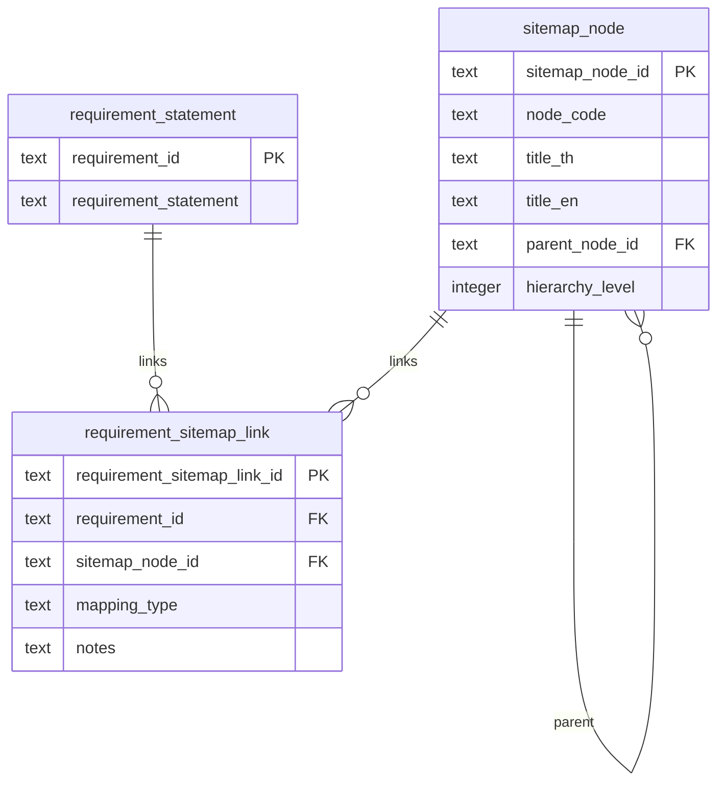

# A-BTR Themes & Topics to NCAIF Sitemap Mapping Plan
**Date**: 2026-07-09  
**Status**: PROPOSED BASELINE  
**Cross-References**: 
- [`plans/2026-07-09-a-btr-aligned-content-gap-analysis-plan.md`](file:///C:/Users/sitth/OracleWorkspace/Arun_Creagy/plans/2026-07-09-a-btr-aligned-content-gap-analysis-plan.md)
- [`ψ/incubate/DCCE/CRDB/output/01_Sitemap_InterfaceMapping/NCAIF_Detailed_Sitemap_v6.md`](file:///C:/Users/sitth/OracleWorkspace/Arun_Creagy/ψ/incubate/DCCE/CRDB/output/01_Sitemap_InterfaceMapping/NCAIF_Detailed_Sitemap_v6.md)
- [`ψ/incubate/DCCE/CRDB/output/A-BTR_requirement_analysis/a_btr_dissection.db`](file:///C:/Users/sitth/OracleWorkspace/Arun_Creagy/ψ/incubate/DCCE/CRDB/output/A-BTR_requirement_analysis/a_btr_dissection.db)

---

## 1. Introduction & Objectives

This plan details the methodology to execute **Step 2 (Map Website Needs & A-BTR)** of the Content Gap Analysis. It establishes the mapping of 379 dissected requirements (Section Tasks A–F) and their themes/subtopics to the technical landing zones defined in the National Climate Adaptation Portal sitemap ([`NCAIF_Detailed_Sitemap_v6.md`](file:///C:/Users/sitth/OracleWorkspace/Arun_Creagy/ψ/incubate/DCCE/CRDB/output/01_Sitemap_InterfaceMapping/NCAIF_Detailed_Sitemap_v6.md)).

The core objectives are:
1. **Reporting Integrity**: Ensure every mandatory UNFCCC A-BTR reporting requirement (labeled `MUST`) has an explicit, designated landing zone on the public portal.
2. **Thematic Alignment**: Map the 133 distinct themes and 379 subtopics to the sitemap menu hierarchy.
3. **Auditability**: Maintain clear database-level linkages showing which BTR requirement matches which portal section to support verification.

---

## 2. Relational Mapping Schema Extension

To track sitemap mappings within the [`a_btr_dissection.db`](file:///C:/Users/sitth/OracleWorkspace/Arun_Creagy/ψ/incubate/DCCE/CRDB/output/A-BTR_requirement_analysis/a_btr_dissection.db) database, we will extend the schema with two additional tables.

### Table Details:
- **`sitemap_node`**: Repositories for the sitemap sections extracted from the markdown.
- **`requirement_sitemap_link`**: Connects requirement statements to the portal sections.
  - `mapping_type`: Classifies the relationship as `primary` (direct landing zone) or `secondary` (related context).

---

## 3. Thematic Mapping Matrix (High-Level Framework)

The mapping framework assigns the six section-task categories of BTR requirements to their corresponding parent nodes in the NCAIF Sitemap:

| A-BTR Dissection Section | Key Themes & Topics | Sitemap Landing Zone (Parent Node) | Specific Sitemap Section |
|---|---|---|---|
| **Section A — Institutional Baseline** | National circumstances, policy frameworks, legal coverage, interagency coordination | **2. ศูนย์ข้อมูลสำหรับผู้กำหนดนโยบาย** *(Policy Hub)* | `2.3 เครื่องมือทางนโยบาย กฎหมาย และการเงิน` `1.1.2 ความเสี่ยงสำคัญ และลำดับความสำคัญ` |
| **Section B — Climate Evidence and Risk** | Observed temperature/precipitation, climate scenarios, hazard trends, regional risk profiles | **3. วงจรขับเคลื่อนการปรับตัว** *(Knowledge Cycle)* | `3.1 วิทยาศาสตร์ของสภาพภูมิอากาศ` `3.2 การวิเคราะห์ผลกระทบ ความเสี่ยง` `4. ข้อมูลรายพื้นที่และรายสาขา` |
| **Section C — Priorities, Barriers & Strategy** | Sectoral priorities, implementation barriers, national adaptation roadmap, strategy integration | **2. ศูนย์ข้อมูลสำหรับผู้กำหนดนโยบาย** & **3. วงจร** | `2.3 เครื่องมือทางนโยบาย` `3.3 การวางแผนการปรับตัวและการปฏิบัติ` |
| **Section D — Implementation & Monitoring** | Sector project progress, monitoring frameworks, funding flows, output indicators | **3. วงจรขับเคลื่อนการปรับตัว** *(Knowledge Cycle)* | `3.3.5 โครงการที่กำลังดำเนินการ` `3.4 การติดตาม ประเมินผล และถอดบทเรียน` |
| **Section E — Loss and Damage** | Disaster statistics, hazard coverage, averting/minimizing mechanisms, emergency finance | **3. วงจรขับเคลื่อนการปรับตัว** *(Knowledge Cycle)* | `3.2.4 ความสูญเสียและความเสียหาย` `2.1 สถานการณ์การเปลี่ยนแปลงสภาพภูมิอากาศ` |
| **Section F — Good Practices and Lessons** | Knowledge sharing, stakeholder partnerships, pilot success stories, capacity building | **5. คลังมาตรการและกรณีศึกษา** & **3. วงจร** | `5.2 กรณีศึกษาและโครงการที่ประสบความสำเร็จ` `3.4.3 กรณีศึกษาโครงการที่ประสบความสำเร็จ` |

---

## 4. Detailed Mapping Strategy by Sitemap Area

### 4.1 Home (หน้าแรก) & Policy Hub (ศูนย์ข้อมูลนโยบาย)
*   **A-BTR Inputs**: Section A (Institutional framework, Legal acts) & Section C (Adaptation priorities).
*   **Implementation Rules**:
    *   Map `A-REQ-023` to `A-REQ-037` (Draft Climate Change Act, Disaster Acts) directly to sitemap node `2.3` to populate summary sheets.
    *   Map national capacity variables directly to summary cards displayed in sitemap node `1.1.1` and `1.1.2`.

### 4.2 Climate Science (วิทยาศาสตร์ภูมิอากาศ - 3.1)
*   **A-BTR Inputs**: Section B (observed temperature/rainfall trends, future CMIP6 projections).
*   **Implementation Rules**:
    *   Map observed anomalies (`B-007`, `B-018`) to sitemap node `3.1.1 ข้อมูลสังเกตุการณ์`.
    *   Map RegCM / CMIP6 modeling configurations (`B-009`, `B-061`) directly to sitemap node `3.1.2 ปัจจัยขับเคลื่อนทางภูมิอากาศ` and `3.1.3 ฉากทัศน์ภูมิอากาศในอนาคต`.

### 4.3 Risk & Vulnerability Analysis (การวิเคราะห์ความเสี่ยง - 3.2)
*   **A-BTR Inputs**: Section B (Hazard projections: Tmax, heatwaves, drought indices, coastal flood maps) & Section E (Observed disaster statistics).
*   **Implementation Rules**:
    *   Map regional/provincial hazard indices directly to sitemap node `2.2` and `4. ข้อมูลรายพื้นที่`.
    *   Map compound risk drivers (`B-040`, `B-078`) to sitemap node `3.2.3 ผลกระทบลูกโซ่` to feed into interactive impact chains.
    *   Map observed disaster damage statistics (e.g. Table 1-2, `B-091`) directly to sitemap node `3.2.4 ความสูญเสียและความเสียหาย` to populate the public Loss & Damage Dashboard.

### 4.4 Planning & Implementation (การวางแผนและปฏิบัติ - 3.3)
*   **A-BTR Inputs**: Section C (roadmaps, barriers) & Section D (quantified project tracking).
*   **Implementation Rules**:
    *   Map sector-specific implementation projects (`D-042` crop insurance, Agri-Map, tourism counts) to sitemap node `3.3.5 โครงการที่กำลังดำเนินการ`.
    *   Map funding requests and allocations (Section D and Section E) to sitemap node `2.3` and `3.3.1` (financial analysis).

### 4.5 M&E and Learning (การติดตามและถอดบทเรียน - 3.4 & 5)
*   **A-BTR Inputs**: Section D (M&E system) & Section F (Lessons learned, good practices).
*   **Implementation Rules**:
    *   Map national progress trackers and indicators to sitemap node `3.4.2 ระบบฐานข้อมูลด้านการติดตาม`.
    *   Map case studies and capacity building initiatives (`F-001` to `F-040`) to sitemap node `5.2 กรณีศึกษาและโครงการที่ประสบความสำเร็จ` and `3.4.3`.

---

## 5. Execution Steps & Deliverables

To implement this plan, the following steps will be executed:

1.  **Step 2.1: Sitemap Node Cataloging**: 
    Create a script to parse [`NCAIF_Detailed_Sitemap_v6.md`](file:///C:/Users/sitth/OracleWorkspace/Arun_Creagy/ψ/incubate/DCCE/CRDB/output/01_Sitemap_InterfaceMapping/NCAIF_Detailed_Sitemap_v6.md), generate unique IDs for every node (e.g. `SIT-1.1.1`, `SIT-2.3`), and insert them into the `sitemap_node` table in `a_btr_dissection.db`.
2.  **Step 2.2: Mapping Execution**:
    Run a Python mapping script that maps requirements to sitemap nodes based on matching keys (such as `theme`, `subtopic`, and section context).
3.  **Step 2.3: Verification Querying**:
    Develop diagnostic queries to flag:
    - Any `MUST` requirement that is unmapped (orphaned).
    - Any sitemap landing zone that contains zero supporting BTR requirements (content gaps).
4.  **Step 2.4: Gap Analysis Documentation**:
    Export the results to a new markdown ledger [`a_btr_to_sitemap_gap_analysis.md`](file:///C:/Users/sitth/OracleWorkspace/Arun_Creagy/ψ/incubate/DCCE/CRDB/output/A-BTR_requirement_analysis/a_btr_to_sitemap_gap_analysis.md) outlining portal content readiness.

---

## 6. Checkpoints & Verification Rules

- **Coverage Gate**: 100% of BTR requirements classified as `MUST` must be mapped to at least one primary sitemap node.
- **Node Validation**: Mapped sitemap nodes must match valid headers present in the official sitemap baseline `NCAIF_Detailed_Sitemap_v6.md`.
