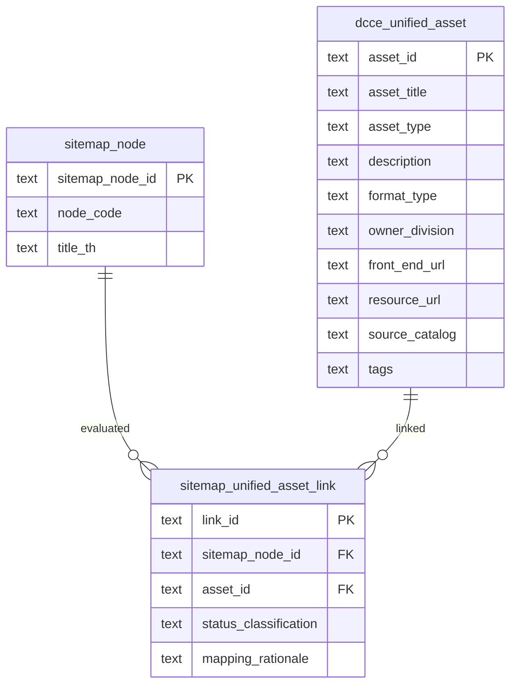

# DCCE Digital Assets Gap Analysis Plan (Unified Database Edition)
**Date**: 2026-07-09  
**Status**: PROPOSED BASELINE  
**Cross-References**:
- [`ψ/incubate/DCCE/CRDB/output/01_Sitemap_InterfaceMapping/NCAIF_Detailed_Sitemap_v7.md`](file:///C:/Users/sitth/OracleWorkspace/Arun_Creagy/ψ/incubate/DCCE/CRDB/output/01_Sitemap_InterfaceMapping/NCAIF_Detailed_Sitemap_v7.md)
- [`ψ/incubate/DCCE/CRDB/output/01_Sitemap_InterfaceMapping/DCCE_Unified_Digital_Asset_Database.csv`](file:///C:/Users/sitth/OracleWorkspace/Arun_Creagy/ψ/incubate/DCCE/CRDB/output/01_Sitemap_InterfaceMapping/DCCE_Unified_Digital_Asset_Database.csv)
- [`ψ/incubate/DCCE/CRDB/output/A-BTR_requirement_analysis/a_btr_dissection.db`](file:///C:/Users/sitth/OracleWorkspace/Arun_Creagy/ψ/incubate/DCCE/CRDB/output/A-BTR_requirement_analysis/a_btr_dissection.db)

---

## 1. Context & Objectives

This plan outlines the methodology to audit the content nodes and requirements of **Sitemap v7.0** against DCCE's actual digital holdings as cataloged in the newly established **[`DCCE_Unified_Digital_Asset_Database.csv`](file:///C:/Users/sitth/OracleWorkspace/Arun_Creagy/ψ/incubate/DCCE/CRDB/output/01_Sitemap_InterfaceMapping/DCCE_Unified_Digital_Asset_Database.csv)**.

The objective is to identify which sections of the National Portal can be immediately populated using existing systems, databases, publications, or videos from DCCE, and which represent true content or system gaps.

---

## 2. Relational Database Schema Extension

To perform the gap analysis programmatically and maintain an audit log, we will extend the database [`a_btr_dissection.db`](file:///C:/Users/sitth/OracleWorkspace/Arun_Creagy/ψ/incubate/DCCE/CRDB/output/A-BTR_requirement_analysis/a_btr_dissection.db) with the following relational structures:

### Gap Classifications (`status_classification`):
-   **`FULLY_SUPPORTED`**: An operational system, subdomain, or page exists that directly delivers this capability (e.g. `SYS-003` for Risk Area Map).
-   **`PARTIALLY_SUPPORTED`**: Relevant datasets (`DAT-xxx`), publications (`PUB-xxx`), or media assets (`MED-xxx`) exist but must be converted into user-facing web pages or integrated into databases.
-   **`GAP`**: No matching assets found in the DCCE holdings. Content or systems must be developed from scratch.

---

## 3. Audit Methodology & Keyword Rules

We will write a python script `audit_unified_assets.py` to parse the files and evaluate links:

1.  **Parsing & Seeding:**
    - Parse [`DCCE_Unified_Digital_Asset_Database.csv`](file:///C:/Users/sitth/OracleWorkspace/Arun_Creagy/ψ/incubate/DCCE/CRDB/output/01_Sitemap_InterfaceMapping/DCCE_Unified_Digital_Asset_Database.csv) and import its records into the `dcce_unified_asset` table.
2.  **Keyword Matching Engine:**
    Run matching query rules to connect sitemap nodes with assets:
    - **Climate Science / Data (3.1 & 4.1):** Match against `SYS-001` (CCIC), `SYS-002` (Catalog) and climate/grid datasets `DAT-001` to `DAT-033`.
    - **Risk / Hazards (3.2 & 2.2):** Match against `SYS-003` (Risk Map) and specific publications/infographics on coastal impacts, heat stroke, storm prep (`MED-125`, `MED-127` to `MED-137`).
    - **Planning & Policy (3.3 & 2.3):** Match against climate budget guides (`DAT-050`, `DAT-062`), and transition histories.
    - **L&D (3.2.4):** Match against disaster datasets.
    - **M&E (3.4):** Match against city/school sustainability monitors (`SYS-007`, `SYS-014`).
3.  **Gap Assessment Query:**
    Identify sitemap nodes that have zero matches, producing a target action list for content writers and designers.
4.  **Reporting:**
    Export findings to [`dcce_assets_content_gap_analysis.md`](file:///C:/Users/sitth/OracleWorkspace/Arun_Creagy/ψ/incubate/DCCE/CRDB/output/A-BTR_requirement_analysis/dcce_assets_content_gap_analysis.md) listing:
    - Mapped assets per sitemap node.
    - True digital asset gaps.
    - Immediate action items to seed the portal.

---

## 4. Deliverable Timeline & Next Steps

1.  **Review Plan:** Align on this plan (current step).
2.  **Run Execution Script:** Run `audit_unified_assets.py` to perform SQL integration and write the gap report.
3.  **Verify Gaps:** Inspect the generated markdown report to establish launch priorities.
