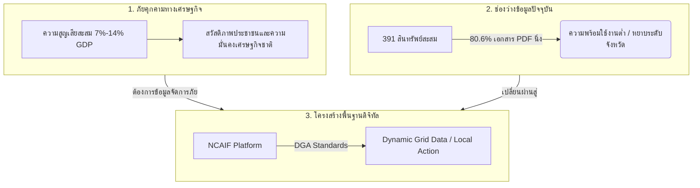
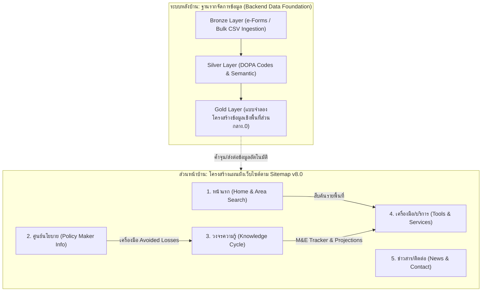
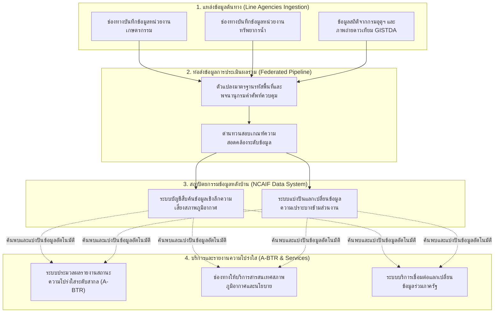
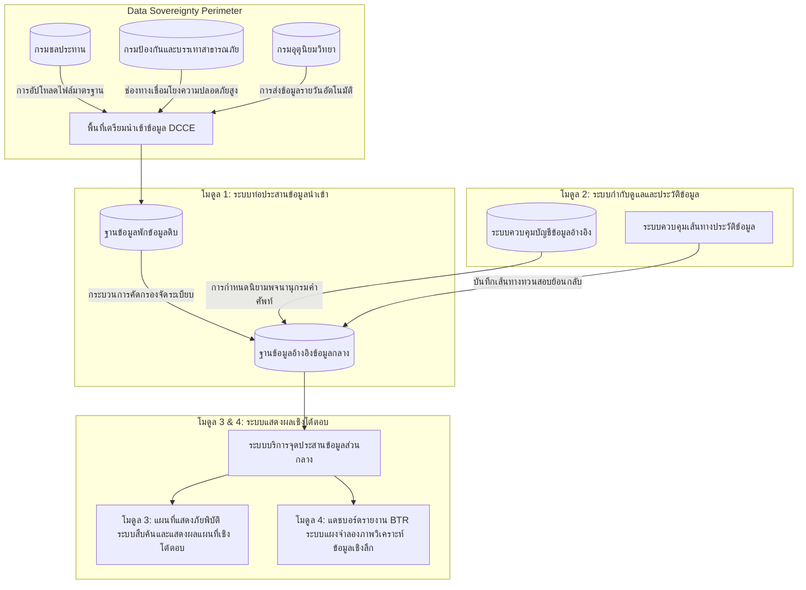

# แผนสไลด์: National Climate Adaptation Platform — Case for National Capability
**ฉบับย่อเพื่อป้องกันงบประมาณ (4 สไลด์ ความหนาแน่นสูง)**

---

## Slide 1: ข้อมูลสารสนเทศการปรับตัวเพื่อการบริหารจัดการความเสี่ยงภายใต้ความไม่แน่นอน (National Adaptation Platform under Uncertainty)

### 1. Slide Title / Header
* **ภาษาไทย:** ข้อมูลสารสนเทศการปรับตัวเพื่อการบริหารจัดการความเสี่ยงภายใต้ความไม่แน่นอน
* **English Sub-header:** Slide 1: National Adaptation Platform — Crucial to Country's Economy & People Wellbeing
* **Requested Decision:** ขออนุมัติกรอบวงเงินลงทุน 25 ล้านบาท (25M THB Investment Envelope) เพื่อจัดตั้งแพลตฟอร์มระบบข้อมูลอ้างอิงกลางระดับชาติ

### 2. Core Concept (Plain Language)
การบริหารจัดการความเสี่ยงภายใต้ความไม่แน่นอนสูงจากสภาพภูมิอากาศจำเป็นต้องอาศัยข้อมูลกลางระดับชาติเพื่อปกป้องชีวิตความเป็นอยู่ของประชาชนและเสถียรภาพเศรษฐกิจของประเทศ (เช่น ความเสี่ยงสูญเสีย 7%-14% GDP ภายในปี 2050) แต่ภูมิทัศน์ข้อมูลของประเทศในปัจจุบันยังมีข้อจำกัดเชิงระบบที่สำคัญ (391 สินทรัพย์สะสม แต่ 80.6% อยู่ในรูปเอกสาร PDF นิ่ง) การมีโครงสร้างพื้นฐานดิจิทัลด้านข้อมูลการปรับตัวระดับชาติ (Digital Infrastructure) ที่ได้มาตรฐานธรรมาภิบาลข้อมูลภาครัฐ สพร. (DGA) จึงเป็นหัวใจสำคัญในการวางแผนการปรับตัวเชิงรุกระดับตำบลอย่างแท้จริง

### 3. High-Density Bullet Points
* **ภัยคุกคามทางเศรษฐกิจและความอยู่ดีมีสุขของประชาชน (National Economy & Wellbeing Threat):** ประเทศไทยเผชิญความเสี่ยงความสูญเสียทางเศรษฐกิจสะสมสูงถึง 7% - 14% ของ GDP ภายในปี 2050 (World Bank CCDR) หากยังขาดข้อมูลประเมินภัยพิบัติและการวางแผนปรับตัวเชิงรุก ถือเป็นประเด็นสำคัญเร่งด่วนระดับชาติเพื่อปกป้องความมั่นคงทางเศรษฐกิจและชีวิตสวัสดิภาพของคนไทยทุกคน
* **ช่องว่างข้อมูลการปรับตัวที่มีอยู่ (Existing Data Gaps):** ข้อมูลที่มีอยู่สะสม 391 สินทรัพย์ดิจิทัล แต่ 80.6% มีรูปแบบเป็นเอกสารนิ่ง (PDF/Doc) ขาดระบบจัดเก็บตัวเลขประมวลผลเชิงวิเคราะห์ได้ และข้อมูลร้อยละ 70 มีความละเอียดหยาบระดับภูมิภาค (25-100 กม.) ไม่ละเอียดพอสำหรับการออกแบบมาตรการป้องกันภัยในชุมชนระดับตำบล
* **โครงสร้างพื้นฐานดิจิทัลหัวใจของการปรับตัว (Digital Infrastructure for Adaptation):** การประเมินความเสี่ยงล่วงหน้าเพื่อปกป้องประชาชนและระบบการลงทุนภาครัฐ จำเป็นต้องอาศัยโครงสร้างพื้นฐานข้อมูลระดับชาติที่เป็นฐานข้อมูลพลวัต เชื่อมโยงข้ามกระทรวง และมีกรอบธรรมาภิบาลข้อมูล สพร. (DGA) รองรับความโปร่งใส ปิดช่องว่างเว็บฝากเอกสารร้างในอดีต

### 4. Visual/Graphic Proposal
เลย์เอาต์สไลด์แบบ 3 คอลัมน์ที่ชัดเจน:
* **คอลัมน์ซ้าย (Threat):** ตัวเลขความสูญเสีย GDP (7%-14%) และสวัสดิภาพความเป็นอยู่ของประชาชนรวมถึงความมั่นคงทางเศรษฐกิจของประเทศ
* **คอลัมน์กลาง (Gaps):** แผนผังแสดง 391 ชุดข้อมูลที่ติดขัดในคลังไฟล์ PDF นิ่งและมีความหยาบเชิงพื้นที่
* **คอลัมน์ขวา (Infrastructure):** แบบจำลองโครงสร้างพื้นฐานดิจิทัลกลาง (NCAIF) ที่มีระบบแปลงรหัส DOPA Codes ป้อนเข้าสู่ฐานข้อมูลประมวลผลตำบลสนับสนุนภาครัฐดิจิทัล

### 5. Real-World Grounding Reference
* **World Bank Country Climate and Development Report (CCDR):** ประเทศไทยเสี่ยงต่อการสูญเสียทางเศรษฐกิจ 7%-14% ของ GDP ภายในปี 2050 หากไม่มีมาตรการบริหารความเสี่ยงภายใต้ความไม่แน่นอนเชิงรุก
* **Digital Infrastructure Readiness:** สถิติความล้มเหลวของแพลตฟอร์มข้อมูลแบบ Static Web Portals ตอกย้ำว่ามีเพียงระบบโครงสร้างพื้นฐานดิจิทัลเชิงพลวัต (Dynamic Digital Infrastructure) ที่มี Data Governance มั่นคงเท่านั้น จึงจะสามารถใช้สนับสนุนการวิเคราะห์ความคุ้มค่าโครงการระดับตำบลได้

### 6. Speaker Notes
* "ท่านคณะกรรมการครับ ประเทศไทยกำลังเผชิญภัยคุกคามทางเศรษฐกิจและความเสี่ยงต่อความเป็นอยู่ของพี่น้องประชาชนสูงมากจากสภาพภูมิอากาศ ธนาคารโลกประเมินความเสี่ยงความสูญเสียต่อ GDP สูงถึง 7% ถึง 14% ภายในปี 2050 หากเราขาดข้อมูลและการวางแผนปรับตัวเชิงรุกที่มีประสิทธิภาพ การปิดช่องว่างเรื่องระบบข้อมูลนี้จึงถือเป็นขีดความสามารถที่สำคัญระดับประเทศ (Critical National Capability) เพื่อปกป้องชีวิตประชาชนและรักษาเสถียรภาพทางเศรษฐกิจของประเทศ (อ้างอิง: [รายงานการวิเคราะห์ช่องว่างข้อมูลและข้อเสนอแนะเชิงนโยบาย_v5.0.md](file:///C:/Users/sitth/OracleWorkspace/Arun_Creagy/ψ/incubate/DCCE/CRDB/output/02_UseCases_FunctionalSpecs/รายงานการวิเคราะห์ช่องว่างข้อมูลและข้อเสนอแนะเชิงนโยบาย_v5.0.md#L23-L29))"
* "แต่ปัญหาคือ ภูมิทัศน์ข้อมูลของประเทศในปัจจุบันยังมีช่องว่างสำคัญ เรามีสินทรัพย์ภูมิอากาศสะสม 391 รายการ แต่ 80.6% อยู่ในรูปเอกสารนิ่ง PDF (อ้างอิง: [DCCE_Unified_Digital_Asset_Database_Summary.md](file:///C:/Users/sitth/OracleWorkspace/Arun_Creagy/ψ/incubate/DCCE/CRDB/output/01_Sitemap_InterfaceMapping/DCCE_Unified_Digital_Asset_Database_Summary.md#L11-L18)) ขาดสถาปัตยกรรมข้อมูลที่ประมวลผลเชิงวิเคราะห์ได้ และข้อมูลส่วนใหญ่ยังหยาบเกินกว่าจะนำมาวางแผนความเสี่ยงระดับตำบล"
* "ดังนั้น โครงสร้างพื้นฐานดิจิทัลของประเทศ (Digital Infrastructure) จึงเป็นจิ๊กซอว์ตัวสำคัญที่สุดที่จะเข้ามาแก้ปัญหาช่องว่างเหล่านี้ เพื่อสนับสนุนการบริหารจัดการความเสี่ยงล่วงหน้าภายใต้ความไม่แน่นอน สอดคล้องกับแนวทางขับเคลื่อนภาครัฐดิจิทัลและมาตรฐานธรรมาภิบาลข้อมูลภาครัฐ สพร. (DGA) DCCE จึงขอเสนออนุมัติกรอบวงเงินลงทุน 25 ล้านบาทเพื่อสร้างฐานรากเทคโนโลยีตัวนี้ครับ"

---

## Slide 2: สถาปัตยกรรมข้อมูลและการออกแบบส่วนต่อประสานตามความต้องการของผู้ใช้งาน (Demand-Driven Interface & Data Architecture)

### 1. Slide Title / Header
* **ภาษาไทย:** สถาปัตยกรรมข้อมูลและการออกแบบส่วนต่อประสานตามความต้องการของผู้ใช้งาน
* **English Sub-header:** Slide 2: Demand-Driven Architecture — Stakeholder Demands, Web Dissemination & Data Foundation
* **Requested Action:** บูรณาการระบบหน้าบ้านสำหรับเผยแพร่และระบบหลังบ้านเพื่อเป็นฐานข้อมูล

### 2. Core Concept (Plain Language)
why/สไลด์นี้อธิบายถึงความต้องการของใช้งานจริงจากผู้มีส่วนได้ส่วนเสีย (50% ของเนื้อหา) เช่น แผนที่ระดับตำบล GIS, เครื่องมือประเมิน Avoided Losses, และค่ามาตรฐานวิศวกรรม เกณฑ์สถิติฝนเชิงออกแบบ เพื่อนำไปออกแบบเป็น **โครงสร้างแผนผังเว็บไซต์ 5 ส่วนหลัก (Sitemap v8.0)** สำหรับเผยแพร่บริการข้อมูลและเครื่องมือวิเคราะห์ และ **ระบบฐานข้อมูลหลังบ้าน (Backend Foundation)** เพื่อเป็นรากฐานการบริหารจัดการข้อมูลและการเชื่อมโยงข้อมูลภาครัฐตามมาตรฐาน สพร. (DGA) แทนระบบพอร์ทัลแบบเดิมที่ไม่ตอบสนองต่อผู้ใช้งานจริง

### 3. High-Density Bullet Points
* **ผลสำรวจความต้องการใช้งานจริงของผู้มีส่วนได้ส่วนเสีย (50% Stakeholder Surveyed Demands):**
  * **ความต้องการแผนที่ภัยพิบัติและสถิติรายตำบล (92% User Demand):** ผู้ใช้งานในระดับพื้นที่ต้องการแผนที่ความละเอียดสูงและสถิติความเสี่ยงภัยแล้ง/น้ำท่วมรายพิกัดชุมชนเพื่อการเกษตรและผังเมือง
  * **ความต้องการคำนวณความคุ้มค่าทางการเงิน (CBA & Avoided Losses):** ฝ่ายวิเคราะห์นโยบายและแผนการเงินต้องการเครื่องมือช่วยคำนวณมูลค่าความเสียหายทางเศรษฐกิจที่หลีกเลี่ยงได้เพื่อประกอบการทำงบโครงการ
  * **ความต้องการเกณฑ์มาตรฐานทางวิศวกรรมเฉพาะจุด (เกณฑ์ปริมาณน้ำฝนเชิงวิศวกรรม):** วิศวกรต้องการสถิติและแบบจำลองพยากรณ์ปริมาณน้ำฝนล่วงหน้าในอนาคตเพื่อปรับใช้กับการออกแบบสิ่งก่อสร้างป้องกันสาธารณภัย
* **โครงสร้างส่วนต่อประสานหน้าบ้านเพื่อเผยแพร่ตามข้อกำหนดผังเว็บไซต์ (Sitemap v8.0 Compliance):**
  * **1. หน้าแรก (Home & Interactive Search):** ให้บริการสืบค้นข้อมูลระดับพื้นที่ (Province ➔ District ➔ Sub-district) ซ้อนทับแผนที่ความเสี่ยงเชิงพื้นที่ (Spatial Risk Map) และสรุปโปรไฟล์ความเสี่ยงสำหรับผู้บริหาร
  * **2. ศูนย์ข้อมูลสำหรับผู้กำหนดนโยบาย (Policy Maker Info Center):** ประกอบด้วยสถิติความสูญเสียระดับมหภาค (Loss & Damage), แหล่งทุนและระเบียบวิธีประเมินการลงทุน (Adaptation Finance Directory), และระบบรับรอง Avoided Losses Certification Model
  * **3. วงจรขับเคลื่อนการปรับตัว (Adaptation Knowledge Cycle):** คลังข้อมูล Climate Science (คาดการณ์อนาคตDownscaled projections), การวิเคราะห์ความเสี่ยงภัย Slow-Onset (Sea-Level Rise), เครื่องมือคำนวณความเสียหายที่หลีกเลี่ยงได้ (CBA), และตัวชี้วัดความก้าวหน้าของมาตรการในพื้นที่ (National M&E Tracker)
  * **4. เครื่องมือและบริการสารสนเทศ (Tools & Services):** คลังข้อมูลเปิดภาครัฐ (Data Catalog CKAN) และแอปพลิเคชันแสดงแผนที่และค่าพยากรณ์ปริมาณน้ำฝนเชิงวิศวกรรม (เกณฑ์สถิติฝนเชิงออกแบบ / Design Curves)
  * **5. ข่าว ประกาศ และการติดต่อ (News & Contact):** แพลตฟอร์มรับฟังข้อคิดเห็นเชิงระบบจากผู้ใช้ (Feedback & Helpdesk) เพื่อทวนสอบและขยายการให้บริการข้อมูลสภาพภูมิอากาศของประเทศ
* **ฐานข้อมูลการบริหารจัดการหลังบ้าน (Backend Data Foundation):**
  - อีกหนึ่งองค์ประกอบที่สำคัญคือระบบข้อมูลที่สามารถทำให้การนำเข้าข้อมูล ประมวลและจัดระเบียบข้อมูลให้อยู่ในรูปแบบที่หน่วยงานต่างๆ ทั้งกรม สส และหน่วยงานอื่นๆ นำไปใช้งานต่อได้โดยง่าย เพื่อการสร้างและพัฒนาผลิตภัณฑ์และบริการสารสนเทศทางภูมิอากาศในระยะยาว

### 4. Visual/Graphic Proposal
เลย์เอาต์สไลด์แบ่งพื้นที่ 50/50 ซ้าย-ขวาอย่างชัดเจน:
* **ฝั่งซ้าย: Surveyed Demands (ทบทวนความต้องการผู้ใช้งานจริง):** นำเสนอข้อมูลสัดส่วนผลสำรวจความต้องการข้อมูลภัยพิบัติตำบล และชี้แจงความจำเป็นของ Frontend และ Backend
* **ฝั่งขวา: Frontend Sitemap & Backend Foundation Tree (โครงสร้างระบบหน้าบ้านและหลังบ้าน):** แผนผังต้นไม้แสดงโครงสร้างความเชื่อมโยงของ Sitemap หน้าบ้าน 5 ส่วนตามข้อกำหนด Sitemap v8.0 ดึงข้อมูลข้ามมาจากระบบฐานข้อมูลหลังบ้าน

### 5. Real-World Grounding Reference
* **European Climate-ADAPT sitemap:** แพลตฟอร์มสหภาพยุโรปใช้โครงสร้างระบบผู้ใช้ตามวงจรการวางแผนปรับตัว โดยยึดเครื่องมือหลักอย่าง Adaptation Support Tool (AST) นำทางผู้ปฏิบัติงาน
* **US Climate Resilience Toolkit sitemap:** การจัดการข้อมูลยึดโครงสร้างนำทางตามขั้นตอนประเมินภัย 5 ขั้นตอน (Steps to Resilience) ตั้งแต่ระบุความเปราะบางถึงการประเมินความคุ้มค่า

### 6. Speaker Notes
* "สวัสดีคณะกรรมการทุกท่านครับ ในสไลด์นี้เราให้ความสำคัญ 50% เต็มกับการทบทวนความต้องการใช้งานจริงจากผู้มีส่วนได้ส่วนเสียในพื้นที่ เพื่อใช้เป็นหลักฐานเชิงประจักษ์ในการตอบโจทย์การลงทุนระบบข้อมูลของประเทศ (อ้างอิง: [บทสรุปความต้องการใช้งานบริการข้อมูลสารสนเทศด้านภูมิอากาศ_v6.md](file:///C:/Users/sitth/OracleWorkspace/Arun_Creagy/ψ/incubate/DCCE/CRDB/output/02_UseCases_FunctionalSpecs/บทสรุปความต้องการใช้งานบริการข้อมูลสารสนเทศด้านภูมิอากาศ_v6.md#L120-L128))"
* "ผลการสำรวจพบความต้องการสามด้านเด่นชัด ได้แก่ แผนที่ความเสี่ยงภัยรายตำบลความละเอียดสูง (92% Demand for Sub-district GIS) เพื่อใช้วางแผนในชุมชน, ระบบคำนวณมูลค่าความเสียหายที่หลีกเลี่ยงได้ (Avoided Losses) เพื่อตัดสินใจทางการเงินของโครงการ, และค่าคำนวณปริมาณน้ำฝนเชิงวิศวกรรมล่วงหน้าเพื่อใช้ปรับปรุงการก่อสร้างให้ยืดหยุ่นในท้องถิ่น"
* "เพื่อตอบสนองความต้องการเหล่านี้อย่างถูกต้อง DCCE จึงนำผลสำรวจดังกล่าวมาออกแบบเป็น **โครงสร้างแผนผังเว็บไซต์หน้าบ้าน 5 ส่วนหลักตามข้อกำหนด Sitemap v8.0** โดยหน้าแรกจะให้บริการสืบค้นรายตำบลเชิงโต้ตอบ, ส่วนนโยบายจะจัดแสดงระบบรับรอง Avoided Losses และแหล่งทุน, ส่วนวงจรความรู้จะมีแบบจำลองวิเคราะห์ CBA และระบบติดตาม National M&E Tracker, และส่วนเครื่องมือจะเปิดบริการแอปพลิเคชันดึงค่าวิศวกรรม เกณฑ์สถิติฝนเชิงออกแบบ และคลังข้อมูล Data Catalog โดยทั้งหมดนี้ได้รับการค้ำจุนจาก **ระบบจัดการฐานข้อมูลหลังบ้าน 3 ชั้น (ระบบการไหลเวียนและคัดกรองข้อมูล 3 ขั้นตอน)** เพื่อเป็นเครื่องยนต์ขับเคลื่อนระบบข้อมูลระดับชาติที่แข็งแกร่งและปลอดภัยครับ (อ้างอิง: [2026-07-06_btr-me-reporting-pipeline-use-case.md](file:///C:/Users/sitth/OracleWorkspace/Arun_Creagy/ψ/incubate/DCCE/CRDB/output/02_UseCases_FunctionalSpecs/2026-07-06_btr-me-reporting-pipeline-use-case.md#L84-L94))"

---

## Slide 3: ระบบข้อมูลการปรับตัวสภาพภูมิอากาศแห่งชาติ (National Climate Adaptation Data System)

### 1. Slide Title / Header
* **ภาษาไทย:** แบบจำลองระบบข้อมูลและการแบ่งปันข้อมูลอ้างอิงเพื่อการยกระดับบริการสารสนเทศและรายงานระดับสากล (A-BTR)
* **English Sub-header:** Slide 3: National Climate Adaptation Data System — Conceptual Design, Data Sharing & A-BTR Strategic Use Case

### 2. Core Concept (Plain Language)
สไลด์นี้อธิบายว่าการออกแบบสถาปัตยกรรมข้อมูลหลังบ้านมีความสำคัญและจำเป็นเป็นอย่างยิ่งไม่แพ้การออกแบบหน้าเว็บไซต์ภายนอก เพื่อสนับสนุนการจัดการข้อมูลและผลิตองค์ความรู้ระยะยาว ซึ่งเป็นหัวใจสำคัญของโครงการปีงบประมาณถัดไป โดยระบบมีโครงสร้างพื้นฐานที่พัฒนาต่อยอดจากโครงสร้างข้อมูลดิจิทัลภาครัฐของ สพร. (DGA Guidelines) ร่วมกับแนวปฏิบัติที่เป็นเลิศในอุตสาหกรรม (Industry Best Practice) เพื่อเป็นศูนย์กลางในการค้นพบข้อมูลอ้างอิงข้ามกระทรวง และแบ่งปันแลกเปลี่ยนข้อมูลด้านความเสี่ยงและการปรับตัว โดยนำเป้าหมายการจัดทำรายงานความโปร่งใสภายใต้ความตกลงปารีส (A-BTR Reporting) มาเป็นต้นแบบยุทธศาสตร์การออกแบบช่องทางเชื่อมโยงท่อข้อมูลตั้งแต่เริ่มต้น

### 3. High-Density Bullet Points
* **การออกแบบระบบข้อมูลเชิงแนวคิดและโครงสร้างพื้นฐานประเทศ (Conceptual Design & DGA Standards):**
  * พัฒนาทับบนโครงสร้างพื้นฐานข้อมูลดิจิทัลภาครัฐของ สพร. (DGA Interoperability Framework) เพื่อสร้างระบบบริการจัดการและแบ่งปันข้อมูลภูมิอากาศอ้างอิงกลางระดับชาติที่มีความเป็นเอกภาพ ปลอดภัย และมีธรรมาภิบาลข้อมูลควบคุม
  * ปรับเปลี่ยนรูปแบบการจัดเก็บไฟล์ข้อมูลอดีตที่กระจัดกระจายและแยกส่วน (Data Silos) สู่ระบบที่เปิดโอกาสให้เกิดการสืบค้นและค้นพบชุดข้อมูลระดับจังหวัดและลุ่มน้ำ (Data Discovery) และแบ่งปันข้อมูลอ้างอิงร่วมกันข้ามกระทรวง (Data Sharing) ในมิติด้านความเปราะบาง ภัยคุกคาม และผลกระทบ
* **การใช้ท่อรายงานความโปร่งใส (A-BTR Reporting) เป็นยุทธศาสตร์นำร่อง:**
  * นำการจัดทำรายงานความโปร่งใสภาคการปรับตัว (Adaptation Biennial Transparency Report - A-BTR) เสนอต่อ UNFCCC มาเป็นกรณีศึกษาหลักเชิงยุทธศาสตร์ (Comprehensive Strategic Use Case) ในการวางโครงสร้างระบบเชื่อมต่อข้อมูลประเมินผลระดับชาติ
  * ช่วยแก้ไขปัญหาความล่าช้าในการส่งรายงานและข้อผิดพลาดจากการรวบรวมเอกสารข้ามหน่วยงานแบบเก่าในอดีต โดยใช้กระบวนการไหลเวียนข้อมูลโครงการจากส่วนราชการและท้องถิ่นป้อนเข้าสู่ระบบประมวลผลอ้างอิงของประเทศโดยตรง (อ้างอิง: [2026-07-06_btr-me-reporting-pipeline-use-case.md](file:///C:/Users/sitth/OracleWorkspace/Arun_Creagy/ψ/incubate/DCCE/CRDB/output/02_UseCases_FunctionalSpecs/2026-07-06_btr-me-reporting-pipeline-use-case.md#L33-L42))
* **ระบบจัดส่งข้อมูลแบบไร้รอยต่อและการทวนสอบประวัติที่โปร่งใส (Compatible Data Integration & Quality):**
  * เปลี่ยนทางเข้าข้อมูลจากแฟ้มเอกสารที่ไม่จัดระเบียบ เป็นระบบบันทึกและป้อนข้อมูลระบบดิจิทัล (Standard Digital Forms) และส่วนควบคุมชุดข้อมูลอ้างอิง ช่วยให้หน่วยงานที่เกี่ยวข้องสามารถป้อนข้อมูลได้อย่างสะดวกและถูกต้องตามเกณฑ์มาตรฐานความปลอดภัย
  * ควบคุมคุณภาพข้อมูลและความสอดคล้องเชิงความหมายด้วยนิยามพจนานุกรมควบคุม และจัดเก็บประวัติการตรวจสอบย้อนกลับที่โปร่งใส (Auditable Traceability) ช่วยให้ผู้บริหารและผู้ตรวจสอบสากลทวนสอบเส้นทางดัชนีชี้วัดกลับไปยังแหล่งนำเข้าต้นทางได้อย่างน่าเชื่อถือ

### 4. Visual/Graphic Proposal
แผนภาพท่อส่งข้อมูลรายงานระดับสากลและระบบแบ่งปันข้อมูล (Mermaid Structure):

### 5. Real-World Grounding Reference
* **UNFCCC A-BTR Reporting Guidelines:** ข้อกำหนดความโปร่งใสระดับสากลระบุให้ประเทศภาคีสมาชิกจัดทำรายงานความก้าวหน้าโครงการและความเปราะบางเชิงพื้นที่อย่างต่อเนื่อง การใช้ A-BTR เป็นโจทย์หลักในการออกแบบระบบจึงช่วยค้ำประกันความสอดคล้องของข้อมูลของไทยในระดับสากล
* **DGA Interoperability Framework:** กรอบการเชื่อมโยงระบบข้อมูลภาครัฐตามมาตรฐานของ สพร. ช่วยสนับสนุนสถาปัตยกรรมการแบ่งปันข้อมูลและการขยายพอร์ทัลข้อมูลกลางได้อย่างยืดหยุ่นและปลอดภัย

### 6. Speaker Notes
* "ท่านคณะกรรมการครับ หัวใจสำคัญของความคุ้มค่าในการลงทุน 25 ล้านบาทในปีงบประมาณถัดไป ไม่ใช่เพียงแค่การมีหน้าเว็บไซต์บริการหน้าบ้าน แต่คือการพัฒนาระบบข้อมูลหลังบ้าน (Backend Data System) ที่เป็นรากฐานในการผลิตองค์ความรู้และการบริหารจัดการข้อมูลของประเทศในระยะยาว"
* "ระบบข้อมูลของประเทศนี้ได้รับการออกแบบเชิงแนวคิด (Conceptual Design) เพื่อต่อยอดจากโครงสร้างข้อมูลภาครัฐของ สพร. (DGA) และแนวปฏิบัติที่เป็นเลิศ โดยทำหน้าที่เป็นศูนย์กลางเพื่อสนับสนุนการค้นพบชุดข้อมูลอ้างอิง (Data Discovery) และแบ่งปันข้อมูล (Data Sharing) ในมิติความเสี่ยงและการปรับตัวสภาพภูมิอากาศข้ามส่วนงาน เพื่อขจัดปัญหาข้อมูลกำพร้าและการเก็บข้อมูลแบบแยกส่วนไซโลในอดีต"
* "และเพื่อเป็นการตั้งต้นการดำเนินงานที่มีเป้าหมายชัดเจนที่สุด เราได้นำเอาข้อกำหนดในการจัดทำรายงานความโปร่งใสของประเทศ หรือ A-BTR Reporting ภายใต้ความตกลงปารีสเสนอต่อ UNFCCC มาเป็นกรณีศึกษาเชิงยุทธศาสตร์ตั้งต้น (Strategic Use Case) ในการออกแบบช่องทางเชื่อมโยงข้อมูล เปลี่ยนแปลงการทำงานแบบเดิมที่เคยส่งข้อมูลเอกสารแยกส่วน ไปสู่การป้อนข้อมูลผ่านหน้าแบบบันทึกข้อมูลดิจิทัล และมีท่อส่งข้อมูลอ้างอิงอัจฉริยะที่มีความโปร่งใส ตรวจสอบความถูกต้องได้ และมีประวัติเส้นทางข้อมูลย้อนกลับเพื่อสร้างความน่าเชื่อถือให้แก่ข้อมูลการปรับตัวของประเทศไทยในเวทีระดับโลกครับ"
---

## Slide 4: ผลงานส่งมอบหลักของแพลตฟอร์มปีงบประมาณ 2570 (FY2027 Key Platform Deliverables)

### 1. Slide Title / Header
* **ภาษาไทย:** แผนการส่งมอบระบบสถาปัตยกรรมปราศจากค่าลิขสิทธิ์ซอฟต์แวร์ปีงบประมาณ 2570
* **English Sub-header:** Slide 4: FY2027 Key Platform Deliverables & System Architecture
* **Requested Envelope:** ชี้แจงโครงการจัดทำและพัฒนาระบบข้อมูลการปรับตัวเชิงลึก (CRDB) ภายใต้กรอบวงเงินงบประมาณ 25 ล้านบาท (25M THB)

### 2. Core Concept (Plain Language)
สไลด์นี้แสดงความพร้อมจัดจ้างพัฒนาระบบข้อมูลการปรับตัวฯ ของกรมการเปลี่ยนแปลงสภาพภูมิอากาศและสิ่งแวดล้อม (DCCE) โดยการใช้สถาปัตยกรรมทางเลือกที่เป็นซอฟต์แวร์เปิดไม่มีภาระค่าลิขสิทธิ์ต่อเนื่อง (Zero recurring licensing stack) เพื่อสร้างระบบจริง (Beta Build) โดยประหยัดระยะเวลาและงบประมาณในการสำรวจความต้องการขั้นต้นลงอย่างน้อย 10-16 สัปดาห์ เนื่องจากกรมได้จัดทำความต้องการเชิงนโยบายเสร็จสมบูรณ์แล้ว พร้อมกำหนด 4 โมดูลหลักที่ต้องส่งมอบอย่างชัดเจนเพื่อควบคุมผลงานของผู้รับจ้าง

### 3. High-Density Bullet Points
* **ความพร้อมจัดซื้อจัดจ้างด้วยกรอบความต้องการที่สมบูรณ์ (Procurement Readiness & Requirements Control):**
  * DCCE เตรียมชุดพิมพ์เขียวเชิงกลยุทธ์ (Logical Blueprint) หรือ "Inception Package" ครอบคลุมการออกแบบโครงสร้าง 8 เสาหลัก เพื่อเป็นเงื่อนไขข้อตกลงห้ามบิดเบือน ป้องกันไม่ให้ผู้รับจ้างเข้ามรออกแบบสถาปัตยกรรมระบบนอกขอบเขตความต้องการนโยบาย
  * การมี Inception Package ช่วยให้ข้ามขั้นตอนการศึกษาเบื้องต้น (Discovery Phase: 4-8 สัปดาห์) และการวิเคราะห์ต้นแบบระบบ (Alpha Phase: 6-8 สัปดาห์) ทำให้ DCCE สามารถเริ่มจัดจัดจ้างเพื่อพัฒนาและประกอบระบบจริง (Beta Build) ได้ทันที
* **4 โมดูลหลักที่ต้องส่งมอบในโครงการ 25 ล้านบาท (Four Core Deliverables):**
  * **1. ระบบเชื่อมต่อและประสานท่อข้อมูลร่วม (Data Pipeline & Ingestion Engine):**
    * พัฒนาช่องทางประสานข้อมูล 3 รูปแบบ (การอัปโหลดไฟล์ตามแบบฟอร์มมาตรฐาน, การดึงข้อมูลอัตโนมัติรายวันจากกรมอุตุนิยมวิทยาและ GISTDA, และการเชื่อมประสานข้อมูลเรียลไทม์ความปลอดภัยสูงสำหรับหน่วยงานภายนอก)
    * จัดเก็บและประมวลผลแยกเป็น 3 ขั้นตอนเพื่อความมั่นคงปลอดภัย (ฐานข้อมูลพักข้อมูลนำเข้า, ระบบบัญชีข้อมูลอ้างอิงกลาง, และฐานข้อมูลโครงสร้างหลักเพื่อรายงานการปรับตัวร่วมกัน)
  * **2. ระบบพจนานุกรมศัพท์และการควบคุมดัชนีชี้วัด (Metadata Service & Indicator Control):**
    * ควบคุมนิยามและการแปลความหมายดัชนีชี้วัดสภาพภูมิอากาศในระดับกองงาน ด้วยพจนานุกรมคำศัพท์ควบคุมและเกณฑ์ตรวจสอบความหมายร่วม ป้องกันการคลาดเคลื่อนเชิงสถิติข้ามหน่วยงาน
    * บันทึกความเชื่อมโยงประวัติข้อมูลอย่างโปร่งใส เพื่อให้ผู้บริหารหรือนักวิเคราะห์สามารถสืบย้อนที่มาของตัวชี้วัดความก้าวกลับไปยังไฟล์เอกสารต้นทางของหน่วยงานอื่นได้อย่างแม่นยำ
  * **3. ระบบสืบค้นและแสดงแผนที่ความเสี่ยงภูมิสารสนเทศ (Climate Risk Search & Map Viewer):**
    * พัฒนาระบบสืบค้นแบบหลายมิติที่ค้นหาข้อมูลได้สะดวกตามประเภทภัยพิบัติ พื้นที่เสี่ยงภัยระดับท้องถิ่น และสาขาการประเมินผลการปรับตัว
    * แสดงผลการวิเคราะห์แผนที่ความเสี่ยงเชิงพื้นที่เชิงโต้ตอบบนบราวเซอร์เว็บด้วยการประมวลผลภูมิสารสนเทศด้วยซอฟต์แวร์เปิดประสิทธิภาพสูง
  * **4. แผงวิเคราะห์และระบบรายงานความโปร่งใสระดับสากล (Adaptation Dashboard & BTR Module):**
    * พัฒนาโมดูลจัดทำรายงานเพื่อสนับสนุนการรายงานสถานการณ์การปรับตัวของประเทศไทยเสนอต่อ UNFCCC (Biennial Transparency Report - BTR)
    * ใช้เทคโนโลยีจำลองภาพข้อมูลเชิงโต้ตอบประสิทธิภาพสูงด้วยระบบสถาปัตยกรรมแบบแยกส่วนอิสระ (Decoupled Web Stack) ซึ่งช่วยขจัดภาระค่าใช้จ่ายลิขสิทธิ์ซอฟต์แวร์ประจำปีได้อย่างถาวรเมื่อเปรียบเทียบกับระบบเชิงพาณิชย์ทั่วไป

### 4. Visual/Graphic Proposal
ผังระบบหลังบ้านและหน้าบ้านแบบแยกส่วนอิสระ (Decoupled Platform Architecture):

### 5. Real-World Grounding Reference
* **UK Government Digital Service (GDS):** มาตรฐานรัฐบาลดิจิทัลของสหราชอาณาจักรระบุระยะเวลาเฉลี่ยสำหรับช่วงศึกษาโครงการ (Discovery Phase) และออกแบบระบบ (Alpha Phase) ที่มักเกิดความล่าช้า การจัดทำรายละเอียดสัญญาส่งมอบ Inception Package ล่วงหน้าจึงลดงบประมาณสูญเปล่าของโครงการได้จริง
* **UN SDG National Reporting Platforms:** การสร้างระบบรายงานดัชนีชี้วัดระดับชาติบน Open GIS และสถาปัตยกรรมเว็บแบบแยกส่วนอิสระ เป็นมาตรฐานขององค์การสหประชาชาติในการจำกัดปัญหาการผูกขาดเทคโนโลยีโดยผู้พัฒนา (Vendor Lock-in)

### 6. Speaker Notes
* "ท่านคณะกรรมการครับ ในสไลด์ที่ 4 นี้เป็นการชี้แจงกรอบผลงานส่งมอบของโครงการในปีงบประมาณ 2570 ภายใต้กรอบวงเงินงบประมาณพัฒนาระบบรวม **25 ล้านบาท** (25M THB) จุดแข็งสำคัญที่สุดคือ DCCE มีความพร้อมในการจัดซื้อจัดจ้างทันทีโดยไม่ต้องเริ่มต้นสำรวจตัวชี้วัดหรือศึกษาความต้องการใหม่ (Discovery Phase) ซึ่งช่วยประหยัดเวลาการทำสัญญาลงได้จริงถึง 10-16 สัปดาห์"
* "เนื่องจากเรามี 'Inception Package' ที่เป็นข้อกำหนดความต้องการแบบชัดเจน ทั้ง 8 เสาหลัก ได้แก่ แบบจำลองข้อมูลกลาง พจนานุกรมควบคุมดัชนีชีวัด และชุดข้อมูลประเมินผลการปรับตัวของประเทศ ซึ่งสอดคล้องตามรายละเอียดในเอกสารพิมพ์เขียวกลยุทธ์ **`2026-05-20_CRDB-Blueprint-Handoff-and-Procurement-Shield-Strategy.md` ส่วนที่ 3** (อ้างอิง: [2026-05-20_CRDB-Blueprint-Handoff-and-Procurement-Shield-Strategy.md](file:///C:/Users/sitth/OracleWorkspace/Arun_Creagy/ψ/incubate/DCCE/CRDB/output/00_Strategy_Reports/2026-05-20_CRDB-Blueprint-Handoff-and-Procurement-Shield-Strategy.md))"
* "เมื่อผู้รับจ้างเข้ามาพัฒนา จะต้องพัฒนาตามข้อกำหนดของผลงานส่งมอบเป้าหมายทั้ง 4 โมดูลหลักทันทีตามข้อกำหนด **`TOR70_original-พัฒนาระบบฐานข้อมูล_9-July-2026.md` ข้อ 5.4 - 5.8** (อ้างอิง: [TOR70_original-พัฒนาระบบฐานข้อมูล_9-July-2026.md](file:///C:/Users/sitth/OracleWorkspace/Arun_Creagy/ψ/incubate/DCCE/CRDB/output/2026-05-18_TOR-Review/TOR70_original-พัฒนาระบบฐานข้อมูล_9-July-2026.md#L150-L200)) ได้แก่:"
* "1. **ระบบเชื่อมต่อและประสานท่อข้อมูลร่วม** เพื่อคัดกรองข้อมูลนำเข้าหลากหลายประเภทตามมาตรฐานความปลอดภัยข้อมูลต้นทางร่วมของกระทรวง"
* "2. **ระบบบริการข้อมูลเมทาดาตาและการควบคุมความหมาย** เพื่อควบคุมให้มีการระบุคำศัพท์ความหมายกลาง และมีประวัติบันทึกการปรับปรุงตัวชี้วัดที่ตรวจสอบย้อนกลับต้นทางไฟล์เอกสารได้ตามมาตรฐานสถาปัตยกรรมข้อมูลภาครัฐ สอดคล้องตามเอกสาร **`dcce_proposed_architecture_design.md` ส่วนที่ 3.1** (อ้างอิง: [dcce_proposed_architecture_design.md](file:///C:/Users/sitth/OracleWorkspace/Arun_Creagy/ψ/incubate/DCCE/CRDB/output/00_Strategy_Reports/dcce_proposed_architecture_design.md))"
* "3. **ระบบสืบค้นและแสดงแผนที่ความเสี่ยงภูมิสารสนเทศ** เพื่อให้บริการวิเคราะห์ความเสี่ยงเชิงพื้นที่บนแผนที่เชิงโต้ตอบที่ยืดหยุ่นสูง"
* "4. **ระบบวิเคราะห์และรายงานความโปร่งใส BTR** ที่มีสถาปัตยกรรมเว็บแบบแยกส่วนอิสระ ปราศจากค่าลิขสิทธิ์ซอฟต์แวร์รายปี ซึ่งสามารถขจัดปัญหาการผูกขาดเชิงสัญญากับผู้พัฒนาระบบได้อย่างถาวรครับ"
