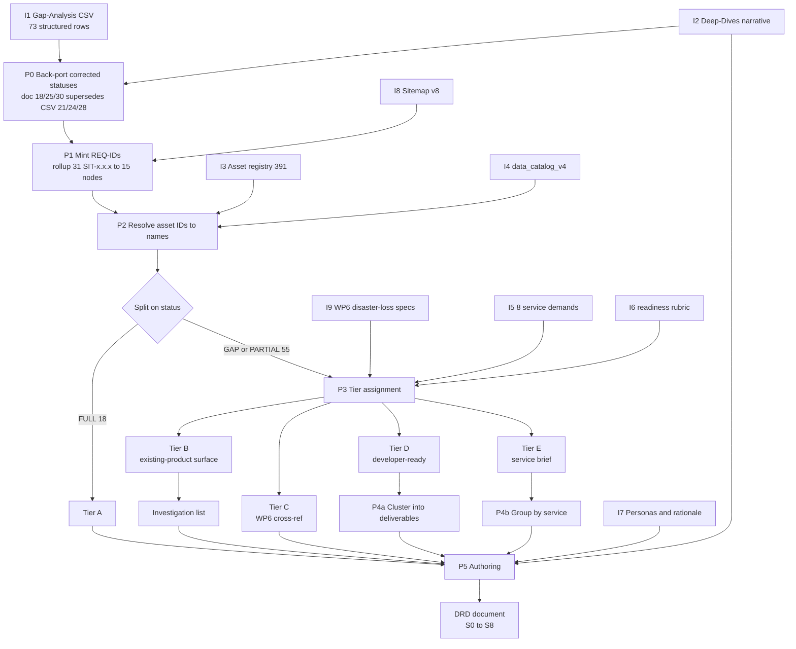

# WP4 Developer-Ready Design Requirements — Execution Plan (v2)

**Date**: 2026-08-12
**Supersedes**: `2026-08-12-wp4-drd-developer-requirements-specification-plan.md` (v1)
**Target output**: `ψ/incubate/DCCE/CRDB/output/04_Sitemap/2026-08-12-WP4-Developer-Ready-Design-Requirements-Specification.md`

---

## What changed from v1

Version 1 proposed writing a full IEEE-830 style requirement card for each of the 73 sitemap requirements. Four things surfaced in review that made that shape wrong.

1. **One requirement is not one deliverable.** The same underlying build or data source serves several sitemap nodes. Node 2.2 relies on the same data mart as Node 1.2. The technology-transfer tracking gap appears in both Node 2.3 and Node 3.3. The impact-chain manual is reused across four requirements in Node 3.2. Writing 55 independent cards would fragment work a build team should plan as a much smaller set of deliverables.

2. **WP6 does not cover all 8 service demands.** The 2026-08-07 revision narrowed WP6 to full Functional Specs for A-BTR and disaster-loss statistics only. The other six services receive nothing from WP6, so WP4 either covers them or nothing does.

3. **A-BTR belongs at the data-platform layer and comes later.** It is not threaded through page-level cards now. Once the website content and product design settle, a separate step compares the finished design against A-BTR's 379 requirements and shows DCCE how far the platform already carries it.

4. **We cannot see inside the three existing analytical products.** This one removed a whole category of claim from the plan. See the section below.

---

## The limit on the three existing products

We do not know what data sits behind the Spatial Risk Database, the Hazard/Exposure Map, or the Climate Risk Index.

The asset registry gives us their front doors. `SYS-003` sits at `ccic.dcce.go.th/riskarea`, `DAT-005` is its dataset entry, and the six sector rows `DCCE_3_1` through `DCCE_3_6` in the data catalog describe composite indices. None of that is an inventory of the inputs that produce those outputs. WP2 already established the point for the composite index. Its multiplicative, equal-weighted, normalised method irreversibly compresses the line-agency data that feeds it, so the published index cannot be decomposed back into its sources.

An earlier draft of this plan used those asset codes to argue that data already exists behind these products and only the interface is missing. That inference is not available to us and has been removed.

**What the document may say.** A given sitemap page is a place where one of the three products could be hosted. That is an observation about the sitemap.

**What it may not say.** Whether the data behind that product actually satisfies the requirement, or whether the remaining work is only interface work.

### This becomes a recommendation, not an assumption

The unknown is written up as the next project's first task, before any build work starts.

1. Investigate what data actually underlies the three existing analytical products, including inputs, lineage, granularity, refresh cycle and ownership, rather than only the published index.
2. Ingest those datasets into the platform's data layer.
3. Re-evaluate the material gaps at the start of the next project, once the real inventory is visible.

This carries into WP8 and WP11. It also sets an honest expectation for the whole document. Once the three products' data is visible, some recorded gaps may dissolve and some items now counted as covered may not survive. Saying so in advance is more useful to TOR70 than a confident classification resting on an assumption.

---

## The five-tier treatment

Every one of the 73 requirements lands in exactly one tier. The document body stays in sitemap-node order, so DCCE reads it the same way it reads the existing analysis. Each item is written at the depth its tier earns.

| Tier | What it covers | Format | Where it goes next |
|---|---|---|---|
| **A. Full** (18) | Already served by an existing asset | One line naming the source | WP11 executive framing. Not sent to TOR70 as work |
| **B. Existing-product surface** | The page could host one of the three existing products. Data adequacy is **unassessed** | One line naming the product, marked `data adequacy pending investigation` | Feeds the investigation recommendation. TOR70 re-evaluates after ingesting the real data |
| **C. WP6 cross-reference** | Genuinely matches WP6's disaster-loss statistics spec | Pointer to the WP6 file and reference | TOR70 builds from WP6's document |
| **D. Developer-ready** | Self-contained and buildable now | Full requirement card plus a data spec reference | **The core handoff to TOR70** |
| **E. Service scoping brief** | Tied to a service DCCE has not chosen to build | Cluster brief with counts and blockers, no acceptance criteria | WP8 roadmap and WP11 "what's next". Not a build task |

Tier B never closes a requirement. Every Tier B item also appears in the investigation list.

A-BTR receives no per-requirement treatment here.

---

## Two findings from reading the input files

### There is a machine-readable spine

`04_Sitemap/2026-08-10-WP4-Content-Source-Gap-Analysis.csv` holds all 73 requirements as structured rows rather than prose.

| Column | Content | Used for |
|---|---|---|
| `node_id` | `SIT-1.1.1`, third-level v8 IDs | Node grouping and rollup |
| `node_title_th` | Thai node title | Node headers |
| `requirement_item` | Thai requirement text | Card titles |
| `btr_tag` | e.g. `"2, MUST"`, populated on 51 of 73 rows | A-BTR overlap, deferred step |
| `matched_asset_ids` | `PUB-012;DAT-014` or `GAP` | Asset resolution and citations |
| `match_rationale` | Why the asset matches | "What exists today" text |
| `coverage_completeness` | `FULL`, `PARTIAL`, `GAP` | Splitting Tier A from the rest |
| `uncovered_subtopics` | Sub-topic leaks | Gap precision inside a card |

So the document is a transformation of an existing dataset rather than a re-reading of prose. The `btr_tag` column also means requirement-level A-BTR linkage already exists, and the later reconciliation will not need to rebuild it from `requirement_sitemap_link.csv`.

### The CSV's status column is out of date

The CSV records 21 FULL, 24 PARTIAL and 28 GAP. The node-level deep-dive document records 18, 25 and 30. The deep-dive document is newer. It was edited on 2026-08-12 at 13:56, the CSV on 2026-08-11 at 16:44, and the diff shows a deliberate stricter re-assessment rather than drift.

Three requirements were downgraded, all because an existing product's presence had been over-credited.

| Node | Requirement | Was | Now |
|---|---|---|---|
| 1.2 | Spatial risk map overlay | FULL | GAP, since no map-overlay interface or design exists |
| 2.1 | National exposure trends | FULL | GAP, since a static snapshot is not a time-series trend |
| 2.2 | Sector-specific risk profile | FULL | PARTIAL, since the spatial baseline exists but no summarised profile does |

The arithmetic holds. 21 minus 3 is 18, with one moving to partial and two to gap.

The deep-dive document therefore governs status. The CSV remains the spine for everything else, meaning requirement text, matched assets, rationale, `btr_tag` and uncovered sub-topics. **The tiering scope is 55 gap and partial items.** Step P0 back-ports the corrected statuses into the CSV rather than the other way round.

One loose end. The deep-dive document's closing paragraph still says "28 total gaps" against its own corrected table of 30. Fix it during P0.

---

## Inputs

| ID | File | What it provides |
|---|---|---|
| **I1** | `04_Sitemap/2026-08-10-WP4-Content-Source-Gap-Analysis.csv` | The spine. 73 requirement rows with matched assets, rationale, `btr_tag`, uncovered sub-topics. Status column superseded by I2 |
| **I2** | `04_Sitemap/2026-08-11-WP4-Node-Level-Deep-Dives.md` | Per-node narrative and the effort judgments that turn a row into a card. Authoritative for status after the 12 Aug correction pass |
| **I3** | `04_Sitemap/DCCE_Unified_Digital_Asset_Database.csv` | 391-asset registry resolving `SYS-`, `PUB-`, `DAT-`, `MED-`, `VID-`, `RES-` IDs to title, type, URL and owning division |
| **I4** | `02_Data_Inventory/data_catalog_v4.csv` | Dataset detail covering granularity, access rights, update cadence, format and quality flags |
| **I5** | `06_Use_Case_Demand_Analysis/บทสรุปความต้องการใช้งานบริการข้อมูลสารสนเทศด้านภูมิอากาศ_v6.md` | The 8 service demands and their use-case clusters |
| **I6** | `06_Use_Case_Demand_Analysis/2026-06-12_service-detailing-plan-after-director-toey.md` | Readiness rubric and dossier structure |
| **I7** | `01_Business_Objective_Platform_Rationale/2026-08-06-Business-Objective-Platform-Rationale.md` | Personas, the 5 core products, phase-1 scope and its stated ceiling |
| **I8** | `04_Sitemap/NCAIF_Detailed_Sitemap_v8.md`, `ncaif_sitemap_nodes.csv` | Node hierarchy and titles |
| **I9** | WP6 disaster-loss statistics outputs | Tier C cross-reference targets |
| **I10** | `A-BTR_requirement_analysis/requirement_sitemap_link.csv` | Deferred. Feeds the later A-BTR reconciliation only |

---

## Processing

**P0** Back-port the three corrected statuses from I2 into I1. Sweep for any other row the correction pass should have caught. Fix the stale closing line in the deep-dive document.

**P1** Mint stable `REQ-###` IDs in CSV row order and build the rollup from 31 third-level nodes to the 15 second-level nodes the deep-dive document uses.

**P2** Join `matched_asset_ids` to I3 for real asset names, types and URLs, then join dataset assets to I4 for granularity, access and cadence. This is what lets the body use plain names while codes stay in an appendix.

**P3** Assign tiers across the 55 gap and partial items. Tier C requires a genuine disaster-loss statistics match and is never inferred from A-BTR density. Tier B marks a hosting surface only.

**P4a / P4b** Cluster Tier D into shared deliverables and group Tier E by the service demand behind it.

**P5** Write each item in its tier's format.

---

## Output sections

| § | Section | Fed by |
|---|---|---|
| **S0** | Front matter and how to read the document, describing the two reading paths | — |
| **S1** | Coverage summary with headline numbers and the tier distribution per node | P0, P3 |
| **S2** | Method note explaining plainly how status became tier, including what Tier B does and does not claim | P2, P3 |
| **S3** | Body of 15 node sections from 1.1 to 5.2. Each carries a purpose line, its counts, then items in tier order. A and B one-liners, C cross-references, D full cards, E pointers to their brief | I1, I2, I3, I4, I7 |
| **S4** | Appendix A, the deliverable index for Tier D. Deliverable, type, and the requirements it serves | P4a |
| **S5** | Appendix B, service scoping briefs. One per uncovered service cluster with requirement counts, nodes touched, the core data or method blocker, readiness, and a note that fuller requirement gathering is needed if DCCE selects it | P4b, I5, I6 |
| **S5b** | Appendix B2, data specification sheets plus the investigation recommendation for the three existing products | I4, I3, Tier B list |
| **S6** | Appendix C, the traceability matrix covering all 73 rows with REQ-ID, node, status, tier and destination | I1, P1, P3 |
| **S7** | Appendix D, the lookup from plain names to asset codes | P2 |
| **S8** | Appendix E, deferred and out of scope. The A-BTR forward pointer, the two service demands with no sitemap home, and the unverified or restricted catalog caveats | I1, I5, sprint plan open items |

I1 supplies every row that appears anywhere. I2 supplies the judgment that turns a row into a card. I3 and I4 supply the technical substance of the data sheets. I5 and I6 exist almost entirely to produce S5. I7 supplies persona and phase-1 framing. I9 produces only the Tier C lines. I10 touches nothing here and appears solely as the forward pointer in S8.

---

## Data specification sheets, one per asset rather than per requirement

Schema, granularity, access rights, refresh cadence, quality rules and stewardship are properties of a dataset, not of a page that displays it. The same dataset feeds several pages, so writing its specification into eight requirement cards would duplicate it eight times and let the copies drift apart.

The card splits in two along the same web-platform and data-platform line WP1 Section 1a already uses.

| Layer | Grain | Contains | Rough count |
|---|---|---|---|
| Requirement card, web-platform | one per requirement | Who it is for, what the system must do, interface and component notes, fallback behaviour, acceptance criteria | as many as Tier D holds |
| Data specification sheet, data-platform | **one per data asset or mart** | The data management fields below | far fewer, roughly 10 to 15 |

A requirement card carries a `Data Spec: DS-##` reference instead of an inlined data section. One sheet, many referencing cards.

The sheet is grounded in columns the catalog already has rather than invented fields.

| Concern | Backed by `data_catalog_v4.csv` |
|---|---|
| Identity and domain | `dataset_id`, `title`, `cdm_domain`, `cdm_sub_domain`, `cdm_data_entity`, `sectors` |
| Granularity and coverage | `spatial_resolution`, `geo_coverage`, `temporal_resolution`, `time_period_start`, `time_period_end` |
| Quality and trust | `endorsement_status`, `validation_flag`, `use_limitations`, `notes` |
| Access and security | `access_rights_dataset`, `access_rights_metadata`, `license_id`, `data_category` |
| Operations | `update_frequency_unit`, `update_frequency_interval`, `data_format`, `maintainer`, `owner_org` |
| Lineage | `data_source`, `data_collect`, `data_support`, `url` |

Fields we cannot fill are marked `UNKNOWN — pending next-project investigation` rather than guessed. For the three existing products the sheet will come out mostly unknown, and that visibly empty sheet is the concrete evidence behind the investigation recommendation.

---

## Writing conventions

These bind the authoring step and apply to the document, not to working notes.

- Write plainly. Avoid consultant vocabulary such as "leverage", "actionable", "workstream", "surface" used as a verb, "at the X level" or "cross-cutting".
- Avoid colon-driven sentences, including the "claim, colon, explanation" pattern and colons that introduce a definition mid-sentence. Two plain sentences read better than one propped up by a colon.
- Prefer ordinary words to report vocabulary. Write "count", or simply state the numbers.
- Keep the convention the WP4 report already set. Real asset names and plain page names in the body, internal codes confined to the lookup appendix.
- Rename the card's field labels away from standards vocabulary before drafting, since they repeat on every card. "Current State Baseline" becomes "What exists today". "System Behavioral Rules" becomes "What the system must do". "Primary Persona" becomes "Who this is for". "Data Quality and Security SLA" becomes "Data quality and access limits".

---

## Execution steps

1. **Data preparation, P0 to P2.** Back-port the three corrected statuses, mint REQ-IDs, build the node rollup, resolve asset IDs against I3 and I4. Produces one working table of all 73 enriched rows, kept as a scratch file rather than a deliverable.
2. **Tiering, P3.** Assign tiers B through E across the 55 gap and partial items.
3. **Boss checkpoint, a hard gate.** Present the tier table and the status correction for confirmation. No authoring starts before this. The tiering decides whether the document carries roughly ten full cards or fifty.
4. **Authoring, P4 to P5.** Cluster, then write S0 to S8 into the target file.
5. **Retire v1.** Move `2026-08-12-wp4-drd-developer-requirements-specification-plan.md` into an `archive/` subfolder, per the project's practice of superseding rather than deleting.

## Files

- **Created**: `ψ/incubate/DCCE/CRDB/output/04_Sitemap/2026-08-12-WP4-Developer-Ready-Design-Requirements-Specification.md`, at step 4
- **Moved**: v1 of this plan into `plans/archive/`, at step 5
- **Read-only**: I1 through I10. No ledger edits, since the four CRDB ledgers change only through the `seal` skill

## Verification

- Every one of the 73 REQ-IDs appears in the traceability matrix exactly once and sits in exactly one tier. The per-node counts in S3 add up to the headline numbers in S1.
- No orphans in either direction. Every deliverable named in a Tier D card exists in S4, and every S4 row is cited by at least one card. The same check applies to Tier E briefs against the pointers in the body.
- No unearned claims. No Tier B item is written as satisfied, mostly done, or interface-only. Each carries its `data adequacy pending investigation` marker and appears in the investigation list.
- Every `Data Spec: DS-##` reference resolves to a sheet, and every field on a sheet is either filled from I4 or explicitly marked unknown. Never guessed, never silently blank.
- Every asset code in S7 exists in I3, and every plain name used in the body has an entry there.
- Read the finished prose back against the writing conventions above, watching for colon-propped sentences and for jargon reintroduced through field labels.
- P0 is closed. The CSV's status column matches the corrected document across all 73 rows, and the stale closing line in the deep-dive document is fixed.
