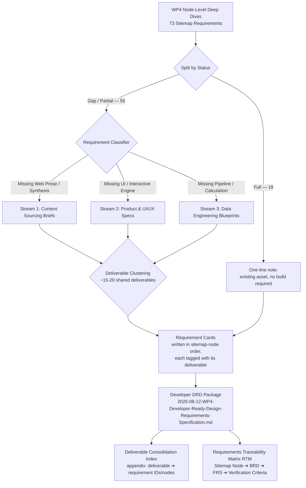

# Implementation Plan: Transforming WP4 Gap Analysis into Developer-Ready Design Requirement Documents (DRD)

**Date**: 2026-08-12  
**Target Output**: `ψ/incubate/DCCE/CRDB/output/04_Sitemap/2026-08-12-WP4-Developer-Ready-Design-Requirements-Specification.md`

---

## 1. Goal Description

The current WP4 analysis (`2026-08-11-WP4-Node-Level-Deep-Dives.md`) evaluates 73 sitemap requirements across 15 second-level nodes. However, presenting these items merely as "Full", "Partial", or "Gap" leaves a significant translation barrier for the implementation vendor in the next project.

As synthesized from software development standards and past **NotebookLM runs** on data platform scoping (`ψ/inbox/notebooklm_runs/2026-08-06_crdb_pm_po_ba_alignment/`), requirements fail in execution unless high-level business goals are mapped to deterministic developer specifications.

This initiative will transform the node-wise gap analysis into a **Developer-Ready Design Requirement Document (DRD) & Product Specification Package** (`2026-08-12-WP4-Developer-Ready-Design-Requirements-Specification.md`). It converts raw gap descriptions into actionable engineering and content-sourcing cards classified by **BABOK / DAMA-DMBOK** requirement types.

**Dual-audience output**: the document is a single file with two reading paths. The body stays organized in sitemap-node order (1.1 → 5.2), matching the structure DCCE already knows from `2026-08-11-WP4-Node-Level-Deep-Dives.md` — DCCE never has to learn a new organizing principle. A separate **Deliverable Consolidation Index** appendix gives the build vendor (TOR70) the engineering-efficient view: requirements grouped by the shared underlying build or data source that satisfies them, since the source doc repeatedly shows the same asset serving multiple nodes (e.g. Node 2.2 "fundamentally relies on the same underlying data mart as... Node 1.2"; the tech-transfer/capacity-building tracking gap named as "the same pattern" in both Node 2.3 and Node 3.3). This mirrors the project's existing convention of plain node language in the body with internal codes confined to an appendix lookup (used in the 2026-08-10 gap-analysis report).

---

## 2. User Review Required

> [!IMPORTANT]
> **Specification Granularity & Taxonomy**:
> We propose categorizing all 73 sitemap requirements into three distinct developer execution streams:
> 1. **Content Sourcing & Synthesis Briefs** (e.g., Node 1.1 NAP Summary, Node 2.2 HNAP/Provincial plan harvesting).
> 2. **Product & UI/UX Feature Specifications** (e.g., Node 1.2 Interactive Search Widget, Node 4.3 External Tools Hub, Node 5.2 Feedback Helpdesk).
> 3. **Data Engineering & Mart Blueprint Cards** (e.g., Node 2.1 Macroeconomic L&D Payouts, Node 4.2 IDF Curve Calculations, Node 3.1 Climate Grids).

> [!NOTE]
> **Interim Fallback Design Rules**:
> For Product & UI gaps where sub-provincial data is still missing (such as Node 1.2 Interactive Search), the DRD will explicitly define **Stateful UI Fallback Rules** (e.g., rendering Province-level composite baselines + explicit "Data Ingestion in Progress" badges) to prevent the vendor from building empty/broken search results.

> [!IMPORTANT]
> **Card Scope — Gap/Partial Only**:
> Only the 55 "Gap" and "Partial" requirements get a full requirement card. The 18 "Full" requirements get a one-line note ("existing asset — no build required") with a source reference, not a full BRD/DMBOK/AC card — writing a complete card for something that already exists is wasted effort and bloats the handover package.

> [!IMPORTANT]
> **Deliverable Clustering Before Card-Writing**:
> Before cards are drafted, the 55 Gap/Partial requirements will be grouped into roughly **15-20 shared deliverables** — the source doc makes clear that 1 requirement ≠ 1 build item (e.g. the same spatial risk data mart underlies Node 1.2, Node 2.2, and Node 4.2; the impact-chain methodology manual is reused across four requirements in Node 3.2). Deliverables fall into four types: **data partnerships** (e.g. Met Dept/Marine Dept access), **data-engineering builds** (raw data → usable product, e.g. macroeconomic L&D consolidation), **content-production programs** (e.g. the tech-transfer/capacity-building tracking write-up shared by Nodes 2.3 and 3.3), and **new operational capabilities** (e.g. the feedback platform in Node 5.2). Each requirement card is tagged with the deliverable it belongs to; the full deliverable-to-requirement mapping lives in the appendix (see Section 5).

---

## 3. Open Questions

> [!QUESTION]
> 1. ~~Should the resulting DRD specification be structured as a single comprehensive master markdown document (recommended for handover packages) or split into per-node specification files under `ψ/incubate/DCCE/CRDB/output/04_Sitemap/DRD_Specs/`?~~ **Resolved 2026-08-12**: single master document, sitemap-node body + deliverable-index appendix (see Sections 1, 5).
> 2. Would you like us to include explicit **Acceptance Criteria (Definition of Done)** for every gap item to bound the implementation vendor's scope and prevent contract change orders? — **Still open.** With deliverable clustering in place, ACs would now be written primarily at the deliverable level (one set per shared build), with requirement-level ACs added only where a deliverable's individual requirements need distinct done-criteria. Confirm this scoping before card-writing begins.

---

## 4. Proposed Architectural Framework

### Requirements Transformation Architecture (BABOK / DAMA Aligned)



---

## 5. Proposed Changes

### Target Location: `ψ/incubate/DCCE/CRDB/output/04_Sitemap/`

#### [NEW] `2026-08-12-WP4-Developer-Ready-Design-Requirements-Specification.md`
A master developer specification package, organized in **sitemap-node order** (matching `2026-08-11-WP4-Node-Level-Deep-Dives.md`), containing standardized **DRD Requirement Cards** for the 55 Gap/Partial requirements, one-line existing-asset notes for the 18 Full requirements, and a closing **Deliverable Consolidation Index** appendix.

Each Gap/Partial card will be structured using standard IEEE 830 / PRD engineering formatting:

```markdown
### Requirement Card: [REQ-ID] [Node X.X] — [Title]

* **Requirement Category**: `[Product Build / UI]` | `[Content Sourcing]` | `[Data Engineering]`
* **Primary Persona**: `Somchai (Policy Maker)` | `Dr. Clara (Scientist)` | `Priya (Co-Producer)`
* **Target Interface**: Sitemap Node X.X (`file:///...`)
* **Current State Baseline**: `[Gap / Partial]` (Detailed reality check)
* **Shared Build**: `[Deliverable name]` — also serves Node X.X, Node Y.Y (omit if this requirement is not part of a shared deliverable)

#### 1. Business & Functional Requirement (BRD / FRS Layer)
* **User Intent ("As a... I want to... So that...")**: Concise user story.
* **System Behavioral Rules**: Explicit "shall" statements defining how the component responds to user input.
* **UI/UX & Component Spec** (For Product items): Widget type, search parameters, layout structure.
* **Interim Fallback Logic**: What the UI renders when data is missing or restricted (e.g., Province-level fallback).

#### 2. Technical Data & Content Specification (DMBOK Layer)
* **Input Sources / Assets**: Target files to harvest (e.g., `Provincial Climate Change Plans`, `HNAP`).
* **Schema / Field Mapping Intent**: Key data fields, ENUM constraints (e.g., 5-sector ENUM), and spatial granularity limits.
* **Data Quality & Security SLA**: Access tiers (`Open` vs `Restricted`), DAMA validity rules.

#### 3. Acceptance Criteria & Definition of Done (PO Layer)
* [ ] **AC-01**: Testable criterion 1 (e.g., UI accepts province selection and displays provincial composite score).
* [ ] **AC-02**: Testable criterion 2 (e.g., System displays explicit fallback banner when subdistrict data is null).
```

Full requirements get a one-line entry instead, e.g.:

```markdown
### [REQ-ID] [Node X.X] — [Title]: Existing asset, no build required. Source: [asset name].
```

#### Deliverable Consolidation Index (appendix)

A single appendix table at the end of the document, for the build vendor (TOR70), cross-referencing the sitemap-ordered body back to the consolidated engineering view. DCCE does not need to read this section. Same convention as the plain-name-to-code lookup appendix in the 2026-08-10 gap-analysis report.

| Deliverable | Type | Requirement IDs / Nodes Served |
|---|---|---|
| e.g. Spatial Risk Data Mart Extension | Data Engineering | Node 1.2, Node 2.2, Node 4.2 |
| e.g. Tech-Transfer / Capacity-Building Tracking | Content Production | Node 2.3, Node 3.3 |
| e.g. Met Dept + Marine Dept Data Partnership | Data Partnership | Node 3.1 (5 requirements) |

---

## 6. Verification Plan

### Automated Verification
* **Tally & Coverage Matrix Validation**: Cross-check that all 73 requirements across the 15 nodes in `2026-08-11-WP4-Node-Level-Deep-Dives.md` are 100% accounted for in the DRD document (either as a full card or a one-line Full-status note).

### Manual Verification
* **Developer Handover Review**: Verify that every "Gap" and "Partial" item from the WP4 audit has a clear, actionable developer requirement specification with non-ambiguous acceptance criteria.
* **Deliverable Cross-Reference Check**: Confirm every deliverable named in a card's "Shared Build" field appears as a row in the Deliverable Consolidation Index appendix, and every appendix row is tagged on at least one card — no orphaned entries in either direction.
* **File Path Spot-Check**: Manually confirm embedded file paths in the DRD document resolve to real workspace files (no automated link validator currently exists in this repo — build one only if this becomes a recurring need).
