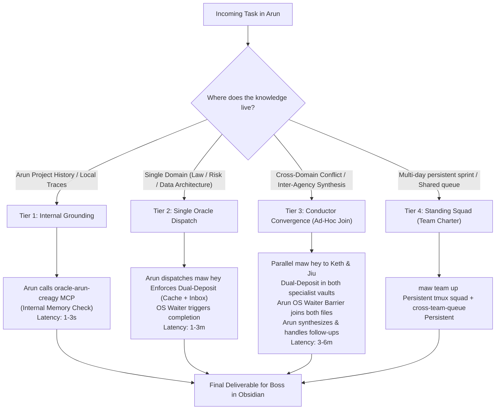

# Strategic Architecture & Implementation Plan: Multi-Oracle Conductor Pattern (`/conduct` & Inter-Op Contract)

**Document Reference**: `2026-10-03_conductor-skill-and-interop-plan.md`  
**Date**: 3 October 2026  
**Author**: Arun (Project Conductor & Workbench)  
**Target Repository**: [Arun_Creagy](file:///C:/Users/sitth/OracleWorkspace/Arun_Creagy)  
**Location**: `plans/2026-10-03_conductor-skill-and-interop-plan.md`  
**Status**: Frozen & Saved for Boss's Review / Future Decision  

---

## 1. Executive Summary & Purpose

This plan transitions Arun Creagy from a noisy monolith into a modular, multi-oracle architecture:
1. **Arun is the Project Conductor & Workbench**: Holds active project context, coordinates multi-domain research, and remains the primary conversational interface for Boss.
2. **Specialists (Keth, Jiu, Lauren) are Permanent Knowledge Vaults**: Hold clean, curated, reusable knowledge (Thai civil service/public administration, climate resilience/risk modeling, and enterprise data architecture).
3. **Obsidian is the Human Inspection Gate**: Boss supervises closely, reviewing structured Markdown artifacts on disk without manually switching terminals, running bash commands, or managing tmux sessions.
4. **Decentralized Autonomy**: Arun does not impose internal workflows on sovereign specialists. Arun defines the external **Oracle Inter-Op Interface Contract (RFC)**, while each specialist designs its own internal skills and tool chains.

---

## 2. Core Architectural Resolutions (Boss's Inquiries)

### A. The Non-Polling Ingress Mechanism (Zero LLM Token Cost)
* **The Question:** Do Tiers 2 and 3 require a 24/7 background daemon or LLM loop to poll Arun's inbox?
* **The Resolution:** **No.** 
  We use an **Event-Driven OS Waiter** running via PowerShell / Bash in the background:
  ```powershell
  while (-not (Test-Path $targetFile)) { Start-Sleep -Seconds 2 }
  ```
  - Runs as an OS-level sleep process (0% CPU, 0 LLM tokens).
  - The exact millisecond the specialist's brief lands on disk, the process exits code 0.
  - Antigravity's task notification subsystem automatically wakes Arun up with an event message:
    `[Message] Background task finished: File ψ/inbox/from-<oracle>/... has arrived!`
  - Arun wakes, reads the file, and proceeds immediately to synthesis.

### B. The Dual-Deposit (Knowledge Caching) Mandate
* **The Question:** Do asked oracles store their answers so repeat queries resolve instantly?
* **The Resolution:** **Yes, enforced via the Dual-Deposit rule.**
  If Keth writes only to Arun's inbox, Keth would have to re-derive the statutory audit from scratch if asked again tomorrow.
  The Inter-Op Contract mandates that every specialist executes a dual write:
  1. **External Deliverable (The Mailbox):** Deposited into requester's inbox:
     `Arun_Creagy/ψ/inbox/from-<oracle>/<timestamp>_<slug>.md`
  2. **Internal Permanent Knowledge (The Cache):** Committed into the specialist's own permanent memory:
     `<specialist>/ψ/memory/knowledge/<domain>/<slug>.md`
  - **Payoff:** Next time Keth (or any oracle querying Keth) is asked about this topic, Keth's Tier 1 check searches its own `ψ/memory/knowledge/` first. It finds the previously verified brief, returns the answer in **3 seconds**, and avoids re-querying `bureaucrazy.sqlite` or re-calling external LLMs.

### C. The Cost Analysis: Ad-Hoc Convergence (Tier 3) vs. Standing Squad (Tier 4)
* **The Question:** If Tier 3 involves a team right away, what would be the unnecessary cost?
* **The Resolution:** 
  
| Cost / Risk Dimension | Tier 3: Ad-Hoc Convergence (File-Join) | Tier 4: Standing Squad (`maw team up`) |
| :--- | :--- | :--- |
| **Context Window Health** | **Zero Pollution.** Each specialist receives a clean, single-turn ticket. Runs the query, writes the file, and exits. Reasoning stays sharp. | **High Degradation.** Tmux panes stay resident across multiple turns, accumulating chat history and degrading reasoning quality over time. |
| **Token & Quota Burn** | **Minimal.** Tokens are burned only for the specific inquiry. | **Continuous.** Resident background daemons listening to `maw feed` and `.claude/tasks/` consume tokens on every poll or broadcast. |
| **Operational Fragility** | **None.** Pure file-based exchange over markdown. Zero zombie processes. | **High.** Worktrees, zombie tmux panes, task queue race conditions (`.claude/tasks/*.json`), and mandatory cleanup (`maw team down`). |
| **Ponytail / YAGNI Alignment** | **Maximum.** The shortest, simplest path that actually works. | **Overkill.** Great for multi-day collaborative hackathons; wasteful for answering two research questions for a TOR. |

---

## 3. The 4-Tier Operational Matrix



| Tier | Oracle Boundary & Access Model | Who Calls What? | Synchronization & Join Mechanism | When to Use |
| :--- | :--- | :--- | :--- | :--- |
| **Tier 1: Internal Grounding** | **Intra-Oracle (Arun only)**. No foreign memory is touched. | **Arun** queries `oracle-arun-creagy` via local MCP tools (`oracle_search`, `oracle_read`). | Immediate synchronous return. | Checking past meeting notes, checking prior trace IDs, checking previous retrospectives. |
| **Tier 2: Single Domain Audit** | **Cross-Oracle (Arun $\rightarrow$ 1 Specialist)**. Respects specialist encapsulation. | Arun runs `maw hey <oracle>`. Specialist wakes, queries its own tools (`bureaucrazy.sqlite` / NotebookLM), writes to `ψ/inbox/`. | Single file arrival check on `ψ/inbox/from-<oracle>/<slug>.md`. | Dedicated legal audit, single risk curve calculation, single CDM schema design. |
| **Tier 3: Conductor Convergence** | **Cross-Oracle Multi-Cast (Arun $\rightarrow$ 2+ Specialists)**. | Arun dispatches parallel tickets via `maw hey keth` and `maw hey jiu`. | **Conductor File-Join Barrier**: Arun checks disk until ALL declared manifest outputs exist before running the cognitive synthesis pass. | Resolving policy vs science conflicts (e.g. TMD legal authority vs DCCE downscaling requirements). |
| **Tier 4: Standing Squad** | **Multi-Oracle Co-Location**. Dedicated session topology. | `maw team up <charter>` binds agents into a shared tmux session and `cross-team-queue`. | Task queue state transition (`pending` $\rightarrow$ `in_progress` $\rightarrow$ `completed` in JSON task files). | Multi-day project sprints where agents need to observe a continuous event feed (`maw feed`). |

---

## 4. Component Design

### Component 1: `/conduct` Skill in Arun Creagy
* **File Location**: `.agents/skills/conduct/SKILL.md`
* **Trigger**: `/conduct`
* **Core Responsibilities**:
  1. **Complexity Triage**: Evaluates whether a request can be answered from local memory (Tier 1) or requires crossing oracle boundaries (Tiers 2–4).
  2. **Bounded Ticket Generation**: Generates structured tickets matching the Inter-Op Contract.
  3. **Autonomous WSL Dispatch**: Invokes `maw hey` behind the scenes using `scripts/dispatch_wsl.ps1` without Boss opening a terminal.
  4. **Event-Driven OS Waiter**: Launches non-blocking background OS processes to wait for file arrivals (zero LLM token consumption).
  5. **Cognitive Synthesis & Gap Detection**: Ingests specialist briefs, analyzes conflicts (e.g. legal statutory limits vs. technical resolution needs), and formulates follow-up queries.

### Component 2: The Oracle Inter-Op Interface Contract (RFC)
* **File Location**: `ψ/specs/oracle-interop-contract.md`
* **Role**: Defines the external communication boundary so each oracle can independently implement its internal skill.
* **Three Protocol Specifications**:
  1. **The Ticket Schema (Inbound to Specialist)**:
     ```markdown
     # [ORACLE TICKET] <Slug>
     - From: arun
     - Topic: <topic>
     - Objective: <specific research/audit task>
     - Permitted Tools: <local databases, notebooks, models>
     - Dual-Deposit Targets:
       1. Deliverable: /mnt/c/.../Arun_Creagy/ψ/inbox/from-<oracle>/<timestamp>_<slug>.md
       2. Cache: <oracle>/ψ/memory/knowledge/<domain>/<slug>.md
     - Wire Signal: maw hey arun 'DONE: <slug>'
     ```
  2. **The Brief Schema (Outbound to Requester Inbox)**:
     - Header & Citations: Direct markdown links to primary laws, SQLite rows, or models.
     - Executive Summary: Crisp synthesis for immediate human inspection in Obsidian.
     - De Jure vs. De Facto Analysis: Clearly separating legal text from operational reality.
     - Permanent Cache Path: Explicit declaration of where the permanent note was saved in the specialist's own vault.
  3. **The Completion Wire Signal**:
     ```bash
     maw hey arun "DONE: <slug>"
     ```

### Component 3: Sovereign Specialist Domain Autonomy
* Each specialist oracle maintains its own internal investigation workflow and domain assets:
  - **Keth**: Curates `src/data/bureaucrazy.sqlite`, NotebookLM regulatory collections, and `ψ/memory/knowledge/bureaucrazy-lab/`.
  - **Jiu**: Curates CRI risk models, provincial flood/drought hazard rasters, DaLA/PDNA templates, and `ψ/memory/knowledge/risk-models/`.
  - **Lauren**: Curates Common Data Model (CDM) entities, OpenAPI specifications, and `ψ/memory/knowledge/data-architecture/`.

---

## 5. Decision Gate (Ready for Future Implementation)

When Boss is ready to proceed, execution will follow these two sequential steps:
1. **Step 1: Build the `/conduct` Skill in Arun**:
   - Create `.agents/skills/conduct/SKILL.md`.
   - Create `.agents/skills/conduct/scripts/dispatch_wsl.ps1`.
   - Create `ψ/specs/oracle-interop-contract.md`.
2. **Step 2: Dispatch the Contract to Specialists & Run Live Test**:
   - Dispatch the Inter-Op Contract ticket to Keth, Jiu, and Lauren.
   - Run live Tier 3 dialectic test (Jiu climate downscaling brief + Keth statutory boundary follow-up).
