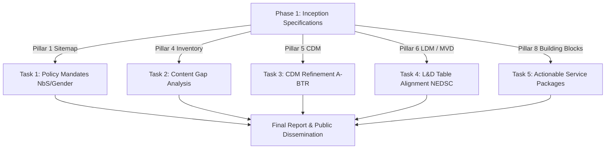

# CRDB July–August 2026 Phase 2 Execution Plan

## Strategic Context & Connections to Phase 1

This plan governs the transition from the Phase 1 Inception Specification (completed July 6th, 2026) to the **Final Report Submission (August 26, 2026)** and the **Public Dissemination Event (August 18, 2026)**.

The tasks in this sprint are not standalone; they directly refine, validate, and harden the core architectural assets built in Phase 1 to prevent "Expert Drift" during the upcoming implementation contract.

### Contextual Mapping of Key Tasks

#### Task 1: Policy Mandate Integration into Sitemap
*   **Why Needed**: Feedback from DCCE internal reviews and the May 12 Consultation Workshop indicated that a purely technical data sitemap is insufficient for ministerial endorsement. The platform must reflect national policy priorities.
*   **Connection to Phase 1**: Expands the sitemap (Pillar 1) to explicitly map landing zones and content placeholders for **Nature-based Solutions (NbS)**, gender safeguards, and social inclusivity metrics.

#### Task 2: DCCE Content Gap Analysis
*   **Why Needed**: Ensures that the catalog-first architecture does not direct users to empty pages ("orphan pages") due to lack of DCCE data.
*   **Connection to Phase 1**: Builds directly on the initial data inventories (Pillar 4) and the website trace [1217_dcce-website-content-comprehensive-trace.md](file:///C:/Users/sitth/OracleWorkspace/Arun_Creagy/ψ/memory/traces/2026-07-06/1217_dcce-website-content-comprehensive-trace.md), comparing sitemap requirements against real-world DCCE publications to formulate concrete ingestion recommendations.

#### Task 3: CDM Refinement with A-BTR Integration
*   **Why Needed**: DCCE's core mandate includes reporting to international bodies (UNFCCC). The data platform must support these reporting workflows.
*   **Connection to Phase 1**: Extends the Conceptual Data Model (Pillar 5), which originally focused only on climate risk (Hazard, Exposure, Vulnerability), to map data entities required for **A-BTR** (Biennial Transparency Report) reporting segments (mitigation, adaptation actions, support needed/received).

#### Task 4: Loss & Damage Table Alignment with NEDSC
*   **Why Needed**: Aligns local emergency/loss schemas with national statistical authorities to prevent data silos.
*   **Connection to Phase 1**: Hardens the 6-table Minimum Viable Dataset (MVD) database schema (Pillar 6) to strictly align with the National Economic and Social Development Council's (**NEDSC**) loss database design, linking these tables directly to NCAIF Service 4 (Loss & Damage).

#### Task 5: Refinement of Service Package Specifications
*   **Why Needed**: Translates high-level service concepts into granular technical specifications that a contractor can build to without ambiguity.
*   **Connection to Phase 1**: Upgrades the service packages (Pillar 8) by defining exact APIs, data flows, and Service Level Agreements (SLAs) using product-management-aligned methodologies.

#### Strategic Mandate: Drafting the Data System Requirements (Week 2 Decision)
*   *Stance*: **Yes, system requirements must be drafted.** To support the upcoming fiscal year procurement, we will compile functional requirements (data ingestion, access control, audit logging) and non-functional requirements (security, scaling) as a separate annex of the Final Report. This operationalizes the "Blueprint-as-a-Shield" strategy.

---

## Weekly Sprint Timeline (July 6 – August 26, 2026)

### Week 1: Foundation & Asset Reassessment (July 6 - July 12)
*   **Tasks**:
    *   Review NCAIF sitemap to incorporate NbS, gender, and social safeguards.
    *   Initiate DCCE knowledge assets reassessment and sitemap minimum content audit.
    *   Design infographics and rollups layouts (TOR 5.5.3).
    *   Confirm DCCE availability for the public dissemination event (Target: Aug 18).
*   **Audit Checkpoint**: Draft sitemap v5 updated with policy landing nodes.

### Week 2: Technical Models & A-BTR Mapping (July 13 - July 19)
*   **Tasks**:
    *   Map A-BTR adaptation and mitigation reporting segments to CDM entities.
    *   Align L&D table designs with NEDSC's national database standard.
    *   Draft public dissemination event agenda.
    *   **Draft Functional/Non-Functional System Requirements** for the next fiscal year build.
*   **Audit Checkpoint**: Refined CDM schema submitted for technical vetting.

### Week 3: Service Packages & Formats Approval (July 20 - July 26)
*   **Tasks**:
    *   Refine Service Packages 1–4 with strict SLAs, API designs, and data boundaries.
    *   Secure DCCE approval on the final report outline and dissemination agenda.
    *   Draft and dispatch dissemination invitation letters.
    *   Conduct **Internal Knowledge Transfer Session 1**.
*   **Audit Checkpoint**: Dissemination letters dispatched; Service Package Spec v2 complete.

### Week 4: Report Restructuring & Event Slide Baseline (July 27 - August 2)
*   **Tasks**:
    *   Initiate Final Report writing (apply restructuring decisions).
    *   Baseline the public dissemination event slide deck.
    *   Finalize rollup and infographic designs.
*   **Audit Checkpoint**: Chapter 1 and 2 drafts assembled.

### Week 5: Report Synthesis & Design Approvals (August 3 - August 9)
*   **Tasks**:
    *   Secure approvals for rollup and infographic final designs.
    *   Continue report drafting (incorporating A-BTR and CDM sections).
    *   Conduct **Internal Knowledge Transfer Session 2**.
*   **Audit Checkpoint**: Complete draft report (Chapters 1–5) prepared for internal review.

### Week 6: External Review & Fabrication (August 10 - August 16)
*   **Tasks**:
    *   Submit draft report to P Tik for peer review.
    *   Finalize public event slides.
    *   Fabricate rollups and printed infographics.
*   **Audit Checkpoint**: Peer review feedback ledger created.

### Week 7: Dissemination Event & Finalization (August 17 - August 23)
*   **Tasks**:
    *   **Public Dissemination Event** (August 18 - TBC).
    *   Address peer review corrections from P Tik.
    *   Finalize report compilation.
*   **Audit Checkpoint**: Event feedback captured; Final report signed off by P Tik.

### Week 8: Submission (August 24 - August 26)
*   **Tasks**:
    *   Formal submission of the Final Report package to DCCE.
*   **Audit Checkpoint**: Receipt log registered.

---
*Operational plan maintained by ARUN; synchronized with Phase 2 Execution Directives (2026-07-06).*
