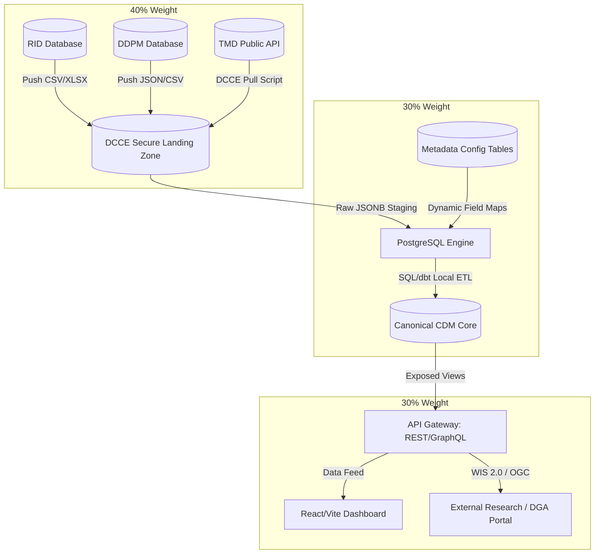

# Proposed Architecture Design: DCCE Climate Change Adaptation Information Platform

This document outlines the proposed system architecture for the Department of Climate Change and Environment (DCCE) Climate Change Adaptation Database, aligning with the requirements of the Terms of Reference (TOR). The design balances three core factors:
1. **Data Sovereignty of External Agencies (40% Weight)**
2. **DCCE’s Operational & IT Capacity (30% Weight)**
3. **Future Scalability & TOR Compliance (30% Weight)**

---

## 1. Executive Summary & Design Principles

To resolve the bottlenecks of the 2025 platform (high manual workload for data clerks, vendor lock-in, and rigid database schemas) while respecting institutional realities, the system implements a **Loose-Coupling Gateway Architecture with a Metadata-Driven Semantic Control Layer**. This semantic layer is scoped only to the **Adaptation Division**, not to the whole department. It provides one shared division-level conceptual model while allowing each domain owner to define domain-specific data structures and mappings, subject to committee approval before updating the shared model.



---

## 1.1. Architectural Separation: Data Assets vs. Knowledge Assets

A key design principle of this platform is the explicit separation of **Data Assets** and **Knowledge Assets**. Although they overlap, they serve different operational purposes and must be managed through separate architectural channels:

| Attribute | Data Assets (CRDB Core) | Knowledge Assets (CMS Layer) |
| :--- | :--- | :--- |
| **Asset Nature** | Quantitative, structured, machine-readable information. | Qualitative, context-dependent, interpretive organizational know-how. |
| **Management Focus** | Schema alignment, data lineage, quality checks, governance, and REST/GraphQL API interoperability. | Context capture, editorial control, expertise preservation, and making tacit/explicit policy knowledge accessible. |
| **Typical Formats** | PostgreSQL tables, geospatial PostGIS layers, JSONB payloads. | Storytelling articles, infographics, best practices (Good Practices), PDF reports, and page content. |
| **Primary System UI** | Automated ingestion scripts (FastAPI/dbt) and mapping tables managed by administrators. | Simple Content Management System (CMS) UI designed for DCCE staff to update page content, articles, and policy briefs. |
| **Value Proposition** | Powering analytics, reporting, trend charts, and automated UNFCCC reporting data. | Providing human context, decision-making, guidelines, and retaining institutional memory. |

### Operational Interaction
The platform decouples the storage of these assets but allows **metadata-level mapping**:
* **The CRDB** stores the numerical indicators (e.g., `IND-WAT-01` Reservoir Storage).
* **The CMS** manages the page content and storytelling articles (e.g., "Drought Impact in Isan").
* DCCE staff use the CMS UI to tag a Knowledge Asset with corresponding Data Asset indicator codes. When rendered on the public portal, the UI pulls the live charts from the database alongside the rich qualitative narratives from the CMS, delivering a contextualized user experience without mixing codebases or schemas.

## 1.2. Governance Boundary: Topic Content vs. Semantic Definitions

The platform distinguishes between two different kinds of change:

1. **Topic-level content changes** — narrative text, page content, case examples, policy briefs, and contextual interpretation attached to already established topics.
2. **Semantic-definition changes** — changes to glossary terms, indicator meanings, metadata fields, canonical entity definitions, or cross-domain mappings.

These two kinds of change must not be governed in the same way.

- **Topic Owners** may update the content of established topics through the CMS workflow.
- **Domain Data Owners** remain responsible for the substantive correctness and official status of the underlying data assets.
- **Data Stewards** maintain metadata completeness, vocabulary consistency, and mapping quality.
- **Division-Level Governance Committee** approves changes that affect the shared semantic layer, glossary, or canonical model.

This boundary allows the platform to support distributed editorial maintenance without allowing uncontrolled divergence in terminology, indicator meaning, or cross-domain interpretation.

---

## 2. Ingestion Tier: Respecting Agency Data Sovereignty 

External ministries (Agriculture, Interior, MDES) maintain complete authority over their network perimeters and operational databases. The system enforces **loose coupling**, meaning DCCE does not run queries directly on external databases, nor does it require installing agents or container sidecars within host agency firewalls.

### Integration Bridges
The platform exposes three standard integration channels. Agencies choose the bridge that matches their security guidelines:

| Bridge Type | Operation | Security Boundary | Use Case |
| :--- | :--- | :--- | :--- |
| **File-Drop Bridge** | Data clerks upload native CSV/Excel spreadsheets via the DCCE portal, or drop files in a secure DCCE-hosted SFTP folder. | Clerk uploads only; no remote connection to agency servers. | RID monthly reservoirs data, local damage reports. |
| **Pull-API Bridge** | DCCE runs lightweight local scheduled workers to pull datasets from public or authorized agency endpoints. | Read-only access to host APIs; firewall blocks reverse traffic. | TMD daily temperature, GISTDA spatial flood maps. |
| **Push-API Bridge** | Host agencies call standard DCCE REST API endpoints to push data records programmatically. | Incoming traffic limited to specific API tokens and payload validation schemas. | Automated updates from national data portals. |

---

## 3. Storage Tier: Fitting DCCE's Capacity 

To ensure the Adaptation Division can operate the database without dedicated DevOps engineers or expensive recurring enterprise licenses, the entire processing logic is centralized inside **PostgreSQL** using open-source, standard tools.

### The Three-Layer Storage Schema
Instead of hardcoding external schemas directly to database columns, PostgreSQL organizes data in three separate schemas:

```
[Raw Ingestion Staging]  ──►  [Metadata Mapping Engine]  ──►  [Canonical Model (CDM)]
(Schema-on-Read: JSONB)       (Rules-based Translation)       (Clean Relational Core)
```

1. **Staging Schema (`raw_landing`)**:
   Stores ingested files and API payloads verbatim using PostgreSQL `JSONB` columns. The database never rejects an import due to unexpected column headers.
2. **Metadata Control Schema (`meta_control`)**:
   Contains configuration tables that define mapping rules.
   * `meta_data_source`: Registers external source formats (e.g. column `temp_c` from TMD).
   * `meta_mapping_rule`: Maps source attributes to standard indicators (e.g. `temp_c` maps to `air_temperature`).
   * `meta_validation`: Sets limits (e.g. value must be between `10` and `50` Celsius).
3. **Canonical Schema (`canonical_cdm`)**:
   Strict, relational database matching the Climate Risk Database (CRDB) Common Data Model. It contains verified, unified metrics that feed the reporting dashboards.

In the minimum viable Phase 2 implementation, the metadata control layer should not begin with a fully formal enterprise ontology stack. It should first operationalize a lightweight semantic-governance core consisting of:

1. a division-scoped concept and domain statement
2. a controlled glossary / vocabulary list
3. metadata minimum fields for all onboarded assets
4. mapping registry / crosswalk tables between source fields and canonical concepts
5. source-to-model mapping records
6. steward and owner approval workflow for semantic changes

> [!TIP]
> **No-Code Management:** By defining mapping rules as rows in the `meta_control` schema, DCCE administrators can update mappings or add new indicators using a simple web interface. No database schema migrations (DDL changes) or consultant code rewrites are required.

More formal ontology-oriented structures can be added later if needed, but they should not block the first operational version of the division’s semantic layer.

## 3.1. Division-Scoped Semantic Governance Model

The semantic governance model of this platform is intentionally limited to the **Adaptation Division**.

- It does **not** attempt to impose a department-wide DCCE semantic standard at this stage.
- It maintains **one shared division-level semantic model** for adaptation information and data services.
- Each domain owner may define domain-specific structures or propose extensions, but these changes must be reviewed and approved before they alter the shared division-level model.
- The governance committee acts primarily as an approval and consistency body, not as the day-to-day author of every domain definition.

This creates a controlled federated model within one division: domains retain authoring responsibility, while the shared model remains stable, reviewable, and suitable for cross-domain integration.

---

## 4. Delivery & Scaling Tier: Supporting Expanding Demands 

To support future integrations, international reporting frameworks, and high-velocity spatial datasets without slowing down the platform, the frontend and API layers are decoupled from data storage but must remain tightly connected to the governed semantic and metadata layer. The practical success criterion is not only an API-first architecture, but a **working frontend with full content supported by a backend data system whose concepts, mappings, and metadata are governed consistently across the Adaptation Division**.

* **API-First Delivery**: All visualizations, GIS maps, and external integrations consume data through a secure DCCE API Gateway. This gateway supports standard REST and GraphQL interfaces, and conforms to international meteorological standards (WMO WIS 2.0 / OGC).
* **Decoupled Frontend Visualizations**: The executive dashboards are built using open-source frontend libraries (e.g., React/Vite and Apache ECharts/Leaflet) hosted on simple web servers. This eliminates the high opex licensing fees of proprietary visualization software like Tableau Server.
* **Auditability & Provenance (OpenLineage)**: The ingestion pipeline programmatically tracks data lineage. A researcher or auditor looking at a specific BTR index can trace it back to the exact raw file uploaded by a line agency clerk, ensuring transparency.

---

## 5. Technology Stack Summary (Zero-Licensing Open Source)

To replace the 2025 vendor's proprietary stack while satisfying all TOR requirements, the following open-source stack is proposed:

| Core Requirement               | 2025 Implementation (Proprietary Stack) | Proposed Implementation (Open-Source Stack)                 |
| :----------------------------- | :-------------------------------------- | :---------------------------------------------------------- |
| **Relational Database**        | PostgreSQL                              | PostgreSQL (with PostGIS extension)                     |
| **Data Pipelines & Ingestion** | KNIME Business Hub                      | Python (FastAPI) + dbt Core (Data Build Tool)           |
| **Visual Dashboard**           | Tableau Server (Licensing Trap)         | React / Vite + Apache ECharts / D3.js                   |
| **GIS Engine**                 | Custom Middleware                       | MapLibre GL / Leaflet (consuming PostGIS standard APIs) |
| **Content Management (CMS)**   | Custom Portal                           | Python (Django Admin or FastAPI CMS)                    |
| **Opex Licensing Costs**       | High Annual Renewal Fees                | Zero Licensing Costs (Infrastructure only)              |

> [!NOTE]
> Some semantic-governance controls in this design are expected to be strengthened through implementation guidance, technical notes, and delivery governance rather than through major changes to the current TOR text. This includes glossary review workflows, mapping approval routines, and crosswalk maintenance procedures.
