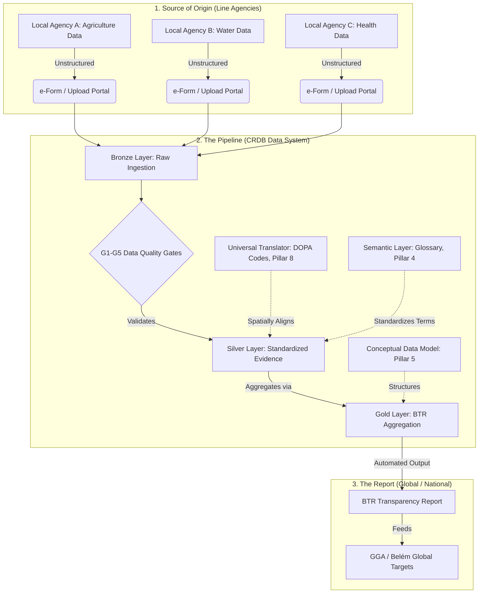

# Use Case: BTR M&E Reporting Pipeline

**Date:** 2026-07-06
**Status:** DRAFT (Conceptual Design)
**Domain:** Pillar 2 (Use Cases & Functional Specs)

## 1. Context & Assumptions

### Declarations of Unknowns & Core Assumptions

> [!WARNING] 
> **What we don't know:**
> *   **Exact BTR Adaptation Chapter Granularity:** The precise mandatory UNFCCC indicators for Thailand's specific 5NC/2BTR submission versus what is voluntary.
> *   **Line Agency IT Maturity:** The exact capabilities of focal point agencies (e.g., DDPM, TMD) to utilize APIs versus manual uploads.
> *   **The Final BTR Templates:** The exact layout of the reporting templates that the UNFCCC portal requires.
> 
> **Working Assumptions:**
> *   **BTR Requirements:** We assume the core BTR requirements revolve around tracking NAP implementation progress, demonstrating vulnerability reduction, and outlining adaptation action outcomes (linked to GGA/Belém targets).
> *   **Data Entry Point:** We assume line agencies will primarily interact with the system via structured, web-based e-forms (Service Packages) or bulk CSV uploads, rather than complex API integrations initially.
> *   **Contribution over Attribution:** We assume the BTR will rely on "contribution analysis" (showing how local actions contribute to resilience) rather than strict scientific attribution.

---

## 2. The Problem: The Ad-Hoc Focal Point Trap
Currently, data collection relies on **"Spreadsheet Ping-Pong"**. 
1. The reporting agency sends out an unstructured data request to focal points.
2. Line agencies manually search their internal, isolated systems and paste data into spreadsheets.
3. The data lacks spatial alignment (e.g., one agency uses province names, another uses zip codes) and semantic consistency (e.g., "drought severity" means different things to different agencies).
4. As a result, compiling the national report requires months of manual human synthesis, and the final numbers cannot be easily traced back to their origin.

---

## 3. The Conceptual Solution: The Federated M&E Pipeline
By combining the **Global Targets Framework** (mapping local actions to global goals) with the **CRDB Architectural Pillars**, we transition to a structured pipeline. The system does not force agencies to change how they collect data internally; it forces them to change how they *interface* with the national system.

## 4. Step-by-Step Transition 

### Step A: Source of Origin (The Entry Point)
Instead of open-ended data requests, line agencies log into a dedicated portal (the CRDB UI). They input their raw metrics (e.g., "number of farmers trained in province X") via predefined **e-forms**. This removes the ad-hoc nature of data calls. The data enters the **Bronze Layer** exactly as submitted, preserving the original evidence base.

### Step B: The Governance Gates & Standardization (Silver Layer)
Before the data can be used for the BTR, it hits the **G1-G5 Data Quality Gates**. 
*   **The Universal Translator (Pillar 8):** The system automatically tags the incoming data with standardized spatial codes (DOPA codes). If an agency submits data using an obsolete district name, the system maps it to the universal standard.
*   **Semantic Layer (Pillar 4):** A local metric for "crop failure" is mapped to the national terminology required by the BTR. 

*This step is critical: it translates local, context-specific metrics into a unified national language.*

### Step C: The Aggregation Hub (Gold Layer & The CDM)
Once the data is standardized in the Silver layer, the **Conceptual Data Model (Pillar 5)** takes over. Because the CDM has been explicitly designed with **A-BTR Integration** in mind (as per Phase 2 plans), it knows how to group these standardized metrics. 
For example, it automatically groups the agricultural, water, and health data into the designated "Adaptation Actions" or "Vulnerabilities" entities required by the UNFCCC.

### Step D: The Automated Output (The BTR Report)
Because the pipeline enforces structure from the moment of ingestion, the BTR generation shifts from a *manual synthesis task* to an *automated query*. 

When the time comes to submit the BTR, the system can instantly generate a report that aligns with **GGA/Belém global targets**, proving *contribution* rather than getting bogged down in *attribution*. Every figure in the BTR can be clicked to trace its lineage back through the CDM, past the DQ gates, and straight to the specific line agency focal point who submitted it.
