# Common Data Model (CDM) ERD Drafts (Lightweight & MVD Synced)

**Date**: 2026-07-13  
**Context**: Bossax/arun_creagy  

This document presents the **DCCE Common Data Model (CDM)** under the streamlined, lightweight metadata-driven design, with the **Disaster Impact / Loss & Damage** domain (`DOM_024`) fully synchronized with the three-layer **Loss & Damage Model (LDM) Minimum Viable Dataset (MVD)** design.

---

## 1. Unified Full CDM ERDi

This integrated diagram maps the entire lightweight architecture showing how all 8 domains (Essential Variables, Hazards, Exposure, Risk, Disaster Impact, Resilience, Planning, and Monitoring/MEL) connect.

```mermaid
erDiagram
    %% ================================================================
    %% 1. ESSENTIAL_VARIABLES (DOM_EV)
    %% ================================================================
    METEOROLOGICAL_OBSERVATION {
        UUID meteorological_observation_id
        UUID spatial_unit_id FK
        VARCHAR metric_name
        REAL value_numeric
        VARCHAR unit
        TIMESTAMP time_period
    }
    
    CLIMATE_DRIVER {
        UUID climate_driver_id
        UUID spatial_unit_id FK
        VARCHAR metric_name
        REAL value_numeric
        VARCHAR unit
        VARCHAR governance_authority
    }

    ENVIRONMENTAL_DATA {
        UUID environmental_data_id
        UUID spatial_unit_id FK
        UUID institutional_body_id FK
        VARCHAR dataset_name
        VARCHAR variable_category
        VARCHAR governing_authority
        VARCHAR quality_rating
        VARCHAR metadata_url
    }

    %% ================================================================
    %% 2. HAZARD & MODELING (DOM_HAZ)
    %% ================================================================
    CLIMATE_SCENARIO {
        UUID climate_scenario_id
        VARCHAR scenario_label
    }
    
    CLIMATE_PROJECTION {
        UUID climate_projection_id
        UUID climate_scenario_id FK
        UUID climate_driver_id FK
        UUID spatial_unit_id FK
        REAL projected_value_numeric
        VARCHAR time_horizon
    }
    
    HAZARDOUS_EVENT {
        UUID hazardous_event_id
        VARCHAR event_type
    }
    
    HAZARD_MODELS {
        UUID hazard_model_id
        VARCHAR model_name
    }
    
    HAZARD_MAP {
        UUID hazard_map_id
        UUID hazard_model_id FK
        UUID spatial_unit_id FK
        VARCHAR intensity_layer_path
    }

    %% ================================================================
    %% 3. VULNERABILITY & EXPOSURE (DOM_022)
    %% ================================================================
    SPATIAL_UNIT {
        UUID spatial_unit_id
        VARCHAR admin_code
        VARCHAR geolevel
    }
    
    EXPOSED_ASSET {
        UUID exposed_asset_id
        UUID spatial_unit_id FK
        VARCHAR asset_type
    }
    
    VULNERABILITY_FRAMEWORK {
        UUID vulnerability_framework_id
        VARCHAR framework_name
    }
    
    VULNERABILITY_DIMENSION {
        UUID vulnerability_dimension_id
        UUID vulnerability_framework_id FK
        VARCHAR dimension_name
    }
    
    VULNERABILITY_STRUCTURE {
        UUID vulnerability_structure_id
        UUID vulnerability_dimension_id FK
        UUID vulnerability_determinant_id FK
        REAL weight
    }
    
    VULNERABILITY_DETERMINANT {
        UUID vulnerability_determinant_id
        VARCHAR variable_name
    }
    
    IMPACT_FUNCTION {
        UUID impact_function_id
        UUID vulnerability_framework_id FK
        VARCHAR curve_parameters
    }

    %% ================================================================
    %% 4. RISK (DOM_023)
    %% ================================================================
    RISK_ANALYSIS {
        UUID risk_analysis_id
        UUID spatial_unit_id FK
        TIMESTAMP run_date
    }
    
    RISK_METRIC {
        UUID risk_metric_id
        UUID risk_analysis_id FK
        REAL expected_annual_loss
    }
    
    COMPOSITE_INDEX {
        UUID composite_index_id
        UUID risk_analysis_id FK
        REAL score
    }

    %% ================================================================
    %% 5. DISASTER IMPACT / LOSS & DAMAGE (DOM_024 - MVD Synced)
    %% ================================================================
    DISASTER_EVENT {
        UUID disaster_event_id
        UUID hazardous_event_id FK
        VARCHAR source_assessment_ref
        VARCHAR event_name
        DATE event_start_date
        DATE event_end_date
        INTEGER num_affected_pop
        INTEGER num_dead
        INTEGER num_missing
        INTEGER num_injured
        VARCHAR event_status
    }

    EVENT_LOCATION {
        UUID event_location_id
        UUID disaster_event_id FK
        UUID spatial_unit_id FK
        VARCHAR admin_level
        VARCHAR location_code
    }

    ASSESSMENT_CONTEXT {
        UUID assessment_context_id
        UUID disaster_event_id FK
        UUID institutional_body_id FK
        VARCHAR assessment_phase
        VARCHAR method_family
        VARCHAR review_status
        DATE assessment_date
    }

    LD_PHYSICAL_DAMAGE {
        UUID damage_record_id
        UUID assessment_context_id FK
        UUID disaster_event_id FK
        VARCHAR sector_id
        VARCHAR asset_type
        DECIMAL qty_destroyed
        DECIMAL qty_damaged
        DECIMAL unit_replacement_cost_thb
        DECIMAL monetary_damage_thb
    }

    LD_ECONOMIC_LOSS {
        UUID loss_record_id
        UUID assessment_context_id FK
        UUID disaster_event_id FK
        VARCHAR sector_id
        VARCHAR loss_category
        DATE analysis_horizon_start
        DATE analysis_horizon_end
        DECIMAL baseline_quantity_or_value
        DECIMAL actual_post_disaster_quantity_or_value
        DECIMAL monetary_loss_thb
    }

    LD_RECOVERY_RECONSTRUCTION_NEEDS {
        UUID needs_record_id
        UUID assessment_context_id FK
        UUID disaster_event_id FK
        VARCHAR sector_id
        VARCHAR needs_type
        VARCHAR time_horizon
        DECIMAL estimated_needs_thb
    }

    ENVIRONMENTAL_LOSS_RECORD {
        UUID environmental_loss_record_id
        UUID disaster_event_id FK
        REAL burned_area_rai
        REAL coral_bleaching_share
    }

    RELIEF_PAYMENT_RECORD {
        UUID relief_payment_record_id
        UUID disaster_event_id FK
        REAL advance_payment_thb
    }

    ATTRIBUTION_LINK {
        UUID attribution_link_id
        UUID disaster_event_id FK
        UUID climate_driver_id FK
        VARCHAR confidence_level
    }

    %% ================================================================
    %% 6. RESILIENCE (DOM_030)
    %% ================================================================
    RESILIENCE_FRAMEWORK {
        UUID resilience_framework_id
        VARCHAR framework_name
    }
    RESILIENCE_DIMENSION {
        UUID resilience_dimension_id
        UUID resilience_framework_id FK
        VARCHAR dimension_name
    }
    RESILIENCE_STRUCTURE {
        UUID resilience_structure_id
        UUID resilience_dimension_id FK
        UUID vulnerability_determinant_id FK
        REAL weight
    }
    RESILIENCE_ASSESSMENT {
        UUID resilience_assessment_id
        UUID spatial_unit_id FK
        REAL index_score
    }

    %% ================================================================
    %% 7. PLANNING & GOVERNANCE (DOM_040)
    %% ================================================================
    DECISION_CONTEXT {
        UUID decision_context_id
        VARCHAR planning_scope
    }
    INSTITUTIONAL_BODY {
        UUID institutional_body_id
        VARCHAR agency_name
        VARCHAR focal_point_role
    }
    ADAPTATION_PORTFOLIO {
        UUID adaptation_portfolio_id
        UUID decision_context_id FK
        VARCHAR portfolio_name
    }
    ADAPTATION_OPTION {
        UUID adaptation_option_id
        UUID adaptation_portfolio_id FK
        VARCHAR option_type
    }
    APPRAISAL_EVENT {
        UUID appraisal_event_id
        UUID adaptation_option_id FK
        VARCHAR appraisal_method
    }
    APPRAISAL_METRIC {
        UUID appraisal_metric_id
        UUID appraisal_event_id FK
        REAL cost_benefit_ratio
    }
    ADAPTATION_PROJECT {
        UUID adaptation_project_id
        UUID adaptation_option_id FK
        UUID institutional_body_id FK
        VARCHAR project_name
    }

    %% ================================================================
    %% 8. MONITORING, EVALUATION & LEARNING (DOM_050)
    %% ================================================================
    ADAPTATION_OUTPUT {
        UUID adaptation_output_id
        UUID adaptation_project_id FK
        VARCHAR output_metric_name
        REAL value_numeric
    }
    ADAPTATION_OUTCOME {
        UUID adaptation_outcome_id
        UUID adaptation_project_id FK
        VARCHAR outcome_indicator_name
        REAL resilience_delta
    }
    BUDGET_TAG_RECORD {
        UUID budget_tag_record_id
        UUID adaptation_project_id FK
        REAL allocated_budget_thb
        VARCHAR budget_code
    }
    SUPPORT_TRACKING_RECORD {
        UUID support_tracking_record_id
        UUID adaptation_project_id FK
        REAL amount_received
    }
    FUNDING_SOURCE {
        UUID funding_source_id
        UUID adaptation_project_id FK
        VARCHAR source_name
    }
    RISK_TOLERANCE_PROFILE {
        UUID risk_tolerance_profile_id
        UUID decision_context_id FK
        VARCHAR tolerance_threshold
    }


    %% ================================================================
    %% Relational Integration Links
    %% ================================================================
    
    %% Spatial Anchoring
    SPATIAL_UNIT ||--o{ METEOROLOGICAL_OBSERVATION : anchors
    SPATIAL_UNIT ||--o{ CLIMATE_DRIVER : anchors
    SPATIAL_UNIT ||--o{ ENVIRONMENTAL_DATA : anchors
    SPATIAL_UNIT ||--o{ CLIMATE_PROJECTION : bounds
    SPATIAL_UNIT ||--o{ HAZARD_MAP : locates
    SPATIAL_UNIT ||--o{ EXPOSED_ASSET : contains
    SPATIAL_UNIT ||--o{ RISK_ANALYSIS : evaluated_at
    SPATIAL_UNIT ||--o{ DISASTER_EVENT : anchors
    SPATIAL_UNIT ||--o{ EVENT_LOCATION : references
    SPATIAL_UNIT ||--o{ RESILIENCE_ASSESSMENT : calculated_at

    %% Governance & Ownership
    INSTITUTIONAL_BODY ||--o{ ENVIRONMENTAL_DATA : curates
    INSTITUTIONAL_BODY ||--o{ ADAPTATION_PROJECT : manages
    INSTITUTIONAL_BODY ||--o{ ASSESSMENT_CONTEXT : conducts

    %% Modeling Inputs & Forcings
    CLIMATE_SCENARIO ||--o{ CLIMATE_PROJECTION : drives
    CLIMATE_DRIVER ||--o{ CLIMATE_PROJECTION : projects
    CLIMATE_DRIVER ||--o{ HAZARD_MODELS : forces
    ENVIRONMENTAL_DATA ||--o{ HAZARD_MODELS : inputs_to
    HAZARD_MODELS ||--o{ HAZARD_MAP : simulates

    %% Vulnerability & Impact Curves
    VULNERABILITY_FRAMEWORK ||--o{ VULNERABILITY_DIMENSION : structured_by
    VULNERABILITY_DIMENSION ||--o{ VULNERABILITY_STRUCTURE : maps
    VULNERABILITY_DETERMINANT ||--o{ VULNERABILITY_STRUCTURE : populates
    VULNERABILITY_FRAMEWORK ||--o{ IMPACT_FUNCTION : defines

    %% Risk Pipeline
    RISK_ANALYSIS ||--o{ RISK_METRIC : output
    RISK_ANALYSIS ||--o{ COMPOSITE_INDEX : scores

    %% L&D Relational Structure (MVD Layered)
    HAZARDOUS_EVENT ||--o{ DISASTER_EVENT : realizes
    DISASTER_EVENT ||--o{ EVENT_LOCATION : locates
    DISASTER_EVENT ||--o{ ASSESSMENT_CONTEXT : assesses
    ASSESSMENT_CONTEXT ||--o{ LD_PHYSICAL_DAMAGE : validates
    ASSESSMENT_CONTEXT ||--o{ LD_ECONOMIC_LOSS : validates
    ASSESSMENT_CONTEXT ||--o{ LD_RECOVERY_RECONSTRUCTION_NEEDS : estimates
    
    DISASTER_EVENT ||--o{ LD_PHYSICAL_DAMAGE : anchors
    DISASTER_EVENT ||--o{ LD_ECONOMIC_LOSS : anchors
    DISASTER_EVENT ||--o{ LD_RECOVERY_RECONSTRUCTION_NEEDS : anchors
    
    DISASTER_EVENT ||--o{ ENVIRONMENTAL_LOSS_RECORD : damages
    DISASTER_EVENT ||--o{ RELIEF_PAYMENT_RECORD : funds
    DISASTER_EVENT ||--o{ ATTRIBUTION_LINK : attributes
    CLIMATE_DRIVER ||--o{ ATTRIBUTION_LINK : attributes_to

    %% Resilience Assessments
    RESILIENCE_FRAMEWORK ||--o{ RESILIENCE_DIMENSION : structured_by
    RESILIENCE_DIMENSION ||--o{ RESILIENCE_STRUCTURE : weight_map
    VULNERABILITY_DETERMINANT ||--o{ RESILIENCE_STRUCTURE : populates

    %% Planning, Evaluation & Projects
    DECISION_CONTEXT ||--o{ ADAPTATION_PORTFOLIO : context_for
    ADAPTATION_PORTFOLIO ||--o{ ADAPTATION_OPTION : groups
    ADAPTATION_OPTION ||--o{ APPRAISAL_EVENT : evaluates
    APPRAISAL_EVENT ||--o{ APPRAISAL_METRIC : outputs
    ADAPTATION_OPTION ||--o{ ADAPTATION_PROJECT : instantiates

    %% Monitoring, Evaluation & Learning (MEL)
    ADAPTATION_PROJECT ||--o{ ADAPTATION_OUTPUT : generates
    ADAPTATION_PROJECT ||--o{ ADAPTATION_OUTCOME : achieves
    ADAPTATION_PROJECT ||--o{ BUDGET_TAG_RECORD : tags
    ADAPTATION_PROJECT ||--o{ SUPPORT_TRACKING_RECORD : receives
    ADAPTATION_PROJECT ||--o{ FUNDING_SOURCE : funded_by
    DECISION_CONTEXT ||--o{ RISK_TOLERANCE_PROFILE : limits
```

---

## 2. Digestible Split Views

### 🌐 View 1: Hazard Pipeline (Inputs, Hazards, Exposure & Risk)
This handles baseline observations, the unified `ENVIRONMENTAL_DATA` metadata catalog, hazard models/projections, exposed assets, and vulnerability/risk assessments.

```mermaid
erDiagram
    %% BASELINES & VARIABLES (DOM_EV - Streamlined)
    METEOROLOGICAL_OBSERVATION {
        UUID meteorological_observation_id
        UUID spatial_unit_id FK
        VARCHAR metric_name
        REAL value_numeric
        VARCHAR unit
        TIMESTAMP time_period
    }
    
    CLIMATE_DRIVER {
        UUID climate_driver_id
        UUID spatial_unit_id FK
        VARCHAR metric_name
        REAL value_numeric
        VARCHAR unit
        VARCHAR governance_authority
    }

    ENVIRONMENTAL_DATA {
        UUID environmental_data_id
        UUID spatial_unit_id FK
        UUID institutional_body_id FK
        VARCHAR dataset_name
        VARCHAR variable_category
        VARCHAR governing_authority
        VARCHAR quality_rating
        VARCHAR metadata_url
    }

    %% HAZARD & MODELING (DOM_HAZ)
    CLIMATE_SCENARIO {
        UUID climate_scenario_id
        VARCHAR scenario_label
    }
    
    CLIMATE_PROJECTION {
        UUID climate_projection_id
        UUID climate_scenario_id FK
        UUID climate_driver_id FK
        UUID spatial_unit_id FK
        REAL projected_value_numeric
        VARCHAR time_horizon
    }
    
    HAZARDOUS_EVENT {
        UUID hazardous_event_id
        VARCHAR event_type
    }
    
    HAZARD_MODELS {
        UUID hazard_model_id
        VARCHAR model_name
    }
    
    HAZARD_MAP {
        UUID hazard_map_id
        UUID hazard_model_id FK
        UUID spatial_unit_id FK
        VARCHAR intensity_layer_path
    }

    %% VULNERABILITY & EXPOSURE (DOM_022)
    SPATIAL_UNIT {
        UUID spatial_unit_id
        VARCHAR admin_code
        VARCHAR geolevel
    }
    
    EXPOSED_ASSET {
        UUID exposed_asset_id
        UUID spatial_unit_id FK
        VARCHAR asset_type
    }
    
    VULNERABILITY_FRAMEWORK {
        UUID vulnerability_framework_id
        VARCHAR framework_name
    }
    
    VULNERABILITY_DIMENSION {
        UUID vulnerability_dimension_id
        UUID vulnerability_framework_id FK
        VARCHAR dimension_name
    }
    
    VULNERABILITY_STRUCTURE {
        UUID vulnerability_structure_id
        UUID vulnerability_dimension_id FK
        UUID vulnerability_determinant_id FK
        REAL weight
    }
    
    VULNERABILITY_DETERMINANT {
        UUID vulnerability_determinant_id
        VARCHAR variable_name
    }
    
    IMPACT_FUNCTION {
        UUID impact_function_id
        UUID vulnerability_framework_id FK
        VARCHAR curve_parameters
    }

    %% RISK (DOM_023)
    RISK_ANALYSIS {
        UUID risk_analysis_id
        UUID spatial_unit_id FK
        TIMESTAMP run_date
    }
    
    RISK_METRIC {
        UUID risk_metric_id
        UUID risk_analysis_id FK
        REAL expected_annual_loss
    }
    
    COMPOSITE_INDEX {
        UUID composite_index_id
        UUID risk_analysis_id FK
        REAL score
    }

    %% Helper link
    INSTITUTIONAL_BODY {
        UUID institutional_body_id
    }

    %% Relationships
    SPATIAL_UNIT ||--o{ METEOROLOGICAL_OBSERVATION : anchors
    SPATIAL_UNIT ||--o{ CLIMATE_DRIVER : anchors
    SPATIAL_UNIT ||--o{ ENVIRONMENTAL_DATA : anchors
    INSTITUTIONAL_BODY ||--o{ ENVIRONMENTAL_DATA : curates

    CLIMATE_SCENARIO ||--o{ CLIMATE_PROJECTION : drives
    CLIMATE_DRIVER ||--o{ CLIMATE_PROJECTION : projects
    SPATIAL_UNIT ||--o{ CLIMATE_PROJECTION : bounds

    ENVIRONMENTAL_DATA ||--o{ HAZARD_MODELS : inputs_to
    CLIMATE_DRIVER ||--o{ HAZARD_MODELS : forces
    HAZARD_MODELS ||--o{ HAZARD_MAP : simulates
    SPATIAL_UNIT ||--o{ HAZARD_MAP : locates

    SPATIAL_UNIT ||--o{ EXPOSED_ASSET : contains
    VULNERABILITY_FRAMEWORK ||--o{ VULNERABILITY_DIMENSION : structured_by
    VULNERABILITY_DIMENSION ||--o{ VULNERABILITY_STRUCTURE : maps
    VULNERABILITY_DETERMINANT ||--o{ VULNERABILITY_STRUCTURE : populates
    VULNERABILITY_FRAMEWORK ||--o{ IMPACT_FUNCTION : defines

    RISK_ANALYSIS ||--o{ RISK_METRIC : output
    RISK_ANALYSIS ||--o{ COMPOSITE_INDEX : scores
    SPATIAL_UNIT ||--o{ RISK_ANALYSIS : evaluated_at
```

### 🛠️ View 2: Response & Action Pipeline (Disasters, Resilience, Planning & MEL)
This handles actual disaster impacts (Loss & Damage), attribution analysis, resilience frameworks, adaptation decisions, budget tagging, and implementation tracking (outputs/outcomes).

```mermaid
erDiagram
    %% Bridge / Reference Entities from Hazard Pipeline
    SPATIAL_UNIT {
        UUID spatial_unit_id
    }
    CLIMATE_DRIVER {
        UUID climate_driver_id
    }
    HAZARDOUS_EVENT {
        UUID hazardous_event_id
    }
    VULNERABILITY_DETERMINANT {
        UUID vulnerability_determinant_id
    }
    ENVIRONMENTAL_DATA {
        UUID environmental_data_id
    }

    %% DISASTER IMPACT / LOSS & DAMAGE (DOM_024 - MVD Synced)
    DISASTER_EVENT {
        UUID disaster_event_id
        UUID hazardous_event_id FK
        VARCHAR source_assessment_ref
        VARCHAR event_name
        DATE event_start_date
        DATE event_end_date
        INTEGER num_affected_pop
        INTEGER num_dead
        INTEGER num_missing
        INTEGER num_injured
        VARCHAR event_status
    }

    EVENT_LOCATION {
        UUID event_location_id
        UUID disaster_event_id FK
        UUID spatial_unit_id FK
        VARCHAR admin_level
        VARCHAR location_code
    }

    ASSESSMENT_CONTEXT {
        UUID assessment_context_id
        UUID disaster_event_id FK
        UUID institutional_body_id FK
        VARCHAR assessment_phase
        VARCHAR method_family
        VARCHAR review_status
        DATE assessment_date
    }

    LD_PHYSICAL_DAMAGE {
        UUID damage_record_id
        UUID assessment_context_id FK
        UUID disaster_event_id FK
        VARCHAR sector_id
        VARCHAR asset_type
        DECIMAL qty_destroyed
        DECIMAL qty_damaged
        DECIMAL unit_replacement_cost_thb
        DECIMAL monetary_damage_thb
    }

    LD_ECONOMIC_LOSS {
        UUID loss_record_id
        UUID assessment_context_id FK
        UUID disaster_event_id FK
        VARCHAR sector_id
        VARCHAR loss_category
        DATE analysis_horizon_start
        DATE analysis_horizon_end
        DECIMAL baseline_quantity_or_value
        DECIMAL actual_post_disaster_quantity_or_value
        DECIMAL monetary_loss_thb
    }

    LD_RECOVERY_RECONSTRUCTION_NEEDS {
        UUID needs_record_id
        UUID assessment_context_id FK
        UUID disaster_event_id FK
        VARCHAR sector_id
        VARCHAR needs_type
        VARCHAR time_horizon
        DECIMAL estimated_needs_thb
    }

    ENVIRONMENTAL_LOSS_RECORD {
        UUID environmental_loss_record_id
        UUID disaster_event_id FK
        REAL burned_area_rai
        REAL coral_bleaching_share
    }

    RELIEF_PAYMENT_RECORD {
        UUID relief_payment_record_id
        UUID disaster_event_id FK
        REAL advance_payment_thb
    }

    ATTRIBUTION_LINK {
        UUID attribution_link_id
        UUID disaster_event_id FK
        UUID climate_driver_id FK
        VARCHAR confidence_level
    }

    %% RESILIENCE (DOM_030)
    RESILIENCE_FRAMEWORK {
        UUID resilience_framework_id
        VARCHAR framework_name
    }
    RESILIENCE_DIMENSION {
        UUID resilience_dimension_id
        UUID resilience_framework_id FK
        VARCHAR dimension_name
    }
    RESILIENCE_STRUCTURE {
        UUID resilience_structure_id
        UUID resilience_dimension_id FK
        UUID vulnerability_determinant_id FK
        REAL weight
    }
    RESILIENCE_ASSESSMENT {
        UUID resilience_assessment_id
        UUID spatial_unit_id FK
        REAL index_score
    }

    %% PLANNING & GOVERNANCE (DOM_040)
    DECISION_CONTEXT {
        UUID decision_context_id
        VARCHAR planning_scope
    }
    INSTITUTIONAL_BODY {
        UUID institutional_body_id
        VARCHAR agency_name
        VARCHAR focal_point_role
    }
    ADAPTATION_PORTFOLIO {
        UUID adaptation_portfolio_id
        UUID decision_context_id FK
        VARCHAR portfolio_name
    }
    ADAPTATION_OPTION {
        UUID adaptation_option_id
        UUID adaptation_portfolio_id FK
        VARCHAR option_type
    }
    APPRAISAL_EVENT {
        UUID appraisal_event_id
        UUID adaptation_option_id FK
        VARCHAR appraisal_method
    }
    APPRAISAL_METRIC {
        UUID appraisal_metric_id
        UUID appraisal_event_id FK
        REAL cost_benefit_ratio
    }
    ADAPTATION_PROJECT {
        UUID adaptation_project_id
        UUID adaptation_option_id FK
        UUID institutional_body_id FK
        VARCHAR project_name
    }

    %% MEL (DOM_050)
    ADAPTATION_OUTPUT {
        UUID adaptation_output_id
        UUID adaptation_project_id FK
        VARCHAR output_metric_name
        REAL value_numeric
    }
    ADAPTATION_OUTCOME {
        UUID adaptation_outcome_id
        UUID adaptation_project_id FK
        VARCHAR outcome_indicator_name
        REAL resilience_delta
    }
    BUDGET_TAG_RECORD {
        UUID budget_tag_record_id
        UUID adaptation_project_id FK
        REAL allocated_budget_thb
        VARCHAR budget_code
    }
    SUPPORT_TRACKING_RECORD {
        UUID support_tracking_record_id
        UUID adaptation_project_id FK
        REAL amount_received
    }
    FUNDING_SOURCE {
        UUID funding_source_id
        UUID adaptation_project_id FK
        VARCHAR source_name
    }
    RISK_TOLERANCE_PROFILE {
        UUID risk_tolerance_profile_id
        UUID decision_context_id FK
        VARCHAR tolerance_threshold
    }

    %% Relationships
    HAZARDOUS_EVENT ||--o{ DISASTER_EVENT : realized_as
    SPATIAL_UNIT ||--o{ DISASTER_EVENT : anchors
    DISASTER_EVENT ||--o{ EVENT_LOCATION : locates
    DISASTER_EVENT ||--o{ ASSESSMENT_CONTEXT : assesses
    ASSESSMENT_CONTEXT ||--o{ LD_PHYSICAL_DAMAGE : validates
    ASSESSMENT_CONTEXT ||--o{ LD_ECONOMIC_LOSS : validates
    ASSESSMENT_CONTEXT ||--o{ LD_RECOVERY_RECONSTRUCTION_NEEDS : estimates
    
    DISASTER_EVENT ||--o{ LD_PHYSICAL_DAMAGE : anchors
    DISASTER_EVENT ||--o{ LD_ECONOMIC_LOSS : anchors
    DISASTER_EVENT ||--o{ LD_RECOVERY_RECONSTRUCTION_NEEDS : anchors
    
    DISASTER_EVENT ||--o{ ENVIRONMENTAL_LOSS_RECORD : damages
    DISASTER_EVENT ||--o{ RELIEF_PAYMENT_RECORD : funds
    DISASTER_EVENT ||--o{ ATTRIBUTION_LINK : attributes
    CLIMATE_DRIVER ||--o{ ATTRIBUTION_LINK : attributes_to

    RESILIENCE_FRAMEWORK ||--o{ RESILIENCE_DIMENSION : structured_by
    RESILIENCE_DIMENSION ||--o{ RESILIENCE_STRUCTURE : weight_map
    VULNERABILITY_DETERMINANT ||--o{ RESILIENCE_STRUCTURE : populates
    SPATIAL_UNIT ||--o{ RESILIENCE_ASSESSMENT : calculated_at

    DECISION_CONTEXT ||--o{ ADAPTATION_PORTFOLIO : context_for
    ADAPTATION_PORTFOLIO ||--o{ ADAPTATION_OPTION : groups
    ADAPTATION_OPTION ||--o{ APPRAISAL_EVENT : evaluates
    APPRAISAL_EVENT ||--o{ APPRAISAL_METRIC : outputs
    ADAPTATION_OPTION ||--o{ ADAPTATION_PROJECT : instantiates
    INSTITUTIONAL_BODY ||--o{ ADAPTATION_PROJECT : manages
    INSTITUTIONAL_BODY ||--o{ ENVIRONMENTAL_DATA : custodians

    ADAPTATION_PROJECT ||--o{ ADAPTATION_OUTPUT : generates
    ADAPTATION_PROJECT ||--o{ ADAPTATION_OUTCOME : achieves
    ADAPTATION_PROJECT ||--o{ BUDGET_TAG_RECORD : tags
    ADAPTATION_PROJECT ||--o{ SUPPORT_TRACKING_RECORD : receives
    ADAPTATION_PROJECT ||--o{ FUNDING_SOURCE : funded_by
    DECISION_CONTEXT ||--o{ RISK_TOLERANCE_PROFILE : limits
```

