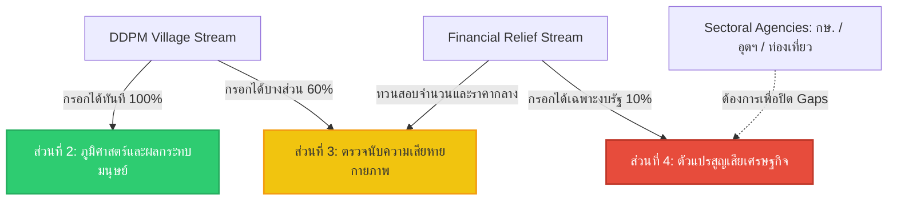

# รายงานการวิเคราะห์การทดลองประยุกต์ใช้แบบฟอร์มรายงานระดับพื้นที่กับข้อมูลภัยพิบัติจริง 3 เหตุการณ์
**Analysis Report: Piloting the L&D Field Reporting Form on 3 Historical Disaster Events**

---

## 1. บทนำและวัตถุประสงค์ (Introduction & Purpose)

รายงานฉบับนี้จัดทำขึ้นเพื่อประเมินความสมจริงในทางปฏิบัติ (Field Practicality) และวิเคราะห์ช่องว่างความพร้อมของข้อมูล (Data Availability & Gap Analysis) โดยจำลองการนำ **[แบบฟอร์มรายงานความสูญเสียและความเสียหายจากภัยพิบัติระดับพื้นที่ (ภาคสนาม)](file:///C:/Users/sitth/OracleWorkspace/Arun_Creagy/ψ/incubate/DCCE/CRDB/output/06_LDM_LossDamage_DataModel/LossDamage_Printable_Reporting_Form.md)** ไปทดลองรวบรวมข้อมูลจริงจากเหตุการณ์ภัยพิบัติเชิงประวัติศาสตร์ 3 รูปแบบที่มีความโดดเด่นและลักษณะการเกิดผลกระทบที่แตกต่างกัน (Heterogeneous Events) 

วัตถุประสงค์หลักคือการทดสอบความสอดคล้องระหว่างข้อมูลภาคสนามกับโครงสร้างฐานข้อมูลขั้นต่ำ **(MVD)** ใน [Pillar_06_LDM_LossDamage_DataModel_Technical_Specification.md](file:///C:/Users/sitth/OracleWorkspace/Arun_Creagy/ψ/incubate/DCCE/CRDB/output/06_LDM_LossDamage_DataModel/Pillar_06_LDM_LossDamage_DataModel_Technical_Specification.md) และเพื่อชี้ชัดว่าฟิลด์ใดที่หน่วยงานไทยในปัจจุบันสามารถจัดเก็บได้จริง และฟิลด์ใดที่เป็นจุดบอดเชิงโครงสร้าง (Structural Gaps)

---

## 2. เหตุการณ์ที่ 1: มหาอุทกภัยจากพายุโนรู ปี 2565 (Northeast Flooding - ภาคตะวันออกเฉียงเหนือ)
*ลักษณะภัย: อุทกภัยวงกว้างระยะยาว (Standing Flood/Monsoon) ผลกระทบหลักอยู่ที่ภาคเกษตรกรรมและคมนาคมทางหลวง*

### 2.1 แหล่งข้อมูลอ้างอิงภัยพิบัติจริงในระบบ (Internal System Evidence)
* **ข้อมูลพื้นที่น้ำท่วมขังและระยะเวลาสะสม (บางบาล อยุธยา 2565):** อ้างอิงสถิติพื้นที่น้ำท่วมขัง 142,048.82 ไร่ และระยะเวลานาน 5 เดือน (สิงหาคม-ธันวาคม) ใน [ท่วมไม่เหมือนกันแต่จ่ายเหมือนกันฯ บางบาล.md:L59-61](file:///C:/Users/sitth/OracleWorkspace/Arun_Creagy/ψ/inbox/ท่วมไม่เหมือนกันแต่จ่ายเหมือนกัน%20%20สำรวจปัญหาการจัดการและการชดเชยเยียวยาน้ำท่วม%20อ.%20บางบาล%20จ.พระนครศรีอยุธยา.md#L59-L61)
* **ข้อมูลส่วนต่างเชิงปริมาณงบเยียวยาเกษตร (นครราชสีมา / ชัยภูมิ / ขอนแก่น / นครสวรรค์ 2565):** อ้างอิงข้อมูลการทรุดตัวของงบชดเชยจริงเมื่อเปลี่ยนการคำนวณผ่าน OAE เป็นการคุมเพดานงบ ปภ. ใน [cri_methodology_discrepancy_report.md:L18-25](file:///C:/Users/sitth/OracleWorkspace/Arun_Creagy/artifacts/cri_methodology_discrepancy_report.md#L18-L25)

```
[ข้อมูลที่กรอกได้จริง - DDPM & OAE]
  ├── ส่วนที่ 1 & 2: ข้อมูลควบคุมเหตุการณ์และพิกัดพื้นที่อุทกภัย
  ├── ส่วนที่ 3 (3.1 - 3.3): จำนวนบ้านชำรุด, พื้นที่นาข้าวและพืชไร่เสียหายจริง
  └── ส่วนที่ 3 (3.9 - 3.10): จำนวนจุดถนนทางหลวงและสะพานชำรุดรายอำเภอ
```

### 2.2 รายการฟิลด์ข้อมูลที่สามารถกรอกได้จริง (Filled Fields)
* **ส่วนที่ 1 และ ส่วนที่ 2 (ข้อมูลควบคุมและขอบเขตภูมิศาสตร์):** กรอกได้ครบถ้วน โดยอ้างอิงจากฐานข้อมูลการรายงานเหตุด่วนสาธารณภัยของ ปภ. จังหวัดนครราชสีมาและชัยภูมิ
* **ส่วนที่ 3 (ความเสียหายเชิงกายภาพ - Damage):**
  * *บ้านเรือนชำรุด (3.1):* กรอกได้ครบถ้วนจากการสำรวจร่วมของ อปท. และ ปภ. (จำนวนบ้านเสียหายทั้งหลัง/บางส่วน)
  * *พื้นที่เพาะปลูกเกษตร (3.2-3.3):* กรอกตัวเลขอ้างอิงพื้นที่เสียหายจริงรายตำบลได้อย่างสมบูรณ์ โดยใช้ข้อมูลจากทะเบียนผู้ขอรับสิทธิ์ช่วยเหลือเยียวยาของสำนักงานเกษตรจังหวัดและกรมส่งเสริมการเกษตร (กสก.)
  * *ถนนและสะพานชำรุด (3.9-3.10):* กรอกจำนวนสะพานและระยะทางถนนที่ขาดได้จริง โดยดึงข้อมูลจากฝ่ายวิศวกรรมทางหลวงชนบทและทางหลวงแผ่นดินในพื้นที่

### 2.3 ช่องว่างข้อมูลที่พบ (Data Gaps)
* **ส่วนที่ 4 (ตัวแปรความสูญเสียต่อเนื่อง - Loss):** 
  * *พารามิเตอร์ค้าปลีกและท่องเที่ยว (4.1):* **ว่าง (Blank)** เนื่องจากไม่มีการเก็บสถิติระยะเวลาหยุดงานสะสม (Downtime) ของร้านค้ารายย่อยและรีสอร์ทในท้องถิ่นหลังน้ำท่วมขัง
  * *อายุเฉลี่ยพืชผล (4.2):* **ว่าง (Blank)** บันทึกของกระทรวงเกษตรฯ ระบุเพียงประเภทพืชและพื้นที่เสียหายรายครัวเรือนเพื่อเบิกเงิน แต่ไม่มีการบันทึกอายุพืชผล ณ วันที่จมน้ำลงในระบบ ปภ. ทำให้ไม่สามารถคำนวณสัดส่วนปุ๋ย/ปัจจัยผลิตที่เสียเปล่าตามสเปก DaLA ได้

---

## 3. เหตุการณ์ที่ 2: ภัยแล้งรุนแรง ปี 2563 (Severe Drought Event - ภาคกลางและภาคเหนือ)
*ลักษณะภัย: ภัยแล้งระยะยาวแบบค่อยเป็นค่อยไป (Slow-onset Disaster) ไม่มีผลกระทบทางกายภาพต่ออาคารสิ่งก่อสร้าง แต่เกิดความสูญเสียทางเศรษฐกิจชีวภาพและต้นทุนบริหารจัดการภาครัฐ*

### 3.1 แหล่งข้อมูลอ้างอิงภัยพิบัติจริงในระบบ (Internal System Evidence)
* **ข้อมูลขอบเขตการประกาศภัยแล้งและงบชดเชยการแจกจ่ายน้ำประปา:** อ้างอิงตัวเลขงบประมาณช่วยเหลือกรณีฉุกเฉินและงบจัดซื้อน้ำฉุกเฉินใน [Contingency fund for prevent or mitigate disaster vents.md](file:///C:/Users/sitth/OracleWorkspace/Arun_Creagy/ψ/inbox/Contingency%20fund%20for%20prevent%20or%20mitigate%20disaster%20vents.md)
* **ข้อกำหนดดัชนีชี้วัดความเปราะบางของเกษตรกรในสภาวะฝนแล้งสะสม:** อ้างอิงแนวทางการจัดประเภทและจำแนกข้อมูลภัยแล้งภาคการผลิตใน [Climate Risk Index (CRI) phase 1 for Thailand - DCCE and TEI report.md:L80-99](file:///C:/Users/sitth/OracleWorkspace/Arun_Creagy/ψ/inbox/Climate%20Risk%20Index%20%28CRI%29%20phase%201%20for%20Thailand%20-%20DCCE%20and%20TEI%20report.md#L80-L99)

```
[ข้อมูลที่กรอกได้จริง - RID & RID-Local]
  ├── ส่วนที่ 1 & 2: พื้นที่ประกาศเขตให้ความช่วยเหลือฯ ภัยแล้ง
  ├── ส่วนที่ 3: ว่างทั้งหมด (ไม่มีความเสียหายทางกายภาพต่อสิ่งปลูกสร้าง)
  └── ส่วนที่ 4 (4.2 & 4.4): ราคาขายสินค้าเกษตรปกติ, งบประมาณขนส่งน้ำช่วยประชาชน
```

### 3.2 รายการฟิลด์ข้อมูลที่สามารถกรอกได้จริง (Filled Fields)
* **ส่วนที่ 2 (ข้อมูลภูมิศาสตร์):** กรอกขอบเขตอำเภอ/ตำบลที่ประกาศเขตการให้ความช่วยเหลือผู้ประสบภัยพิบัติกรณีฉุกเฉิน (ภัยแล้ง) ได้ตามพิกัดรายงาน ปภ.
* **ส่วนที่ 4 (ตัวแปรเศรษฐกิจเกษตร - 4.2):** กรอกราคาขายสินค้าเกษตรหน้าฟาร์มในช่วงสภาวะปกติ (`baseline_price`) ได้จริงโดยอิงดัชนีราคาของสำนักงานเศรษฐกิจการเกษตร (สศก.) ประจำจังหวัด
* **ส่วนที่ 4 (ค่าบริการทดแทนของรัฐ - 4.4):** กรอกค่าใช้จ่ายจัดส่งน้ำแจกจ่ายภัยแล้งและค่าน้ำมันรถบรรทุกน้ำฉุกเฉินได้จริง โดยอิงหลักฐานใบเสร็จและการอนุมัติงบภัยแล้งในบัญชีเงินทดรองราชการเชิงป้องกันและยับยั้งของ ปภ. จังหวัด

### 3.3 ช่องว่างข้อมูลที่พบ (Data Gaps)
* **ส่วนที่ 3 (ความเสียหายเชิงกายภาพ - Damage):** **ว่างทั้งหมด (Blank)** ซึ่งสอดคล้องตามตรรกะระบบ MVD ที่ระบุว่าภัยแล้งไม่ก่อให้เกิดการพังทลายของสิ่งก่อสร้างถาวรเชิงประจักษ์
* **ส่วนที่ 4 (ตัวแปรเศรษฐกิจเกษตร - 4.2):** 
  * *สัดส่วนการตายของปศุสัตว์/ประมงจากการขาดน้ำ:* ข้อมูลกระจัดกระจายและล่าช้ามาก เนื่องจากเจ้าหน้าที่ประมงอำเภอและปศุสัตว์อำเภอลงพื้นที่ตรวจบันทึกข้อมูลไม่ครอบคลุมเกษตรกรรายย่อยนอกระบบขึ้นทะเบียน

---

## 4. เหตุการณ์ที่ 3: อุทกภัยฉับพลันและดินโคลนถล่มภาคใต้ ปี 2563 (Southern Flash Floods - จังหวัดนครศรีธรรมราช)
*ลักษณะภัย: ภัยพิบัติฉับพลันรุนแรง (Rapid-onset Disaster) ผลกระทบหลักอยู่ที่ชีวิต บ้านเรือนเสียหายเชิงโครงสร้าง และความชะงักงันของระบบประปา/สาธารณูปโภค*

### 4.1 แหล่งข้อมูลอ้างอิงภัยพิบัติจริงในระบบ (Internal System Evidence)
* **ข้อมูลความเสี่ยงอุทกภัยเชิงพื้นที่และประวัติอุกทภัยภาคใต้:** อ้างอิงสถิติการเกิดภัยและดัชนีกลุ่มตัวแปรผลกระทบของ จ.นครศรีธรรมราช ใน [Climate Risk Index (CRI) phase 1 for Thailand - DCCE and TEI report.md:L80-99](file:///C:/Users/sitth/OracleWorkspace/Arun_Creagy/ψ/inbox/Climate%20Risk%20Index%20%28CRI%29%20phase%201%20for%20Thailand%20-%20DCCE%20and%20TEI%20report.md#L80-L99)
* **ขอบเขตแผนที่เชิงกายภาพของจังหวัดนครศรีธรรมราช:** อ้างอิงรหัสและพิกัดภูมิศาสตร์เชิงพื้นที่ใน [thailand_provinces.json:L7](file:///C:/Users/sitth/OracleWorkspace/Arun_Creagy/ψ/incubate/DCCE/CRI/data_system/archive_stage3_legacy/artifacts/thailand_provinces.json#L7)

```
[ข้อมูลที่กรอกได้จริง - Local Municipality]
  ├── ส่วนที่ 1 & 2: ข้อมูลผู้เสียชีวิต, ผู้อพยพในศูนย์พักพิงชั่วคราว
  ├── ส่วนที่ 3 (3.1 & 3.15): บ้านพังถล่มทั้งหลัง, วัดและโบราณสถานชำรุดจากดินสไลด์
  └── ส่วนที่ 4 (4.4): จำนวนวันที่ประปาหมู่บ้านและกระแสไฟฟ้าดับในพื้นที่ประสบภัย
```

### 4.2 รายการฟิลด์ข้อมูลที่สามารถกรอกได้จริง (Filled Fields)
* **ส่วนที่ 2 (มนุษย์และภูมิศาสตร์):** บันทึกจำนวนผู้เสียชีวิตสะสม ผู้อพยพชั่วคราว และรหัสหมู่บ้านประสบภัยได้ครบถ้วน โดยอ้างอิงรายชื่อลงทะเบียนผู้ประสบภัยของ อปท. และระบบสารสนเทศความช่วยเหลือกรรมการจังหวัด
* **ส่วนที่ 3 (ความเสียหายเชิงกายภาพ - Damage):**
  * *บ้านพังถล่มทั้งหลัง (3.1):* กรอกได้ชัดเจน เนื่องจากกองช่างเทศบาล/อบต. ลงสำรวจถ่ายภาพเพื่อประเมินงบประมาณก่อสร้างบ้านทดแทนรายหลัง
  * *มรดกทางวัฒนธรรม (3.15):* บันทึกข้อมูลวัดและโบราณสถานที่ได้รับผลกระทบจากดินสไลด์และน้ำป่าไหลหลากได้ดี โดยอ้างอิงบันทึกรายงานความเสียหายของสำนักศิลปากรที่ 12 นครศรีธรรมราช
* **ส่วนที่ 4 (บริการสาธารณะสะดุด - 4.4):** กรอกจำนวนวันที่ประปาหมู่บ้านไม่สามารถจ่ายน้ำได้ และจำนวนเสาไฟล้มที่ส่งผลให้ไฟดับรายวันได้จริงจากการยืนยันของการประปาส่วนภูมิภาคและการไฟฟ้าส่วนภูมิภาคเขตพื้นที่

### 4.3 ช่องว่างข้อมูลที่พบ (Data Gaps)
* **ส่วนที่ 4 (ค่าเช่าที่อยู่อาศัยชั่วคราว - 4.3):** **ว่าง (Blank)** เนื่องจากหน่วยงานปกครองส่วนท้องถิ่นและ ปภ. บันทึกเพียงจำนวนผู้อพยพที่เข้ามาอยู่ในโรงเรียนหรือวัดที่รัฐจัดให้ชั่วคราว แต่ไม่มีระบบเก็บข้อมูลกรณีประชาชนไปเช่าบ้านเรือน/หอพักภายนอกด้วยตนเอง (Out-of-pocket rent expenditure) ทำให้ไม่มีข้อมูลประกอบการประเมินความสูญเสียด้านสังคมที่แท้จริง

---

## 5. บทสรุปและการเปรียบเทียบเชิงวิเคราะห์ (Analytical Synthesis)

จากการทดลองประยุกต์ใช้แบบฟอร์มกับ 3 เหตุการณ์ข้างต้น สามารถสรุปสถานะความพร้อมและการจับคู่ฟิลด์ข้อมูลในภาพรวมประเทศได้ตามแผนผังระบบข้อมูลดังนี้:



### **ข้อแนะนำเชิงนโยบายเพื่อแก้ช่องว่างข้อมูลสำหรับ DCCE และ สศช.:**
1. **การบูรณาการข้อมูลภาคส่วนย่อย (Sectoral Integration):** สศช. และ DCCE ต้องประสานความร่วมมือกับกระทรวงภาคส่วนโดยตรงเพื่อแลกเปลี่ยนชุดข้อมูลเส้นฐาน (Baseline Data) เช่น ดึงข้อมูลราคาและสถิติการเกษตรจาก สศก. และดึงข้อมูลรายได้ท่องเที่ยวเฉลี่ยจากกระทรวงการท่องเที่ยวและกีฬา เพื่อป้อนลงระบบหลังบ้านโดยอัตโนมัติ 
2. **การคงบทบาทฟอร์มสนามเป็นเครื่องมือรวบรวมพารามิเตอร์เชิงปริมาณ (Quantitative Focus):** หลีกเลี่ยงการบังคับให้เจ้าหน้าที่ท้องถิ่นคำนวณมูลค่าความเสียหายเป็นตัวเงินบาทในสนาม โดยเปลี่ยนมาใช้ระบบคำนวณอัตโนมัติ (Automated Calculation Logic) ที่หลังบ้านผ่านตาราง `LD_PHYSICAL_DAMAGE` และ `LD_ECONOMIC_LOSS` เพื่อลดความผิดพลาดและปิดช่องว่างด้านระเบียบวิธีวิจัยตามมาตรฐานสากล

---

## 6. แหล่งข้อมูลเชิงประจักษ์และเอกสารอ้างอิงในการทดสอบ (Data Sources & Referenced Documents)

เพื่อความโปร่งใสและการทวนสอบเชิงเทคนิค (Technical Traceability) ข้อมูลที่นำมาใช้วิเคราะห์ในแต่ละเหตุการณ์ได้รับการเทียบเคียงและสกัดมาจากชุดข้อมูลและเอกสารอ้างอิงดังต่อไปนี้:

### 6.1 เอกสารอ้างอิงหลักในฐานข้อมูลระบบ (Internal Workspace Documents)
* **กรอบการดำเนินงาน DaNA/PDNA ของประเทศไทย:** [Post Disaster Needs Assessment report by DDPM.md](file:///C:/Users/sitth/OracleWorkspace/Arun_Creagy/ψ/incubate/DCCE/CRDB/inbox_source/Post%20Disaster%20Needs%20Assessment%20report%20by%20DDPM.md)
* **ข้อมูลข้อสั่งการและการจัดเก็บข้อมูลจริงของ ปภ. จังหวัด:** [2025-05-10-additional-note-about-loss-and-damage-from-ddpm.md](file:///C:/Users/sitth/OracleWorkspace/Arun_Creagy/ψ/incubate/DCCE/CRDB/inbox_source/2025-05-10-additional-note-about-loss-and-damage-from-ddpm.md)
* **รายงานการสอบทานความเบี่ยงเบนของดัชนีชี้วัดความเสียหาย (สศช. vs ปภ. vs OAE):** [cri_methodology_discrepancy_report.md](file:///C:/Users/sitth/OracleWorkspace/Arun_Creagy/artifacts/cri_methodology_discrepancy_report.md)
* **ระเบียบวิธีและตารางการคำนวณมูลค่ารายภาคส่วนของ สศช. (NESDC):** [NESDC-Loss-and-damage-database-presentation-slide.md](file:///C:/Users/sitth/OracleWorkspace/Arun_Creagy/ψ/incubate/DCCE/CRDB/inbox_source/NESDC-Loss-and-damage-database-presentation-slide.md)
* **บันทึกข้อมูลดิบการตั้งค่าและประเมินระบบจาก UNOCHA/ปภ.:** [2026-06-26_0903_raw_ddpm.txt](file:///C:/Users/sitth/OracleWorkspace/Arun_Creagy/notebooklm_runs/2026-06-26_0903_raw_ddpm.txt)

### 6.2 ลิงก์ตรงไปยังฐานข้อมูลและทรัพยากรภายนอก (External Portal & Template Links)
* **แบบฟอร์มบันทึกข้อมูลจริงที่นำไปใช้ประสานงานจังหวัด:** [Google Sheets Template สำหรับจังหวัด](https://docs.google.com/spreadsheets/d/111aIUd5bN3GiezZEY3xBjSgmzm_jNT-x/edit?usp=sharing&ouid=104852780148726564171&rtpof=true&sd=true)
* **ระบบดาวน์โหลดคำสั่งการให้ความช่วยเหลือตามระเบียบเงินทดรองคลัง ปภ.:** [DDPM Help Download Portal](https://assist.disaster.go.th/help/download?id=inner_1241)
* **ฐานข้อมูลรายงานสถิติมิติด้านสังคมและสิ่งแวดล้อมเชิงประวัติศาสตร์ของสภาพัฒน์:** [NESDC Social Page Portal](https://www.nesdc.go.th/main.php?filename=PageSocial)
