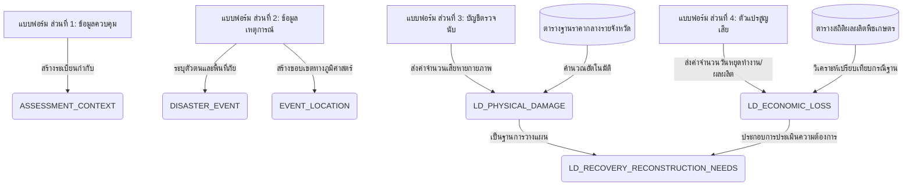

# แบบฟอร์มและคู่มือจัดเก็บข้อมูลสนาม: ร่างมาตรฐานชุดข้อมูลความสูญเสียและความเสียหายขั้นต่ำ
**Loss & Damage Field Reporting Form Template & Specifications (MVD Interface)**

---

## 1. บทนำและวัตถุประสงค์ (Introduction & Purpose)

การยกระดับการประเมินความสูญเสียและความเสียหาย (Loss and Damage: L&D) จากภัยพิบัติในประเทศไทย เผชิญข้อจำกัดสำคัญคือการขาดข้อมูลนำเข้า (Input Data) ที่มีความละเอียดและน่าเชื่อถือในระดับพื้นที่ แบบฟอร์มนี้ได้รับการออกแบบขึ้นเพื่อบูรณาการเข้ากับโครงสร้างฐานข้อมูลเชิงสัมพันธ์ [Pillar_06_LDM_LossDamage_DataModel_Technical_Specification.md](file:///C:/Users/sitth/OracleWorkspace/Arun_Creagy/ψ/incubate/DCCE/CRDB/output/06_LDM_LossDamage_DataModel/Pillar_06_LDM_LossDamage_DataModel_Technical_Specification.md)

วัตถุประสงค์หลักของเครื่องมือชุดนี้คือการเปลี่ยนจากแนวปฏิบัติเดิมที่ให้เจ้าหน้าที่ท้องถิ่น "คาดเดามูลค่าความเสียหายเป็นเงินบาทเอาเอง" ไปสู่ **"การบันทึกตัวแปรเชิงประจักษ์ในสนามที่สามารถสังเกตและนับได้จริง" (Observable Physical & Operational Parameters)** แล้วใช้ระบบฐานข้อมูลกลางคำนวณและทวนสอบมูลค่าด้วยแบบจำลองมาตรฐานร่วมกับกระทรวงภาคส่วน เพื่อลดภาระงานของเจ้าหน้าที่ในพื้นที่และเพิ่มความชอบธรรมในการจัดสรรงบประมาณเยียวยาฟื้นฟู

---

## 2. โครงสร้างแบบฟอร์มการรายงานความสูญเสียและความเสียหาย (Loss & Damage Field Reporting Form)

แบบฟอร์มนี้แบ่งการทำงานออกเป็น 4 ส่วนหลัก ตามลำดับขั้นตอนการลงพื้นที่จัดเก็บข้อมูลของเจ้าหน้าที่:

```
+-----------------------------------------------------------------+
|               LOSS & DAMAGE FIELD REPORTING FORM                |
+-----------------------------------------------------------------+
|  [ส่วนที่ 1: ข้อมูลควบคุมและผู้บันทึก] -> ASSESSMENT_CONTEXT      |
|  [ส่วนที่ 2: บันทึกเหตุการณ์และพื้นที่] -> DISASTER_EVENT / LOCATION  |
|  [ส่วนที่ 3: บัญชีตรวจนับความเสียหาย] -> LD_PHYSICAL_DAMAGE        |
|  [ส่วนที่ 4: ตัวแปรประเมินความสูญเสีย] -> LD_ECONOMIC_LOSS         |
+-----------------------------------------------------------------+
```

---

### **ส่วนที่ 1: ข้อมูลควบคุมการสำรวจ (Administrative Control & Context)**
*ส่วนนี้ทำหน้าที่เก็บบริบทของการประเมิน (Metadata) เพื่อระบุสายธารประวัติของข้อมูลและผู้รับผิดชอบ ป้องกันความสับสนระหว่างข้อมูลรายงานด่วนและข้อมูลที่ทวนสอบเสร็จสิ้นแล้ว*

| ลำดับที่ | ชื่อเขตข้อมูลในฟอร์ม | ตัวแปรระบบ (System Parameter) | ชนิดข้อมูลและข้อจำกัด | คำอธิบายและคำชี้แจงในการจัดเก็บ |
| :---: | :--- | :--- | :--- | :--- |
| 1.1 | **รหัสการประเมิน** | `assessment_context_id` | VARCHAR (Auto-generated) | ระบบสร้างรหัสอ้างอิงเฉพาะสำหรับการสำรวจครั้งนี้อัตโนมัติ |
| 1.2 | **ระยะของการประเมิน** | `assessment_phase` | ENUM | เลือก: [ ] ประเมินสถานการณ์เบื้องต้น (0-72 ชม.), [ ] ประเมินระยะด่วน (3-14 วัน), [ ] ประเมินเชิงลึกเพื่อการฟื้นฟู (PDNA/DaLA) |
| 1.3 | **หน่วยงานรับผิดชอบหลัก** | `lead_agency` | VARCHAR | ระบุชื่อหน่วยงานที่ลงพื้นที่ประเมิน (เช่น อปท. ต้นสังกัด หรือสำนักงาน ปภ. จังหวัด) |
| 1.4 | **ชื่อผู้รายงาน/หัวหน้าทีม** | `assessor_name_or_team` | VARCHAR | ระบุชื่อ-นามสกุล และตำแหน่งของเจ้าหน้าที่ผู้รับผิดชอบข้อมูล |
| 1.5 | **วันที่ทำการสำรวจข้อมูล** | `assessment_date` | DATE (YYYY-MM-DD) | วันที่เจ้าหน้าที่ลงพื้นที่สำรวจหรือยืนยันข้อมูลในสนามจริง |
| 1.6 | **เอกสารอ้างอิงต้นทาง** | `source_document_ref` | TEXT / Uploader | ระบุเลขที่หนังสือราชการ รายงาน ปภ. หรืออัปโหลดไฟล์สแกนแบบฟอร์มดิบ |

---

### **ส่วนที่ 2: บันทึกเหตุการณ์และพื้นที่ภัยพิบัติ (Disaster Event & Geography)**
*ส่วนนี้ระบุหมุดหมายหลักของภัยพิบัติและพิกัดพื้นที่ที่ได้รับผลกระทบทางภูมิศาสตร์*

| ลำดับที่ | ชื่อเขตข้อมูลในฟอร์ม | ตัวแปรระบบ (System Parameter) | ชนิดข้อมูลและข้อจำกัด | คำอธิบายและคำชี้แจงในการจัดเก็บ |
| :---: | :--- | :--- | :--- | :--- |
| 2.1 | **ชื่อเหตุการณ์** | `event_name` | VARCHAR | ระบุชื่อภัยพิบัติที่เป็นทางการ (เช่น อุทกภัยจากพายุเตี้ยนหมู่ หรือภัยแล้งปี 2568) |
| 2.2 | **ประเภทภัยพิบัติ** | `hazard_type` | ENUM | เลือก: [ ] อุทกภัย, [ ] วาตภัย, [ ] ดินโคลนถล่ม, [ ] ภัยแล้ง, [ ] คลื่นความร้อน, [ ] อื่นๆ |
| 2.3 | **วันที่เริ่มเกิดภัย** | `event_start_date` | DATE | วันแรกที่เริ่มได้รับผลกระทบในพื้นที่ หรือวันแจ้งเหตุด่วน |
| 2.4 | **จังหวัดที่ได้รับผลกระทบ** | `province_name` | VARCHAR | ระบุชื่อจังหวัดตามรหัสมาตรฐานราชการ |
| 2.5 | **อำเภอ/ตำบล/หมู่บ้าน** | `location_code` | VARCHAR (รหัสมาตรฐาน มท.) | ระบุรหัสพื้นที่การปกครองเพื่อใช้เชื่อมโยงเชิงพื้นที่ (Spatial Join) |
| 2.6 | **จำนวนผู้ได้รับผลกระทบ** | `num_affected_pop` | INT (คน) | จำนวนประชาชนในพื้นที่ประเมินที่ได้รับผลกระทบโดยตรงทางกายภาพ |
| 2.7 | **จำนวนผู้เสียชีวิต/บาดเจ็บ** | `num_dead` / `num_injured` | INT (คน) | จำนวนผู้ประสบภัยที่ได้รับการยืนยันอย่างเป็นทางการจากหน่วยงานสาธารณสุข |

---

### **ส่วนที่ 3: บัญชีตรวจนับความเสียหายทางกายภาพ (Physical Damage Inventory)**
*ส่วนนี้จัดเก็บปริมาณความเสียหายของสินทรัพย์ถาวรและโครงสร้างพื้นฐานเชิงกายภาพ เจ้าหน้าที่เก็บข้อมูลเฉพาะจำนวนชิ้น/พื้นที่ที่เสียหายจริง โดยระบบจะนำไปคำนวณมูลค่าทางการเงินผ่านตารางต้นทุนมาตรฐานกลางร่วมกับกระทรวงภาคส่วนในภายหลัง (ตามสมการ: Damage = ปริมาณสินทรัพย์ที่เสียหาย x ต้นทุนทดแทน/ซ่อมแซมต่อหน่วย)*

| ลำดับที่ | ภาคส่วนตามกรอบ สศช. (NESDC Sector) | ประเภททรัพย์สิน (Asset Type) | จำนวนเสียหายทั้งหมด (Destroyed) | จำนวนเสียหายบางส่วน (Damaged) | หน่วยตรวจวัด (Unit) | คำชี้แจงในการจัดเก็บข้อมูลภาคสนาม |
| :---: | :--- | :--- | :---: | :---: | :---: | :--- |
| 3.1 | **ที่อยู่อาศัย** | บ้านเรือนประชาชน | `[ ]` | `[ ]` | หลัง | - เสียหายทั้งหมด: โครงสร้างหลักพังทลาย อยู่อาศัยไม่ได้<br>- เสียหายบางส่วน: หลังคาชำรุด ประตูหน้าต่างเสียหาย แต่โครงสร้างยังดี |
| 3.2 | **เกษตรกรรม** | พื้นที่ปลูกข้าว | `[ ]` | `[ ]` | ไร่ | บันทึกพื้นที่ที่จมน้ำหรือได้รับความเสียหายโดยสิ้นเชิง |
| 3.3 | **เกษตรกรรม** | พื้นที่ปลูกพืชไร่/พืชสวน | `[ ]` | `[ ]` | ไร่ | แยกประเภทตามพืชหลัก (เช่น มันสำปะหลัง อ้อย ข้าวโพด ผลไม้) |
| 3.4 | **เกษตรกรรม (ปศุสัตว์)** | โรงเรือนเลี้ยงสัตว์ | `[ ]` | `[ ]` | หลัง / โรง | บันทึกจำนวนโรงเรือนเลี้ยงสัตว์ (เช่น โรงเรือนสุกร เล้าไก่) ที่ชำรุด |
| 3.5 | **เกษตรกรรม (ประมง)** | บ่อปลา / กระชังเลี้ยงสัตว์น้ำ | `[ ]` | `[ ]` | บ่อ / ตารางเมตร | บันทึกจำนวนบ่อเลี้ยงหรือกระชังที่คันกั้นดินพังทลายหรือหลุดลอย |
| 3.6 | **การผลิต (อุตสาหกรรม/บริการ)** | โรงงานอุตสาหกรรม | `[ ]` | `[ ]` | แห่ง / ตารางเมตร | บันทึกจำนวนโรงงานและพื้นที่อาคารที่ชำรุดเสียหายเชิงโครงสร้าง |
| 3.7 | **การผลิต (อุตสาหกรรม/บริการ)** | ร้านค้า / บริษัท / สถานประกอบการ | `[ ]` | `[ ]` | แห่ง | บันทึกจำนวนร้านค้าปลีก ร้านค้าส่ง หรือสำนักงานที่เสียหาย |
| 3.8 | **การผลิต (ท่องเที่ยว)** | โรงแรม / รีสอร์ท / โฮมสเตย์ | `[ ]` | `[ ]` | แห่ง / ห้อง | บันทึกจำนวนสถานประกอบการท่องเที่ยวและจำนวนห้องพักที่เสียหาย |
| 3.9 | **คมนาคม (สาธารณูปโภค)** | ถนนลาดยาง / คอนกรีต | `[ ]` | `[ ]` | กิโลเมตร | - เสียหายทั้งหมด: ถนนคอสะพานขาดผ่านไม่ได้<br>- เสียหายบางส่วน: ถนนแตกร้าว ชำรุดแต่ยังผ่านได้ |
| 3.10 | **คมนาคม (สาธารณูปโภค)** | สะพาน / ท่อระบายน้ำหลัก | `[ ]` | `[ ]` | แห่ง | บันทึกสะพานหรือโครงสร้างระบายน้ำที่ชำรุด |
| 3.11 | **สาธารณูปโภคพื้นฐาน** | สถานศึกษา / อาคารเรียน | `[ ]` | `[ ]` | แห่ง / หลัง | บันทึกอาคารเรียนหรือศูนย์เด็กเล็กที่ได้รับความเสียหาย |
| 3.12 | **สาธารณูปโภคพื้นฐาน** | สถานพยาบาล / รพ.สต. | `[ ]` | `[ ]` | แห่ง / หลัง | บันทึกโรงพยาบาลส่งเสริมสุขภาพตำบลหรือสถานพยาบาลชุมชนที่พังชำรุด |
| 3.13 | **สาธารณูปโภคพื้นฐาน** | เสาไฟฟ้า / สายส่งแรงต่ำ-สูง | `[ ]` | `[ ]` | ต้น | บันทึกจำนวนเสาไฟที่ล้มชำรุด |
| 3.14 | **สาธารณูปโภคพื้นฐาน** | ระบบประปาหมู่บ้าน / โรงสูบน้ำ | `[ ]` | `[ ]` | แห่ง | บันทึกโรงสูบประปา ถังแชมเปญ หรือท่อส่งน้ำหลักที่เสียหาย |
| 3.15 | **มรดกทางวัฒนธรรม** | วัด / โบสถ์ / มัสยิด / โบราณสถาน | `[ ]` | `[ ]` | แห่ง | บันทึกจำนวนโบราณสถานหรือสิ่งปลูกสร้างทางศาสนาที่ชำรุดเสียหาย |

---

### **ส่วนที่ 4: ตัวแปรประเมินความสูญเสียและการหยุดชะงักทางเศรษฐกิจ (Economic Loss Parameters)**
*ส่วนนี้จัดเก็บตัวแปรที่ใช้ในการวิเคราะห์กระแสเศรษฐกิจที่หยุดชะงัก (Loss) ซึ่งจำเป็นต้องระบุค่าพารามิเตอร์ในสนามเพื่อป้อนเข้าสูตรคำนวณเปรียบเทียบกรณีฐาน (Baseline)*

#### **4.1 ภาคเกษตรกรรมและชีวภาพ (Agricultural Disruption - สำหรับสมการ Loss = พื้นที่เสียหาย x ผลผลิตต่อไร่ x ราคาผลผลิต)**
* **อายุเฉลี่ยของพืชผล ณ วันเกิดภัย:** `[ ]` วัน / เดือน *(ใช้ประเมินต้นทุนปัจจัยผลิตที่เสียเปล่า เช่น ค่าปุ๋ย ค่ายา เมล็ดพันธุ์)*
* **ผลผลิตเฉลี่ยของพืชชนิดนั้นในฤดูกาลปกติ:** `[ ]` กิโลกรัม/ไร่ *(ค่า Baseline ในพื้นที่)*
* **ช่วงเดือนที่จะเก็บเกี่ยวตามแผนการผลิตเดิม:** `[ ]` *(ใช้ดึงกลไกราคาตลาดของเดือนนั้นมาคำนวณมูลค่ารายได้คาดหวัง)*
* **ราคาขายสินค้าเกษตรหน้าฟาร์ม ณ ช่วงปกติ:** `[ ]` บาท/กิโลกรัม
* **ปศุสัตว์/ประมง - ระยะเวลาเลี้ยงเฉลี่ยจนสามารถขายได้:** `[ ]` เดือน
* **ปศุสัตว์/ประมง - ราคาขายต่อหัว/บ่อ ในช่วงปกติ:** `[ ]` บาท

#### **4.2 ภาคการผลิต การค้า และท่องเที่ยว (Commercial Disruption - สำหรับสมการ Loss = จำนวนแห่ง x การสูญเสียรายได้ต่อวัน)**
* **ระยะเวลาที่สถานประกอบการต้องหยุดดำเนินการสะสม (Downtime):** `[ ]` วัน
* **รายได้เฉลี่ยต่อวันของธุรกิจในช่วงสถานการณ์ปกติ:** `[ ]` บาท/วัน *(ค่า Baseline)*
* **รายได้ที่ยังจัดเก็บได้จริงต่อวันในช่วงการฟื้นตัว:** `[ ]` บาท/วัน
* **ค่าใช้จ่ายในการดำเนินงานเพิ่มขึ้นเป็นกรณีฉุกเฉิน (Unexpected Expenses):** `[ ]` บาท *(เช่น ค่าเช่ารถชั่วคราว, ค่าเช่าเครื่องปั่นไฟ)*

#### **4.3 ภาคที่อยู่อาศัย (Housing Loss - สำหรับสมการ Loss = จำนวนครัวเรือน x ค่าใช้จ่ายเพิ่มเติม/ค่าเช่าบ้านชั่วคราว)**
* **ระยะเวลาที่ประชาชนไม่สามารถอาศัยในบ้านเดิมได้ชั่วคราว:** `[ ]` วัน
* **อัตราค่าเช่าที่อยู่อาศัยชั่วคราวหรือค่าใช้จ่ายในการยังชีพเพิ่มเติมเฉลี่ย:** `[ ]` บาท/เดือน/ครัวเรือน

#### **4.4 ภาคบริการสาธารณะและโครงสร้างพื้นฐาน (Public Service Interruption - สำหรับสมการ Loss = จำนวนระบบ x ค่าใช้จ่ายให้บริการทดแทน)**
* **จำนวนวันที่ไฟฟ้าดับทั้งหมดในพื้นที่:** `[ ]` วัน
* **จำนวนวันที่ระบบน้ำประปาใช้งานไม่ได้:** `[ ]` วัน
* **ค่าใช้จ่ายส่วนเพิ่มของรัฐในการจัดหาบริการทดแทน:** `[ ]` บาท *(เช่น ค่าจ้างขนถ่ายน้ำแจกจ่ายภัยแล้ง, ค่าระบบไฟสำรองโรงพยาบาล)*

#### **4.5 ภาคมรดกทางวัฒนธรรม (Cultural Heritage Loss - สำหรับสมการ Loss = จำนวนแหล่ง x มูลค่าการให้บริการที่หายไป)**
* **จำนวนผู้มาเยือน/นักท่องเที่ยวที่ลดลงต่อวันเฉลี่ย:** `[ ]` คน/วัน
* **รายได้จากค่าธรรมเนียมเข้าชมและการท่องเที่ยวในชุมชนที่ลดลงสะสม:** `[ ]` บาท/วัน

---

## 3. คู่มือการจัดเก็บข้อมูลและการเชื่อมโยงข้อมูลสู่สถาปัตยกรรมระบบ (Surveyor Guidelines & Schema Mapping)

เพื่อให้การรวบรวมข้อมูลภาคสนามสามารถขจัดข้อจำกัดเรื่อง "ข้อมูลไม่เพียงพอ" หรือ "การรายงานไม่ตรงกัน" เจ้าหน้าที่ผู้ลงพื้นที่ควรใช้แนวทางปฏิบัติเชิงระบบดังต่อไปนี้:

### 3.1 การแมปโครงสร้างข้อมูลและบทบาทของฟิลด์ต่อฐานข้อมูล MVD

ข้อมูลดิบที่ถูกกรอกผ่านแบบฟอร์มรายงานจะถูกระบบประมวลผลและกระจายไปจัดเก็บตามสถาปัตยกรรมตารางข้อมูลสัมพันธ์ดังนี้:



1. **การคำนวณมูลค่าความเสียหายทางกายภาพ (`LD_PHYSICAL_DAMAGE`):**
   * *กลไกหลังบ้าน:* เมื่อผู้ใช้กรอกจำนวนสิ่งก่อสร้างชำรุด ระบบจะสืบค้นค่า `unit_replacement_cost_thb` และ `unit_repair_cost_thb` ของจังหวัดนั้น ๆ จากตารางราคาค่ามาตรฐานกลางที่สำนักงบประมาณและสมาคมผู้ประเมินทรัพย์สินฯ (VAT) กำหนดไว้ เพื่อคูณตัวเลขออกมาเป็น `monetary_damage_thb` ทันที โดยที่เจ้าหน้าที่สนามไม่ต้องคำนวณเอง
2. **การวิเคราะห์มูลค่าความสูญเสียทางเศรษฐกิจ (`LD_ECONOMIC_LOSS`):**
   * *กลไกหลังบ้าน:* เมื่อคีย์ตัวแปรสภาวะหยุดชะงักในส่วนที่ 4 (เช่น ประเภทพืช, อัตราผลผลิตกรณีฐาน, Downtime) ระบบจะเชื่อมโยงกับฐานข้อมูลสถิติภาคส่วน (เช่น สถิติผลผลิตพืชรายอำเภอของ กษ. หรือรายได้อุตสาหกรรมรายประเภท) และวิเคราะห์เปรียบเทียบเชิงมูลค่าเป็น `monetary_loss_thb` โดยอัตโนมัติ

### 3.2 ข้อพึงระวังและข้อห้ามทางเทคนิคสำหรับการใช้งานระดับพื้นที่
* **ห้ามปะปนมูลค่าเงินช่วยเหลือเข้ากับมูลค่าความเสียหายจริง:** เงินที่เบิกจ่ายตามระเบียบกระทรวงการคลัง (เงินช่วยเหลือผู้ประสบภัยกรณีฉุกเฉิน) เป็นเพียงทรัพยากรชดเชยของรัฐ ไม่ใช่มูลค่าความเสียหายหรือสูญเสียทางเศรษฐกิจจริงของทรัพย์สิน ห้ามนำวงเงินช่วยเหลือชดเชยไปกรอกปะปนกับตัวเลขผลกระทบในฐานข้อมูลเด็ดขาด
* **ห้ามเว้นว่างหน่วยตรวจวัดทางกายภาพ:** ปริมาณจำนวนเสียหายเชิงประจักษ์ (เช่น จำนวนหลัง จำนวนไร่ หรือจำนวนกิโลเมตร) เป็นหัวใจสำคัญในการสอบเทียบฐานข้อมูลร่วมกับมาตรฐานสากล หากปล่อยว่างตารางคำนวณความเสียหายจะไม่สามารถประมวลผลได้
* **กระบวนการปรับปรุงและทวนสอบข้อมูล:** ข้อมูลนำเข้าจากแบบฟอร์มในสนามจะถูกบันทึกในตาราง `ASSESSMENT_CONTEXT` เป็นสถานะเริ่มต้นคือ `Draft` เสมอ และจะถูกเปลี่ยนเป็นสถานะ `Validated` หลังจากผ่านการประสานงานทวนสอบร่วมระหว่าง ปภ. และหน่วยงานภาคส่วนระดับจังหวัดเท่านั้น เพื่อรักษาระเบียบวิธีและความถูกต้องของข้อมูลประเทศ
