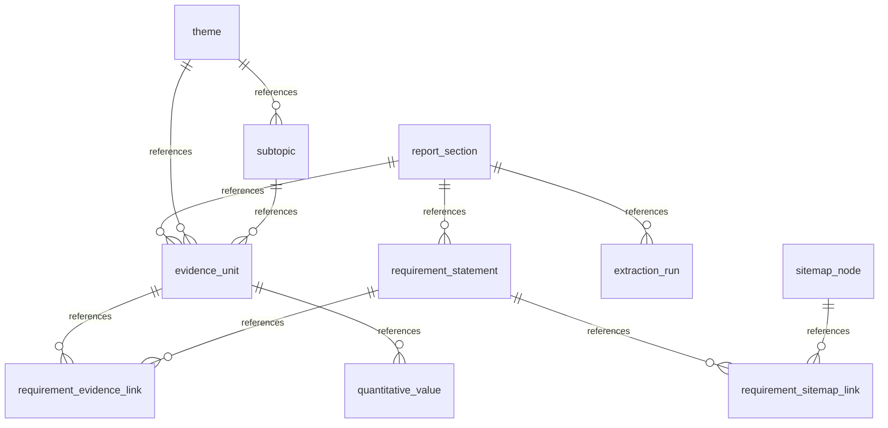

# A-BTR Requirement Dissection & Mapping: Database Compilation Report

**Date**: 2026-07-13  
**Source Document**: [`260527_UNDP_BTR2_second_interim_report.md`](file:///C:/Users/sitth/OracleWorkspace/Arun_Creagy/ψ/incubate/UNDP/BTR/inbox/260527_UNDP_BTR2_second_interim_report.md)  
**Output Directory**: [`ψ/incubate/DCCE/CRDB/output/A-BTR_requirement_analysis/`](file:///C:/Users/sitth/OracleWorkspace/Arun_Creagy/ψ/incubate/DCCE/CRDB/output/A-BTR_requirement_analysis/)  
**Database File**: [`a_btr_dissection.db`](file:///C:/Users/sitth/OracleWorkspace/Arun_Creagy/ψ/incubate/DCCE/CRDB/output/A-BTR_requirement_analysis/a_btr_dissection.db)

---

## 1. Executive Summary

According to the [A-BTR Dissection & Mapping Methodology Plan](file:///C:/Users/sitth/OracleWorkspace/Arun_Creagy/plans/2026-07-09-a-btr-dissection-methodology-plan.md), the 379 requirement rows extracted from Section Tasks A–F have been compiled into **10 relational database tables** and saved in both raw CSV format and a fully populated **SQLite Database** (`a_btr_dissection.db`).

The updated sitemap nodes from [`NCAIF_Detailed_Sitemap_v6.md`](file:///C:/Users/sitth/OracleWorkspace/Arun_Creagy/ψ/incubate/DCCE/CRDB/output/01_Sitemap_InterfaceMapping/NCAIF_Detailed_Sitemap_v6.md) were parsed and integrated, yielding **586 linkages** mapping BTR rules to portal structures.

This report serves as the comprehensive guide to the database structure, data processing workflow, semantic linkages, thematic organization, data dictionary, and quantitative result analysis.

---

## 2. Overall Data Processing Workflow & Logic

The data processing workflow follows a structured four-stage extraction and mapping methodology to transform the unstructured BTR draft into a structured requirement ledger:

### 2.1 The Data Processing Workflow Stages
1. **Systematic Parsing**: The draft BTR report is systematically read to identify key passages, indicators, and descriptions that contain either factual baseline information or explicit mandates.
2. **Section-Cluster Dissection**: The report is divided into thematic section clusters (Tasks A through F) corresponding to specific chapters of the BTR (such as Institutional Baseline, Climate Hazards, and Loss & Damage). Each cluster is dissected independently to extract localized statements.
3. **Requirement Classification**: Extracted rules and evidence are classified using a three-tier system:
   * **MUST**: Mandatory requirements dictated by UNFCCC ETF/MPG guidelines.
   * **SHOULD**: Recommended practices for completeness.
   * **COULD**: Optional or ambitious reporting extensions.
   For every entry, the exact source anchor (line range) is preserved to ensure absolute traceability.
4. **Compilation**: The independent section ledgers are consolidated, normalized, and mapped into the final relational database. This stage harmonizes theme naming, resolves relational mappings, and outputs the structured tables.

### 2.2 Logic of Data Processing & Linkages
The core logic of the data processing system determines how narrative text is transformed into relational records:
* **Narrative to Evidence Units**: Any paragraph, table row, list item, or statistic that provides empirical context in the BTR draft is compiled into an **Evidence Unit** (the descriptive reality).
* **Evidence to Requirements**: The system processes these descriptive evidence units into **Requirement Statements** (the prescriptive rules that must be tracked). This relationship is mapped logically:
  * A single evidence unit can support multiple distinct requirement statements.
  * A single requirement statement can draw support from multiple evidence units spread across different sections of the BTR.
* **Thematic Organization**: Evidence units are categorized under a hierarchy of **Themes** and **Subtopics** to make them manageable. Because requirement statements link to evidence units, they inherit these themes transitively, enabling multi-dimensional thematic grouping.

---

## 3. Relational Schema & Data Dictionary

The database schema is organized around normalization principles to support multi-dimensional queries.



### 3.1 Compiled Table Overview & Metrics

The compiled database consists of the following counts and generated files:

| Table / CSV Name | Count | Purpose | Output Link |
|---|---|---|---|
| **`report_section`** | 18 rows | Maps BTR report subheadings to section codes and output files | [`report_section.csv`](file:///C:/Users/sitth/OracleWorkspace/Arun_Creagy/ψ/incubate/DCCE/CRDB/output/A-BTR_requirement_analysis/report_section.csv) |
| **`theme`** | 133 rows | Unique, normalized thematic areas across the adaptation analysis | [`theme.csv`](file:///C:/Users/sitth/OracleWorkspace/Arun_Creagy/ψ/incubate/DCCE/CRDB/output/A-BTR_requirement_analysis/theme.csv) |
| **`subtopic`** | 379 rows | Specific subtopics mapped back to parent themes | [`subtopic.csv`](file:///C:/Users/sitth/OracleWorkspace/Arun_Creagy/ψ/incubate/DCCE/CRDB/output/A-BTR_requirement_analysis/subtopic.csv) |
| **`evidence_unit`** | 379 rows | Atomic pieces of report evidence with resolved line text and anchors | [`evidence_unit.csv`](file:///C:/Users/sitth/OracleWorkspace/Arun_Creagy/ψ/incubate/DCCE/CRDB/output/A-BTR_requirement_analysis/evidence_unit.csv) |
| **`requirement_statement`** | 379 rows | Normalized requirement statements (MUST / SHOULD / COULD) | [`requirement_statement.csv`](file:///C:/Users/sitth/OracleWorkspace/Arun_Creagy/ψ/incubate/DCCE/CRDB/output/A-BTR_requirement_analysis/requirement_statement.csv) |
| **`requirement_evidence_link`** | 379 rows | Pivot table linking requirements to their source evidence units | [`requirement_evidence_link.csv`](file:///C:/Users/sitth/OracleWorkspace/Arun_Creagy/ψ/incubate/DCCE/CRDB/output/A-BTR_requirement_analysis/requirement_evidence_link.csv) |
| **`quantitative_value`** | 147 rows | Structured numeric metrics parsed from the quantitative rows | [`quantitative_value.csv`](file:///C:/Users/sitth/OracleWorkspace/Arun_Creagy/ψ/incubate/DCCE/CRDB/output/A-BTR_requirement_analysis/quantitative_value.csv) |
| **`sitemap_node`** | 38 rows | Machine-readable hierarchical nodes from portal sitemap | [`ncaif_sitemap_nodes.csv`](file:///C:/Users/sitth/OracleWorkspace/Arun_Creagy/ψ/incubate/DCCE/CRDB/output/01_Sitemap_InterfaceMapping/ncaif_sitemap_nodes.csv) |
| **`requirement_sitemap_link`** | 586 rows | Compliance link mapping BTR rules to portal sitemap structures | *(Ingested into SQLite DB directly)* |
| **`extraction_run`** | 18 rows | Audit trail of extraction execution status, mode, and timestamps | [`extraction_run.csv`](file:///C:/Users/sitth/OracleWorkspace/Arun_Creagy/ψ/incubate/DCCE/CRDB/output/A-BTR_requirement_analysis/extraction_run.csv) |
| **`view_requirement_themes`** | 379 rows | Flattened query mapping requirements directly to themes | [`view_requirement_themes.csv`](file:///C:/Users/sitth/OracleWorkspace/Arun_Creagy/ψ/incubate/DCCE/CRDB/output/A-BTR_requirement_analysis/view_requirement_themes.csv) |
| **`a_btr_dissection_master_joined`** | 586 rows | **Master consolidated table** linking requirements, themes, and sitemap portals | [`a_btr_dissection_master_joined.csv`](file:///C:/Users/sitth/OracleWorkspace/Arun_Creagy/ψ/incubate/DCCE/CRDB/output/A-BTR_requirement_analysis/a_btr_dissection_master_joined.csv) |

---

### 3.2 Data Dictionary

#### Table: `report_section`
Maps subheadings of the BTR report to section codes.
* `report_section_id` (TEXT, PK): Unique identifier (`SEC-xxx`).
* `section_task_code` (TEXT): The task group (A to F).
* `section_label` (TEXT): The original section number from the BTR (e.g. `1.1.1`).
* `section_title` (TEXT): Description of the section.
* `anchor_start` / `anchor_end` (TEXT): Section boundary markers in the raw BTR.
* `output_file` (TEXT): Source markdown file name.

#### Table: `theme`
Represents high-level thematic areas of climate adaptation.
* `theme_id` (TEXT, PK): Unique identifier (`THM-xxx`).
* `theme_name` (TEXT): Normalized name (snake_case).
* `description` (TEXT): Narrative definition of the theme.

#### Table: `subtopic`
Detailed subtopics mapping back to parent themes.
* `subtopic_id` (TEXT, PK): Unique identifier (`SUB-xxx`).
* `theme_id` (TEXT, FK): Parent theme association.
* `subtopic_name` (TEXT): Normalized subtopic name.
* `description` (TEXT): Narrative definition of the subtopic.

#### Table: `evidence_unit`
Atomic pieces of report text serving as factual baselines.
* `evidence_unit_id` (TEXT, PK): Unique identifier (`EVU-xxx`).
* `report_section_id` (TEXT, FK): Link to the reporting section.
* `theme_id` (TEXT, FK): Link to the theme.
* `subtopic_id` (TEXT, FK): Link to the subtopic.
* `evidence_form` (TEXT): Type of evidence (e.g. descriptive, qualitative, quantitative).
* `value_type` (TEXT): Data classification (`narrative`, `numeric`, etc.).
* `source_anchor` (TEXT): Human-readable line reference.
* `excerpt_text` (TEXT): The exact quote extracted from the BTR report.
* `analyst_note` (TEXT): Free-text notes.

#### Table: `requirement_statement`
Normalized requirements indicating action items for adaptation reporting.
* `requirement_id` (TEXT, PK): Unique identifier (e.g. `A-REQ-001`, `B-010`).
* `report_section_id` (TEXT, FK): Link to section.
* `req_code` (TEXT): Duplicate tracking code.
* `requirement_statement` (TEXT): The prescriptive requirement rule.
* `classification` (TEXT): Mandatory level (`MUST`, `SHOULD`, `COULD`).
* `notes` (TEXT): Contextual notes.

#### Table: `requirement_evidence_link`
Associates requirement statements with their source evidence units.
* `requirement_evidence_link_id` (TEXT, PK): Unique identifier (`LNK-xxx`).
* `requirement_id` (TEXT, FK): Associated requirement.
* `evidence_unit_id` (TEXT, FK): Associated evidence unit.
* `support_role` (TEXT): The role of the linkage (`primary`, `supporting`).

#### Table: `quantitative_value`
Atomic quantitative metrics parsed from evidence units.
* `quantitative_value_id` (TEXT, PK): Unique identifier (`QTY-xxx`).
* `evidence_unit_id` (TEXT, FK): Link to the parent evidence unit.
* `metric_name` (TEXT): Name of the metric (e.g. `projected_mean_temperature_increase`).
* `value_numeric` (REAL): The raw parsed number.
* `unit` (TEXT): Metric unit (e.g. `°C`, `mm`, `provinces`, `%`).
* `comparison_operator` (TEXT): Operator (e.g. `=`, `>`, `+`).
* `time_period` (TEXT): Year or timeframe.
* `geography` (TEXT): Geographical scope (e.g. `Thailand`, `Bangkok`).
* `scenario_label` (TEXT): Climate scenario (e.g. `SSP5-8.5`).
* `notes` (TEXT): Extra context.

---

## 4. Logical Linkages & Thematic Management

### 4.1 Concept: Requirements vs. Evidence Units
A common point of confusion is how requirements and evidence units are related:
* **The Evidence Unit** represents the **empirical baseline** (the "what is") in the current draft. It is the raw data or description observed in the country.
* **The Requirement Statement** represents the **prescriptive rule** (the "what must be") that the portal or reporting structure dictates. 

#### Logical Mappings
The relation is **many-to-many**, managed via `requirement_evidence_link`:
* **One-to-Many**: A single descriptive evidence unit (e.g. institutional setup details) may mandate several distinct requirement actions.
* **Many-to-One**: A single broad requirement (e.g. reporting on extreme windstorm impacts) might be backed by multiple different evidence units spread throughout the BTR report.

### 4.2 Thematic Management: Transitiveness and SQL Views
Currently, themes are linked to the `evidence_unit`, not directly to the `requirement_statement`. Because requirement statements link to evidence units, they inherit themes transitively.

> [!TIP]
> To avoid writing complex multi-table JOINs every time an analyst wants to query requirements by theme, we can project a flattened **SQL View** called `view_requirement_themes` inside the SQLite database:

```sql
CREATE VIEW view_requirement_themes AS
SELECT DISTINCT
    r.requirement_id,
    r.requirement_statement,
    r.classification,
    t.theme_id,
    t.theme_name,
    s.subtopic_name
FROM requirement_statement r
JOIN requirement_evidence_link l ON r.requirement_id = l.requirement_id
JOIN evidence_unit e ON l.evidence_unit_id = e.evidence_unit_id
JOIN theme t ON e.theme_id = t.theme_id
LEFT JOIN subtopic s ON e.subtopic_id = s.subtopic_id;
```

This keeps the base schema normalized while making theme management and querying straightforward for downstream applications.

---

## 5. Result Analysis & Insights

### 5.1 Requirement Classification Breakdown
An analysis of the 379 compiled requirements shows a heavy emphasis on recommended structures over strict mandates:

* **MUST (Mandatory)**: 152 requirements (40.1%) — Core compliance rules.
* **SHOULD (Recommended)**: 217 requirements (57.3%) — Strong recommendations for thoroughness.
* **COULD (Optional)**: 10 requirements (2.6%) — Voluntary baseline expansions.

### 5.2 Thematic Focus Areas
The distribution of evidence units reveals the primary focus areas of the adaptation report. The top 5 themes represent over 17% of all recorded evidence:

1. **`legal_framework`** (15 units): Tracking policies, laws, and decrees.
2. **`lessons_learned`** (13 units): Documenting past adaptation project outcomes.
3. **`institutional_arrangements`** (13 units): Defining agency roles and committees.
4. **`good_practices`** (12 units): Highlighting successful case studies.
5. **`data_and_knowledge_gaps`** (12 units): Identifying scientific and research limitations.

---

## 6. Verification and Quality Control

To maintain database integrity, a series of automated quality gates are run against the compiled database.

### 6.1 Audit: Numeric Evidence Units vs. Quantitative Values
A critical audit is run to verify that every evidence unit with `value_type = 'numeric'` is supported by parsed rows in the `quantitative_value` table.

```sql
-- Audit Query: Find numeric evidence units with missing quantitative records
SELECT evidence_unit_id, source_anchor, excerpt_text 
FROM evidence_unit 
WHERE value_type = 'numeric' 
  AND evidence_unit_id NOT IN (SELECT DISTINCT evidence_unit_id FROM quantitative_value);
```

#### Audit Findings (Run: 2026-07-13)
The numeric verification pass returned a **100% success rate**. All **53 evidence units** marked as `numeric` now have matching structured rows in the `quantitative_value` table (147 total quantitative values). 

The three previously missing items were successfully processed and injected:
*   **`EVU-321`** (Line 787 / Req `E-030`): Extracted `usar_certification_target_year` = `2025.0` (unit: `year`).
*   **`EVU-327`** (Line 799 / Req `E-036`): Extracted `initial_post_disaster_assessment_timeframe` = `72.0` (unit: `hours`).
*   **`EVU-349`** (Line 917 / Req `F-010`): Extracted `nap_priority_sectors_count` = `6.0` (unit: `sectors`).

### 6.2 Sample Linkage Verification Query
To check mapping of requirements directly to sitemap sections, run:
```sql
SELECT r.requirement_id, r.requirement_statement, s.node_code, s.title_th, l.mapping_type
FROM requirement_statement r
JOIN requirement_sitemap_link l ON r.requirement_id = l.requirement_id
JOIN sitemap_node s ON l.sitemap_node_id = s.sitemap_node_id
LIMIT 3;
```
