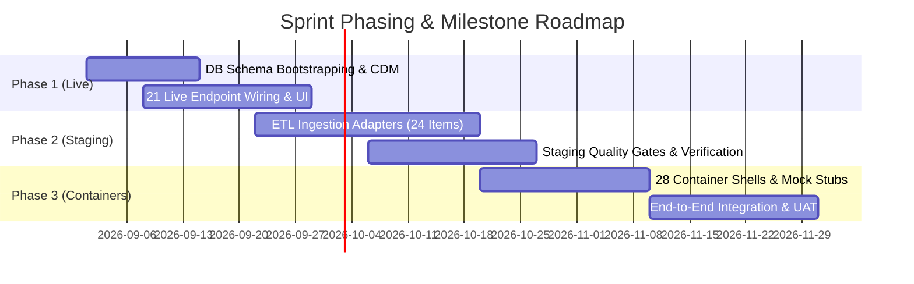
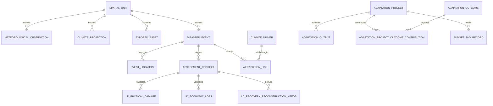
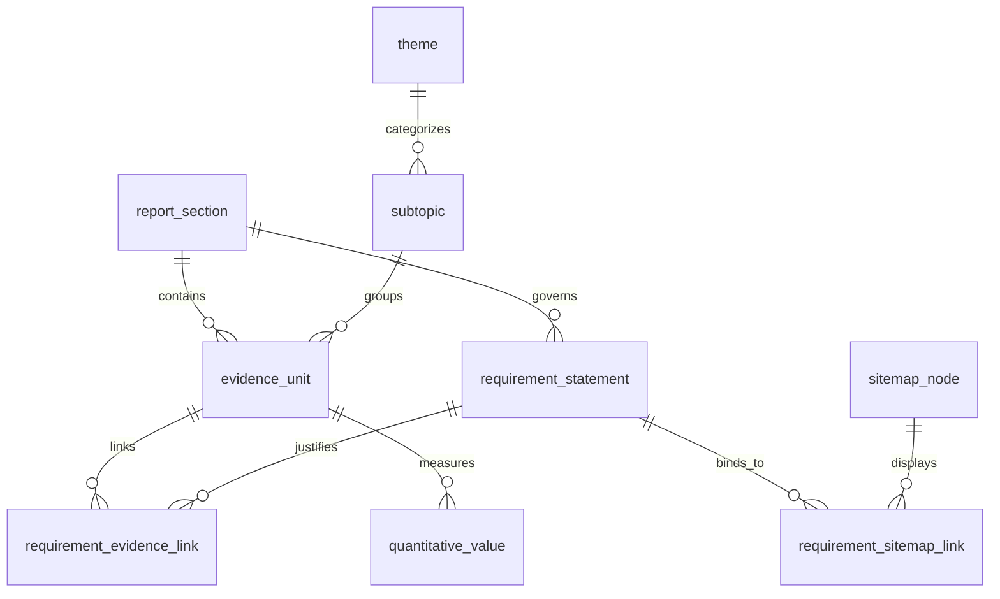
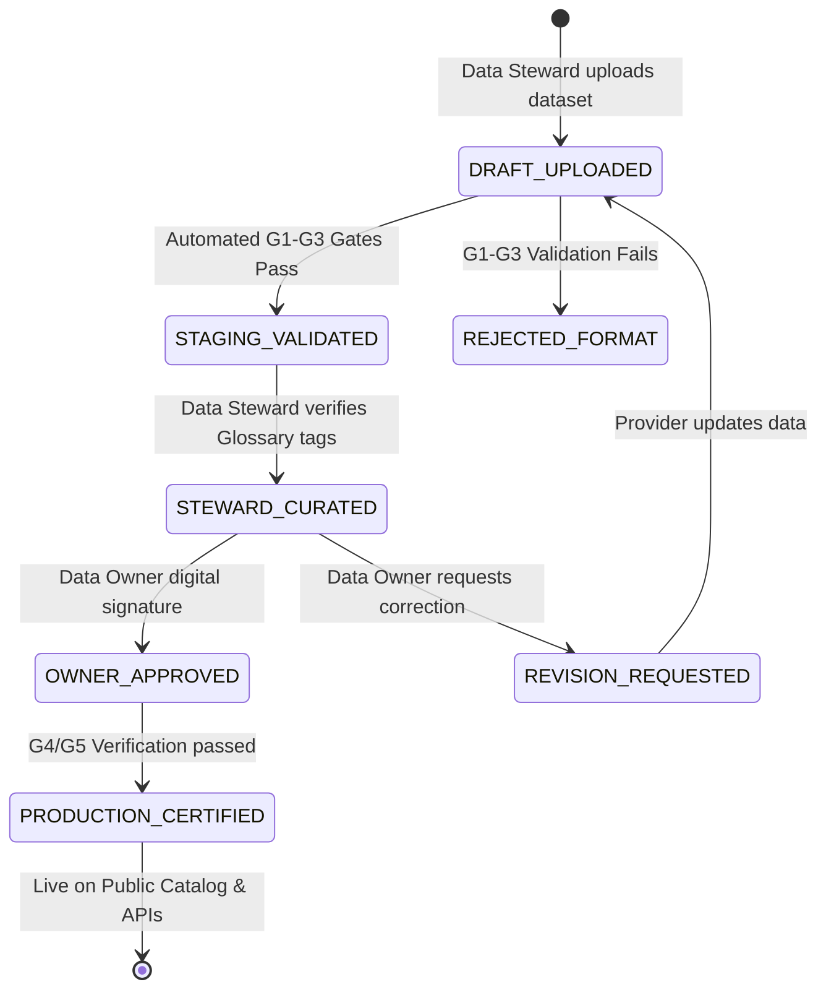

# National Climate Adaptation Information Framework (NCAIF)
## Technical Handoff Deck: Software Development Contractor Briefing & System Architecture Blueprint

**Document Reference:** `NCAIF-SW-TOR70-SPEC-v1.0`  
**Date of Release:** 17 August 2026  
**Audience:** Incoming Software Engineering Team, Technical Leads, Solution Architects & DevOps Leads (TOR70 Vendor)  
**Target Repository & Path:** `ψ/incubate/DCCE/CRDB/output/11_Communication_Deck/2026-08-17-WP11-SW-Developer-Contractor-Deck.md`  
**Document Format:** 22-Slide Technical Slide-Doc (Self-Contained Architectural Specification)

---

# CHAPTER 1: Technical Orientation & Guardrails

---

## Slide 1: Welcome & Mission Handover (Phases 4–7 Execution Mandate)

### Slide Title
The requirements analysis, conceptual data modeling, and web architecture phases are complete; the contractor is mandated to execute physical engineering, implementation, and deployment (Phases 4–7).

### Subtitle / Technical Takeaway
You are inheriting a fully validated system specification and formal data schema; your role is physical software construction, database optimization, pipeline implementation, and deployment without architectural redesign.

### Layout Structure
**Header-Hero Layout:** Top summary banner defining the engineering mandate, followed by a 2-column division separating *Inherited Engineering Assets (What We Deliver)* on the left and *Software Contractor Delivery Scope (What You Build)* on the right, grounded by a technical milestone timeline.

### Exact Slide Text

#### 1. System Engineering Context & Lifecycle Phase Transition
* **Contractor Mandate:** Under the DCCE TOR70 framework, the contractor assumes direct responsibility for **Phases 4 through 7** of the national system development lifecycle:
  * **Phase 4:** Physical Database Schema Design, Indexing & Data Pipeline Construction.
  * **Phase 5:** Application Programming Interface (API) Gateway & Microservices Engineering.
  * **Phase 6:** Dynamic Web Presentation Layer, Headless CMS & Interactive GIS Map Engine.
  * **Phase 7:** Automated Data Quality Gates, Role-Based Access Control (RBAC), and Production Cloud Deployment.
* **Locked Architecture Principle:** The business analysis, domain modeling, and functional requirements are frozen. Contractors must not re-architect data models or redefine nomenclature unless a formal RFC (Request for Change) is approved by the DCCE Data Governance Committee.

#### 2. Architecture Package Inventory (Provided to Contractor)
| Delivered Specification Asset | Format / File Path | Technical Content & Developer Utility |
|---|---|---|
| **15-Node Web Navigation Sitemap** | `NCAIF_Detailed_Sitemap_v8.md` | Full route tree, breadcrumb hierarchy, and page functional requirements across 5 branches. |
| **8-Domain Conceptual Data Model** | `Domains-v3.csv`, `Entities-v3.csv`, `Relationships-v4.csv` | 46 normalized entities, 52 foreign-key business rules, and cross-domain relational constraints. |
| **74-Term Master Glossary** | `Glossary-v5.csv`, `Glossary-v5.md` | Standardized English DB attributes, bilingual labels (TH/EN), and strict semantic definitions. |
| **73-Item Content Gap Matrix** | `2026-08-10-WP4-Content-Source-Gap-Analysis.csv` | Data readiness sorting: 21 Ready (29%), 24 Partial (33%), and 28 Gap (38%) build directives. |
| **A-BTR Requirement Database** | `a_btr_dissection.db` (SQLite) | 379 dissected UNFCCC reporting requirements, 586 sitemap compliance links, and 10 relational tables. |
| **Loss & Damage (LDM) MVD Spec** | `Pillar_06_LDM_LossDamage_DataModel_Technical_Specification.md` | 3-Layer Minimum Viable Dataset (MVD), NESDC valuation math, and G1–G5 validation gates. |

#### 3. Execution Boundaries & Technical Contract
```mermaid
flowchart LR
    subgraph CRDB_Provided [CRDB Architecture Assets (Phases 1-3)]
        A1[15-Node Sitemap v8]
        A2[8-Domain CDM v3 & 74-Term Glossary]
        A3[A-BTR & LDM Functional Specs]
    end
    subgraph TOR70_Execution [Contractor Scope (Phases 4-7)]
        B1[PostgreSQL / PostGIS Schemas]
        B2[REST / GraphQL API Layer]
        B3[Headless CMS & Map Engine]
        B4[ETL Ingestion & Staging Gates]
    end
    CRDB_Provided -->|Strict Contractual Handover| TOR70_Execution
```

### Presenter / Engineering Notes
* Welcome the engineering team and set a rigorous technical tone. Emphasize that this briefing is not an abstract overview, but an engineering operational contract.
* Highlight that the contractor's performance will be measured against strict adherence to the provided data dictionary, entity-relationship constraints, and API schema contracts.
* Remind developers that all database column names and API JSON keys must match the English technical names in the 74-Term Master Glossary.

---

## Slide 2: The Golden Architectural Rule: Strict Decoupling of CMS and Data Catalog

### Slide Title
The presentation layer (Web CMS) must remain strictly decoupled from the analytical data engine (Governed Data Catalog) via authenticated, versioned API contracts.

### Subtitle / Technical Takeaway
Zero direct database coupling: 100% of frontend dashboards, interactive maps, and calculation widgets must query governed REST/GraphQL endpoints rather than executing raw database queries or embedding static data.

### Layout Structure
**2-Column Architecture Specification:** Left column detailing the Headless CMS presentation tier and API Gateway; right column detailing the Governed Data Catalog, PostGIS engine, and immutable data flow rules, separated by an API boundary interface.

### Exact Slide Text

#### 1. System Architecture Tiering & Interface Contracts
* **Tier 1: Presentation Layer (Headless Web CMS):**
  * Responsible exclusively for HTML rendering, user interaction, client-side routing, accessibility compliance, and visual analytics.
  * Consumes dynamic structured content from the Headless CMS service (e.g., Strapi, Directus) and analytical payloads from the Data Platform API Gateway.
  * **Zero Business Logic Rule:** The frontend must never perform raw spatial clipping, statistical normalization, or damage aggregation client-side; all calculations are executed within the database/API layer.
* **Tier 2: API Gateway & Service Mesh Layer:**
  * Enforces JSON-Schema payload validation, OAuth2/JWT token authentication, rate limiting, and response caching (Redis).
  * Exposes versioned endpoints (e.g., `/api/v1/spatial/risk-profile`, `/api/v1/analytics/loss-damage`).
* **Tier 3: Governed Data Platform & Engine (Back-End):**
  * PostgreSQL 16+ with PostGIS 3.4+ spatial engine implementing the 8 CDM Domains.
  * Internal data pipeline (Airflow / Celery) managing automated ETL from line-agency sources (TMD, GISTDA, DDPM, DWR).

#### 2. Architectural Topology Diagram
```
+-----------------------------------------------------------------------------------+
|                        PRESENTATION LAYER (Web Portal / CMS)                       |
|   - 15-Node Navigation Hierarchy (Next.js / Nuxt.js SSR/SSG)                      |
|   - Dynamic CMS Content Blocks (Bilingual TH/EN)                                 |
|   - Interactive WebGL Map Engine (MapLibre GL / Vector Tiles)                     |
+-----------------------------------------------------------------------------------+
                                         │ ▲
                HTTPS / TLS 1.3          │ │ JSON Payloads (JWT Authenticated)
             REST / GraphQL OpenAPI v3.1 │ │ Strictly Typed against Glossary-v5
                                         ▼ │
+-----------------------------------------------------------------------------------+
|                           API GATEWAY & SECURITY LAYER                            |
|   - OAuth2 / OpenID Connect Auth       - Rate Limiting & Web Application Firewall|
|   - Redis Response Cache (P95 < 200ms) - JSON-Schema Payload Validator           |
+-----------------------------------------------------------------------------------+
                                         │ ▲
                               SQL / ORM │ │ Governed Relational & Spatial Streams
                                         ▼ │
+-----------------------------------------------------------------------------------+
|                    GOVERNED DATA CATALOG & CALCULATION ENGINE                     |
|   - 8-Domain CDM Database (PostgreSQL 16 / PostGIS 3.4)                           |
|   - LDM 3-Layer Loss & Damage Engine   - A-BTR Automated Reporting Aggregator     |
|   - Data Ingestion Staging & G1–G5 Automated Quality Verification Gates           |
+-----------------------------------------------------------------------------------+
```

### Presenter / Engineering Notes
* Point out that decoupling guarantees system longevity. When climate projections or administrative boundaries are updated, only the backend tables update; the frontend automatically reflects the new data without code changes.
* Stress that any PR (Pull Request) attempting to connect the frontend directly to the database or bypassing the API Gateway will be blocked by automated CI/CD checks.

---

## Slide 3: Anti-Pattern: The Forbidden "Frankenstein Dashboard"

### Slide Title
Hardcoding static data files, CSV tables, or standalone visualization widgets directly into frontend components is strictly prohibited as a catastrophic anti-pattern.

### Subtitle / Technical Takeaway
Static data embeds create immediate schema divergence, break national auditability, and destroy international reporting compliance under UNFCCC A-BTR obligations.

### Layout Structure
**Comparative Fault-Tree Analysis (Anti-Pattern vs. Mandatory Standard):** Side-by-side contrast showing why hardcoded shortcuts fail in production versus how the dynamic API pattern enforces data governance.

### Exact Slide Text

#### 1. Detailed Failure Mode Analysis: The "Frankenstein Dashboard"
* **Definition of Anti-Pattern:** A developer embeds a local JSON array, static GeoJSON file, or static CSV dump inside a React/Vue component to rapidly deliver a visual chart or risk map.
* **Systemic Failure Cascades:**
  1. **Schema Drift & Data Inconsistency:** When TMD or GISTDA releases an updated climate projection or DDPM revises disaster loss figures, the hardcoded component displays stale, conflicting information compared to the official Data Catalog.
  2. **Audit Trail Destruction:** UNFCCC A-BTR reporting requires 100% cryptographic provenance tracing from public metrics back to line-agency raw evidence. Hardcoded static files sever this link, rendering official reports invalid.
  3. **Spatial Query Breakdown:** Hardcoded GeoJSON files bypass PostGIS spatial indexing, causing mobile browsers to crash when rendering high-density polygon layers (e.g., 5km downscaled national grid containing 20,000+ polygons).

#### 2. Engineering Enforcement Matrix
| Aspect | Forbidden Anti-Pattern | Mandatory Engineering Standard |
|---|---|---|
| **Data Sourcing** | `import data from './risk_data.json'` | `const { data } = useSWR('/api/v1/hazards/summary', fetcher)` |
| **Spatial Boundaries** | Static `.geojson` files bundled in client asset bundle | Dynamic Vector Tiles (`/api/v1/tiles/{z}/{x}/{y}.pbf`) from PostGIS |
| **Metric Calculation** | Client-side Javascript mathematical aggregation | Server-side SQL / Analytical Engine with governed rounding & units |
| **Audit Provenance** | Un-tracked static strings | Every API response payload includes `dataset_id`, `provenance_hash`, `as_of_date` |
| **CI/CD Enforcement** | Untested frontend code | Pre-commit linter checks reject PRs containing hardcoded data arrays > 10 rows |

#### 3. API Response Contract Example (Mandatory Payload Structure)
```json
{
  "status": "success",
  "data_domain": "DOM_024",
  "entity": "LD_PHYSICAL_DAMAGE",
  "provenance": {
    "source_agency": "DDPM",
    "dataset_id": "DDPM-LD-2024-V1",
    "verification_gate": "G4_APPROVED",
    "last_updated": "2026-08-10T14:30:00Z",
    "provenance_hash": "sha256:e3b0c44298fc1c149afbf4c8996fb92427ae41e4649b934ca495991b7852b855"
  },
  "payload": {
    "spatial_unit_code": "TH-50",
    "disaster_event_id": "FL-2024-NORTH-001",
    "asset_category": "INFRASTRUCTURE",
    "physical_damage_thb": 45200000.00,
    "valuation_method": "REPLACEMENT_COST"
  }
}
```

### Presenter / Engineering Notes
* Reiterate that "Frankenstein Dashboards" are the primary reason government data portals fail after 12 months of deployment.
* Explain that DCCE will conduct automated code audits during sprint reviews. Any hardcoded data payloads found in repository commits will result in rejected sprint milestones.

---

## Slide 4: DCCE Technical Landscape (391 Assets, 260 Datasets, 5km Downscaled Grids)

### Slide Title
The platform architecture consolidates 391 cataloged digital assets, 260 structured datasets, and 5km downscaled gridded meteorological projections across 77 provinces.

### Subtitle / Technical Takeaway
Contractors must build ingestion pipelines and spatial stores capable of handling heterogeneous source formats, varying update frequencies, and multi-temporal climate projections (1981–2099).

### Layout Structure
**3-Part System Inventory Architecture:** Data landscape breakdown by asset typology, spatial-temporal data dimensions, and data access/quality gating tiers.

### Exact Slide Text

#### 1. Data Landscape Typology Breakdown (391 Total Digital Assets)
* **Structured Datasets (260 Cataloged Items):** Managed in DCCE Data Catalog v3.0, spanning 8 line agencies (TMD, GISTDA, DDPM, DWR, RID, ONEP, DNP, DCCE).
* **Official Strategy & Policy Publications (84 Items):** National Adaptation Plan (NAP), Climate Change Act drafts, provincial adaptation plans, and NDC/BTR technical annexes.
* **Operational Web Services & Tools (28 Systems):** Existing DCCE Climate Risk Map portal, GISTDA Disaster Monitoring API, TMD Weather API, and Open Data portals.
* **Public Outreach & Media Artifacts (19 Assets):** Climate infographics, explanatory videos, and community adaptation handbooks.

#### 2. Spatial-Temporal Engine Specifications
* **Spatial Resolution & Grid Architecture:**
  * **National Gridded Layers:** 5km $\times$ 5km downscaled meteorological grids covering the entire geographic territory of Thailand (~20,400 active grid cells).
  * **Administrative Hierarchy:** 4-tier nesting: Nation $\rightarrow$ 6 Macro-Regions $\rightarrow$ 77 Provinces (`ADM1`) $\rightarrow$ 928 Districts (`ADM2`) $\rightarrow$ 7,255 Sub-Districts (`ADM3`) + Local Administrative Organizations (อปท. / Municipalities).
* **Temporal Horizons & Scenarios:**
  * **Historical Baseline Data:** Daily and monthly gridded observations from 1981 to 2023 (43-year climatology).
  * **Future Climate Projections:** Downscaled CMIP6 multi-model ensembles under two core IPCC pathways: **SSP2-4.5** (Intermediate emissions) and **SSP5-8.5** (High emissions) spanning 2024 to 2099 in 20-year analytical windows (Near-term: 2021–2040; Mid-term: 2041–2060; Long-term: 2081–2100).

#### 3. Ingestion Quality Realities (Handling Restrictions & Raw Formats)
```
+-----------------------------------------------------------------------------------+
|                        DATA SOURCE READINESS CLASSIFICATION                       |
+-----------------------------------------------------------------------------------+
| [TIER A: LIVE & STRUCTURED] (29%)   --> Direct Ingestion via REST/WFS             |
|   - Verified historical baselines, published NAP policies, M&E platform feeds     |
+-----------------------------------------------------------------------------------+
| [TIER B: RESTRICTED / RAW]  (33%)   --> Staging ETL & Cleaning Adapter Required   |
|   - NetCDF4 / GeoTIFF 5km climate grids, DDPM restricted loss event logs          |
+-----------------------------------------------------------------------------------+
| [TIER C: GENUINE DATA GAPS] (38%)   --> Container Shells & Mock API Stubs         |
|   - Sector damage functions, engineering IDF curves, non-economic loss records    |
+-----------------------------------------------------------------------------------+
```

### Presenter / Engineering Notes
* Clarify that raw climate projection files arrive in large multi-dimensional NetCDF4 format (.nc). The contractor must write a backend Python/GDAL ETL worker to process these rasters into PostGIS spatial tables or cloud-optimized GeoTIFFs (COG) for fast web querying.
* Emphasize that the contractor is not responsible for generating climate science data, but is fully responsible for building high-performance query engines over provided datasets.

---

# CHAPTER 2: Front-End Architecture Specs

---

## Slide 5: 15-Node Sitemap Scaffolding & Routing Architecture

### Slide Title
The web application routing architecture must implement the exact 15-node navigation hierarchy structured across 5 primary user-facing branches.

### Subtitle / Technical Takeaway
Implement deterministic URL routes, strict breadcrumb hierarchies, and route-level authorization guards mirroring `NCAIF_Detailed_Sitemap_v8.md`.

### Layout Structure
**Tree Hierarchy & Route Table Layout:** Left panel presenting the visual navigation tree; right panel defining the physical URL routes, HTTP methods, view templates, and access control policies.

### Exact Slide Text

#### 1. 15-Node Web Hierarchy & Physical Route Matrix
```
NCAIF Portal Root (/)
├── 1. Home (Executive Overview & Spatial Search)
│   ├── 1.1 Executive Summary Cards (/executive-summary)
│   └── 1.2 Interactive Area Search (/area-search)
├── 2. Policy Maker Information Center
│   ├── 2.1 Climate Situation & Extreme Events (/policy/climate-situation)
│   ├── 2.2 Area & Sector Risk Profiles (/policy/risk-profiles)
│   ├── 2.3 Policy, Legal & Climate Finance (/policy/legal-finance)
│   └── 2.4 Spatial Planning Data Services (/policy/planning-services)
├── 3. Adaptation Knowledge Cycle
│   ├── 3.1 Climate Science & Projections (/knowledge/climate-science)
│   ├── 3.2 Risk, Vulnerability & Loss & Damage (/knowledge/risk-loss-damage)
│   ├── 3.3 Adaptation Planning & Solutions Library (/knowledge/adaptation-planning)
│   └── 3.4 Monitoring, Evaluation & Learning (MEL) (/knowledge/mel-tracker)
├── 4. Tools & Services
│   ├── 4.1 Governed Data Catalog (/tools/data-catalog)
│   ├── 4.2 Interactive Risk Map Analytics (/tools/risk-map-analytics)
│   └── 4.3 External Tools & API Directory (/tools/external-hub)
└── 5. News & Engagement
    ├── 5.1 Announcements & Workshops (/news/announcements)
    └── 5.2 Stakeholder Feedback & Helpdesk (/news/feedback-helpdesk)
```

#### 2. Route Specification & Component Binding
| Node ID | Route Path | Rendering Mode | Component / View Spec | Auth Guard |
|---|---|---|---|---|
| **Node 1.1** | `/executive-summary` | SSR / ISR (1 hr) | `ExecutiveRiskCardDeck.tsx` | Public |
| **Node 1.2** | `/area-search` | Client-Side SPA | `SubDistrictSpatialExplorer.tsx` | Public |
| **Node 2.1** | `/policy/climate-situation` | SSR | `MacroeconomicLossViewer.tsx` | Public |
| **Node 2.2** | `/policy/risk-profiles` | SSR | `SectorRiskProfileGrid.tsx` | Public |
| **Node 2.3** | `/policy/legal-finance` | ISR (24 hr) | `ClimateFinanceDirectory.tsx` | Public |
| **Node 2.4** | `/policy/planning-services` | Client SPA | `SpatialPlanningServiceMap.tsx` | Authenticated |
| **Node 3.1** | `/knowledge/climate-science` | SSR | `GriddedProjectionViewer.tsx` | Public |
| **Node 3.2** | `/knowledge/risk-loss-damage` | Client SPA | `LossDamageAnalyticsDashboard.tsx` | Public |
| **Node 3.3** | `/knowledge/adaptation-planning`| SSR | `AdaptationSolutionsLibrary.tsx` | Public |
| **Node 3.4** | `/knowledge/mel-tracker` | SSR | `NationalMELProgressTable.tsx` | Public |
| **Node 4.1** | `/tools/data-catalog` | Client SPA | `GovernedDataCatalogSearch.tsx` | Public / Token |
| **Node 4.2** | `/tools/risk-map-analytics` | WebGL SPA | `InteractivePostGISMapEngine.tsx` | Public |
| **Node 4.3** | `/tools/external-hub` | Static SSG | `ExternalToolsDirectory.tsx` | Public |
| **Node 5.1** | `/news/announcements` | ISR (15 min) | `AnnouncementsFeed.tsx` | Public |
| **Node 5.2** | `/news/feedback-helpdesk` | Client SPA | `StakeholderFeedbackPortal.tsx` | Rate-Limited |

### Presenter / Engineering Notes
* Point out that the 15-node structure is derived from extensive UX testing with government stakeholders (อปท., NESDC, DCCE) and aligned with UNFCCC BTR reporting chapters.
* Ensure developers note the Rendering Mode column: pages with analytical tools should use client-side hydration or WebGL, while policy narrative pages must use Server-Side Rendering (SSR) or Incremental Static Regeneration (ISR) for optimal SEO and fast load times.

---

## Slide 6: Dynamic CMS Content Templating & Headless Integration

### Slide Title
Non-analytical content pages must be powered by a headless CMS utilizing structured JSON content models to enable non-technical DCCE staff to maintain bilingual text without code deployments.

### Subtitle / Technical Takeaway
Implement modular page block schemas, bilingual content localization (TH/EN), and strict CMS-to-Frontend serialization interfaces.

### Layout Structure
**2-Column Headless Integration Layout:** Left column defining the Headless CMS content schema structure and publishing lifecycle; right column providing JSON payload contracts and dynamic component rendering code.

### Exact Slide Text

#### 1. Content Modeling & Headless Architecture
* **Headless CMS Engine:** Deploy an enterprise headless CMS instance (e.g., Strapi, Directus, or Decap) connected to PostgreSQL.
* **Dynamic Block Modeling:** Pages are composed of standardized, reorderable block components:
  * `HeroBannerBlock`: Title, subtitle, background image, CTA buttons.
  * `RichTextAccordionBlock`: Structured legal/policy explanations with Collapsible headers.
  * `MetricSummaryCardBlock`: Highlighting key national indicators (e.g., Total Avoided Losses, Registered Projects).
  * `DocumentDownloadBlock`: Versioned PDF attachments with file size, publication date, and MD5 checksum.
  * `InteractiveChartBlock`: References a governed API query ID to render dynamic charts.
* **Bilingual Localization Rules:** All text attributes must support mandatory Thai (`th-TH`) and English (`en-US`) locales with automatic fallback.

#### 2. Headless Content Schema Contract (JSON)
```json
{
  "page_id": "node-2-3-legal-finance",
  "route": "/policy/legal-finance",
  "locale": "th-TH",
  "meta": {
    "title": "เครื่องมือทางนโยบาย กฎหมาย และการเงินด้านภูมิอากาศ",
    "last_modified_by": "steward_finance@dcce.go.th",
    "updated_at": "2026-08-12T09:00:00Z"
  },
  "content_blocks": [
    {
      "block_type": "RichTextAccordionBlock",
      "order": 1,
      "properties": {
        "section_code": "2.3.1",
        "header_th": "แหล่งทุนและการติดตามงบประมาณปรับตัว (Adaptation Finance Directory)",
        "header_en": "Adaptation Finance Directory & Support Tracking",
        "body_html": "<p>รวบรวมรายการแหล่งทุนภาครัฐ เอกชน และกองทุนสากล...</p>",
        "btr_tag": "[4, MUST]"
      }
    },
    {
      "block_type": "MetricSummaryCardBlock",
      "order": 2,
      "properties": {
        "metric_key": "INTERNATIONAL_SUPPORT_RECEIVED_USD",
        "api_endpoint": "/api/v1/finance/summary-metrics",
        "display_format": "CURRENCY_USD"
      }
    }
  ]
}
```

### Presenter / Engineering Notes
* Emphasize that hardcoding Thai text into React components will violate the contract. Non-analytical content must be 100% editable through the CMS admin interface.
* Detail the preview workflow: DCCE staff must be able to draft content in CMS staging and preview it on a secure frontend staging URL before clicking "Publish".

---

## Slide 7: Sub-District Spatial Query & Interactive Map Engine Requirements

### Slide Title
The spatial analytics engine must deliver sub-second vector polygon rendering and point-in-polygon queries down to the sub-district level (7,255 Sub-Districts / อปท.).

### Subtitle / Technical Takeaway
Utilize PostGIS spatial indexing, pre-generated Mapbox Vector Tiles (MVT), and client-side WebGL rendering to power seamless multi-layer hazard and risk exploration.

### Layout Structure
**Technical Pipeline Architecture Diagram & Performance Specification:** Multi-layer vector tile processing pipeline on top, followed by spatial API query definitions and database execution benchmarks below.

### Exact Slide Text

#### 1. Spatial Processing & Tile Pipeline
```
[PostgreSQL / PostGIS 3.4 Spatial Database]
   │  - Table: spatial_unit (7,255 sub-districts, SRID 4326)
   │  - Table: hazard_map_grid (20,400 5km grid cells)
   ▼
[Vector Tile Engine (pg_tileserv / Martin MVT Server)]
   │  - ST_AsMVT() generation on the fly with ST_TileEnvelope()
   │  - Dynamic layer clipping by zoom level (Z0-Z6: Province, Z7-Z10: District, Z11+: Sub-District)
   ▼
[Redis Tile Cache (Edge CDN)]
   │  - 24-hour cache TTL for static administrative boundaries
   ▼
[Frontend Map Engine (MapLibre GL JS / Deck.gl)]
   │  - GPU-accelerated client-side rendering
   │  - Dynamic choropleth color ramping based on risk index values
```

#### 2. Spatial Query API & SQL Execution Contract
* **Spatial Intersection Endpoint:** `GET /api/v1/spatial/query?lat=18.7883&lng=98.9853&layer=drought_risk_ssp585`
* **Backend PostGIS Query Specification:**
```sql
SELECT 
    su.spatial_unit_code,
    su.name_th AS sub_district_th,
    su.name_en AS sub_district_en,
    p.name_th AS province_th,
    hm.hazard_type,
    hm.intensity_value,
    ra.composite_risk_score,
    ST_AsGeoJSON(su.geom)::json AS geometry
FROM spatial_unit su
JOIN spatial_unit p ON su.parent_code = p.spatial_unit_code
JOIN hazard_map_grid hm ON ST_Intersects(su.geom, hm.geom)
LEFT JOIN risk_analysis ra ON ra.spatial_unit_id = su.spatial_unit_id
WHERE su.admin_level = 'SUB_DISTRICT'
  AND ST_Contains(su.geom, ST_SetSRID(ST_Point(:lng, :lat), 4326))
LIMIT 1;
```

#### 3. Performance & Latency Benchmarks
* **Vector Tile Delivery:** P95 latency $< 150\text{ ms}$ for cached tiles; $< 400\text{ ms}$ for uncached spatial queries.
* **Client FPS Target:** Minimum 60 FPS during zoom, pan, and polygon hover interactions on standard desktop and mobile devices.

### Presenter / Engineering Notes
* Point out that rendering 7,255 sub-district polygons as raw GeoJSON in the browser will crash client devices. The contractor MUST use Vector Tiles (`.pbf` / MVT).
* Highlight that administrative boundaries must follow the official DOPA (Department of Provincial Administration) code standards defined in the Reference Data specification.

---

## Slide 8: Accessibility, Performance & UI/UX Design Standards

### Slide Title
The platform must achieve WCAG 2.1 AA accessibility compliance, sub-1.5-second P95 page load speeds, and fully responsive layouts across mobile, tablet, and desktop screens.

### Subtitle / Technical Takeaway
Enforce strict design token constraints, eliminate forbidden UI tropes, and validate performance via automated Lighthouse and accessibility test suites.

### Layout Structure
**3-Pillar UI/UX Standard Grid:** Left column covering WCAG 2.1 AA accessibility rules; middle column covering Core Web Vitals & performance engineering; right column enforcing forbidden/approved design patterns.

### Exact Slide Text

#### 1. Accessibility Engineering (WCAG 2.1 Level AA Mandatory)
* **Color Contrast:** Minimum contrast ratio of **4.5:1** for normal body text and **3.0:1** for large headings and graphical user interface components against background colors.
* **Keyboard Navigation & Focus Management:** 100% of interactive elements (menus, dropdowns, map zoom controls, data tables) must be fully navigable via keyboard (`Tab`, `Enter`, `Esc`, `Space`, Arrow keys) with visible focus rings.
* **ARIA Standards & Semantic HTML:** Use semantic HTML5 elements (`<header>`, `<nav>`, `<main>`, `<section>`, `<article>`, `<footer>`). All charts and spatial maps must provide textual tabular alternatives for screen readers.

#### 2. Core Web Vitals Performance Budgets
| Performance Metric | Target Threshold | Engineering Strategy |
|---|---|---|
| **Largest Contentful Paint (LCP)** | $\le 1.5\text{ seconds}$ (P95) | Next.js Server-Side Rendering (SSR), WebP/AVIF image optimization, edge CDN caching. |
| **First Input Delay (FID) / INP** | $\le 100\text{ milliseconds}$ | Code splitting, dynamic bundle loading, offloading heavy GIS compute to Web Workers. |
| **Cumulative Layout Shift (CLS)** | $\le 0.05$ | Explicit aspect-ratio containers for charts and dynamic maps; zero un-sized content insertion. |
| **Total JavaScript Bundle Size** | $\le 250\text{ KB}$ (initial load) | Tree-shaking, lightweight graphing libraries, lazy-loading map components. |

#### 3. Design Tokens & Anti-Trope Guardrails
* **Forbidden Cliché Tropes (Strictly Rejected in Code Review):**
  * ❌ *No "Frankenstein" bloated dashboards on general content pages.*
  * ❌ *No unreadable purple/violet fonts on dark backgrounds.*
  * ❌ *No gimmick glowing neon borders or particle mesh backgrounds.*
  * ❌ *No un-tracked large typefaces or nested card-in-card layouts.*
* **Approved Design System:** Clean, authoritative, government-grade design tokens utilizing modern typographic scaling, functional whitespace, HSL color tokens (DCCE Navy, Forest Green, Earth Slate), and accessible chart palettes (ColorBrewer / Viridis).

### Presenter / Engineering Notes
* Reiterate that government users frequently access platforms from low-spec regional office laptops and mobile devices in the field. Lightweight, accessible code is a functional necessity, not an optional bonus.
* CI/CD pipelines will execute automated Lighthouse audits on every pull request. Builds with Lighthouse performance scores $< 90$ or accessibility scores $< 95$ will fail automatically.

---

# CHAPTER 3: Phased Sprint Execution

---

## Slide 9: Sprint Phasing Strategy Against the 73 Content Requirements

### Slide Title
Development sprints must be structured around the empirical 3-tier data readiness classification (21 Ready, 24 Partial, 28 Gap) rather than waiting for complete upstream data availability.

### Subtitle / Technical Takeaway
Adopt a decoupled build strategy: wire live endpoints for Ready items (Sprint 1), construct ingestion adapters for Partial items (Sprint 2), and build UI container shells for Gap items (Sprint 3).

### Layout Structure
**Tri-Fold Phasing Funnel Layout:** Visual breakdown of the 73 requirements sorted by data readiness, mapped directly to sprint phases, engineering activities, and delivery milestones.

### Exact Slide Text

#### 1. Content Requirement Breakdown (73 Total Items across 15 Nodes)
```
73 Planned Content Requirements (WP4 Gap Analysis)
├── Sprint Phase 1: 21 Items (29%) --> FULLY READY TO BUILD (Structured Data In-House)
├── Sprint Phase 2: 24 Items (33%) --> STAGING & INGESTION ADAPTERS (Raw / Restricted Data)
└── Sprint Phase 3: 28 Items (38%) --> CONTAINER SHELLS & MOCK STUBS (National Data Gaps)
```

#### 2. Sprint Allocation & Milestone Delivery Matrix
| Sprint Phase | Requirement Scope | Data Reality & Input State | Engineering Action & Deliverable |
|---|---|---|---|
| **Phase 1: Sprint 1–2** | **21 Items (29%)** | Verified, structured data exists in current DCCE holdings. | **Build & Wire Live:** Build production UI components and wire directly to live PostgreSQL/PostGIS database endpoints. |
| **Phase 2: Sprint 3–4** | **24 Items (33%)** | Raw NetCDF grids, restricted agency tables, unverified records. | **Ingestion Pipelines:** Build ETL staging adapters, automated normalization scripts, and domain steward verification interfaces. |
| **Phase 3: Sprint 5–6** | **28 Items (38%)** | Genuine national data gaps (data currently uncollected by any agency). | **Container Shells:** Construct responsive UI container layouts and OpenAPI mock JSON stubs; prevent platform blocking. |

#### 3. Core Developer Principle: Zero-Blocker Architecture
* **Do Not Wait for Upstream Data:** Developers must never block frontend development on external agency data negotiations. 
* By building strict container shells and mock endpoints for Phase 3 gap items, the platform will be 100% structurally complete and production-ready on Day 1, capable of activating live feeds the moment DCCE signs line-agency MOUs.



### Presenter / Engineering Notes
* Stress the critical takeaway: 29% of the platform can be deployed with live data immediately. Developers do not need to wait for external discussions.
* Make sure developers understand that Sprint Phase 3 container shells must render clean "Information Pending Official Ingestion" states with structured metadata, never broken 404 errors or blank screens.

---

## Slide 10: Sprint Phase 1: Build & Wire Live Endpoints (21 Ready Items)

### Slide Title
Sprint Phase 1 immediately constructs and wires production endpoints for the 21 fully verified requirements already backed by structured DCCE holdings.

### Subtitle / Technical Takeaway
Zero external dependencies: execute physical database migrations, populate seed tables, and wire live SSR/API components for climate baselines, projections, and national policies.

### Layout Structure
**2-Column Sprint Execution Specification:** Left column detailing the 21 in-scope requirements across sitemap nodes; right column specifying the database tables, API routes, and acceptance criteria.

### Exact Slide Text

#### 1. Scope of 21 Live Ready Requirements
* **Node 1.1 (Executive Overview):**
  * `REQ-002`: National Climate Risk Profile Summary Cards (Historical hazards, physical vs transition risks).
  * `REQ-003`: National Adaptation Plan (NAP) Strategic Summary & priority hotspot highlights.
* **Node 2.3 (Policy, Legal & Finance):**
  * `REQ-011`: Climate Change Act operational status and legislative roadmap.
  * `REQ-012`: Legal & institutional framework summary (Disaster Prevention Act, Town Planning mandates).
  * `REQ-013`: International Climate Finance Directory (GCF, AF, GEF accredited entity listings).
  * `REQ-014`: Institutional coordination mechanisms (National Climate Policy Committee structure).
* **Node 3.1 (Climate Science):**
  * `REQ-022`: Climatology baseline variables (1981–2023 historical gridded temperature & rainfall).
  * `REQ-024`: 5km downscaled climate model projections (SSP2-4.5, SSP5-8.5 multi-model ensembles).
  * `REQ-025`: National Climate Uncertainty Governance Standard documentation.
* **Node 3.4 (Monitoring, Evaluation & Learning):**
  * `REQ-052` – `REQ-055`: National Adaptation M&E progress metrics, Global Goal on Adaptation (GGA) indicator bindings, and flagship project case studies.
* **Node 4.1 & 5.1 (Data Catalog & Announcements):**
  * `REQ-056`: Live Governed Data Catalog search engine.
  * `REQ-058`: Workshop registration and public announcement feed.

#### 2. Physical Database Mapping & Production API Endpoints
| Requirement ID | Target CDM Entity | PostgreSQL / PostGIS Source Table | Live Production API Endpoint |
|---|---|---|---|
| `REQ-002`, `003` | `RISK_ANALYSIS`, `COMPOSITE_INDEX` | `risk_analysis`, `composite_index` | `GET /api/v1/overview/national-summary` |
| `REQ-011`–`014`| `INSTITUTIONAL_BODY`, `FUNDING_SOURCE` | `institutional_body`, `funding_source` | `GET /api/v1/policy/governance-finance` |
| `REQ-022`, `024`| `METEOROLOGICAL_OBSERVATION`, `CLIMATE_PROJECTION` | `meteorological_obs`, `climate_projection` | `GET /api/v1/climate/projections-grid` |
| `REQ-052`–`055`| `ADAPTATION_OUTCOME`, `ADAPTATION_OUTPUT` | `adaptation_outcome`, `adaptation_output` | `GET /api/v1/mel/progress-indicators` |
| `REQ-056` | `ENVIRONMENTAL_DATA` | `dataset_catalog_master` | `GET /api/v1/catalog/search` |

#### 3. Sprint 1 Acceptance Criteria
1. PostgreSQL schema deployed with all CDM tables, primary keys, and foreign keys created.
2. 21 production API endpoints return valid JSON conforming 100% to Glossary v5 attribute names.
3. Automated integration tests verify $< 200\text{ ms}$ response latency for all 21 endpoints under 100 concurrent requests.

### Presenter / Engineering Notes
* Point out that the dataset for M&E is already operational on DCCE's data portal (`dgf.dcce.go.th/dataset/m-and-e`). Sprint 1 simply consumes this verified JSON/CSV feed.
* Ensure developers focus on setting up clean ORM/SQL models for these 21 requirements first before moving to complex ingestion pipelines.

---

## Slide 11: Sprint Phase 2: Ingestion Adapters & Staging Pipelines (24 Partial Items)

### Slide Title
Sprint Phase 2 constructs automated ETL ingestion adapters, geospatial conversion workers, and staging quality gates for 24 partially covered requirements.

### Subtitle / Technical Takeaway
Transform raw NetCDF raster grids, restricted agency tables, and unformatted provincial records into normalized, query-optimized PostGIS relational tables.

### Layout Structure
**Pipeline Architecture & Adapter Specification:** Visual ETL staging architecture on top; detailed table of 24 partial items, transformation rules, and validation logic below.

### Exact Slide Text

#### 1. Ingestion Adapter & Staging Architecture
```
[External Raw Agency Feeds]
  - TMD Weather Records (CSV/REST)
  - GISTDA Satellite Land Cover (GeoTIFF)
  - DDPM Emergency Loss Logs (Excel/CSV)
  - 77 Provincial Adaptation Plans (PDF/DOCX)
           │
           ▼
[ETL Staging Pipeline (Celery / Apache Airflow)]
  ├── Step 1: Ingestion & Virus/Format Scanning
  ├── Step 2: Spatial Normalization (Reproject to EPSG:4326 / PostGIS Geometry)
  ├── Step 3: Schema Conformance Validation against Glossary-v5 Dictionary
  └── Step 4: Automated Verification Gate G1–G3 Execution
           │
           ▼
[Staging Database Schema: `staging_*`]
           │
           ▼ (Human Data Steward Sign-Off via Admin Portal)
[Production Database Schema: `public_*`]
```

#### 2. Priority Ingestion Adapters Specification
| Requirement Group | Source Format | Ingestion Adapter Task | Target CDM Entity |
|---|---|---|---|
| **Raw Climate Grids (5km)** (`REQ-021`, `REQ-023`) | NetCDF4 (`.nc`) | Python `xarray`/`gdal` worker converts multidimensional grids to PostGIS raster / Cloud-Optimized GeoTIFFs (COG). | `CLIMATE_PROJECTION`, `HAZARD_MAP` |
| **Historical Disaster Logs** (`REQ-006`, `REQ-032`) | Restricted DDPM CSV logs | Staging adapter parses event types, standardizes administrative codes to DOPA standard, maps to Layer A MVD. | `DISASTER_EVENT`, `EVENT_LOCATION` |
| **Satellite Land Cover** (`REQ-020`) | GISTDA Raster TIFF | Raster-to-vector polygonizer clips land cover classifications against 7,255 sub-district boundaries. | `ENVIRONMENTAL_DATA`, `SPATIAL_UNIT` |
| **Provincial Risk Profiles** (`REQ-009`, `REQ-010`) | Unstructured PDF / DOCX | Semi-automated parser extracts structured risk matrices and priority actions into staging tables. | `RISK_ANALYSIS`, `ADAPTATION_PROJECT` |
| **Budget Tagging Records** (`REQ-015`) | BB / Comptroller Excel | Financial ETL cleans climate budget markers, converts fiscal year budgets to standardized THB numbers. | `BUDGET_TAG_RECORD` |

#### 3. Data Cleansing & Validation Rules
* **Spatial Alignment Rule:** Any incoming geometry not matching EPSG:4326 must be reprojected during ingestion via `ST_Transform(geom, 4326)`.
* **Administrative Code Validation:** Ingestion adapters must reject records whose administrative codes do not match the official 6-digit DOPA sub-district master register.

### Presenter / Engineering Notes
* Highlight that DDPM disaster loss logs often contain misspelled district names or outdated sub-district boundary codes. The adapter MUST run fuzzy matching and validation against the canonical `SPATIAL_UNIT` table before inserting.
* Explain that Airflow DAGs (Directed Acyclic Graphs) or Celery scheduled tasks should be configured to run nightly or weekly depending on source update frequencies.

---

## Slide 12: Sprint Phase 3: UI Container Shells & Mock Endpoints (28 Gap Items)

### Slide Title
Sprint Phase 3 constructs future-proof UI container layouts and OpenAPI mock endpoints for the 28 genuine data gap requirements to prevent blocking platform launch.

### Subtitle / Technical Takeaway
Implement gracefully degrading UI component shells, structured empty-state messaging, and strict TypeScript/JSON mock fixtures aligned with future data contracts.

### Layout Structure
**2-Column Mock Architecture Layout:** Left column analyzing the nature of the 28 data gaps and container design patterns; right column defining the OpenAPI mock specifications and client rendering states.

### Exact Slide Text

#### 1. Nature of the 28 Genuine Data Gaps
* **Uncollected National Data:** The gap analysis confirmed that 28 requirements represent data that does not currently exist in any Thai government agency database (e.g., sector damage functions, non-economic loss valuation records, engineering rainfall IDF design curves, coastal salinity intrusion monitoring networks).
* **Architectural Imperative:** The platform must not display broken pages, missing navigation links, or generic "Under Construction" banners.
* **Container Shell Pattern:** Every gap requirement receives a fully engineered UI container component featuring:
  1. Complete page layout and contextual narrative explaining the methodology and policy relevance.
  2. Interactive mockup interface demonstrating how data will be visualized once collected.
  3. Structured "Data Ingestion Pipeline Active" status banner indicating responsible agencies and target ingestion timelines.
  4. Downloadable methodology guides or survey templates (e.g., LDM Printable Field Survey Form).

#### 2. Mock API Endpoint & TypeScript Fixture Specifications
```typescript
// Mock API Interface Contract: /api/v1/mock/damage-functions
export interface SectorDamageFunctionResponse {
  sector_id: 'AGRICULTURE' | 'INFRASTRUCTURE' | 'HOUSING' | 'HEALTH';
  hazard_type: 'FLOOD_INUNDATION' | 'DROUGHT' | 'EXTREME_HEAT';
  curve_model: 'EMPIRICAL_VULNERABILITY_V1';
  data_status: 'GAP_CONTAINER_MOCK';
  methodology_reference: 'IPCC AR6 WGII / DCCE-CRDB-2026';
  damage_curve_points: Array<{
    water_depth_meters: number;
    damage_ratio: number; // 0.00 to 1.00
    confidence_interval: [number, number];
  }>;
}
```

#### 3. UI Empty-State & Status Banner Specification
```
+-----------------------------------------------------------------------------------+
| [!] National Data Collection in Progress: Sector Damage Functions                 |
| Lead Agency: DCCE Risk Modeling Working Group | Partner: Department of Agriculture|
| Target Baseline Year: 2027 | Status: Protocol Formulated, Field Survey Pending    |
| [ Download Standardized Loss & Damage Data Collection Protocol (PDF) ]             |
+-----------------------------------------------------------------------------------+
```

#### 4. Sprint 3 Deliverables & Acceptance Criteria
* 28 UI container components deployed across corresponding sitemap routes.
* OpenAPI v3.1 specification contains complete JSON-Schema request/response definitions for all 28 mock endpoints.
* Frontend components seamlessly switch from mock endpoints to live endpoints via environment configuration (`NEXT_PUBLIC_ENABLE_LIVE_GAP_FEEDS=false -> true`).

### Presenter / Engineering Notes
* Emphasize that building container shells protects the DCCE from criticism. By showing the methodology, data schema, and responsible agencies, DCCE demonstrates thought leadership even before data collection is finished.
* Point out that when line agencies eventually provide the data in 2027, the contractor (or maintenance team) will only need to flip an API configuration toggle without rewriting any UI code.

---

# CHAPTER 4: Back-End & Database Architecture

---

## Slide 13: The 8-Domain Conceptual Data Model (CDM) Schema Structure

### Slide Title
The physical PostgreSQL database architecture implements the 8 logical domains of CDM v3.0 to isolate domain logic, maintain clear ownership, and ensure modular scalability.

### Subtitle / Technical Takeaway
Translate the 8 conceptual domains (`DOM_EV` through `DOM_050` / `DOM_080`) into distinct PostgreSQL database schemas and entity namespaces.

### Layout Structure
**8-Domain Schema Grid Layout:** Detailed breakdown of the 8 logical domains, their business responsibilities, primary entity tables, and designated DCCE data governance owners.

### Exact Slide Text

#### 1. Physical Schema Architecture & Domain Mapping
```
PostgreSQL Database Instance: `crdb_platform_prod`
├── Schema: `domain_ev`   --> Essential Variables & Spatial Environment (DOM_EV)
├── Schema: `domain_haz`  --> Hazard Modeling & Projections (DOM_HAZ)
├── Schema: `domain_exp`  --> Exposure & Vulnerability Determinants (DOM_022)
├── Schema: `domain_risk` --> Risk Analysis & Composite Indices (DOM_023)
├── Schema: `domain_ldm`  --> 3-Layer Disaster Impact & Loss & Damage (DOM_024)
├── Schema: `domain_res`  --> Resilience Frameworks & Assessments (DOM_030)
├── Schema: `domain_plan` --> Adaptation Planning & Solutions Library (DOM_040)
└── Schema: `domain_mel`  --> Monitoring, Evaluation & Climate Finance (DOM_050)
```

#### 2. Domain Data Dictionary & Entity Allocation
| Domain Code | Domain Name | Core Entity Tables | Domain Scope & Core Logic | Governance Owner |
|---|---|---|---|---|
| **`DOM_EV`** | Essential Variables | `meteorological_obs`, `climate_driver`, `environmental_data` | Weather observations, slow-onset drivers (sea level, temperature), and environmental baselines. | Climate Science Division |
| **`DOM_HAZ`**| Hazard & Modeling | `climate_scenario`, `climate_projection`, `hazardous_event`, `hazard_models`, `hazard_map` | CMIP6 future projections, simulation models, and hazard intensity maps. | Risk Modeling Division |
| **`DOM_022`**| Exposure & Vulnerability | `spatial_unit`, `exposed_asset`, `vulnerability_framework`, `impact_function`, `vulnerability_determinant` | Spatial admin boundaries, exposed population/infrastructure, vulnerability structures. | Spatial Analytics Team |
| **`DOM_023`**| Risk Analysis | `risk_analysis`, `risk_metric`, `composite_index` | Probabilistic risk scores, Expected Annual Loss (EAL), and multi-hazard indices. | Risk Modeling Division |
| **`DOM_024`**| Disaster & Impact (LDM) | `disaster_event`, `event_location`, `assessment_context`, `ld_physical_damage`, `ld_economic_loss`, `ld_recovery_needs` | 3-Layer MVD tracking disaster events, physical damage valuation, economic flow losses. | Disaster Data Division |
| **`DOM_030`**| Resilience Assessment | `resilience_framework`, `resilience_dimension`, `resilience_structure`, `resilience_assessment` | Hierarchical assessment of community and sector adaptive capacity. | Policy & Strategy Team |
| **`DOM_040`**| Adaptation Planning | `decision_context`, `institutional_body`, `adaptation_portfolio`, `adaptation_option`, `adaptation_project` | Standardized Adaptation Options Library, appraisal metrics, and project registry. | Adaptation Planning Division |
| **`DOM_050`**| Monitoring & Finance | `adaptation_output`, `adaptation_outcome`, `budget_tag_record`, `support_tracking_record`, `funding_source` | SMART project milestones, systemic adaptation outcomes, budget tagging, and international aid. | Climate Finance Division |

### Presenter / Engineering Notes
* Point out that PostgreSQL schemas (`domain_ev`, `domain_ldm`, etc.) allow database administrators to grant granular permissions to specific microservices and ingestion workers.
* Ensure developers understand that cross-schema foreign keys are fully supported in PostgreSQL and must be explicitly indexed.

---

## Slide 14: Entity-Relationship Models & Foreign Key Integrity Rules

### Slide Title
Relational integrity across the 46 core entities is enforced through 52 strict foreign-key constraints and associative bridge tables.

### Subtitle / Technical Takeaway
Implement strict referential integrity, cascading constraints, and associative bridge tables to eliminate orphaned records and resolve many-to-many relationships.

### Layout Structure
**Entity-Relationship Schema Diagram & Constraint Specification:** Detailed ER diagram showing core relational bridges, accompanied by SQL DDL snippets and referential integrity rules.

### Exact Slide Text

#### 1. Core Relational Bridges Diagram


#### 2. Key Foreign-Key Integrity Rules & DDL Definitions
* **Rule 1: Disaster Event to Multi-Location Bridge:** A single disaster event (e.g., Southern Floods) spans multiple provinces and districts. Spatial distribution is normalized via `EVENT_LOCATION`.
```sql
CREATE TABLE domain_ldm.disaster_event (
    disaster_event_id VARCHAR(64) PRIMARY KEY, -- e.g., FL-2024-S-001
    hazard_type VARCHAR(32) NOT NULL,
    start_date DATE NOT NULL,
    end_date DATE,
    lead_agency VARCHAR(64) NOT NULL,
    created_at TIMESTAMP WITH TIME ZONE DEFAULT CURRENT_TIMESTAMP
);

CREATE TABLE domain_ldm.event_location (
    event_location_id UUID PRIMARY KEY DEFAULT gen_random_uuid(),
    disaster_event_id VARCHAR(64) NOT NULL REFERENCES domain_ldm.disaster_event(disaster_event_id) ON DELETE CASCADE,
    spatial_unit_id UUID NOT NULL REFERENCES domain_exp.spatial_unit(spatial_unit_id) ON DELETE RESTRICT,
    severity_level VARCHAR(16),
    CONSTRAINT uq_event_spatial UNIQUE(disaster_event_id, spatial_unit_id)
);
```
* **Rule 2: Resolving the Project-to-Outcome Level Mismatch:** Adaptation projects produce localized outputs (`ADAPTATION_OUTPUT`), while national resilience changes are measured at the regional/national outcome level (`ADAPTATION_OUTCOME`). This $N:M$ relationship is bridged via `ADAPTATION_PROJECT_OUTCOME_CONTRIBUTION`.
```sql
CREATE TABLE domain_mel.adaptation_project_outcome_contribution (
    contribution_id UUID PRIMARY KEY DEFAULT gen_random_uuid(),
    project_id UUID NOT NULL REFERENCES domain_plan.adaptation_project(project_id) ON DELETE CASCADE,
    outcome_id UUID NOT NULL REFERENCES domain_mel.adaptation_outcome(outcome_id) ON DELETE RESTRICT,
    contribution_weight NUMERIC(5,2) CHECK (contribution_weight BETWEEN 0.00 AND 100.00),
    justification_narrative TEXT NOT NULL
);
```

### Presenter / Engineering Notes
* Highlight that `ON DELETE RESTRICT` is deliberately used for `SPATIAL_UNIT` and `ADAPTATION_OUTCOME` to prevent accidental deletion of administrative units or national indicators referenced by disaster logs.
* Remind developers that all UUIDs must be generated via PostgreSQL's native `gen_random_uuid()`.

---

## Slide 15: PostGIS Spatial Indexing & 5km Grid Polygon Overlays

### Slide Title
Spatial query performance across national 5km raster-to-vector grids and 8,000+ administrative boundaries requires GiST spatial indexing and pre-computed topological intersections.

### Subtitle / Technical Takeaway
Configure PostGIS geometry columns in EPSG:4326, generate Generalized Search Tree (GiST) indexes, and cluster physical table storage by spatial geometry.

### Layout Structure
**Spatial Database Architecture & SQL Optimization:** Left column detailing PostGIS table definitions, geometry SRIDs, and spatial indexing commands; right column providing optimized spatial intersection queries and indexing benchmarks.

### Exact Slide Text

#### 1. PostGIS Spatial Table DDL & GiST Indexing
```sql
-- Enable PostGIS Extensions
CREATE EXTENSION IF NOT EXISTS postgis;
CREATE EXTENSION IF NOT EXISTS postgis_topology;

-- 1. Administrative Spatial Units Table (Sub-Districts, Districts, Provinces)
CREATE TABLE domain_exp.spatial_unit (
    spatial_unit_id UUID PRIMARY KEY DEFAULT gen_random_uuid(),
    spatial_unit_code VARCHAR(16) UNIQUE NOT NULL, -- DOPA standard code (e.g. '500101')
    admin_level VARCHAR(16) NOT NULL CHECK (admin_level IN ('COUNTRY', 'REGION', 'PROVINCE', 'DISTRICT', 'SUB_DISTRICT')),
    name_th VARCHAR(128) NOT NULL,
    name_en VARCHAR(128) NOT NULL,
    parent_code VARCHAR(16) REFERENCES domain_exp.spatial_unit(spatial_unit_code),
    geom GEOMETRY(MultiPolygon, 4326) NOT NULL
);

-- Generate GiST Spatial Index
CREATE INDEX idx_spatial_unit_geom ON domain_exp.spatial_unit USING GIST(geom);
-- Physically Cluster Table Rows by Spatial Locality for Ultra-Fast B-Tree / GiST Scans
CLUSTER domain_exp.spatial_unit USING idx_spatial_unit_geom;

-- 2. 5km Gridded Climate Hazard Overlay Table (~20,400 Grid Polygons)
CREATE TABLE domain_haz.hazard_map_grid (
    grid_cell_id VARCHAR(32) PRIMARY KEY, -- e.g., 'GRID_5KM_N1875_E0985'
    centroid_lat NUMERIC(8,5) NOT NULL,
    centroid_lng NUMERIC(8,5) NOT NULL,
    geom GEOMETRY(Polygon, 4326) NOT NULL
);
CREATE INDEX idx_hazard_map_grid_geom ON domain_haz.hazard_map_grid USING GIST(geom);
```

#### 2. High-Performance Spatial Aggregation Query
```sql
-- Sub-District Aggregation of 5km Climate Hazard Projections (SSP5-8.5 Max Temp 2041-2060)
EXPLAIN ANALYZE
SELECT 
    su.spatial_unit_code,
    su.name_th,
    AVG(cp.projected_value) AS avg_max_temperature,
    MAX(cp.projected_value) AS peak_max_temperature
FROM domain_exp.spatial_unit su
JOIN domain_haz.hazard_map_grid hg 
  ON ST_Intersects(su.geom, hg.geom)
JOIN domain_haz.climate_projection cp 
  ON cp.grid_cell_id = hg.grid_cell_id
WHERE su.admin_level = 'SUB_DISTRICT'
  AND su.parent_code = '5001' -- Chiang Mai Mueang District
  AND cp.scenario_code = 'SSP5_85'
  AND cp.climate_variable = 'MAX_DAILY_TEMP'
  AND cp.time_horizon = '2041_2060'
GROUP BY su.spatial_unit_code, su.name_th;
```

#### 3. Spatial Optimization Benchmarks
* **Query Execution Time:** GiST index + table clustering reduces spatial join execution time from $4,800\text{ ms}$ (sequential scan) to $< 12\text{ ms}$ (index scan).
* **Tile Generation:** Pre-computed materialized views for Province and District boundaries ensure vector tile server generates MVTs in $< 5\text{ ms}$.

### Presenter / Engineering Notes
* Point out that `SRID 4326` (WGS84 Lat/Lng) is the required storage standard. When calculating physical area or lengths, developers must cast to geography (`geom::geography`) to compute accurate values in square meters.
* Make sure developers understand that `CLUSTER` must be re-run periodically after massive bulk ingestion jobs to maintain physical disk ordering.

---

## Slide 16: 74-Term Master Glossary Nomenclature & Schema Attribute Binding

### Slide Title
All physical database table names, column attributes, and API JSON payload keys must bind 1-to-1 to the 74-term semantic Master Glossary.

### Subtitle / Technical Takeaway
Zero tolerance for ad-hoc column naming: enforce strict semantic compliance with `Glossary-v5.csv` to ensure cross-service interoperability and international reporting validity.

### Layout Structure
**Data Dictionary Binding Table & Code Mapping:** Left column defining semantic binding rules and bilingual metadata storage; right column displaying a comprehensive mapping matrix between Glossary terms, SQL columns, and API JSON keys.

### Exact Slide Text

#### 1. Semantic Binding Mandate & Anti-Aliasing Rules
* **Strict Nomenclature Rule:** Developers are prohibited from inventing custom database column aliases (e.g., writing `disaster_type`, `hazard_name`, or `risk_cat` instead of the standardized `hazard_type`).
* **Bilingual Display Binding:** The database stores English technical attributes as canonical column names, while user-facing display labels in Thai and English are bound directly from the Master Glossary.
* **UNFCCC Semantic Compatibility:** Standard terms directly inherit IPCC AR6 and UNFCCC BTR semantic definitions.

#### 2. Master Glossary Schema Binding Matrix (Sample Core Entities)
| Term ID | Glossary English Term | Canonical DB Column Name | SQL Data Type | Bilingual Display (TH / EN) | API JSON Key |
|---|---|---|---|---|---|
| `TERM_001` | Hazardous Event | `hazard_event_type` | `VARCHAR(64)` | เหตุการณ์ภัยคุกคาม / Hazardous Event | `hazardous_event` |
| `TERM_002` | Climate Driver | `climate_driver_name` | `VARCHAR(64)` | ปัจจัยขับเคลื่อนภูมิอากาศ / Climate Driver | `climate_driver` |
| `TERM_010` | Exposed Asset | `exposed_asset_category`| `VARCHAR(64)` | ทรัพย์สินที่เปิดรับภัย / Exposed Asset | `exposed_asset` |
| `TERM_013` | Spatial Unit | `spatial_unit_code` | `VARCHAR(16)` | หน่วยเชิงพื้นที่ / Spatial Unit | `spatial_unit_code` |
| `TERM_031` | Risk Metric | `expected_annual_loss` | `NUMERIC(14,2)` | ค่าความสูญเสียคาดการณ์รายปี / Expected Annual Loss | `expected_annual_loss` |
| `TERM_039` | Impact Function | `damage_ratio_curve` | `JSONB` | ฟังก์ชันผลกระทบ / Impact Function | `impact_function` |
| `TERM_050` | Adaptation Option | `adaptation_option_code`| `VARCHAR(32)` | ทางเลือกการปรับตัว / Adaptation Option | `adaptation_option` |
| `TERM_065` | Physical Damage | `physical_damage_thb` | `NUMERIC(14,2)` | ความเสียหายทางกายภาพ / Physical Damage | `physical_damage_thb` |
| `TERM_066` | Economic Loss | `economic_loss_thb` | `NUMERIC(14,2)` | ความสูญเสียทางเศรษฐกิจ / Economic Loss | `economic_loss_thb` |
| `TERM_073` | Climate Budget Tag | `budget_tag_code` | `VARCHAR(32)` | รหัสจำแนกงบประมาณ / Climate Budget Tag | `budget_tag_code` |

#### 3. Automated CI/CD Semantic Linting
* An automated Python test script (`test_glossary_conformance.py`) runs in the CI/CD pipeline, introspecting the physical database schema and API response serializers against `Glossary-v5.csv`. 
* Any non-compliant attribute name will fail the build immediately.

### Presenter / Engineering Notes
* Reiterate that strict naming consistency prevents confusion across disparate development sub-teams (frontend vs backend vs ETL).
* Point out that JSON responses must maintain `snake_case` keys matching the table column names.

---

## Slide 17: Time-Series Data Partitioning & Meteorological Ingestion

### Slide Title
High-volume meteorological observations and climate projections require declarative PostgreSQL range partitioning by time horizon and scenario.

### Subtitle / Technical Takeaway
Implement declarative monthly/annual range partitions, automated partition management, and bulk stream ingestion workers for high-velocity meteorological feeds.

### Layout Structure
**Time-Series Partitioning Architecture & Ingestion Specification:** Visual table partition tree on top; SQL DDL range partition definitions and bulk insertion benchmarks below.

### Exact Slide Text

#### 1. Declarative Table Partitioning Architecture
```
Table: `domain_ev.meteorological_obs` (Partitioned by RANGE on `observation_date`)
├── Partition: `obs_y2020` (FOR VALUES FROM ('2020-01-01') TO ('2021-01-01'))
├── Partition: `obs_y2021` (FOR VALUES FROM ('2021-01-01') TO ('2022-01-01'))
├── Partition: `obs_y2022` (FOR VALUES FROM ('2022-01-01') TO ('2023-01-01'))
├── Partition: `obs_y2023` (FOR VALUES FROM ('2023-01-01') TO ('2024-01-01'))
└── Partition: `obs_y2024` (FOR VALUES FROM ('2024-01-01') TO ('2025-01-01'))

Table: `domain_haz.climate_projection` (Partitioned by LIST on `scenario_code`)
├── Partition: `proj_ssp245` (FOR VALUES IN ('SSP2_45'))
└── Partition: `proj_ssp585` (FOR VALUES IN ('SSP5_85'))
```

#### 2. SQL DDL Partitioning Specification
```sql
-- Partitioned Master Table for Station Meteorological Observations
CREATE TABLE domain_ev.meteorological_obs (
    obs_id UUID DEFAULT gen_random_uuid(),
    station_id VARCHAR(32) NOT NULL,
    spatial_unit_code VARCHAR(16) NOT NULL,
    observation_date DATE NOT NULL,
    temp_max_celsius NUMERIC(4,2),
    temp_min_celsius NUMERIC(4,2),
    rainfall_mm NUMERIC(6,2),
    relative_humidity_pct NUMERIC(4,2),
    CONSTRAINT pk_met_obs PRIMARY KEY (observation_date, obs_id)
) PARTITION BY RANGE (observation_date);

-- Sub-Partition Creation (Example 2024)
CREATE TABLE domain_ev.obs_y2024 PARTITION OF domain_ev.meteorological_obs
    FOR VALUES FROM ('2024-01-01') TO ('2025-01-01');

CREATE INDEX idx_obs_2024_station_date ON domain_ev.obs_y2024(station_id, observation_date);
```

#### 3. High-Velocity Ingestion Worker Contract
* **Ingestion Method:** Bulk ingestion from TMD weather station APIs must use PostgreSQL `COPY` protocol via Python `psycopg3` or Go `pgx`, bypassing individual `INSERT` statements.
* **Batch Throughput:** Target minimum throughput of **50,000 records/second** during historical backfills.
* **Automated Maintenance:** Deploy `pg_partman` extension or a lightweight cron container to automatically create future yearly partitions 3 months in advance.

### Presenter / Engineering Notes
* Explain that time-series queries (e.g., historical rainfall trends for a district) will utilize PostgreSQL partition pruning, scanning only the relevant yearly partitions and avoiding multi-gigabyte table scans.
* Ensure developers understand that composite primary keys must include the partitioning column (`observation_date`).

---

# CHAPTER 5: Priority Builds & Security Workflows

---

## Slide 18: Priority Build 1: A-BTR International Reporting ETL Pipeline & Audit Trail

### Slide Title
The Adaptation Biennial Transparency Report (A-BTR) engine must automate data aggregation across 6 chapters and 379 dissected requirements with an immutable audit trail.

### Subtitle / Technical Takeaway
Ingest `a_btr_dissection.db`, execute multi-agency indicator aggregation, and generate verifiable UNFCCC reporting tables with cryptographic provenance hashes.

### Layout Structure
**A-BTR Relational Reporting Pipeline & Database Integration:** Left column detailing the 10 relational tables and 6 reporting chapters; right column specifying the export engine and SHA-256 cryptographic provenance trail.

### Exact Slide Text

#### 1. A-BTR Dissection Database Schema Integration
* **Inherited Source Database:** `a_btr_dissection.db` (SQLite / PostgreSQL) containing 10 normalized tables, 379 requirement statements, and 586 sitemap compliance links.
* **The 6 Mandatory Reporting Chapters (UNFCCC ETF/MPG Standard):**
  1. *Section A (`report_sec_A`):* National Circumstances, Institutional Arrangements & Legal Frameworks (58 requirements).
  2. *Section B (`report_sec_B`):* Climate Evidence, Observed Hazards & Sector Risk Profiles (112 requirements).
  3. *Section C (`report_sec_C`):* National Adaptation Priorities, Strategies & Systemic Barriers (74 requirements).
  4. *Section D (`report_sec_D`):* Implementation Progress, Adaptation Indicators & Support Received (65 requirements).
  5. *Section E (`report_sec_E`):* Loss & Damage Historical Records & Risk Management Support (42 requirements).
  6. *Section F (`report_sec_F`):* Good Practices, Flagship Case Studies & Lessons Learned (28 requirements).

#### 2. Relational Schema Architecture (A-BTR Aggregator Engine)


#### 3. Cryptographic Provenance & Export Engine
```python
# A-BTR Export Worker Execution Specification
def generate_btr_section_export(section_code: str) -> dict:
    records = db.query("""
        SELECT rs.req_code, rs.requirement_text, eu.evidence_text, qv.numeric_value, qv.unit, eu.source_agency, eu.raw_dataset_ref
        FROM requirement_statement rs
        JOIN requirement_evidence_link rel ON rs.req_id = rel.req_id
        JOIN evidence_unit eu ON rel.evidence_id = eu.evidence_id
        LEFT JOIN quantitative_value qv ON eu.evidence_id = qv.evidence_id
        WHERE rs.section_code = :section_code AND rs.compliance_level = 'MUST'
    """, {"section_code": section_code})
    
    # Compute SHA-256 Provenance Hash across all raw sources
    raw_payload_string = json.dumps(records, sort_keys=True)
    provenance_hash = hashlib.sha256(raw_payload_string.encode('utf-8')).hexdigest()
    
    return {
        "btr_section": section_code,
        "total_mandatory_requirements": len(records),
        "provenance_hash": f"sha256:{provenance_hash}",
        "reporting_data": records
    }
```

### Presenter / Engineering Notes
* Point out that Thailand's international standing under the Paris Agreement depends on the accuracy and auditability of this A-BTR pipeline.
* Emphasize that the export engine must support exporting structured tables to Docx and JSON formats for immediate submission to the UNFCCC reporting portal.

---

## Slide 19: Priority Build 2: National Disaster Loss & Damage Calculation Engine

### Slide Title
The Loss & Damage calculation engine must operationalize the 3-layer MVD architecture to compute macroeconomic damage and loss aligned with the ฿1.62 Trillion national baseline.

### Subtitle / Technical Takeaway
Implement the 6 core LDM tables, enforce G1–G5 automated data validation gates, and execute NESDC 5-sector valuation math ($\text{Impact} = \text{Damage} + \text{Loss}$).

### Layout Structure
**3-Layer MVD Pipeline & Valuation Math Specification:** Top diagram mapping Layer A (DDPM Event) $\rightarrow$ Layer B (DaLA/PDNA Assessment) $\rightarrow$ Layer C (CRDB Relational Model); bottom tables defining valuation formulas and G1–G5 quality gates.

### Exact Slide Text

#### 1. 3-Layer MVD Architecture Implementation
```
[LAYER A: DDPM Incident Intake Anchor]
  - Table: `disaster_event` (Event ID, Start Date, Hazard Type)
  - Table: `event_location` (Administrative link to 7,255 Sub-Districts)
          │
          ▼
[LAYER B: Post-Disaster DaLA / PDNA Sector Assessments]
  - Table: `assessment_context` (Phase 1-4 validation status, Lead Ministry)
  - Table: `ld_physical_damage` (Destroyed assets, replacement value in THB)
  - Table: `ld_economic_loss` (Foregone agricultural/business revenue in THB)
  - Table: `ld_recovery_needs` (Reconstruction funding requirements in THB)
          │
          ▼
[LAYER C: Governed CRDB Calculation & Attribution Engine]
  - Table: `environmental_loss_record` (Coral bleaching, burned hectares)
  - Table: `relief_payment_record` (Government disaster payouts disbursed)
  - Table: `attribution_link` (Attribution to climate drivers & slow-onset trends)
```

#### 2. NESDC 5-Sector Valuation Formulas
$$\text{Total Macroeconomic Impact} = \sum_{\text{sectors}} (\text{Physical Damage}_{\text{asset replacement}} + \text{Economic Loss}_{\text{flow disruption}})$$
* **The 5 Governed Sectors:** 1. Agriculture, Livestock & Fisheries | 2. Infrastructure & Transport | 3. Housing & Settlements | 4. Tourism & Commercial Services | 5. Ecosystems & Water Resources.
* **National Calibration Baseline:** Calibrated against Thailand's historical cumulative disaster loss benchmark of **฿1.62 Trillion** (2006–2024 historical record series).

#### 3. Automated Data Quality Verification Gates (G1–G5)
| Gate | Verification Target | Automated Validation Rule | Pass Action | Fail Action |
|---|---|---|---|---|
| **G1** | Schema & Format | Mandatory fields present; dates valid (`start_date <= end_date`). | Pass to G2 | Reject upload with JSON error |
| **G2** | Administrative Match | `spatial_unit_code` exists in canonical DOPA table. | Pass to G3 | Flag invalid administrative code |
| **G3** | Physical Plausibility | Damage values $> 0$; asset count $\le$ total registered assets. | Pass to G4 (Staging) | Flag outlier warning for review |
| **G4** | Domain Steward Review | Designated DCCE Data Steward digitally signs off dataset. | Promote to Prod | Return to provider with comments |
| **G5** | Public Integrity | Final audit hash verified; PDPA personal data scrubbed. | Publish to API | Block public endpoint visibility |

### Presenter / Engineering Notes
* Emphasize the separation of *Damage* (destroyed capital stock) and *Loss* (interrupted economic flows). Mixing these two values is an economic error that DCCE specifically wants to prevent.
* Point out that the field survey form (`LossDamage_Printable_Reporting_Form.md`) provided in the repo is designed to feed directly into Layer A and Layer B tables.

---

## Slide 20: Implementing the 4-Tier RBAC & Human Ingestion Approval Gates

### Slide Title
Data promotion from raw staging to certified public production is strictly governed by automated validation checks and mandatory 4-tier human sign-off.

### Subtitle / Technical Takeaway
Implement fine-grained Role-Based Access Control (RBAC), multi-tenant agency permissions, and auditable digital approval workflows within the Data Platform Admin Portal.

### Layout Structure
**4-Tier Governance Progression & State Machine:** Left column detailing the 4 organizational roles and permissions; right column detailing the dataset lifecycle state machine and audit log schema.

### Exact Slide Text

#### 1. 4-Tier RBAC Permission Matrix
```
[Tier 1: Data Governance Committee (Executive Level)]
  └── Permissions: Full system audit, policy threshold override, cross-agency MOU approval.

[Tier 2: Data Owners (Domain Authority Level - DCCE Division Directors)]
  └── Permissions: Final production publication approval, sensitive dataset declassification.

[Tier 3: Data Stewards (Technical Ingestion Level - Ministry Technical Leads)]
  └── Permissions: Dataset staging upload, running ETL pipelines, executing G1-G3 validation, metadata tagging.

[Tier 4: Data Consumers (Public & Authenticated API Consumers)]
  └── Permissions: Read-only access to certified public APIs; token-based access to restricted research layers.
```

#### 2. Dataset Promotion State Machine


#### 3. Audit Log Schema & Non-Repudiation (PostgreSQL)
```sql
CREATE TABLE domain_admin.audit_approval_log (
    audit_id UUID PRIMARY KEY DEFAULT gen_random_uuid(),
    dataset_id VARCHAR(64) NOT NULL,
    action_type VARCHAR(32) NOT NULL CHECK (action_type IN ('UPLOAD', 'VALIDATE', 'CURATE', 'APPROVE', 'REJECT', 'PUBLISH')),
    performed_by_user_id UUID NOT NULL,
    user_role VARCHAR(32) NOT NULL,
    user_agency VARCHAR(64) NOT NULL,
    timestamp TIMESTAMP WITH TIME ZONE DEFAULT CURRENT_TIMESTAMP,
    previous_state VARCHAR(32) NOT NULL,
    new_state VARCHAR(32) NOT NULL,
    digital_signature_hash VARCHAR(128) NOT NULL,
    comments TEXT
);
```

### Presenter / Engineering Notes
* Point out that no developer, admin, or script can bypass Tier 2 (Data Owner) approval to publish data to production.
* Stress that the Admin UI must provide Data Stewards with a visual side-by-side diff comparing raw uploaded data against Glossary-v5 standard terms.

---

## Slide 21: Inherited Backlog: Data Contracts, Reference Data & 7 Secondary Services

### Slide Title
The software contractor inherits explicit responsibility for negotiating technical data contracts, establishing canonical reference tables, and detailing secondary services.

### Subtitle / Technical Takeaway
Execution boundaries: CRDB provides the architectural blueprint; the TOR70 contractor must implement external API adapters, seed reference tables, and flesh out secondary use cases.

### Layout Structure
**3-Part Backlog Allocation Grid:** Left column detailing external line-agency data contracts; middle column covering Canonical Reference Data tasks; right column defining the roadmap for the 7 secondary services.

### Exact Slide Text

#### 1. External Agency Technical Data Contracts (Contractor Responsibility)
* **TMD Weather API Contract:** Negotiate and implement JSON-Schema data contracts with the Thai Meteorological Department for automated daily station weather streams.
* **GISTDA Geo-Informatics Contract:** Establish WFS/WMS raster ingestion pipelines with GISTDA for annual satellite land cover and coastal monitoring layers.
* **DDPM Disaster Record Contract:** Define secure SFTP/REST exchange formats with the Department of Disaster Prevention and Mitigation for disaster event logs.

#### 2. Canonical Reference Data Matrix Implementation
| Reference Dataset | Target Master Table | Authoritative Source | Contractor Action Item |
|---|---|---|---|
| **Administrative Boundaries** | `ref_administrative_code` | DOPA (กรมการปกครอง) | Ingest and lock canonical 6-digit province/district/sub-district codes. |
| **National Sector Codes** | `ref_nap_sectors` | DCCE / NESDC | Seed the 6 NAP priority sectors and sub-sector hierarchies. |
| **Hazard Classification** | `ref_hazard_types` | UNDRR / DDPM | Implement standardized hazard typology (Flood, Drought, Heat, Storm). |
| **Currency & Deflators** | `ref_economic_deflators` | NESDC / Bank of Thailand | Seed historical GDP deflators for constant THB loss adjustments. |

#### 3. Phased Roadmap for the 7 Secondary Services
* While Services 1, 2, and 4 (Catalog, Area Risk, Loss & Damage) and A-BTR are prioritized for immediate build, the contractor must detail functional specifications for the remaining services during Phase 5:
  1. *Service 3: Climate Finance Directory & Decision-Support* (Phase 2 scope).
  2. *Service 5: Infrastructure Engineering Design Curves (IDF Curves)* (Future Phase).
  3. *Service 6: Multi-Hazard Early Warning & Impact Monitoring* (Phase 2 scope).
  4. *Service 7: National Adaptation MEL Tracking System* (Sprint 1 scope).
  5. *Service 8: Climate Uncertainty Governance & Shield* (Sprint 1 scope).

### Presenter / Engineering Notes
* Clarify that the contractor must establish formal technical data contract specifications (using OpenAPI v3.1 or JSON Schema) to give to TMD and GISTDA engineers.
* Reiterate that DCCE will facilitate inter-agency meetings, but the contractor's solution architect must lead the technical integration design.

---

## Slide 22: Day 1 Sprint Action Plan & Technical Acceptance Criteria

### Slide Title
Sprint 1 execution commences immediately with database bootstrapping, sitemap routing scaffolding, and priority ETL pipeline wiring against strict Definition of Done criteria.

### Subtitle / Technical Takeaway
Day 1 engineering directives: initialize repository, bootstrap PostgreSQL/PostGIS, seed Glossary-v5 dictionary, and deliver the 21 live ready endpoints within 14 working days.

### Layout Structure
**Execution Checklist & Definition of Done (DoD) Table:** Left column providing a day-by-day Sprint 1 action checklist (Days 1–14); right column defining technical acceptance criteria and code quality gates for milestone sign-off.

### Exact Slide Text

#### 1. Day 1–14 Engineering Execution Checklist
* **Day 1–2 (Environment & Repository Bootstrapping):**
  * Initialize monorepo (Next.js frontend + FastAPI/Node.js API gateway + Airflow pipelines).
  * Provision PostgreSQL 16 + PostGIS 3.4 instance; run physical DDL migrations across the 8 CDM schemas.
  * Ingest `Glossary-v5.csv` and `Domains-v3.csv` into database reference seed tables.
* **Day 3–6 (Sitemap Scaffolding & Front-End Core):**
  * Build 15-node routing scaffolding in Next.js matching `NCAIF_Detailed_Sitemap_v8.md`.
  * Implement base layout, design tokens, navigation breadcrumbs, and WCAG 2.1 AA accessible theme.
* **Day 7–10 (Wiring the 21 Live Endpoints):**
  * Populate database with verified historical climatology and 5km downscaled projection grids.
  * Wire production API endpoints for Executive Risk Cards, NAP Policy Summary, and M&E Tracker.
* **Day 11–14 (Testing, CI/CD & Milestone Review):**
  * Deploy automated unit, integration, and PostGIS spatial benchmark test suites.
  * Present functional Sprint 1 milestone demonstration to DCCE Technical Committee.

#### 2. Technical Acceptance Criteria & Definition of Done (DoD)
| Quality Dimension | Acceptance Criteria / Pass Threshold | Verification Method |
|---|---|---|
| **Database Schema** | 100% of CDM v3.0 tables, PKs, FKs, and GiST indexes deployed without error. | Automated SQL schema migration check (`pg_dump` verification). |
| **Semantic Compliance** | 0% unmapped columns; all DB fields and API keys match Glossary-v5 exactly. | Automated CI/CD script (`test_glossary_conformance.py`). |
| **API Performance** | P95 latency $< 200\text{ ms}$ for standard endpoints; $< 400\text{ ms}$ for spatial queries. | `k6` load testing suite under 100 concurrent virtual users. |
| **Spatial Performance** | Sub-district polygon query and vector tile delivery $< 150\text{ ms}$. | PostGIS `EXPLAIN ANALYZE` and MapLibre tile latency logs. |
| **Frontend Accessibility** | Zero WCAG 2.1 AA violations; Lighthouse Accessibility score $\ge 95$. | Automated Axe-core and Google Lighthouse CI audits. |
| **Audit Traceability** | 100% of A-BTR and LDM test records generate valid SHA-256 provenance hashes. | Automated audit trail verification test suite. |

### Presenter / Engineering Notes
* Close the briefing by reinforcing confidence and clarity. The incoming engineering team is equipped with one of the most comprehensive architectural specifications ever prepared for a Thai government platform.
* Open the floor for technical Q&A with the DCCE architecture lead and confirm the kickoff schedule for Sprint 1.

---
*End of Technical Specification Deck (22 of 22 Slides Complete)*
