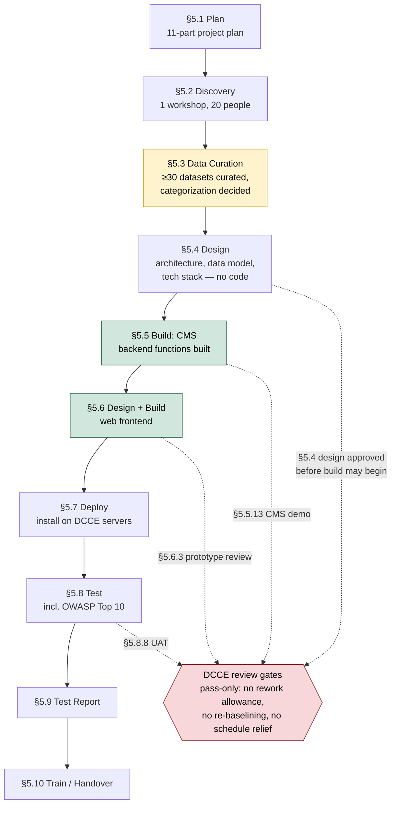
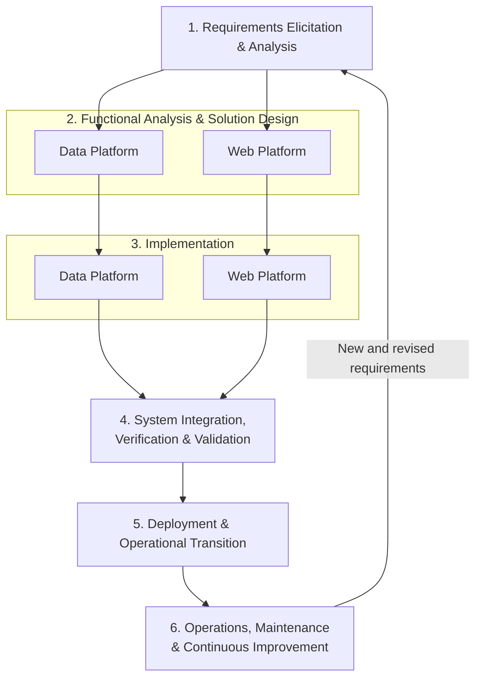

# TOR70 workflow diagram and SDLC analysis

The delivery lifecycle as TOR70 (2569-08-01) writes it in Section 5 (ขอบเขตงานจ้างที่ปรึกษา), followed by an analysis of what that structure means.

## Workflow as written

**Legend:** amber = a sequencing concern (content committed before the design that should govern it); green = clauses that build, not just design, despite sitting under "design" language in the TOR; red = the four points at which work is put in front of DCCE. Those dotted lines are review gates, not iterations — the main sequence runs strictly forward, and no gate defines what happens if the answer is no.

## Analysis

**Plan-first, then light discovery.** §5.1 is an 11-part project plan. §5.2 is exactly one workshop, 20 participants, generic goals (gather opinions, define scope, collect requirements). No persona validation, no service prioritization, no formal requirements sign-off.

**Four review gates, and no iteration.** The TOR does put work in front of DCCE four times: §5.4 requires the design documents to be approved before development may begin, §5.5.13 demos the finished CMS for comment, §5.6.3 convenes a meeting on the wireframes and prototype, and §5.8.8 runs UAT with DCCE staff. What none of them defines is a consequence — no rework allowance, no re-baselining path, no schedule relief if the answer is no. The payment milestones are calendar-gated (day 30 / 120 / 210 / 270 at 20/30/30/20%) and cumulative in scope, each report restating everything before it, so nothing in the commercial structure responds to a gate failing. A gate that can only pass is an approval step, not an iteration. Beyond these four there is no prototype validation with end users outside DCCE, no incremental release, and no sprint structure. This is a textbook waterfall with stage gates.

**§5.3 is data curation, not functional analysis — and it carries a sequencing defect.** Actual functional-requirements analysis for the system lives in §5.4.1, not §5.3. What §5.3 does is more consequential than a labeling issue: §5.3.8 requires the consultant to curate ≥30 datasets, ready for display on the website/dashboard/map, with categorization already decided — before §5.4's data architecture and database design exist. The presentation-layer content gets committed before the schema meant to constrain it.

**§5.4, §5.5, and §5.6 are not all "design" — the TOR's own verbs say otherwise.**
- §5.4 — "วิเคราะห์และออกแบบ" (analyze and design). All 14 sub-items produce documents, diagrams, specs. No code. This is pure design.
- §5.5 — "ต้องดำเนินการพัฒนา" (must develop/build). All 13 sub-items build actual CMS functions, test them, then demo to DCCE. This is the first build phase (backend/CMS), not a design step.
- §5.6 — "ออกแบบ จัดทำ และพัฒนา" (design, produce, and develop). It bundles frontend design and build together, the same way §5.5 bundled CMS design intent and CMS build.

## SDLC phase map

| TOR clause | SDLC stage | What it actually does |
|---|---|---|
| §5.1 | Plan | 11-part project plan |
| §5.2 | Discovery (light) | One workshop, 20 participants — no persona validation, no service prioritization, no formal sign-off |
| §5.3 | Data curation | Curates ≥30 display-ready datasets with categorization decided, ahead of the data architecture that should govern them — a sequencing defect |
| §5.4 | Design | Pure design — zero build |
| §5.5 | Build (backend/CMS) | Builds actual CMS functions; ends with a demo to DCCE (§5.5.13), one of four review gates |
| §5.6 | Design + Build (frontend) | One clause bundling design and development |
| §5.7–§5.10 | Deploy → Test → Report → Train | One undifferentiated block; testing scope includes OWASP Top 10 |

## Actual shape, end to end

Plan → light Discovery → premature Data Production → Design → Build (backend) → Design+Build (frontend) → Deploy → Test → Handover, with a single internal checkpoint and no involvement of real users after the opening workshop.

---
# Reference development lifecycle for TOR70

### Industry-practice basis

The recommended comparison point is a **reference lifecycle**, rather than a universal or rigid “canonical” sequence. The specific methods may vary, but established data-architecture and web-development guidance converges on the same high-level pattern: establish outcomes and the current-state baseline; define testable requirements and a target architecture; build in manageable increments; integrate and validate with users; release into operation; and use operational evidence to guide the next iteration.

This reference lifecycle synthesizes the practices collected in [data-platform-development-cycle.md](./data-platform-development-cycle.md) and [web-platform-development-cycle.md](./web-platform-development-cycle.md). Its main industry anchors are:

- The Australian National Archives' interoperability guidance, which places current-state assessment and factual mapping of existing data, systems, flows, standards, and constraints before target-state implementation: [Current-state assessment](https://www.naa.gov.au/information-management/build-data-interoperability/interoperability-development-phases/current-state-assessment).
- The Open Group's TOGAF architecture-development guidance, which separates baseline and target architecture, gap analysis, stakeholder review, and implementation planning: [TOGAF — Phase C: Information Systems Architectures](https://pubs.opengroup.org/togaf-standard/adm/chap06.html).
- IBM's data-architecture guidance, which connects conceptual, logical, and physical data design to integration, governance, security, and business use: [What is data architecture?](https://www.ibm.com/think/topics/data-architecture).
- BrowserStack's web-application lifecycle guidance, which covers requirements, architecture, implementation, testing, deployment, monitoring, and iterative maintenance: [Web application development guide](https://www.browserstack.com/guide/web-application-development-guide).

For TOR70, these practices should not be interpreted as two isolated lifecycles. The data platform and web platform should be developed as two coordinated tracks around the same priority data products. The data platform supplies trusted datasets, models, metadata, and services; the web platform turns those services into usable search, dashboards, maps, downloads, and decision-support experiences. Their point of synchronization is a shared data-product and interface contract—not a one-time handoff after both platforms are finished.

### Reference Integrated Data and Web Platform SDLC

### High-level stages

| Stage | Purpose | Shared decision or output |
|---|---|---|
| **1. Requirements Elicitation & Analysis** | Establish user needs, business and policy objectives, priority use cases, current systems, constraints, and measurable requirements. | Validated requirements, priority use cases, and current-state baseline |
| **2. Functional Analysis & Solution Design** | Define what the data and web platforms must do, then design their architectures, interfaces, controls, and coordinated solution. | Approved functional specification and solution design baseline |
| **3. Implementation** | Develop the data and web platforms in parallel against the approved design and shared interfaces. | Incremental working components from both platform tracks |
| **4. System Integration, Verification & Validation** | Integrate both platforms and demonstrate that the combined system satisfies technical specifications and validated user needs. | Integrated release candidate with verification, validation, and acceptance evidence |
| **5. Deployment & Operational Transition** | Deploy the accepted system and transfer the knowledge, controls, documentation, and responsibilities needed for production operation. | Production deployment and operational acceptance |
| **6. Operations, Maintenance & Continuous Improvement** | Operate and maintain both platforms, monitor their quality and use, and convert evidence and feedback into revised requirements. | Live services, operational metrics, and the next requirements baseline |

The central principle is that **the data platform is put into use through data products and services**, while the web platform is one important consumption channel for them. Delivery should therefore proceed through repeated vertical slices:

> Priority use case → shared product contract → data pipeline and web interface → working integrated service → user validation → operational use → next iteration

This reference lifecycle provides the missing comparison point for TOR70. It preserves the necessary planning, architecture, security, testing, deployment, and training activities already present in the TOR, but reorganizes them around parallel development, early integration, real-user validation, and an explicit return loop from production evidence to the next delivery increment.

---
# Deviation from the reference lifecycle

The comparison below sets TOR70's Section 5 against the reference lifecycle above — the six-stage Integrated Data and Web Platform SDLC synthesized from the data-platform and web-platform practice notes. It names where the TOR departs from standard practice, then closes by scoring how much of each reference stage the TOR actually requires.

## Where TOR70 departs from standard practice

**Requirements are an output of design, not an input to it.** The system's requirements are written at §5.4.1 — inside the design clause, and downstream of §5.3's data curation. The reference lifecycle establishes validated, testable requirements in Stage 1 and treats them as the input Stage 2 designs against. In TOR70 the only elicitation activity is §5.2: one workshop, DCCE internal staff, generic goals. Everything the design is meant to satisfy is produced by the same party, in the same clause, that produces the design.

**Data and content production precede the architecture meant to govern them.** §5.3.8 requires at least 30 datasets prepared for display with their categorization already decided, and §5.3.9 requires infographics, storytelling summaries and trend analyses — all before §5.4 designs the data architecture and the database. The reference lifecycle puts conceptual and logical data models ahead of the content that populates them, so the schema constrains the content rather than the reverse.

**Web design sits downstream of backend build.** §5.6.1 (sitemap and information architecture), §5.6.2 (wireframes, mockups, prototype) and §5.6.3 (prototype review meeting) are design activities. They are placed in §5.6, after §5.5 has already built the CMS. In the reference lifecycle they belong in Stage 2, running in parallel with data-platform design and before either track is implemented. As written, the CMS's data structures are fixed before anyone has seen what the pages need to show.

**The two platforms run in series, with no shared contract.** The reference lifecycle's central mechanism is a shared data-product and interface contract that lets the data track and the web track proceed in parallel and integrate predictably. No such artifact appears anywhere in TOR70. §5.4.13 requires the database to *support* linkage and exchange with external systems, but specifies no contract — no schema, semantics, update frequency, or quality expectation that either side can build against. Without one, §5.6 can only start once §5.5 has finished.

**Verification runs against the production installation.** §5.7 installs the system on DCCE's servers; §5.8 then tests it, including penetration testing. The reference lifecycle validates in Stage 4 and deploys in Stage 5. The document mentions no development, test, or staging environment anywhere, and no CI/CD. Defects — including security findings under §5.8.6 — are therefore discovered on the machine the system is meant to run on.

**Gates authorize the next stage; they do not change it.** §5.4 requires design approval before development may begin, §5.5.13 demos the CMS, §5.6.3 reviews the prototype, and §5.8.8 runs UAT — four real checkpoints, more than the TOR is usually credited with. The difference from the reference lifecycle is what a checkpoint is for. There, Stage 6 feeds evidence back into Stage 1 and delivery advances through repeated vertical slices, so each pass is expected to revise what follows. In TOR70 a gate can only authorize the next clause. None carries a rework allowance, a re-baselining path, or schedule relief, and payment stays calendar-gated, so no part of the plan downstream of a gate is able to respond to it.

**Acceptance is qualitative.** No uptime figure, response-time target, accessibility standard, or data-freshness threshold appears anywhere in the document. §5.8 therefore has no objective criterion to test against, and §5.9's test report has no objective result to state. The reference lifecycle assigns performance, latency and reliability targets to components during design precisely so verification has something to verify.

**Ingestion is manual file upload.** §5.5.3 builds import functions for CSV, Excel and JSON. There are no source-system connectors, no change-data-capture, no streaming, no scheduled pulls, and no orchestration or scheduling built anywhere in §5.5 or §5.6. The reference lifecycle treats ingestion, transformation and orchestration as the core of the build. A platform fed only by hand has no mechanism to stay current once the consultant leaves.

**The lifecycle ends at handover.** §5.10 trains DCCE staff and the contract closes. There is no operations stage and no return path from operational evidence to a revised requirements baseline — the loop that closes the reference diagram. §15's one-year warranty with a one-hour response commitment covers reactive defect repair during working hours. That is a support obligation, not the operation of a platform.

## Stage coverage

How much of each reference stage TOR70 actually requires:

| Reference stage | Coverage | What the TOR requires | What is absent |
|---|---|---|---|
| **1. Requirements Elicitation & Analysis** | Partial — ~35% | §5.1 project plan with activities, timeline, owners, deliverables and progress checkpoints; §5.2 consultation workshop with structured feedback instruments and a summary report; §5.3.1–§5.3.4 data study, classification and quality assessment; §5.3.7 Data Inventory | Priority use cases and MVP definition; personas and a use-case catalog; stakeholder interviews beyond one internal workshop; current-state assessment of systems, data flows, governance and performance — only the data half is done; non-functional requirements; requirements traceability; success metrics; risk register; solution-options analysis |
| **2. Functional Analysis & Solution Design** | Partial — ~40% | §5.4.1 system requirements; §5.4.2 system workflow; §5.4.3 system, use-case, workflow, data-flow and pipeline diagrams; §5.4.4 system architecture; §5.4.5 logical layers; §5.4.6 server and installation environment; §5.4.7 technology stack; §5.4.8 data architecture across structured, semi-structured, unstructured and spatial data; §5.4.9 database design; §5.4.10 pipeline design; §5.4.11 integration architecture; §5.4.13 exchange standards; §5.4.14 role and permission matrix; formal DCCE design approval before build | Data contracts and standards; data ownership and stewardship model; data-quality rules and SLAs; metadata and lineage design; semantic layer; as-is architecture baseline; a named reference model or pattern; gap analysis against that baseline; environment separation and migration sequence; interface contracts with per-component targets. UX/UI design is present but displaced into §5.6 |
| **3. Implementation** | Partial — ~45% | §5.1 and §10 mobilization and 15 named roles; §5.5.1–§5.5.11 CMS build — content, datasets, dashboard data administration, documents and media, publishing workflow, authentication, accounts, back-office search, audit trail; §5.6.4–§5.6.13 frontend — landing page, responsive display, news, publications, display formats, interactive dashboard, search and filter, CSV/Excel download, chart image export | Environments and CI/CD; real ingestion — §5.5.3 is file upload only; orchestration and scheduling with retries, alerts and job SLAs; transformation workflows with quality rules and fail/flag behavior; storage zones or layers; a catalog service and lineage capture; serving APIs and semantic models for consumers; soft launch ahead of full launch |
| **4. System Integration, Verification & Validation** | Substantial — ~65% | §5.8.1 test plan; §5.8.2 functional; §5.8.3 integration; §5.8.4 data validation and quality; §5.8.5 website display and usability; §5.8.6 penetration testing including OWASP Top 10; §5.8.7 backup and restore; §5.8.8 UAT with DCCE staff; §5.8.9 defect remediation and retest; §5.9 test report | Performance and load testing, and any SLA target to validate against; accessibility testing; explicit cross-browser and cross-device coverage; reconciliation against source systems, schema tests and freshness verification. The whole stage also runs after §5.7 has installed on the production target |
| **5. Deployment & Operational Transition** | Substantial — ~65% | §5.7.1 full component installation; §5.7.2 connection configuration; §5.7.3 backup and recovery setup; §5.7.4 installation without disrupting existing DCCE services; §5.7.5 installation manual; §5.10.1–§5.10.7 training plan, curriculum, on-the-job technical training, CMS and frontend training, evaluation, administrator/CMS/frontend manuals and FAQ, training report | Monitoring, logging and error tracking established at launch; phased or soft rollout; operational runbooks and incident procedures; a named operational owner inside DCCE |
| **6. Operations, Maintenance & Continuous Improvement** | Minimal — ~12% | §15 — one year of warranty with a one-hour response during working hours | Monitoring of performance, errors, data freshness, quality or cost; usage analytics and adoption measurement; change management for new sources, schema evolution and versioning; an improvement backlog; a next-increment roadmap; any return path from operational evidence to a revised requirements baseline |

**How these figures were derived.** Coverage is scored against the reference lifecycle's own constituent activities, taken from the two practice notes cited above — [data-platform-development-cycle.md](./data-platform-development-cycle.md) (A1–A7 discovery, B1–B10 design, C1–C11 build and integration) and [web-platform-development-cycle.md](./web-platform-development-cycle.md) (stages 1–8). Each constituent activity scores 1 where the TOR requires it, 0.5 where it is partially required, and 0 where it is absent; coverage is the resulting proportion. Stage 6, for example, scores 1 of 8 — the warranty gives a reactive response channel and an implied patching obligation, and nothing else in that stage appears. Stage 4 scores 6 of 9.

## Reading the pattern

TOR70 requires roughly 45% of the reference lifecycle, and the shortfall is not spread evenly. It is concentrated at both ends: the front, where the work of establishing what to build and for whom belongs, and the back, where the work of running what was built belongs. The middle — build, test, deploy, train — is the strongest part of the document and in places genuinely thorough.

That shape is diagnostic. TOR70 is strongest exactly where a **website** contract is strong, and weakest exactly where a **data platform** needs strength: product framing and validated requirements up front, contracts and governance during design, orchestration during build, and operations after handover. It reads as a well-formed web-development contract carrying a data-platform mandate that it does not scope, sequence, or staff for.

---
# Building on CRDB instead of starting over

TOR70 cites no CRDB artifact. Not one clause references the conceptual data model, the glossary, the metadata standard, the data catalog, the sitemap, the service business cases, or the requirement specification — all of which exist, most of them sealed. The scope of work instructs the incoming contractor to survey the data estate, build a data inventory, define categories, write system requirements, design the data architecture and design the sitemap, as though none of that had been done.

CRDB was the planning, requirement-analysis and design phase for this platform. TOR70 is the build contract it was meant to hand off to. As drafted, the handoff does not happen. Two costs follow: the contractor is paid to re-derive work that already exists, and the artifacts CRDB deliberately deferred to the build phase are named nowhere, so they risk becoming nobody's job.

## What CRDB already delivers

| Asset                                        | Volume and status                                                                                                                                                                                                                      | The TOR clause that needs it |
| -------------------------------------------- | -------------------------------------------------------------------------------------------------------------------------------------------------------------------------------------------------------------------------------------- | ---------------------------- |
| Data catalog and baseline inventories        | 260 catalog entries, organized against the international risk framework the platform uses throughout; baseline dataset and information-product inventories complete                                                                    | §5.3.1, §5.3.3, §5.3.7       |
| Developer-Ready Design Requirements (DRD v2) | 75 requirements, each with EN/TH text, sitemap node, deliverable, service brief, data spec and matched source assets — 16 FULL, 34 PARTIAL, 25 GAP; 30 labelled "Ready to build" and 15 "Already covered"                              | §5.4.1, §5.6.1               |
| Information architecture                     | NCAIF Detailed Sitemap v9 — 38 nodes, nine iterations, with UX evaluation reports behind the design decisions                                                                                                                          | §5.6.1                       |
| Conceptual data model                        | 45 entities across 8 domains, with relationships, ERD and technical specification                                                                                                                                                      | §5.4.8, §5.4.9               |
| Glossary                                     | v5, 73 governed terms                                                                                                                                                                                                                  | §5.3.6                       |
| Metadata standard                            | 12 required fields, aligned to ISO 19115 and the DGA national guideline                                                                                                                                                                | §5.3.7, §5.4.13              |
| Governance operating model                   | Four-tier model with Data Owner (Group Director level) and Data Steward roles, plus a data governance user manual                                                                                                                      | §5.4.14                      |
| Service business cases                       | 9 high-signal services, each covering the problem, the evidence, the value and the obstacles                                                                                                                                           | §5.2, §5.4.1                 |
| Loss and damage standard                     | Minimum dataset standard and reporting form, tested against ten years of village-level disaster records from DDPM                                                                                                                      | §5.3, §5.4.9                 |
| Published content                            | 10 finished articles with infographics, plus a node-level content storyboard and synthesis guide                                                                                                                                       | §5.3.9                       |
| Stakeholder evidence                         | In-depth stakeholder interview summary, demand analysis, and a use-case-to-service model                                                                                                                                               | §5.2                         |
| Business NFR thresholds                      | Data-freshness, quality, retention and access targets per service — **draft, unsealed**, and recorded as dropped from the sealed WP6 scope. Available material rather than a finished deliverable, and it should be described that way | §5.8 acceptance              |

One figure needs care. The WP8 Recommendations Report quotes the DRD's **v1** counts — 73 requirements at 21 full, 24 partial, 28 gap. Version 2 of 20 August 2026 supersedes it at 75 requirements, 16 full, 34 partial, 25 gap. The v2 figures are used throughout this section.

## Overlap the TOR does not avoid

Not every repetition is waste. Some artifacts genuinely warrant a build-time re-check; what is wasteful is doing that from scratch rather than from what exists. Two verdicts are used below — **duplicate**, where the artifact exists in finished form and re-deriving it produces nothing but a second, possibly incompatible version, and **adopt and verify**, where re-examination is legitimate but the starting point should not be a blank page.

| Clause | Instructs the contractor to | Already exists | Verdict |
|---|---|---|---|
| §5.2 | Hold one workshop to gather requirements and set the development frame | 9 service business cases, use-case-to-service model, in-depth stakeholder interviews, demand analysis, A-BTR requirement analysis | Adopt and verify — a workshop is well placed as validation of existing findings, not as first elicitation |
| §5.3.1 | Study, survey and collect existing data, systems and sources | 260-entry catalog, unified digital asset database, DCCE information-system baseline, reality-first asset audit | Duplicate |
| §5.3.3 | Classify structured, semi-structured and unstructured data | Type and format already carried per catalog entry | Duplicate |
| §5.3.4 | Assess data readiness, quality and limitations | WP2 findings report, hardened catalog notes, per-entry quality dimensions | Adopt and verify — build-time profiling against the live pipeline is legitimate |
| §5.3.6 | Define data and content categories | 8 CDM domains, 45 entities, 73 glossary terms | Duplicate — and the sharper risk here is a second taxonomy that does not reconcile with the first |
| §5.3.7 | Build a data inventory recording name, description, type, category, source, owner and format | Baseline dataset and information-product inventories, complete, plus the 12-field metadata standard | Duplicate — field for field |
| §5.3.9 | Produce infographics, storytelling summaries and trend analyses | 10 finished articles with infographics, and a content storyboard | Split — duplicate for what exists, genuinely new for the 25 GAP requirements |
| §5.4.1 | Analyze and write the system requirements | DRD v2's 75 requirements, 30 of them already labelled ready to build | Duplicate at the requirement level — though the system and technical NFRs are genuinely TOR70's, which CRDB states explicitly |
| §5.4.8 | Design the data architecture | CDM conceptual and logical layers, ERD, technical specification | Adopt and verify — the physical design is genuinely new work |
| §5.4.13 | Support standard data exchange | DGA open-data standard, metadata aligned to ISO 19115 | Duplicate — the standard is already selected |
| §5.4.14 | Produce a user role and permission table | Four-tier governance model with Data Owner and Data Steward roles | Adopt and verify — mapping those roles onto system permissions is new |
| §5.6.1 | Design the sitemap, menu structure and information architecture | Sitemap v9, 38 nodes, UX-evaluated across nine iterations | Duplicate |

## What CRDB deferred that TOR70 must absorb

CRDB did not finish everything, and it said so. These items were named, owned and phased forward rather than quietly dropped — but TOR70 does not pick any of them up.

**Artifacts that must exist before code is written.** Functional specifications for the two priority services, A-BTR and disaster-loss-statistics — not started. Assumption log and data-specific acceptance criteria for those same services. Data contracts, or written exchange agreements with source agencies, stating what data moves, on what schedule and in what form — cut from CRDB scope on 6 August 2026. The reference data matrix, deferred to TOR70 by a dated decision record. A client dependency register. The loss-and-damage ingestion pipeline, including the one unresolved engineering problem the pilot surfaced: financial disbursement records are held in aggregate and cannot yet be matched to individual disaster events. The metadata standard operationalized as validation rules enforced by the CMS at publication time. And a content production plan for the 34 partial and 25 gap requirements, naming who writes each piece and by when.

**Requirements approval before implementation.** Because the CRDB team will no longer be present during TOR70 delivery, the contractor must read the designated CRDB reports and artifacts, interpret them into technical software-development language, and explain that interpretation to DCCE. The contractor must consolidate the functional, data, content, governance and non-functional requirements for every product and platform component into a traceable baseline. DCCE must review and formally approve this complete requirements baseline before the corresponding solution is designed and built. Any ambiguity, assumption, dependency or proposed departure from CRDB must be made visible through that approval process rather than resolved silently by the contractor.

## Coverage re-scored with CRDB adopted as baseline

The coverage table above scores TOR70 as a standalone contract. Scoring it again — same method, same constituent activities, but counting an activity as satisfied where a CRDB deliverable already supplies it — gives the second column.

| Reference stage | As written | With CRDB adopted | What supplies the lift |
|---|---|---|---|
| **1. Requirements Elicitation & Analysis** | ~35% | **~70%** | Stakeholder interviews, nine service business cases and the demand analysis close the discovery gap; the catalog and asset audit supply the current-state baseline; the DRD supplies a requirement set; WP8's sequencing supplies the roadmap |
| **2. Functional Analysis & Solution Design** | ~40% | **~80%** | The CDM, glossary and metadata standard supply the data design; sitemap v9 and its UX evaluations supply the information architecture; the WP5 framework supplies governance; the WP7 gap analysis supplies the baseline-to-target comparison |
| **3. Implementation** | ~45% | **~50%** | Almost nothing. The loss-and-damage standard supplies one tested pipeline specification and the metadata standard supplies CMS validation rules; everything else here is genuinely new work |
| **4. System Integration, Verification & Validation** | ~65% | **~70%** | The business NFR thresholds, draft as they are, supply data acceptance targets the TOR otherwise lacks; the loss-and-damage standard was already tested against real records |
| **5. Deployment & Operational Transition** | ~65% | **~70%** | The governance operating model names the operational owner roles the TOR leaves blank |
| **6. Operations, Maintenance & Continuous Improvement** | ~12% | **~30%** | WP8's sequencing and the evolutionary roadmap supply a next-increment plan; the Data Governance Committee supplies a change-control body for model and schema changes |
| **Overall** | **~45%** | **~62%** | |

The lift is roughly seventeen points, and it costs nothing — the work is already paid for and delivered. It also lands exactly where TOR70 is weakest. Stages 1 and 2, the two lowest scores in the original assessment, are the two that CRDB was commissioned to produce.

## Where TOR70 genuinely builds forward

Stage 3 barely moves. That is the finding that keeps the rest of this honest: building is genuinely TOR70's job, CRDB never claimed it, and nothing in the build scope is duplicated. The overlap is confined almost entirely to stages 1 and 2.

The clauses that are additive, and should be left alone: §5.4.5 to §5.4.7, covering logical deployment architecture, server environment and technology stack. §5.4.9's physical database, realized from the conceptual and logical model rather than invented. §5.4.10 and §5.4.11, the pipeline and integration architecture. The whole of §5.5 — the CMS does not exist in any form. §5.6.2's wireframes, mockups and prototype, since a sitemap is an information architecture and not a visual design. §5.6.4 to §5.6.13, the frontend build. §5.7's installation and environment work. All of §5.8's testing, including penetration testing, UAT and backup-restore verification. §5.10's training and handover. And §15's warranty.

Read together with the deferred list above, the shape of the correction is straightforward. TOR70's build scope is sound and should not be reduced. What needs to change is where the contract starts and what it is required to carry forward — adopting CRDB's outputs as the baseline instead of the blank page, and picking up the requirements, specifications, contracts and dependencies CRDB named on its way out.

---
# The fundamental shift in TOR70's drafting mindset

The individual weaknesses identified in TOR70 are not ten separate drafting problems. Most are symptoms of a smaller number of underlying assumptions about who owns the platform, where the project begins, and what is actually being procured. The evidence in [TOR70_failure-modes-literature-validation.md](./TOR70_failure-modes-literature-validation.md) and the product-ownership and phased-governance roadmap in [Slide-deck-FGD3-2-July-2026.md](../00_Strategy_Reports/Slide-deck-FGD3-2-July-2026.md) point to five fundamental principles.

## 1. DCCE owns the products; the contractor implements them

DCCE must own the policy purpose, user needs, product and service requirements, acceptance criteria, priorities and long-term direction. The contractor's role is to interpret that intent into sound technical language, advise DCCE, and implement the approved requirements. The contractor must not become the de facto product owner simply because it writes the technical documents and builds the system.

## 2. TOR70 must continue from CRDB, not restart from zero

CRDB's requirements, service concepts, data catalog, data model, glossary, metadata standard, governance framework, sitemap and roadmap are the starting baseline. TOR70 should require the contractor to understand, verify, operationalize and extend this foundation. Repeating the same discovery and design work from a blank page loses institutional knowledge and creates competing versions of the platform's foundations.

## 3. Build services around policy and user needs

Datasets, dashboards, maps, content and web functions are ingredients of defined information products and services. Their value comes from the decisions and user needs they support, not from how many files, screens or features the contractor delivers. Each data and web component should therefore be traceable to an approved use case and a measurable outcome.

## 4. Turn governance into system behaviour

CRDB has already established the groundwork for data ownership, stewardship, metadata, quality and standards. TOR70 must now translate that groundwork into operational workflows: who supplies data, who validates it, who approves publication, how quality is checked, how changes are recorded, and how access is controlled. Governance should be visible in the behaviour of the platform, not remain a report beside it.

This also requires a correct understanding of the CMS. Content staff need publishing workflows; Data Stewards need metadata, quality, validation and approval functions; Data Custodians need pipelines, job status, errors, access administration and backup controls; and Data Owners need accountability and approval information. These may be accessible through a coordinated back office, but they are not all CMS functions.

## 5. Procure a lasting DCCE operating capability

The intended result is not installed software that becomes DCCE's responsibility only after handover. The TOR must establish how DCCE will own, operate, accept, monitor, maintain and improve the platform throughout its lifecycle. This includes clear internal roles, measurable requirements, operational procedures, platform monitoring and a controlled route for future change. The phased roadmap—first establishing ownership, governance and standards, then putting them into use and embedding them in future TORs—must be reflected in the contract's delivery logic.

The fundamental shift can be stated in one sentence:

> **TOR70 should not procure a contractor-owned website containing DCCE data; it should procure the implementation of a DCCE-owned data-service capability built on the CRDB foundation.**

---
# Illustrative platform strategy: build the platform through five real products

The principles above become easier to understand when expressed as a concrete delivery scenario. The following is the recommended strategy for TOR70. It is deliberately more specific than the reference lifecycle: the lifecycle explains **how** development should proceed, while this strategy decides **where DCCE should start and how the platform should grow**.

The project should not begin by building an empty website, a general-purpose CMS, and a collection of disconnected datasets in the hope that useful services will emerge later. It should begin with five named products that give the data platform and web platform a reason to exist. Three products already exist in DCCE's analytical estate and should be brought under common governance and made usable through the new platform. Two additional products should be completed as end-to-end services because they address established policy needs and extend the platform into new data domains.

## Step 1 — Adopt CRDB and establish DCCE ownership

TOR70 should name the CRDB deliverables as the contractual baseline. At project inception, the contractor must study that baseline, translate it into technical software-development language, and present its interpretation back to DCCE. DCCE, acting as Product Owner, must approve the requirements for the five products and the shared platform before detailed design and implementation begin.

This is not a repetition of the CRDB project. It is the transfer of CRDB's institutional knowledge into the build contract. The approved baseline should establish the purpose of each product, its users, required data, business rules, data ownership, expected outputs and measurable acceptance criteria.

## Step 2 — Put three existing analytical products into operational use

The first product group should consist of analytical assets DCCE already has:

1. the spatial climate-risk database;
2. hazard and exposure maps; and
3. the Climate Risk Index (CRI).

The contractor should not recreate their analytical methods unless the approved requirements identify a necessary correction. Its task is to onboard and operationalize them: reconcile their source data, apply the CRDB metadata and governance standards, assign ownership and update responsibilities, establish repeatable ingestion and quality checks, and expose their outputs through documented platform services and appropriate web interfaces.

This gives DCCE an early, practical result. Existing investments become findable, governed, updateable and usable through one coherent service environment. At the same time, the contractor proves that the proposed architecture works with real DCCE data before extending it further.

## Step 3 — Develop two new products from approved requirements

The second product group should consist of:

1. the A-BTR reporting service; and
2. the disaster loss-statistics service.

These should not begin as dashboard specifications. For each product, the contractor must first turn the CRDB evidence into a complete functional and data specification: the policy question, intended users, source agencies, required variables, calculation and aggregation rules, workflow, outputs, quality expectations, update cycle and acceptance tests. DCCE must approve that specification before it is built.

Each new product should then be delivered as a complete vertical service—not merely a page or a dataset:

> source data → governed ingestion → validation and transformation → approved data product → platform service or API → web interface → DCCE acceptance → operational responsibility

This ensures that the visible dashboard, map, report or download is backed by a maintainable data process. Where required source data or official methods are not yet available, the contractor must expose the dependency and implement the agreed interim treatment; it must not silently invent data or calculation rules.

## Step 4 — Extract the common capabilities into the shared platform

The five products should not become five separate applications. As they are implemented, their common needs should be built once as reusable platform capabilities:

- data-source registration and data contracts;
- scheduled ingestion, transformation and publication;
- metadata, catalog and lineage management;
- data-quality validation and exception handling;
- ownership, stewardship, review and publication approval;
- common identifiers, reference data and exchange standards;
- reusable APIs and serving layers for dashboards, maps, search and download;
- authentication, authorization and audit history;
- operational monitoring, alerts, backup and recovery; and
- coordinated content-management functions for web publishing.

This is how the platform should emerge: not as a large empty technical shell, but as the reusable capability created while solving five real DCCE problems. Every common function should have at least one delivered product proving that it works.

## Step 5 — Establish the operating network around the platform

DCCE should remain the Product Owner for the portfolio. Data Owners should approve the purpose, authoritative status and use of the data. Data Stewards should manage metadata, quality, validation and publication workflows. Data Custodians should operate pipelines, permissions, monitoring, backup and technical environments. For data supplied by other agencies, named focal points and data agreements should define what is supplied, in what form, how often and under what conditions.

The contractor must configure the platform around these responsibilities, train each role using the five actual products, and demonstrate the operating procedures before handover. This turns CRDB's governance framework into daily system behaviour rather than leaving it as a separate policy document.

## What DCCE receives from this strategy

At the end of TOR70, DCCE should receive more than a website containing thirty datasets. It should receive:

- three existing analytical products brought into a governed and maintainable service environment;
- two new policy-relevant products operating from source data through to user-facing services;
- one shared data and web platform whose capabilities have been proven through those five products;
- assigned DCCE ownership and operating procedures for keeping the products current;
- reusable standards, contracts, pipelines and interfaces for onboarding the next product; and
- a clear boundary between content management, data operations, governance and technical administration.

The strategic sequence is therefore:

> **Adopt the CRDB foundation → operationalize existing products → develop approved new products → consolidate shared capabilities → transfer an operating platform to DCCE.**

The five products make this scenario concrete, but the enduring deliverable is the reusable capability behind them. TOR70 should judge success by whether DCCE can operate those products and add the next one—not by the number of uploaded files, pages, diagrams or software components delivered.

The recommended lifecycle additions below show what TOR70 must require at each stage to make this strategy executable.

---
# What to add to each reference lifecycle stage

The CRDB-adjusted coverage shows that the remedy is not to rewrite TOR70 as a wholly different contract. The practical correction is to add one missing high-level step to each lifecycle stage. The main view below states those steps; the detailed activities are retained in collapsible sections for use when drafting the TOR.

## 1. Requirements Elicitation & Analysis

**Add a CRDB baseline-assimilation and requirements-approval gate.** The contractor must demonstrate that it understands the CRDB foundation, translate it into technical requirements, communicate that interpretation to DCCE, and obtain DCCE approval of all requirements before anything is designed or built.

Detailed activities and evidence
	- Review all designated CRDB reports, specifications, models, standards, catalogs, decision records and content assets.
	- Produce a CRDB Baseline Assimilation and Technical Interpretation Report.
	- Map the CRDB baseline to functional, data, content, governance and non-functional requirements.
	- Distinguish adopted baselines, items requiring verification, deferred work and genuinely new work.
	- Record assumptions, ambiguities, dependencies, inconsistencies and proposed departures from CRDB.
	- Establish measurable requirements for data quality and freshness, availability, performance, access, retention, backup and recovery.
	- Establish traceability from each approved requirement to its product, platform component and acceptance test.
	- Conduct a contractor playback session in which the contractor explains its interpretation to DCCE in both technical and operational language.
	- Require DCCE to approve the complete requirements baseline before progression to solution design and implementation.

## 2. Functional Analysis & Solution Design

**Add an integrated technical-design baseline for the data and web platforms.** The approved requirements must be translated into one coordinated solution design, with explicit contracts between data sources, data products, platform services and web functions.

Detailed activities and evidence
	- Conduct a baseline-to-target gap analysis for existing DCCE systems and the proposed platform.
	- Derive physical data models and service designs from the CRDB conceptual data model, glossary and metadata standard.
	- Define data-product, source-data and interface contracts covering schema, terminology, identifiers, ownership, update frequency, quality and exchange format.
	- Define metadata validation and publication controls within the CMS.
	- Map governance roles to system permissions, review and approval responsibilities.
	- Design separate development, test, staging and production environments, including release and migration arrangements.
	- Produce an approved integrated solution-design baseline before implementation.

## 3. Implementation

**Add end-to-end implementation of governed data products and their web uses.** Implementation must connect source data, processing, governance, platform services and user-facing functions rather than treat data upload and website display as separate deliverables.

Detailed activities and evidence
	- Build in controlled development, test and staging environments.
	- Implement source-to-serving pipelines for the approved data products.
	- Implement scheduled ingestion, transformation and publication with logs, retries, alerts and job-status visibility.
	- Enforce data-quality rules and defined handling for failed or questionable data.
	- Implement appropriate raw, curated and published data layers.
	- Capture catalog, metadata and lineage information.
	- Provide versioned APIs or other documented service interfaces.
	- Implement ownership, stewardship, review, approval, audit and change-history controls.
	- Demonstrate an integrated working path from source data through the data platform to the web interface.

## 4. System Integration, Verification & Validation

**Add requirements-based validation of the integrated platform before production deployment.** The combined data and web platform must be tested against the DCCE-approved requirements baseline and objective acceptance criteria in a controlled environment.

Detailed activities and evidence
	- Trace every approved requirement to an implemented function and test result.
	- Reconcile source records, transformations and published outputs.
	- Test schemas, metadata, data quality, freshness and interface contracts.
	- Test performance, load, accessibility, responsive behaviour and browser compatibility against agreed targets.
	- Rehearse backup and restoration and verify recovery objectives.
	- Apply staged acceptance: component verification, integrated validation, DCCE UAT and release acceptance.
	- Classify defects, remediate them and retest, with explicit treatment of critical and high-severity findings.

## 5. Deployment & Operational Transition

**Add operational-readiness acceptance before handover.** Deployment must transfer a supportable service—not only installed software—by establishing monitoring, operating procedures, ownership and controlled release arrangements.

 Detailed activities and evidence 
	- Use a controlled release and migration plan with rollback procedures.
	- Establish production monitoring, logging, alerts and incident escalation.
	- Provide runbooks for dataset onboarding, failed jobs, review and publication, access changes and backup restoration.
	- Assign DCCE operational ownership and governance responsibilities.
	- Apply an operational-readiness checklist covering functions, data, security, performance and support.
	- Provide a complete handover package covering architecture, contracts, dependencies, configuration, deployment, monitoring and known limitations.
	- Train DCCE using the actual operating procedures and implemented services.

## 6. Operations, Maintenance & Continuous Improvement

**Add a defined operating and improvement process beyond the warranty.** The platform must be monitored, governed and maintained after launch, with operational evidence carried into a controlled improvement roadmap.

Detailed activities and evidence

- Define post-launch responsibilities between the contractor and DCCE.
- Monitor and report availability, performance, usage, data freshness, data quality, security events and unresolved defects.
- Define processes for onboarding data and changing schemas, metadata, source agreements and permissions.
- Establish controlled change management for data models, interfaces, dashboards, content and calculation methods.
- Establish user support and incident management with severity levels and response targets.
- Maintain a feedback and improvement register.
- Measure adoption and use of the delivered services.
- Conduct a post-launch review and produce a documented next-increment roadmap.

## Minimum cross-stage additions

If the TOR must remain concise, the most important additions can be expressed as five cross-stage requirements:

1. **Require baseline assimilation and approval.** Name the CRDB artifacts, evaluate the contractor's technical interpretation, and require DCCE approval of the complete requirements baseline before design and implementation.
2. **Build priority data products end to end.** Require each priority service to connect an identified source, governed dataset, data pipeline, interface and usable web function.
3. **Define contracts and acceptance criteria.** Add data contracts, interface contracts, measurable NFRs and traceability from requirement to test.
4. **Separate build, test and production environments.** Add controlled promotion, monitoring, rollback and operational readiness before deployment.
5. **Make operations part of delivery.** Assign DCCE ownership, define runbooks and metrics, and require a post-launch improvement roadmap.

Together these additions preserve TOR70's implementation core while correcting the specific weaknesses revealed by the reference lifecycle and the CRDB handoff. They also make the contract legible: CRDB supplies the validated foundation; TOR70 turns that foundation into governed, integrated and operational data and web platforms.
