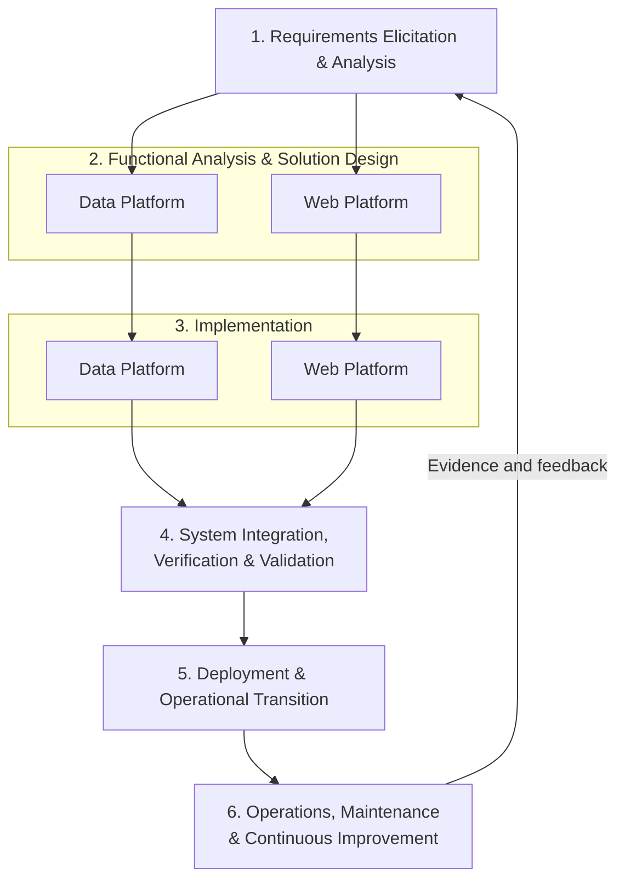

# TOR70 High-Ambition Agile-Like Delivery Plan

## Purpose of this note

This note proposes a high-ambition delivery version of TOR70. It does not replace the TOR. It describes how DCCE could use the same 270-day period and ฿12.5 million budget to deliver a working platform earlier, expose the platform to real use, learn from users, and use that evidence to guide the final release.

The proposal is intentionally ambitious: it treats the data platform and web platform as products that must become useful during the project, rather than as components that are only assembled for final handover.

## What agile means in this context

Agile is an iterative way of developing software. Instead of attempting to define and build the entire system before users see it, the team delivers a small but working part of the system, obtains feedback, and then improves or expands it through repeated cycles.

Agile does not mean that the project has no plan, no scope, or no controls. It means that planning, design, implementation, testing, and learning happen in shorter repeated cycles, while the overall objectives, budget, quality standards, and governance remain controlled.

For DCCE, an agile-like approach would mean:

- DCCE sees working software during the project, not only reports and final demonstrations.
- The data and web teams develop in parallel around the same priority data products.
- DCCE and users validate real functions, not only wireframes.
- Feedback becomes a managed backlog rather than an informal list of requests.
- DCCE decides which improvements have the greatest value within the remaining time and budget.
- Mandatory TOR requirements remain protected by a fixed baseline and explicit acceptance criteria.

The appropriate model is therefore not unrestricted Scrum. It is a **stage-gated, iterative, dual-track delivery lifecycle** combining agile development with public-sector control.

## Why this benefits DCCE

The current TOR already asks for a complex combination of data preparation, CMS, website, dashboards, maps, search, downloads, security, testing, training, and handover. It is difficult to know from documents alone whether these functions will work together or whether users will find them useful.

An early integrated MVP would allow DCCE to discover, while there is still time to act:

- whether the selected data can answer the intended questions;
- whether users can find and understand the information;
- whether the data model supports the required dashboard and web experiences;
- which content and features are genuinely needed;
- which functions are technically difficult or too expensive;
- which requirements should be strengthened, simplified, deferred, or rejected.

This changes DCCE’s role from reviewing a finished supplier product to actively governing a platform as it develops. It also reduces the risk of receiving a technically complete system that is difficult to use, poorly populated, or misaligned with actual information needs.

## Why it is doable within the timeline and budget

The current TOR provides 270 days—approximately nine months—with formal milestones at days 30, 120, 210, and 270. The current payment proportions are 20%, 30%, 30%, and 20% ([TOR §§7–8](./TOR70_การพัฒนาระบบฐานข้อมูลด้านการปรับตัว_2569-08-01.md)).

That period can support an MVP and a short public-beta cycle if the project:

- starts with a limited number of priority data products;
- uses existing DCCE infrastructure and components where appropriate;
- builds data and web functions in parallel;
- uses two-week internal iterations with four-week formal DCCE reviews;
- tests and integrates continuously rather than waiting until the end;
- reserves a bounded amount of capacity for post-beta improvements;
- keeps the mandatory technical baseline fixed.

The ฿12.5 million budget is suitable for a focused MVP and prioritized platform delivery. It is not suitable for unlimited feature expansion. The backlog must therefore be bounded by the approved scope, available delivery capacity, and explicit DCCE prioritization decisions.

## High-ambition delivery timeline

| Period | Main activity | Required outcome |
|---|---|---|
| **Days 1–30** | Requirements Elicitation & Analysis | Validated priority use cases, current-state baseline, initial product backlog, MVP definition, initial architecture runway, and release plan |
| **Days 31–90** | Functional Analysis, Solution Design and early implementation | Data-product definitions, web user flows, initial data contracts, prototypes, priority pipeline work, and early web components |
| **Days 91–120** | Prototype verification and integrated MVP preparation | DCCE-verified prototype, approved MVP baseline, first connected data/web vertical slice, and release-readiness evidence |
| **Days 121–180** | Parallel implementation and integration | Working integrated MVP using approved real data and priority web functions; DCCE validation and defect correction |
| **Days 181–210** | Public beta and evidence collection | Controlled public beta for approximately 3–4 weeks, usage evidence, user feedback, content/data-gap analysis, and backlog options |
| **Around day 210** | DCCE Backlog Prioritization Gate | Formal decision on which improvements are implemented within the remaining capacity |
| **Days 211–250** | Selected improvement and hardening iterations | Implementation of selected backlog items, regression testing, security retesting, performance improvement, and operational preparation |
| **Days 251–270** | Production release and operational transition | Final acceptance, production deployment, training, documentation, support arrangements, and handover |

The current contractual milestone dates can remain, but their acceptance content should be revised so that the milestones recognize working product increments and beta evidence, not only cumulative reports.

## Integrated lifecycle

The data platform is not treated as a back-office component that must be completed before the website begins. Both tracks develop around shared data products and interface agreements.

The basic delivery unit is an integrated vertical slice:

> Priority use case → source data → validated data product → web experience → user validation → operational use

## Public-beta model

The MVP should first be validated by DCCE. After the release gate is passed, it can be made available as a clearly labelled **DCCE-validated Public Beta** or **Controlled Public Pilot**.

The beta should be a functioning service, not a wireframe. It should contain:

- real approved datasets;
- functioning ingestion or update arrangements;
- working website functions;
- defined user journeys;
- data provenance and usage conditions;
- feedback and support channels;
- monitoring and rollback arrangements.

Before public access, DCCE should approve the datasets, content, user-facing claims, privacy arrangements, accessibility, security evidence, and operational responsibilities. Internal CMS and restricted data should not be exposed merely because the public frontend is being tested.

The beta is not final acceptance. It is a controlled learning release that allows DCCE to observe actual use while there is still time to improve the system.

## Feedback and backlog governance

The beta should collect:

- search behaviour and zero-result searches;
- page, dashboard, map and download usage;
- task-completion problems;
- data-quality reports;
- accessibility issues;
- support questions and incidents;
- structured user feedback;
- targeted usability-test findings.

All findings should enter a managed backlog and be classified as:

1. mandatory security, privacy, data-integrity, accessibility, or critical usability correction;
2. improvement to an approved priority use case;
3. content or metadata gap;
4. technical debt or operational improvement;
5. new feature outside the approved baseline;
6. future idea requiring further investigation.

DCCE should hold a formal Backlog Prioritization Gate around day 210. The consultant should present the evidence, estimated effort, dependencies, and consequences of each option. DCCE then records whether each item is to be implemented, deferred, rejected, or investigated further.

Backlog prioritization must not mean that DCCE can erase mandatory TOR requirements after contract award. It should apply only to a predefined improvement capacity within the original platform boundary.

## Required TOR treatment

The high-ambition version would require targeted amendments or clarifications rather than a complete rewrite.

### Section 5.1 — Iterative delivery plan

Require the project plan to include:

- product backlog and release plan;
- two-week internal iterations;
- regular DCCE demonstrations;
- Definition of Ready and Definition of Done;
- decision and approval points;
- risk and assumption log;
- change-control process.

### Sections 5.2–5.4 — Requirements and design baseline

Add priority use cases, an MVP functional baseline, acceptance criteria, a DCCE Product Owner, and a mechanism for incremental design approval.

The current sequence requires §5.3 data work to inform §5.4 design and requires design approval before development. The amended version should permit an approved initial baseline to be elaborated through controlled increments without losing architectural governance.

### Sections 5.5–5.6 — Parallel implementation

Require the data and web platforms to be developed as coordinated increments. Demonstrations should use real approved data wherever possible, rather than treating CMS functions and website prototypes as separate deliverables.

### Section 5.7 — Staged deployment

Permit deployment to development, test, public-beta, and production environments, with versioning, configuration management, access control, monitoring, and rollback procedures.

### Section 5.8 — Two release gates

Apply testing at two points:

- **Public-beta gate:** functional, integration, data-quality, security, privacy, accessibility, and operational-readiness checks;
- **Final-production gate:** regression testing, security retesting, UAT, defect closure, backup/restore verification, and final acceptance.

### New public-beta clause

Define the beta’s:

- duration—approximately 3–4 weeks;
- approved users, datasets and content;
- publication authority;
- monitoring and analytics;
- feedback channels;
- incident response and rollback;
- beta evidence report;
- DCCE backlog-prioritization meeting.

### Sections 7–8 — Milestone and payment alignment

The payment percentages may remain 20/30/30/20, but the milestone outputs should change to:

- **Day 30:** requirements baseline, priority use cases, backlog and release plan;
- **Day 120:** DCCE-verified prototype, approved MVP baseline, and first integrated working slice;
- **Day 210:** integrated MVP/public beta evidence, feedback analysis, backlog decision record, and updated release candidate;
- **Day 270:** mandatory baseline, selected improvements, final testing, production release, training and handover.

## Boundaries and safeguards

The plan is high ambition, but it should not create uncontrolled scope expansion. The following boundaries are essential:

- mandatory TOR capabilities remain fixed;
- the MVP is a prioritized subset, not a replacement for the final baseline;
- public beta uses only DCCE-approved public data and content;
- security and data-release gates occur before public access;
- public feedback does not automatically become contractual work;
- post-beta improvement capacity is capped in advance;
- new features outside the approved boundary follow formal change control;
- DCCE decisions are documented and time-boxed;
- the contractor must deliver source code, test evidence, deployment materials, and operational documentation regardless of backlog decisions.

## Expected result

This approach would give DCCE three benefits within the same project:

1. a working platform earlier in the project;
2. direct experience with real software and data-product development;
3. a final release shaped by observed user needs rather than assumptions made before implementation.

The recommended formulation is:

> **Fixed mandatory baseline + DCCE-validated integrated MVP + controlled public beta + evidence-led backlog + bounded improvement capacity + final production acceptance.**

This is an ambitious delivery model, but it remains compatible with the core TOR objective, the 270-day duration, and the ฿12.5 million budget if the project is kept focused on priority data products and the post-beta backlog is explicitly bounded.
