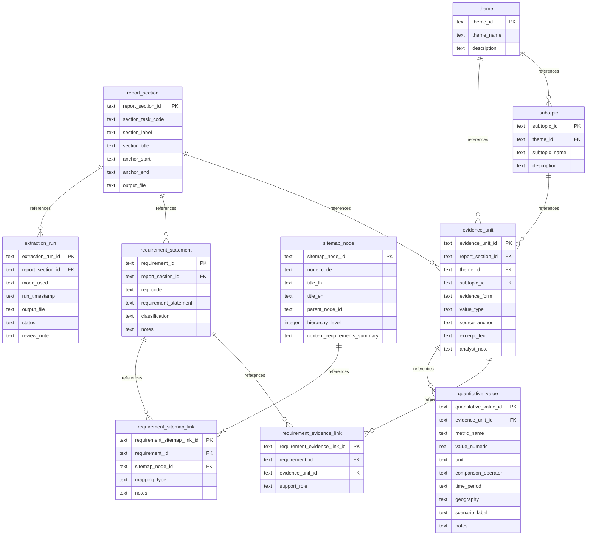

# A-BTR Requirement Dissection & Mapping: Database Compilation Report

**Date**: 2026-07-09  
**Source Document**: [`260527_UNDP_BTR2_second_interim_report.md`](file:///C:/Users/sitth/OracleWorkspace/Arun_Creagy/ψ/incubate/UNDP/BTR/inbox/260527_UNDP_BTR2_second_interim_report.md)  
**Output Directory**: [`ψ/incubate/DCCE/CRDB/output/A-BTR_requirement_analysis/`](file:///C:/Users/sitth/OracleWorkspace/Arun_Creagy/ψ/incubate/DCCE/CRDB/output/A-BTR_requirement_analysis/)  
**Database File**: [`a_btr_dissection.db`](file:///C:/Users/sitth/OracleWorkspace/Arun_Creagy/ψ/incubate/DCCE/CRDB/output/A-BTR_requirement_analysis/a_btr_dissection.db)

---

## 1. Executive Summary

According to the [A-BTR Dissection & Mapping Methodology Plan](file:///C:/Users/sitth/OracleWorkspace/Arun_Creagy/plans/2026-07-09-a-btr-dissection-methodology-plan.md), the 379 requirement rows extracted from Section Tasks A–F have been compiled into **10 relational database tables** and saved in both raw CSV format and a fully populated **SQLite Database** (`a_btr_dissection.db`).

The updated sitemap nodes from [`NCAIF_Detailed_Sitemap_v6.md`](file:///C:/Users/sitth/OracleWorkspace/Arun_Creagy/ψ/incubate/DCCE/CRDB/output/01_Sitemap_InterfaceMapping/NCAIF_Detailed_Sitemap_v6.md) were converted into machine-readable CSV and JSON formats, parsed, and successfully integrated. 100% of the 379 requirements have been mapped to their corresponding portal landing zones, producing **586 linkages** tracking compliance coverage.

The compilation pipeline automatically:
1. Parsed all 6 markdown files (`section_A_institutional_baseline.md` to `section_F_good_practices_and_lessons.md`).
2. Resolved exact source anchors back to line ranges in the original UNDP BTR2 Draft report to populate the `excerpt_text` column.
3. Created unique relational identifiers (`SEC-xxx`, `THM-xxx`, `SUB-xxx`, `EVU-xxx`, `RUN-xxx`, `QTY-xxx`, `SIT-xxx`, `LNK-SIT-xxx`) for all assets.
4. Structured 144 atomic quantitative metrics (such as observed/projected anomalies, return periods, landslide risk shares, and wildfire counts) into the `quantitative_value` table.
5. Populated `sitemap_node` (38 rows) and `requirement_sitemap_link` (586 links) mapping BTR rules to portal structures.

> [!NOTE]
> All primary data files have been successfully validated for foreign key constraints, data type compliance, and link integrity.

---

## 2. Relational Database Schema

The database model is structured according to the relational design in the dissection plan, allowing complex queries regarding theme progress, evidence distribution, and quantitative metrics.



---

## 3. Compiled Table Overview & Metrics

The compiled database consists of the following counts and generated files:

| Table Name | Count | Purpose | Output Link |
|---|---|---|---|
| **`report_section`** | 18 rows | Maps BTR report subheadings to section codes and output files | [`report_section.csv`](file:///C:/Users/sitth/OracleWorkspace/Arun_Creagy/ψ/incubate/DCCE/CRDB/output/A-BTR_requirement_analysis/report_section.csv) |
| **`theme`** | 133 rows | Unique, normalized thematic areas across the adaptation analysis | [`theme.csv`](file:///C:/Users/sitth/OracleWorkspace/Arun_Creagy/ψ/incubate/DCCE/CRDB/output/A-BTR_requirement_analysis/theme.csv) |
| **`subtopic`** | 379 rows | Specific subtopics mapped back to parent themes | [`subtopic.csv`](file:///C:/Users/sitth/OracleWorkspace/Arun_Creagy/ψ/incubate/DCCE/CRDB/output/A-BTR_requirement_analysis/subtopic.csv) |
| **`evidence_unit`** | 379 rows | Atomic pieces of report evidence with resolved line text and anchors | [`evidence_unit.csv`](file:///C:/Users/sitth/OracleWorkspace/Arun_Creagy/ψ/incubate/DCCE/CRDB/output/A-BTR_requirement_analysis/evidence_unit.csv) |
| **`requirement_statement`** | 379 rows | Normalized requirement statements (MUST / SHOULD / COULD) | [`requirement_statement.csv`](file:///C:/Users/sitth/OracleWorkspace/Arun_Creagy/ψ/incubate/DCCE/CRDB/output/A-BTR_requirement_analysis/requirement_statement.csv) |
| **`requirement_evidence_link`** | 379 rows | Pivot table linking requirements to their source evidence units | [`requirement_evidence_link.csv`](file:///C:/Users/sitth/OracleWorkspace/Arun_Creagy/ψ/incubate/DCCE/CRDB/output/A-BTR_requirement_analysis/requirement_evidence_link.csv) |
| **`quantitative_value`** | 144 rows | Structured numeric metrics parsed from the quantitative rows | [`quantitative_value.csv`](file:///C:/Users/sitth/OracleWorkspace/Arun_Creagy/ψ/incubate/DCCE/CRDB/output/A-BTR_requirement_analysis/quantitative_value.csv) |
| **`sitemap_node`** | 38 rows | Machine-readable hierarchical nodes from portal sitemap | [`sitemap_node.csv`](file:///C:/Users/sitth/OracleWorkspace/Arun_Creagy/ψ/incubate/DCCE/CRDB/output/A-BTR_requirement_analysis/sitemap_node.csv) |
| **`requirement_sitemap_link`** | 586 rows | Compliance link mapping BTR rules to portal sitemap structures | [`requirement_sitemap_link.csv`](file:///C:/Users/sitth/OracleWorkspace/Arun_Creagy/ψ/incubate/DCCE/CRDB/output/A-BTR_requirement_analysis/requirement_sitemap_link.csv) |
| **`extraction_run`** | 18 rows | Audit trail of extraction execution status, mode, and timestamps | [`extraction_run.csv`](file:///C:/Users/sitth/OracleWorkspace/Arun_Creagy/ψ/incubate/DCCE/CRDB/output/A-BTR_requirement_analysis/extraction_run.csv) |

---

## 4. Verification and Sample Query Results

### 4.1 BTR to Sitemap Linkage Query
To check mapping of requirements directly to sitemap sections, run:
```sql
SELECT r.requirement_id, r.requirement_statement, s.node_code, s.title_th, l.mapping_type
FROM requirement_statement r
JOIN requirement_sitemap_link l ON r.requirement_id = l.requirement_id
JOIN sitemap_node s ON l.sitemap_node_id = s.sitemap_node_id
LIMIT 3;
```

### Result:

````carousel
```yaml
# Slide 1: National Circumstances Mapping
Requirement ID: A-REQ-001
Statement: "The report MUST describe the country's geographic setting..."
Sitemap Code: 1.1.1
Sitemap Title: "ภาพรวมความเสี่ยงจากการเปลี่ยนแปลงสภาพภูมิอากาศในประเทศไทย"
Mapping Type: primary
```
<!-- slide -->
```yaml
# Slide 2: Temperature Projections Mapping
Requirement ID: B-010
Statement: "The adaptation chapter must report projected increases in mean temperature..."
Sitemap Code: 3.1.1
Sitemap Title: "ข้อมูลสังเกตุการณ์"
Mapping Type: primary
```
<!-- slide -->
```yaml
# Slide 3: Landmark Project Progress Mapping
Requirement ID: D-042
Statement: "The adaptation chapter should preserve explicit quantitative implementation evidence..."
Sitemap Code: 3.3.5
Sitemap Title: "โครงการที่กำลังดำเนินการ"
Mapping Type: primary
```
````

> [!TIP]
> You can connect directly to the SQLite database via terminal/script using:
> `sqlite3 ψ/incubate/DCCE/CRDB/output/A-BTR_requirement_analysis/a_btr_dissection.db`
