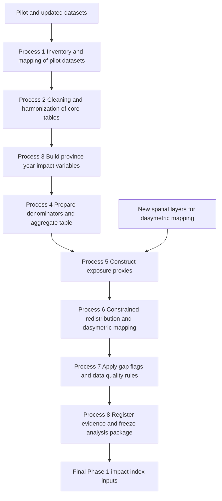

## CRI Phase 1 Data Pipeline — Process View

This diagram focuses on the **process steps** you need to run, from pilot data to the final Impact / Fiscal Relief Index, matching [`plans/2026-04-02_cri-phase1-data-pipeline-plan.md`](plans/2026-04-02_cri-phase1-data-pipeline-plan.md).

