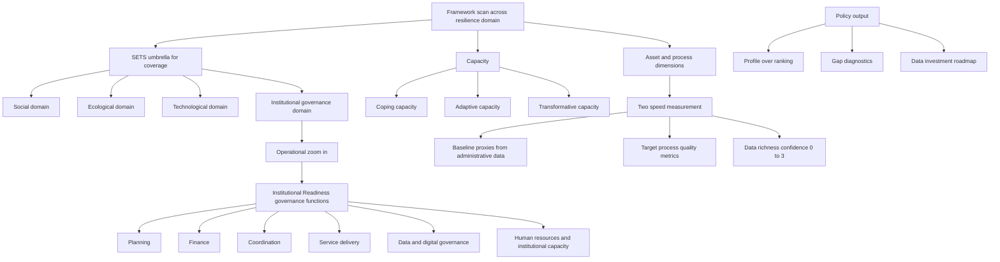

>[!note] Change Log
>- v1: project kick-off - Readiness and Resilience
>- v2: After pivoting the project's strategy [[CRI pivoting to social-ecological system and context focused]]
>- v3: update after TEI meeting
>- v4: KO&I pass — align Phase 2 with Baseline/Target (two-speed) measurement stance, add data-richness overlay, and add LPA dataset analysis
>- v5: governance-lineage alignment pass — preserve original outline while updating baseline from early tagging logic to Institutional Readiness v3, harden impact-vs-capacity separation, and refresh traceability links to CRI evidence/trigger/change surfaces.

# 1. Strategic Context: Balancing Rigor and Reality

The objective of CRI Phase 2 is to deliver a policy-relevant tool for local decision-makers (municipalities/provinces) while adhering to the Terms of Reference (TOR) which mandates a "National Index."

In this phase we explicitly move **beyond a pure loss/risk ranking** toward a **Resilience Capacity Profile**, accepting a managed trade‑off between strict cross‑provincial comparability and richer context‑specific insight.

This framing was not selected in a single step. The work first scanned the wider urban resilience framework landscape (social, ecological, technological, governance, and institutional traditions), then narrowed deliberately toward what can be operationalized in Thai administrative systems within project time and data constraints. In that sequence, a systems/SETS-style lens was used as a **structure** (to avoid blind spots), while indicator selection then zoomed into **policy-actionable and administratively legible** constructs.

### 1.1 SETS umbrella and operational zoom-in

In Phase 2, SETS is treated as a scientific umbrella to ensure framing completeness across four interacting domains:

- **Social domain**: community networks, equity, public health, and human capital.
- **Ecological domain**: natural buffers and ecosystem services (e.g., wetlands, watersheds, green systems).
- **Technological domain**: built and digital systems (e.g., drainage, protective infrastructure, sensors, warning platforms).
- **Institutional domain (governance)**: plans, laws, budgets, mandates, and administrative bodies that coordinate the other domains.

SETS is therefore used to avoid conceptual blind spots, while operational implementation intentionally foregrounds the Institutional domain as the primary representation layer in this project.

### 1.2 Why Institutional Readiness is the framing of resilience in this project

The governance-function framing is intentional, for three method reasons:

1. **Actionability (lever-of-power logic):** Governors and Mayors act through departments, budgets, plans, and mandates. Function-level signaling (Planning/Finance/HR/Coordination/etc.) therefore produces management-relevant diagnostics rather than abstract resilience labels.
2. **Governance multiplier logic:** social, ecological, and technological assets are often dormant unless activated by institutional quality (budgeting, enforcement, coordination, and operational routines).
3. **Data realism (administrative compatibility):** available secondary data in Thailand, especially LPA-style evidence, is already organized around governance functions. This makes national-scale implementation feasible without over-promising domain coverage that current data cannot support robustly.

We recognize a spectrum of implementation approaches:

1. **Universal Comparability (The "Technocratic" End):** Standardized, asset-based indices (e.g., Germanwatch). Easy to rank, but often lacks local context and actionable insight.
    
2. **Context Specificity (The "Local" End):** Deep, process-based qualitative assessments (e.g., interviews, participatory workshops). Highly actionable, but impossible to scale to 76 provinces within the 8-month timeline.
    

**The Strategy:** We adopt a **"Middle Path."** We will deliver the standardized index required by the TOR, but restructure its internal logic using systems-informed resilience concepts and governance-functional tagging. We do not assume new primary data collection for all provinces in Phase 2; instead, we use a staged **Capacity Tagging** protocol over existing administrative datasets, with explicit confidence and upgrade pathways.

**Operational stance (two-speed measurement):** Phase 2 will explicitly separate:

1. **Baseline proxies (secondary / administrative data):** what can be measured now, at scale (often binary / registry-based).
2. **Target process / quality metrics:** what we would like to measure later to evaluate “process quality” and real performance.

To keep interpretation honest, each Baseline proxy should carry a **data-richness / confidence score (0–3)** as specified in [`CRI_Capacity_Tagging_Dictionary.md`](../output/CRI_Capacity_Tagging_Dictionary.md).

>[!note] Method traceability anchors
>- Evidence base for this framing is tracked in [`CRI-Evidence-Registry.md`](../CRI-Evidence-Registry.md) (notably E-CRI-010 to E-CRI-018).
>- Trigger and change lineage for the current governance framing is tracked in [`CRI-Trigger-Log.md`](../CRI-Trigger-Log.md) (T-CRI-001, T-CRI-002) and [`CRI-Change-Log.md`](../CRI-Change-Log.md) (CH-CRI-001 to CH-CRI-003).
>- Active deliverable contracts are indexed in [`CRI-Deliverable-Map.md`](../CRI-Deliverable-Map.md), especially D-CRI-006 and D-CRI-007.
>- Governance-freeze rationale and double-layer framing are also captured in session records: [`2026-04-10_15-10_cri-v3-structure-locked.md`](../../../inbox/handoff/2026-04-10_15-10_cri-v3-structure-locked.md) and [`16.30_cri-v3-governance-freeze.md`](../../../memory/retrospectives/2026-04/10/16.30_cri-v3-governance-freeze.md).

> [!summary] Stakeholder-facing framing statement
> We use the SETS umbrella to ensure scientific completeness across social, ecological, technological, and institutional domains. We present Phase 2 results through governance functions because those are the administrative levers decision-makers can directly control, budget, and improve.

### 1.3 Methodology schematic

# 2. Conceptual Framework: Defining the Capacities

Phase 2 builds directly on the **Impact Index (Fiscal Relief)** and hybrid spatial methodology defined in Phase 1. The Fiscal Relief Index answers **“Where and how heavily has the public budget been strained by climate‑related disasters?”**. The Phase 2 Capacity Profiles answer **“How structurally ready is each province to cope, adapt, and transform?”**.

These are intentionally different evidence surfaces:

- **Impact evidence** is backward-looking, event-and-fiscal-strain oriented (Phase 1).
- **Capacity evidence** is forward-looking, governance-and-readiness oriented (Phase 2).

The methodology does not collapse these into one undifferentiated score. They are interpreted together for policy decisions, but measured and communicated as distinct analytical products.

To transition DCCE from a "Disaster Management" mindset to a "Resilience" mindset, we establish three distinct **capacity categories**. These will form the sub-indices of the CRI.

>[!important] 
>Unlike asset‑based vulnerability indices, these **capacity categories** are **process‑ and governance‑oriented**: they prioritise mechanisms such as planning, coordination, information flows and institutional agency over static stocks of infrastructure or capital.

>[!note] Design tracking
>The research plan and evolution notes are tracked in [`plan.md`](../plan.md), while current governance-function implementation rules are tracked in [`CRI_Capacity_Tagging_Dictionary_v3.md`](../output/CRI_Capacity_Tagging_Dictionary_v3.md) and summarized in [`CRI_Capacity_Concept_Summary_v3.md`](../output/CRI_Capacity_Concept_Summary_v3.md).

We further distinguish two **capacity dimensions** within each category:
- **Asset** – stocks and resources (physical, financial, human) that enable action.
- **Process** – governance mechanisms, institutional arrangements and procedures that determine how assets are deployed.

This asset/process distinction remains valid under the current v3 governance evolution. In practice, these dimensions are now additionally organized by **Institutional Readiness governance functions** (Planning, Finance, Coordination, Service Delivery, Data, HR) so that concept definitions can be scanned against real administrative traces.

This creates a deliberate **double-layer framing**:

- **SETS layer** for scientific completeness and cross-domain coverage checks.
- **Governance-function layer** for operational tagging, vetting, and policy accountability.

## 2.1 Coping Capacity 

- **Concept:** The ability to withstand immediate shocks using _existing_ resources without changing the system.
- **Bureaucratic Translation:** Emergency Management & Relief.
    
- **Key metrics (Baseline proxy vs Target):**
    - **Baseline proxies (existing administrative data):**
        - Existence of disaster prevention / mitigation plan; existence of emergency procedures; existence of coordination mechanisms.
        - Emergency budget lines / accumulated fund levels and rules for rapid deployment.
        - Coverage of early warning / communication mechanisms.
    - **Target process/quality metrics (future / harder):**
        - Drill frequency and after-action review quality.
        - Response time and relief fund disbursement timeliness.
        - Evidence of inter-agency coordination during real events.

Under the v3 governance lens, Coping signals are expected to cluster primarily in **Finance & Procurement**, **Service Delivery & Ops**, and **HR & Institutional Capacity** functions.
        

## 2.2 Adaptive Capacity

- **Concept:** The ability to learn and adjust processes to changing baselines to maintain the current trajectory.
    
- **Bureaucratic Translation:** Development Planning & Resource Allocation.
    
- **Key metrics (Baseline proxy vs Target):**
    - **Baseline proxies (existing administrative data):**
        - Integration of climate risk into development plans (existence + documented references).
        - Existence of data systems / registers relevant for risk management (open data, risk registers, inventories).
        - Existence of training programmes / technical staffing mandates.
    - **Target process/quality metrics (future / harder):**
        - Evidence of plan review cycles, learning loops, and budget reallocation based on new risk information.
        - Monitoring indicators and use of evaluation findings in decision-making.

Under the v3 governance lens, Adaptive signals are expected to appear strongly across **Planning & Strategy**, **Coordination & Partnerships**, and **Data & Digital Governance**, with cross-cutting links to finance and staffing.
        

## 2.3 Transformative Capacity (The "Evolution")

- **Concept:** The ability to fundamentally restructure the system when the status quo is untenable.
    
- **Bureaucratic Translation:** Structural Reform & Long-term Strategy.
    
- **Key metrics (Baseline proxy vs Target):**
    - **Baseline proxies (existing administrative data):**
        - Existence of land-use / zoning instruments and evidence of updates.
        - Existence of long-term strategic plans that explicitly consider climate limits.
        - Participation in innovation / smart city programmes; existence of reform-oriented committees.
    - **Target process/quality metrics (future / harder):**
        - Enforcement evidence (e.g., zoning enforcement actions; compliance rates).
        - Demonstrated policy reforms that shift development pathways (not just documents).

In Phase 2, Transformative indicators remain intentionally selective and evidence-disciplined. Where direct, high-quality administrative traces are weak, concepts may be retained as directional design anchors and communicated with explicit confidence limits rather than over-quantified claims.
        

> **Educational Goal:** We use the Index to teach DCCE that _Coping_ is necessary but insufficient. True resilience requires _Adaptive_ and _Transformative_ scores.

---
# 3. Operational Methodology: The "Tagging" Protocol

Since creating new data streams is outside the scope/timeline, we will execute a **Systematic Categorization** of available administrative data.

> **Tagging lineage (v1 → v3):** Phase 2 operational logic evolved from early tagging dictionaries (v1/v1.1 baseline-proxy logic), through v2 consolidation and CBI-bridging, to the current governance-v3 worksheet where Institutional Readiness functions are treated as the active screening contract for indicator vetting.
>
> - Historical baseline logic: [`CRI_Capacity_Tagging_Dictionary.md`](../output/CRI_Capacity_Tagging_Dictionary.md)
> - v2 consolidation context: [`CRI_Capacity_Tagging_Dictionary_v2.md`](../output/CRI_Capacity_Tagging_Dictionary_v2.md)
> - Current governance baseline: [`CRI_Capacity_Tagging_Dictionary_v3.md`](../output/CRI_Capacity_Tagging_Dictionary_v3.md)
> - Concept interpretation companion: [`CRI_Capacity_Concept_Summary_v3.md`](../output/CRI_Capacity_Concept_Summary_v3.md)

>[!note] Implementation reference
>The active implementation baseline is governance-v3 (Institutional Readiness), while preserving v1/v1.1 and v2 artifacts as lineage references. The **Baseline proxy / Baseline data-richness (0–3) / Target metric** pattern remains mandatory across versions.

## Step 1: Data Inventory & Review

We will compile datasets from all relevant line agencies. Key sources include:

- **DLA (Department of Local Administration):** Local Performance Assessment (LPA) data.
- **DCCE (Dept of Climate Change and Environment):** Sustainable City Assessment indicators.
- **NESDC:** Socio-economic development data.
- **Interior Ministry:** Budgetary and planning records.
- **TEI CRI Pilot and Phase 1 Impact Index:** Use pilot and Fiscal Relief outputs as **context layers** to interpret capacity profiles (e.g. high impact with weak adaptive or transformative readiness), not as capacity indicators themselves.

### 3.1 LPA dataset analysis (fitness for Phase 2) 👈

This section summarizes what LPA can and cannot do for CRI Phase 2, and how we will operationalize it without over-claiming.

**What LPA is (as a dataset)**

- An ongoing, nationwide assessment used by DLA to evaluate Local Administrative Organizations (LAOs) across multiple domains.
- Contains a mixture of:
  - **Binary / check-box indicators** (existence of plans, committees, registers, systems).
  - **Threshold indicators** (e.g., % of roads maintained).
  - **Registry / document-evidence requirements** (some indicators are tied to specific registers and centralized systems).

**Why LPA is valuable for CRI Phase 2 (baseline)**

- Already institutionalized, repeatable, and broad-coverage.
- Strong alignment with **governance and process** proxies (planning, registers, reporting systems) that are otherwise expensive to measure nationwide.
- Provides a tractable baseline for “**structural readiness**” across Coping/Adaptive/Transformative capacity categories and governance functions in the Institutional Readiness frame.

**Primary limitations (interpretation constraints)**

- Self-reporting and incentive structure can produce **check-box behavior** and gaming.
- Many items measure the **existence** of a mechanism, not the **quality** of implementation.
- Some infrastructure-type indicators correlate with fiscal capacity (risk of conflating “wealth” with “resilience”).
- Climate-specific signal is indirect: many relevant items are DRM, water management, risk management, or planning system indicators rather than explicit adaptation outcomes.

**Data-richness expectation (0–3, baseline proxy)**

- Typical LPA baseline proxies should be treated as **data-richness 1–2**.
  - **1** when evidence is primarily self-asserted or lightly documented.
  - **2** when there is a clear audit trail (registers, standardized forms, central systems).
- **3** should be reserved for indicators with strong, routine, independently verifiable administrative traces.
- Many desired “process quality” variables are effectively **0 at baseline** (not collected / not feasible at scale).

**How CRI will use LPA in Phase 2 (method rule)**

- Use LPA as a **baseline proxy layer** only, tagged first by capacity category (Coping/Adaptive/Transformative) and then by governance function in [`CRI_Capacity_Tagging_Dictionary_v3.md`](../output/CRI_Capacity_Tagging_Dictionary_v3.md).
- Report capacity results as a **profile + gap report**, not as an “actual performance score”.
- Add a **data investment roadmap**: highlight which high-value process-quality indicators should be collected later to move from “structural readiness” to “process quality”.

**Mitigations / QA strategies**

- Triangulate LPA with:
  - Budget and expenditure records.
  - DCCE Sustainable City Assessment where overlapping constructs exist.
  - Selected sample audits / site visits (spot-check “plan exists” vs “plan used”).
  - Central system traces where available (e.g., e-LAAS, INFO, registries).

<!--note: We to to review more datasets such as [[ข้อมูลความจำเป็นพื้นฐาน (จปฐ.) ]], SDG indicators, and other social research-->

## Step 2: The "Capacity Tagging" Process

We will filter and tag each indicator in two passes:

1. **Capacity category pass** (Coping / Adaptive / Transformative).
2. **Governance-function pass** (Planning, Finance, Coordination, Service Delivery, Data, HR).

This preserves the original resilience-capacity logic while making the output more administratively legible for implementation agencies.

Illustrative examples:
- _Example 1:_ "Does the province have an emergency broadcast tower?" $\rightarrow$ Tag: **Coping Capacity**.
- _Example 2:_ "Does the local development plan mention 'Climate Change'?" $\rightarrow$ Tag: **Adaptive Capacity**.
    
- _Example 3:_ "Has the province revised its zoning map in the last 5 years?" $\rightarrow$ Tag: **Transformative Capacity**.
    

## Step 3: Addressing Data Quality (The "Binary" Challenge)

**Challenge:** Much of the administrative data (specifically LPA) is **Binary (Yes/No)** or check-box based. It measures the _existence_ of a mechanism, not its _quality_.

- _Mitigation:_ We will aggregate these binary indicators to create **Composite Scores**.
    
    - _Logic:_ A province with 8 out of 10 "Adaptive" mechanisms present has higher potential than one with 2.
        
    - _Transparency:_ We will explicitly communicate to DCCE that this measures "Structural Readiness" (existence of mechanisms), not necessarily "Operational Excellence."

**Additional mitigation (two-speed + confidence overlay):**

- For each indicator, we will record:
  - A **Baseline proxy** (what we can measure now)
  - A **Baseline data-richness / confidence** score (0–3)
  - A **Target metric** (what we would like to measure later)

This reduces the risk that stakeholders interpret low-quality proxies as fully reliable measures of governance performance.

To maintain traceability without turning this note into a ledger, methodology claims and updates should be periodically cross-checked against:

- [`CRI-Evidence-Registry.md`](../CRI-Evidence-Registry.md)
- [`CRI-Trigger-Log.md`](../CRI-Trigger-Log.md)
- [`CRI-Change-Log.md`](../CRI-Change-Log.md)
        

# 4. The Output: Policy-Relevant Visualization

To avoid the "Ranking Trap" where officials simply look for who is #1, we will change the visualization strategy.

## 4.1 From "Single Rank" to "Capacity Profile"

Instead of a single map, we will produce **Radar Charts (Spider Webs)** for each province.

- **Axes:** Coping, Adaptive, Transformative, Ecosystem Health (Natural Capital).
- **Confidence overlay:** Apply a visual confidence cue (e.g., shading / hatching) based on the composite data-richness score of the underlying indicators.

- **Governance read layer (recommended companion view):** Where data allows, pair the core capacity profile with a function-level panel (Planning/Finance/Coordination/Service Delivery/Data/HR) to show where institutional bottlenecks sit.
    
- **Insight:**
    
    - _Scenario A:_ High Coping / Low Transformative $\rightarrow$ "This province is good at fighting fires but is not preventing them. **Recommendation:** Invest in Land Use Planning."
        
    - _Scenario B:_ High Transformative / Low Coping $\rightarrow$ "This province has great long-term plans but is vulnerable to immediate shocks. **Recommendation:** Increase Emergency Reserves."
        

## 4.2 The "Data Investment Roadmap"

We acknowledge that current data is imperfect. Therefore, a key deliverable of Phase 2 is not just the Index, but a **Gap Analysis Report**.

- **Site Visit Role:** We will use the pilot site visits to validate the "Binary vs. Reality" gap.
    
    - _Task:_ Interview officials to see if the "Climate Plan" (marked 'Yes' in the database) is actually used or just sits on a shelf.
        
- **Final Output:** A "Roadmap for National Data Collection" recommending which _process-based_ indicators DCCE should invest in collecting next to move from "Quantity" to "Quality."

Roadmap prioritization should use the v3 concept-summary surface in [`CRI_Capacity_Concept_Summary_v3.md`](../output/CRI_Capacity_Concept_Summary_v3.md) as the bridge between conceptual gaps and candidate administrative indicator upgrades.
    

# 5. Strategic Benefits of this Approach

1. **TOR Compliance:** We deliver the "National Index" and "Database" as promised.
    
2. **Feasibility:** We rely on _available_ data, mitigating the risk of scope creep or timeline failure.
    
3. **Educational Value:** The structure of the index itself educates the client on the hierarchy of resilience (Coping < Adaptive < Transformative).
    
4. **Policy Utility:** The "Capacity Profiles" give specific, actionable direction to local governors, moving beyond simple risk identification.

5. **Method Continuity with Governance Maturity:** The approach preserves methodological continuity (v1/v1.1 → v2 → v3) while improving operational fit through the Institutional Readiness governance-function frame rather than replacing prior work with an abrupt reset.
