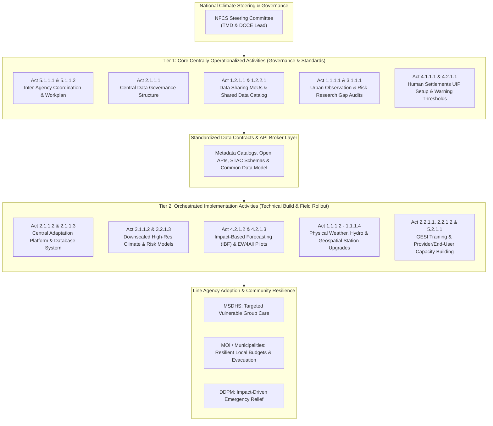
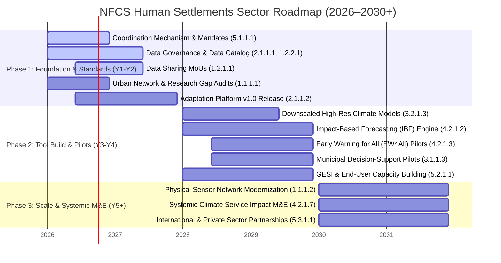

# Thailand NFCS Action Plan: Strategic Analysis & Phased Workplan
## Human Settlements Sector (2026–2030+)

**Source Document**: `250113_TMD_NFCS_Law-Baseline Review_V4.csv`  
**Sector**: Human Settlements (การตั้งถิ่นฐานของมนุษย์)  
**Lead Agencies**: DCCE, TMD, HII, GISTDA, RID, MOI, MSDHS, NFCS Working Group  
**Target Audience**: GIZ, DCCE, TMD, and National Framework Steering Committee  

---

## 1. EXECUTIVE SUMMARY & STRATEGIC REFRAMING

The National Framework for Climate Services (NFCS) for Thailand's Human Settlements Sector contains **33 key activities** spanning 5 WMO operational pillars. To ensure that the action plan drives effective multi-agency engagement without degenerating into fragmented, uncoordinated projects, the activities are structured into a **Two-Tier Operational Model**:

1. **Tier 1: Core Centrally Operationalized Activities (Governance & Standards)**
   Centrally led and proposed by DCCE, TMD, and the NFCS Working Group. These activities set the strategic objectives, institutional mandates, data governance structures, metadata schemas, gap assessments, and policy reporting mechanisms.
2. **Tier 2: Orchestrated Implementation Activities (Building Blocks & Field Rollout)**
   Technical, engineering, and operational tasks (open-source software development, downscaled modeling pipelines, sensor deployments, and local pilot dashboards) that can be modularized and built by specialized line agencies, universities, or donor technical assistance (GIZ).

---

## 2. SUMMARY OF ACTIVITIES BY PILLAR

| WMO / NFCS Pillar | Number of Activities | Primary Strategic Focus | Lead Agency |
| :--- | :---: | :--- | :--- |
| **O&M** (*Observations & Monitoring*) | 8 | Network gap evaluation, data sharing MoUs, station modernization, and metadata catalogs. | TMD, HII, GISTDA, RID |
| **CSIS** (*Climate Services Info System*) | 5 | Central data governance, national adaptation platform, data provider training, and user adoption. | DCCE, TMD, NFCS WG |
| **RMP** (*Research, Modeling & Prediction*)| 5 | Urban risk research, downscaled modeling, risk assessment toolkits, and university collaboration. | DCCE, TMD |
| **UIP** (*User Interface Platform*) | 8 | Sectoral platform setup, hazard warning thresholds, Impact-Based Forecasting (IBF), and EW4All pilots. | DCCE, TMD |
| **CD** (*Capacity Development*) | 7 | Inter-agency coordination, focal point mandates, GESI-inclusive training, private sector & int'l partnerships.| DCCE, NFCS WG |
| **TOTAL** | **33** | | |

---

## 3. TWO-TIER CLASSIFICATION & COMPLETE ACTIVITY MATRIX

Below is the complete inventory of all 33 activities extracted from `250113_TMD_NFCS_Law-Baseline Review_V4.csv`, classified into **Core (Governance & Standards)** vs. **Implementation (Build & Execution)**.

|     ID      | Pillar | Activity Title & Description                                                                                             | Responsible Agency        | Output                                             | Tier Classification |     Timeframe      |
| :---------: | :----: | :----------------------------------------------------------------------------------------------------------------------- | :------------------------ | :------------------------------------------------- | :-----------------: | :----------------: |
| **1.1.1.1** |  O&M   | **Gap Assessment of Networks**: Technical evaluation of weather, climate, hydro, and geospatial networks in urban areas. | TMD (กองตรวจฯ)            | Gap analysis report on urban observation networks. |      **CORE**       |    Short (Y1-2)    |
| **1.1.1.2** |  O&M   | **Modernize Weather Infrastructure**: Upgrading and expanding weather observation stations based on gaps.                | TMD (กองตรวจฯ)            | New operational weather stations installed.        | **IMPLEMENTATION**  | Short-Long (Y1-5+) |
| **1.1.1.3** |  O&M   | **Modernize Hydrology Infrastructure**: Upgrading and expanding hydrological monitoring networks.                        | HII / RID                 | New operational hydrological stations installed.   | **IMPLEMENTATION**  | Short-Long (Y1-5+) |
| **1.1.1.4** |  O&M   | **Modernize Geospatial Infrastructure**: Enhancing satellite receiving systems and geospatial observation.               | GISTDA                    | Upgraded geospatial observation system.            | **IMPLEMENTATION**  | Short-Long (Y1-5+) |
| **1.2.1.1** |  O&M   | **Establish Data Sharing MoUs**: Formulate formal data-sharing agreements among working group agencies.                  | TMD (ศูนย์ภูมิอากาศ)      | Executed Data Sharing MoUs.                        |      **CORE**       |    Short (Y1-2)    |
| **1.2.1.2** |  O&M   | **System Owners Meetings**: Regular working group meetings among observation system owners.                              | TMD (ศูนย์ภูมิอากาศ)      | Annual system owners meeting minutes.              |      **CORE**       | Short-Long (Y1-5+) |
| **1.2.1.3** |  O&M   | **Knowledge Exchange**: Participate in seminars and training on monitoring technology.                                   | TMD (ศูนย์ภูมิอากาศ)      | Knowledge exchange summary reports.                | **IMPLEMENTATION**  | Short-Long (Y1-5+) |
| **1.2.2.1** |  O&M   | **Design Shared Data Catalog**: Develop standardized data catalog and metadata schema across system owners.              | GISTDA / ONWR / HII / RID | Central Data Catalog compiling metadata.           |      **CORE**       | Short-Long (Y1-5+) |
| **2.1.1.1** |  CSIS  | **Define Data Governance Structure**: Establish data architecture, governance, roles, and custodian guidelines.          | NFCS Data Providers WG    | Formulated Data Governance Structure Document.     |      **CORE**       |    Short (Y1-2)    |
| **2.1.1.2** |  CSIS  | **Central Climate Adaptation Platform**: Develop national digital platform consolidating climate adaptation data.        | DCCE                      | Integrated National Adaptation Platform.           | **IMPLEMENTATION**  |    Short (Y1-2)    |
| **2.1.1.3** |  CSIS  | **Central Climate Database**: Build central climate database integrating observation and sector data.                    | TMD                       | Centralized Climate Database system.               | **IMPLEMENTATION**  |    Short (Y1-2)    |
| **2.2.1.1** |  CSIS  | **Capacity Building for Data Providers**: Provide guidelines and training for data co-producers.                         | TMD                       | Training workshops for data providers.             | **IMPLEMENTATION**  |   Medium (Y3-4)    |
| **2.2.1.2** |  CSIS  | **End-User Capacity & Adoption**: Enhance end-user capacity to utilize climate services in planning.                     | DCCE                      | End-user climate service adoption report.          | **IMPLEMENTATION**  |   Medium (Y3-4)    |
| **3.1.1.1** |  RMP   | **Urban Climate Risk Research Audit**: Assess existing national research on urban-specific climate risks.                | DCCE (กปอ.)               | Urban climate risk research synthesis report.      |      **CORE**       |    Short (Y1-2)    |
| **3.1.1.2** |  RMP   | **Develop Risk Assessment Tools**: Promote research to build modeling and risk assessment tools.                         | DCCE (กปอ.)               | Climate risk assessment toolkits.                  | **IMPLEMENTATION**  |  Short-Med (Y1-4)  |
| **3.1.1.3** |  RMP   | **Pilot Decision-Support Tools**: Test decision-support tools for long-term urban planning.                              | DCCE (กปอ.)               | Pilot evaluation report in urban areas.            | **IMPLEMENTATION**  |  Med-Long (Y3-5+)  |
| **3.2.1.3** |  RMP   | **High-Res Climate Modeling**: Enhance downscaled climate models and future projections.                                 | TMD (ศูนย์ภูมิอากาศ)      | High-resolution climate projection layers.         | **IMPLEMENTATION**  |  Short-Med (Y1-4)  |
| **3.3.1.1** |  RMP   | **Research & University Collaboration**: Establish cooperation mechanisms with universities and institutes.              | DCCE (กปอ.)               | Academic collaboration agreements.                 |      **CORE**       |    Short (Y1-2)    |
| **4.1.1.1** |  UIP   | **Establish Human Settlement UIP**: Set up sector user platform, define inter-agency coordination.                       | DCCE (กปอ.)               | Sectoral UIP Platform structure & guidelines.      |      **CORE**       |  Short-Med (Y1-4)  |
| **4.2.1.1** |  UIP   | **Hazard & Vulnerability Thresholds**: Analyze hazard/vulnerability data to define warning thresholds.                   | TMD                       | Standardized Warning Threshold Manual.             |      **CORE**       |    Short (Y1-2)    |
| **4.2.1.2** |  UIP   | **Impact-Based Forecasting (IBF)**: Develop short-term IBF systems integrating hazard and exposure.                      | TMD                       | Operational IBF system for human settlements.      | **IMPLEMENTATION**  |   Medium (Y3-4)    |
| **4.2.1.3** |  UIP   | **Early Warning for All (EW4All) Pilot**: Test early warning system in target urban communities.                         | TMD                       | EW4All Pilot Project Summary Report.               | **IMPLEMENTATION**  |   Medium (Y3-4)    |
| **4.2.1.4** |  UIP   | **EWS Effectiveness Review**: Monitor and evaluate warning dissemination effectiveness.                                  | TMD                       | EWS Evaluation & Recommendation Report.            | **IMPLEMENTATION**  |   Medium (Y3-4)    |
| **4.2.1.5** |  UIP   | **Dialogue Forums (National/Local)**: Hold regular dialogues between providers, producers, and users.                    | DCCE (กปอ.)               | National & Local Dialogue Forum Minutes.           |      **CORE**       | Short-Long (Y1-5+) |
| **4.2.1.6** |  UIP   | **EWS Training Needs Assessment**: Conduct training needs assessment and organize EWS training.                          | EWS / TMD                 | Training Needs Assessment & Program Plan.          | **IMPLEMENTATION**  |    Short (Y1-2)    |
| **4.2.1.7** |  UIP   | **Evaluate Climate Service Impact**: Assess long-term effectiveness of climate service delivery.                         | DCCE (กปอ.)               | Service Impact Evaluation Report.                  |      **CORE**       |  Med-Long (Y3-5+)  |
| **5.1.1.1** |   CD   | **Establish Coordination Mechanism**: Set up inter-agency coordination committee for Human Settlements.                  | NFCS Working Group        | Inter-agency Coordination Mechanism Charter.       |      **CORE**       |    Short (Y1-2)    |
| **5.1.1.2** |   CD   | **Define Agency Mandates & Work Plan**: Document institutional roles, focal points, and joint work plans.                | NFCS Working Group        | Mandate Matrix & Joint Annual Workplan.            |      **CORE**       |    Short (Y1-2)    |
| **5.2.1.1** |   CD   | **GESI Training Curriculum**: Develop GESI-inclusive training courses for working group personnel.                       | DCCE (กปอ.)               | GESI-aligned Training Curriculum & Plan.           | **IMPLEMENTATION**  |    Short (Y1-2)    |
| **5.2.1.2** |   CD   | **Regular Working Group Forum**: Establish regular forum for dialogue across working groups.                             | DCCE (กปอ.)               | Regular Working Group Meeting Records.             |      **CORE**       | Short-Long (Y1-5+) |
| **5.3.1.1** |   CD   | **Private Sector Partnerships**: Develop partnership frameworks for research and technical cooperation.                  | DCCE (กปอ.)               | Domestic Private Sector Partnership Agreement.     |      **CORE**       |    Short (Y1-2)    |
| **5.3.1.2** |   CD   | **International Partnerships**: Formulate cooperation agreements with int'l bodies (e.g. GIZ, WMO).                      | DCCE (กปอ.)               | International Cooperation & Funding MoU.           |      **CORE**       |    Short (Y1-2)    |
| **5.3.1.3** |   CD   | **Join Global Climate Forums**: Participate in regional/international technical exchanges.                               | DCCE (กปอ.)               | International Forum Participation Report.          | **IMPLEMENTATION**  | Short-Long (Y1-5+) |

---

## 4. PHASED IMPLEMENTATION TIMELINE

### **Phase 1: Foundation, Governance & Standards (Years 1–2 / Short Term)**
* **Strategic Objective**: Lock down institutional mandates, execute data-sharing MoUs, define central schemas, and audit baseline gap states.
* **Core Milestones**:
  1. Formulate NFCS Working Group Mandates & Joint Annual Work Plan (`Act 5.1.1.1`, `5.1.1.2`).
  2. Finalize Central Data Governance Structure & Shared Data Catalog Standards (`Act 2.1.1.1`, `1.2.2.1`).
  3. Sign Data Sharing MoUs among TMD, HII, GISTDA, RID, and DCCE (`Act 1.2.1.1`).
  4. Complete National Urban Observation Gap Audit & Urban Risk Research Audit (`Act 1.1.1.1`, `3.1.1.1`).
  5. Deploy Initial Adaptation Platform Architecture (`Act 2.1.1.2`, `2.1.1.3`) and set up Human Settlements UIP (`Act 4.1.1.1`).

### **Phase 2: Tool Building, Pilots & Capacity Rollout (Years 3–4 / Medium Term)**
* **Strategic Objective**: Build downscaled analytical tools, pilot Impact-Based Forecasting, and train line-agency personnel and end users.
* **Core Milestones**:
  1. Operationalize Downscaled High-Resolution Risk & Climate Models (`Act 3.1.1.2`, `3.2.1.3`).
  2. Build and pilot Impact-Based Forecasting (IBF) & Early Warnings for All (EW4All) (`Act 4.2.1.2`, `4.2.1.3`).
  3. Deploy Decision-Support Tool pilots in target municipal areas (`Act 3.1.1.3`).
  4. Conduct GESI-inclusive training for data co-producers and end users (`Act 2.2.1.1`, `2.2.1.2`, `5.2.1.1`).

### **Phase 3: Nationwide Scaling & Systemic M&E (Years 5+ / Long Term)**
* **Strategic Objective**: Expand physical observation networks, evaluate service impact, and secure sustainable partnerships.
* **Core Milestones**:
  1. Complete physical station modernization for weather, hydrology, and satellite networks (`Act 1.1.1.2`, `1.1.1.3`, `1.1.1.4`).
  2. Perform systemic M&E on EWS effectiveness and climate service delivery (`Act 4.2.1.4`, `4.2.1.7`).
  3. Institutionalize ongoing private sector and international technical partnerships (`Act 5.3.1.1`, `5.3.1.2`, `5.3.1.3`).

---

## 5. RECOMMENDATIONS FOR GIZ & DCCE ACTION PLAN DESIGN

1. **Focus GIZ Technical Assistance on Tier 2 Open Building Blocks**:
   GIZ's direct funding and technical assistance should focus on building **reusable, open-source building blocks** (e.g., Python data pipelines, API connectors for TPMAP/DOPA, open-source Streamlit/React GIS mapping widgets, IBF calculation scripts). This ensures long-term software sustainability without vendor lock-in.
2. **Anchor Sector Governance in Tier 1 Milestones**:
   DCCE and TMD should use Tier 1 activities (Data Governance Charter, Shared Data Catalog, Data Sharing MoUs, Urban Gap Audits) as the **formal steering committee milestones**.
3. **Resolve Line-Agency Technical Bottlenecks**:
   Because line agencies (such as MSDHS or local municipalities) often lack internal data science teams, DCCE/NCAIF acts as the central data broker that transforms complex climate projections into simple, subdistrict-level risk scores that line agencies can consume via APIs.
