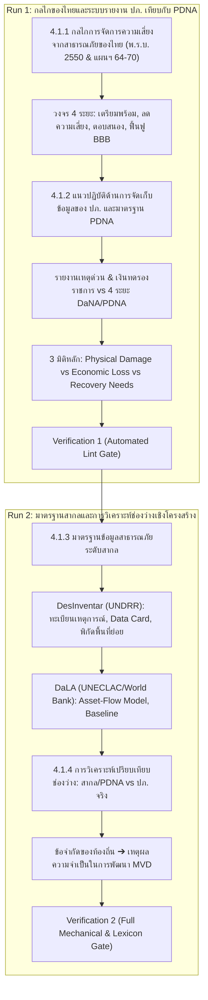

# Plan Slice: รายงานฉบับสมบูรณ์ บทที่ 4 หัวข้อ 4.1
## ระบบการรายงานสาธารณภัยของหน่วยงานที่เกี่ยวข้องเทียบกับมาตรฐานสากล

---

### 1. วัตถุประสงค์และหน้าที่ของหัวข้อ 4.1 ในโครงเรื่อง (Section Job & Narrative Arc)
- **ตำแหน่งในเล่ม**: บทที่ 4 ขยายคำถามหลักข้อ 2 ("อะไรที่มีอยู่แล้ว") เฉพาะโดเมนข้อมูลความสูญเสียและความเสียหาย (Loss and Damage: L&D)
- **หน้าที่ของหัวข้อ 4.1**: ศึกษาและวิเคราะห์ระบบการรายงานสาธารณภัยของประเทศไทยที่มีอยู่ในปัจจุบัน เปรียบเทียบกับมาตรฐานสากล (PDNA, DesInventar, DaLA) เพื่อชี้ให้เห็นช่องว่างเชิงโครงสร้าง (Structural Gaps) ระหว่างข้อมูลการรายงานเหตุด่วนเพื่อการเยียวยาของภาครัฐ กับข้อมูลที่จำเป็นต่อการประเมินมูลค่าความเสียหายและความสูญเสียทางเศรษฐกิจจริง
- **การส่งต่อ (Handoff)**: นำผลการวิเคราะห์ช่องว่างและข้อจำกัดของระบบเดิม ส่งต่อไปเป็นโจทย์ความจำเป็นในการออกแบบชุดข้อมูลขั้นต่ำ (MVD) ในหัวข้อ 4.2

---

### 2. แหล่งข้อมูลอ้างอิง (Evidence Base)
1. **แหล่งข้อมูลระดับรายงานฉบับสมบูรณ์ (DFR)**:
   - `ψ/incubate/DCCE/CRDB/output/draft_final_report/5.3/5.3.6 ศึกษาและวิเคราะห์ระบบการรายงานสาธารณะภัย...md` (หัวข้อย่อย 1–4, บรรทัด 3–70)
2. **รายงานฉบับผู้บริหาร (Executive Summary)**:
   - `ψ/incubate/drafts/crdb-exec-summary-3-intro/02_th_draft.md`
   - `ψ/incubate/drafts/crdb-exec-summary-3.1/02_th_draft.md`
3. **เอกสารวิชาการสนับสนุน (Technical References)**:
   - `ψ/incubate/DCCE/CRDB/output/09_Loss_and_Damage/comparative_analysis_DaLA_DesInventar_PDNA.md`
   - `ψ/incubate/DCCE/CRDB/output/09_Loss_and_Damage/DaLA_methodology_report.md`
   - `ψ/incubate/DCCE/CRDB/output/09_Loss_and_Damage/DDPM_PDNA_methodology_report.md`
   - `ψ/incubate/DCCE/CRDB/output/09_Loss_and_Damage/DDPM_data_review_from_CRI_project.md`
   - `ψ/incubate/DCCE/CRDB/output/09_Loss_and_Damage/NESDC_Alignment_Analysis_Note.md`

---

### 3. โครงสร้างเนื้อหาและการแบ่งรอบการดำเนินงาน (The 2-Run Architecture)

---

### 4. ข้อกำหนดทางภาษาและอภิธานศัพท์ (Strict Lexicon & Writing Rules)
1. **คำต้องห้ามเด็ดขาด (Strict Bans)**:
   - `สาธารณะภัย` ➔ แก้เป็น `สาธารณภัย` ทุกตำแหน่ง
   - `ทว่า`, `อย่างต่อเนื่อง`, `อย่างแท้จริง`, `ที่แท้จริง`, `มุ่งเน้น`, `นอกจากนั้น`, `ได้จริง`, `เชิงประจักษ์` (ตัดทิ้งหรือปรับรูป)
   - `อย่างมีนัยสำคัญ` ➔ ปรับเป็น `ส่งผลกระทบโดยตรง` / `มีความสำคัญอย่างยิ่ง` (เนื่องจากมิใช่การทดสอบสมมติฐานทางสถิติ)
2. **การระบุชื่อหน่วยงาน (Institutional Hierarchy)**:
   - ครั้งแรก: `กรมป้องกันและบรรเทาสาธารณภัย (กรม ปภ.)`
   - ครั้งถัดไป: `กรม ปภ.` หรือ `ปภ.`
   - สศช.: `สำนักงานสภาพัฒนาการเศรษฐกิจและสังคมแห่งชาติ (สศช.)`
   - UNDRR: `สำนักงานเพื่อการลดความเสี่ยงจากภัยพิบัติแห่งสหประชาชาติ (United Nations Office for Disaster Risk Reduction: UNDRR)`
   - UNECLAC: `คณะกรรมาธิการเศรษฐกิจสำหรับละตินอเมริกาและแคริบเบียนแห่งสหประชาชาติ (United Nations Economic Commission for Latin America and the Caribbean: UNECLAC)`
   - World Bank: `ธนาคารโลก (World Bank)`
3. **ไวยากรณ์ราชการและการสร้างคำ**:
   - กริยาตามหลังคำว่า `รับผิดชอบ` ต้องทำเป็นคำนาม เช่น `รับผิดชอบการจัดการ...`
   - ไม่ใช้ประโยคกรรมวาจกที่ไร้ประธาน (`ถูกพัฒนาขึ้นโดย...` ➔ `ที่กรม ปภ. พัฒนาขึ้น`)
   - คลี่คลายย่อหน้ายาวเทกอง (Prose Density) ให้โปร่ง วรรคตอนถูกต้องตามแบบแผนราชการไทย
