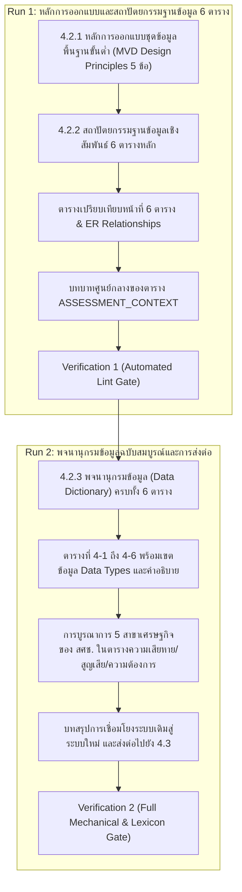

# Plan Slice: รายงานฉบับสมบูรณ์ บทที่ 4 หัวข้อ 4.2
## ร่างมาตรฐานชุดข้อมูลขั้นต่ำ และร่างแบบฟอร์มการรายงานความสูญเสียและความเสียหาย

---

### 1. วัตถุประสงค์และหน้าที่ของหัวข้อ 4.2 ในโครงเรื่อง (Section Job & Narrative Arc)
- **ตำแหน่งในเล่ม**: บทที่ 4 ขยายคำถามหลักข้อ 2 ("อะไรที่มีอยู่แล้ว") สู่การออกแบบมาตรฐานชุดข้อมูลความสูญเสียและความเสียหาย (L&D)
- **หน้าที่ของหัวข้อ 4.2**: นำผลการวิเคราะห์ช่องว่างเชิงโครงสร้างจากหัวข้อ 4.1 มาแปลงเป็นพิมพ์เขียวทางเทคนิค ได้แก่ **หลักการออกแบบ 5 ข้อ** และ **สถาปัตยกรรมฐานข้อมูลเชิงสัมพันธ์ 6 ตาราง** พร้อมพจนานุกรมข้อมูล (Data Dictionary) ระดับเขตข้อมูล ที่เชื่อมโยงระหว่างการรายงานเหตุด่วนของ กรม ปภ. กับการประเมินมูลค่าทางเศรษฐกิจตามกรอบ สศช. 5 สาขา
- **การส่งต่อ (Handoff)**: ส่งมอบโครงสร้าง 6 ตารางและพจนานุกรมข้อมูลไปยังหัวข้อ 4.3 เพื่อใช้เป็นเกณฑ์ในการทดลองรวบรวมและวิเคราะห์ข้อมูลเหตุการณ์จริงในอดีต

---

### 2. แหล่งข้อมูลอ้างอิง (Evidence Base)
1. **แหล่งข้อมูลระดับรายงานฉบับสมบูรณ์ (DFR)**:
   - `ψ/incubate/DCCE/CRDB/output/draft_final_report/5.3/5.3.6 ศึกษาและวิเคราะห์ระบบการรายงานสาธารณะภัย...md` (หัวข้อย่อย 5–6, บรรทัด 71–233)
2. **รายงานฉบับผู้บริหาร (Executive Summary)**:
   - `ψ/incubate/drafts/crdb-exec-summary-3.2/02_th_draft.md`
3. **ผลผลิตหลักโครงการ (Deliverables & Technical Specifications)**:
   - `ψ/incubate/DCCE/CRDB/output/09_Loss_and_Damage/Pillar_06_LDM_LossDamage_DataModel_Technical_Specification.md`
   - `ψ/incubate/DCCE/CRDB/output/09_Loss_and_Damage/LossDamage_Reporting_Form_Documentation.md`
   - `ψ/incubate/DCCE/CRDB/output/09_Loss_and_Damage/LossDamage_Printable_Reporting_Form.md`

---

### 3. โครงสร้างเนื้อหาและการแบ่งรอบการดำเนินงาน (The 2-Run Architecture)

---

### 4. ข้อกำหนดทางภาษาและอภิธานศัพท์ (Strict Lexicon & Writing Rules)
1. **คำต้องห้ามเด็ดขาด (Strict Bans)**:
   - `สาธารณะภัย` ➔ แก้เป็น `สาธารณภัย` ทุกตำแหน่ง
   - `ทว่า`, `อย่างต่อเนื่อง`, `อย่างแท้จริง`, `ที่แท้จริง`, `มุ่งเน้น`, `นอกจากนี้` (ห้ามใช้เป็นคำเชื่อมเปิดประโยคแบบหุ่นยนต์), `ได้จริง`, `เชิงประจักษ์`
   - `อย่างมีนัยสำคัญ`, `อย่างยิ่งยวด`, `อย่างชัดเจน`, `ละเลย`, `ฐานราก`, `สินทรัพย์` ➔ ใช้ `ทรัพย์สิน`
2. **การตั้งชื่อและคำอธิบายตาราง**:
   - กำหนดรูปแบบชื่อตารางชัดเจน `ตารางที่ 4-1: ...` ถึง `ตารางที่ 4-7: ...`
   - มีคำอธิบายหัวคอลัมน์ นิยามเขตข้อมูล และชนิดข้อมูลครบถ้วน 100%
3. **การคงสภาพข้อมูลโครงสร้าง (Structural Invariance)**:
   - อนุรักษ์ชื่อตารางภาษาอังกฤษ (`DISASTER_EVENT`, `EVENT_LOCATION`, `ASSESSMENT_CONTEXT`, `LD_PHYSICAL_DAMAGE`, `LD_ECONOMIC_LOSS`, `LD_RECOVERY_RECONSTRUCTION_NEEDS`)
   - อนุรักษ์ชื่อฟิลด์ ชนิดข้อมูล (Data Types: VARCHAR, INT, ENUM, DECIMAL, DATE, DATETIME, TEXT, BOOLEAN) และค่า ENUM ตามข้อกำหนด 100%
