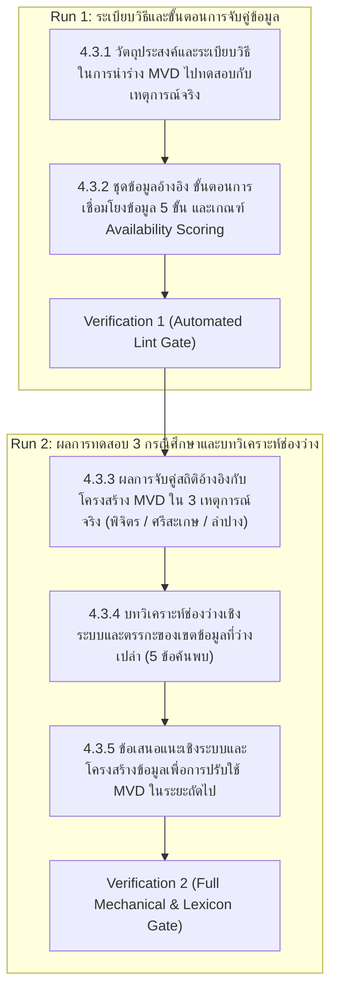

# Plan Slice: รายงานฉบับสมบูรณ์ บทที่ 4 หัวข้อ 4.3
## การทดลองรวบรวมข้อมูลตามร่างมาตรฐานชุดข้อมูลขั้นต่ำจากเหตุการณ์ในอดีต (Event Pilot Analysis)

---

### 1. วัตถุประสงค์และหน้าที่ของหัวข้อ 4.3 ในโครงเรื่อง (Section Job & Narrative Arc)
- **ตำแหน่งในเล่ม**: หัวข้อปิดท้ายบทที่ 4 ซึ่งตอบคำถามหลักข้อ 2 ("อะไรที่มีอยู่แล้ว") ในโดเมนความสูญเสียและความเสียหาย (L&D)
- **หน้าที่ของหัวข้อ 4.3**: นำมาตรฐานชุดข้อมูลขั้นต่ำ (MVD) 6 ตารางที่ออกแบบไว้ในหัวข้อ 4.2 มาทดสอบเชิงปฏิบัติการจริง (Stress-Test / Empirical Pilot) กับสถิติภัยพิบัติระดับหมู่บ้านของ กรมป้องกันและบรรเทาสาธารณภัย (กรม ปภ.) ในอดีต (พ.ศ. 2557–2567) จำนวน 3 เหตุการณ์ (อุทกภัย จ.พิจิตร, ภัยแล้ง จ.ศรีสะเกษ, วาตภัย จ.ลำปาง)
- **ผลลัพธ์ที่ต้องส่งมอบ**:
  1. ชี้ชัดว่าเขตข้อมูลใดจัดเก็บได้ทันทีในปัจจุบัน, เขตข้อมูลใดสืบค้นเติมเต็มได้ในภายหลัง, และเขตข้อมูลใดที่ยังไม่มีการจัดเก็บ (Availability Scoring 3 ระดับ)
  2. วิเคราะห์ 5 ช่องว่างเชิงโครงสร้างระหว่างระบบราชการเดิมกับมาตรฐานสากล
  3. สรุปข้อเสนอแนะเชิงระบบและสถาปัตยกรรมข้อมูลเพื่อขับเคลื่อน MVD ไปสู่การใช้งานจริงในระยะถัดไป

---

### 2. แหล่งข้อมูลอ้างอิง (Evidence Base)
1. **แหล่งข้อมูลระดับรายงานฉบับสมบูรณ์ (DFR)**:
   - `ψ/incubate/DCCE/CRDB/output/draft_final_report/5.3/5.3.7 นำร่างมาตรฐานชุดข้อมูลขั้นต่ำ สำหรับเหตุการณ์ด้านสภาพภูมิอากาศมาทดลองรวบรวมข้อมูลตามมาตรฐานกำหนด โดยคัดเลือกการรวบรวมข้อมูลจากเหตุการณ์ที่เกิดขึ้นในอดีต.md` (ต้นฉบับ 80 บรรทัด)
2. **รายงานฉบับผู้บริหาร (Executive Summary)**:
   - `ψ/incubate/drafts/crdb-exec-summary-3.2/02_th_draft.md` (ส่วนท้าย)
3. **ผลผลิตหลักโครงการ (Deliverables & Technical Specifications)**:
   - `ψ/incubate/DCCE/CRDB/output/09_LDM_LossDamage_DataModel/Event_Pilot_Analysis_Report.md`
   - `ψ/incubate/DCCE/CRDB/output/09_LDM_LossDamage_DataModel/Pillar_06_LDM_LossDamage_DataModel_Technical_Specification.md`

---

### 3. โครงสร้างเนื้อหาและการแบ่งรอบการดำเนินงาน (The 2-Run Architecture)

---

### 4. ข้อกำหนดทางภาษาและอภิธานศัพท์ (Strict Lexicon & Writing Rules)
1. **คำต้องห้ามเด็ดขาด (Strict Bans)**:
   - `สาธารณะภัย` ➔ แก้เป็น `สาธารณภัย` ทุกตำแหน่ง
   - `ทว่า`, `อย่างต่อเนื่อง`, `อย่างแท้จริง`, `ที่แท้จริง`, `มุ่งเน้น`, `นอกจากนี้` (ห้ามใช้เป็นคำเชื่อมเปิดประโยคแบบหุ่นยนต์), `ได้จริง`, `เชิงประจักษ์`
   - `อย่างมีนัยสำคัญ`, `อย่างยิ่งยวด`, `อย่างชัดเจน`, `ละเลย`, `ฐานราก`, `สินทรัพย์` ➔ ใช้ `ทรัพย์สิน`
2. **การคงสภาพข้อมูลโครงสร้างและตัวเลขสถิติ (Factual Invariance)**:
   - คงตัวเลขเขตข้อมูลที่รองรับและว่างเปล่า (31/48, 22/57, 27/52) ครัวเรือน วันเวลา และการจัดระดับความพร้อมครบถ้วน 100%
   - ไวยากรณ์ nominalize หลัง `รับผิดชอบ`: `รับผิดชอบการประเมิน`, `รับผิดชอบการดำเนินงาน`
