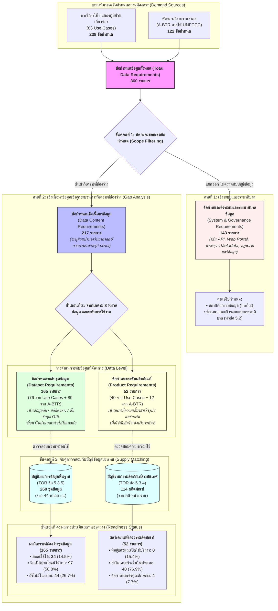

# 5.1 ผลการวิเคราะห์ช่องว่างระหว่างความต้องการใช้ข้อมูลกับบัญชีรายการข้อมูลพื้นฐานและบัญชีรายการผลิตภัณฑ์สารสนเทศ

ขอบเขตงานข้อ 5.3.8 กำหนดให้คณะที่ปรึกษาวิเคราะห์ช่องว่างระหว่างอุปทานและอุปสงค์ของข้อมูล โดยการนำผลการสังเคราะห์ความต้องการใช้ข้อมูลมาเปรียบเทียบกับบัญชีรายการผลิตภัณฑ์ข้อมูลสารสนเทศและชุดข้อมูลที่มีอยู่ เพื่อวิเคราะห์หาช่องว่าง (Gap Analysis) ทั้งในเชิงปริมาณ (ข้อมูลที่ยังขาด) และเชิงคุณภาพ (ข้อมูลที่มีแต่ใช้ประโยชน์ได้ยาก) คำว่าข้อมูลที่ยังขาดหมายถึงรายการความต้องการที่ไม่ปรากฏในบัญชีรายการทั้งสองชุดเลย ขณะที่ข้อมูลที่มีแต่ใช้ประโยชน์ได้ยากหมายถึงรายการที่ปรากฏอยู่แล้วในบัญชีรายการ แต่หน่วยงานผู้ใช้ข้อมูลไม่สามารถนำไปใช้ปฏิบัติงานได้จริงเนื่องจากข้อจำกัดด้านการเข้าถึง คุณภาพ หรือรูปแบบข้อมูล การประเมินช่องว่างตามขอบเขตงานนี้จึงทำหน้าที่เป็นเกณฑ์วัดที่เป็นรูปธรรมว่า สิ่งที่หน่วยงานต้องการกับสิ่งที่ระบบข้อมูลของประเทศมีอยู่จริงสอดคล้องกันเพียงใด

การเปรียบเทียบความต้องการกับบัญชีรายการไม่สามารถทำได้โดยตรงจากเรื่องเล่ากรณีการใช้งาน (Use Cases) ในบทที่ 3 เนื่องจากกรณีการใช้งานแต่ละกรณีเป็นเรื่องเล่าจากภารกิจการทำงานและการตัดสินใจของผู้มีส่วนเกี่ยวข้อง ซึ่งในการปฏิบัติงานจริง หน่วยงานไม่ได้ระบุเป็นชื่อชุดข้อมูลหรือตารางฐานข้อมูลที่ใช้ในการดำเนินงานจริง หากแต่ระบุถึงโจทย์ภารกิจ วัตถุประสงค์ และการตัดสินใจที่ต้องทำให้สำเร็จ ซึ่งมักต้องใช้ข้อมูลหลายด้านประกอบกัน ตัวอย่างเช่น สถาบันการเงินระบุกรณีการใช้งานว่า ต้องการประเมินความเสี่ยงอุทกภัยต่อพอร์ตสินเชื่อที่อยู่อาศัย เพื่อกำหนดเงื่อนไขการให้สินเชื่อและการกันสำรองเงินทุนตามเกณฑ์ของธนาคารแห่งประเทศไทย คณะที่ปรึกษาจึงไม่สามารถนำเรื่องเล่าทั้งหมดไปค้นหาในบัญชีรายการข้อมูลที่มีอยู่ได้โดยตรง แต่ต้องทำการ**ถอดรหัส** เรื่องเล่ากรณีการใช้งานให้อยู่ในรูป **ข้อกำหนดข้อมูล (Data Requirements)**

#### องค์ประกอบของ "ข้อกำหนดข้อมูล"  

การแปลงเรื่องเล่าภารกิจให้เป็นข้อกำหนดข้อมูลที่ตรวจวัดได้ มีหลักคิดในการกำหนด 2 ประการ:
1. **ข้อกำหนดของคุณลักษณะข้อมูล**: กำหนดสเปกทางเทคนิคของข้อมูลที่ระบบต้องมีใน 3 มิติ ได้แก่ **สาระของตัวแปร (Entity/Variable)** เช่น ระดับความลึกน้ำท่วม พิกัดที่ตั้ง หรือสถิติฝน, **ระดับความละเอียด (Resolution)** เช่น ความละเอียดเชิงพื้นที่ระดับกริด 10–100 เมตร และความละเอียดเชิงเวลารอบปีการเกิดซ้ำ, และ **รูปแบบและโครงสร้าง (Format & Structure)** เช่น ไฟล์กริดเชิงพื้นที่ (GeoTIFF/NetCDF) หรือไฟล์ตารางสถิติ (Tabular CSV)
2. **เพื่อตอบโจทย์การทำงานใด**: ข้อกำหนดแต่ละรายการต้องระบุหน้าที่การนำไปใช้ในกระบวนการตัดสินใจ ซึ่งจำแนกออกเป็น 3 ปลายทางหลัก:
   - เพื่อนำไปคำนวณหรือใส่แบบจำลองต่อ  $\rightarrow$ สกัดออกมาเป็น *ข้อกำหนดระดับชุดข้อมูล** **(Dataset Requirements)**
   - เพื่อนำไปประกอบการตัดสินใจ $\rightarrow$ สกัดออกมาเป็น *ข้อกำหนดระดับผลิตภัณฑ์สารสนเทศ (Product Requirements)*
   - เพื่อส่งผ่าน เชื่อมโยง และกำกับดูแลข้อมูล $\rightarrow$ สกัดออกมาเป็น *ข้อกำหนดเชิงระบบและธรรมาภิบาล (System & Governance Requirements)**

**ตัวอย่างการถอดรหัสกรณีการใช้งาน (Use Case) สู่ข้อกำหนดข้อมูล:**

|             ลำดับขั้นตอนการถอดรหัส             | ข้อกำหนดข้อมูลที่ได้                                                                                              | เพื่อไปทำอะไร?                                                                  |          ประเภทข้อกำหนด          |
| :--------------------------------------------: | ----------------------------------------------------------------------------------------------------------------- | ------------------------------------------------------------------------------- | :------------------------------: |
|  **1. สินทรัพย์ที่เสี่ยงคืออะไร อยู่ที่ไหน?**  | พิกัดตำแหน่งและมูลค่าประเมินของหลักประกันสินเชื่อ (Spatial Coordinates & Asset Values)                            | ระบุตำแหน่งและมูลค่าของสินทรัพย์ที่เปิดรับภัย (Exposure) ในระบบสินเชื่อ         | ข้อกำหนดระดับชุดข้อมูล (Dataset) |
|  **2. สภาพภัยที่จะเกิดมีความรุนแรงเพียงใด?**   | ระดับความลึกและระยะเวลาน้ำท่วมขัง (Flood Inundation Depth & Duration) รายคาบ 10, 50, 100 ปี รูปแบบกริดเชิงพื้นที่ | ป้อนค่าระดับความลึกน้ำท่วม (Hazard) เข้าสู่แบบจำลองคำนวณความเสียหาย             | ข้อกำหนดระดับชุดข้อมูล (Dataset) |
| **3. น้ำท่วมลึกเท่านี้ ก่อความเสียหายกี่บาท?** | ฟังก์ชันความเสียหายต่อสิ่งปลูกสร้าง (Depth-Damage Curves) จำแนกตามประเภทอาคาร                                     | แปลงความลึกของน้ำเป็นสัดส่วนความเสียหายทางการเงินของหลักประกัน (Impact)         | ข้อกำหนดระดับผลิตภัณฑ์ (Product) |
|       **4. ระบบเชื่อมต่อข้อมูลอย่างไร?**       | บริการเชื่อมโยงข้อมูลอัตโนมัติ (Automated API Services) สำหรับดึงค่าความเสี่ยงรายพิกัด                            | เชื่อมต่อข้อมูลความเสี่ยงเข้าสู่ระบบอนุมัติสินเชื่อ (Core Banking) แบบเรียลไทม์ |    ข้อกำหนดเชิงระบบ (System)     |

คณะที่ปรึกษาดำเนินกระบวนการวิเคราะห์ช่องว่างผ่านระเบียบวิธี 4 ขั้นตอน เริ่มจาก
1. การสกัดและรวบรวมข้อกำหนดข้อมูล (Data Requirements) ทั้งหมดจากกรณีการใช้งานของผู้มีส่วนเกี่ยวข้องและการรายงานสากล
2. การคัดกรองข้อกำหนดข้อมูลออกเป็น 2 ส่วน ได้แก่ ข้อกำหนดเชิงระบบและธรรมาภิบาลข้อมูล (System and Governance Requirements) และข้อกำหนดเชิงเนื้อหาข้อมูล (Data Content Requirements) พร้อมทั้งจัดกลุ่มข้อกำหนดเชิงเนื้อหาตามหมวดข้อมูล 8 หมวดตามขอบเขตงานข้อ 5.3.5 และแยกระดับข้อมูลที่ต้องการเป็นระดับชุดข้อมูลและระดับผลิตภัณฑ์สารสนเทศ
3. การนำข้อกำหนดข้อมูลไปจับคู่ตรวจสอบกับบัญชีรายการของประเทศที่ตรงประเภท โดยนำข้อกำหนดระดับชุดข้อมูลไปตรวจสอบกับบัญชีรายการข้อมูลพื้นฐาน (ขอบเขตงานข้อ 5.3.5) และนำข้อกำหนดระดับผลิตภัณฑ์ไปตรวจสอบกับบัญชีรายการผลิตภัณฑ์สารสนเทศ (ขอบเขตงานข้อ 5.3.4)
4. การประเมินสถานะความพร้อมใช้และขีดความสามารถ โดยฝั่งชุดข้อมูลประเมินความพร้อมใช้งานจริง 3 ระดับร่วมกับรหัสเหตุผลเชิงคุณภาพ ส่วนฝั่งผลิตภัณฑ์สารสนเทศประเมินการมีอยู่ของขีดความสามารถและพรมแดนการขยายผลสู่ระดับปฏิบัติการ 3 กลุ่มภววิสัย

หมวดข้อมูล 8 หมวดตามขอบเขตงานข้อ 5.3.5 จัดกลุ่มตามโครงสร้างการจัดหมวดหมู่ข้อมูลของบัญชีรายการข้อมูลพื้นฐานออกเป็น 3 กลุ่ม ได้แก่ 
1) ปัจจัยและเงื่อนไขความเสี่ยงในอนาคต ซึ่งประกอบด้วย 
	1) Climatic Driver
	2) Hazard
	3) Exposure
	4) Sensitivity
	5) Adaptive Capacity 
2) สิ่งที่เกิดขึ้นแล้วในอดีต ซึ่งประกอบด้วย 
	1) Impact 
	2) Loss and Damage 
3) มาตรการรับมือ ซึ่งได้แก่ Response 

การจัดกลุ่มด้วยโครงสร้างนี้ ช่วยให้การสืบค้นและเปรียบเทียบในบัญชีรายการข้อมูลพื้นฐานเริ่มต้นจากกลุ่มข้อมูลที่ตรงกัน และสะท้อนช่องว่างในภาษาที่ขอบเขตงานกำหนดไว้ 

*ภาพที่ 5-1 แผนภาพระเบียบวิธีวิเคราะห์ช่องว่าง (Analytical Funnel) และความเชื่อมโยงข้อกำหนดข้อมูลระหว่างอุปสงค์และอุปทาน*

## 5.1.1 ข้อกำหนดข้อมูลของหน่วยงาน

ข้อกำหนดข้อมูลที่คณะที่ปรึกษานำมาวิเคราะห์รวบรวมมาจากสองแหล่งหลัก แหล่งแรกคือการรับฟังความคิดเห็นและการสัมภาษณ์เชิงลึกตามขอบเขตงานข้อ 5.3.2–5.3.3 ซึ่งครอบคลุมกรณีการใช้งาน 83 กรณี และถอดรหัสออกเป็นข้อกำหนดข้อมูล (Data Requirements) **238 รายการ** แหล่งที่สองคือพันธกรณีการรายงานตามกรอบความโปร่งใสระดับสากล (Biennial Transparency Report: A-BTR) ที่กรมการเปลี่ยนแปลงสภาพภูมิอากาศและสิ่งแวดล้อม มีหน้าที่ต้องรายงานต่อสำนักเลขาธิการอนุสัญญาสหประชาชาติว่าด้วยการเปลี่ยนแปลงสภาพภูมิอากาศ (UNFCCC) ซึ่งเพิ่มข้อกำหนดข้อมูลเฉพาะด้านการปรับตัวอีก **122 รายการ** รวมเป็นข้อกำหนดข้อมูลที่เข้าสู่กระบวนการวิเคราะห์ทั้งสิ้น **360 รายการ**

จากการวิเคราะห์ข้อกำหนดข้อมูลทั้งหมด คณะที่ปรึกษาจำแนกข้อกำหนดออกเป็น 2 ส่วนสำคัญ ได้แก่ ข้อกำหนดเชิงเนื้อหาข้อมูล (Data Content Requirements) จำนวน **217 รายการ** และข้อกำหนดเชิงระบบและธรรมาภิบาลข้อมูล (System and Governance Requirements) จำนวน **143 รายการ** 

เพื่อแสดงให้เห็นถึงลักษณะที่แท้จริงและรูปธรรมของข้อกำหนดข้อมูลทั้งสองส่วน คณะที่ปรึกษาได้คัดเลือกตัวอย่างข้อกำหนดข้อมูลจากฐานข้อมูลของโครงการมาแสดงในตารางที่ 5-1 และตารางที่ 5-2 ดังนี้

**ตารางที่ 5-1: ตัวอย่างข้อกำหนดเชิงเนื้อหาข้อมูล (Data Content Requirements) จำแนกตามหมวดข้อมูลและระดับการใช้งาน**

| รหัสข้อกำหนด | รายการข้อกำหนดข้อมูล                                                                         |    หมวดข้อมูล     | ระดับข้อมูลที่ต้องการ | หน่วยงานผู้ขอ / แหล่งที่มา                         | วัตถุประสงค์การใช้งาน                                          |
| :----------: | -------------------------------------------------------------------------------------------- | :---------------: | :-------------------: | -------------------------------------------------- | -------------------------------------------------------------- |
|     D001     | แผนที่โอกาสเกิดน้ำท่วมแบบความน่าจะเป็นระดับสินทรัพย์ (ระบุชนิดน้ำหลาก น้ำฝนสะสม น้ำทะเลหนุน) |      Hazard       |  ชุดข้อมูล (Dataset)  | สมาคมธนาคารไทย / ธนาคารพาณิชย์                     | ระบุความเสี่ยงน้ำท่วมรายพิกัดสำหรับหลักประกันสินเชื่อ          |
|     D002     | ข้อมูลระดับความลึกและระยะเวลาน้ำท่วมขัง (Flood Inundation Depth and Duration)                |      Hazard       |  ชุดข้อมูล (Dataset)  | สมาคมธนาคารไทย / กทม.                              | ป้อนค่าความลึกน้ำลงในแบบจำลองคำนวณความเสียหาย                  |
|     D003     | ฟังก์ชันความเสียหายต่อสิ่งปลูกสร้างจำแนกตามความลึกน้ำท่วม (Depth-Damage Curves)              |      Impact       |  ผลิตภัณฑ์ (Product)  | สมาคมธนาคารไทย / ธปท.                              | แปลงความลึกน้ำท่วมเป็นเปอร์เซ็นต์ความเสียหายทางการเงินของอาคาร |
|     D008     | เส้นทางฉากทัศน์สภาพภูมิอากาศและการปล่อยก๊าซเรือนกระจก (SSP2-4.5 และ SSP5-8.5)                |  Climatic Driver  |  ชุดข้อมูล (Dataset)  | สมาคมธนาคารไทย / กรม สส.                           | ขับเคลื่อนแบบจำลองความเสี่ยงทางการเงินระยะยาว 30 ปี            |
|     D011     | กรอบระเบียบวิธีมาตรฐานสำหรับการประเมินมูลค่าความสูญเสียและความเสียหายทางเศรษฐกิจ             |  Loss and Damage  |  ผลิตภัณฑ์ (Product)  | สำนักงานสภาพัฒนาการเศรษฐกิจและสังคมแห่งชาติ (สศช.) | กำหนดกรอบคำนวณความสูญเสียทางเศรษฐกิจระดับมหภาค                 |
|     D012     | ชุดข้อมูลความสูญเสียจากภัยพิบัติที่ครอบคลุมความสูญเสียทางอ้อมและการหยุดชะงักทางธุรกิจ        |  Loss and Damage  |  ชุดข้อมูล (Dataset)  | สศช. / สภาหอการค้าฯ                                | บัญชีต้นทุนค่าเสียโอกาสทางเศรษฐกิจจากภัยพิบัติ                 |
|     D013     | ข้อมูลผลกระทบน้ำท่วมระดับเหตุการณ์ในพื้นที่เขตเศรษฐกิจและนิคมอุตสาหกรรม                      |      Impact       |  ชุดข้อมูล (Dataset)  | สศช. / ปภ.                                         | ประเมินผลกระทบต่อห่วงโซ่อุปทานการผลิต                          |
|     D018     | สถิติและระดับน้ำกักเก็บในอ่างเก็บน้ำขนาดใหญ่และขนาดกลางรายวัน                                |      Hazard       |  ชุดข้อมูล (Dataset)  | สศช. / กรมชลประทาน                                 | ประเมินความเสี่ยงภัยแล้งต่อผลผลิตภาคการเกษตร                   |
|     D048     | ทะเบียนข้อมูลประชากรกลุ่มเปราะบางรายบุคคลและครัวเรือน (ผู้สูงอายุ ผู้พิการ ผู้ป่วยติดเตียง)  |    Sensitivity    |  ชุดข้อมูล (Dataset)  | กระทรวงการพัฒนาสังคมและความมั่นคงของมนุษย์ (พม.)   | วางแผนให้ความช่วยเหลือและอพยพกรณีเกิดภัยพิบัติ                 |
|     D055     | ชุดดัชนีชี้วัดความเปราะบางต่อสาธารณภัยมาตรฐานระดับพื้นที่                                    |    Sensitivity    |  ผลิตภัณฑ์ (Product)  | กรมป้องกันและบรรเทาสาธารณภัย (ปภ.)                 | จัดลำดับความเร่งด่วนในการจัดสรรงบประมาณป้องกันภัย              |
|     D068     | ชั้นข้อมูลพิกัดและแนวเขตนิคมอุตสาหกรรมและเขตประกอบการอุตสาหกรรม                              |     Exposure      |  ชุดข้อมูล (Dataset)  | การนิคมอุตสาหกรรมแห่งประเทศไทย (กนอ.)              | ซ้อนทับตำแหน่งโรงงานอุตสาหกรรมกับพื้นที่เสี่ยงภัย              |
|     D075     | สถิติปริมาณน้ำฝนรายชั่วโมงและรายวันย้อนหลังระดับสถานีตรวจวัด                                 |  Climatic Driver  |  ชุดข้อมูล (Dataset)  | กรมทางหลวง / กรมอุตุนิยมวิทยา                      | คำนวณรอบปีการเกิดซ้ำของฝนตกหนักสำหรับออกแบบระบายน้ำ            |
|     D076     | เส้นโค้งความสัมพันธ์ระหว่างความเข้ม ระยะเวลา และความถี่ของฝน (IDF Curves) คาดการณ์ในอนาคต    |  Climatic Driver  |  ผลิตภัณฑ์ (Product)  | กรมทางหลวง                                         | กำหนดเกณฑ์วิศวกรรมออกแบบสะพานและคันทางในอนาคต                  |
|     D090     | ชั้นข้อมูลโครงข่ายทางหลวงแผ่นดินและสะพานพร้อมระดับความสูงคันทาง                              |     Exposure      |  ชุดข้อมูล (Dataset)  | กรมทางหลวง                                         | ประเมินความเสี่ยงและจุดตัดทางหลวงที่เสี่ยงน้ำท่วมคันทาง        |
|     D132     | แผนที่ความเปราะบางซ้อนทับเชิงพื้นที่เศรษฐกิจสังคมในเขตเมือง (Urban Vulnerability Overlay)    |    Sensitivity    |  ผลิตภัณฑ์ (Product)  | ศูนย์ออกแบบและพัฒนาเมือง (UDDC)                    | กำหนดพื้นที่ฟื้นฟูเมืองและมาตรการผังเมืองเพื่อความปลอดภัย      |
|     D141     | สถิติภาวะหนี้สินครัวเรือนเกษตรและการถือครองที่ดินทำกิน                                       | Adaptive Capacity |  ชุดข้อมูล (Dataset)  | สำนักงานสถิติแห่งชาติ (สสช.)                       | วัดขีดความสามารถทางการเงินในการฟื้นตัวจากภัยแล้งของเกษตรกร     |
|     D144     | ดัชนีความพร้อมรับมือและความสามารถในการฟื้นตัวเชิงสถาบัน (Institutional Resilience Index)     | Adaptive Capacity |  ผลิตภัณฑ์ (Product)  | สอวช.                                              | ติดตามและประเมินศักยภาพการปรับตัวระดับนโยบายของประเทศ          |
|     D147     | ข้อมูลตำแหน่งที่ตั้งและศักยภาพของศูนย์พักพิงและจุดบริการคลายร้อน (Cooling Centers)           |     Response      |  ชุดข้อมูล (Dataset)  | กรุงเทพมหานคร (กทม.)                               | วางแผนเครือข่ายจุดคลายร้อนรับมือคลื่นความร้อนใน กทม.           |
|     A001     | ข้อมูลการกระจายตัวและความหนาแน่นของประชากรในเขตพื้นที่เสี่ยงภัยชายฝั่ง                       |     Exposure      |  ชุดข้อมูล (Dataset)  | พันธกรณีรายงานความโปร่งใส (A-BTR)                  | จัดทำรายงานระดับสากลต่อสำนักเลขาธิการ UNFCCC                   |

**ตารางที่ 5-2: ตัวอย่างข้อกำหนดเชิงระบบและธรรมาภิบาลข้อมูล (System & Governance Requirements) จำแนกตามมิติการบริหารจัดการข้อมูล**

| รหัสข้อกำหนด | รายการข้อกำหนดเชิงระบบและธรรมาภิบาล (System & Governance Requirement)                            | มิติด้านการจัดการข้อมูล | หน่วยงานผู้ขอ / แหล่งที่มา              | วัตถุประสงค์การใช้งาน (To make what)                                     |
| :----------: | ------------------------------------------------------------------------------------------------ | :---------------------: | --------------------------------------- | ------------------------------------------------------------------------ |
|     D024     | กลไกและกรอบความร่วมมือการเชื่อมโยงแลกเปลี่ยนข้อมูลข้ามหน่วยงาน (Data Exchange Framework)         |    ธรรมาภิบาลข้อมูล     | ปภ. / สศช.                              | ขจัดอุปสรรคการขออนุญาตเป็นรายครั้งระหว่างกระทรวง                         |
|     D148     | พอร์ทัลศูนย์กลางข้อมูลความเสี่ยงสภาพภูมิอากาศจุดเดียวของประเทศ (Single-entry Portal)             |   ระบบสืบค้นและบริการ   | UDDC / กรม สส.                          | รวมศูนย์การสืบค้นและเข้าถึงข้อมูลสภาพภูมิอากาศของชาติ                    |
|     D149     | ระบบแค็ตตาล็อกข้อมูลดิจิทัลพร้อมฟังก์ชันค้นหาชุดข้อมูลและเมทาดาทาอัตโนมัติ                       |   ระบบสืบค้นและบริการ   | UDDC / พม.                              | อำนวยความสะดวกในการค้นหาและระบุเจ้าของชุดข้อมูล                          |
|     D150     | ช่องทางบริการเชื่อมโยงข้อมูลอัตโนมัติ (Automated API Services: CSV, GeoJSON, NetCDF)             | โครงสร้างพื้นฐานดิจิทัล | UDDC / สถาบันการเงิน                    | ป้อนข้อมูลเข้าสู่ระบบปฏิบัติงานอัตโนมัติโดยไม่ต้องดาวน์โหลดรายไฟล์       |
|     D152     | แผนที่ความเสี่ยงสภาพภูมิอากาศที่มีสถานะเป็นทางการและได้รับการรับรองทางกฎหมาย                     |  ธรรมาภิบาลและมาตรฐาน   | UDDC / ยผ.                              | ใช้เป็นเอกสารอ้างอิงในการจัดทำผังเมืองรวมและการบังคับใช้กฎหมาย           |
|     D160     | คู่มือมาตรฐานและสื่อการเรียนรู้ทางเทคนิคสำหรับการประเมินความเสี่ยงสภาพภูมิอากาศ                  |  การเสริมสร้างศักยภาพ   | สมาคมธนาคารไทย                          | ยกระดับทักษะนักวิเคราะห์ข้อมูลของหน่วยงานและสถาบันการเงิน                |
|     D162     | กรอบมาตรฐานคำอธิบายข้อมูลอภิพันธ์ทางเทคนิค (Technical Metadata Schema Standard)                  |      มาตรฐานข้อมูล      | พม. / กรม สส.                           | กำหนดให้ระบุตัวแปร ความละเอียดเชิงพื้นที่-เวลา และข้อจำกัดการใช้         |
|     D180     | สถาปัตยกรรมและช่องทางเชื่อมต่อระบบแลกเปลี่ยนข้อมูลภาครัฐที่มีการควบคุมสิทธิ (GDX Integration)    | โครงสร้างพื้นฐานดิจิทัล | สำนักงานพัฒนารัฐบาลดิจิทัล (สพร. / DGA) | ส่งผ่านข้อมูลจำกัดสิทธิหรือข้อมูลส่วนบุคคลอย่างปลอดภัย                   |
|     D181     | แนวทางการเผยแพร่ชุดข้อมูลเปิดผ่านศูนย์กลางข้อมูลเปิดภาครัฐ (Open Data via data.go.th)            |    การเปิดเผยข้อมูล     | สพร. (DGA)                              | ปลดล็อกข้อมูลสาธารณะให้ประชาชนและภาคเอกชนเข้าถึงเสรี                     |
|     D182     | แนวปฏิบัติการจำแนกชั้นความลับและการคุ้มครองข้อมูลส่วนบุคคลด้านสภาพภูมิอากาศ                      |    ธรรมาภิบาลข้อมูล     | สพร. (DGA) / พม.                        | กำหนดแนวทางสรุปข้อมูลสถิติภาพรวมเพื่อไม่ให้ละเมิดกฎหมาย PDPA             |
|     D201     | มาตรฐานข้อมูลอภิพันธ์สำหรับข้อมูลเชิงพื้นที่ (Spatial Metadata Standard: CRS, Resolution, Scale) |      มาตรฐานข้อมูล      | กรมโยธาธิการและผังเมือง (ยผ.)           | ควบคุมคุณภาพและระบบพิกัดอ้างอิงของชั้นข้อมูลแผนที่                       |
|     D202     | มาตรฐานรูปแบบข้อมูลเชิงพื้นที่ดิจิทัลที่อ่านได้ด้วยเครื่อง (Machine-readable Spatial Standard)   | โครงสร้างพื้นฐานดิจิทัล | ยผ. / กรมทางหลวง                        | เปลี่ยนผ่านข้อมูลจากเอกสาร PDF สู่ชั้นข้อมูลเวกเตอร์และกริด (GIS Layers) |
|     D215     | แนวทางจัดตั้งคณะทำงานธรรมาภิบาลข้อมูลความเสี่ยงสภาพภูมิอากาศระดับชาติ                            |    ธรรมาภิบาลข้อมูล     | กรม สส.                                 | สร้างกลไกกำกับดูแลและติดตามการแลกเปลี่ยนข้อมูลอย่างต่อเนื่อง             |
|     D220     | ตารางความเชื่อมโยงสถิติสิ่งแวดล้อมสากล FDES เข้ากับหน่วยงานรับผิดชอบในประเทศ                     |      มาตรฐานข้อมูล      | สำนักงานสถิติแห่งชาติ (สสช.)            | จัดหมวดหมู่สถิติข้อมูลสภาพภูมิอากาศให้สอดคล้องกับกรอบ UN                 |
|     D222     | บันทึกข้อตกลงและหนังสือมอบหมายหน่วยงานผู้รับผิดชอบผลิตข้อมูลหลัก (Data Custodian MoUs)           |    ธรรมาภิบาลข้อมูล     | สสช. / กรม สส.                          | รับประกันความต่อเนื่องและความเป็นปัจจุบันในการปรับปรุงข้อมูล             |
|     A004     | แพลตฟอร์มสารสนเทศสำหรับติดตามและประเมินผลการปรับตัวระดับชาติ (National Adaptation Platform)      |   ระบบสืบค้นและบริการ   | พันธกรณีรายงานความโปร่งใส (A-BTR)       | รองรับการรวบรวมตัวชี้วัดและจัดทำรายงานส่งสำนักเลขาธิการ UNFCCC           |

> **หมายเหตุ**: รายการข้อกำหนดข้อมูลฉบับสมบูรณ์ทั้ง 360 รายการ (ข้อกำหนดจากกรณีการใช้งาน D001–D238 และข้อกำหนดจากรายงานสากล A001–A122) พร้อมรหัสกำกับ หน่วยงานผู้ขอ วัตถุประสงค์การใช้งาน และผลการจับคู่ ได้รับการจัดทำไว้อย่างเป็นระบบใน **ทะเบียนข้อกำหนดและอุปทานข้อมูล (Demand-Supply Master Register) ในภาคผนวก ** ของรายงานฉบับนี้

ในส่วนของข้อกำหนดเชิงระบบและธรรมาภิบาลข้อมูล จำนวน **143 รายการ** (122 รายการจากการรับฟังความคิดเห็น และ 21 รายการจากพันธกรณี A-BTR) ซึ่งแสดงถึงช่องว่างด้านโครงสร้างพื้นฐานดิจิทัลและการจัดการข้อมูล เช่น การพัฒนาศูนย์กลางข้อมูลสารสนเทศ (Web Portal), บริการเชื่อมโยงข้อมูลอัตโนมัติ (API), บัญชีรายการข้อมูลอ้างอิงส่วนกลาง, การกำหนดมาตรฐานข้อมูลและข้อมูลอภิพันธ์ (Metadata) ตลอดจนแนวปฏิบัติในการเปิดเผยข้อมูล ข้อกำหนดกลุ่มนี้ไม่ได้ระบุชื่อตัวแปรหรือชุดข้อมูลทางกายภาพ จึงไม่สามารถจับคู่กับบัญชีรายการชุดข้อมูลหรือผลิตภัณฑ์ข้อมูลที่มีอยู่ได้ แต่เป็นหลักฐานที่ชี้ว่าหน่วยงานกว่าหนึ่งในสามเผชิญปัญหาที่มีต้นตอจาก**โครงสร้างพื้นฐานดิจิทัลและการบริหารจัดการข้อมูล** คณะที่ปรึกษาจึงส่งต่อข้อกำหนดกลุ่มนี้ไปใช้กำหนดกรอบสถาปัตยกรรมข้อมูลในบทที่ 2 และข้อเสนอแนะเชิงระบบและธรรมาภิบาลข้อมูลในหัวข้อ 5.2

สำหรับข้อกำหนดเชิงเนื้อหาข้อมูล จำนวน **217 รายการ** ซึ่งระบุตัวแปร ชุดข้อมูล ดัชนี หรือผลลัพธ์การวิเคราะห์ที่ชัดเจน ได้รับการจำแนกตามระดับข้อมูลที่ต้องการออกเป็น **ข้อกำหนดระดับชุดข้อมูล (Dataset Requirements) จำนวน 165 รายการ** (เป็นข้อมูลดิบ ข้อมูลสถิติ หรือชั้นข้อมูลเชิงพื้นที่สำหรับนำไปวิเคราะห์หรือใส่แบบจำลองต่อ ประกอบด้วย 76 รายการจากกรณีใช้งาน และ 89 รายการจากพันธกรณี A-BTR) และ **ข้อกำหนดระดับผลิตภัณฑ์สารสนเทศ (Product Requirements) จำนวน 52 รายการ** (เป็นข้อมูลสังเคราะห์ แผนที่ หรือดัชนีสำเร็จรูปสำหรับนำไปประกอบการตัดสินใจเชิงนโยบายและการบริหาร ประกอบด้วย 40 รายการจากกรณีใช้งาน และ 12 รายการจากพันธกรณี A-BTR) ข้อกำหนดเชิงเนื้อหาข้อมูลทั้งหมดได้รับการจัดเข้าสู่หมวดข้อมูล 8 หมวดตามขอบเขตงานข้อ 5.3.5 โดยใช้เกณฑ์พิจารณาจากสาระสำคัญที่ผู้ใช้ต้องการทราบ กล่าวคือ ตัวแปรสภาพภูมิอากาศทั้งอดีตและอนาคตจัดเข้า Climatic Driver สภาพหรือเหตุการณ์ที่อาจก่อความเสียหายจัดเข้า Hazard ตำแหน่งและปริมาณของสิ่งที่ตั้งอยู่ในพื้นที่เสี่ยงจัดเข้า Exposure คุณลักษณะที่ทำให้เกิดผลกระทบเชิงลบจากการเผชิญภัยจัดเข้าหมวด Sensitivity ทรัพยากรและศักยภาพในการรับมือจัดเข้า Adaptive Capacity บันทึกเหตุการณ์และผลกระทบที่เกิดขึ้นจัดเข้า Impact มูลค่าความเสียหายจากภัยจัดเข้า Loss and Damage และมาตรการดำเนินงานเพื่อการปรับตัวจัดเข้า Response

ตารางที่ 5-3 แสดงภาพรวมการแจกแจงข้อกำหนดเชิงเนื้อหาข้อมูลทั้งหมด 217 รายการ จำแนกตามมิติระดับข้อมูล (ชุดข้อมูลและผลิตภัณฑ์) และหมวดข้อมูลตามขอบเขตงานข้อ 5.3.5 เพื่อแสดงขอบเขตอุปสงค์ข้อมูลของประเทศทั้งหมดก่อนเข้าสู่กระบวนการตรวจสอบช่องว่าง

**ตารางที่ 5-3: ภาพรวมข้อกำหนดเชิงเนื้อหาข้อมูล จำแนกตามหมวดข้อมูลตามขอบเขตงานข้อ 5.3.5 (217 รายการ)**

| หมวดข้อมูลตามขอบเขตงานข้อ 5.3.5           | ข้อกำหนดระดับชุดข้อมูล (Dataset Requirements) | ข้อกำหนดระดับผลิตภัณฑ์ (Product Requirements) | รวมข้อกำหนดเชิงเนื้อหาข้อมูล |
| ----------------------------------------- | :-------------------------------------------: | :-------------------------------------------: | :--------------------------: |
| **1. ปัจจัยและเงื่อนไขความเสี่ยงในอนาคต** |                                               |                                               |                              |
| Climatic Driver                           |                      24                       |                       4                       |              28              |
| Hazard                                    |                      79                       |                      13                       |              92              |
| Exposure                                  |                      14                       |                       4                       |              18              |
| Sensitivity                               |                      12                       |                       8                       |              20              |
| Adaptive Capacity                         |                       5                       |                       7                       |              12              |
| **2. สิ่งที่เกิดขึ้นแล้วในอดีต**          |                                               |                                               |                              |
| Impact                                    |                      18                       |                       8                       |              26              |
| Loss and Damage                           |                      10                       |                       8                       |              18              |
| **3. มาตรการรับมือ**                      |                                               |                                               |                              |
| Response                                  |                       3                       |                       0                       |              3               |
| **รวมทั้งหมด**                            |                    **165**                    |                    **52**                     |           **217**            |

ผลการจัดกลุ่มข้อกำหนดในตารางที่ 5-3 สะท้อนลักษณะสำคัญสองประการ ประการแรก ข้อกำหนดเชิงเนื้อหากระจุกตัวอย่างเด่นชัดในกลุ่มปัจจัยและเงื่อนไขความเสี่ยงในอนาคต โดยเฉพาะหมวด Hazard (92 รายการ) และ Climatic Driver (28 รายการ) ซึ่งคิดเป็นร้อยละ 55 ของข้อกำหนดเชิงเนื้อหาทั้งหมด สอดคล้องกับกิจกรรมหลักของหลายหน่วยงานที่กำลังเริ่มทำการประเมินภัยทางกายภาพ ซึ่งเป็นขั้นตอนแรกเพื่อเข้าใจความเสี่ยง ขณะที่หมวด Adaptive Capacity มี 12 รายการ และ Loss and Damage มี 18 รายการ ปริมาณข้อกำหนดข้อมูลด้านศักยภาพการปรับตัวสะท้อนว่า หน่วยงานส่วนใหญ่ยังอยู่ในขั้นตอนการทำความเข้าใจภัยทางกายภาพมากกว่าการประเมินความสามารถในการรับมือและผลกระทบระยะยาว 

ประการที่สอง ข้อกำหนดเชิงระบบและธรรมาภิบาลข้อมูลมีสัดส่วนสูงถึง 143 รายการ (ร้อยละ 40 ของข้อกำหนดทั้งหมด 360 รายการ) ซึ่งยืนยันว่าอุปสรรคสำคัญในการใช้ประโยชน์ข้อมูลสภาพภูมิอากาศของประเทศไม่ได้อยู่ที่การขาดแคลนข้อมูลทางวิทยาศาสตร์เพียงอย่างเดียว หากแต่อยู่ที่การขาดกลไกและระบบเชื่อมโยงข้อมูลที่มีประสิทธิภาพระหว่างหน่วยงาน และการบริหารจัดการระบบนิเวศข้อมูลทางภูมิอากาศ

## 5.1.2 ผลการเปรียบเทียบความต้องการกับบัญชีรายการ

คณะที่ปรึกษานำข้อกำหนดเชิงเนื้อหาข้อมูลทั้ง 217 รายการที่จำแนกไว้ในหัวข้อ 5.1.1 ไปตรวจสอบเปรียบเทียบกับบัญชีรายการของโครงการสองชุดตามประเภทของข้อมูล ได้แก่ บัญชีรายการข้อมูลพื้นฐานตามขอบเขตงานข้อ 5.3.5 (รวบรวมได้ 260 ชุดข้อมูลจาก 44 หน่วยงาน) และบัญชีรายการผลิตภัณฑ์สารสนเทศตามขอบเขตงานข้อ 5.3.4 (รวบรวมได้ 114 ผลิตภัณฑ์จาก 56 หน่วยงาน) โดยข้อกำหนดระดับชุดข้อมูล 165 รายการ นำไปตรวจสอบกับบัญชีรายการข้อมูลพื้นฐาน ขณะที่ข้อกำหนดระดับผลิตภัณฑ์สารสนเทศ 52 รายการ นำไปตรวจสอบกับบัญชีรายการผลิตภัณฑ์สารสนเทศ

ในการวิเคราะห์เปรียบเทียบฝั่งชุดข้อมูล คณะที่ปรึกษาดำเนินกระบวนการประเมินfh;pผ่านเกณฑ์คัดกรอง 2 ขั้นตอน ดังนี้

**ขั้นตอนที่ 1: การตรวจสอบการมีอยู่ข้อมูลในระบบ**
เมื่อนำข้อกำหนดระดับชุดข้อมูล 165 รายการไปตรวจสอบกับบัญชีรายการข้อมูลพื้นฐาน 260 ชุดข้อมูล ผลปรากฏว่า:
- มีชุดข้อมูลในบัญชีรายการรองรับ: 121 รายการ (คิดเป็นร้อยละ 73.3 ของข้อกำหนดทั้งหมด) 
- ยังไม่มีชุดข้อมูลในระบบของประเทศเลย: 44 รายการ (คิดเป็นร้อยละ 26.7 ของข้อกำหนดทั้งหมด)
ข้อค้นพบในขั้นแรกนี้สะท้อนว่า ประเทศไทยมิได้ขาดแคลนข้อมูลตั้งต้นทางวิทยาศาสตร์และสถิติ เนื่องจากเกือบ 3 ใน 4 ของสิ่งที่หน่วยงานผู้ใช้ต้องการ มีชุดข้อมูลจัดเก็บและบันทึกอยู่ในระบบของหน่วยงานรัฐแล้ว

**ขั้นตอนที่ 2: การประเมินสถานะความพร้อมใช้งานจริงในบรรดาข้อมูลที่มี**
ในบรรดาข้อกำหนดที่มีชุดข้อมูลรองรับในระบบทั้ง 121 รายการ คณะที่ปรึกษาได้ประเมินความพร้อมในการนำไปใช้งานจริงตามภารกิจ โดยจำแนกออกเป็น 2 ระดับสถานะ:
1) **มีและใช้ได้**: มีจำนวน **24 รายการ** (คิดเป็นร้อยละ 19.8 ของข้อมูลที่มีในระบบ) หมายถึงรายการที่มีชุดข้อมูลเปิดเผยต่อสาธารณะรองรับ และหน่วยงานผู้ใช้สามารถเข้าถึงเพื่อนำไปประมวลผลต่อในภารกิจได้จริงทันทีโดยไม่มีอุปสรรคเชิงนโยบายหรือเทคนิค
2) **มีแต่ใช้ประโยชน์ได้ยาก**: มีจำนวนสูงถึง **97 รายการ** (คิดเป็นร้อยละ 80.2 ของข้อมูลที่มีในระบบ) หมายถึงรายการที่มีชุดข้อมูลอยู่ในระบบของประเทศแล้ว แต่หน่วยงานผู้ใช้เผชิญข้อจำกัดเชิงสิทธิการเข้าถึง คุณภาพ ความละเอียด หรือรูปแบบไฟล์ จนไม่สามารถนำไปใช้ปฏิบัติงานได้จริง

สำหรับข้อกำหนด 97 รายการที่ตกอยู่ในสถานะมีแต่ใช้ประโยชน์ได้ยาก คณะที่ปรึกษาได้กำหนดรหัสกำกับเพื่อระบุสาเหตุของอุปสรรค 6 ประการ (โดยรายการหนึ่งอาจมีรหัสมากกว่าหนึ่งรหัสพร้อมกัน) ได้แก่ 
1. ปัญหาด้านสิทธิการเข้าถึงข้อมูล (`access`)
2. ข้อมูลอภิพันธ์หรือคำอธิบายชุดข้อมูลไม่ครบถ้วน (`metadata`)
3. การขาดข้อมูลความไม่แน่นอนหรือสมมติฐานแบบจำลอง (`uncertainty_info`)
4. ความละเอียดเชิงพื้นที่ไม่สอดคล้องกับการใช้งาน (`spatial_detail`)
5. รูปแบบไฟล์นำไปวิเคราะห์ต่อไม่ได้ (`format`)
6. ความล่าช้าของความทันสมัยของข้อมูล (`update_currency`)

เมื่อนำผลการประเมินทั้งสองขั้นตอนมารวมกัน จึงได้สถานะความพร้อมใช้ 3 ระดับของข้อกำหนดระดับชุดข้อมูลทั้ง 165 รายการ จำแนกตามหมวดข้อมูล 8 หมวดตามขอบเขตงานข้อ 5.3.5 ดังแสดงในตารางที่ 5-4

**ตารางที่ 5-4: การครอบคลุมของบัญชีข้อมูลพื้นฐานต่อข้อกำหนดระดับชุดข้อมูล จำแนกตามหมวดข้อมูลและสถานะ (165 รายการ)**

| หมวดข้อมูลตามขอบเขตงานข้อ 5.3.5           |  มีและใช้ได้   | มีแต่ใช้ประโยชน์ได้ยาก | มีในบัญชีชุดข้อมูล | ยังไม่มี ในบัญชีชุดข้อมูล | สัดส่วนความครอบคลุมขิงบัญชีชุดข้อมูล |
| ----------------------------------------- | :------------: | :--------------------: | :----------------: | :-----------------------: | :----------------------------------: |
| **1. ปัจจัยและเงื่อนไขความเสี่ยงในอนาคต** |                |                        |                    |                           |                                      |
| Climatic Driver                           |       2        |           15           |         17         |             7             |                70.8%                 |
| Hazard                                    |       12       |           50           |         62         |            17             |                78.5%                 |
| Exposure                                  |       4        |           9            |         13         |             1             |                92.9%                 |
| Sensitivity                               |       2        |           5            |         7          |             5             |                58.3%                 |
| Adaptive Capacity                         |       2        |           1            |         3          |             2             |                60.0%                 |
| **2. สิ่งที่เกิดขึ้นแล้วในอดีต**          |                |                        |                    |                           |                                      |
| Impact                                    |       0        |           12           |         12         |             6             |                66.7%                 |
| Loss and Damage                           |       0        |           4            |         4          |             6             |                40.0%                 |
| **3. มาตรการรับมือ**                      |                |                        |                    |                           |                                      |
| Response                                  |       2        |           1            |         3          |             0             |                100.0%                |
| **รวมประเภทชุดข้อมูล**                    | **24 (14.5%)** |     **97 (58.8%)**     |  **121 (73.3%)**   |      **44 (26.7%)**       |              **73.3%**               |

หมายเหตุ: ในบัญชีรายการข้อมูลพื้นฐานตามขอบเขตงานข้อ 5.3.5 มีชุดข้อมูลที่สำรวจรวบรวมได้จาก 44 หน่วยงานรวมทั้งสิ้น 260 ชุดข้อมูล โดยมีชุดข้อมูลที่สอดคล้องและถูกนำมาประกบเพื่อรองรับข้อกำหนดของกรณีใช้งานจริงจำนวน 121 รายการ ขณะที่ชุดข้อมูลส่วนที่เหลือในบัญชีเป็นข้อมูลทั่วไปหรือข้อมูลเชิงบริหารที่อยู่นอกเหนือขอบเขตความต้องการของ 83 กรณีใช้งานในรอบนี้ นอกจากนี้ บัญชีรายการข้อมูลพื้นฐานไม่ได้แยกข้อมูลด้าน Sensitivity ออกจาก Adaptive Capacity โดยจัดเก็บรวมกันภายใต้หมวดหมู่ความเปราะบาง (Vulnerability) จำนวน 72 ชุดข้อมูล ดังนั้นผลการตรวจสอบสถานะของทั้งสองหมวดนี้จึงอ้างอิงจากฐานข้อมูลกลุ่มเดียวกัน

จากการวิเคราะห์ผลลัพธ์ในตารางที่ 5-4 ร่วมกับข้อเท็จจริงเชิงประจักษ์ของชุดข้อมูล คณะที่ปรึกษามีข้อสังเกตสำคัญในแต่ละหมวดข้อมูล โดยสะท้อนทั้งข้อเท็จจริงทางเทคนิคและ **"อคติจากระดับวุฒิภาวะของผู้ใช้ข้อมูลความเสี่ยง (User Maturity Bias)"** ซึ่งอธิบายว่าเหตุใดความต้องการจึงกระจุกตัวในบางหมวดและเบาบางในบางหมวด ดังนี้:

1. **Climatic Driver  บัญชีข้อมูล 17 ชุดข้อมูลครอบคลุมร้อยละ 70.8 **: 
   - *ทักษะด้านข้อมูลของผู้ใช้*: ผู้ใช้ส่วนใหญ่ในประเทศยังอยู่ในช่วงเริ่มต้นของการประเมินความเสี่ยง จึงมองว่าตัวแปรสภาพอากาศ (เช่น อุณหภูมิ ปริมาณฝน) เป็นชุดข้อมูลที่จำเป็นที่สุด ส่งผลให้มีข้อกำหนดในหมวดนี้ถึง 24 รายการ
   - *จุดเด่นของข้อมูลสังเกตการณ์*: ประเทศไทยมีข้อมูลตรวจวัดอุณหภูมิผิวน้ำทะเลจากดาวเทียม (Sea Surface Temperature: SST) ของสำนักงานพัฒนาเทคโนโลยีอวกาศและภูมิสารสนเทศ (องค์การมหาชน) หรือ GISTDA ที่มีความสมบูรณ์สูงและเปิดเป็นข้อมูลสาธารณะที่สามารถดาวน์โหลดไปวิเคราะห์ต่อได้ทันที
   - *การเปิดเผยข้อมูลดัชนีคาดการณ์อนาคต*: กรมการเปลี่ยนแปลงสภาพภูมิอากาศและสิ่งแวดล้อม (กรม สส.) ได้พัฒนาแพลตฟอร์มศูนย์ข้อมูลการเปลี่ยนแปลงสภาพภูมิอากาศ (CCIC Risk Area Platform) ซึ่งเปิดให้สาธารณะสามารถดาวน์โหลดชุดข้อมูลดัชนีสภาพภูมิอากาศคาดการณ์ในอนาคต (พ.ศ. 2503–2643) ในรูปแบบไฟล์ตารางสรุป (CSV/Excel) ได้จริง ครอบคลุม 77 จังหวัด และ 2 ฉากทัศน์การปล่อยก๊าซเรือนกระจก (SSP245 และ SSP585) ประกอบด้วยค่าดัชนีอุณหภูมิและปริมาณฝนรุนแรงครบถ้วน
   - *ข้อด้านการเข้าถึง*: ข้อจำกัดด้านการเข้าถึง (`access`) ที่เป็นข้อมูลจำกัดสิทธิ (Restricted) อยู่ที่ระดับไฟล์แบบจำลองการลดขนาดทางสถิติ (Statistical Downscaling) ระดับกริดความละเอียดสูงต้นทาง (NetCDF) ซึ่งให้พารามิเตอร์ 4 ตัวแปรหลัก (อุณหภูมิเฉลี่ย สูงสุด ต่ำสุด และปริมาณฝน) โดยยังมิได้เปิดให้บริการดาวน์โหลดไฟล์กริดหรือเชื่อมต่อผ่านระบบ API อัตโนมัติ ทำให้หน่วยงานภายนอกที่ต้องการนำกริดไปขับเคลื่อนแบบจำลองเฉพาะทางยังไม่สามารถเข้าถึงข้อมูลกริดต้นทางได้โดยตรง และยังคงต้องทำหนังสือเอกสารเพื่อขอข้อมูล 

1. **Hazard บัญชีข้อมูล 62 ชุดข้อมูลครอบคลุม ร้อยละ 78.5**:
   - *อคติต่อข้อมูลภัย = ความเสี่ยง*: หมวด Hazard มีปริมาณข้อกำหนดสูงที่สุดถึง 79 รายการ (คิดเป็นเกือบครึ่งหนึ่งของข้อกำหนดระดับชุดข้อมูลทั้งหมด) สะท้อนภาพจำของผู้มีส่วนได้ส่วนเสียในระยะเริ่มต้นว่า "การประเมินความเสี่ยงสภาพภูมิอากาศเท่ากับการหาแผนที่น้ำท่วมหรือแผนที่ภัยแล้ง" ผู้ใช้จึงมีความต้องการข้อมูลในหมวดนี้อย่างมาก
   - *ความพร้อมของข้อมูลเชิงสังเกตการณ์*: ประเทศไทยมีฐานข้อมูลภัยพิบัติเชิงสังเกตการณ์ที่เปิดเผยและพร้อมใช้งานจริงถึง 12 รายการ ได้แก่ ข้อมูลขอบเขตรอยน้ำท่วมจากดาวเทียม ข้อมูลจุดความร้อนและพื้นที่เผาไหม้สะสมของ GISTDA, ดัชนีภัยแล้งระดับตำบล (Drought Risk Index: DRI) ของสถาบันสารสนเทศทรัพยากรน้ำ (องค์การมหาชน) หรือ สสน., ข้อมูลเรดาร์ตรวจวัดปริมาณฝน ระดับน้ำในคลองสายหลัก จุดน้ำท่วมขังบนผิวจราจร และดัชนีความร้อนของกรุงเทพมหานคร, ฐานข้อมูลร่องรอยดินถล่มและพื้นที่เสี่ยงภัยน้ำป่าไหลหลากของกรมทรัพยากรธรณี, ตลอดจนข้อมูลสถิติระดับน้ำทะเลและสถานีตรวจวัดระดับน้ำชายฝั่งของกรมเจ้าท่า ซึ่งเปิดให้ใช้งานได้จริงโดยไม่ต้องทำหนังสือขออนุญาต
   - *ข้อมูลดัชนีภูมิอากาศของการคาดการณ์สภาพอากาศ*: กรม สส. ได้จัดทำข้อมูลคาดการณ์ดัชนีภูมิอากาศและเปิดให้ดาวน์โหลดผ่านฐานข้อมูลความเสี่ยงเชิงพื้นที่ผ่านระบบ CCIC ซึ่งครอบคลุม 77 จังหวัด และ 5 ช่วงเวลาตามฉากทัศน์ SSP2-4.5 และ SSP5-8.5 ซึ่งมีดัชนีภัย 24 ตัวแปร รวมถึงดัชนีความถี่และจำนวนครั้งของการเกิดน้ำท่วมและภัยแล้ง
   - *สาเหตุที่ข้อกำหนด 50 รายการยังตกอยู่ในสถานะ "มีแต่ใช้ประโยชน์ได้ยาก"*: เมื่อผู้ใช้เริ่มขยับจากระดับนโยบายสู่ระดับปฏิบัติการ ข้อมูลภัยพิบัติที่มีอยู่จึงเผชิญข้อจำกัด 3 ประการ:
     1. **ข้อจำกัดด้านความละเอียดเชิงพื้นที่**: ข้อมูลคาดการณ์ของ กรม สส. เป็นค่าสรุปรวมในระดับจังหวัด (77 จังหวัด) ซึ่งหยาบเกินกว่าจะนำไปประเมินความเสี่ยงระดับปฏิบัติการ เช่น สถาบันการเงินต้องการทราบความเสี่ยงระดับแปลงที่ดินของลูกหนี้ กรมทางหลวงต้องการทราบจุดเสี่ยงบนแนวเส้นทาง และองค์กรปกครองส่วนท้องถิ่นต้องการทราบความเสี่ยงระดับตำบล
     2. **ข้อจำกัดด้านรูปแบบข้อมูล**: ข้อมูลที่เปิดให้ดาวน์โหลดอยู่ในรูปไฟล์ตารางตัวเลข (CSV/Excel) ขาดชั้นข้อมูลเชิงพื้นที่ในระบบสารสนเทศภูมิศาสตร์ (GIS Spatial Raster/Vector Layers) ที่จะนำไปซ้อนทับกับชั้นข้อมูลสินทรัพย์ได้ทันที
     3. **การขาดมิติพารามิเตอร์ทางกายภาพ**: การประเมินความเสียหายทางการเงินและวิศวกรรมต้องการ **"ระดับความลึกของน้ำท่วม (Inundation Depth เป็นเมตร)"** ตามรอบปีการเกิดซ้ำ (Return Periods: 10, 50, 100 ปี) เพื่อนำไปคำนวณร่วมกับฟังก์ชันความเสียหาย (Damage Functions) ซึ่งดัชนีความถี่เชิงสถิติจำนวนวันฝนตกหนักยังไม่สามารถทดแทนแบบจำลองชลศาสตร์ระดับลึกได้

1. **Exposure บัญชีข้อมูล 13 ชุดข้อมูลครอบคลุมร้อยละ 92.9)**:
   - *ทักษะด้านข้อมูลของผู้ใช้*: ข้อกำหนด 14 รายการสะท้อนว่าผู้ใช้ตระหนักถึงสินทรัพย์ทางกายภาพโดยตรง (ถนน นิคมอุตสาหกรรม พืชผล อาคาร) แต่ยังไม่ก้าวหน้าไปถึงการประเมินการเปิดรับภัยเชิงระบบ (Systemic & Supply Chain Exposure) เช่น การเชื่อมโยงโครงข่ายโลจิสติกส์หรือห่วงโซ่อุปทาน
   - *ปริมาณข้อมูลสินทรัพย์*: บัญชีข้อมูลพื้นฐานมีชุดข้อมูลด้านการเปิดรับภัยสูงถึง 71 ชุดข้อมูล ครอบคลุมสถิติจำนวนประชากรและทะเบียนราษฎรรายพื้นที่ของกรมการปกครอง, ข้อมูลสำมะโนประชากรและเคหะของสำนักงานสถิติแห่งชาติ, แนวโครงข่ายทางหลวงแผ่นดินและทางพิเศษทั่วประเทศของกรมทางหลวง, แบบจำลองความสูงภูมิประเทศเชิงเลข (Digital Elevation Model: DEM) ระดับชาติของกรมแผนที่ทหาร, แผนที่แปลงปลูกพืชเศรษฐกิจหลัก 6 ชนิดความละเอียด 40 เมตรของ GISTDA, แผนที่ขอบเขตนิคมอุตสาหกรรมของการนิคมอุตสาหกรรมแห่งประเทศไทย (กนอ.), ฐานข้อมูลสถานศึกษาของสำนักงานคณะกรรมการการศึกษาขั้นพื้นฐาน (สพฐ.), ฐานข้อมูลโรงพยาบาลและสถานพยาบาลของกระทรวงสาธารณสุข, พิกัดแหล่งโบราณสถานของกรมศิลปากร ตลอดจนฐานข้อมูลจำนวนและที่ตั้งของสถานประกอบการที่พัก โรงแรม และรีสอร์ต ของกรมการท่องเที่ยวและการท่องเที่ยวแห่งประเทศไทย (ททท.) ซึ่งเปิดเผยต่อสาธารณะและพร้อมใช้งานจริง
   - *ปัญหาความเข้ากันไม่ได้ของหน่วยพื้นที่*: ข้อมูลสินทรัพย์จัดเก็บในรูปจุดพิกัดหรือเส้นทางคมนาคม ขณะที่ข้อมูลประชากรและเศรษฐกิจจัดเก็บตามแนวขอบเขตการปกครอง เมื่อต้องนำมาซ้อนทับกับแบบจำลองภูมิอากาศที่เป็นกริด (Grid) ขนาด 5–25 กิโลเมตร หน่วยงานต้องทำการแปลงพิกัดและเกลี่ยข้อมูลด้วยตนเอง ซึ่งขาดระเบียบวิธีมาตรฐานกลางและทำให้ผลลัพธ์คลาดเคลื่อน
   - *ข้อจำกัดด้านรูปแบบไฟล์*: ข้อมูลผังเมืองรวมและการใช้ประโยชน์ที่ดินของกรมโยธาธิการและผังเมืองบางส่วนยังคงจัดเก็บในรูปแบบเอกสาร PDF หรือระบบแสดงผลภาพที่ไม่เปิดให้ดาวน์โหลดชั้นข้อมูลเวกเตอร์ (GIS Layers) ส่งผลกระทบต่อการนำไปคำนวณมูลค่าความเสี่ยงเชิงพื้นที่

1. **Sensitivity & Adaptive Capacity  บัญชีข้อมูล 10 ชุดข้อมูลครอบคลุมร้อยละ 58.8)**:
   - *ทักษะด้านข้อมูลของผู้ใช้*: ผู้ใช้ส่วนใหญ่ยังมองความเปราะบางในมิติแคบ คือจำกัดอยู่ที่ "จำนวนประชากรกลุ่มเปราะบาง (Sensitivity)" เช่น ผู้สูงอายุ ผู้พิการ หรือผู้มีรายได้น้อย ขณะที่ความเข้าใจต่อ "ขีดความสามารถในการปรับตัวและการรับมือ (Adaptive Capacity)" ยังอยู่ในระดับต่ำ ทำให้มีข้อกำหนดด้านขีดความสามารถการปรับตัวเพียง 5 รายการ และส่วนใหญ่ยังไม่สามารถระบุตัวชี้วัดเชิงปริมาณที่ชัดเจนได้
   - *ความพร้อมของข้อมูลภาคเกษตรและแหล่งน้ำ*: สถิติพื้นที่เขตชลประทานและสัดส่วนพื้นที่ชลประทานต่อพื้นที่เกษตรทั้งหมดของกรมชลประทาน, สถิติปริมาณน้ำกักเก็บรายวันและรายปีในอ่างเก็บน้ำขนาดใหญ่และขนาดกลางของกรมชลประทาน, สถิติภาวะหนี้สินและการถือครองที่ดินจากสำมะโนการเกษตรของสำนักงานสถิติแห่งชาติ, และระบบตรวจวัดและเตือนภัยน้ำหลากดินถล่มล่วงหน้าในพื้นที่ต้นน้ำ (Early Warning) ของกรมทรัพยากรน้ำ เป็นข้อมูลเชิงบริหารที่เปิดเผยและใช้งานได้จริง
   - *ข้อจำกัดจากการตีความกฎหมายคุ้มครองข้อมูลส่วนบุคคล (PDPA)*: ข้อมูลกลุ่มเปราะบางทางสังคม (เช่น ผู้สูงอายุ ผู้พิการ ผู้ป่วยติดเตียง และผู้มีรายได้น้อย) ของกระทรวงการพัฒนาสังคมและความมั่นคงของมนุษย์ (พม.) ถูกจัดเก็บภายใต้สถานะจำกัดสิทธิ (Restricted) อย่างเข้มงวด เนื่องจากการตีความข้อกฎหมาย PDPA ที่ระมัดระวังเกินไป จนจำกัดการเผยแพร่ข้อมูลทั้งชุด ทั้งที่การสรุปข้อมูลเป็นตัวเลขสถิติภาพรวมระดับตำบลหรือรหัสไปรษณีย์สามารถทำได้โดยไม่ละเมิดสิทธิส่วนบุคคล
   - *ข้อจำกัดเชิงโครงสร้างของอนุกรมวิธาน*: บัญชีรายการข้อมูลพื้นฐานจัดเก็บ Sensitivity และ Adaptive Capacity รวมกันภายใต้หมวดหมู่ความเปราะบาง (Vulnerability) จำนวน 72 ชุดข้อมูล โดยไม่สามารถแยกความอ่อนไหวออกจากขีดความสามารถในการปรับตัวได้อย่างเด็ดขาด ส่งผลให้การสืบค้นข้อมูลด้านการปรับตัวต้องอาศัยการพิจารณาเนื้อหาเป็นรายชุด

5. **Impact & Loss and Damage (ข้อกำหนด 28 รายการ / บัญชีข้อมูล 16 ชุดข้อมูลครอบคลุม — ร้อยละ 57.1)**:
   - *กับดักกรอบคิดการเยียวยาภัยพิบัติเฉพาะหน้า*: ผู้ใช้ส่วนใหญ่คุ้นเคยกับสถิติการจ่ายเงินชดเชยเยียวยาภัยพิบัติของกรมป้องกันและบรรเทาสาธารณภัย (ปภ.) จึงกำหนดความต้องการบนฐานข้อมูลความเสียหายทางกายภาพในอดีต (เช่น จำนวนบ้านเรือนที่เสียหาย หรือพื้นที่เกษตรที่ถูกน้ำท่วม) ประเทศไทยยังขาดระเบียบวิธีในการประเมิน ความเสียหาย (Damage) ความสูญเสียทางอ้อม (Indirect Losses) การหยุดชะงักทางธุรกิจ (Business Interruption) และความสูญเสียที่ไม่ใช่เชิงเศรษฐกิจ (Non-Economic Loss and Damage)
   - *จุดอ่อนของระบบรายงานสาธารณภัย*: ฐานข้อมูลสถิติสาธารณภัยและรายงานการสงเคราะห์ผู้ประสบภัยของ ปภ. เป็นระบบการรายงานทางเดียวจากพื้นที่เพื่อประโยชน์ในการสงเคราะห์เยียวยา ขาดกระบวนการตรวจสอบยืนยันข้อมูลจากส่วนกลาง (Ground-truthing) และยังไม่ได้จัดหมวดหมู่ประเภทภัยตามกรอบสากลของ Sendai Framework / UNDRR
   - *การขาดข้อมูลความสูญเสียและความเสียหายที่แท้จริง*: ข้อมูลในปัจจุบันบันทึกเฉพาะความเสียหายทางกายภาพขั้นต้น แต่ไม่มีการจัดเก็บข้อมูลผลกระทบลูกโซ่ทางเศรษฐกิจ ผลกระทบทางสุขภาพจิต หรือการสูญเสียด้านระบบนิเวศ
   - *ความจำเป็นในการพัฒนามาตรฐานชุดข้อมูลขั้นต่ำ*: ข้อมูลความเสียหายมีความกระจัดกระจายและขาดมาตรฐานเขตข้อมูลกลาง ซึ่งสนับสนุนความจำเป็นของการจัดทำมาตรฐานชุดข้อมูลขั้นต่ำ (Minimum Viable Dataset: MVD) ตามที่วิเคราะห์ไว้ในบทที่ 4

6. **Response (ข้อกำหนด 3 รายการ / บัญชีข้อมูล 3 ชุดข้อมูลครอบคลุม — ร้อยละ 100.0)**:
   - *การตีความตัวเลขความต้องการมาตรการปรับตัว*: ตัวเลขข้อกำหนดเพียง 3 รายการในฝั่งเนื้อหาข้อมูล ไม่ได้หมายความว่าหน่วยงานไม่สนใจมาตรการรับมือหรือการปรับตัว หากแต่สะท้อนข้อเท็จจริง ว่าหน่วยงานส่วนใหญ่ยังอยู่ในขั้นตอนการทำความเข้าใจความเสี่ยงฐาน (Baseline Risk) จึงยังไม่ก้าวหน้าไปถึงขั้นการตั้งโจทย์วัดประสิทธิผลของมาตรการปรับตัว (Adaptation Effectiveness & M&E) เชิงปริมาณ
   - *ข้อจำกัดเชิงสถาบัน: ข้อมูลมาตรการถูกเก็บอยู่ในเล่มงบประมาณ ในรูปแบบ PDF*: ประเทศไทยมีการดำเนินโครงการปรับตัวและป้องกันภัยพิบัตินับพันโครงการต่อปี (เช่น พนังกั้นน้ำ คลองระบายน้ำ ประตูปิดเปิดน้ำ ป่าชายเลน) แต่ข้อมูลเหล่านี้ถูกบันทึกเป็นรายการเบิกจ่ายในเอกสารงบประมาณหรือรายงานประจำปีของหน่วยงาน **โดยแทบไม่มีการแปลงให้เป็น "ฐานข้อมูลดิจิทัลเชิงพื้นที่ (Georeferenced Spatial Datasets)"** ที่ระบุพิกัด ขอบเขตพื้นที่ที่ได้รับประโยชน์ ส่งผลให้บัญชีข้อมูลพื้นฐานสามารถรวบรวมชุดข้อมูล Response มาได้เพียง 4 ชุดข้อมูลเท่านั้น
   - *การมีอยู่ของข้อมูลมาตรการปรับตัวระดับพื้นที่*: ประเทศไทยมีชุดข้อมูลมาตรการรับมือที่เปิดเผยและพร้อมใช้งาน เช่น  **ข้อมูลห้องและจุดคลายร้อน (Cooling Points) ของกรุงเทพมหานคร จำนวน 255 แห่ง** ตามแผนปฏิบัติการจัดการความร้อนเมือง พ.ศ. 2569 ซึ่งเปิดเป็นข้อมูลสาธารณะและพร้อมใช้งานได้ทันทีสำหรับการวางแผนรับมือคลื่นความร้อนในเขตเมือง, และฐานข้อมูลการเสริมสร้างศักยภาพชุมชนในการเตรียมพร้อมรับมือภัยพิบัติของ พม. (ครู ก. 43,000 คน) ซึ่งยังถือว่าต่ำมาก
   - *การขาดระบบติดตามและประเมินผล*: ข้อมูลมาตรการส่วนใหญ่ยังเน้นรายงานตัวชี้วัดระดับผลผลิต (Output Indicators) แต่ยังขาดตัวชี้วัดระดับผลลัพธ์ (Outcome Indicators) ที่ประเมินว่ามาตรการเหล่านี้ช่วยลดความเปราะบางหรือความสูญเสียได้จริงเพียงใด ซึ่งเป็นหลักฐานเชิงประจักษ์ที่ชี้ชัดถึงความจำเป็นในการจัดทำระบบติดตามและประเมินผลการปรับตัวระดับชาติในหัวข้อ 5.2

สำหรับฝั่งผลิตภัณฑ์สารสนเทศ คณะที่ปรึกษานำข้อกำหนดระดับผลิตภัณฑ์สารสนเทศ 52 รายการ ไปตรวจสอบเปรียบเทียบกับบัญชีรายการผลิตภัณฑ์สารสนเทศตามขอบเขตงานข้อ 5.3.4 (รวบรวมได้ 114 ผลิตภัณฑ์จาก 56 หน่วยงาน) โดยในการประเมินฝั่งผลิตภัณฑ์สารสนเทศ คณะที่ปรึกษาใช้กรอบการประเมินเชิงภววิสัยว่าด้วย การมีอยู่ของขีดความสามารถและพรมแดนการขยายผลสู่ระดับปฏิบัติการ  แทนการตัดสินแบบอัตวิสัยว่าผลิตภัณฑ์ที่เปิดให้บริการแล้วใช้งานได้หรือไม่ได้ ทั้งนี้เนื่องจากผลิตภัณฑ์สารสนเทศที่หน่วยงานภาครัฐเผยแพร่ออกมาแล้วล้วนมีความพร้อมใช้งานจริงตามขอบเขตภารกิจและวัตถุประสงค์เดิมของการออกแบบ (Fitness for Purpose by Design) เช่น แพลตฟอร์ม CCIC ของ กรม สส. มีความพร้อมใช้งานสมบูรณ์สำหรับการกำหนดนโยบายภาพรวมระดับจังหวัด ขณะที่ระบบของ GISTDA และ ปภ. มีความพร้อมใช้งานสำหรับการเตือนภัยพิบัติระยะสั้น 1–3 วัน

เมื่อนำข้อกำหนดระดับผลิตภัณฑ์สารสนเทศ 52 รายการมาจัดกลุ่มตามสถานะการมีอยู่ของขีดความสามารถ สามารถจำแนกผลการวิเคราะห์ออกเป็น 3 กลุ่มภววิสัย ดังนี้:

1. **กลุ่มผลิตภัณฑ์ที่มีอยู่แล้วในระบบและเปิดให้บริการ (Existing & Operational Products) จำนวน 8 รายการ (คิดเป็นร้อยละ 15.4)**: เป็นผลิตภัณฑ์ที่หน่วยงานภาครัฐได้พัฒนาและเปิดให้บริการแล้วจริง ซึ่งตอบโจทย์การใช้งานตามกรอบภารกิจเดิมได้อย่างมีประสิทธิภาพ แต่เมื่อนำมาประกบกับข้อกำหนดของกรณีใช้งานจริงด้านการปรับตัวเชิงลึก จะพบ "พรมแดนการขยายผลสู่ระดับปฏิบัติการ (Operational Scaling Frontiers)" กล่าวคือ ผู้ใช้ระดับพื้นที่ต้องการต่อยอดความละเอียดจากการแสดงผลระดับจังหวัดไปสู่ระดับกริดหรือแปลงที่ดิน (Spatial Scaling) และต้องการขยายมิติเวลาจากการเตือนภัยระยะสั้น 1–3 วัน ไปสู่การคาดการณ์ระยะยาว 20–50 ปีตามฉากทัศน์สภาพภูมิอากาศ SSP (Temporal Scaling)
2. **กลุ่มผลิตภัณฑ์และระเบียบวิธีที่ยังไม่เคยมีการสร้างขึ้นในประเทศ (Capabilities Never Built) จำนวน 40 รายการ (คิดเป็นร้อยละ 76.9)**: ถือเป็น **"แก่นแท้ของช่องว่างผลิตภัณฑ์สารสนเทศของประเทศไทย (True Core Capability Gap)"** ซึ่งสะท้อนว่าปัญหาที่แท้จริงมิใช่เรื่องของการเข้าถึงข้อมูลหรือการถ่ายโอนไฟล์ แต่เกิดจากการที่ประเทศไทยยังไม่เคยมีการศึกษาวิจัย พัฒนาระเบียบวิธี หรือสร้างเครื่องมือวิเคราะห์เชิงลึกเหล่านี้ขึ้นมาเป็นมาตรฐานของประเทศมาก่อน เช่น ฟังก์ชันความเสียหาย (Damage Functions) เครื่องมือประเมินความคุ้มค่าทางการคลัง (CBA) และแบบจำลองผังเมืองเชิงนิเวศ
3. **กลุ่มข้อกำหนดเชิงคุณลักษณะและมาตรฐานกลาง (Standard Specifications) จำนวน 4 รายการ (คิดเป็นร้อยละ 7.7)**: ได้แก่ ข้อกำหนดเรื่องเกณฑ์ความละเอียดกริดเชิงพื้นที่ แนวทางการเลือกช่วงปีฐาน นิยามหน่วยสถิติพื้นที่ และมาตรฐานรูปแบบการแสดงผล ซึ่งไม่มีสถานะเป็นผลิตภัณฑ์สำเร็จรูปเดี่ยว แต่เป็นเกณฑ์มาตรฐานกลางที่ส่งต่อไปกำหนดยังบทที่ 2 และบทที่ 5.2

ผลการวิเคราะห์ระดับผลิตภัณฑ์สารสนเทศแสดงดังตารางที่ 5-5

**ตารางที่ 5-5: การครอบคลุมของบัญชีผลิตภัณฑ์สารสนเทศต่อข้อกำหนดระดับผลิตภัณฑ์สารสนเทศ จำแนกตามสถานะการมีอยู่ของขีดความสามารถ (52 รายการ)**

| กลุ่มสถานะของผลิตภัณฑ์สารสนเทศ | จำนวน (ร้อยละ) | ตัวอย่างผลิตภัณฑ์และเครื่องมือที่เกี่ยวข้อง | ข้อสังเกตและพรมแดนการพัฒนาสู่ระดับปฏิบัติการ |
|---|:---:|---|---|
| **1. ผลิตภัณฑ์ที่มีอยู่แล้วในระบบและเปิดให้บริการ** *(Existing & Operational Products)* | **8** (15.4%) | • **แพลตฟอร์มศูนย์ข้อมูล CCIC และแผนที่ความเสี่ยงสภาพภูมิอากาศรายสาขาของ กรม สส. (DCCE Climate-related Risk Maps)** • **ผลลัพธ์แบบจำลองภูมิอากาศ CMIP6 และการลดขนาดทางสถิติปริมาณฝนและอุณหภูมิ** (กรม สส. และ สสน.) • **แพลตฟอร์มดัชนีความร้อนเชิงพื้นที่** (กรม สส. และกรมอุตุนิยมวิทยา) • **แพลตฟอร์มข้อมูลสาธารณภัยและดาวเทียม** ของ GISTDA • **แดชบอร์ดแผนที่ความเสี่ยงและระบบรายงานสาธารณภัย** ของ ปภ. • **ระบบพยากรณ์น้ำท่วมและดินถล่มล่วงหน้า** ของ สสน. และกรมทรัพยากรน้ำ • **ระบบจำลองระดับน้ำทะเลในอ่าวไทย** | ผลิตภัณฑ์เปิดให้บริการและพร้อมใช้งานจริงตามขอบเขตภารกิจเดิม (เช่น ระบบ CCIC มีฟังก์ชันสืบค้นและส่งออกสถิติตาราง CSV/Excel 24 ดัชนีความเสี่ยงรายสาขา ครอบคลุม 77 จังหวัด และระบบเตือนภัย ปภ./GISTDA/สสน. พร้อมใช้งานด้านเผชิญเหตุระยะสั้น 1–3 วัน)  *พรมแดนการขยายผล (Scaling Frontiers)*: ผู้ใช้ระดับปฏิบัติการต้องการการต่อยอดเชิงลึก ได้แก่ การขยายความละเอียดจากระดับจังหวัดสู่ระดับกริดและแปลงที่ดิน (`spatial_detail`) และการขยายขอบเขตจากแผนที่เตือนภัยระยะสั้นไปสู่การประเมินฉากทัศน์สภาพภูมิอากาศระยะยาว (SSP) พร้อมระบุช่วงความเชื่อมั่นของแบบจำลอง (`uncertainty_info`) |
| **2. ขีดความสามารถที่ยังไม่เคยสร้างขึ้นในประเทศ** *(Capabilities Never Built)* | **40** (76.9%) | • **กลุ่มฟังก์ชันความเสียหาย (Damage Functions)**: สูตรและเส้นโค้งคำนวณแปลงความลึกน้ำท่วมและระยะเวลาท่วมเป็นมูลค่าความเสียหายต่อสิ่งปลูกสร้าง โครงสร้างพื้นฐาน และพืชผลทางการเกษตร • **กลุ่มแบบจำลองผังเมืองและบริการระบบนิเวศ (Urban InVest / Runoff Models)**: เครื่องมือประเมินศักยภาพการกักเก็บน้ำของพื้นที่ชุ่มน้ำเมือง และการลดทอนความร้อนจากพื้นที่สีเขียว • **กลุ่มดัชนีมาตรฐานระดับชาติ**: ดัชนีความเปราะบางรายปี (Yearly Vulnerability Index) และดัชนีความยืดหยุ่นเชิงสถาบัน (Institutional Resilience Index) • **กลุ่มกรอบการประเมินความสูญเสียสากล**: ระเบียบวิธีวิเคราะห์ต้นทุนและผลประโยชน์ (Cost-Benefit Analysis: CBA), การประเมินความต้องการหลังเกิดภัยพิบัติ (PDNA/DALA), และการบัญชีความสูญเสียที่ไม่ใช่เชิงเศรษฐกิจ (Non-Economic Loss and Damage: NELD) | เป็น **"แก่นแท้ของช่องว่างผลิตภัณฑ์สารสนเทศของประเทศ (True Core Capability Gap)"** ซึ่งสะท้อนความว่างเปล่าเชิงระเบียบวิธี (Methodological Void) มิใช่ปัญหาการติดขัดด้านสิทธิการเข้าถึงข้อมูลดิบ การเติมเต็มช่องว่างส่วนนี้ไม่สามารถทำได้ด้วยการเชื่อมโยงระบบข้อมูลเดิม แต่ต้องอาศัยการลงทุนศึกษาวิจัย การพัฒนาระเบียบวิธีมาตรฐาน และการตัดสินใจเชิงนโยบายของหน่วยงานระดับชาติตามข้อเสนอในหัวข้อ 5.2 |
| **3. ข้อกำหนดเชิงคุณลักษณะและมาตรฐานกลาง** *(Standard Specifications)* | **4** (7.7%) | • เกณฑ์ความละเอียดกริดเชิงพื้นที่สำหรับแบบจำลองสภาพภูมิอากาศ • แนวทางการเลือกช่วงปีฐาน (Baseline Climatology) • นิยามหน่วยสถิติพื้นที่และความเข้ากันได้ของขอบเขตการปกครอง • มาตรฐานรูปแบบการแสดงผลเชิงพื้นที่ (Spatial Data Visualization Standards) | เป็นข้อกำหนดเชิงมาตรฐานและข้อกำหนดทางเทคนิคกลาง ไม่มีสถานะเป็นตัวผลิตภัณฑ์สารสนเทศเดี่ยว แต่ทำหน้าที่เป็นเกณฑ์กำกับสถาปัตยกรรมสารสนเทศ ส่งต่อไปยังบทที่ 2 และหัวข้อ 5.2 |
| **รวม** | **52** (100.0%) | | |

*(หมายเหตุ: ในบัญชีรายการผลิตภัณฑ์สารสนเทศตามขอบเขตงานข้อ 5.3.4 มีผลิตภัณฑ์ที่สำรวจรวบรวมได้จาก 56 หน่วยงานรวมทั้งสิ้น 114 ผลิตภัณฑ์ โดยมีผลิตภัณฑ์ที่สอดคล้องกับข้อกำหนดและถูกนำมาประกบใช้งานจำนวน 8 ผลิตภัณฑ์ (ครอบคลุมข้อกำหนดร้อยละ 15.4) ขณะที่ผลิตภัณฑ์ส่วนที่เหลือในบัญชีเป็นระบบงานเฉพาะทางของแต่ละหน่วยงานที่ไม่สอดคล้องกับข้อกำหนดของ 83 กรณีใช้งานในรอบนี้)*

ผลการเปรียบเทียบในตารางที่ 5-4 และตารางที่ 5-5 แสดงให้เห็นความแตกต่างเชิงโครงสร้างอย่างมีนัยสำคัญระหว่างสองฝั่ง ฝั่งชุดข้อมูลพื้นฐานมีสัดส่วนรายการที่บัญชีข้อมูลครอบคลุมสูงถึงร้อยละ 73.3 (121 จาก 165 รายการ โดยเป็นข้อมูลพร้อมใช้ 24 รายการ และข้อมูลที่เผชิญคอขวดเชิงคุณภาพ 97 รายการ) ซึ่งสะท้อนว่าประเทศไทยไม่ได้ขาดแคลนข้อมูลดิบ แต่เผชิญอุปสรรคเชิงโครงสร้างด้านสิทธิการเข้าถึง ข้อมูลอภิพันธ์ และความไม่เข้ากันได้ของหน่วยพื้นที่ ขณะที่ฝั่งผลิตภัณฑ์สารสนเทศเผชิญสถานการณ์ตรงกันข้ามอย่างสิ้นเชิง โดยมีรายการที่เป็น "ขีดความสามารถที่ยังไม่เคยสร้างขึ้นในประเทศ (Capabilities Never Built)" สูงถึง 40 จาก 52 รายการ (ร้อยละ 76.9) สะท้อนว่าความต้องการผลิตภัณฑ์ไม่ได้ติดขัดที่การขอเข้าถึงข้อมูล แต่เกิดจาก "ความว่างเปล่าเชิงระเบียบวิธี (Methodological Void)" ที่ประเทศยังขาดการสร้างเครื่องมือวิเคราะห์เชิงพื้นที่ ดัชนีสังเคราะห์ และฟังก์ชันทางเศรษฐศาสตร์ที่เป็นมาตรฐาน ข้อค้นพบเชิงประจักษ์นี้ชี้ชัดว่า การตอบสนองช่องว่างในหัวข้อ 5.2 ต้องแยกเป็นสองแนวทางที่แตกต่างกันอย่างสิ้นเชิง คือ การปลดล็อกสิทธิการเข้าถึงและปรับปรุงมาตรฐานข้อมูลสำหรับฝั่งชุดข้อมูลพื้นฐาน ควบคู่กับการลงทุนวิจัยพัฒนาระเบียบวิธีและผลิตสารสนเทศใหม่สำหรับฝั่งผลิตภัณฑ์

## 5.1.3 ช่องว่างเชิงปริมาณ: ข้อมูลที่ยังขาด

ช่องว่างเชิงปริมาณตามขอบเขตงานข้อ 5.3.8 ครอบคลุมรายการความต้องการที่ไม่ปรากฏอยู่ในบัญชีรายการทั้งสองชุดเลย รวมทั้งสิ้น 84 รายการ ประกอบด้วยข้อกำหนดประเภทชุดข้อมูล 44 รายการ (จากทั้งหมด 165 รายการ คิดเป็นร้อยละ 27) และข้อกำหนดประเภทผลิตภัณฑ์สารสนเทศ 40 รายการ (จากทั้งหมด 52 รายการ คิดเป็นร้อยละ 77) การแจกแจงรายการที่ยังไม่มีฝั่งชุดข้อมูลตามหมวดข้อมูลช่วยสะท้อนลำดับความสำคัญของช่องว่างตามหลักฐานเชิงประจักษ์

หมวด Hazard เป็นกลุ่มที่มีรายการยังไม่มีมากที่สุดในฝั่งชุดข้อมูล จำนวน 17 รายการ จากความต้องการทั้งหมด 79 รายการของหมวดนี้ ข้อเท็จจริงเชิงประจักษ์ระบุว่า บัญชีรายการข้อมูลพื้นฐานมีฐานข้อมูลภัยพิบัติเชิงสังเกตการณ์อยู่แล้วถึง 36 ชุดข้อมูล รายการที่ยังไม่มีจึงไม่ได้สะท้อนการขาดข้อมูลภัยพิบัติขั้นพื้นฐาน แต่เป็นความต้องการข้อมูลคาดการณ์เชิงลึกเฉพาะทางที่หน่วยงานถามหาเพิ่มเติม เช่น แผนที่โอกาสเกิดอุทกภัยระดับแปลงที่ดิน และข้อมูลความลึกและระยะเวลาท่วมจำแนกตามฉากทัศน์ความรุนแรงและรอบปีการเกิดซ้ำ (Return Periods) ซึ่งต้องอาศัยแบบจำลองชลศาสตร์ขั้นสูงที่ยังไม่มีการพัฒนาครอบคลุมทั่วประเทศ

หมวด Climatic Driver (7 รายการ) และ Exposure (1 รายการ) รวมเป็นช่องว่างเชิงปริมาณ 8 รายการ ข้อมูลตัวขับเคลื่อนสภาพภูมิอากาศทำหน้าที่เป็นปัจจัยนำเข้าของการประเมินแนวโน้มสภาพอากาศ ส่วนข้อมูลการเปิดรับภัยระบุตำแหน่งและปริมาณของประชากรและทรัพย์สินในพื้นที่เสี่ยง แม้จำนวนรายการที่ขาดในสองหมวดนี้จะไม่สูง แต่การขาดข้อมูลตัวแปรภูมิอากาศคาดการณ์ความละเอียดสูง (เช่น ตัวแปรความชื้นสัมพัทธ์ ลม และรังสี) และการขาดฐานข้อมูลสินทรัพย์ทางเศรษฐกิจที่มีความถี่ในการปรับปรุงแบบเกือบเวลาจริง ส่งผลกระทบโดยตรงต่อความครบถ้วนสมบูรณ์ของการสร้างแบบจำลองประเมินความเสี่ยงร่วมกับข้อมูลภัย

หมวด Sensitivity (5 รายการ) และ Adaptive Capacity (2 รายการ) รวมเป็นช่องว่างเชิงปริมาณ 7 รายการ ทั้งสองหมวดเป็นมิติข้อมูลด้านสังคมและเศรษฐกิจที่ใช้วัดความเปราะบางของประชากรและระบบนิเวศ โดย Sensitivity บ่งชี้ระดับความอ่อนไหวต่อภัย ส่วน Adaptive Capacity บ่งชี้ทรัพยากรและขีดความสามารถในการฟื้นตัว แม้ทั้งสองมิติจะมีแนวคิดต่างกัน แต่บัญชีรายการข้อมูลพื้นฐานจัดเก็บรวมอยู่ภายใต้หมวดหมู่ความเปราะบาง การขาดข้อมูลในสองกลุ่มนี้กระจุกตัวที่ข้อมูลกลุ่มเปราะบางระดับจุลภาค สถิติภาระหนี้สินนอกระบบของเกษตรกร และดัชนีศักยภาพการปรับตัวระดับพื้นที่ ซึ่งเป็นข้อมูลนำเข้าสำคัญในการจัดลำดับความช่วยเหลือทางสังคมและการจัดสรรงบประมาณเยียวยา

หมวด Impact (6 รายการ) และ Loss and Damage (6 รายการ) รวมเป็นช่องว่างเชิงปริมาณ 12 รายการ ซึ่งเป็นกลุ่มที่มีความต้องการขาดหายมากเป็นอันดับสองรองจาก Hazard โดย Impact ครอบคลุมบันทึกเหตุการณ์และจำนวนผู้ได้รับผลกระทบในอดีต ส่วน Loss and Damage ครอบคลุมมูลค่าความสูญเสียทางตรงและทางอ้อม การขาดหายของข้อมูลทั้งสองหมวดในบัญชีรายการข้อมูลพื้นฐานชี้ชัดว่า ประเทศไทยยังขาดระบบจัดเก็บข้อมูลความเสียหายที่เป็นระบบและได้มาตรฐานสากล โดยเฉพาะความเสียหายทางอ้อมและการหยุดชะงักทางธุรกิจ ซึ่งเป็นหลักฐานที่สนับสนุนความจำเป็นของการพัฒนามาตรฐานชุดข้อมูลขั้นต่ำ (Minimum Viable Dataset: MVD) ตามที่ได้วิเคราะห์ไว้ในบทที่ 4

สำหรับฝั่งผลิตภัณฑ์สารสนเทศ มีรายการที่ยังไม่มีถึง 40 จาก 52 รายการ คิดเป็นสัดส่วนสูงถึงร้อยละ 77 ในเชิงปริมาณ รายการเหล่านี้ไม่ปรากฏในบัญชีรายการผลิตภัณฑ์สารสนเทศ แต่ในเชิงสาระสำคัญ นี่ไม่ใช่ปัญหาการขาดแคลนข้อมูลดิบ หากเกิดจากการที่หน่วยงานต้องการผลวิเคราะห์สำเร็จรูป เช่น แผนที่บูรณาการความเสี่ยงแบบหลายภัย (Multi-hazard Risk Maps) ดัชนีความเปราะบางเชิงพื้นที่ และฟังก์ชันความเสียหาย (Damage Functions) ซึ่งยังไม่เคยมีการพัฒนาระเบียบวิธีคำนวณและผลิตขึ้นเป็นสารสนเทศมาตรฐานในระดับประเทศมาก่อน

## 5.1.4 ช่องว่างเชิงคุณภาพ: ข้อมูลที่มีแต่ใช้ประโยชน์ได้ยาก

ช่องว่างเชิงคุณภาพตามนิยามของขอบเขตงานข้อ 5.3.8 มุ่งเน้นการวิเคราะห์ไปที่ข้อกำหนดประเภทชุดข้อมูลที่มีข้อมูลปรากฏอยู่ในบัญชีรายการข้อมูลพื้นฐานแล้ว แต่หน่วยงานผู้ใช้เผชิญคอขวดเชิงโครงสร้างจนไม่สามารถนำไปใช้ประโยชน์ในทางปฏิบัติได้จริงอย่างเต็มที่ จำนวนทั้งสิ้น **97 รายการ** (จาก 121 รายการที่ครอบคลุม หรือคิดเป็นร้อยละ 80.2 ของชุดข้อมูลที่มีในระบบ) ในขณะที่ฝั่งผลิตภัณฑ์สารสนเทศที่มีอยู่เดิม 8 รายการนั้น เปิดให้บริการและพร้อมใช้งานจริงตามขอบเขตการออกแบบเดิม (Design Scope) แต่เผชิญข้อจำกัดในการขยายผลสู่ระดับปฏิบัติการเชิงลึก ดังที่ได้วิเคราะห์ไว้ในตารางที่ 5-5 ดังนั้น การวิเคราะห์คอขวดเชิงคุณภาพในหัวข้อนี้จึงมุ่งเจาะลึกที่ชุดข้อมูล 97 รายการเป็นสำคัญ จากการจำแนกตามรหัสเหตุผลเชิงคุณภาพ พบว่าอุปสรรคสำคัญกระจุกตัวอยู่ในประเด็นการเข้าถึง ข้อมูลอภิพันธ์ ข้อมูลความไม่แน่นอน และความเข้ากันได้เชิงพื้นที่ โดยรายการหนึ่งอาจมีข้อจำกัดมากกว่าหนึ่งประการพร้อมกัน

ข้อจำกัดด้านสิทธิการเข้าถึงข้อมูล (`access`) เป็นรหัสเหตุผลที่พบมากที่สุด ครอบคลุมถึง **56 จาก 97 รายการ** ชุดข้อมูลกลุ่มนี้มีระบุอยู่ในบัญชีรายการข้อมูลพื้นฐาน แต่จัดเก็บภายใต้ระดับการเข้าถึงแบบจำกัดสิทธิ (Restricted) ภายในหน่วยงานเจ้าของข้อมูล ทำให้หน่วยงานภายนอกไม่สามารถเชื่อมโยงหรือขอรับข้อมูลไปใช้ประเมินความเสี่ยงได้โดยตรงในกระบวนการทำงานปกติ ปัญหานี้เกิดจากสาเหตุเชิงโครงสร้าง 3 ประการตามที่ระบุไว้ในข้อค้นพบของโครงการ ได้แก่ กฎระเบียบภายในของหน่วยงานที่ยังขาดนโยบายแบ่งปันข้อมูลข้ามกระทรวงที่เป็นรูปธรรม, ข้อจำกัดด้านงบประมาณและบุคลากรทางเทคนิคในการสร้างและดูแลช่องทางเชื่อมโยงข้อมูลอัตโนมัติ (API), และ**การตีความกฎหมายคุ้มครองข้อมูลส่วนบุคคล (PDPA) ที่เคร่งครัดเกินไป** จนทำให้หน่วยงานปฏิเสธการเปิดเผยชุดข้อมูลทั้งชุด ทั้งที่การสรุปข้อมูลในภาพรวมระดับตำบลหรือพื้นที่สามารถทำได้โดยไม่ละเมิดสิทธิส่วนบุคคล

ข้อจำกัดด้านข้อมูลอภิพันธ์ (`metadata`) เป็นรหัสเหตุผลอันดับสอง ครอบคลุม **34 จาก 97 รายการ** หมายถึงชุดข้อมูลที่แม้จะเปิดให้เข้าถึงได้ แต่ขาดคำอธิบายกำกับที่เพียงพอตามมาตรฐานสากล ได้แก่ การขาดข้อมูลอภิพันธ์สำหรับการสืบค้น (Discovery Metadata), ข้อมูลอภิพันธ์ทางเทคนิค (Technical Metadata), พจนานุกรมข้อมูล (Data Dictionary) สำหรับตีความโครงสร้างเขตข้อมูล, และประวัติที่มาของข้อมูล (Data Lineage) สำหรับตรวจสอบย้อนกลับ ตลอดจนไม่ระบุรอบความถี่ในการปรับปรุงข้อมูลและระยะเวลาหน่วง (Lag Time) ระหว่างการเกิดเหตุการณ์กับการบันทึกข้อมูล ส่งผลให้หน่วยงานผู้ใช้ไม่สามารถประเมินความน่าเชื่อถือหรือความเหมาะสมในการนำไปใช้งานต่อได้อย่างมั่นใจ

ข้อจำกัดด้านข้อมูลความไม่แน่นอน (`uncertainty_info`) ครอบคลุม **13 รายการ** เกิดขึ้นในชุดข้อมูลคาดการณ์สภาพภูมิอากาศและแบบจำลองภัยพิบัติในอนาคตที่ไม่ได้ระบุขอบเขตความคลาดเคลื่อน สมมติฐานแบบจำลอง หรือช่วงความเชื่อมั่นของฉากทัศน์ไว้อย่างโปร่งใส การนำเสนอข้อมูลในลักษณะแผนที่คงที่โดยปราศจากข้อมูลความไม่แน่นอน ก่อให้เกิดความเสี่ยงสูงที่หน่วยงานจะนำข้อมูลไปใช้นอกขอบเขตที่ออกแบบไว้ เช่น การนำค่าคาดการณ์จากแบบจำลองเดียวไปใช้กำหนดเกณฑ์ออกแบบทางวิศวกรรมโดยไม่เผื่อความเสี่ยง ซึ่งอาจนำไปสู่ข้อผิดพลาดเชิงนโยบายและการปรับตัวที่ผิดทิศทาง (Maladaptation)

ข้อจำกัดด้านความละเอียดเชิงพื้นที่และความเข้ากันไม่ได้ของหน่วยพื้นที่ (`spatial_detail`) ครอบคลุม **10 รายการ** ปัญหานี้สะท้อนภาพที่ชัดเจนที่สุดผ่านกรณีศึกษาของแพลตฟอร์ม CCIC ของ กรม สส. ซึ่งแม้จะเปิดให้ดาวน์โหลดข้อมูลดัชนีภัยพิบัติและภูมิอากาศได้อย่างเปิดเผย แต่ข้อมูลถูกสรุปอยู่ในระดับรายจังหวัด (77 จังหวัด) ซึ่งเป็นความละเอียดที่หยาบเกินกว่าจะนำไปใช้วางแผนระดับลุ่มน้ำย่อย ตำบล หรือแปลงสินทรัพย์ได้ ยิ่งไปกว่านั้น ระบบข้อมูลของประเทศยังเผชิญปัญหา**ความไม่เข้ากันระหว่างหน่วยพื้นที่ (Spatial Incompatibility)** กล่าวคือ ข้อมูลภัยพิบัติจัดเก็บในรูปแบบกริดเชิงพื้นที่ ข้อมูลประชากรและสังคมจัดเก็บตามแนวขอบเขตการปกครอง ข้อมูลทรัพย์สินจัดเก็บเป็นจุดพิกัดหรือเส้นทาง และข้อมูลเศรษฐกิจรายงานในระดับภาพรวม เมื่อยังขาดระเบียบวิธีมาตรฐานในการแปลงหน่วยพื้นที่เหล่านี้เข้าด้วยกัน ผู้ใช้แต่ละรายจึงต้องแปลงพิกัดและซ้อนทับชั้นข้อมูลด้วยตนเอง ซึ่งก่อให้เกิดความคลาดเคลื่อนเชิงระเบียบวิธีและทำให้ผลลัพธ์ระหว่างหน่วยงานไม่สามารถเทียบเคียงกันได้

ข้อจำกัดด้านรูปแบบไฟล์ (`format`) จำนวน **6 รายการ** และความทันสมัยของข้อมูล (`update_currency`) จำนวน **5 รายการ** เป็นอุปสรรคสำคัญในการประมวลผลต่อ โดยในมิติรูปแบบไฟล์ แพลตฟอร์ม CCIC ของ กรม สส. ถือเป็นตัวอย่างที่ดีที่มีฟังก์ชันการส่งออกข้อมูลตาราง (CSV/Excel) แต่ผลิตภัณฑ์ข้อมูลสำเร็จรูปของหน่วยงานอื่นจำนวนมากยังคงเผยแพร่ในลักษณะ**เปิดดูได้บนเว็บบราวเซอร์เท่านั้น (View-only Web Displays)** หรือเอกสาร PDF ผังเมืองที่ไม่เปิดให้ดาวน์โหลดชั้นข้อมูลเวกเตอร์สำหรับการวิเคราะห์ต่อ ซึ่งเกิดจากความกังวลของหน่วยงานเจ้าของข้อมูลว่าเมื่อข้อมูลออกนอกขอบเขตการกำกับดูแล จะไม่สามารถควบคุมความรับผิดชอบในการนำข้อมูลไปประมวลผลต่อได้ ขณะที่ความทันสมัยเป็นปัญหาของระยะเวลาหน่วงในการปรับปรุงข้อมูล ซึ่งระบบในปัจจุบันยังไม่สามารถสนับสนุนข้อมูลที่ครอบคลุมทั้งสามช่วงเวลาได้อย่างสม่ำเสมอ ได้แก่ ข้อมูลสถิติย้อนหลัง 10–20 ปี สำหรับเกณฑ์ฐาน, ข้อมูลคาดการณ์ 20–50 ปี สำหรับโครงสร้างพื้นฐาน, และข้อมูลใกล้เคียงเวลาจริง (Near Real-Time) สำหรับการเตือนภัย

นอกจากรหัสเหตุผลระดับรายการแล้ว จุดอ่อนเชิงคุณภาพของระบบข้อมูลยังได้รับการยืนยันผ่านความสอดคล้องของหลักฐานสองแหล่งที่เป็นอิสระต่อกัน กล่าวคือ ข้อกำหนดข้อมูลจากพันธกรณีการรายงานความโปร่งใสระดับสากล (A-BTR) ซึ่งเรียกร้องระบบรายงานความเสียหายจากภัยพิบัติที่มีมาตรฐาน และคำอธิบายข้อจำกัดการใช้งานของฐานข้อมูลสถิติสาธารณภัยของกรมป้องกันและบรรเทาสาธารณภัย ต่างระบุปัญหาเดียวกันโดยมิได้นัดหมาย คือการรายงานข้อมูลสาธารณภัยยังเป็นระบบรายงานทางเดียว ขาดการตรวจสอบยืนยันความถูกต้องจากส่วนกลาง และยังไม่สอดคล้องกับกรอบการจำแนกประเภทภัยสากลของสำนักงานเพื่อการลดความเสี่ยงจากภัยพิบัติแห่งสหประชาชาติ (UNDRR) ซึ่งเป็นหลักฐานเชิงประจักษ์ที่หนักแน่นว่า คุณภาพของข้อมูลความสูญเสียและเสียหายจำเป็นต้องได้รับการยกระดับทั้งระบบ ทั้งนี้ การประเมินความพร้อมใช้งานในภาพรวมยังสะท้อนผลผ่านการสำรวจความพร้อมเนื้อหาเว็บไซต์จำนวน 75 หัวข้อ ซึ่งพบช่องว่างด้านการให้บริการข้อมูลสาธารณะในลักษณะเดียวกันตามรายละเอียดที่รายงานไว้ในภาคผนวก

## 5.1.5 ช่องว่างที่ต้องแก้ไขด้วยการพัฒนาระเบียบวิธีและการตัดสินใจเชิงนโยบาย

รายการความต้องการประเภทผลิตภัณฑ์สารสนเทศที่ยังไม่มีจำนวน 40 รายการ มีลักษณะของช่องว่างที่แตกต่างจากฝั่งชุดข้อมูลพื้นฐานโดยสิ้นเชิง ฝั่งชุดข้อมูลส่วนใหญ่มีตัวข้อมูลดิบอยู่แล้วในหน่วยงานแต่ติดขัดเรื่องการเข้าถึง ข้อมูลอภิพันธ์ หรือรูปแบบไฟล์ ขณะที่ฝั่งผลิตภัณฑ์สารสนเทศเป็น**ช่องว่างเชิงระเบียบวิธีที่ยังไม่มีการพัฒนาขึ้นในประเทศ (Methodological Gaps / Capabilities Never Built)** ซึ่งไม่สามารถแก้ไขได้ด้วยการขอเปิดสิทธิการเข้าถึงข้อมูลเพียงอย่างเดียว แต่ต้องการการวิจัยพัฒนาระเบียบวิธีและการตัดสินใจเชิงนโยบายของหน่วยงานเจ้าภาพ โดยมีประเด็นสำคัญ 6 ประการ ได้แก่:

1. **ฟังก์ชันความเสียหาย (Damage Functions)**: การขาดคลังข้อมูลอ้างอิงความสัมพันธ์ระหว่างระดับความรุนแรงของภัยกับมูลค่าความเสียหาย (Depth-Damage Curves) สำหรับสิ่งปลูกสร้าง โครงสร้างพื้นฐาน และพืชผลทางการเกษตรของประเทศไทย ทำให้ไม่สามารถแปลงผลการประเมินภัยพิบัติไปเป็นมูลค่าความเสียหายทางการเงินได้อย่างแม่นยำ
2. **ระเบียบวิธีวิเคราะห์ต้นทุนและผลประโยชน์ (Cost-Benefit Analysis: CBA)**: การขาดระเบียบวิธี CBA ที่เป็นมาตรฐานสำหรับการลงทุนด้านการปรับตัวต่อสภาพภูมิอากาศ รวมถึงการประเมินมูลค่าความสูญเสียที่สามารถหลีกเลี่ยงได้ (Avoided Losses) ส่งผลให้หน่วยงานไม่สามารถจัดทำเหตุผลความคุ้มค่าทางการคลังเพื่อของบประมาณดำเนินโครงการปรับตัวได้อย่างมีประสิทธิภาพ
3. **การติดฉลากงบประมาณด้านสภาพภูมิอากาศ (Climate Budget Tagging)**: การขาดมาตรฐานระดับชาติในการจำแนกประเภทงบประมาณภาครัฐที่สนับสนุนการปรับตัว ทำให้ไม่สามารถติดตามและประเมินประสิทธิภาพการใช้จ่ายงบประมาณของประเทศตามเป้าหมายแผน NAP ได้
4. **แบบจำลองผังเมืองและการประเมินบริการของระบบนิเวศ (Urban InVest / Runoff Models)**: การขาดเครื่องมือวิเคราะห์เชิงพื้นที่สำหรับประเมินศักยภาพการกักเก็บน้ำของพื้นที่ชุ่มน้ำเมือง และการลดทอนความร้อนจากพื้นที่สีเขียว ซึ่งจำเป็นต่อการวางผังเมืองเชิงนิเวศ
5. **ดัชนีความเปราะบางและความยืดหยุ่นมาตรฐานระดับชาติ**: การขาดดัชนีความเปราะบางรายปี (Yearly Vulnerability Index) และดัชนีความยืดหยุ่นเชิงสถาบัน (Institutional Resilience Index) ทำให้การติดตามความก้าวหน้าของการปรับตัวยังต้องพึ่งพาตัวชี้วัดระดับผลผลิต (Output Indicators) เช่น จำนวนกิจกรรม มากกว่าการวัดผลลัพธ์ในการลดความเปราะบางที่แท้จริง
6. **กรอบการประเมินความสูญเสียและความเสียหายระดับสากล**: การขาดคู่มือและเครื่องมือคำนวณตามมาตรฐานสากล เช่น การประเมินความต้องการหลังเกิดภัยพิบัติ (PDNA/DALA) และการบัญชีความสูญเสียที่ไม่ใช่เชิงเศรษฐกิจ (Non-Economic Loss and Damage: NELD) เช่น การสูญเสียวิถีชีวิตดั้งเดิมหรือมรดกทางวัฒนธรรม

นอกจากนี้ การขับเคลื่อนระเบียบวิธีเหล่านี้ยังต้องการกลไกการรับรองสถานะและการกำกับดูแลรักษาข้อมูล โดยปัจจุบันยังขาดกระบวนการตรวจสอบ รับรองคุณภาพ และประกาศสถานะชุดข้อมูลให้เป็นแหล่งข้อมูลอ้างอิงอย่างเป็นทางการ ตลอดจนยังไม่มีการแต่งตั้งบริกรข้อมูล (Data Steward) ประจำชุดข้อมูลสำคัญเพื่อรับผิดชอบการกำกับดูแลความถูกต้องและความเป็นปัจจุบันอย่างเป็นระบบ การแก้ไขช่องว่างฝั่งผลิตภัณฑ์จึงต้องอาศัยการร่วมมือระหว่าง กรม สส. หน่วยงานเจ้าภาพรายสาขา สถาบันวิชาการ และสำนักงบประมาณ เพื่อร่วมกันกำหนดระเบียบวิธีมาตรฐานและตัวชี้วัดที่เป็นที่ยอมรับร่วมกัน ก่อนที่จะนำชุดข้อมูลพื้นฐานมาประมวลผลเป็นผลิตภัณฑ์สารสนเทศต่อไป

## บทสรุปช่องว่างของหัวข้อ 5.1

จากการสังเคราะห์ช่องว่างตามขอบเขตงานข้อ 5.3.8 ความต้องการใช้ข้อมูลของหน่วยงานและพันธกรณีของประเทศสามารถสรุปเป็น 4 เส้นทางการตอบสนองที่ต้องการมาตรการที่แตกต่างกันอย่างชัดเจน ได้แก่:
1. **ช่องว่างเชิงปริมาณฝั่งชุดข้อมูล (44 รายการ)**: ต้องตอบสนองด้วยการสำรวจ เก็บรวบรวม หรือสร้างแบบจำลองข้อมูลดิบเพิ่มเติม โดยเฉพาะแบบจำลองความลึกน้ำท่วมตามรอบปีการเกิดซ้ำ และข้อมูลกลุ่มเปราะบางระดับจุลภาค
2. **ช่องว่างเชิงคุณภาพฝั่งชุดข้อมูล (97 รายการ)**: ต้องตอบสนองด้วยการปลดล็อกสิทธิการเข้าถึง (เปิดเผยข้อมูลเปิดและผ่อนคลายการตีความ PDPA สำหรับข้อมูลสถิติภาพรวม), การจัดทำมาตรฐานข้อมูลอภิพันธ์ระดับชาติ, การแปลงรูปแบบไฟล์ให้อยู่ในรูปเวกเตอร์ที่ดาวน์โหลดได้, และการสร้างระเบียบวิธีมาตรฐานในการแปลงหน่วยพื้นที่
3. **ช่องว่างเชิงระเบียบวิธีฝั่งผลิตภัณฑ์สารสนเทศ (40 รายการ)**: ต้องตอบสนองด้วยการวิจัยพัฒนากรอบการวิเคราะห์ ฟังก์ชันความเสียหาย เครื่องมือ CBA และดัชนีมาตรฐานร่วมกับการตัดสินใจเชิงนโยบายของหน่วยงานระดับชาติ ควบคู่ไปกับการต่อยอดขยายผลเชิงพื้นที่และเวลาสำหรับผลิตภัณฑ์ที่มีอยู่เดิม 8 รายการ
4. **ความต้องการเชิงระบบและธรรมาภิบาลข้อมูล (143 รายการ)**: ต้องตอบสนองด้วยการพัฒนาแพลตฟอร์มกลาง ท่อส่งข้อมูลอัตโนมัติ (API) และสถาปัตยกรรมข้อมูลตามที่ได้ออกแบบไว้ในบทที่ 2

ตารางที่ 5-6 รวบรวมภาพรวมช่องว่างทั้งหมดจำแนกตามหมวดข้อมูลตามขอบเขตงานข้อ 5.3.5 และประเภทการตอบสนองที่จำเป็น เพื่อส่งต่อหลักฐานเชิงประจักษ์ทั้งหมดไปยังหัวข้อ 5.2 ในการจัดลำดับความสำคัญและออกแบบชุดข้อเสนอแนะเชิงมาตรการต่อไป

**ตารางที่ 5-6: สรุปภาพรวมช่องว่างข้อมูล จำแนกตามหมวดข้อมูลตามขอบเขตงานข้อ 5.3.5 และประเภทการตอบสนอง**

| หมวดข้อมูลตามขอบเขตงานข้อ 5.3.5 | ช่องว่างเชิงปริมาณ (ยังไม่มี) — เก็บข้อมูลดิบเพิ่ม | ช่องว่างเชิงคุณภาพ (ชุดข้อมูลติดคอขวด) — ปรับปรุงการเข้าถึงและเมทาดาตา | ช่องว่างเชิงระเบียบวิธี (ผลิตภัณฑ์ที่ต้องสร้างใหม่) — วิจัยพัฒนาและตัดสินใจเชิงนโยบาย |
|---|:---:|:---:|:---:|
| **1. ปัจจัยและเงื่อนไขความเสี่ยงในอนาคต** | | | |
| Climatic Driver | 7 | 15 | 4 |
| Hazard | 17 | 50 | 13 |
| Exposure | 1 | 9 | 4 |
| Sensitivity | 5 | 5 | 8 |
| Adaptive Capacity | 2 | 1 | 7 |
| **2. สิ่งที่เกิดขึ้นแล้วในอดีต** | | | |
| Impact | 6 | 12 | 8 |
| Loss and Damage | 6 | 4 | 8 |
| **3. มาตรการรับมือ** | | | |
| Response | 0 | 1 | 0 (มีและใช้ได้ 2 ในฝั่งชุดข้อมูล) |
| **รวมฝั่งเนื้อหาข้อมูล (217 รายการ)** | **44** | **97** | **40** *(บวก ผลิตภัณฑ์เดิมที่เปิดให้บริการ 8 รายการ, ชุดข้อมูลพร้อมใช้ 24 รายการ, และข้อกำหนดเชิงคุณลักษณะ 4 รายการ)* |
| **ความต้องการเชิงระบบและธรรมาภิบาล (143 รายการ)** | ส่งต่อไปยังการออกแบบสถาปัตยกรรมข้อมูลในบทที่ 2 และข้อเสนอแนะเชิงระบบในหัวข้อ 5.2 | | |
