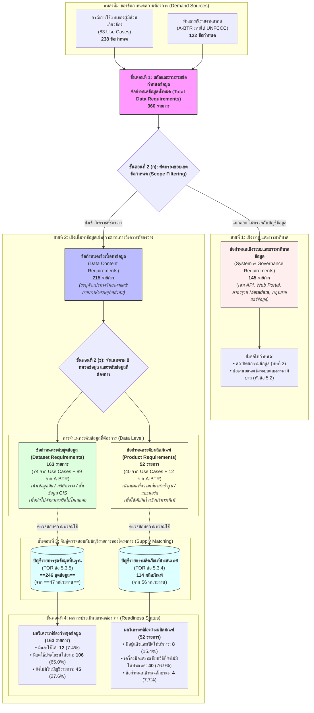

# 5.1 ผลการวิเคราะห์ช่องว่างระหว่างความต้องการใช้ข้อมูลกับบัญชีรายการชุดข้อมูลพื้นฐานและบัญชีรายการผลิตภัณฑ์สารสนเทศ

ในขอบเขตงานข้อ 5.3.8 นี้ คณะที่ปรึกษาวิเคราะห์ช่องว่างระหว่างอุปทานและอุปสงค์ของข้อมูล โดยการนำผลการสังเคราะห์ความต้องการใช้ข้อมูลมาเปรียบเทียบกับ**บัญชีรายการผลิตภัณฑ์ข้อมูลสารสนเทศ**และ**บัญชีชุดข้อมูลพื้นฐาน**ที่มีอยู่ เพื่อวิเคราะห์หาช่องว่างเชิงสถาบันและกฎหมาย ทั้งในเชิงปริมาณ (ข้อมูลที่ยังขาด) และเชิงคุณภาพ (ข้อมูลที่มีแต่ใช้ประโยชน์ได้ยาก) คำว่าข้อมูลที่ยังขาดหมายถึงรายการความต้องการที่ไม่ปรากฏในบัญชีรายการที่ตรงประเภท ขณะที่ข้อมูลที่มีแต่ใช้ประโยชน์ได้ยากหมายถึง รายการที่ปรากฏอยู่แล้วในบัญชี แต่ผู้ใช้ข้อมูลยังพบประเด็นที่ติดขัดในการนำข้อมูลไปใช้ เนื่องจากข้อจำกัดด้านการเข้าถึง คุณภาพ หรือรูปแบบข้อมูล ผลการประเมินช่องว่างจึงแสดงว่าความต้องการของหน่วยงานสอดคล้องกับข้อมูลที่มีอยู่ในบัญชีรายการทั้งสองชุดเพียงใด

กรณีการใช้งาน (Use Cases) ที่คณะที่ปรึกษารวบรวมจากผู้มีส่วนเกี่ยวข้องในบทที่ 3 เป็นเรื่องเล่าจากภารกิจการทำงานและการตัดสินใจของหน่วยงาน แต่ละกรณีระบุโจทย์ของภารกิจ วัตถุประสงค์ และการตัดสินใจที่ต้องทำให้สำเร็จ ซึ่งมักต้องใช้ข้อมูลหลายด้านประกอบกันโดยยังไม่ระบุชื่อชุดข้อมูลหรือฐานข้อมูลที่ใช้ ตัวอย่างเช่น สถาบันการเงินระบุกรณีการใช้งานว่า ต้องการประเมินความเสี่ยงอุทกภัยต่อพอร์ตสินเชื่อที่อยู่อาศัย เพื่อกำหนดเงื่อนไขการให้สินเชื่อและการสำรองเงินทุนตามเกณฑ์ของธนาคารแห่งประเทศไทย ด้วยเหตุนี้ ก่อนเปรียบเทียบกับบัญชีรายการ คณะที่ปรึกษาจึงแปลงเรื่องเล่าแต่ละกรณีเป็น **ข้อกำหนดข้อมูล (Data Requirements)** ที่ช่วยให้ภารกิจนั้นสำเร็จตามวัตถุประสงค์ และนำไปค้นหาในบัญชีรายการได้

**การแปลงกรณีการใช้งานเป็นข้อกำหนดข้อมูล**
คณะที่ปรึกษาแปลงเรื่องเล่าภารกิจเป็นข้อกำหนดข้อมูลโดยตั้งคำถามว่า ข้อมูลแต่ละรายการนำไปตอบโจทย์การทำงานใดในกระบวนการตัดสินใจ คำตอบแบ่งได้เป็น 2 หัวข้อหลัก โดยหัวข้อแรกเกี่ยวกับตัวสารสนเทศของข้อมูลที่มี เรียกว่า ข้อกำหนดเชิงเนื้อหาข้อมูลสารสนเทศ (Information Content Requirements) โดยแบ่งออกเป็นสองระดับ ตามความลึกของความต้องการ

| ปลายทางการใช้ข้อมูลในการตัดสินใจ | ประเภทข้อกำหนดข้อมูลที่สกัดออกมา                      |
| -------------------------------- | ----------------------------------------------------- |
| นำไปคำนวณหรือใส่แบบจำลองต่อ      | ข้อกำหนดระดับชุดข้อมูล (Dataset Requirements)         |
| นำไปประกอบการตัดสินใจ            | ข้อกำหนดระดับผลิตภัณฑ์สารสนเทศ (Product Requirements) |

นอกจากประเด็นที่เกี่ยวข้องโดยตรงกับการนำข้อมูลสารสนเทศไปใช้แล้ว ความต้องการที่เกี่ยวข้องกับระบบนิเวศของข้อมูล เช่นการเชื่อมโยงข้อมูล มาตรฐาน คุณภาพของข้อมูล ปรากฏอยู่ในประสบการณ์การใช้งานข้อมูลเป็นจำนวนมาก โดยประเด็นด้านนี้ถูกจัดกลุ่มในหมวด ข้อกำหนดเชิงระบบและธรรมาภิบาล (System & Governance Requirements)

**ตัวอย่างการแปลงกรณีการใช้งานของสถาบันการเงินเป็นข้อกำหนดข้อมูล**

|             ลำดับขั้นตอนการถอดรหัส             | ข้อกำหนดข้อมูลที่ได้                                                                                              | การนำไปใช้                                                                      |          ประเภทข้อกำหนด          |
| :--------------------------------------------: | ----------------------------------------------------------------------------------------------------------------- | ------------------------------------------------------------------------------- | :------------------------------: |
|  **1. ทรัพย์สินที่เสี่ยงคืออะไร อยู่ที่ไหน?**  | พิกัดตำแหน่งและมูลค่าประเมินของหลักประกันสินเชื่อ (Spatial Coordinates & Asset Values)                            | ระบุตำแหน่งและมูลค่าของทรัพย์สินที่เปิดรับภัย (Exposure) ในระบบสินเชื่อ         | ข้อกำหนดระดับชุดข้อมูล (Dataset) |
|  **2. สภาพภัยที่จะเกิดมีความรุนแรงเพียงใด?**   | ระดับความลึกและระยะเวลาน้ำท่วมขัง (Flood Inundation Depth & Duration) รายคาบ 10, 50, 100 ปี รูปแบบกริดเชิงพื้นที่ | ป้อนค่าระดับความลึกน้ำท่วม (Hazard) เข้าสู่แบบจำลองคำนวณความเสียหาย             | ข้อกำหนดระดับชุดข้อมูล (Dataset) |
| **3. น้ำท่วมลึกเท่านี้ ก่อความเสียหายกี่บาท?** | ฟังก์ชันความเสียหายต่อสิ่งปลูกสร้าง (Depth-Damage Curves) จำแนกตามประเภทอาคาร                                     | แปลงความลึกของน้ำเป็นสัดส่วนความเสียหายทางการเงินของหลักประกัน (Impact)         | ข้อกำหนดระดับผลิตภัณฑ์ (Product) |
|       **4. ระบบเชื่อมต่อข้อมูลอย่างไร?**       | บริการเชื่อมโยงข้อมูลอัตโนมัติ (Automated API Services) สำหรับดึงค่าความเสี่ยงรายพิกัด                            | เชื่อมต่อข้อมูลความเสี่ยงเข้าสู่ระบบอนุมัติสินเชื่อ (Core Banking) แบบเรียลไทม์ |    ข้อกำหนดเชิงระบบ (System)     |

คณะที่ปรึกษาดำเนินกระบวนการวิเคราะห์ช่องว่างผ่านระเบียบวิธี 4 ขั้นตอน ตามภาพที่ 5-1 ดังนี้
1. การสกัดและรวบรวมข้อกำหนดข้อมูลทั้งหมดจากกรณีการใช้งานของผู้มีส่วนเกี่ยวข้องและการจัดทำรายงาน A-BTR
2. การคัดกรองข้อกำหนดข้อมูลออกเป็น 2 ส่วน ได้แก่ ข้อกำหนดเชิงระบบและธรรมาภิบาลข้อมูล (System & Governance Requirements) และ ข้อกำหนดเชิงเนื้อหาข้อมูลสารสนเทศ (Information Content Requirements) จากนั้นจัดกลุ่มข้อกำหนดเชิงเนื้อหาตามหมวดข้อมูล 8 หมวดตามขอบเขตงานข้อ 5.3.5 และแยกระดับข้อมูลที่ต้องการเป็นระดับชุดข้อมูลและระดับผลิตภัณฑ์สารสนเทศ
3. การนำข้อกำหนดข้อมูลไปจับคู่ตรวจสอบกับบัญชีรายการของโครงการที่ตามประเภท โดยนำข้อกำหนดระดับชุดข้อมูลไปตรวจสอบกับบัญชีรายการชุดข้อมูลพื้นฐาน  และนำข้อกำหนดระดับผลิตภัณฑ์ไปตรวจสอบกับบัญชีรายการผลิตภัณฑ์สารสนเทศ  
4. การประเมินสถานะความพร้อมใช้ของชุดข้อมูล (Dataset) โดยการประเมินความพร้อมใช้แบ่งเป็น 3 ระดับ ประกอบกับการให้เหตุผลว่าเหตุใดชุดข้อมูลจึงยังไม่พร้อมใช้ การประเมินฝั่งผลิตภัณฑ์สารสนเทศ โดยใช้เกณฑ์การประเมินว่ามีผลิตภัณฑ์รองรับแล้วหรือไม่ และต้องพัฒนาอย่างไรเพื่อให้สามารถพร้อมใช้ได้ 

สำหรับหมวดข้อมูล 8 หมวดในการจัดประเภทกลุ่มของข้อกำหนดเนื้อหาข้อมูลสารสนเทศ ใช้การจัดกลุ่มตามโครงสร้างการจัดหมวดหมู่ข้อมูลของบัญชีรายการชุดข้อมูลพื้นฐาน ซึ่งอยู่บนพื้นฐานของประเภทชุดข้อมูลตามขอบเขตงานข้อ 5.3.5 ได้แก่
1) ปัจจัยและเงื่อนไขความเสี่ยงในอนาคต ซึ่งประกอบด้วย 
	1) ปัจจัยขับเคลื่อนทางภูมิอากาศ (Climatic Driver)
	2) ภัย (Hazard)
	3) การเปิดรับภัย (Exposure)
	4) ความอ่อนไหว (Sensitivity)
	5) ศักยภาพในการปรับตัว (Adaptive Capacity) 
2) สิ่งที่เกิดขึ้นแล้วในอดีต ซึ่งประกอบด้วย 
	1) ผลกระทบ (Impact) 
	2) ความสูญเสียและความเสียหาย (Loss and Damage) 
3) มาตรการรับมือ ซึ่งได้แก่ มาตรการรับมือ (Response) 

การจัดกลุ่มข้อกำหนดเนื้อหาข้อมูลสารสนเทศด้วยโครงสร้างนี้ ช่วยในการสืบค้นและเปรียบเทียบข้อกำหนดข้อมูลกับชุดข้อมูลบัญชีรายการชุดข้อมูลพื้นฐาน และช่วยให้สามารถสรุปและรายงานผลการวิเคราะห์ช่องว่างตามรายหมวดข้อมูลที่ขอบเขตงานกำหนด  

```mermaid
flowchart TD
    subgraph S1 ["แหล่งที่มาของข้อกำหนดความต้องการ (Demand Sources)"]
        UC["กรณีการใช้งานของผู้มีส่วนเกี่ยวข้อง<br/>(83 Use Cases)<br/><b>238 ข้อกำหนด</b>"]
        BTR["พันธกรณีรายงานสากล<br/>(A-BTR ภายใต้ UNFCCC)<br/><b>122 ข้อกำหนด</b>"]
    end

    TOTAL["<b>ขั้นตอนที่ 1: สกัดและรวบรวมข้อกำหนดข้อมูล</b><br/><b>ข้อกำหนดข้อมูลทั้งหมด (Total Data Requirements)</b><br/><b>360 รายการ</b>"]
    UC --> TOTAL
    BTR --> TOTAL

    TOTAL --> STEP1{"<b>ขั้นตอนที่ 2 (ก): คัดกรองขอบเขตข้อกำหนด (Scope Filtering)</b>"}

    subgraph TRACK_SYS ["สายที่ 1: เชิงระบบและธรรมาภิบาล"]
        SYS["<b>ข้อกำหนดเชิงระบบและธรรมาภิบาลข้อมูล</b><br/>(System & Governance Requirements)<br/><b>145 รายการ</b><br/><i>(เช่น API, Web Portal, มาตรฐาน Metadata, กฎหมายแชร์ข้อมูล)</i>"]
        SYS_TARGET["ส่งต่อไปกำหนด:<br/>• สถาปัตยกรรมข้อมูล (บทที่ 2)<br/>• ข้อเสนอแนะเชิงระบบและธรรมาภิบาล (หัวข้อ 5.2)"]
        SYS --> SYS_TARGET
    end

    subgraph TRACK_DATA ["สายที่ 2: เชิงเนื้อหาข้อมูลเข้าสู่กระบวนการวิเคราะห์ช่องว่าง"]
        CONTENT["<b>ข้อกำหนดเชิงเนื้อหาข้อมูล</b><br/>(Data Content Requirements)<br/><b>215 รายการ</b><br/><i>(ระบุตัวแปรทางวิทยาศาสตร์/กายภาพ/เศรษฐกิจสังคม)</i>"]
        
        STEP2{"<b>ขั้นตอนที่ 2 (ข): จำแนกตาม 8 หมวดข้อมูล และระดับข้อมูลที่ต้องการ</b>"}
        CONTENT --> STEP2

        subgraph SPLIT_TYPE ["การจำแนกระดับข้อมูลที่ต้องการ (Data Level)"]
            REQ_DS["<b>ข้อกำหนดระดับชุดข้อมูล (Dataset Requirements)</b><br/><b>163 รายการ</b><br/>(74 จาก Use Cases + 89 จาก A-BTR)<br/><i>เน้นข้อมูลดิบ / สถิติตาราง / ชั้นข้อมูล GIS<br/>เพื่อนำไปคำนวณหรือใส่โมเดลต่อ</i>"]
            REQ_PR["<b>ข้อกำหนดระดับผลิตภัณฑ์ (Product Requirements)</b><br/><b>52 รายการ</b><br/>(40 จาก Use Cases + 12 จาก A-BTR)<br/><i>เน้นแผนที่ความเสี่ยงสำเร็จรูป / แดชบอร์ด<br/>เพื่อใช้ตัดสินใจเชิงบริหารทันที</i>"]
        end
        STEP2 --> REQ_DS
        STEP2 --> REQ_PR

        subgraph INVENTORY ["ขั้นตอนที่ 3: จับคู่ตรวจสอบกับบัญชีรายการของโครงการ (Supply Matching)"]
            INV_DS[("<b>บัญชีรายการชุดข้อมูลพื้นฐาน</b><br/>(TOR ข้อ 5.3.5)<br/><b>==246 ชุดข้อมูล==</b><br/>(จาก ==47 หน่วยงาน==)")]
            INV_PR[("<b>บัญชีรายการผลิตภัณฑ์สารสนเทศ</b><br/>(TOR ข้อ 5.3.4)<br/><b>114 ผลิตภัณฑ์</b><br/>(จาก 56 หน่วยงาน)")]
        end

        REQ_DS -.->|ตรวจสอบความพร้อมใช้| INV_DS
        REQ_PR -.->|ตรวจสอบความพร้อมใช้| INV_PR

        subgraph GAP_RESULT ["ขั้นตอนที่ 4: ผลการประเมินสถานะช่องว่าง (Readiness Status)"]
            RES_DS["<b>ผลวิเคราะห์ช่องว่างชุดข้อมูล (163 รายการ)</b><br/>• มีและใช้ได้: <b>12</b> (7.4%)<br/>• มีแต่ใช้ประโยชน์ได้ยาก: <b>106</b> (65.0%)<br/>• ยังไม่มีในบัญชีรายการ: <b>45</b> (27.6%)"]
            RES_PR["<b>ผลวิเคราะห์ช่องว่างผลิตภัณฑ์ (52 รายการ)</b><br/>• มีอยู่แล้วและเปิดให้บริการ: <b>8</b> (15.4%)<br/>• เครื่องมือและระเบียบวิธีที่ยังไม่มีในประเทศ: <b>40</b> (76.9%)<br/>• ข้อกำหนดเชิงคุณลักษณะ: <b>4</b> (7.7%)"]
        end

        INV_DS --> RES_DS
        INV_PR --> RES_PR
    end

    STEP1 -->|แยกออก ไม่ตรวจกับบัญชีข้อมูล| SYS
    STEP1 -->|ส่งเข้าวิเคราะห์ช่องว่าง| CONTENT

    style TOTAL fill:#f9f,stroke:#333,stroke-width:2px
    style CONTENT fill:#bbf,stroke:#333,stroke-width:2px
    style SYS fill:#fee,stroke:#333,stroke-width:1px
    style REQ_DS fill:#dfd,stroke:#333,stroke-width:1px
    style REQ_PR fill:#ffd,stroke:#333,stroke-width:1px
    style INV_DS fill:#dff,stroke:#333,stroke-width:1px
    style INV_PR fill:#dff,stroke:#333,stroke-width:1px
```

*ภาพที่ 5-1 แผนภาพระเบียบวิธีวิเคราะห์ช่องว่าง (Analytical Funnel) และความเชื่อมโยงข้อกำหนดข้อมูลระหว่างอุปสงค์และอุปทาน*

## 5.1.1 สังเคราะห์ข้อกำหนดข้อมูล

**ขั้นตอนที่ 1: สกัดและรวบรวมข้อกำหนดข้อมูล**
ข้อกำหนดข้อมูลที่คณะที่ปรึกษานำมาวิเคราะห์รวบรวมมาจากกรณีการใช้งานข้อมูลสารสนเทศด้านการปรับตัวต่อการเปลี่ยนแปลงสภาพภูมิอากาศ ที่ได้มาจากสองแหล่งข้อมูลหลัก แหล่งแรกคือการรับฟังความคิดเห็นและการสัมภาษณ์เชิงลึกตามขอบเขตงานข้อ 5.3.2–5.3.3 ซึ่งครอบคลุมกรณีการใช้งาน 83 กรณี และถอดรหัสออกเป็นข้อกำหนดข้อมูล **238 รายการ** แหล่งที่สองคือพันธกรณีการรายงานด้านการปรับตัวในรายงานความโปร่งใสรายสองปี (Biennial Transparency Report: BTR) ในบทรายงานการปรับตัวต่อการเปลี่ยนแปลงสภาพภูมิอากาศ (Adaptation Chapter) ซึ่งกรมการเปลี่ยนแปลงสภาพภูมิอากาศและสิ่งแวดล้อมมีหน้าที่ต้องรายงานต่อสำนักเลขาธิการอนุสัญญาสหประชาชาติว่าด้วยการเปลี่ยนแปลงสภาพภูมิอากาศ (UNFCCC) และโดยกรณีการใช้งานต่างๆ ที่สนับสนุนการจัดทำรายงานนี้ได้เพิ่มข้อกำหนดข้อมูลอีก **122 รายการ** รวมเป็นข้อกำหนดข้อมูลที่นำเข้าสู่กระบวนการวิเคราะห์ทั้งสิ้น **360 รายการ** คณะที่ปรึกษาจำแนกข้อกำหนดทั้งหมดออกเป็นข้อกำหนดเชิงเนื้อหาข้อมูล **215 รายการ** และข้อกำหนดเชิงระบบและธรรมาภิบาลข้อมูล **145 รายการ** ตัวอย่างข้อกำหนดทั้งสองส่วนที่คณะที่ปรึกษาคัดจากฐานข้อมูลของโครงการแสดงในตารางที่ 5-1 และตารางที่ 5-2

**ตารางที่ 5-1 ตัวอย่างข้อกำหนดเชิงเนื้อหาข้อมูล จำแนกตามหมวดข้อมูลและระดับการใช้งาน**

| รหัสข้อกำหนด | รายการข้อกำหนดข้อมูล                                                                         |    หมวดข้อมูล     | ระดับข้อมูลที่ต้องการ | หน่วยงานผู้ขอ / แหล่งที่มา                         | วัตถุประสงค์การใช้งาน                                          |
| :----------: | -------------------------------------------------------------------------------------------- | :---------------: | :-------------------: | -------------------------------------------------- | -------------------------------------------------------------- |
|     D001     | แผนที่โอกาสเกิดน้ำท่วมแบบความน่าจะเป็นระดับทรัพย์สิน (ระบุชนิดน้ำหลาก น้ำฝนสะสม น้ำทะเลหนุน) |      Hazard       |  ชุดข้อมูล (Dataset)  | สมาคมธนาคารไทย / ธนาคารพาณิชย์                     | ระบุความเสี่ยงน้ำท่วมรายพิกัดสำหรับหลักประกันสินเชื่อ          |
|     D002     | ข้อมูลระดับความลึกและระยะเวลาน้ำท่วมขัง (Flood Inundation Depth and Duration)                |      Hazard       |  ชุดข้อมูล (Dataset)  | สมาคมธนาคารไทย / กทม.                              | ป้อนค่าความลึกน้ำลงในแบบจำลองคำนวณความเสียหาย                  |
|     D003     | ฟังก์ชันความเสียหายต่อสิ่งปลูกสร้างจำแนกตามความลึกน้ำท่วม (Depth-Damage Curves)              |      Impact       |  ผลิตภัณฑ์ (Product)  | สมาคมธนาคารไทย / ธปท.                              | แปลงความลึกน้ำท่วมเป็นเปอร์เซ็นต์ความเสียหายทางการเงินของอาคาร |
|     D008     | เส้นทางฉากทัศน์สภาพภูมิอากาศและการปล่อยก๊าซเรือนกระจก (SSP2-4.5 และ SSP5-8.5)                |  Climatic Driver  |  ชุดข้อมูล (Dataset)  | สมาคมธนาคารไทย / กรม สส.                           | ขับเคลื่อนแบบจำลองความเสี่ยงทางการเงินระยะยาว 30 ปี            |
|     D011     | กรอบระเบียบวิธีมาตรฐานสำหรับการประเมินมูลค่าความสูญเสียและความเสียหายทางเศรษฐกิจ             |  Loss and Damage  |  ผลิตภัณฑ์ (Product)  | สำนักงานสภาพัฒนาการเศรษฐกิจและสังคมแห่งชาติ (สศช.) | กำหนดกรอบคำนวณความสูญเสียทางเศรษฐกิจระดับมหภาค                 |
|     D012     | ชุดข้อมูลความสูญเสียจากภัยพิบัติที่ครอบคลุมความสูญเสียทางอ้อมและการหยุดชะงักทางธุรกิจ        |  Loss and Damage  |  ชุดข้อมูล (Dataset)  | สศช. / สภาหอการค้าฯ                                | บัญชีต้นทุนค่าเสียโอกาสทางเศรษฐกิจจากภัยพิบัติ                 |
|     D013     | ข้อมูลผลกระทบน้ำท่วมระดับเหตุการณ์ในพื้นที่เขตเศรษฐกิจและนิคมอุตสาหกรรม                      |      Impact       |  ชุดข้อมูล (Dataset)  | สศช. / ปภ.                                         | ประเมินผลกระทบต่อห่วงโซ่อุปทานการผลิต                          |
|     D018     | สถิติและระดับน้ำกักเก็บในอ่างเก็บน้ำขนาดใหญ่และขนาดกลางรายวัน                                |      Hazard       |  ชุดข้อมูล (Dataset)  | สศช. / กรมชลประทาน                                 | ประเมินความเสี่ยงภัยแล้งต่อผลผลิตภาคการเกษตร                   |
|     D048     | ทะเบียนข้อมูลประชากรกลุ่มเปราะบางรายบุคคลและครัวเรือน (ผู้สูงอายุ ผู้พิการ ผู้ป่วยติดเตียง)  |    Sensitivity    |  ชุดข้อมูล (Dataset)  | กระทรวงการพัฒนาสังคมและความมั่นคงของมนุษย์ (พม.)   | วางแผนให้ความช่วยเหลือและอพยพกรณีเกิดภัยพิบัติ                 |
|     D055     | ชุดดัชนีชี้วัดความเปราะบางต่อสาธารณภัยมาตรฐานระดับพื้นที่                                    |    Sensitivity    |  ผลิตภัณฑ์ (Product)  | กรมป้องกันและบรรเทาสาธารณภัย (ปภ.)                 | จัดลำดับความเร่งด่วนในการจัดสรรงบประมาณป้องกันภัย              |
|     D068     | ชั้นข้อมูลพิกัดและแนวเขตนิคมอุตสาหกรรมและเขตประกอบการอุตสาหกรรม                              |     Exposure      |  ชุดข้อมูล (Dataset)  | การนิคมอุตสาหกรรมแห่งประเทศไทย (กนอ.)              | ซ้อนทับตำแหน่งโรงงานอุตสาหกรรมกับพื้นที่เสี่ยงภัย              |
|     D075     | สถิติปริมาณน้ำฝนรายชั่วโมงและรายวันย้อนหลังระดับสถานีตรวจวัด                                 |  Climatic Driver  |  ชุดข้อมูล (Dataset)  | กรมทางหลวง / กรมอุตุนิยมวิทยา                      | คำนวณรอบปีการเกิดซ้ำของฝนตกหนักสำหรับออกแบบระบายน้ำ            |
|     D076     | เส้นโค้งความสัมพันธ์ระหว่างความเข้ม ระยะเวลา และความถี่ของฝน (IDF Curves) คาดการณ์ในอนาคต    |  Climatic Driver  |  ผลิตภัณฑ์ (Product)  | กรมทางหลวง                                         | กำหนดเกณฑ์วิศวกรรมออกแบบสะพานและคันทางในอนาคต                  |
|     D090     | ชั้นข้อมูลโครงข่ายทางหลวงแผ่นดินและสะพานพร้อมระดับความสูงคันทาง                              |     Exposure      |  ชุดข้อมูล (Dataset)  | กรมทางหลวง                                         | ประเมินความเสี่ยงบริเวณทางหลวงตัดผ่านพื้นที่เสี่ยงน้ำท่วมคันทาง        |
|     D132     | แผนที่ความเปราะบางซ้อนทับเชิงพื้นที่เศรษฐกิจสังคมในเขตเมือง (Urban Vulnerability Overlay)    |    Sensitivity    |  ผลิตภัณฑ์ (Product)  | ศูนย์ออกแบบและพัฒนาเมือง (UDDC)                    | กำหนดพื้นที่ฟื้นฟูเมืองและมาตรการผังเมืองเพื่อความปลอดภัย      |
|     D141     | สถิติภาวะหนี้สินครัวเรือนเกษตรและการถือครองที่ดินทำกิน                                       | Adaptive Capacity |  ชุดข้อมูล (Dataset)  | สำนักงานสถิติแห่งชาติ (สสช.)                       | วัดศักยภาพทางการเงินในการฟื้นตัวจากภัยแล้งของเกษตรกร     |
|     D144     | ดัชนีความพร้อมรับมือและความสามารถในการฟื้นตัวเชิงสถาบัน (Institutional Resilience Index)     | Adaptive Capacity |  ผลิตภัณฑ์ (Product)  | สอวช.                                              | ติดตามและประเมินศักยภาพการปรับตัวระดับนโยบายของประเทศ          |
|     D147     | ข้อมูลตำแหน่งที่ตั้งและศักยภาพของศูนย์พักพิงและจุดบริการคลายร้อน (Cooling Centers)           |     Response      |  ชุดข้อมูล (Dataset)  | กรุงเทพมหานคร (กทม.)                               | วางแผนเครือข่ายจุดคลายร้อนรับมือคลื่นความร้อนใน กทม.           |
|     A001     | ข้อมูลการกระจายตัวและความหนาแน่นของประชากรในเขตพื้นที่เสี่ยงภัยชายฝั่ง                       |     Exposure      |  ชุดข้อมูล (Dataset)  | พันธกรณีรายงานความโปร่งใส (A-BTR)                  | จัดทำรายงานระดับสากลต่อสำนักเลขาธิการ UNFCCC                   |

**ตารางที่ 5-2 ตัวอย่างข้อกำหนดเชิงระบบและธรรมาภิบาลข้อมูล จำแนกตามมิติการบริหารจัดการข้อมูล**

| รหัสข้อกำหนด | รายการข้อกำหนดเชิงระบบและธรรมาภิบาล                                                              | มิติด้านการจัดการข้อมูล | หน่วยงานผู้ขอ / แหล่งที่มา              | วัตถุประสงค์การใช้งาน                                                    |
| :----------: | ------------------------------------------------------------------------------------------------ | :---------------------: | --------------------------------------- | ------------------------------------------------------------------------ |
|     D024     | กลไกและกรอบความร่วมมือการเชื่อมโยงแลกเปลี่ยนข้อมูลข้ามหน่วยงาน (Data Exchange Framework)         |    ธรรมาภิบาลข้อมูล     | ปภ. / สศช.                              | ขจัดอุปสรรคการขออนุญาตเป็นรายครั้งระหว่างกระทรวง                         |
|     D148     | พอร์ทัลศูนย์กลางข้อมูลความเสี่ยงสภาพภูมิอากาศจุดเดียวของประเทศ (Single-entry Portal)             |   ระบบสืบค้นและบริการ   | UDDC / กรม สส.                          | รวมศูนย์การสืบค้นและเข้าถึงข้อมูลสภาพภูมิอากาศของชาติ                    |
|     D149     | ระบบแค็ตตาล็อกข้อมูลดิจิทัลพร้อมฟังก์ชันค้นหาชุดข้อมูลและเมทาดาทาอัตโนมัติ                       |   ระบบสืบค้นและบริการ   | UDDC / พม.                              | อำนวยความสะดวกในการค้นหาและระบุเจ้าของชุดข้อมูล                          |
|     D150     | ช่องทางบริการเชื่อมโยงข้อมูลอัตโนมัติ (Automated API Services: CSV, GeoJSON, NetCDF)             | โครงสร้างพื้นฐานดิจิทัล | UDDC / สถาบันการเงิน                    | ป้อนข้อมูลเข้าสู่ระบบปฏิบัติงานอัตโนมัติโดยไม่ต้องดาวน์โหลดรายไฟล์       |
|     D152     | แผนที่ความเสี่ยงสภาพภูมิอากาศที่มีสถานะเป็นทางการและได้รับการรับรองทางกฎหมาย                     |  ธรรมาภิบาลและมาตรฐาน   | UDDC / ยผ.                              | ใช้เป็นเอกสารอ้างอิงในการจัดทำผังเมืองรวมและการบังคับใช้กฎหมาย           |
|     D160     | คู่มือมาตรฐานและสื่อการเรียนรู้ทางเทคนิคสำหรับการประเมินความเสี่ยงสภาพภูมิอากาศ                  |  การเสริมสร้างศักยภาพ   | สมาคมธนาคารไทย                          | ยกระดับทักษะนักวิเคราะห์ข้อมูลของหน่วยงานและสถาบันการเงิน                |
|     D162     | กรอบมาตรฐานคำอธิบายข้อมูลอภิพันธ์ทางเทคนิค (Technical Metadata Schema Standard)                  |      มาตรฐานข้อมูล      | พม. / กรม สส.                           | กำหนดให้ระบุตัวแปร ความละเอียดเชิงพื้นที่-เวลา และข้อจำกัดการใช้         |
|     D180     | สถาปัตยกรรมและช่องทางเชื่อมต่อระบบแลกเปลี่ยนข้อมูลภาครัฐที่มีการควบคุมสิทธิ (GDX Integration)    | โครงสร้างพื้นฐานดิจิทัล | สำนักงานพัฒนารัฐบาลดิจิทัล (สพร. / DGA) | ส่งผ่านข้อมูลจำกัดสิทธิหรือข้อมูลส่วนบุคคลอย่างปลอดภัย                   |
|     D181     | แนวทางการเผยแพร่ชุดข้อมูลเปิดผ่านศูนย์กลางข้อมูลเปิดภาครัฐ (Open Data via data.go.th)            |    การเปิดเผยข้อมูล     | สพร. (DGA)                              | เปิดเผยข้อมูลสาธารณะให้ประชาชนและภาคเอกชนเข้าถึงได้โดยเสรี               |
|     D182     | แนวปฏิบัติการจำแนกชั้นความลับและการคุ้มครองข้อมูลส่วนบุคคลด้านสภาพภูมิอากาศ                      |    ธรรมาภิบาลข้อมูล     | สพร. (DGA) / พม.                        | กำหนดแนวทางสรุปข้อมูลสถิติภาพรวมเพื่อไม่ให้ละเมิดกฎหมาย PDPA             |
|     D201     | มาตรฐานข้อมูลอภิพันธ์สำหรับข้อมูลเชิงพื้นที่ (Spatial Metadata Standard: CRS, Resolution, Scale) |      มาตรฐานข้อมูล      | กรมโยธาธิการและผังเมือง (ยผ.)           | ควบคุมคุณภาพและระบบพิกัดอ้างอิงของชั้นข้อมูลแผนที่                       |
|     D202     | มาตรฐานรูปแบบข้อมูลเชิงพื้นที่ดิจิทัลที่อ่านได้ด้วยเครื่อง (Machine-readable Spatial Standard)   | โครงสร้างพื้นฐานดิจิทัล | ยผ. / กรมทางหลวง                        | เปลี่ยนผ่านข้อมูลจากเอกสาร PDF สู่ชั้นข้อมูลเวกเตอร์และกริด (GIS Layers) |
|     D215     | แนวทางจัดตั้งคณะทำงานธรรมาภิบาลข้อมูลความเสี่ยงสภาพภูมิอากาศระดับชาติ                            |    ธรรมาภิบาลข้อมูล     | กรม สส.                                 | สร้างกลไกกำกับดูแลและติดตามการแลกเปลี่ยนข้อมูลอย่างต่อเนื่อง             |
|     D220     | ตารางความเชื่อมโยงสถิติสิ่งแวดล้อมสากล FDES เข้ากับหน่วยงานในประเทศที่รับผิดชอบ                     |      มาตรฐานข้อมูล      | สำนักงานสถิติแห่งชาติ (สสช.)            | จัดหมวดหมู่สถิติข้อมูลสภาพภูมิอากาศให้สอดคล้องกับกรอบ UN                 |
|     D222     | บันทึกข้อตกลงและหนังสือมอบหมายหน่วยงานผู้รับผิดชอบการผลิตข้อมูลหลัก (Data Custodian MoUs)           |    ธรรมาภิบาลข้อมูล     | สสช. / กรม สส.                          | รับประกันความต่อเนื่องและความเป็นปัจจุบันในการปรับปรุงข้อมูล             |
|     A004     | แพลตฟอร์มสารสนเทศสำหรับติดตามและประเมินผลการปรับตัวระดับชาติ (National Adaptation Platform)      |   ระบบสืบค้นและบริการ   | พันธกรณีรายงานความโปร่งใส (A-BTR)       | รองรับการรวบรวมตัวชี้วัดและจัดทำรายงานส่งสำนักเลขาธิการ UNFCCC           |

> **หมายเหตุ** คณะที่ปรึกษาจัดทำรายการข้อกำหนดข้อมูลฉบับสมบูรณ์ทั้ง 360 รายการ (ข้อกำหนดจากกรณีการใช้งาน D001–D238 และข้อกำหนดจากรายงานสากล A001–A122) พร้อมรหัสกำกับ หน่วยงานผู้ขอ วัตถุประสงค์การใช้งาน และผลการจับคู่ ไว้ใน**ทะเบียนข้อกำหนดและอุปทานข้อมูล (Demand-Supply Register)** ในรูปแบบไฟล์ csv

ข้อกำหนดเชิงระบบและธรรมาภิบาลข้อมูล **145 รายการ** (124 รายการจากการสัมภาษณ์หน่วยงาน และ 21 รายการจากพันธกรณี A-BTR) ระบุความต้องการด้านโครงสร้างพื้นฐานดิจิทัลและการจัดการข้อมูล เช่น ศูนย์กลางข้อมูลสารสนเทศ (Web Portal) บริการเชื่อมโยงข้อมูลอัตโนมัติ (API) บัญชีรายการชุดข้อมูลอ้างอิงส่วนกลาง มาตรฐานข้อมูลและข้อมูลอภิพันธ์ (Metadata) ตลอดจนแนวปฏิบัติในการเปิดเผยข้อมูล ข้อกำหนดกลุ่มนี้ระบุช่องทาง มาตรฐาน และกติกาการใช้ข้อมูล ซึ่งจับคู่กับชุดข้อมูลหรือผลิตภัณฑ์รายการใดรายการหนึ่งในบัญชีรายการไม่ได้ คณะที่ปรึกษาจึงส่งต่อข้อกำหนดกลุ่มนี้ไปใช้กำหนดกรอบสถาปัตยกรรมข้อมูลในบทที่ 2 และข้อเสนอแนะเชิงระบบและธรรมาภิบาลข้อมูลในหัวข้อ 5.2 ข้อกำหนดเชิงระบบและธรรมาภิบาลคิดเป็นร้อยละ 40.3 ของข้อกำหนดทั้งหมด 360 รายการ ซึ่งชี้ให้เห็นว่าอุปสรรคในการใช้ข้อมูลสภาพภูมิอากาศของหน่วยงานส่วนหนึ่งอยู่ที่ช่องทางเชื่อมโยงข้อมูลระหว่างหน่วยงาน มาตรฐานข้อมูลอภิพันธ์ และแนวปฏิบัติการเปิดเผยข้อมูล นอกเหนือจากการขาดข้อมูลทางวิทยาศาสตร์

**ขั้นตอนที่ 2 จำแนกตาม 8 หมวดข้อมูล และระดับข้อมูลที่ต้องการ**

ข้อกำหนดเชิงเนื้อหาข้อมูล **215 รายการ** ระบุตัวแปร ชุดข้อมูล ดัชนี หรือผลลัพธ์การวิเคราะห์ที่ผู้ใช้ต้องการ คณะที่ปรึกษาจำแนกข้อกำหนดกลุ่มนี้ตามระดับข้อมูลที่ต้องการเป็น **ข้อกำหนดระดับชุดข้อมูล 163 รายการ** (ข้อมูลดิบ ข้อมูลสถิติ หรือชั้นข้อมูลเชิงพื้นที่สำหรับนำไปวิเคราะห์หรือใส่แบบจำลองต่อ ประกอบด้วย 74 รายการจากกรณีการใช้งาน และ 89 รายการจากพันธกรณี A-BTR) และ **ข้อกำหนดระดับผลิตภัณฑ์สารสนเทศ 52 รายการ** (ข้อมูลสังเคราะห์ แผนที่ หรือดัชนีสำเร็จรูปสำหรับประกอบการตัดสินใจเชิงนโยบายและการบริหาร ประกอบด้วย 40 รายการจากกรณีการใช้งาน และ 12 รายการจากพันธกรณี A-BTR) จากนั้นจัดข้อกำหนดทั้งหมดเข้าหมวดข้อมูล 8 หมวดตามขอบเขตงานข้อ 5.3.5 โดยพิจารณาจากสาระสำคัญที่ผู้ใช้ต้องการทราบ ตามเกณฑ์ต่อไปนี้

| หมวดข้อมูล        | เกณฑ์การจัดเข้าหมวด                                   |
| ----------------- | ----------------------------------------------------- |
| Climatic Driver   | ตัวแปรสภาพภูมิอากาศทั้งอดีตและอนาคต                   |
| Hazard            | สภาพหรือเหตุการณ์ที่อาจก่อความเสียหาย                 |
| Exposure          | ตำแหน่งและปริมาณของสิ่งที่ตั้งอยู่ในพื้นที่เสี่ยง      |
| Sensitivity       | คุณลักษณะที่ทำให้เกิดผลกระทบเชิงลบจากการเผชิญภัย     |
| Adaptive Capacity | ทรัพยากรและศักยภาพในการรับมือ                         |
| Impact            | บันทึกเหตุการณ์และผลกระทบที่เกิดขึ้น                  |
| Loss and Damage   | มูลค่าความเสียหายจากภัย                               |
| Response          | มาตรการดำเนินงานเพื่อการปรับตัว                        |

ตารางที่ 5-3 แจกแจงข้อกำหนดเชิงเนื้อหาข้อมูล 215 รายการตามระดับข้อมูล (ชุดข้อมูลและผลิตภัณฑ์) และหมวดข้อมูลตามขอบเขตงานข้อ 5.3.5 ซึ่งแสดงขอบเขตความต้องการข้อมูลจากกรณีการใช้งาน 83 กรณีและพันธกรณี A-BTR ก่อนเข้าสู่การตรวจสอบช่องว่าง

**ตารางที่ 5-3 ภาพรวมข้อกำหนดเชิงเนื้อหาข้อมูล จำแนกตามหมวดข้อมูลตามขอบเขตงานข้อ 5.3.5 (215 รายการ)**

| หมวดข้อมูลตามขอบเขตงานข้อ 5.3.5           | ข้อกำหนดระดับชุดข้อมูล | ข้อกำหนดระดับผลิตภัณฑ์ | รวมข้อกำหนดเชิงเนื้อหาข้อมูล |
| ----------------------------------------- | :--------------------: | :--------------------: | :--------------------------: |
| **1. ปัจจัยและเงื่อนไขความเสี่ยงในอนาคต** |                        |                        |                              |
| Climatic Driver                           |           24           |           4            |              28              |
| Hazard                                    |           79           |           13           |              92              |
| Exposure                                  |           14           |           4            |              18              |
| Sensitivity                               |           12           |           8            |              20              |
| Adaptive Capacity                         |           5            |           7            |              12              |
| **2. สิ่งที่เกิดขึ้นแล้วในอดีต**          |                        |                        |                              |
| Impact                                    |           18           |           8            |              26              |
| Loss and Damage                           |           10           |           8            |              18              |
| **3. มาตรการรับมือ**                      |                        |                        |                              |
| Response                                  |           1            |           0            |              1               |
| **รวมทั้งหมด**                            |        **163**         |         **52**         |           **215**            |

ผลการจัดกลุ่มพบว่า ข้อกำหนดเชิงเนื้อหากระจุกตัวในกลุ่มปัจจัยและเงื่อนไขความเสี่ยงในอนาคต โดยหมวด Hazard (92 รายการ) และ Climatic Driver (28 รายการ) รวมกันคิดเป็นร้อยละ 55 ของข้อกำหนดเชิงเนื้อหาทั้งหมด สัดส่วนนี้สอดคล้องกับกิจกรรมหลักของหลายหน่วยงานที่กำลังเริ่มประเมินภัยทางกายภาพ ซึ่งเป็นขั้นตอนแรกของการทำความเข้าใจความเสี่ยง ขณะที่หมวด Adaptive Capacity มี 12 รายการ และ Loss and Damage มี 18 รายการ จำนวนข้อกำหนดที่แตกต่างกันนี้ชี้ว่าหน่วยงานส่วนใหญ่กำลังดำเนินการอยู่ในขั้นตอนทำความเข้าใจภัยทางกายภาพ หรือมีความติดขัดในกระบวนการนี้มากที่สุด และยังไม่ได้ดำเนินการไปถึงขั้นตอนการประเมินความสามารถในการรับมือและผลกระทบระยะยาวได้ จำนวนข้อกำหนดในแต่ละหมวดจึงสะท้อนสถานะการทำงานด้านข้อมูลความเสี่ยงจากภูมิอากาศของหน่วยงานในปัจจุบัน ในขั้นต้นของวงจรการปรับตัว

## 5.1.2 ผลการเปรียบเทียบความต้องการกับบัญชีรายการ

คณะที่ปรึกษานำข้อกำหนดเชิงเนื้อหาข้อมูลทั้ง 215 รายการที่จำแนกไว้ในหัวข้อ 5.1.1 ไปตรวจสอบเปรียบเทียบกับบัญชีรายการของโครงการสองชุดตามประเภทของข้อมูล ได้แก่ บัญชีรายการชุดข้อมูลพื้นฐานตามขอบเขตงานข้อ 5.3.5 (รวบรวมได้ ==246 ชุดข้อมูล==จาก ==47 หน่วยงาน==) และบัญชีรายการผลิตภัณฑ์สารสนเทศตามขอบเขตงานข้อ 5.3.4 (รวบรวมได้ 114 ผลิตภัณฑ์จาก 56 หน่วยงาน) โดยข้อกำหนดระดับชุดข้อมูล 163 รายการ นำไปตรวจสอบกับบัญชีรายการชุดข้อมูลพื้นฐาน ขณะที่ข้อกำหนดระดับผลิตภัณฑ์สารสนเทศ 52 รายการ นำไปตรวจสอบกับบัญชีรายการผลิตภัณฑ์สารสนเทศ

ฝั่งชุดข้อมูล คณะที่ปรึกษาประเมินข้อกำหนด 163 รายการเป็น 2 ขั้นตอน ตามขั้นตอนที่ 3 และขั้นตอนที่ 4 ในภาพที่ 5-1

**ขั้นตอนที่ 3 การตรวจสอบการมีอยู่ของข้อมูลในบัญชีรายการ**

เมื่อนำข้อกำหนดระดับชุดข้อมูล 163 รายการไปตรวจสอบกับบัญชีรายการชุดข้อมูลพื้นฐาน ==246 ชุดข้อมูล== ผลเป็นดังนี้
- มีชุดข้อมูลในบัญชีรายการรองรับ 118 รายการ (ร้อยละ 72.4 ของข้อกำหนดทั้งหมด) 
- ยังไม่มีในบัญชีรายการชุดข้อมูลพื้นฐาน 45 รายการ (ร้อยละ 27.6 ของข้อกำหนดทั้งหมด)

ผลจากการจัดกลุ่มพบว่า มีชุดข้อมูลที่หน่วยงานผู้ใช้ต้องการราว 3 ใน 4  ดังนั้น ช่องว่างฝั่งชุดข้อมูลส่วนใหญ่จึงอยู่ที่ว่าผู้ใช้สามารถนำข้อมูลเหล่านั้นไปใช้ได้หรือไม่  

**ขั้นตอนที่ 4 การประเมินสถานะความพร้อมใช้ของข้อมูลที่มีอยู่**
สถานะความพร้อมใช้ 2 ระดับมีนิยามดังนี้
1) **มีและใช้ได้** รายการที่มีชุดข้อมูลเปิดเผยต่อสาธารณะรองรับ และหน่วยงานผู้ใช้เข้าถึงไปประมวลผลต่อในภารกิจได้ทันทีโดยไม่ติดอุปสรรคเชิงนโยบายหรือเทคนิค
2) **มีแต่ใช้ประโยชน์ได้ยาก** รายการที่มีชุดข้อมูลอยู่ในระบบของหน่วยงานรัฐแล้ว แต่หน่วยงานผู้ใช้ติดข้อจำกัดด้านสิทธิการเข้าถึง คุณภาพ ความละเอียด หรือรูปแบบไฟล์ จนนำไปใช้ประโยชน์ในทางปฏิบัติได้ไม่เต็มที่
 

คณะที่ปรึกษาประเมินข้อกำหนด 118 รายการที่มีชุดข้อมูลรองรับว่าหน่วยงานผู้ใช้นำข้อมูลไปใช้ตามภารกิจได้หรือไม่ โดยจำแนกเป็น 2 สถานะ
1) **มีและใช้ได้** จำนวน **12 รายการ** (ร้อยละ 10.2 ของข้อมูลที่มีในบัญชีรายการ)
2) **มีแต่ใช้ประโยชน์ได้ยาก** จำนวน **106 รายการ** (ร้อยละ 89.8 ของข้อมูลที่มีในบัญชีรายการ)

สำหรับข้อกำหนดที่อยู่ในสถานะ**มีแต่ใช้ประโยชน์ได้ยาก** คณะที่ปรึกษากำหนดรหัสกำกับเพื่อระบุสาเหตุของอุปสรรค 6 ประการ (รายการหนึ่งอาจมีรหัสมากกว่าหนึ่งรหัสพร้อมกัน) ได้แก่ 
1. ปัญหาด้านสิทธิการเข้าถึงข้อมูล (`access`)
2. ข้อมูลอภิพันธ์หรือคำอธิบายชุดข้อมูลไม่ครบถ้วน (`metadata`)
3. การขาดข้อมูลความไม่แน่นอนหรือสมมติฐานแบบจำลอง (`uncertainty_info`)
4. ความละเอียดเชิงพื้นที่ไม่สอดคล้องกับการใช้งาน (`spatial_detail`)
5. รูปแบบไฟล์นำไปวิเคราะห์ต่อไม่ได้ (`format`)
6. ข้อมูลไม่ได้ปรับปรุงให้เป็นปัจจุบัน (`update_currency`)

ผลของทั้งสองขั้นตอนรวมกันให้สถานะความพร้อมใช้ 3 ระดับของข้อกำหนดระดับชุดข้อมูลทั้ง 163 รายการ จำแนกตามหมวดข้อมูล 8 หมวดตามขอบเขตงานข้อ 5.3.5 ดังแสดงในตารางที่ 5-4

**ตารางที่ 5-4 การครอบคลุมของบัญชีรายการชุดข้อมูลพื้นฐานต่อข้อกำหนดระดับชุดข้อมูล จำแนกตามหมวดข้อมูลและสถานะ (163 รายการ)**

| หมวดข้อมูลตามขอบเขตงานข้อ 5.3.5           |  มีและใช้ได้   | มีแต่ใช้ประโยชน์ได้ยาก | มีในบัญชีชุดข้อมูล | ยังไม่มีในบัญชีชุดข้อมูล | สัดส่วนความครอบคลุมของบัญชีชุดข้อมูล |
| ----------------------------------------- | :------------: | :--------------------: | :----------------: | :----------------------: | :----------------------------------: |
| **1. ปัจจัยและเงื่อนไขความเสี่ยงในอนาคต** |                |                        |                    |                          |                                      |
| Climatic Driver                           |       2        |           15           |         17         |            7             |                70.8%                 |
| Hazard                                    |       6        |           56           |         62         |            17            |                78.5%                 |
| Exposure                                  |       2        |           11           |         13         |            1             |                92.9%                 |
| Sensitivity                               |       1        |           6            |         7          |            5             |                58.3%                 |
| Adaptive Capacity                         |       0        |           2            |         2          |            3             |                40.0%                 |
| **2. สิ่งที่เกิดขึ้นแล้วในอดีต**          |                |                        |                    |                          |                                      |
| Impact                                    |       0        |           12           |         12         |            6             |                66.7%                 |
| Loss and Damage                           |       0        |           4            |         4          |            6             |                40.0%                 |
| **3. มาตรการรับมือ**                      |                |                        |                    |                          |                                      |
| Response                                  |       1        |           0            |         1          |            0             |                100.0%                |
| **รวมประเภทชุดข้อมูล**                    | **12 (7.4%)**  |     **106 (65.0%)**    |  **118 (72.4%)**   |      **45 (27.6%)**      |              **72.4%**               |

> **หมายเหตุ**
> - ตัวเลขในตารางเป็นจำนวนข้อกำหนด บัญชีรายการชุดข้อมูลพื้นฐานตามขอบเขตงานข้อ 5.3.5 รวบรวมชุดข้อมูลได้ ==246 ชุด==จาก ==47 หน่วยงาน== และข้อกำหนด 118 รายการมีชุดข้อมูลในบัญชีนี้รองรับ ชุดข้อมูลอื่นในบัญชีเป็นข้อมูลทั่วไปหรือข้อมูลเชิงบริหารที่อยู่นอกขอบเขตความต้องการของกรณีการใช้งาน 83 กรณีและพันธกรณี A-BTR ในรอบนี้
> - บัญชีรายการชุดข้อมูลพื้นฐานจัดเก็บ Sensitivity และ Adaptive Capacity รวมกันภายใต้หมวดความเปราะบาง (Vulnerability) จำนวน ==57 ชุดข้อมูล== ผลการตรวจสอบสถานะของทั้งสองหมวดจึงอ้างอิงชุดข้อมูลกลุ่มเดียวกัน
> - สถานะ "ยังไม่มีในบัญชีชุดข้อมูล" (45 รายการ) หมายถึงความต้องการที่ไม่ปรากฏในบัญชีรายการชุดข้อมูลพื้นฐาน ==246 ชุด==ของโครงการ ซึ่งมีทั้งข้อมูลที่ยังไม่มีการจัดเก็บหรือสร้างแบบจำลองในประเทศ และข้อมูลสถิติที่หน่วยงานอื่นจัดทำอยู่แล้วในระดับมหภาค (เช่น บัญชีเศรษฐกิจการท่องเที่ยว) แต่การสำรวจรอบนี้ยังไม่ได้รวบรวมไว้ในบัญชี

ข้อสังเกตรายหมวดข้อมูลจากตารางที่ 5-4 มีดังนี้

1. **Climatic Driver (ข้อกำหนด 24 รายการ / มีชุดข้อมูลในบัญชีรองรับ 17 รายการ — ร้อยละ 70.8)**
   - หน่วยงานส่วนใหญ่เริ่มระบุความต้องการจากตัวแปรภูมิอากาศพื้นฐาน เช่น อุณหภูมิและปริมาณฝน หมวดนี้จึงมีข้อกำหนด 24 รายการ
   - สำนักงานพัฒนาเทคโนโลยีอวกาศและภูมิสารสนเทศ (องค์การมหาชน) หรือ GISTDA เผยแพร่ข้อมูลอุณหภูมิผิวน้ำทะเลจากดาวเทียม (Sea Surface Temperature: SST) เป็นข้อมูลสาธารณะที่ดาวน์โหลดไปวิเคราะห์ต่อได้ทันที
   - กรมการเปลี่ยนแปลงสภาพภูมิอากาศและสิ่งแวดล้อมพัฒนาฐานข้อมูลความเสี่ยงเชิงพื้นที่ ซึ่งเปิดให้สามารถดาวน์โหลดชุดข้อมูลดัชนีสภาพภูมิอากาศคาดการณ์ในอนาคต (พ.ศ. 2503–2643) เป็นไฟล์ตารางสรุป (CSV/Excel) ครอบคลุม 77 จังหวัด ใน 2 ฉากทัศน์การปล่อยก๊าซเรือนกระจก (SSP2-4.5 และ SSP5-8.5) ประกอบด้วยค่าดัชนีอุณหภูมิและปริมาณฝนรุนแรง
   - ไฟล์กริดความละเอียดสูงต้นทาง (NetCDF) ของแบบจำลองการลดขนาดทางสถิติ (Statistical Downscaling) ซึ่งให้ 4 ตัวแปรหลัก (อุณหภูมิเฉลี่ย สูงสุด ต่ำสุด และปริมาณฝน) ยังเป็นข้อมูลจำกัดสิทธิ (Restricted) (`access`) และยังไม่เปิดให้ดาวน์โหลดหรือเชื่อมต่อผ่าน API อัตโนมัติ หน่วยงานภายนอกที่ต้องการนำกริดไปขับเคลื่อนแบบจำลองเฉพาะทางจึงเข้าถึงข้อมูลกริดต้นทางโดยตรงไม่ได้ และยังต้องทำหนังสือขอข้อมูล

2. **Hazard (ข้อกำหนด 79 รายการ / มีชุดข้อมูลในบัญชีรองรับ 62 รายการ — ร้อยละ 78.5)**
   - หมวด Hazard มีข้อกำหนดมากที่สุด 79 รายการ หรือเกือบครึ่งหนึ่งของข้อกำหนดระดับชุดข้อมูลทั้งหมด ซึ่งอาจเป็นเพราะหน่วยงานส่วนใหญ่คุ้นเคยกับการใช้แผนที่น้ำท่วมหรือแผนที่ภัยแล้งในการปฏิบัติงาน
   - ข้อกำหนด 6 รายการในหมวดนี้มีข้อมูลประเภทสังเกตการณ์ (observation) ที่เปิดเผยและใช้ได้โดยไม่ต้องทำหนังสือขออนุญาตรองรับ เช่น
     - GISTDA ข้อมูลขอบเขตรอยน้ำท่วมจากดาวเทียม ข้อมูลจุดความร้อนและพื้นที่เผาไหม้สะสม
     - สถาบันสารสนเทศทรัพยากรน้ำ (องค์การมหาชน) หรือ สสน. ดัชนีภัยแล้งระดับตำบล (Drought Risk Index: DRI)
     - กรุงเทพมหานคร ข้อมูลสถานีตรวจวัดปริมาณฝน ระดับน้ำในคลองสายหลัก และดัชนีความร้อน
   - ข้อมูลระดับน้ำทะเลชายฝั่งของกรมเจ้าท่า และฐานข้อมูลร่องรอยดินถล่มของกรมทรัพยากรธรณี อยู่ในบัญชีรายการ แต่ยังจำกัดสิทธิการเข้าถึงหรือไม่ระบุสิทธิการเข้าถึงไว้ชัดเจน จึงจัดเป็นข้อมูลที่มีแต่ใช้ประโยชน์ได้ยาก
   - แพลตฟอร์มศูนย์ข้อมูลการเปลี่ยนแปลงสภาพภูมิอากาศ (Climate Change Information Center: CCIC) ของ กรม สส. เป็นแหล่งข้อมูลคาดการณ์สำหรับภัยหลักในหมวดนี้ ฐานข้อมูลความเสี่ยงเชิงพื้นที่บนแพลตฟอร์ม CCIC ให้ดัชนีภัย 24 ตัวแปร รวมถึงดัชนีความถี่และจำนวนครั้งของการเกิดน้ำท่วมและภัยแล้ง ครอบคลุม 5 ช่วงเวลาตามฉากทัศน์ SSP2-4.5 และ SSP5-8.5 ข้อมูลภัยของแพลตฟอร์ม CCIC มีข้อจำกัดในการใช้งาน 3 ด้าน ดังนี้
     1. **ความละเอียดเชิงพื้นที่** ข้อมูลคาดการณ์บนแพลตฟอร์ม CCIC เป็นค่าสรุปรวมระดับจังหวัด (77 จังหวัด) ซึ่งไม่เพียงพอสำหรับการประเมินความเสี่ยงในระดับปฏิบัติการ เช่น การประเมินความเสี่ยงระดับแปลงที่ดินของภาคการเงิน การประเมินจุดเสี่ยงบนแนวเส้นทางคมนาคม หรือการวางแผนระดับตำบลขององค์กรปกครองส่วนท้องถิ่น
     2. **รูปแบบข้อมูล** แพลตฟอร์ม CCIC เปิดให้ดาวน์โหลดข้อมูลเป็นไฟล์ตารางตัวเลข (CSV/Excel) และยังไม่มีชั้นข้อมูลเชิงพื้นที่ในระบบสารสนเทศภูมิศาสตร์ (GIS Spatial Raster/Vector Layers) ผู้ใช้จึงซ้อนทับข้อมูลภัยกับชั้นข้อมูลทรัพย์สินได้ไม่ทันที
     3. **พารามิเตอร์ทางกายภาพ** ดัชนีภัยบนแพลตฟอร์ม CCIC เช่น ดัชนีจำนวนวันฝนตกหนัก ให้ความถี่เชิงสถิติ ขณะที่การประเมินความเสียหายทางการเงินและวิศวกรรมต้องใช้ระดับความลึกของน้ำท่วม (Inundation Depth เป็นเมตร) ตามรอบปีการเกิดซ้ำ (Return Periods: 10, 50, 100 ปี) เพื่อคำนวณร่วมกับฟังก์ชันความเสียหาย ดัชนีกลุ่มนี้จึงยังใช้แทนผลของแบบจำลองชลศาสตร์ระดับพื้นที่ไม่ได้

3. **Exposure (ข้อกำหนด 14 รายการ / มีชุดข้อมูลในบัญชีรองรับ 13 รายการ — ร้อยละ 92.9)**
   - ข้อกำหนด 14 รายการระบุทรัพย์สินทางกายภาพโดยตรง เช่น แนวถนน นิคมอุตสาหกรรม พื้นที่เกษตรกรรม และอาคารสถานพยาบาล ส่วนการเปิดรับภัยเชิงระบบ เช่น โครงข่ายโลจิสติกส์และห่วงโซ่อุปทาน ยังมีข้อมูลที่จำกัด
   - บัญชีรายการชุดข้อมูลพื้นฐานมีชุดข้อมูลด้านการเปิดรับภัย ==67 ชุดข้อมูล== ครอบคลุมทรัพย์สินหลักจากหน่วยงานต่อไปนี้
     - กรมการปกครอง สถิติจำนวนประชากรและทะเบียนราษฎรรายพื้นที่
     - สำนักงานสถิติแห่งชาติ ข้อมูลสำมะโนประชากรและเคหะ
     - กรมทางหลวง แนวโครงข่ายทางหลวงแผ่นดินและทางพิเศษทั่วประเทศ
     - กรมแผนที่ทหาร แบบจำลองความสูงภูมิประเทศเชิงเลข (Digital Elevation Model: DEM) ระดับชาติ
     - GISTDA แผนที่แปลงปลูกพืชเศรษฐกิจหลัก 6 ชนิด ความละเอียด 40 เมตร
     - การนิคมอุตสาหกรรมแห่งประเทศไทย (กนอ.) แผนที่ขอบเขตนิคมอุตสาหกรรม
     - สำนักงานคณะกรรมการการศึกษาขั้นพื้นฐาน (สพฐ.) ฐานข้อมูลสถานศึกษา
     - กระทรวงสาธารณสุข ฐานข้อมูลโรงพยาบาลและสถานพยาบาล
     - กรมศิลปากร พิกัดแหล่งโบราณสถาน
     - กรมการท่องเที่ยวและการท่องเที่ยวแห่งประเทศไทย (ททท.) ฐานข้อมูลจำนวนและที่ตั้งของสถานประกอบการที่พัก โรงแรม และรีสอร์ต
   - ในข้อกำหนด 13 รายการที่มีชุดข้อมูลรองรับ มี 2 รายการที่ใช้ได้ทันที อีก 11 รายการติดข้อจำกัดในการนำไปใช้ตามตารางที่ 5-4
   - ข้อมูลทรัพย์สินจัดเก็บเป็นจุดพิกัดหรือเส้นทางคมนาคม ขณะที่แบบจำลองภูมิอากาศเป็นกริด (Grid) ขนาด 5–25 กิโลเมตร หน่วยงานจึงต้องแปลงพิกัดและเกลี่ยข้อมูลเอง ซึ่งผลลัพธ์อาจคลาดเคลื่อนและแตกต่างกันระหว่างหน่วยงาน (รายละเอียดของปัญหาหน่วยพื้นที่อยู่ในหัวข้อ 5.1.4)
   - ข้อมูลผังเมืองรวมและการใช้ประโยชน์ที่ดินของกรมโยธาธิการและผังเมืองบางส่วนยังจัดเก็บเป็นเอกสาร PDF หรือระบบแสดงผลภาพที่ไม่เปิดให้ดาวน์โหลดชั้นข้อมูลเวกเตอร์ (GIS Layers) ผู้ใช้จึงซ้อนทับเขตผังเมืองกับชั้นข้อมูลภัยเพื่อคำนวณมูลค่าความเสี่ยงเชิงพื้นที่ได้ยาก
   - ข้อกำหนด 1 รายการที่ยังไม่มีในบัญชีชุดข้อมูล คือข้อมูลบัญชีประชาชาติด้านการท่องเที่ยว (Tourism Satellite Account : TSA) ซึ่งสำนักงานสถิติแห่งชาติร้องขอ

4. **Sensitivity & Adaptive Capacity (ข้อกำหนด 17 รายการ / มีชุดข้อมูลในบัญชีรองรับ 9 รายการ — ร้อยละ 52.9)**
   - ข้อกำหนดส่วนใหญ่เน้นข้อมูลกลุ่มประชากรเปราะบาง เช่น ผู้สูงอายุ ผู้พิการ และผู้มีรายได้น้อย ขณะที่ข้อมูลด้านศักยภาพในการปรับตัวมีการระบุเพียง 5 รายการ ซึ่งอาจเป็นเพราะหน่วยงานยังขาดกรอบตัวชี้วัดเชิงปริมาณสำหรับศักยภาพในการปรับตัว
   - สถิติภาวะหนี้สินและการถือครองที่ดินจากสำมะโนการเกษตรของสำนักงานสถิติแห่งชาติเปิดเผยและใช้งานได้ ส่วนข้อมูลภาคเกษตรและแหล่งน้ำอื่นในบัญชีรายการ ได้แก่ สถิติพื้นที่เขตชลประทานและสัดส่วนพื้นที่ชลประทานต่อพื้นที่เกษตรทั้งหมด สถิติปริมาณน้ำกักเก็บในอ่างเก็บน้ำของกรมชลประทาน และระบบตรวจวัดและเตือนภัยน้ำหลากดินถล่มล่วงหน้าในพื้นที่ต้นน้ำ (Early Warning) ของกรมทรัพยากรน้ำ จัดเก็บภายใต้สถานะจำกัดสิทธิ
   - กระทรวงการพัฒนาสังคมและความมั่นคงของมนุษย์ (พม.) จัดเก็บข้อมูลกลุ่มเปราะบางทางสังคม (เช่น ผู้สูงอายุ ผู้พิการ ผู้ป่วยติดเตียง และผู้มีรายได้น้อย) ภายใต้สถานะจำกัดสิทธิ เนื่องจากเป็นข้อมูลส่วนบุคคลตามพระราชบัญญัติคุ้มครองข้อมูลส่วนบุคคล (PDPA) และยังไม่ได้ประมวลผลสรุปเป็นสถิติภาพรวมรายพื้นที่ (เช่น ระดับตำบล) เพื่อเผยแพร่เป็นข้อมูลสาธารณะ
   - การที่บัญชีรายการชุดข้อมูลพื้นฐานจัดเก็บสองหมวดนี้รวมกันภายใต้หมวดความเปราะบาง (ดูหมายเหตุใต้ตารางที่ 5-4) ทำให้การสืบค้นข้อมูลด้านการปรับตัวต้องพิจารณาเนื้อหาเป็นรายชุด

5. **Impact & Loss and Damage (ข้อกำหนด 28 รายการ / มีชุดข้อมูลในบัญชีรองรับ 16 รายการ — ร้อยละ 57.1)**
   - ข้อมูลความเสียหายที่มีอยู่ส่วนใหญ่เป็นสถิติความเสียหายทางกายภาพขั้นต้นในอดีตจากการรายงานเพื่อการช่วยเหลือผู้ประสบภัยของ ปภ. เช่น จำนวนบ้านเรือนหรือพื้นที่เกษตรที่เสียหาย ส่วนผลกระทบเชิงตัวเงิน ผลกระทบทางอ้อม (Indirect Losses) เช่น การหยุดชะงักของกิจกรรมทางเศรษฐกิจและผลกระทบลูกโซ่ทางเศรษฐกิจ รวมถึงผลกระทบทางสุขภาพ การสูญเสียด้านระบบนิเวศ และความสูญเสียที่ไม่ใช่เชิงเศรษฐกิจ (Non-Economic Loss and Damage) ยังไม่มีการจัดเก็บอย่างเป็นระบบ ข้อมูลความเสียหายที่มีอยู่ยังกระจัดกระจายและขาดมาตรฐานเขตข้อมูลกลาง
   - ปภ. จัดทำฐานข้อมูลสถิติสาธารณภัยและรายงานการสงเคราะห์ผู้ประสบภัยเป็นระบบรายงานจากพื้นที่ ข้อมูลยังไม่สามารถผ่านการตรวจสอบยืนยันจากส่วนกลาง และยังไม่จัดหมวดหมู่ประเภทภัยตามกรอบเซนไดว่าด้วยการลดความเสี่ยงจากภัยพิบัติ (Sendai Framework for Disaster Risk Reduction) ของสำนักงานเพื่อการลดความเสี่ยงจากภัยพิบัติแห่งสหประชาชาติ (United Nations Office for Disaster Risk Reduction: UNDRR) ซึ่งเป็นเงื่อนไขที่การนำข้อมูลไปประเมินความสูญเสียและความเสียหายต้องการ

6. **Response (ข้อกำหนด 1 รายการ / มีชุดข้อมูลในบัญชีรองรับ 1 รายการ — ร้อยละ 100.0)**
   - ข้อกำหนดในหมวดนี้มี 1 รายการ ซึ่งอาจสะท้อนว่าการประเมินของหน่วยงานส่วนใหญ่เน้นการระบุระดับความเสี่ยง (Risk Assessment) มากกว่าการประเมินประสิทธิผลของมาตรการปรับตัว (Adaptation Monitoring and Evaluation)
   - ข้อมูลโครงการปรับตัวและป้องกันภัยพิบัติของภาครัฐ (เช่น แนวคันกั้นน้ำ ประตูระบายน้ำ และการฟื้นฟูป่าต้นน้ำ) มักจัดเก็บเป็นเอกสารรายงานโครงการหรือเอกสารงบประมาณ และยังไม่ได้จัดทำเป็นฐานข้อมูลดิจิทัลเชิงพื้นที่ (Georeferenced Spatial Datasets) ที่ระบุตำแหน่งและขอบเขตพื้นที่ที่ได้รับประโยชน์ บัญชีรายการชุดข้อมูลพื้นฐานจึงรวบรวมชุดข้อมูลหมวด Response ได้ ==9 ชุดข้อมูล==
   - กรุงเทพมหานครเปิดเผยข้อมูลห้องและจุดคลายร้อน (Cooling Points) 255 แห่ง ตามแผนปฏิบัติการจัดการความร้อนเมือง พ.ศ. 2569 เป็นข้อมูลสาธารณะที่ใช้วางแผนรับมือคลื่นความร้อนในเขตเมืองได้ทันที และ พม. มีฐานข้อมูลเครือข่ายเตรียมพร้อมรับมือภัยพิบัติ
   - ข้อมูลมาตรการส่วนใหญ่ยังเน้นรายงานตัวชี้วัดระดับผลผลิต (Output Indicators) และยังขาดตัวชี้วัดระดับผลลัพธ์ (Outcome Indicators) ที่ประเมินการลดความเปราะบางหรือความสูญเสียในระยะยาว 
   
สำหรับฝั่งผลิตภัณฑ์สารสนเทศ คณะที่ปรึกษาตรวจสอบข้อกำหนด 52 รายการกับบัญชีรายการผลิตภัณฑ์สารสนเทศ โดยพิจารณาว่าผลิตภัณฑ์ที่มีอยู่ตอบวัตถุประสงค์การใช้งานและภารกิจของหน่วยงานผู้ขอหรือไม่ และต้องขยายผลอย่างไรเพื่อให้นำไปใช้ได้จริง

ผลการตรวจสอบแบ่งข้อกำหนดได้ 3 กลุ่มสถานะตามตารางที่ 5-5 กลุ่มแรกมีผลิตภัณฑ์ที่หน่วยงานพัฒนาและเปิดให้บริการแล้ว กลุ่มที่สองเป็นเครื่องมือและระเบียบวิธีวิเคราะห์ที่บริการสารสนเทศหลัก 8 รายการตามหัวข้อ 3.3 ต้องใช้  ซึ่งยังไม่มีหน่วยงานใดจัดทำขึ้นอย่างเป็นทางการ 

**ตารางที่ 5-5 การครอบคลุมของบัญชีผลิตภัณฑ์สารสนเทศต่อข้อกำหนดระดับผลิตภัณฑ์สารสนเทศ จำแนกตามสถานะความพร้อมและการพัฒนาต่อยอด (52 รายการ)**

| กลุ่มสถานะของผลิตภัณฑ์สารสนเทศ                              |   จำนวน (ร้อยละ)   | ผลิตภัณฑ์และเครื่องมือที่เกี่ยวข้อง                                                                                                                                                                                                                                                                                                                                                                                                                                                                                                                                                                                                                                                                                                                                                                                | ข้อสังเกตและประเด็นการพัฒนาต่อยอดสู่ระดับปฏิบัติการ                                                                                                                                                                                                                                                                                                                                                                                                                                                                                         |
| ----------------------------------------------------------- | :----------------: | ------------------------------------------------------------------------------------------------------------------------------------------------------------------------------------------------------------------------------------------------------------------------------------------------------------------------------------------------------------------------------------------------------------------------------------------------------------------------------------------------------------------------------------------------------------------------------------------------------------------------------------------------------------------------------------------------------------------------------------------------------------------------------------------------------------------ | ------------------------------------------------------------------------------------------------------------------------------------------------------------------------------------------------------------------------------------------------------------------------------------------------------------------------------------------------------------------------------------------------------------------------------------------------------------------------------------------------------------------------------------------- |
| **1. ผลิตภัณฑ์ที่มีการพัฒนาและเปิดให้บริการแล้ว**           |  **8** (15.4%)  | • **ฐานข้อมูลความเสี่ยงเชิงพื้นที่** (กรม สส.) • **ผลลัพธ์แบบจำลองภูมิอากาศ CMIP6 และการลดสเกลทางสถิติปริมาณฝนและอุณหภูมิ** (กรม สส.) • **แพลตฟอร์มดัชนีความร้อนเชิงพื้นที่** (กรม สส.) • **แพลตฟอร์มข้อมูลสาธารณภัยและดาวเทียม**  (GISTDA) • **แดชบอร์ดแผนที่ความเสี่ยงและระบบรายงานสาธารณภัย** (ปภ.) • **ระบบพยากรณ์น้ำท่วมและดินถล่มล่วงหน้า** (กรมทรัพยากรน้ำ) • **คลังข้อมูลน้ำแห่งชาติ** (สสน.) •**การคาดการณ์ระดับน้ำทะเลในอนาคต อ่าวไทย** (สสน.)                                                                                                                                                                                                                                                                                                                                      | ผลิตภัณฑ์กลุ่มนี้รองรับภารกิจหลักของหน่วยงานเจ้าของ เช่น ฐานข้อมูลความเสี่ยงเชิงพื้นที่ ส่งออกข้อมูลคาดการณ์ภูมิอากาศในรูปแบบตาราง (CSV/Excel) 24 ดัชนีความเสี่ยงรายสาขา และระบบเตือนภัยของ ปภ. GISTDA และ สสน. ใช้เผชิญเหตุระยะสั้น 1–3 วัน  *ประเด็นการพัฒนาต่อยอด* ผู้ใช้ระดับปฏิบัติการต้องการการขยายความละเอียดจากระดับจังหวัดสู่ระดับกริดและแปลงที่ดิน (`spatial_detail`) และการขยายขอบเขตจากแผนที่เตือนภัยระยะสั้นไปสู่การประเมินฉากทัศน์สภาพภูมิอากาศระยะยาว (SSP) พร้อมระบุช่วงความเชื่อมั่นของแบบจำลอง (`uncertainty_info`) |
| **2. เครื่องมือและระเบียบวิธีวิเคราะห์ที่ยังไม่มีในประเทศ** | **40** (76.9%)  | **ระเบียบวิธีที่จำเป็นต่อบริการสารสนเทศหลัก 8 รายการ (หัวข้อ 3.3)** - *บริการที่ 2* แบบจำลองภัยในเขตเมือง แบบจำลองความลึกและระยะเวลาท่วมขังระดับแปลงที่ดิน ข้อมูลกลุ่มเปราะบางและทรัพสินย์ - *บริการที่ 3* ฟังก์ชันความเสียหาย (Damage Functions), ระเบียบวิธี CBA และการประเมินมูลค่าความสูญเสียที่หลีกเลี่ยงได้ (Avoided Losses), การติดฉลากงบประมาณ (Climate Budget Tagging) - *บริการที่ 4* ระเบียบวิธีประเมินความต้องการหลังเกิดภัยพิบัติ (PDNA/DALA) และการบัญชีความสูญเสียที่ไม่ใช่เชิงเศรษฐกิจ (NELD) - *บริการที่ 5* การแปลงตัวแปรทางภูมิอากาศเป็นตัวแปรทางวิศวกรรม - *บริการที่ 6* แบบจำลองคาดการณ์ผลกระทบ (Impact-Based Forecasting) หลายภัย และเกณฑ์เตือนภัยเฉพาะพื้นที่ - *บริการที่ 7* ดัชนีความเปราะบางรายปี, ดัชนีความยืดหยุ่นเชิงสถาบัน และการติดตามความพร้อมทางเทคโนโลยี (TRL) | เป็นช่องว่างด้านเครื่องมือและระเบียบวิธีวิเคราะห์ที่ต้องพัฒนาขึ้นเพื่อรองรับบริการสารสนเทศหลัก 8 รายการตามหัวข้อ 3.3 การเติมช่องว่างส่วนนี้อาศัยการศึกษาวิจัย การพัฒนาระเบียบวิธีมาตรฐาน และการกำหนดนโยบายของหน่วยงานระดับชาติ นอกเหนือจากการเชื่อมโยงระบบข้อมูลเดิม ตามที่วิเคราะห์ในหัวข้อ 5.1.5 และเสนอแนะในหัวข้อ 5.2                                                                                                                                                                                                                   |
| **3. ข้อกำหนดเชิงคุณลักษณะและมาตรฐานกลาง**                  |  **4** (7.7%)   | • เกณฑ์ความละเอียดกริดเชิงพื้นที่สำหรับแบบจำลองสภาพภูมิอากาศ • แนวทางการเลือกช่วงปีฐานของการคำนวณต่างๆ • นิยามหน่วยสถิติพื้นที่และความเข้ากันได้ของขอบเขตการปกครอง • มาตรฐานรูปแบบการแสดงผลเชิงพื้นที่ (Spatial Data Visualization Standards)                                                                                                                                                                                                                                                                                                                                                                                                                                                                                                                                                             | เป็นข้อกำหนดเชิงมาตรฐานและข้อกำหนดทางเทคนิคกลาง ซึ่งทำหน้าที่เป็นเกณฑ์กำกับสถาปัตยกรรมสารสนเทศ และส่งต่อไปยังบทที่ 2 และหัวข้อ 5.2                                                                                                                                                                                                                                                                                                                                                                                                          |
| **รวม**                                                     | **52** (100.0%) |                                                                                                                                                                                                                                                                                                                                                                                                                                                                                                                                                                                                                                                                                                                                                                                                                    |                                                                                                                                                                                                                                                                                                                                                                                                                                                                                                                                             |

> **หมายเหตุ** บัญชีรายการผลิตภัณฑ์สารสนเทศตามขอบเขตงานข้อ 5.3.4 รวบรวมผลิตภัณฑ์ได้ 114 ผลิตภัณฑ์จาก 56 หน่วยงาน ข้อกำหนด 8 รายการ (ร้อยละ 15.4 ของข้อกำหนดระดับผลิตภัณฑ์) มีผลิตภัณฑ์ในบัญชีนี้รองรับ ผลิตภัณฑ์อื่นในบัญชีเป็นระบบงานเฉพาะทางของแต่ละหน่วยงานที่อยู่นอกขอบเขตข้อกำหนดของกรณีการใช้งาน 83 กรณีและพันธกรณี A-BTR ในรอบนี้

จากตาราง 5-4 แสดงให้เห็นว่า สำหรับชุดข้อมูลพื้นฐาน บัญชีรายการชุดข้อมูลพื้นฐานครอบคลุมข้อกำหนดร้อยละ 72.4 (118 จาก 163 รายการ แบ่งเป็นข้อมูลพร้อมใช้ 12 รายการ และข้อมูลที่มีข้อจำกัดเชิงคุณภาพ 106 รายการ) ซึ่งสะท้อนว่าหน่วยงานรัฐจัดเก็บชุดข้อมูลตั้งต้นไว้เป็นส่วนใหญ่แล้ว แต่ผู้ใช้ติดข้อจำกัดด้านสิทธิการเข้าถึง ข้อมูลอภิพันธ์ รูปแบบการจัดเก็บข้อมูล และความไม่เข้ากันของหน่วยพื้นที่ ฝั่งผลิตภัณฑ์สารสนเทศ ข้อกำหนด 40 จาก 52 รายการ (ร้อยละ 76.9) เป็นเครื่องมือและระเบียบวิธีวิเคราะห์ที่ยังไม่มีในประเทศ ช่องว่างฝั่งชุดข้อมูลจึงอยู่ที่การเปิดให้ผู้ใช้ใช้ข้อมูลที่มีอยู่ ขณะที่ช่องว่างฝั่งผลิตภัณฑ์อยู่ที่การสร้างเครื่องมือและระเบียบวิธีขึ้นใหม่

ความแตกต่างนี้ชี้ว่า การปิดช่องว่างต้องอาศัยการดำเนินงานสองแนวทางไปพร้อมกัน ได้แก่ การปรับปรุงสิทธิการเข้าถึงและมาตรฐานข้อมูลในฝั่งชุดข้อมูลพื้นฐาน และการวิจัยพัฒนาระเบียบวิธีเพื่อผลิตบริการสารสนเทศที่ตอบโจทย์ผู้ใช้ในฝั่งผลิตภัณฑ์สารสนเทศ

## 5.1.3 ช่องว่างเชิงปริมาณ

ช่องว่างเชิงปริมาณตามขอบเขตงานข้อ 5.3.8 คือข้อกำหนดที่ไม่ปรากฏในบัญชีรายการทั้งสอง ซึ่งมีทั้งสิ้น 85 รายการ ได้แก่ ข้อกำหนดระดับชุดข้อมูล 45 รายการที่ไม่มีในบัญชีรายการชุดข้อมูลพื้นฐาน (ร้อยละ 28 ของ 163 รายการ) และข้อกำหนดระดับผลิตภัณฑ์สารสนเทศ 40 รายการที่ไม่มีในบัญชีรายการผลิตภัณฑ์สารสนเทศ (ร้อยละ 77 ของ 52 รายการ) ข้อกำหนดฝั่งผลิตภัณฑ์ 40 รายการเป็นเครื่องมือและระเบียบวิธีที่หัวข้อ 5.1.5 วิเคราะห์เป็นรายบริการ  

หมวด Hazard มีข้อกำหนดที่ยังไม่มีในบัญชีมากที่สุด 17 จาก 79 รายการ บัญชีรายการชุดข้อมูลพื้นฐานมีฐานข้อมูลภัยพิบัติเชิงสังเกตการณ์อยู่แล้ว ==35 ชุดข้อมูล== ข้อมูลที่หน่วยงานร้องขอแต่ยังไม่มีคือข้อมูลคาดการณ์เฉพาะทาง เช่น แผนที่โอกาสเกิดอุทกภัยระดับแปลงที่ดิน และข้อมูลความลึกและระยะเวลาน้ำท่วมจำแนกตามฉากทัศน์ความรุนแรงและรอบปีการเกิดซ้ำ ซึ่งต้องอาศัยแบบจำลองชลศาสตร์เชิงสถิติที่ยังไม่มีการพัฒนาให้ครอบคลุมทั่วประเทศ

หมวด Exposure มีข้อกำหนดที่ยังไม่มีในบัญชีเพียง 1 รายการ คือข้อมูลบัญชีประชาชาติด้านการท่องเที่ยว (D038) ที่สำนักงานสถิติแห่งชาติร้องขอ เนื่องจากบัญชีชุดข้อมูลพื้นฐานมีข้อมูลทรัพย์สินทางกายภาพ เช่น แนวถนน แปลงพืชเกษตร และพิกัดสถานที่สำคัญ ซึ่งหน่วยงานรัฐจัดเก็บไว้ครอบคลุมพอสมควรแล้ว

หมวด Climatic Driver มีข้อกำหนดที่ยังไม่มีในบัญชี 7 รายการ ซึ่งกระจุกอยู่ที่กลุ่มตัวแปรสภาพภูมิอากาศคาดการณ์ความละเอียดสูง เช่น ความชื้นสัมพัทธ์ ลม และรังสีดวงอาทิตย์ในอนาคต เมื่อตัวแปรเหล่านี้ยังไม่มี หน่วยงานที่สร้างแบบจำลองประเมินความเสี่ยงร่วมกับข้อมูลภัยจึงได้ตัวแปรนำเข้าไม่ครบ

หมวด Sensitivity (5 รายการ) และ Adaptive Capacity (3 รายการ) มีข้อกำหนดที่ยังไม่มีในบัญชีรวม 8 รายการ ซึ่งกระจุกอยู่ที่ข้อมูลกลุ่มคนเปราะบางระดับจุลภาค สถิติภาระหนี้สินนอกระบบของเกษตรกร และดัชนีศักยภาพการปรับตัวระดับพื้นที่ หน่วยงานใช้ข้อมูลเหล่านี้จัดลำดับความช่วยเหลือทางสังคมและจัดสรรงบประมาณเยียวยา การขาดข้อมูลกลุ่มนี้จึงทำให้การจัดลำดับดังกล่าวยังขาดฐานข้อมูลรองรับ

หมวด Impact (6 รายการ) และ Loss and Damage (6 รายการ) มีข้อกำหนดที่ยังไม่มีในบัญชีรวม 12 รายการ มากเป็นอันดับสองรองจาก Hazard บัญชีรายการมีบันทึกเหตุการณ์ภัยพิบัติย้อนหลัง ข้อมูลผู้ได้รับผลกระทบ และความเสียหายทางตรงของ ปภ. ระดับหมู่บ้านอยู่แล้ว (DDPM_2_1 และ DDPM_2_3) ข้อกำหนดที่ยังไม่มีในบัญชีจึงเป็นข้อมูลนอกระบบรายงานเหตุการณ์ของ ปภ. ในหมวด Impact ได้แก่ ข้อมูลเศรษฐกิจมหภาคสำหรับงานนโยบาย ระยะเวลาผลกระทบจากพายุหมุน ประมาณการผลิตภัณฑ์มวลรวมที่ลดลงถึง พ.ศ. 2593 และผลจัดอันดับดัชนีความเสี่ยงสภาพภูมิอากาศโลก 3 รายการ ในหมวด Loss and Damage ได้แก่ ความสูญเสียทางอ้อมและการหยุดชะงักทางธุรกิจ ตารางต้นทุนมาตรฐานรายประเภทสินทรัพย์ ข้อมูลเศรษฐกิจภาคส่วนสำหรับประเมินความสูญเสียทางอ้อม สัดส่วนความสูญเสียต่อผลิตภัณฑ์มวลรวม สถิติผู้เสียชีวิตและสูญหายจากภัยพิบัติที่จัดเก็บอย่างเป็นระบบ และสถิติผู้เสียชีวิตจากความร้อน ข้อมูลของ ปภ. ที่มีอยู่ติดข้อจำกัดด้านสิทธิการเข้าถึงและคุณภาพการบันทึกตามที่วิเคราะห์ในหัวข้อ 5.1.4 ข้อค้นพบนี้สนับสนุนความจำเป็นของการพัฒนามาตรฐานชุดข้อมูลขั้นต่ำ (Minimum Viable Dataset: MVD) ที่วิเคราะห์ไว้ในบทที่ 4

## 5.1.4 ช่องว่างเชิงคุณภาพ  

ช่องว่างเชิงคุณภาพตามนิยามของขอบเขตงานข้อ 5.3.8 คือข้อกำหนดชุดข้อมูลที่มีข้อมูลในบัญชีรายการชุดข้อมูลพื้นฐานแล้ว แต่หน่วยงานผู้ใช้ติดข้อจำกัดทางเทคนิคจนนำไปใช้ประโยชน์ได้ไม่เต็มที่ รวมทั้งสิ้น **106 รายการ** (ร้อยละ 89.8 ของรายการที่มีชุดข้อมูลรองรับ)

ข้อจำกัดด้านสิทธิการเข้าถึงข้อมูลพบมากที่สุด **67 จาก 106 รายการ** ชุดข้อมูลกลุ่มนี้มีอยู่ในบัญชีรายการชุดข้อมูลพื้นฐาน แต่หน่วยงานเจ้าของข้อมูลจัดเก็บโดยจำกัดสิทธิการเข้าถึง หน่วยงานภายนอกจึงเชื่อมโยงหรือขอรับข้อมูลไปประเมินความเสี่ยงโดยตรงในกระบวนการทำงานปกติไม่ได้ สาเหตุหลักมี 3 ประการ
1. กฎระเบียบภายในของหน่วยงานยังขาดแนวทางแบ่งปันข้อมูลข้ามหน่วยงาน ที่ไม่ต้องอาศัยการทำหนังสือราชการ
2. หน่วยงานมีข้อจำกัดด้านงบประมาณและบุคลากรทางเทคนิคในการสร้างและดูแลช่องทางเชื่อมโยงข้อมูลอัตโนมัติ
3. การตีความพระราชบัญญัติคุ้มครองข้อมูลส่วนบุคคลไปในเชิงที่ขัดขวางการแลกเปลี่ยนข้อมูล 

ข้อจำกัดด้านข้อมูลอภิพันธ์พบเป็นอันดับสอง **39 จาก 106 รายการ** ชุดข้อมูลกลุ่มนี้เปิดให้เข้าถึงได้ แต่ขาดคำอธิบายกำกับตามมาตรฐานข้อมูลอภิพันธ์สารสนเทศภูมิศาสตร์สากล (เช่น ISO 19115) ใน 4 ด้าน
- ข้อมูลอภิพันธ์สำหรับการสืบค้น (Discovery Metadata)
- ข้อมูลอภิพันธ์ทางเทคนิค (Technical Metadata)
- พจนานุกรมข้อมูล (Data Dictionary) สำหรับตีความโครงสร้างเขตข้อมูล
- ประวัติที่มาของข้อมูล (Data Lineage) สำหรับตรวจสอบย้อนกลับที่มาที่ไปของข้อมูล

ข้อจำกัดด้านข้อมูลความไม่แน่นอนพบ **13 รายการ** ในชุดข้อมูลคาดการณ์สภาพภูมิอากาศและแบบจำลองภัยพิบัติในอนาคตที่ไม่ระบุความคลาดเคลื่อน สมมติฐานแบบจำลอง หรือช่วงความเชื่อมั่นของฉากทัศน์ เมื่อข้อมูลถูกนำเสนอโดยไม่มีข้อมูลความไม่แน่นอนกำกับ หน่วยงานอาจนำข้อมูลไปใช้นอกขอบเขตที่ออกแบบไว้ เช่น นำค่าคาดการณ์จากแบบจำลองเดียวไปกำหนดเกณฑ์ออกแบบทางวิศวกรรมโดยไม่เผื่อความคาดเคลื่อน เกณฑ์ที่ได้จึงอาจไม่ครอบคลุมช่วงความเป็นไปได้ของสภาพภูมิอากาศในอนาคต และส่งผลต่อการวางแผนปรับตัวในระยะยาว

ข้อจำกัดด้านความละเอียดเชิงพื้นที่และความเข้ากันไม่ได้ของหน่วยพื้นที่มีทั้งหมด **9 รายการ** ตัวอย่างเช่น ข้อมูลดัชนีภัยพิบัติและภูมิอากาศบนแพลตฟอร์ม CCIC ของ กรม สส. เปิดให้ดาวน์โหลดได้ แต่เป็นค่าระดับจังหวัด ซึ่งไม่เพียงพอต่อการวางแผนระดับลุ่มน้ำย่อย ตำบล หรือแปลงทรัพย์สิน ข้อมูลในบัญชีรายการชุดข้อมูลพื้นฐานยังใช้หน่วยพื้นที่ต่างกัน ข้อมูลภัยพิบัติจัดเก็บเป็นกริดเชิงพื้นที่ ข้อมูลประชากรและสังคมจัดเก็บตามแนวขอบเขตการปกครอง ข้อมูลทรัพย์สินจัดเก็บเป็นจุดพิกัดหรือเส้นทาง และข้อมูลเศรษฐกิจรายงานในระดับภาพรวม เมื่อยังไม่มีระเบียบวิธีมาตรฐานกลางสำหรับแปลงหน่วยพื้นที่เหล่านี้เข้าด้วยกัน ผู้ใช้แต่ละรายต้องแปลงพิกัดและซ้อนทับชั้นข้อมูลเอง ผลลัพธ์ระหว่างหน่วยงานจึงอาจคลาดเคลื่อนได้

ข้อจำกัดด้านรูปแบบไฟล์ (**6 รายการ**) และความทันสมัยของข้อมูล (**4 รายการ**) ทำให้ผู้ใช้ประมวลผลข้อมูลต่อได้ยาก ด้านรูปแบบไฟล์ ผลิตภัณฑ์ข้อมูลสำเร็จรูปบางรายการ [ต้องการข้อมูล: หน่วยงานเจ้าของผลิตภัณฑ์ที่เผยแพร่ให้เปิดดูบนเว็บเบราว์เซอร์เท่านั้น] ยังเผยแพร่ให้เปิดดูได้บนเว็บเบราว์เซอร์เท่านั้น และข้อมูลผังเมืองของกรมโยธาธิการและผังเมืองบางส่วนยังเป็นเอกสาร PDF ที่ไม่เปิดให้ดาวน์โหลดชั้นข้อมูลเวกเตอร์สำหรับการวิเคราะห์ต่อ ส่วนแพลตฟอร์มฐานข้อมูลความเสี่ยงเชิงพื้นที่ ส่งออกข้อมูลตาราง (CSV/Excel) ได้ แต่ยังไม่มีชั้นข้อมูลเชิงพื้นที่ตามที่ระบุในหัวข้อ 5.1.2 ด้านความทันสมัยพบปัญหาอยู่ที่ช่องว่างระยะเวลาในการปรับปรุงข้อมูล ซึ่งหลายชุดข้อมูลไม่มีรอบการปรับปรุงที่ชัดเจน ทำให้ไม่สามารถคาดเดาได้ว่า ชุดข้อมูลที่มี จะได้รับการปรับปรุงเมื่อไหร่

สำหรับข้อมูลสาธารณภัยและความสูญเสีย ข้อมูลที่เกิดขึ้นระหว่างเหตุการณ์สาธารณะภัยมาจากการรายงานจากเจ้าหน้าที่ในพื้นที่ และยังไม่ผ่านการตรวจสอบยืนยันจากส่วนกลาง รวมทั้งไม่มีกลไกที่จะทวนสอบข้อมูลได้เมื่อข้อมูลได้ถูกสรุปและส่งต่อมาจากคณะทำงานระดับจังหวัด ซึ่งเป็นผลจากจุดประสงค์ในการเก็บข้อมูลมุ่งเน้นไปที่การสำรวจผลกระทบเพื่อการเยียวยาประชาชนผู้ได้รับผลกระทบเป็นหลัก ทำให้การนำข้อมูลสาธารณภัยไปใช้ประเมินความสูญเสียและความเสียหายจำเป็นที่จะต้องยกระดับคุณภาพข้อมูลตั้งแต่ต้นทางเสียก่อน  

## 5.1.5 ช่องว่างการพัฒนาบริการสารสนเทศหลัก 8 รายการ

ผลการเปรียบเทียบในหัวข้อ 5.1.2–5.1.4 ระบุช่องว่างรายข้อกำหนดและรายหมวดข้อมูล ส่วนหน่วยงานผู้ใช้นำข้อมูลไปใช้ผ่านบริการสารสนเทศที่ตอบโจทย์การตัดสินใจของตน ซึ่งมักต้องใช้ข้อมูลหลายหมวดและผลิตภัณฑ์หลายรายการประกอบกัน ภายใต้ข้อจำกัดด้านงบประมาณและกำลังคน การพัฒนาบริการสารสนเทศให้ครอบคลุมความต้องการทุกรายการเป็นไปไม่ได้ คณะที่ปรึกษาจึงใช้ผลการสังเคราะห์บริการสารสนเทศหลักจากกรณีการใช้งานในหัวข้อ 3.3 ซึ่งคัดกรองรูปแบบความต้องการของแต่ละหน่วยงานและหาจุดร่วมระหว่างความต้องการที่หลากหลาย เพื่อเสนอบริการสารสนเทศที่ตอบโจทย์ผู้ใช้ได้มากที่สุด แล้วนำช่องว่างที่พบมาจัดเรียงตาม **บริการสารสนเทศหลัก 8 รายการ** นี้ เพื่อแสดงว่าแต่ละบริการมีระบบและผลิตภัณฑ์ใดอยู่แล้ว ต้องพัฒนาระเบียบวิธีใดขึ้นใหม่ และติดข้อจำกัดของชุดข้อมูลพื้นฐานใด

### ที่มาของบริการสารสนเทศหลัก 8 รายการและเกณฑ์การประเมินช่องว่าง

บริการสารสนเทศหลักทั้ง 8 รายการรองรับการวางแผนนโยบาย การจัดสรรงบประมาณ การบริหารความเสี่ยง และการลงทุนโครงสร้างพื้นฐานของหน่วยงาน แต่ละบริการระบุผู้ใช้ การตัดสินใจที่ต้องทำ และสารสนเทศที่ต้องใช้ คณะที่ปรึกษาสังเคราะห์บริการเหล่านี้ในหัวข้อ 3.3 จากกรณีการใช้งานกว่า 40 กรณีของการรับฟังความคิดเห็นช่วงแรก ผ่านกระบวนการวิเคราะห์ 7 ขั้นตอน โดยถอดรูปแบบร่วมตามโครงสร้าง *"ผู้ใช้งาน ก ใช้สารสนเทศ ข เพื่อตัดสินใจ ค ภายใต้เงื่อนไข ง"* และต่อมาขยายฐานกรณีการใช้งานเป็น 83 กรณีสำหรับการจัดทำข้อกำหนดข้อมูลในหัวข้อ 5.1.1

คณะที่ปรึกษาใช้บริการ 8 รายการเป็นกรอบจัดเรียงช่องว่างด้วยเหตุผล 3 ประการ ประการแรก ข้อกำหนดรายหน่วยงานจำนวนมากซ้ำกัน เช่น หน่วยงานด้านผังเมือง สถาบันการเงิน และหน่วยงานคมนาคม ต่างต้องการแบบจำลองความลึกน้ำท่วมและฟังก์ชันความเสียหาย การรวมความต้องการเป็นบริการร่วมช่วยให้พัฒนาเครื่องมือและระเบียบวิธีกลางครั้งเดียวแล้วใช้ร่วมกันได้หลายหน่วยงาน ประการที่สอง หน่วยงานระดับปฏิบัติการส่วนใหญ่มีงบประมาณและบุคลากรเฉพาะทางไม่เพียงพอสำหรับพัฒนาและดูแลแบบจำลองสภาพภูมิอากาศหรือฟังก์ชันความเสียหายเอง บริการร่วมจึงช่วยลดการจัดซื้อจัดจ้างซ้ำซ้อน ประการที่สาม บริการทั้ง 8 รายการเชื่อมโยงกัน คลังข้อมูลการประเมินความเสี่ยงและวางแผนการปรับตัว (บริการที่ 1) เป็นฐานที่บริการอื่นดึงข้อมูลไปใช้ กรณีการใช้งานหนึ่งกรณีมักต้องใช้หลายบริการประกอบกัน และธรรมาภิบาลความไม่แน่นอน (บริการที่ 8) ช่วยกำกับการใช้ผลลัพธ์ของบริการที่ 2 บริการที่ 3 และบริการที่ 5

คณะที่ปรึกษาประเมินแต่ละบริการใน 3 ด้าน ได้แก่
1) ระบบและผลิตภัณฑ์ที่มีอยู่แล้ว ซึ่งบริการใช้เป็นฐานในการพัฒนาต่อได้
2) ระเบียบวิธีและศักยภาพที่ต้องพัฒนาขึ้นใหม่ เช่น แบบจำลอง ระเบียบวิธีวิเคราะห์ และมาตรฐานทางเทคนิค
3) ข้อจำกัดของชุดข้อมูลพื้นฐานที่บริการต้องใช้  

ข้อจำกัดในด้านที่ 3 เป็นรายการประเภทเดียวกับที่รายงานในหัวข้อ 5.1.4 ซึ่งแสดงจำนวนรายการจำแนกตามรหัสเหตุผลไว้แล้ว ตารางที่ 5-6 สรุปผลการประเมินบริการทั้ง 8 รายการ

**ตารางที่ 5-6 ระบบที่มีอยู่ ระเบียบวิธีที่ต้องพัฒนา และข้อจำกัดของชุดข้อมูลพื้นฐาน จำแนกตามบริการสารสนเทศหลัก 8 รายการ**

| บริการสารสนเทศหลัก (ตามหัวข้อ 3.3)                                                                       | ระบบและผลิตภัณฑ์ที่มีอยู่แล้ว                                                                                                                                                        | ระเบียบวิธีและศักยภาพที่ต้องพัฒนาขึ้นใหม่                                                                                                                                                                                                                                                                                                                                                                                                   | ข้อจำกัดของชุดข้อมูลพื้นฐาน                                                                                                                                                                                                                                                                                                                                                                                       |
| -------------------------------------------------------------------------------------------------------- | ------------------------------------------------------------------------------------------------------------------------------------------------------------------------------------ | ------------------------------------------------------------------------------------------------------------------------------------------------------------------------------------------------------------------------------------------------------------------------------------------------------------------------------------------------------------------------------------------------------------------------------------------- | ----------------------------------------------------------------------------------------------------------------------------------------------------------------------------------------------------------------------------------------------------------------------------------------------------------------------------------------------------------------------------------------------------------------- |
| **1. Climate Risk and Adaptation Data Catalog** *(คลังข้อมูลการประเมินความเสี่ยงและวางแผนการปรับตัว)* | บัญชีรายการชุดข้อมูลพื้นฐาน ==246 ชุดข้อมูล==                                                                                                                                            | • บัญชีข้อมูลกลางที่ทำหน้าที่ตัวกลางเชื่อมโยงข้อมูล (Data Broker) ส่งผู้ใช้ไปยังแหล่งข้อมูลต้นทาง • มาตรฐานข้อมูลอภิพันธ์และพจนานุกรมข้อมูลกลาง • การกำหนดหน่วยงานเจ้าของข้อมูลและการรับรองสถานะชุดข้อมูล                                                                                                                                                                                                                             | • ชุดข้อมูลจำนวนมากจำกัดสิทธิการเข้าถึง และหน่วยงานเจ้าของข้อมูลปฏิเสธการแบ่งปันข้อมูลได้ โดยผู้ขอข้อมูลยังไม่มีช่องทางดำเนินการต่อ • ขาดข้อมูลอภิพันธ์ด้านเทคนิค พจนานุกรมข้อมูล และประวัติที่มาของข้อมูล                                                                                                                                                                                                     |
| **2. High-Resolution Spatial Risk Analytics** *(การวิเคราะห์ความเสี่ยงเชิงพื้นที่ความละเอียดสูง)*     | • ดัชนีความเสี่ยงรายจังหวัดของ กรม สส. • แผนด้านการเปลี่ยนแปลงสภาพภูมิอากาศและสาธารณภัยรายจังหวัด 77 แผน ซึ่งมีอยู่ในรูปเอกสาร                                                    | • การสกัดรายละเอียดระดับพื้นที่จากแผนรายจังหวัด 77 แผนให้เป็นข้อมูลที่มีโครงสร้าง • การปรับข้อมูลความเสี่ยงให้ตรงกับขอบเขตเทศบาลจริง ซึ่งปัจจุบันใช้ขอบเขตการปกครองเป็นค่าประมาณ (ทั้งสองแนวทางยังรอการตัดสินใจจัดสรรทรัพยากร) • ข้อมูลภัยที่ลดมาตราส่วนลงสู่ระดับหลักสิบเมตร พร้อมโครงสร้างพื้นฐานด้านการประมวลผลและข้อมูลสภาพแวดล้อมความละเอียดเทียบเท่ากัน เช่น แบบจำลองความสูงเชิงเลข ข้อมูลอาคาร โครงข่ายถนน และโครงข่ายลำน้ำ | • ดัชนีความเสี่ยงของ กรม สส. กำหนดจังหวัดเป็นหน่วยวิเคราะห์ตั้งแต่ก่อนการคำนวณ ข้อมูลนำเข้าจากหน่วยงานรายสาขาถูกปรับขึ้นเป็นระดับจังหวัด • ดัชนีคูณและปรับค่ามาตรฐานดัชนีย่อยด้านภัย การเปิดรับภัย และความเปราะบางรวมเป็นค่าเดียว จึงคำนวณย้อนกลับไปหาค่าข้อมูลต้นทางของหน่วยงานไม่ได้ • ข้อมูลคาดการณ์สภาพอากาศและข้อมูลภัยจากแบบจำลองส่วนใหญ่มีความละเอียด 25–50 กิโลเมตร                                 |
| **3. Finance & Budget Decision Support** *(ระบบสนับสนุนการตัดสินใจด้านการเงินและงบประมาณ)*            | • ยังไม่มีระบบรองรับโดยตรงในหน่วยงานภาครัฐ                                                                                                                                           | • ฐานข้อมูลฟังก์ชันความเสียหาย (Damage Functions / Depth-Damage Curves) • ระเบียบวิธีวิเคราะห์ต้นทุนและผลประโยชน์ (Cost-Benefit Analysis: CBA) สำหรับโครงการปรับตัว • การประเมินมูลค่าความสูญเสียที่หลีกเลี่ยงได้ (Avoided Losses) • เกณฑ์การติดฉลากงบประมาณด้านสภาพภูมิอากาศ (Climate Budget Tagging) • การศึกษาความต้องการของผู้ใช้เพื่อระบุตัวชี้วัดที่มีผลต่อการตัดสินใจด้านงบประมาณ ควบคู่กับการพัฒนาระเบียบวิธี           | • ขาดข้อมูลความสัมพันธ์ระหว่างระดับความรุนแรงของภัยกับมูลค่าความเสียหาย • ข้อมูลภัย โครงสร้างพื้นฐาน มูลค่าทรัพย์สิน เศรษฐกิจ และต้นทุนทางวิศวกรรมมาจากหลายหน่วยงาน และมักมีนิยาม หน่วยวัด และรอบเวลาต่างกัน • ข้อมูลความเสี่ยงไม่ระบุช่วงความเชื่อมั่นทางสถิติ ซึ่งภาคการเงินต้องใช้ในการทดสอบภาวะวิกฤต (Stress Testing)                                                                                   |
| **4. Historical Loss & Damage Assessment** *(การประเมินความสูญเสียและความเสียหายในอดีต)*              | • สถิติสาธารณภัยและข้อมูลการจ่ายเงินช่วยเหลือผู้ประสบภัยของ ปภ. • ระเบียบวิธีประเมินความสูญเสียและความเสียหายที่ สศช. มอบหมายให้จุฬาลงกรณ์มหาวิทยาลัยศึกษา                        | • ข้อมูลมูลค่าความเสียหายทางเศรษฐกิจรายสาขาสำหรับใช้กับระเบียบวิธีของ สศช. • มาตรฐานชุดข้อมูลขั้นต่ำ (MVD) ตามบทที่ 4 • กรอบการประเมินความสูญเสียที่ไม่ใช่เชิงเศรษฐกิจ (Non-Economic Loss and Damage: NELD) ให้ครอบคลุมมากกว่าด้านความหลากหลายทางชีวภาพ • ระเบียบวิธีประเมินความสูญเสียทางอ้อมและผลกระทบที่เกิดขึ้นอย่างค่อยเป็นค่อยไป เช่น ระดับน้ำทะเลที่สูงขึ้น น้ำทะเลรุก และอากาศร้อนสุดขั้ว                                  | • ยังไม่มีอนุกรมข้อมูลมูลค่าความเสียหายเป็นตัวเงิน และยังไม่มีข้อมูลผลผลิตทางเศรษฐกิจของจังหวัดจำแนกรายสาขา • ค่าศูนย์ในข้อมูลสาธารณภัยแยกไม่ออกว่าไม่มีความเสียหายหรือไม่มีการบันทึก • ข้อมูลระดับครัวเรือนต้องผ่านการพิจารณาด้านการคุ้มครองข้อมูลส่วนบุคคลก่อนเผยแพร่ • การสำรวจและประเมินความสูญเสียหลังเหตุการณ์ยังไม่เป็นมาตรฐานเดียวกัน จากข้อจำกัดด้านบุคลากรภาคสนามและรูปแบบรายงานที่ไม่สม่ำเสมอ |
| **5. Climate Design Parameters** *(ตัวแปรสำหรับการออกแบบทางวิศวกรรมและสถาปัตยกรรม)*                   | • ยังไม่มีระบบรองรับโดยตรง (สถานะชะลอการพัฒนาตามหัวข้อ 3.3) • กรมโยธาธิการและผังเมืองมีฐานความร่วมมือเดิมจากมาตรฐานแรงลมและแผนงานด้านความร้อนในเมือง                              | • เส้นโค้งความเข้ม-ระยะเวลา-ความถี่ของฝนในอนาคต (Future IDF Curves) • ค่าสัมประสิทธิ์การไหลบ่าและปริมาณน้ำหลากสูงสุดตามฉากทัศน์สภาพภูมิอากาศ • ค่าเผื่อด้านสภาพภูมิอากาศ (Climate Allowance) สำหรับเกณฑ์การออกแบบ                                                                                                                                                                                                                     | • ข้อมูลตรวจวัดและข้อมูลคาดการณ์สภาพภูมิอากาศมีอยู่บางส่วน แต่คลังข้อมูลของ กรม สส. ยังไม่มีตัวแปรการออกแบบที่สอบเทียบกับพื้นที่ • เกณฑ์การออกแบบปัจจุบันใช้สถิติอุตุนิยมวิทยาในอดีต ซึ่งยังไม่สะท้อนสภาพภูมิอากาศในอนาคต • ดัชนีความเสี่ยงของ กรม สส. รองรับแผนที่ภัยภาพรวม จึงนำมาปรับใช้เป็นตัวแปรการออกแบบระดับแปลงไม่ได้                                                                               |
| **6. Multi-Hazard Impact-Based Early Warning** *(การเตือนผลกระทบล่วงหน้าแบบหลายภัยพิบัติ)*            | • ยังไม่มีแพลตฟอร์มของ กรม สส. รองรับ จึงต้องพัฒนาขึ้นใหม่ทั้งบริการ • ช่องทางเตือนภัยที่มีอยู่ส่วนใหญ่อยู่ในรูปแดชบอร์ด เว็บไซต์ หรือรายงานสถานการณ์ ซึ่งเหมาะกับการติดตามภาพรวม | • แบบจำลองคาดการณ์ผลกระทบ (Impact-Based Forecasting) เช่น ผลกระทบต่อสุขภาพจากคลื่นความร้อน • เกณฑ์เตือนภัยน้ำท่วมฉับพลันตามศักยภาพการรองรับน้ำของพื้นที่ • ระบบเฝ้าระวังผลกระทบเชิงนิเวศ เช่น ปะการังฟอกขาว                                                                                                                                                                                                                           | • ข้อมูลพยากรณ์อากาศยังไม่เชื่อมโยงกับข้อมูลกลุ่มเปราะบางเชิงพื้นที่ • ยังไม่มีช่องทางส่งข้อมูลแบบใกล้เคียงเวลาจริง (Near Real-Time) ระหว่างหน่วยงาน                                                                                                                                                                                                                                                           |
| **7. Adaptation Monitoring & Evaluation (M&E)** *(การติดตามและประเมินผลการปรับตัวต่อสภาพภูมิอากาศ)*   | • ระบบรายงานความก้าวหน้าตามแผนการปรับตัวแห่งชาติ (NAP) ซึ่งเปิดใช้งานแล้วกับ 18 หน่วยงานใน 6 สาขา โดยหน่วยงานกรอกข้อมูลเอง และมีแดชบอร์ดที่จัดทำแผนภูมิตามข้อกำหนดการรายงาน A-BTR    | • การตัดสินใจว่าจะต่อยอดหรือพัฒนาระบบรายงาน NAP ขึ้นใหม่ เพื่อหลีกเลี่ยงการพัฒนาระบบซ้ำซ้อน • การเปลี่ยนจากตัวชี้วัดผลผลิต (Output) เป็นตัวชี้วัดผลลัพธ์ (Outcome) • กรอบติดตามระดับความพร้อมทางเทคโนโลยี (Technology Readiness Level: TRL) • ช่องทางรวบรวมข้อมูลจากหน่วยงานสำหรับจัดทำรายงาน A-BTR ซึ่งต้องจัดให้สอดคล้องกับแดชบอร์ดของระบบรายงาน NAP                                                                             | • ระบบรายงาน NAP มีข้อมูลเพียงหลักร้อยแถวต่อปี และยังไม่มีช่องทางนำเข้าข้อมูลอัตโนมัติ • ข้อมูลจากองค์กรปกครองส่วนท้องถิ่นและหน่วยงานรายสาขามักอยู่ในรูปรายงานกิจกรรม เอกสารประกอบโครงการ หรือแบบฟอร์มที่ไม่เชื่อมต่อกัน • ข้อมูลสถานะโครงการปรับตัวรายโครงการ และแผนของท้องถิ่นและภาคเอกชน อยู่กับเจ้าหน้าที่ของ กรม สส. และองค์กรภายนอก ยังไม่มีระบบรวบรวม                                                |
| **8. Uncertainty Governance** *(ธรรมาภิบาลความไม่แน่นอน)*                                             | • ยังไม่มีกรอบปฏิบัติรองรับ                                                                                                                                                          | • อนุกรมวิธานความไม่แน่นอนที่หน่วยงานยอมรับร่วมกัน • แนวปฏิบัติการใช้ข้อมูลอย่างปลอดภัย รวมถึงการใช้ช่วงความเชื่อมั่นทางสถิติในการทดสอบภาวะวิกฤตของภาคการเงิน • ข้อกำหนดกลางด้านความละเอียดกริดและช่วงปีฐาน (Baseline Climatology) ตามกลุ่มข้อกำหนดเชิงคุณลักษณะในตารางที่ 5-5                                                                                                                                                        | • ข้อมูลคาดการณ์และดัชนีภัยส่วนใหญ่ไม่ระบุช่วงความเชื่อมั่นและขอบเขตความคลาดเคลื่อน • ผู้ใช้มีแนวโน้มนำแผนที่ความน่าจะเป็นไปใช้เสมือนเป็นความเสี่ยงที่แน่นอน                                                                                                                                                                                                                                                   |

ผู้ใช้ การตัดสินใจ และผลของช่องว่างในแต่ละบริการมีดังนี้

1.       **คลังข้อมูลการประเมินความเสี่ยงและวางแผนการปรับตัว (Climate Risk and Adaptation Data Catalog)**

บริการนี้เป็นรากฐานที่บริการอื่นดึงข้อมูลไปใช้ และทำหน้าที่เป็นตัวกลางที่ส่งผู้ใช้ไปยังแหล่งข้อมูลต้นทางของหน่วยงานเจ้าของข้อมูล บัญชีรายการชุดข้อมูลพื้นฐาน ==246 ชุดข้อมูล==เป็นชุดข้อมูลตั้งต้นของคลังข้อมูลแล้ว แต่รายการข้อมูลจำนวนมากยังจำกัดสิทธิการเข้าถึงหรือขาดข้อมูลอภิพันธ์ ผู้ใช้จึงยังอ้างอิงชุดข้อมูลในคลังเป็นแหล่งข้อมูลอย่างเป็นทางการไม่ได้ หน่วยงานเจ้าของข้อมูลยังสามารถปฏิเสธการแบ่งปันข้อมูลได้ และผู้ขอข้อมูลยังไม่มีช่องทางดำเนินการต่อเมื่อถูกปฏิเสธ การเชื่อมโยงกับแหล่งข้อมูลต้นทางจึงต้องอาศัยความร่วมมือระหว่างหน่วยงาน ซึ่งอาจใช้โครงสร้างพื้นฐานการแลกเปลี่ยนข้อมูลภาครัฐที่มีอยู่ เช่น GD Catalog และ GDX เป็นฐานในการพัฒนาความร่วมมือในระยะต่อไป

2.       **การวิเคราะห์ความเสี่ยงเชิงพื้นที่ความละเอียดสูง (High-Resolution Spatial Risk Analytics)**

ผู้ใช้หลายกลุ่มต้องการข้อมูลความเสี่ยงระดับตำบล เทศบาล ครัวเรือน หรือแปลงที่ดิน ได้แก่ สถาบันการเงิน องค์กรปกครองส่วนท้องถิ่น หน่วยงานด้านสวัสดิการสังคม และผู้เชี่ยวชาญรายสาขา ธนาคารขนาดใหญ่ระบุว่าใช้ข้อมูลระดับจังหวัดตัดสินใจไม่ได้ เพราะต้องทราบข้อมูลน้ำท่วม ณ ตำแหน่งทรัพย์สิน ดังนี้

- ความน่าจะเป็นของน้ำท่วม ทั้งน้ำท่วมจากฝน แม่น้ำ และชายฝั่ง
- ความลึกของน้ำท่วม
- ระยะเวลาน้ำท่วมขัง

ธนาคารอย่างน้อยหนึ่งแห่งใช้แผนที่เขตน้ำท่วมของสถาบันวิจัยภายนอกแทนข้อมูลของ กรม สส.

ดัชนีความเสี่ยงของ กรม สส. แยกย่อยต่ำกว่าระดับจังหวัดไม่ได้ สาเหตุมาจากวิธีสร้างดัชนี ซึ่งมีข้อจำกัด 2 ประการที่เป็นอิสระต่อกัน

- ดัชนีใช้จังหวัดเป็นหน่วยวิเคราะห์ตั้งแต่ก่อนการคำนวณ หน่วยงานรายสาขาส่งข้อมูลนำเข้ามาด้วยความละเอียดต่างกัน ข้อมูลทั้งหมดจึงถูกปรับให้เป็นระดับจังหวัดเท่ากัน รายละเอียดที่ต่ำกว่าระดับจังหวัดจึงไม่เหลือให้แยกย่อยลงมา
- ดัชนีรวมข้อมูลหลายด้านเป็นค่าเดียว โดยนำดัชนีย่อยด้านภัย การเปิดรับภัย และความเปราะบางมาคูณกัน แล้วปรับค่ามาตรฐาน ค่าที่ได้จึงย้อนกลับไปหาค่าข้อมูลต้นทางของแต่ละหน่วยงานไม่ได้

ข้อจำกัดทั้งสองเกิดจากวิธีสร้างดัชนี การปรับรูปแบบการแสดงผลจึงแก้ปัญหานี้ไม่ได้ แนวทางแก้ที่เป็นไปได้มี 2 แนวทาง

- สกัดรายละเอียดระดับพื้นที่จากแผนด้านการเปลี่ยนแปลงสภาพภูมิอากาศและสาธารณภัยรายจังหวัด 77 แผน ซึ่งมีอยู่แล้วในรูปเอกสาร ให้เป็นข้อมูลที่มีโครงสร้าง
- ปรับข้อมูลความเสี่ยงให้ตรงกับขอบเขตเทศบาลจริง

ทั้งสองแนวทางยังรอการตัดสินใจจัดสรรทรัพยากร

3.       **ระบบสนับสนุนการตัดสินใจด้านการเงินและงบประมาณ (Finance & Budget Decision Support)**

หน่วยงานเจ้าของโครงการต้องการหลักฐานประกอบคำของบประมาณสำหรับโครงการปรับตัวที่มีต้นทุนสูงกว่าราคาโครงการลักษณะเดียวกันในอดีต หลักฐานนี้ใช้ชี้แจงต่อสำนักงบประมาณและหน่วยงานตรวจสอบ

บริการนี้มีประเด็นที่ยังไม่ได้ข้อยุติมากที่สุดในบรรดาบริการทั้ง 8 รายการ ประเด็นเกือบทั้งหมดติดข้อจำกัดเดียวกัน คือยังไม่มีระเบียบวิธีรองรับใน 4 เรื่อง

- ฐานข้อมูลฟังก์ชันความเสียหายสำหรับคำนวณมูลค่าความเสียหาย
- ระเบียบวิธีวิเคราะห์ต้นทุนและผลประโยชน์ (CBA) สำหรับโครงการปรับตัว
- การประเมินมูลค่าความสูญเสียที่หลีกเลี่ยงได้
- เกณฑ์การติดฉลากงบประมาณด้านสภาพภูมิอากาศ

ช่องว่างของบริการนี้จึงอยู่ที่ระเบียบวิธี ซึ่งต้องแก้ก่อนการพัฒนาแพลตฟอร์ม ความต้องการที่รวบรวมได้มีหลักฐานรองรับ แต่ยังไม่พร้อมกำหนดขอบเขตเป็นบริการที่พัฒนาได้ในระยะถัดไป

ตัวชี้วัดที่มีผลต่อการตัดสินใจด้านงบประมาณยังไม่ได้กำหนด ผู้ใช้ส่วนใหญ่อาจระบุตัวชี้วัดสำคัญได้เมื่อได้รับคำถามโดยตรงเท่านั้น การศึกษาความต้องการของผู้ใช้จึงต้องดำเนินควบคู่กับการพัฒนาระเบียบวิธี หน่วยงานผู้ใช้จะได้ประโยชน์จากระเบียบวิธีก็ต่อเมื่อหน่วยงานงบประมาณยอมรับแล้ว งานเชิงนโยบายเพื่อสร้างการยอมรับจึงต้องเริ่มพร้อมกับการพัฒนาระเบียบวิธี

4.       **การประเมินความสูญเสียและความเสียหายในอดีต (Historical Loss & Damage Assessment)**

สศช. มอบหมายให้นักวิจัยจากจุฬาลงกรณ์มหาวิทยาลัยพัฒนาระเบียบวิธีประเมินความสูญเสียและความเสียหายทางเศรษฐกิจ โดยอ้างอิงแนวทางสากล ได้แก่

- DaLA ของธนาคารโลกและ ECLAC
- แนวทางของ FAO
- กรอบเซนได

งานระยะปัจจุบันดำเนินถึงเดือนมิถุนายน 2569 และเริ่มจากความสูญเสียโดยตรงภาคเกษตร งานระยะนี้ประเมินความสูญเสียสะสมจากภัยพิบัติของประเทศช่วง พ.ศ. 2549–2567 ไว้ประมาณ 1.62 ล้านล้านบาท บริการนี้จึงมีฐานด้านระเบียบวิธีแล้ว คณะที่ปรึกษาเริ่มปรับแบบจำลองข้อมูลของบริการให้สอดคล้องกับระเบียบวิธีนี้ กรอบของ สศช. ยังอาจใช้เป็นคู่มือกลางสำหรับคำนวณความเสี่ยง ผลกระทบ และความสูญเสียได้ด้วย

ข้อมูลพื้นฐานของบริการนี้คือข้อมูลสถิติสาธารณภัยที่ ปภ. รวบรวมไว้แล้ว ข้อมูลชุดนี้แสดงจำนวนเหตุการณ์ในอดีตและแนวโน้มสภาพอากาศสุดขั้ว แต่ยังมีปัญหาด้านมาตรฐานข้อมูล

เมื่อมีระเบียบวิธีแล้ว ช่องว่างหลักจึงอยู่ที่ข้อมูล ข้อมูลของ ปภ. บันทึกจำนวนผู้ได้รับผลกระทบ ครัวเรือน ผู้เสียชีวิต และเงินช่วยเหลือ ช่องว่างด้านข้อมูลมี 4 เรื่อง

- ยังไม่มีข้อมูลมูลค่าความเสียหายเป็นตัวเงิน
- ยังไม่มีข้อมูลผลผลิตทางเศรษฐกิจของจังหวัดจำแนกรายสาขา
- ข้อมูลระดับครัวเรือนต้องผ่านการพิจารณาด้านการคุ้มครองข้อมูลส่วนบุคคลก่อนเผยแพร่
- ระยะเวลาในการขอเปิดเผยข้อมูลสาธารณภัยที่จำกัดสิทธิยังต้องได้คำตอบจาก ปภ. โดยตรง

สองเรื่องแรกต้องแก้ก่อนนำระเบียบวิธีของ สศช. ไปคำนวณกับข้อมูลจริง มาตรฐานชุดข้อมูลขั้นต่ำ (MVD) ในบทที่ 4 ช่วยแก้ช่องว่างด้านข้อมูลเหล่านี้ได้

กรอบของ สศช. ครอบคลุมเฉพาะความสูญเสียทางเศรษฐกิจ จึงยังไม่ครอบคลุมความสูญเสียที่ไม่ใช่เชิงเศรษฐกิจ (NELD) ข้อกำหนดการออกแบบแพลตฟอร์มระบุความสูญเสียกลุ่มนี้ไว้ 3 ด้าน

- ผลกระทบต่อสุขภาพจิต
- ความหลากหลายทางชีวภาพ
- มรดกทางวัฒนธรรม

ปัจจุบันมีข้อมูลรองรับเฉพาะด้านความหลากหลายทางชีวภาพ กรอบการประเมินจึงต้องขยายให้ครอบคลุมด้านอื่นตามตารางที่ 5-6

5.       **ตัวแปรสำหรับการออกแบบทางวิศวกรรมและสถาปัตยกรรม (Climate Design Parameters)**

เกณฑ์การออกแบบระบบระบายน้ำ อาคาร และทางหลวงในปัจจุบันยังใช้สถิติอุตุนิยมวิทยาในอดีต ซึ่งไม่สะท้อนสภาพภูมิอากาศในอนาคต บริการนี้ต้องแปลงข้อมูลคาดการณ์สภาพภูมิอากาศเป็นตัวแปรสิ่งแวดล้อมที่ใช้ออกแบบโครงสร้างพื้นฐาน เช่น เส้นโค้งความเข้ม-ระยะเวลา-ความถี่ของฝนในอนาคต ค่าสัมประสิทธิ์การไหลบ่าและปริมาณน้ำหลากสูงสุด และค่าเผื่อด้านสภาพภูมิอากาศสำหรับเกณฑ์การออกแบบ ในส่วนของเครื่องมือและระเบียบวิธีที่มีอยู่ ดัชนีความเสี่ยงของ กรม สส. รองรับแผนที่ภัยภาพรวม ขณะที่งานออกแบบต้องใช้ตัวแปรระดับแปลง บริการนี้จึงพัฒนาต่อจากดัชนีเดิมไม่ได้ และต้องอาศัยความร่วมมือระยะยาวกับผู้เชี่ยวชาญด้านการออกแบบแต่ละสาขา กรมโยธาธิการและผังเมืองมีฐานความร่วมมือเดิมจากมาตรฐานแรงลมและแผนงานด้านความร้อนในเมือง ส่วนกรมทางหลวงเป็นหน่วยงานนำร่องสำหรับทดสอบการนำเกณฑ์การออกแบบไปใช้ โดยสำนักงานนโยบายและแผนการขนส่งและจราจร (สนข.)

6.       **การเตือนผลกระทบล่วงหน้าแบบหลายภัยพิบัติ (Multi-Hazard Impact-Based Early Warning)**

ผู้ปฏิบัติงานภาคสนาม ผู้ประกอบการ และประชาชนต้องการทราบว่าภัยจะส่งผลกระทบต่อใครและอย่างไร เพื่อตั้งรับได้ทันในพื้นที่ที่มีกิจกรรมทางเศรษฐกิจหรือมีกลุ่มเปราะบางอาศัยอยู่ บริการนี้แปลงข้อมูลตรวจวัดและพยากรณ์อากาศเป็นผลกระทบที่คาดว่าจะเกิดต่อชีวิต ทรัพย์สิน และกลุ่มเปราะบาง แล้วออกคำเตือนที่บอกผู้รับว่าต้องปฏิบัติอย่างไร บริการนี้ต้องพัฒนาขึ้นใหม่ทั้งบริการ ช่องทางเตือนภัยที่มีอยู่ส่วนใหญ่อยู่ในรูปแดชบอร์ด เว็บไซต์ หรือรายงานสถานการณ์ ซึ่งเหมาะกับการติดตามภาพรวม แต่ยังไม่รองรับการดึงข้อมูลจากเซนเซอร์ แบบจำลอง และหน่วยงานปฏิบัติการหลายแห่งมาประมวลผลร่วมกัน ในส่วนของระเบียบวิธี บริการนี้ยังต้องพัฒนาแบบจำลองคาดการณ์ผลกระทบ เช่น ผลกระทบต่อสุขภาพของแรงงานกลางแจ้งและผู้สูงอายุจากคลื่นความร้อน เกณฑ์เตือนภัยน้ำท่วมฉับพลันตามศักยภาพการรองรับน้ำของพื้นที่ ระบบเฝ้าระวังผลกระทบเชิงนิเวศ เช่น ปะการังฟอกขาว และการเชื่อมโยงข้อมูลพยากรณ์อากาศกับข้อมูลกลุ่มเปราะบางเชิงพื้นที่

7.       **การติดตามและประเมินผลการปรับตัวต่อสภาพภูมิอากาศ (Adaptation Monitoring & Evaluation: M&E)**

ระบบรายงานความก้าวหน้าตามแผนการปรับตัวแห่งชาติ (NAP) เปิดใช้งานแล้วกับ 18 หน่วยงานใน 6 สาขา โดยหน่วยงานกรอกข้อมูลเองและส่งเข้าสู่ระบบ ปัจจุบันระบบมีข้อมูลเพียงหลักร้อยแถว และยังไม่มีช่องทางนำเข้าข้อมูลอัตโนมัติ เพราะทุกขั้นตอนอาศัยการกรอกแบบฟอร์ม

ด้านเนื้อหา การรายงานปัจจุบันสะท้อนกิจกรรมที่ดำเนินการมากกว่าผลลัพธ์ด้านการเสริมสร้างภูมิคุ้มกัน ข้อมูลผู้เสียชีวิตจากภัยพิบัติยังเชื่อมโยงกับมาตรการปรับตัวรายมาตรการไม่ได้ และความสูญเสียที่หลีกเลี่ยงได้จากการปรับตัวยังไม่ได้ประเมินอย่างเป็นระบบในระดับประเทศ บริการนี้จึงต้องเปลี่ยนจากตัวชี้วัดผลผลิตเป็นตัวชี้วัดผลลัพธ์ และพัฒนากรอบติดตามระดับความพร้อมทางเทคโนโลยี (TRL) สำหรับการจัดทำรายงาน A-BTR

แพลตฟอร์มนี้ยังใช้เป็นช่องทางรวบรวมข้อมูลจากหน่วยงานสำหรับรายงาน A-BTR ได้ โดยเพิ่มข้อมูลที่จำเป็นเข้าไปในระบบ เช่น สถานะโครงการปรับตัวรายโครงการ แผนการปรับตัวขององค์กรปกครองส่วนท้องถิ่น และข้อมูลเงินทุนสนับสนุน

8.       **ธรรมาภิบาลความไม่แน่นอน (Uncertainty Governance)**

สถาบันการเงินบางแห่งนำแผนที่ความน่าจะเป็น เช่น ขอบเขตน้ำท่วมรอบ 100 ปี ไปใช้พิจารณาสินเชื่อเสมือนเป็นความเสี่ยงที่แน่นอน ซึ่งเป็นการใช้ข้อมูลที่ควรหลีกเลี่ยง บริการนี้ช่วยกำกับการใช้ข้อมูลสารสนเทศด้านภูมิอากาศให้รัดกุมขึ้น และช่วยให้ผู้ใช้เข้าใจข้อจำกัดของข้อมูลก่อนนำไปตัดสินใจ ช่องว่างหลักคือหน่วยงานยังไม่มีข้อตกลงร่วมด้านระเบียบวิธี ได้แก่ อนุกรมวิธานความไม่แน่นอนที่ใช้ร่วมกัน แนวปฏิบัติการใช้ข้อมูลอย่างปลอดภัย รวมถึงการใช้ช่วงความเชื่อมั่นทางสถิติในการทดสอบภาวะวิกฤตของภาคการเงิน และข้อกำหนดกลางด้านความละเอียดกริดและช่วงปีฐาน

บริการทั้ง 8 รายการยังขาดกลไกร่วมกัน 2 ประการ ได้แก่ กระบวนการตรวจสอบ รับรองคุณภาพ และประกาศสถานะชุดข้อมูลให้เป็นแหล่งข้อมูลอ้างอิงอย่างเป็นทางการ และบริกรข้อมูล (Data Steward) ประจำชุดข้อมูลสำคัญที่ดูแลความถูกต้องและความเป็นปัจจุบันของข้อมูล แนวทางพัฒนาบริการทั้ง 8 รายการและกลไกทั้งสองประการนำเสนอในหัวข้อ 5.2

บริการทั้ง 8 รายการยังขาดกลไกร่วมกัน 2 ประการ ได้แก่ กระบวนการตรวจสอบ รับรองคุณภาพ และประกาศสถานะชุดข้อมูลให้เป็นแหล่งข้อมูลอ้างอิงอย่างเป็นทางการ และบริกรข้อมูล (Data Steward) ประจำชุดข้อมูลสำคัญที่ดูแลความถูกต้องและความเป็นปัจจุบันของข้อมูล แนวทางพัฒนาบริการทั้ง 8 รายการและกลไกทั้งสองประการนำเสนอในหัวข้อ 5.2

## 5.1.6 บทสรุปช่องว่างของหัวข้อ 5.1

ช่องว่างตามขอบเขตงานข้อ 5.3.8 ระหว่างความต้องการใช้ข้อมูลของหน่วยงานและพันธกรณีการรายงานของประเทศ กับบัญชีรายการทั้งสองชุด แบ่งได้เป็น 4 กลุ่ม ซึ่งแต่ละกลุ่มต้องใช้มาตรการต่างกัน ดังนี้

1. **ช่องว่างเชิงปริมาณฝั่งชุดข้อมูล** แก้ได้ด้วยการสำรวจ เก็บรวบรวม หรือสร้างแบบจำลองข้อมูลดิบเพิ่มเติม โดยเฉพาะแบบจำลองความลึกน้ำท่วมตามรอบปีการเกิดซ้ำ และข้อมูลกลุ่มเปราะบางระดับจุลภาค
2. **ช่องว่างเชิงคุณภาพฝั่งชุดข้อมูล** ต้องอาศัยการเปิดเผยข้อมูลและขยายสิทธิการเข้าถึง (การเปิดเผยข้อมูลสาธารณะและการประมวลผลสถิติภาพรวมรายพื้นที่ภายใต้กรอบ PDPA) การจัดทำมาตรฐานข้อมูลอภิพันธ์สำหรับแพลตฟอร์มข้อมูลของกรม สส. การแปลงรูปแบบไฟล์เป็นชั้นข้อมูลเวกเตอร์ที่ดาวน์โหลดได้ และระเบียบวิธีมาตรฐานสำหรับแปลงหน่วยพื้นที่
3. **ช่องว่างการพัฒนาบริการสารสนเทศหลัก** เป็นงานวิจัยพัฒนากรอบการวิเคราะห์และระเบียบวิธีเฉพาะทางเพื่อขับเคลื่อนบริการสารสนเทศหลัก 8 รายการตามหัวข้อ 3.3 ควบคู่กับการตัดสินใจเชิงนโยบายของหน่วยงานระดับชาติ
4. **ความต้องการเชิงระบบและธรรมาภิบาลข้อมูล** รองรับด้วยแพลตฟอร์มกลาง บริการเชื่อมโยงข้อมูลอัตโนมัติ และสถาปัตยกรรมข้อมูลที่ออกแบบไว้ในบทที่ 2

ตารางที่ 5-7 สรุปช่องว่างทั้งหมดจำแนกตามหมวดข้อมูลตามขอบเขตงานข้อ 5.3.5 และประเภทการตอบสนอง เป็นหลักฐานสำหรับการจัดลำดับความสำคัญและการออกแบบข้อเสนอแนะเชิงมาตรการในหัวข้อ 5.2

**ตารางที่ 5-7 สรุปภาพรวมช่องว่างข้อมูล จำแนกตามหมวดข้อมูลตามขอบเขตงานข้อ 5.3.5 และประเภทการตอบสนอง**

| หมวดข้อมูลตามขอบเขตงานข้อ 5.3.5 | ช่องว่างเชิงปริมาณ (ยังไม่มีในบัญชีรายการ) — เก็บข้อมูลดิบเพิ่ม | ช่องว่างเชิงคุณภาพ (มีแต่ใช้ประโยชน์ได้ยาก) — ปรับปรุงการเข้าถึงและข้อมูลอภิพันธ์ | ข้อกำหนดระดับผลิตภัณฑ์สารสนเทศ (ตามบริการสารสนเทศหลัก 8 รายการ) |
|---|:---:|:---:|:---:|
| **1. ปัจจัยและเงื่อนไขความเสี่ยงในอนาคต** | | | |
| Climatic Driver | 7 | 15 | 4 |
| Hazard | 17 | 56 | 13 |
| Exposure | 1 | 11 | 4 |
| Sensitivity | 5 | 6 | 8 |
| Adaptive Capacity | 3 | 2 | 7 |
| **2. สิ่งที่เกิดขึ้นแล้วในอดีต** | | | |
| Impact | 6 | 12 | 8 |
| Loss and Damage | 6 | 4 | 8 |
| **3. มาตรการรับมือ** | | | |
| Response | 0 | 0 | 0 *(มีและใช้ได้ 1 ในฝั่งชุดข้อมูล)* |
| **รวมฝั่งเนื้อหาข้อมูล (215 รายการ)** | **45** | **106** | **52** *(ต้องพัฒนาขึ้นใหม่ 40 รายการ ผลิตภัณฑ์เดิมที่เปิดให้บริการ 8 รายการ และข้อกำหนดเชิงคุณลักษณะ 4 รายการ)* |
| **ความต้องการเชิงระบบและธรรมาภิบาล (145 รายการ)** | ส่งต่อไปยังการออกแบบสถาปัตยกรรมข้อมูลในบทที่ 2 และข้อเสนอแนะเชิงระบบในหัวข้อ 5.2 | | |

> **หมายเหตุ** ค่าในคอลัมน์ข้อกำหนดระดับผลิตภัณฑ์สารสนเทศเป็นจำนวนข้อกำหนดระดับผลิตภัณฑ์ทั้งหมดในแต่ละหมวดตามตารางที่ 5-3 ซึ่งรวมทั้งรายการที่ต้องพัฒนาขึ้นใหม่ ผลิตภัณฑ์เดิม และข้อกำหนดเชิงคุณลักษณะ ในจำนวนนี้ รายการที่ต้องพัฒนาขึ้นใหม่ 40 รายการจำแนกตามหมวดข้อมูลได้ดังนี้ Climatic Driver 1 รายการ Hazard 9 รายการ Exposure 4 รายการ Sensitivity 7 รายการ Adaptive Capacity 6 รายการ Impact 8 รายการ และ Loss and Damage 5 รายการ ฝั่งชุดข้อมูลมีข้อกำหนดที่มีและใช้ได้อีก 12 รายการ ซึ่งไม่ได้แสดงเป็นช่องว่างในตารางนี้ (45 + 106 + 52 + 12 = 215 รายการ)
