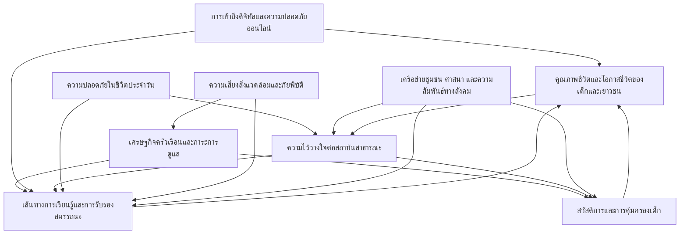

# รายงานอนาคตเด็กและเยาวชนไทย พ.ศ. 2590

## บทคัดย่อ

รายงานฉบับนี้จัดทำขึ้นเพื่อสนับสนุนการเตรียมพร้อมเชิงยุทธศาสตร์ต่ออนาคตของเด็กและเยาวชนในพื้นที่สามจังหวัดชายแดนภาคใต้ ไปถึง พ.ศ. 2590 โดยวางเด็กและเยาวชนเป็นศูนย์กลางของเรื่องเล่าและการตัดสินใจ ไม่ใช่เพียงผู้รับผลของการเปลี่ยนแปลงจากระบบอื่น ๆ รายงานใช้การสังเคราะห์ร่องรอยการเปลี่ยนแปลงที่กำลังก่อตัวอยู่ในชีวิตประจำวันให้กลายเป็นแผนที่ของสัญญาณ ปัจจัยขับเคลื่อน ความตึงเครียดของอนาคต และความไม่แน่นอนสำคัญ เพื่ออธิบายว่าเหตุใดโอกาสชีวิตจึงเปิดออกหรือปิดลงในทางปฏิบัติ โดยเฉพาะในกลุ่มเด็กกำพร้าและเด็กและเยาวชนกลุ่มเปราะบางที่มีความเสี่ยงสะสมสูง

รายงานฉบับนี้พัฒนาภาพอนาคตฐานและฉากทัศน์ทางเลือกสี่แบบโดยพิจารณาความไม่แน่นอนสำคัญ เพื่อทำให้เห็นความเสี่ยงและโอกาสภายใต้เงื่อนไขที่แตกต่างกัน พร้อมสังเคราะห์ภาพอนาคตที่พึงประสงค์เพื่อเป็นเข็มทิศสำหรับการออกแบบยุทธศาสตร์ที่จะพาเด็กและเยาวชนไปสู่อนาคตนั้น ในส่วนของยุทธศาสตร์ รายงานเสนอเส้นทางการเปลี่ยนผ่านที่ต้องทำงานประสานกันระหว่างการทำให้ระบบเดิมเข้าถึงได้จริง การทดลองเพื่อสร้างสะพานเชิงระบบ และการลงทุนระยะยาวเพื่อทำให้ระบบใหม่เป็นเรื่องปกติ โดยเน้นจุดคานงัดสำคัญ ได้แก่ การเชื่อมต่อเส้นทางการเรียนรู้และการรับรองสมรรถนะ การลดต้นทุนการเข้าถึงสวัสดิการและการคุ้มครอง ความไว้วางใจและพื้นที่ปลอดภัย และดิจิทัลที่เป็นทั้งโครงสร้างพื้นฐานและระบบคุ้มครองเด็ก เพื่อให้ยุทธศาสตร์ยังมีความหมายภายใต้ความไม่แน่นอนและสามารถนำไปปรับใช้ในบริบทพื้นที่ได้จริง

## Abstract

This report supports strategic preparedness for the futures of children and youth in Thailand’s Southern Border Provinces toward 2590 BE (2047 CE). It places children and youth, especially orphans and other vulnerable groups with accumulated risks, at the center of analysis and decision-making. The report synthesizes emerging changes in lived realities into an evidence-informed map of signals, drivers, system dynamics, future tensions, and critical uncertainties that shape whether life chances open or close in practice.

Building on these critical uncertainties, the report develops a baseline future and four alternative scenarios to explore plausible pathways under different systemic conditions, and articulates a desirable future as a shared compass. It then translates this desirable future into strategic pathways, leverage points, and a portfolio of actions designed for robustness under uncertainty. The proposed strategy emphasizes making access feasible in everyday life, strengthening the real connectivity of learning pathways and competency recognition, reducing the hidden costs of welfare and protection access, rebuilding trust through safe and credible delivery, and treating digital systems as both opportunity infrastructure and a protection environment for children and youth.

## คำสำคัญ

การคาดการณ์อนาคตเชิงยุทธศาสตร์, สามจังหวัดชายแดนภาคใต้, เด็กและเยาวชน, เด็กกำพร้า, สัญญาณและปัจจัยขับเคลื่อน, ฉากทัศน์, ยุทธศาสตร์, จุดคานงัด, ความไว้วางใจ, ดิจิทัลและความปลอดภัยออนไลน์

# บทที่ 1 บทนำ

## 1.1 ที่มาและความสำคัญ: วิสัยทัศน์ชีวิตเด็กและเยาวชนในพื้นที่ชายแดนใต้ พ.ศ. 2590

รายงานฉบับนี้มองไปถึง พ.ศ. 2590 ไม่ใช่เพื่อทำนายอนาคตของเด็กและเยาวชนในพื้นที่สามจังหวัดชายแดนภาคใต้ให้ตายตัว หากเพื่อชวนผู้อ่านเห็นว่าตั้งแต่วันนี้ไปจนถึงช่วงเวลาดังกล่าว เส้นทางชีวิตของเด็กคนหนึ่งสามารถแตกออกเป็นได้หลายแบบเพียงใด ภายใต้เงื่อนไขเชิงโครงสร้างที่กดทับอยู่แล้ว และแนวโน้มใหม่ที่กำลังก่อตัวขึ้น เด็กที่เติบโตในพื้นที่ซึ่งมีทั้งข้อจำกัดด้านเศรษฐกิจครัวเรือน การเข้าถึงการศึกษา การคุ้มครอง และความปลอดภัย อาจเดินไปสู่อนาคตที่โอกาสชีวิตเปิดกว้างขึ้น หรือกลับถูกบีบให้แคบลง ขึ้นอยู่กับว่าระบบรอบตัวจะเปลี่ยนไปในทิศทางใด

ภาพชีวิตที่รายงานนี้อยากเห็นใน พ.ศ. 2590 คือ เด็กและเยาวชนในพื้นที่ชายแดนใต้สามารถเติบโตในสภาพแวดล้อมที่ปลอดภัย พูดภาษาของตนเองได้อย่างเป็นธรรมชาติในโรงเรียนและหน่วยงานรัฐ ได้รับการดูแลปกป้องเมื่อเผชิญความเสี่ยง และมีช่องทางเรียนรู้ต่อเนื่องแม้ครัวเรือนมีข้อจำกัดด้านรายได้ เด็กที่สูญเสียพ่อแม่หรือเติบโตในครอบครัวที่เปราะบางมีผู้ใหญ่และระบบบริการที่รับรู้ความเป็นจริงของชีวิตเขา ไม่ปล่อยให้ต้องตัดสินใจลำพังในช่วงหัวเลี้ยวหัวต่อสำคัญของชีวิต เช่น การออกจากระบบการศึกษา การย้ายถิ่น หรือการเข้าสู่ตลาดแรงงานในเงื่อนไขที่ไม่มั่นคง รายงานจึงใช้การมองอนาคตระยะยาวเป็นเครื่องมือช่วยให้ผู้กำหนดนโยบายและผู้ปฏิบัติงานเห็นให้ชัดว่า หากปล่อยเงื่อนไขปัจจุบันดำเนินต่อไปโดยไม่ปรับเปลี่ยน เส้นทางชีวิตของเด็กจำนวนหนึ่งอาจถูกล็อกให้ติดอยู่กับวงจรความเปราะบางแบบใด และหากลงมือเปลี่ยนบางจุดตั้งแต่วันนี้ ภาพชีวิตที่ดีกว่าสำหรับเด็กในพื้นที่สามารถเกิดขึ้นจริงได้อย่างไร

การเลือกมองไปถึง พ.ศ. 2590 ยังช่วยให้เห็นผลสะสมของการตัดสินใจในวันนี้ต่อชีวิตของเด็กและเยาวชนรุ่นที่กำลังเติบโตและรุ่นถัดไป ตัวอย่างเช่น การลงทุนในโครงสร้างพื้นฐานการเรียนรู้และระบบการคุ้มครองในช่วงไม่กี่ปีข้างหน้าอาจกำหนดว่าภายในหลายทศวรรษข้างหน้า เด็กในพื้นที่จะมีความสามารถเพียงใดในการรับมือกับความเปลี่ยนแปลงทั้งทางเศรษฐกิจ เทคโนโลยี และสิ่งแวดล้อม ในทางกลับกัน หากปล่อยให้ช่องว่างการเข้าถึงบริการ การศึกษา และการคุ้มครองดำรงอยู่ต่อไป ภาพของปี 2590 อาจเป็นภาพที่เด็กจำนวนมากยังต้องแบกภาระของความไม่เท่าเทียมและความไม่ไว้วางใจต่อสถาบันสาธารณะ รายงานฉบับนี้จึงวางกรอบการมองอนาคตเพื่อช่วยให้ผู้เกี่ยวข้องออกแบบการตัดสินใจที่มีความทนทานต่อความไม่แน่นอน และยึดชีวิตจริงของเด็กและเยาวชนในพื้นที่ชายแดนใต้เป็นศูนย์กลาง

## 1.2 วัตถุประสงค์การศึกษา

รายงานฉบับนี้มีวัตถุประสงค์หลักเพื่อสนับสนุนการเตรียมพร้อมเชิงยุทธศาสตร์ต่ออนาคตของเด็กและเยาวชนในพื้นที่สามจังหวัดชายแดนภาคใต้ ภายใต้กรอบความไม่แน่นอนที่อาจส่งผลต่อเส้นทางชีวิตของเด็กในระยะยาว โดยมุ่งหมายเชื่อมโยงหลักฐานเชิงพื้นที่กับเครื่องมือการคาดการณ์อนาคตให้เป็นฐานสำหรับการออกแบบยุทธศาสตร์ในระดับพื้นที่และระดับนโยบาย วัตถุประสงค์เฉพาะประกอบด้วย

1. ทำความเข้าใจภาพรวมของแรงกดทับ เงื่อนไข และทรัพยากรที่กำหนดเส้นทางชีวิตของเด็กและเยาวชนในพื้นที่สามจังหวัดชายแดนภาคใต้ในมิติต่าง ๆ ทั้งด้านครัวเรือน เศรษฐกิจ การเรียนรู้ การคุ้มครอง ความปลอดภัย และความสัมพันธ์กับสถาบันสาธารณะ บนฐานข้อมูลและหลักฐานที่มีอยู่
2. วิเคราะห์แนวโน้ม ปัจจัยขับเคลื่อน และความไม่แน่นอนสำคัญที่อาจทำให้เส้นทางชีวิตของเด็กและเยาวชนในพื้นที่เปลี่ยนไปในทิศทางต่าง ๆ ภายใต้กรอบการคาดการณ์อนาคตเชิงยุทธศาสตร์ โดยเชื่อมโยงสัญญาณและหลักฐานจากหลายแหล่งข้อมูลเข้าด้วยกัน
3. สังเคราะห์ฉากทัศน์อนาคตที่เป็นไปได้หลายแบบสำหรับชีวิตเด็กและเยาวชนในพื้นที่สามจังหวัดชายแดนภาคใต้ พร้อมระบุภาพอนาคตฐาน ภาพอนาคตทางเลือก และภาพอนาคตที่พึงประสงค์ เพื่อใช้เป็นเข็มทิศร่วมในการวางยุทธศาสตร์และกำหนดลำดับความสำคัญของการดำเนินงาน
4. เสนอกรอบคิดและข้อพิจารณาเชิงยุทธศาสตร์สำหรับหน่วยงานที่เกี่ยวข้อง ทั้งในระดับพื้นที่และระดับชาติ ในการออกแบบมาตรการ นโยบาย และการลงทุนที่ช่วยเพิ่มความทนทานของชีวิตเด็กและเยาวชนต่อความไม่แน่นอน ลดความเปราะบางสะสม และเสริมสร้างความไว้วางใจต่อสถาบันสาธารณะ

## 1.3 กรอบการคาดการณ์อนาคตและกระบวนการศึกษา

รายงานฉบับนี้ใช้กรอบการคาดการณ์อนาคตเชิงยุทธศาสตร์เป็นเครื่องมือหลักในการทำความเข้าใจเส้นทางชีวิตของเด็กและเยาวชนในพื้นที่สามจังหวัดชายแดนภาคใต้ กรอบดังกล่าวมองอนาคตไม่ใช่ในฐานะจุดหมายปลายทางที่กำหนดไว้ล่วงหน้า แต่ในฐานะพื้นที่ของความเป็นไปได้หลายแบบที่ถูกกำหนดโดยแนวโน้ม ปัจจัยขับเคลื่อน และความไม่แน่นอนสำคัญ การคาดการณ์อนาคตจึงทำหน้าที่จัดระเบียบความรู้จากหลายแหล่งให้เห็นภาพรวมของระบบที่เด็กอาศัยอยู่จริง ตั้งแต่ระดับครัวเรือน ชุมชน โรงเรียน หน่วยบริการ ไปจนถึงนโยบายระดับประเทศ และเชื่อมโยงให้เห็นว่าสิ่งที่เกิดขึ้นในระบบเหล่านี้ส่งผลต่อชีวิตประจำวันของเด็กอย่างไร

กรอบการคาดการณ์อนาคตที่ใช้ในรายงานนี้ตั้งอยู่บนตรรกะสำคัญสี่ประการที่เกี่ยวข้องโดยตรงกับชีวิตเด็กและเยาวชนในพื้นที่ชายแดนใต้ ได้แก่ ความขัดแย้งและความไม่มั่นคง ความเปราะบางเชิงโครงสร้าง การเข้าถึงโอกาสและบริการ และความไว้วางใจต่อสถาบันสาธารณะ ความขัดแย้งและมาตรการด้านความปลอดภัยที่ดำเนินมาอย่างยาวนานมีผลต่อวิธีที่เด็กและครอบครัวตัดสินใจใช้หรือหลีกเลี่ยงบริการสาธารณะ เมื่อการเข้าถึงบริการด้านการศึกษา การสวัสดิการ หรือการคุ้มครองมีอุปสรรคทั้งด้านภาษา ขั้นตอน และความปลอดภัย ความเปราะบางของครัวเรือนและของเด็กแต่ละคนยิ่งสะสม และเมื่อประสบการณ์เช่นนี้เกิดซ้ำ ความไว้วางใจต่อสถาบันก็อาจถดถอย การวิเคราะห์เชิงอนาคตจึงต้องมองเห็นทั้งห่วงโซ่ของกลไกเหล่านี้และช่องทางที่สามารถเปลี่ยนทิศทางได้

กระบวนการศึกษาในรายงานนี้ผสานข้อมูลเชิงปริมาณ เอกสารเชิงนโยบาย และหลักฐานเชิงคุณภาพจากพื้นที่เข้าด้วยกันในรูปแบบของการกวาดสัญญาณ การจัดกลุ่มแนวโน้ม และการสังเคราะห์ปัจจัยขับเคลื่อนสำคัญ ขั้นแรก ทีมวิจัยรวบรวมสัญญาณจากแหล่งข้อมูลหลายประเภทที่เกี่ยวข้องกับชีวิตเด็กและเยาวชนในพื้นที่สามจังหวัดชายแดนภาคใต้ เช่น รายงานสถิติพื้นฐาน เอกสารเชิงนโยบาย การประเมินโครงการ และบันทึกการวิเคราะห์เชิงลึกเกี่ยวกับความเปราะบางของเด็กในบริบทความขัดแย้ง จากนั้นจึงจัดหมวดสัญญาณเหล่านี้ให้เชื่อมโยงกับประสบการณ์ชีวิตจริงของเด็กในมิติต่าง ๆ เช่น เส้นทางการเรียนรู้ สถานการณ์ครัวเรือน การเข้าถึงสวัสดิการและการคุ้มครอง ความปลอดภัย และการใช้ชีวิตในโลกดิจิทัล

ในขั้นถัดมา รายงานสังเคราะห์แนวโน้มและปัจจัยขับเคลื่อนที่มีผลต่อชีวิตเด็กและเยาวชน ให้เห็นว่าปัจจุบันระบบต่าง ๆ กำลังเคลื่อนไปในทิศทางใด และจุดใดที่เป็นคอขวดหรือจุดคานงัดของการเปลี่ยนแปลง จากนั้นจึงระบุความไม่แน่นอนสำคัญที่อาจทำให้เส้นทางชีวิตของเด็กแตกแขนงออกเป็นหลายแบบ เช่น ทิศทางของเศรษฐกิจในพื้นที่ ความเปลี่ยนแปลงของระบบการศึกษา รูปแบบการใช้เทคโนโลยีและสื่อออนไลน์ของเด็ก และพลวัตของความขัดแย้งและความปลอดภัย เมื่อได้ชุดของแนวโน้ม ปัจจัยขับเคลื่อน และความไม่แน่นอนแล้ว รายงานจึงพัฒนาฉากทัศน์อนาคตหลายแบบที่สะท้อนทิศทางต่าง ๆ ของระบบเหล่านี้ พร้อมทั้งกำหนดภาพอนาคตฐานและภาพอนาคตที่พึงประสงค์สำหรับชีวิตเด็กและเยาวชนในพื้นที่ชายแดนใต้

ตลอดกระบวนการดังกล่าว รายงานให้ความสำคัญกับการยึดโยงกับหลักฐานที่ตรวจสอบได้ และการระบุอย่างชัดเจนเมื่อข้อสรุปใดอยู่บนฐานการสังเคราะห์เชิงคุณภาพมากกว่าหลักฐานเชิงปริมาณ การใช้กรอบการคาดการณ์อนาคตเช่นนี้ทำให้ผู้อ่านเห็นทั้งโครงสร้างของระบบที่เด็กอาศัยอยู่ แนวโน้มที่กำลังเคลื่อน และทางเลือกเชิงยุทธศาสตร์ที่สามารถช่วยให้เด็กและเยาวชนในพื้นที่สามจังหวัดชายแดนภาคใต้เข้าใกล้ภาพอนาคตที่พึงประสงค์ได้มากขึ้นภายใต้ข้อจำกัดที่มีอยู่จริง

## 1.4 ขอบเขตการศึกษา: พื้นที่ คน เวลา และมิติการเปลี่ยนแปลง

รายงานนี้มุ่งสำรวจอนาคตของเด็กและเยาวชนในพื้นที่สามจังหวัดชายแดนภาคใต้ ได้แก่ ปัตตานี ยะลา และนราธิวาส โดยมองพื้นที่ดังกล่าวในฐานะระบบที่ชีวิตของเด็กผูกโยงกับหลายระดับพร้อมกัน ตั้งแต่ครัวเรือนและชุมชนไปจนถึงหน่วยบริการและนโยบายระดับชาติ การอธิบายบริบทเชิงพื้นที่จึงไม่ได้ทำหน้าที่เป็นเพียงฉากหลัง แต่ทำหน้าที่ระบุเงื่อนไขของความเป็นไปได้และข้อจำกัดที่ทำให้เส้นทางชีวิตของเด็กในพื้นที่นี้แตกต่างจากพื้นที่อื่นของประเทศ เช่น รูปแบบการปกครองท้องถิ่น ประวัติศาสตร์ความสัมพันธ์ระหว่างรัฐกับชุมชน มิติของศาสนา ภาษา และวัฒนธรรมที่ส่งผลต่อการใช้บริการสาธารณะ และโครงสร้างเศรษฐกิจในระดับครัวเรือนและระดับภูมิภาค

ในด้านกลุ่มเป้าหมาย รายงานให้ความสำคัญกับเด็กและเยาวชนในช่วงวัยที่กำลังพัฒนาและเปลี่ยนผ่าน โดยเน้นกลุ่มที่เผชิญความเสี่ยงสะสมสูงจากข้อจำกัดด้านครัวเรือน เศรษฐกิจ การเรียนรู้ การเข้าถึงสวัสดิการและการคุ้มครอง และสภาพแวดล้อมทางสังคม รายงานให้ความสนใจเป็นพิเศษต่อเด็กกำพร้าและเด็กที่เติบโตในครัวเรือนที่เปราะบาง ซึ่งมักต้องรับภาระเกินวัยหรือเผชิญการเปลี่ยนแปลงซ้ำซ้อนในครัวเรือน เช่น การสูญเสียผู้ดูแลหลัก การย้ายถิ่น หรือการเปลี่ยนแปลงรายได้อย่างกะทันหัน การมองกลุ่มเป้าหมายในลักษณะนี้ช่วยให้การวิเคราะห์ฉากทัศน์และข้อเสนอเชิงยุทธศาสตร์ไม่หลุดจากชีวิตจริงของเด็กที่นโยบายต้องการสนับสนุน

ในมิติของเวลา รายงานใช้ พ.ศ. 2590 เป็นกรอบหลักในการมองผลสะสมของแนวโน้มและการตัดสินใจ โดยเชื่อมโยงมุมมองระยะสั้นและระยะกลางเข้ากับเป้าหมายระยะยาว เช่น การพิจารณาว่าการลงทุนด้านการเรียนรู้ การคุ้มครอง และการพัฒนาเศรษฐกิจในช่วงหนึ่งถึงสองทศวรรษข้างหน้าจะส่งผลต่อชีวิตของเด็กที่กำลังเติบโตในวันนี้อย่างไร และช่วงเวลาใดเป็นช่วงเปลี่ยนผ่านสำคัญที่จำเป็นต้องให้ความสนใจเป็นพิเศษ ทั้งในแง่ของนโยบาย ความต่อเนื่องของโครงการ และความสามารถของหน่วยงานในพื้นที่ในการปรับตัวต่อสถานการณ์ที่เปลี่ยนไป

สำหรับมิติการเปลี่ยนแปลง รายงานใช้กรอบที่ครอบคลุมทั้งปัจจัยด้านสังคม เทคโนโลยี เศรษฐกิจ สิ่งแวดล้อม การเมือง และคุณค่า เพื่อสำรวจว่าระบบต่าง ๆ ที่ห่อหุ้มชีวิตเด็กกำลังเคลื่อนไปอย่างไร ในขณะเดียวกัน รายงานให้ความสำคัญเป็นพิเศษกับมิติที่เป็นเงื่อนไขร่วมของทุกสาขา ได้แก่ ความเสี่ยงและความปลอดภัยในชีวิตประจำวัน และความไว้วางใจต่อสถาบันสาธารณะ ซึ่งมีผลโดยตรงต่อทั้งความต่อเนื่องของการเรียนรู้และการใช้สิทธิ์ของเด็ก การจัดวางขอบเขตในลักษณะนี้ทำให้บทต่อ ๆ ไปของรายงานสามารถเชื่อมโยงสัญญาณ แนวโน้ม และฉากทัศน์กับชีวิตจริงของเด็กและเยาวชนในพื้นที่สามจังหวัดชายแดนภาคใต้ได้อย่างเป็นระบบ

# บทที่ 2 สัญญาณชีวิตเด็กและเยาวชนไทย

บทที่ 2 ใช้ฐานหลักฐานที่สะสมจากพื้นที่สามจังหวัดชายแดนภาคใต้ เพื่อทำให้เห็นอย่างเป็นระบบว่าเงื่อนไขต่าง ๆ ในชีวิตประจำวันของเด็กและเยาวชนเชื่อมโยงกันอย่างไร ไม่ว่าจะเป็นเศรษฐกิจครัวเรือน เส้นทางการเรียนรู้ การเข้าถึงสวัสดิการและการคุ้มครอง ความปลอดภัยและความไว้วางใจต่อสถาบันสาธารณะ ตลอดจนบทบาทของโลกดิจิทัลและความเสี่ยงสิ่งแวดล้อม บทนี้จึงไม่ได้มองสัญญาณเป็นเหตุการณ์แยกส่วน หากมองสัญญาณในฐานะร่องรอยของวงจรที่ทำให้โอกาสของเด็กบางกลุ่มขยายออก ขณะที่โอกาสของอีกหลายกลุ่มค่อย ๆ ถูกบีบแคบลง

เนื้อหาในบทที่ 2 จะจัดระเบียบสัญญาณและปัจจัยขับเคลื่อนเป็นกลุ่ม ๆ เพื่อช่วยให้ผู้อ่านเห็นว่าความเปลี่ยนแปลงที่ดูไม่เกี่ยวกัน เช่น ความตึงเครียดด้านความมั่นคง ต้นทุนการครองชีพ การแยกส่วนของเส้นทางการเรียนรู้ หรือช่องว่างดิจิทัล กลับมาบรรจบกันที่ผลลัพธ์เดียวกันคือความเปราะบางของเด็กและเยาวชนในพื้นที่ บทนี้ยังใช้กรอบผังระบบและการอ่านวงจรป้อนกลับเพื่อชี้ให้เห็นคอขวดและจุดคานงัดที่ถ้าจัดการได้ดี จะช่วยให้มาตรการด้านการศึกษา สวัสดิการ การคุ้มครอง และการสร้างโอกาสทางอาชีพทำงานสอดรับกันมากขึ้น

เมื่ออ่านครบทั้งบท ผู้อ่านควรเห็นภาพรวมของสัญญาณที่สำคัญ แนวโน้มชีวิตของเด็กกลุ่มเป้าหมาย เหตุไม่คาดฝัน และสัญญาณอ่อนที่เริ่มปรากฏ รวมถึงความไม่แน่นอนสำคัญที่กำหนดทิศทางของอนาคตส่วนที่เหลือของรายงาน โดยเฉพาะบทที่ 3 จะนำความตึงเครียดและความไม่แน่นอนเหล่านี้ไปแปลงเป็นภาพอนาคตฐานและฉากทัศน์หลายแบบ ดังนั้น บทที่ 2 จึงทำหน้าที่เป็นสะพานเชื่อมระหว่างภาพสถานการณ์ปัจจุบันกับภาพอนาคตที่ใช้สำหรับคิดเชิงยุทธศาสตร์ในระยะถัดไป

## 2.1 การกวาดสัญญาณ

### 2.1.1 วิธีการกวาดสัญญาณและแหล่งข้อมูล

การกวาดสัญญาณในรายงานฉบับนี้ตั้งอยู่บนการดึงหลักฐานจากหลายประเภทของแหล่งข้อมูลที่เกี่ยวข้องกับชีวิตเด็กและเยาวชนในพื้นที่สามจังหวัดชายแดนภาคใต้เป็นหลัก แหล่งข้อมูลเชิงปริมาณประกอบด้วยสถิติระดับประเทศและระดับจังหวัด เช่น ชุดสำรวจตัวชี้วัดหลายมิติของเด็กและสตรี (MICS) ข้อมูลการออกกลางคันและผลสัมฤทธิ์ทางการเรียนจากหน่วยงานด้านการศึกษา และข้อมูลการเข้าถึงบริการสังคมและสวัสดิการจากหน่วยงานที่เกี่ยวข้อง เพื่อนำมาอ่านเป็นเส้นแนวโน้มของโภชนาการ การเรียนรู้ การเข้าถึงบริการ และสถานะการมีงานทำของเยาวชนเปรียบเทียบกับค่าเฉลี่ยระดับประเทศ

แหล่งข้อมูลเชิงคุณภาพมาจากการทบทวนเอกสารการวิจัยและรายงานนโยบายที่เกี่ยวข้องกับความขัดแย้ง อัตลักษณ์ และความเปราะบางของเยาวชนในพื้นที่ การสัมภาษณ์เชิงลึกและการสนทนากลุ่มย่อยกับเด็ก เยาวชน ผู้ปกครอง ผู้นำชุมชน และเจ้าหน้าที่ด่านหน้า รวมถึงบันทึกภาคสนามจากการทำงานโครงการในพื้นที่ ข้อมูลเหล่านี้ช่วยเติมเสียงของผู้มีประสบการณ์ตรง ทำให้เห็นกลไกที่ตัวเลขเพียงอย่างเดียวไม่สามารถอธิบายได้ เช่น เหตุผลที่ครัวเรือนหลีกเลี่ยงบางหน่วยบริการ แม้จะมีสิทธิ์ตามกฎหมาย หรือวิธีที่เด็กปรับตัวต่อข้อจำกัดด้านความปลอดภัยและภาษาในชีวิตประจำวัน

นอกจากนั้น การกวาดสัญญาณยังอ้างอิงบทวิเคราะห์ภายในที่สังเคราะห์ข้อมูลจากหลายแหล่งเข้าด้วยกัน โดยใช้กรอบคิดด้านความขัดแย้ง ความเปราะบาง และความไว้วางใจต่อสถาบัน เพื่อจัดหมวดสัญญาณตามมิติหลักของชีวิตเด็กและเยาวชน เช่น เศรษฐกิจครัวเรือน เส้นทางการเรียนรู้ สวัสดิการและการคุ้มครอง และความสัมพันธ์รัฐ–ชุมชน วิธีการนี้มีข้อจำกัดสำคัญที่ต้องระลึกไว้คือ (1) ข้อมูลเชิงปริมาณจำนวนมากเป็นค่าเฉลี่ยระดับจังหวัดหรือระดับประเทศที่อาจไม่สะท้อนความแตกต่างภายในพื้นที่ย่อย (2) ข้อมูลเชิงคุณภาพบางส่วนมาจากกลุ่มที่เข้าถึงได้ง่ายกว่ากลุ่มที่เปราะบางที่สุด และ (3) ข้อมูลเกี่ยวกับประสบการณ์ของเด็กในโลกดิจิทัลและผลกระทบจากสภาพภูมิอากาศยังมีไม่ครบถ้วน ในการตีความสัญญาณและแนวโน้มต่อจากนี้ จึงให้ความสำคัญกับการอ่านแนวโน้มและกลไกมากกว่าการใช้ตัวเลขเพียงจุดเดียวเป็นข้อสรุป

### 2.1.2 แนวโน้มตลอดช่วงชีวิตและรูปแบบความเปราะบาง

ยิ่งมองชีวิตของเด็กและเยาวชนในพื้นที่จังหวัดชายแดนภาคใต้ในระยะยาว เราจะยิ่งเห็นว่าโอกาสและข้อจำกัดไม่ได้เกิดขึ้นแบบฉับพลัน แต่ค่อย ๆ สะสมตัวตามช่วงชีวิต ตั้งแต่วัยเด็กเล็ก วัยเรียน วัยเปลี่ยนผ่านเข้าสู่วัยทำงาน ไปจนถึงช่วงที่ต้องรับผิดชอบครอบครัวของตนเอง ภาพรวมแนวโน้มตลอดช่วงชีวิตจึงเป็นพื้นสำคัญในการทำความเข้าใจว่าความเปราะบางแบบใดกำลังกดทับเด็กกลุ่มเป้าหมาย และมีจุดใดที่สามารถเปิดทางเลือกใหม่ให้พวกเขาได้

#### โครงสร้างชีวิตประจำวันในวันนี้

สำหรับเด็กจำนวนมากในพื้นที่เป้าหมาย ชีวิตประจำวันผูกกับสามพื้นที่หลักคือ บ้าน โรงเรียน หรือสถาบันการศึกษาอื่น และพื้นที่ชุมชนรอบตัว เช่น มัสยิด สนามกีฬา หรือศูนย์เยาวชน ในบางกรณี เด็กต้องแบ่งเวลาไประหว่างการเรียนและการช่วยงานในครัวเรือนหรือธุรกิจขนาดเล็กของครอบครัว รายได้ของบ้านที่ไม่มั่นคงทำให้เด็กบางคนต้องให้ความสำคัญกับการทำงานหรือดูแลสมาชิกครอบครัว มากกว่าการเรียนอย่างต่อเนื่อง

ในโรงเรียนหรือสถาบันการศึกษา เด็กจำนวนหนึ่งยังเผชิญกับข้อจำกัดด้านภาษา วัฒนธรรม และหลักสูตรที่ไม่สอดคล้องกับบริบทชีวิตจริง การเรียนรู้จึงอาจรู้สึกห่างไกลจากโอกาสในอนาคต โดยเฉพาะเมื่อช่องทางเชื่อมต่อระหว่างการเรียนกับเส้นทางอาชีพยังไม่ชัดเจน ในขณะเดียวกัน เด็กและเยาวชนใช้เวลามากขึ้นในโลกดิจิทัล ทั้งเพื่อความบันเทิง การสื่อสาร และการเรียนรู้ด้วยตนเอง แต่ความสามารถในการใช้ประโยชน์จากเทคโนโลยีอย่างปลอดภัยและสร้างสรรค์ยังไม่เท่ากันในแต่ละครอบครัว

#### โครงสร้างครอบครัว เศรษฐกิจครัวเรือน และเครือข่ายชุมชน

รูปแบบครอบครัวและฐานะเศรษฐกิจครัวเรือนมีผลโดยตรงต่อโอกาสการเรียนรู้และความปลอดภัยของเด็ก หากรายได้ของบ้านไม่แน่นอน หรือผู้ใหญ่ในบ้านต้องทำงานนอกพื้นที่เป็นเวลานาน เด็กอาจต้องรับภาระดูแลน้องหรือผู้สูงอายุ ส่งผลให้เวลาและพลังสำหรับการเรียนลดลง นอกจากนี้ ภาระหนี้สินและต้นทุนการเดินทางไปสถานศึกษาในบางพื้นที่ยังเป็นปัจจัยที่ทำให้การเข้าเรียนสม่ำเสมอเป็นเรื่องท้าทาย

ในอีกด้านหนึ่ง เครือข่ายชุมชน สถาบันศาสนา และองค์กรท้องถิ่นสามารถเป็นกันชนสำคัญต่อความเสี่ยงของเด็กได้ เมื่อมีพื้นที่ที่ปลอดภัยและน่าเชื่อถือสำหรับการทำกิจกรรม การเรียนรู้ และการขอความช่วยเหลือ เด็กจะมีโอกาสสร้างความสัมพันธ์ที่เกื้อหนุนและเข้าถึงทรัพยากรใหม่ ๆ อย่างไรก็ตาม ความเข้มแข็งของเครือข่ายเหล่านี้ไม่เท่ากันในทุกชุมชน และมักได้รับผลกระทบจากสถานการณ์ความมั่นคงและความขัดแย้งในพื้นที่

#### สัญญาณเชิงโครงสร้างที่สะท้อนการเปลี่ยนแปลงระยะยาว

เมื่อมองข้ามช่วงเวลาสั้น ๆ จะเห็นสัญญาณเชิงโครงสร้างหลายประการที่กำลังเปลี่ยนแปลงเส้นทางชีวิตของเด็กและเยาวชน

ประการแรก การเข้าถึงการศึกษาที่มีคุณภาพยังไม่เท่าเทียม ทั้งในมิติพื้นที่ เมือง–ชนบท และกลุ่มภาษา เด็กบางกลุ่มมีทางเลือกระหว่างโรงเรียนของรัฐ โรงเรียนเอกชนสอนศาสนา และสถาบันการศึกษาทางเลือก แต่แต่ละทางเลือกมีข้อจำกัดและเงื่อนไขต่างกัน การเลือกเส้นทางใดเส้นทางหนึ่งจึงอาจหมายถึงการเปิดโอกาสบางอย่างพร้อมกับปิดโอกาสอีกหลายด้านในอนาคต

ประการที่สอง เศรษฐกิจท้องถิ่นกำลังเผชิญแรงกดดันจากทั้งปัจจัยภายในประเทศและแนวโน้มระดับโลก เช่น การเปลี่ยนแปลงของตลาดแรงงานและเทคโนโลยี ทำให้งานที่ใช้แรงงานทักษะต่ำมีความไม่มั่นคงสูงขึ้น เด็กที่เติบโตในครอบครัวที่พึ่งพารายได้รูปแบบนี้จึงเสี่ยงที่จะเข้าสู่ตลาดแรงงานในเงื่อนไขที่ไม่มั่นคงเช่นเดียวกัน หากไม่สามารถเข้าถึงการพัฒนาทักษะใหม่ ๆ ได้ทันเวลา

ประการที่สาม สถานการณ์ความไม่มั่นคงและเหตุการณ์ความรุนแรงที่เกิดขึ้นเป็นระยะ ส่งผลต่อความรู้สึกปลอดภัยในการเดินทางไปโรงเรียน การทำกิจกรรมในพื้นที่สาธารณะ และการติดต่อกับสถาบันของรัฐ เด็กที่เติบโตท่ามกลางบรรยากาศเช่นนี้อาจเรียนรู้จากประสบการณ์ของครอบครัวและชุมชนว่า การหลีกเลี่ยงพื้นที่หรือบริการบางประเภทเป็นวิธีรักษาความปลอดภัยของตนเอง แม้จะต้องแลกกับการเข้าถึงโอกาสบางอย่าง

#### แนวโน้มที่ส่งผลต่อการเปลี่ยนแปลงของชีวิตเด็กและเยาวชน

ปัจจัยขับเคลื่อนจากระบบเศรษฐกิจ การเมือง และสิ่งแวดล้อมทำงานร่วมกันอย่างซับซ้อนในการเปลี่ยนแปลงชีวิตเด็กในพื้นที่เป้าหมาย ด้านเศรษฐกิจ การเปลี่ยนแปลงรูปแบบการจ้างงาน การขยายตัวของงานแพลตฟอร์ม และความผันผวนของรายได้ภาคเกษตรและบริการ ทำให้เส้นทางจากโรงเรียนไปสู่งานที่มั่นคงไม่ชัดเจนเท่าเดิม เด็กจำนวนหนึ่งจึงต้องเริ่มทำงานก่อนเรียนจบ หรือสลับระหว่างการเรียนและการทำงานอย่างต่อเนื่อง

ด้านการเมืองและความมั่นคง มาตรการรักษาความปลอดภัยที่เข้มงวดอาจช่วยลดความเสี่ยงด้านหนึ่ง แต่ในอีกด้านหนึ่งก็อาจเพิ่มภาระทางอารมณ์และความรู้สึกระแวงในชีวิตประจำวันของเด็กและครอบครัว หากการติดต่อกับหน่วยงานรัฐเต็มไปด้วยขั้นตอนที่ซับซ้อนหรือไม่สอดคล้องกับภาษาและวัฒนธรรมในพื้นที่ เด็กและผู้ปกครองอาจเลือกหลีกเลี่ยงบริการบางอย่าง ส่งผลให้สิทธิด้านการศึกษา สวัสดิการ หรือการคุ้มครองไม่ได้ถูกใช้เต็มที่

ด้านสิ่งแวดล้อมและภัยพิบัติ แนวโน้มเหตุการณ์ฝนตกหนัก น้ำท่วมฉับพลัน หรือภัยแล้งที่รุนแรงขึ้นในบางช่วงปี ส่งผลโดยตรงต่อความเป็นอยู่ของครัวเรือนและโครงสร้างพื้นฐานในชุมชน เมื่อบ้านเรือน โรงเรียน หรือเส้นทางคมนาคมได้รับผลกระทบ เด็กจะเผชิญทั้งความเสี่ยงทางกายภาพและการหยุดชะงักของการเรียนรู้ ซึ่งหากเกิดซ้ำ ๆ จะสะสมเป็นช่องว่างระหว่างเด็กที่สามารถกลับเข้าเส้นทางการเรียนได้กับเด็กที่หลุดออกจากระบบ

#### รูปแบบความเปราะบางและเส้นทางโอกาสชีวิต

เมื่อพิจารณาแนวโน้มทั้งหมดร่วมกัน จะเห็นรูปแบบความเปราะบางที่แตกต่างกันไปตามจุดตั้งต้นของเด็ก ตัวอย่างเช่น เด็กในครอบครัวที่มีรายได้ไม่แน่นอนและต้องช่วยงานบ้านตั้งแต่วัยเรียนมักมีโอกาสน้อยลงในการเข้าร่วมกิจกรรมเสริมทักษะหรือเตรียมตัวสอบต่อ เด็กที่เติบโตในชุมชนที่เผชิญเหตุความรุนแรงบ่อยครั้งอาจมีประสบการณ์ตรงหรือทางอ้อมกับเหตุการณ์ที่กระทบต่อความรู้สึกปลอดภัย ทำให้ความไว้วางใจต่อสถาบันรัฐและบริการสาธารณะสั่นคลอน

ในทางกลับกัน เด็กบางคนแม้อยู่ในบริบทที่มีความเสี่ยงสูง แต่หากมีโรงเรียนหรือศูนย์เยาวชนที่เข้าใจบริบทพื้นที่ มีครูแกนนำหรือผู้ใหญ่ที่เด็กไว้วางใจ และมีช่องทางเชื่อมต่อกับโอกาสการเรียนรู้ใหม่ ๆ เช่น หลักสูตรทักษะดิจิทัลหรือกิจกรรมพัฒนาทักษะอาชีพ เด็กกลุ่มนี้อาจสามารถสร้างเส้นทางชีวิตที่เปิดทางเลือกมากขึ้น แม้จะยังต้องเผชิญข้อจำกัดด้านโครงสร้างอยู่

#### สะพานตรรกะระหว่างความขัดแย้ง อัตลักษณ์ การเข้าถึง และความไว้วางใจ

ความขัดแย้งยืดเยื้อและมาตรการรักษาความปลอดภัยที่เข้มงวดไม่ได้ส่งผลต่อชีวิตเด็กเพียงผ่านเหตุการณ์ที่มองเห็นได้ชัดเจนเท่านั้น แต่ยังแทรกอยู่ในความสัมพันธ์ระหว่างเด็ก ครอบครัว ชุมชน และสถาบันรัฐในทุกวัน ตัวอย่างเช่น เมื่อเด็กหรือผู้ปกครองรู้สึกว่าการไปติดต่อหน่วยงานสาธารณะต้องเผชิญกับการตรวจสอบมากกว่าความช่วยเหลือ พวกเขาอาจเลือกไม่ใช้บริการบางอย่าง แม้จะมีสิทธิ์ตามกฎหมายก็ตาม

ในบริบทที่ภาษาและอัตลักษณ์ทางศาสนามีความสำคัญ การที่สถาบันการศึกษาและหน่วยงานรัฐไม่สามารถสื่อสารอย่างเคารพและเข้าใจในความแตกต่าง อาจทำให้เด็กและครอบครัวรู้สึกว่าตนเองไม่ถูกรับฟังหรือไม่ได้รับการปฏิบัติอย่างเท่าเทียม ความรู้สึกนี้สะสมเป็นความไม่ไว้วางใจ ซึ่งส่งผลย้อนกลับต่อการใช้บริการด้านการศึกษา สวัสดิการ และการคุ้มครองต่าง ๆ แม้หน่วยงานจะพยายามขยายโครงการหรือโอกาสใหม่ ๆ ก็ตาม

ดังนั้น เส้นทางชีวิตของเด็กและเยาวชนในพื้นที่จังหวัดชายแดนภาคใต้จึงไม่ได้ถูกกำหนดโดยปัจจัยด้านการศึกษา เศรษฐกิจ หรือความมั่นคงเพียงด้านใดด้านหนึ่ง หากแต่เป็นผลรวมของประสบการณ์เล็ก ๆ ในแต่ละวัน ความสัมพันธ์กับครอบครัวและชุมชน การรับรู้ต่อความยุติธรรม และระดับความไว้วางใจต่อสถาบันรอบตัว แนวโน้มเหล่านี้คือฐานสำคัญสำหรับการอ่านสัญญาณในส่วนถัดไปของบท และสำหรับการออกแบบฉากทัศน์อนาคตในบทที่ 3 ที่สะท้อนทั้งโอกาสและความเสี่ยงของเด็กกลุ่มเป้าหมายอย่างสมจริง

### 2.1.3 เหตุไม่คาดฝัน

เหตุไม่คาดฝันในบริบทสามจังหวัดชายแดนภาคใต้หมายถึงเหตุการณ์ที่มีโอกาสเกิดขึ้นต่ำตามสถิติในอดีต แต่หากเกิดขึ้นจะสร้างผลกระทบที่รุนแรงและยืดเยื้อต่อชีวิตเด็กและเยาวชนในระดับที่ระบบปัจจุบันรองรับได้จำกัด หนึ่งในเหตุการณ์ที่ต้องให้ความสนใจเป็นพิเศษคือภัยพิบัติทางธรรมชาติขนาดใหญ่ที่เกินกว่าขีดความสามารถของระบบบริหารจัดการสาธารณภัยในปัจจุบัน โดยเฉพาะน้ำท่วมใหญ่ที่มีความถี่และความรุนแรงสูงกว่าที่เคยเผชิญมาก่อนจากผลของวิกฤตสภาพภูมิอากาศ

หากเกิดอุทกภัยครั้งใหญ่ในระดับที่ทำให้ระบบเมืองหยุดชะงักชั่วคราว ความเสียหายทางตรงจะกระทบโครงสร้างพื้นฐาน บ้านเรือน โรงเรียน สถานบริการสุขภาพ และเส้นทางคมนาคม ส่งผลให้การอพยพ การเข้าถึงการรักษาพยาบาล และการจัดการด้านอาหารและน้ำดื่มทำได้ยาก เด็กเล็ก เด็กที่มีข้อจำกัดด้านการเคลื่อนไหว และผู้ป่วยติดเตียงจะอยู่ในกลุ่มเสี่ยงสูงสุดต่อการบาดเจ็บ การสูญเสีย และผลกระทบต่อสุขภาพในระยะยาว

ผลกระทบทางอ้อมที่ตามมาหลังน้ำลดมีแนวโน้มรุนแรงยิ่งกว่า ภัยพิบัติขนาดใหญ่ที่คร่าชีวิตผู้ใหญ่ในครัวเรือนจำนวนมากอาจทำให้จำนวนเด็กกำพร้าและเด็กที่ต้องพึ่งพาระบบช่วยเหลือจากรัฐและชุมชนเพิ่มขึ้นอย่างรวดเร็ว ในขณะที่ทรัพยากรบุคลากรและงบประมาณในพื้นที่ถูกใช้ไปกับการฟื้นฟูโครงสร้างพื้นฐานและการให้ความช่วยเหลือเร่งด่วน เด็กจำนวนมากอาจเข้าไม่ถึงการสนับสนุนที่ต่อเนื่อง ทั้งในด้านการศึกษา การคุ้มครอง และสุขภาพกายใจ

เมื่อโรงเรียนหรือศูนย์การเรียนรู้ได้รับความเสียหายและต้องปิดทำการเป็นเวลานาน การเรียนรู้ของเด็กจะหยุดชะงัก และบางส่วนอาจหลุดออกจากระบบการศึกษาอย่างถาวร โดยเฉพาะในครัวเรือนที่ต้องดึงแรงงานเด็กมาช่วยหารายได้หรือฟื้นฟูทรัพย์สินที่สูญเสียไป การสูญหายของเอกสารราชการสำคัญจากภัยพิบัติยังซ้ำเติมปัญหาสถานะทางทะเบียนและสิทธิการเข้าถึงสวัสดิการของเด็กกลุ่มหนึ่ง ทำให้การเยียวยาไม่ทั่วถึงและเกิดความรู้สึกไม่เป็นธรรมในระยะยาว

ในมิติสุขภาพและสุขภาวะจิตใจ สภาพแวดล้อมหลังภัยพิบัติที่เต็มไปด้วยน้ำปนเปื้อน ฝุ่นโคลน และขยะติดเชื้อเพิ่มความเสี่ยงของโรคติดเชื้อทางเดินหายใจและทางเดินอาหาร ภาวะทุโภชนาการอาจทวีความรุนแรงจากการขาดแคลนอาหารและราคาสินค้าที่สูงขึ้น เด็กที่อยู่ในครอบครัวยากจนจึงเสี่ยงต่อภาวะแคระแกร็นและพัฒนาการหยุดชะงัก ขณะเดียวกัน ประสบการณ์การสูญเสียบุคคลอันเป็นที่รักและการเผชิญเหตุการณ์รุนแรงอย่างกะทันหันสร้างบาดแผลทางใจที่หากไม่ได้รับการเยียวยาอย่างเพียงพออาจส่งผลต่อความไว้วางใจต่อสถาบันและความรู้สึกปลอดภัยในระยะยาว

เหตุไม่คาดฝันลักษณะนี้จึงไม่ใช่เพียงความเสี่ยงเฉพาะเหตุการณ์ แต่เป็นตัวเร่งที่อาจพลิกเส้นทางชีวิตของเด็กจำนวนมากและทดสอบความทนทานของทุกระบบที่รายงานนี้ให้ความสนใจ ทั้งระบบการเรียนรู้ ระบบสวัสดิการและการคุ้มครอง ระบบเศรษฐกิจครัวเรือน และระบบความไว้วางใจ หากไม่มีการเตรียมพร้อมเชิงโครงสร้าง ความเสียหายจากเหตุไม่คาดฝันอาจกลายเป็นจุดเริ่มต้นของวงจรความเปราะบางรุ่นใหม่ที่ยืดเยื้อไปอีกหลายทศวรรษ

### 2.1.4 สัญญาณอ่อน

สัญญาณอ่อนคือร่องรอยเล็ก ๆ ของการเปลี่ยนแปลงที่ยังไม่แพร่หลายหรือยังไม่ชัดเจนพอจะกลายเป็นแนวโน้ม แต่หากได้รับแรงเสริมจากปัจจัยเชิงโครงสร้างหรือเหตุไม่คาดฝันอาจกลายเป็นตัวกำหนดทิศทางของอนาคตได้ สัญญาณอ่อนในบริบทสามจังหวัดชายแดนภาคใต้เกี่ยวข้องทั้งกับภูมิรัฐศาสตร์ การจัดการศึกษาในระดับท้องถิ่น รูปแบบการมีส่วนร่วมทางการเมืองของคนรุ่นใหม่ และการสร้างพื้นที่เรียนรู้ทางเลือกของชุมชน

ในระดับภูมิรัฐศาสตร์ การเปลี่ยนแปลงความสัมพันธ์ระหว่างโลกมุสลิมกับขั้วอำนาจหลัก และความตึงเครียดในภูมิภาคอื่น ๆ อาจส่งผลต่อการรับรู้ความเป็นธรรม ความรู้สึกเป็นส่วนหนึ่งของชาติ และการกำหนดนโยบายด้านความมั่นคงและการศึกษาในพื้นที่ชายแดนใต้ แม้สัญญาณเหล่านี้จะดูห่างไกลจากชีวิตประจำวันของเด็ก แต่การแปลนัยของเหตุการณ์ระดับภูมิภาคมาสู่การจัดวางกติกาในพื้นที่มีผลโดยตรงต่อประสบการณ์ของเด็กในโรงเรียนและในระบบบริการสาธารณะ

ในระดับพื้นที่ สัญญาณอ่อนที่สำคัญชุดหนึ่งคือการขยายตัวของศูนย์การเรียนรู้ของชุมชนและรูปแบบการจัดการศึกษาทางเลือกที่มีฐานในวัฒนธรรมและศาสนา โดยอาศัยกรอบกฎหมายที่เปิดช่องให้ท้องถิ่นหรือภาคประชาสังคมมีบทบาทมากขึ้น หากสามารถทำให้ศูนย์การเรียนเหล่านี้เชื่อมต่อกับระบบการรับรองสมรรถนะและการเทียบโอนอย่างเป็นทางการได้ พวกมันอาจกลายเป็นสะพานสำคัญที่ช่วยให้เด็กกลุ่มเปราะบาง โดยเฉพาะเด็กกำพร้าและเด็กที่มีภาระชีวิตสูง อยู่ในเส้นทางการเรียนรู้ได้ต่อเนื่องมากขึ้น

อีกชุดหนึ่งของสัญญาณอ่อนคือการที่คนรุ่นใหม่เริ่มลงเล่นการเมืองท้องถิ่นมากขึ้น ทั้งในระดับองค์กรปกครองส่วนท้องถิ่นและพื้นที่การมีส่วนร่วมรูปแบบใหม่ การมีตัวแทนรุ่นใหม่ที่เข้าใจชีวิตของเด็กและเยาวชนในพื้นที่อย่างใกล้ชิดอาจเปิดโอกาสให้เสียงของเด็กและครอบครัวเปราะบางถูกนำเข้าสู่วาระการตัดสินใจเชิงนโยบายมากขึ้น แม้ผลลัพธ์ยังไม่ชัดเจน แต่การเปลี่ยนแปลงเช่นนี้อาจค่อย ๆ ปรับสมดุลของโครงสร้างอำนาจในระยะยาว

โดยรวม สัญญาณอ่อนเหล่านี้ชี้ให้เห็นว่าอนาคตของเด็กและเยาวชนในพื้นที่สามจังหวัดชายแดนภาคใต้ไม่ได้ถูกกำหนดโดยแนวโน้มเชิงโครงสร้างเพียงด้านเดียว หากยังเปิดกว้างต่อความเป็นไปได้ใหม่ ๆ ที่เกิดจากการจัดการศึกษาในระดับพื้นที่ การมีส่วนร่วมของคนรุ่นใหม่ และการเปลี่ยนแปลงของบริบทภูมิรัฐศาสตร์ การเฝ้าติดตามและทำความเข้าใจสัญญาณอ่อนอย่างเป็นระบบจึงเป็นส่วนสำคัญของการเตรียมพร้อมเชิงยุทธศาสตร์

## 2.2 ผังระบบและวงจรป้อนกลับ

### 2.2.1 ผังระบบและผลลัพธ์ศูนย์กลาง

ผังระบบในบทนี้ถูกใช้เพื่อทำให้ผู้อ่านเห็นว่า ปัจจัยที่ดูเหมือนแยกส่วนกันในชีวิตประจำวันของเด็กและเยาวชนเชื่อมกันอย่างไร และเหตุใดการแก้ปัญหาแบบเส้นตรงจึงมักไม่เพียงพอ ผังระบบที่ดีไม่ได้มีเป้าหมายเพื่อใส่ทุกปัจจัยให้ครบ แต่มีเป้าหมายเพื่อทำให้เห็นผลลัพธ์ศูนย์กลาง วงจรป้อนกลับ คอขวด และจุดคานงัดที่มีความหมายต่อการตัดสินใจเชิงยุทธศาสตร์ ในรายงานนี้ ผลลัพธ์ศูนย์กลางถูกนิยามเป็นคุณภาพชีวิตและโอกาสชีวิตของเด็กและเยาวชน และผังระบบถูกรีเซ็นเตอร์ให้เริ่มจากผลลัพธ์ดังกล่าว ไม่ใช่เริ่มจากเหตุการณ์ความรุนแรง

แผนภาพด้านล่างเป็นผังระบบแบบย่อเพื่อช่วยให้เห็นความสัมพันธ์หลักระหว่างระบบครัวเรือน ระบบการเรียนรู้ ระบบสวัสดิการและการคุ้มครอง ระบบความไว้วางใจ และระบบดิจิทัล โดยยังคงให้ความปลอดภัยในชีวิตประจำวันเป็นบริบทที่กำหนดต้นทุนของการเข้าถึงและการลงมือทำ

เมื่ออ่านผังระบบในเชิงพลวัต วงจรป้อนกลับที่สำคัญมักทำงานผ่านการสะสมของต้นทุนและความเชื่อมั่น วงจรแรกคือวงจรเศรษฐกิจครัวเรือนกับการเรียนรู้ เมื่อเศรษฐกิจครัวเรือนเปราะบาง เด็กมีแนวโน้มเผชิญความไม่ต่อเนื่องของการเรียนรู้ ไม่ว่าจะจากค่าใช้จ่าย เวลา หรือการต้องช่วยงานในครัวเรือน เมื่อการเรียนรู้สะดุด โอกาสในการได้ทักษะและการรับรองสมรรถนะลดลง และเมื่อโอกาสทางเศรษฐกิจในอนาคตลดลง ครัวเรือนก็มีแนวโน้มเปราะบางมากขึ้น เป็นวงจรที่ทำให้ความเสี่ยงส่งผ่านระหว่างรุ่นได้ง่ายหากไม่มีกลไกตัดวงจรที่ทำงานจริง

วงจรที่สองคือวงจรความไว้วางใจกับการเข้าถึงสวัสดิการ เมื่อความไว้วางใจต่อสถาบันสาธารณะต่ำ ครัวเรือนมีแนวโน้มไม่เข้าหาหน่วยบริการหรือเข้าถึงได้ไม่เต็มที่ ส่งผลให้ความช่วยเหลือที่ควรลดความเปราะบางไม่ทำงาน และเมื่อความเปราะบางสะสม ความเชื่อมั่นต่อระบบยิ่งถดถอย วงจรนี้มักรุนแรงขึ้นในสถานการณ์วิกฤตหรือในช่วงที่ระบบต้องการให้ครัวเรือนส่งข้อมูลและเอกสารจำนวนมาก เพราะภาระการเข้าถึงจะสูงขึ้นพร้อมกับความเสี่ยงที่ครัวเรือนรับรู้

วงจรที่สามคือวงจรดิจิทัลกับผลลัพธ์ทางการเรียนรู้และความเป็นอยู่ ดิจิทัลสามารถเพิ่มโอกาสการเรียนรู้และการเข้าถึงข้อมูล แต่หากเด็กขาดทักษะและการคุ้มครอง ความเสี่ยงออนไลน์จะเพิ่มขึ้นและกระทบสุขภาวะจิตใจ สมาธิ และความรู้สึกมั่นคง เมื่อสุขภาวะถดถอย เด็กมีแนวโน้มถอยห่างจากการเรียนรู้หรือถอยห่างจากพื้นที่สังคมที่ปลอดภัย และกลับไปพึ่งพาพื้นที่ดิจิทัลมากขึ้น วงจรนี้จึงเป็นทั้งโอกาสและความเสี่ยงขึ้นอยู่กับกติกาการคุ้มครองและคุณภาพของผู้ชี้นำในชีวิตเด็ก

จากผังระบบดังกล่าว คอขวดที่ควรถูกมองเป็นจุดตัดสินใจเชิงยุทธศาสตร์ในระยะต่อไปมีอย่างน้อยสามชุด ได้แก่ คอขวดด้านการเข้าถึงสิทธิและเอกสารที่ทำให้ความช่วยเหลือไม่ถึงเด็กที่เปราะบางที่สุด คอขวดด้านการเชื่อมต่อและการรับรองสมรรถนะที่ทำให้เส้นทางการเรียนรู้หลายแบบไม่สามารถกลายเป็นโอกาสทางเศรษฐกิจและโอกาสชีวิตได้จริง และคอขวดด้านความปลอดภัยและความไว้วางใจที่ทำให้ต้นทุนของการเข้าระบบสูงจนทางเลือกที่ดีที่สุดบนกระดาษไม่เกิดผลในทางปฏิบัติ

### 2.2.2 การวิเคราะห์ผลกระทบไขว้และความไม่แน่นอนสำคัญ

การวิเคราะห์ผลกระทบไขว้ช่วยทำให้เห็นว่า ปัจจัยสำคัญสองด้านเมื่อเกิดพร้อมกันมักสร้างผลลัพธ์แบบทบทวีหรือหักล้างอย่างไรในชีวิตเด็กและเยาวชน การวิเคราะห์แบบนี้มีความสำคัญเพราะความเสี่ยงที่เด็กเผชิญมักไม่ได้เกิดจากปัจจัยเดี่ยว แต่เกิดจากการซ้อนทับของข้อจำกัดที่เกิดขึ้นพร้อมกัน

คู่ปฏิสัมพันธ์แรกคือเศรษฐกิจครัวเรือนกับเส้นทางการเรียนรู้ หากเศรษฐกิจครัวเรือนเปราะบางในช่วงที่เด็กต้องเผชิญการเปลี่ยนผ่านของระดับการศึกษา ต้นทุนการอยู่ในระบบจะเพิ่มขึ้นอย่างรวดเร็ว และทำให้การตัดสินใจออกจากระบบเกิดขึ้นได้แม้เด็กจะเห็นคุณค่าของการเรียนรู้ หากในช่วงเดียวกันระบบการเรียนรู้มีทางเลือกที่ยืดหยุ่นและเชื่อมต่อกันได้จริง ผลกระทบของความเปราะบางอาจถูกลดทอนลง แต่หากเส้นทางทางเลือกไม่ถูกยอมรับหรือไม่สามารถพาเด็กกลับเข้าสู่การรับรองสมรรถนะได้ ความเปราะบางทางเศรษฐกิจจะเปลี่ยนเป็นการสูญเสียโอกาสชีวิตในระยะยาว

คู่ปฏิสัมพันธ์ที่สองคือความไว้วางใจกับการเข้าถึงสวัสดิการและการคุ้มครอง หากความไว้วางใจต่ำในช่วงที่ครัวเรือนต้องพึ่งพาระบบช่วยเหลือ เช่น ช่วงเจ็บป่วย ภัยพิบัติ หรือการเปลี่ยนผู้ดูแล การเข้าถึงบริการจะยิ่งยากขึ้น และความเปราะบางจะสะสมเป็นความเสี่ยงซ้อนความเสี่ยง ในทางกลับกัน หากมีหน่วยบริการหรือเครือข่ายที่ทำหน้าที่เป็นจุดเชื่อมความไว้ใจและช่วยนำทางการเข้าถึงสิทธิ ความไว้วางใจอาจถูกฟื้นฟู และทำให้ระบบคุ้มครองเริ่มทำงานได้จริงกับเด็กกลุ่มที่ต้องการความช่วยเหลือมากที่สุด

คู่ปฏิสัมพันธ์ที่สามคือภัยพิบัติและความเหลื่อมล้ำดิจิทัล เมื่อภัยพิบัติทำให้การเรียนในห้องเรียนหยุดชะงัก ระบบการเรียนรู้มีแนวโน้มพึ่งพาดิจิทัลมากขึ้นโดยอัตโนมัติ หากครัวเรือนมีอุปกรณ์และทักษะเพียงพอ เด็กอาจรักษาความต่อเนื่องของการเรียนรู้ได้ แต่หากครัวเรือนขาดการเข้าถึงดิจิทัลหรือขาดผู้ชี้นำ ความสูญเสียทางการเรียนรู้จะทวีคูณ และผลกระทบจะไม่หยุดอยู่ที่ช่วงวิกฤต หากลากยาวไปสู่ความรู้สึกถอยห่างจากระบบการเรียนรู้และการลดทอนความเชื่อมั่นในอนาคตของตนเอง

จากการจัดระเบียบสัญญาณและผลกระทบไขว้ สามารถสังเคราะห์ความไม่แน่นอนสำคัญที่มีผลต่ออนาคตของเด็กและเยาวชนในพื้นที่สามจังหวัดชายแดนภาคใต้ได้อย่างน้อยห้าประการ ได้แก่ (1) ความสามารถของระบบการเรียนรู้ในการยอมรับความหลากหลายและทำให้เส้นทางต่าง ๆ เชื่อมต่อกันได้จริง (2) เสถียรภาพของเศรษฐกิจครัวเรือนและโอกาสทางอาชีพที่มีคุณภาพ (3) ทิศทางของความไว้วางใจต่อสถาบันสาธารณะและความปลอดภัยของการเข้าระบบ (4) ทิศทางที่ดิจิทัลจะเป็นคานงัดของการเรียนรู้และการคุ้มครอง หรือจะกลายเป็นกับดักที่เพิ่มความเหลื่อมล้ำ และ (5) ความถี่และความรุนแรงของความเสี่ยงสิ่งแวดล้อมที่กระทบความต่อเนื่องของการเรียนรู้และความมั่นคงของครัวเรือน ความไม่แน่นอนเหล่านี้ทำหน้าที่เป็นฐานของความตึงเครียดของอนาคตที่เพียงพอให้บทที่ 3 สร้างตรรกะฉากทัศน์ได้อย่างมีเหตุผล

# บทที่ 3 ภาพอนาคต

บทที่ 3 ทำหน้าที่แปลงความไม่แน่นอนสำคัญและความตึงเครียดของอนาคตที่สังเคราะห์ไว้ในบทที่ 2 ให้กลายเป็นภาพอนาคตที่อ่านเข้าใจได้และนำไปใช้คิดเชิงยุทธศาสตร์ได้จริง โดยจัดลำดับจากภาพอนาคตฐานซึ่งเป็นเส้นอ้างอิงของแนวโน้มที่อาจดำเนินต่อไป หากยังไม่มีการเปลี่ยนผ่านเชิงระบบที่ตั้งใจ ไปสู่ภาพอนาคตทางเลือกในรูปของฉากทัศน์หลายแบบที่มีตรรกะรองรับ และปิดท้ายด้วยภาพอนาคตที่พึงประสงค์ซึ่งทำหน้าที่เป็นเข็มทิศร่วมสำหรับบทถัดไป

ภาพอนาคตทางเลือกในรายงานนี้ไม่ใช่คำทำนาย หากเป็นเครื่องมือช่วยให้ผู้อ่านเห็นว่าภายใต้เงื่อนไขที่ต่างกัน ระบบการเรียนรู้และระบบเศรษฐกิจครัวเรือนสามารถพาเด็กและเยาวชนในพื้นที่สามจังหวัดชายแดนภาคใต้ไปสู่ชีวิตที่แตกต่างกันอย่างมีนัยสำคัญได้อย่างไร การมีฉากทัศน์หลายแบบช่วยลดความเสี่ยงของการยึดติดกับแนวโน้มเส้นเดียว และช่วยให้การออกแบบยุทธศาสตร์ในบทที่ 4 เน้นความทนทานภายใต้ความไม่แน่นอน มากกว่าการวางแผนเพื่ออนาคตแบบเดียวเท่านั้น

ในบทนี้ คำว่า ภาพอนาคตฐาน หมายถึงภาพของอนาคตที่มีความเป็นไปได้สูงภายใต้แรงเฉื่อยของระบบเดิม ขณะที่คำว่า ฉากทัศน์ หมายถึงภาพอนาคตหลายแบบที่แตกต่างกันอย่างมีเหตุผลจากความไม่แน่นอนสำคัญ และคำว่า บุคลักษณ์ คืออุปกรณ์เชิงการสื่อสารที่ช่วยทำให้ผลของโครงสร้างและเงื่อนไขเชิงระบบปรากฏในระดับชีวิตประจำวันของเด็กและเยาวชนอย่างจับต้องได้ โดยบุคลักษณ์ไม่ได้เป็นเรื่องเล่าที่แยกขาดจากหลักฐาน แต่เป็นการสังเคราะห์ผลสะสมที่สอดคล้องกับตรรกะของฉากทัศน์นั้น ๆ

## 3.1 วิธีอ่านฉากทัศน์และหลักคิดของบทที่ 3

บทที่ 3 ใช้ฉากทัศน์เป็นเครื่องมือช่วยให้ผู้อ่านมองเห็นว่า ภายใต้เงื่อนไขเชิงโครงสร้างที่ต่างกัน ชีวิตของเด็กและเยาวชนในพื้นที่สามจังหวัดชายแดนภาคใต้ในปี พ.ศ. 2590 อาจเดินไปได้หลายทาง ฉากทัศน์ไม่ได้ทำหน้าที่พยากรณ์อนาคตให้แน่นอน แต่ช่วยเปิดพื้นที่ให้คิดถึง “โลกที่เป็นไปได้” มากกว่าหนึ่งแบบ และใช้โลกเหล่านั้นทดสอบว่ายุทธศาสตร์หรือนโยบายใดจะยังทำงานได้ แม้บริบทจะเปลี่ยนไป

ในรายงานฉบับนี้ ฉากทัศน์ถูกออกแบบให้เชื่อมโยงโดยตรงกับสัญญาณและแนวโน้มที่สังเคราะห์ไว้ในบทที่ 2 โดยเฉพาะความเปลี่ยนแปลงในระบบการเรียนรู้ เศรษฐกิจครัวเรือน ตลาดงาน บทบาทของดิจิทัล และระดับความไว้วางใจต่อสถาบันสาธารณะ แต่ละฉากทัศน์จึงไม่ใช่เรื่องเล่าที่ลอยตัว หากเป็นการนำเงื่อนไขเหล่านี้มาวางรวมกันเป็น “โลก” ที่มีตรรกะภายในสอดคล้องกัน และทำให้เห็นว่าเด็กและเยาวชนกลุ่มเปราะบาง โดยเฉพาะเด็กกำพร้า จะเผชิญโอกาสและความเสี่ยงรูปแบบใด

การอ่านฉากทัศน์ในบทนี้สามารถใช้กรอบคำถามร่วมกันอย่างน้อยสามข้อ

1. ภายใต้เงื่อนไขของฉากทัศน์นั้น เด็กและเยาวชนกลุ่มเป้าหมายมีเส้นทางการเรียนรู้แบบใดบ้าง และเส้นทางเหล่านั้นเชื่อมต่อกันได้จริงเพียงใดตลอดช่วงชีวิตวัยเด็กถึงวัยทำงานตอนต้น
2. โครงสร้างรายได้และภาระของครัวเรือนในฉากทัศน์นั้น ทำให้การอยู่ในเส้นทางการเรียนรู้และการปกป้องเด็กเป็นเรื่องที่ทำได้จริง หรือกลายเป็นภาระที่ต้องแลกกับความอยู่รอดระยะสั้น
3. ระดับความไว้วางใจต่อสถาบันและความปลอดภัยในชีวิตประจำวัน เอื้อให้ครัวเรือนและเด็กกลุ่มเป้าหมายกล้าเข้าใกล้บริการ การคุ้มครอง และพื้นที่การเรียนรู้ใหม่ ๆ หรือไม่

คำถามเหล่านี้จะถูกใช้ซ้ำในทั้งสี่ฉากทัศน์ เพื่อให้ผู้อ่านสามารถเปรียบเทียบโลกที่แตกต่างกันบนพื้นฐานเดียวกัน และมองเห็นว่าองค์ประกอบใดของระบบ หากเปลี่ยนแปลง จะสร้างผลต่อชีวิตของเด็กและเยาวชนได้มากที่สุด ทั้งในด้านโอกาสและความเสี่ยง

อีกมุมหนึ่ง การอ่านฉากทัศน์ยังช่วยให้ผู้อ่านเห็น “เส้นทาง” ไม่ใช่เพียง “จุดหมาย” ของอนาคต แต่ละฉากทัศน์จึงมักเล่าเส้นเรื่องชีวิตของเด็กหรือครอบครัวตัวอย่างควบคู่ไปกับการอธิบายเงื่อนไขเชิงระบบ เพื่อให้เห็นว่าการตัดสินใจในช่วงต่าง ๆ ของชีวิตเกิดขึ้นภายใต้ข้อจำกัดใด และโครงสร้างแบบใดที่ทำให้ทางเลือกบางแบบเปิดกว้างหรือถูกปิดทิ้งไป เมื่อผู้อ่านนำภาพเหล่านี้ไปพิจารณาควบคู่กับประสบการณ์จริงในพื้นที่ จะสามารถใช้ฉากทัศน์เป็นกระจกสะท้อนจุดอ่อน จุดแข็ง และช่องว่างเชิงระบบในปัจจุบันได้ชัดเจนยิ่งขึ้น

สุดท้าย การอ่านฉากทัศน์ในบทนี้ควรถูกใช้เป็นฐานในการคิดเชิงยุทธศาสตร์ต่อในบทที่ 4 ผู้อ่านอาจตั้งคำถามต่อไปว่า ภายใต้แต่ละฉากทัศน์ มีมาตรการหรือนโยบายใดที่ยังคงจำเป็นเหมือนกันทุกโลก และมีมาตรการใดที่ต้องปรับรูปแบบตามเงื่อนไขเฉพาะของฉากทัศน์นั้น ๆ การใช้ฉากทัศน์ในลักษณะนี้จะช่วยให้การออกแบบยุทธศาสตร์สำหรับเด็กและเยาวชนในพื้นที่สามจังหวัดชายแดนภาคใต้มีความยืดหยุ่น ทนทานต่อความไม่แน่นอน และไม่ทิ้งกลุ่มที่มีความเปราะบางสูงที่สุดไว้ข้างหลัง

## 3.2 ภาพอนาคตฐาน

เนื้อหาของส่วนนี้ใช้ร่างย่อยภาพอนาคตฐานจาก Draft 2 ซึ่งได้พัฒนาจากฉบับร่างที่ 1 ให้สอดคล้องกับสัญญาณและความไม่แน่นอนสำคัญในบทที่ 2 โดยคงโครงสร้างการเล่าแนวโน้ม เงื่อนไขเชิงโครงสร้าง และบุคลักษณ์ตัวอย่างที่ช่วยทำให้ผลของระบบปรากฏในชีวิตประจำวันของเด็กอย่างชัดเจน

## 3.3 ฉากทัศน์ 1–4 และตัวบ่งชี้ฉากทัศน์

เนื้อหาส่วนนี้บูรณาการร่างตัวบ่งชี้ฉากทัศน์ ผังฉากทัศน์แบบ 2×2 และเรื่องเล่าของฉากทัศน์ทั้งสี่จาก Draft 2 ที่ได้ถูกปรับให้เชื่อมกับปัจจัยขับเคลื่อนและความไม่แน่นอนสำคัญของบทที่ 2 แล้ว โดยรักษาชื่อฉากทัศน์ โครงสร้างการเล่า และตารางเปรียบเทียบตัวบ่งชี้ฉากทัศน์ร่วมกันทุกฉาก

## 3.4 ภาพอนาคตที่พึงประสงค์

ภาพอนาคตที่พึงประสงค์ในรายงานนี้ไม่ได้หมายถึงการเลือกฉากทัศน์ที่ดูดีที่สุดเพียงอย่างเดียว หากหมายถึงการกำหนดทิศทางร่วมว่าชีวิตเด็กและเยาวชนในพื้นที่สามจังหวัดชายแดนภาคใต้ควรถูกทำให้เป็นไปได้อย่างไรในปี พ.ศ. 2590 ภายใต้หลักการด้านสิทธิเด็ก ความเสมอภาค ความปลอดภัย และการพัฒนาเต็มศักยภาพ ภาพอนาคตที่พึงประสงค์จึงต้องมีลักษณะเป็นเป้าหมายที่นำไปใช้ได้จริง กล่าวคือเป็นภาพที่ชี้เงื่อนไขขั้นต่ำที่สังคมไม่ควรยอมลดทอน และเป็นภาพที่ชัดพอให้บทที่ 4 สามารถพยากรณ์ย้อนกลับเพื่อออกแบบเส้นทางการเปลี่ยนผ่านได้

วิสัยทัศน์ของภาพอนาคตที่พึงประสงค์สำหรับปี พ.ศ. 2590 คือ เด็กและเยาวชนในพื้นที่สามจังหวัดชายแดนภาคใต้ โดยเฉพาะเด็กกำพร้าและกลุ่มเปราะบาง มีเส้นทางการเรียนรู้ที่หลากหลายและต่อเนื่อง เข้าถึงทักษะ ทุน และการคุ้มครองที่ทำให้สามารถเติบโตและทำงานอย่างมีศักดิ์ศรีภายใต้เศรษฐกิจที่ยกระดับมูลค่าบนฐานของอัตลักษณ์และความเชื่อมโยงภูมิภาค พร้อมทั้งมีพื้นที่ทั้งในโลกกายภาพและโลกดิจิทัลที่ปลอดภัยและได้รับการดูแลอย่างเป็นระบบ

# บทที่ 4 ยุทธศาสตร์และการวางแผนเชิงเส้นทาง

บทที่ 4 ทำหน้าที่แปลงภาพอนาคตที่พึงประสงค์ในปี พ.ศ. 2590 ให้กลายเป็นยุทธศาสตร์ที่ลงมือทำได้จริงภายใต้ความไม่แน่นอน โดยไม่ได้มองยุทธศาสตร์เป็นรายการโครงการ แต่เป็นเส้นทางการเปลี่ยนผ่านที่ต้องจัดลำดับและจัดสมดุลระหว่างการแก้คอขวดเร่งด่วน การทดลองเพื่อเปลี่ยนผ่านเชิงระบบ และการลงทุนระยะยาวที่ทำให้ระบบใหม่กลายเป็นเรื่องปกติ ในบริบทสามจังหวัดชายแดนภาคใต้ ยุทธศาสตร์ที่ดีจึงต้องทำให้เห็นทั้งเงื่อนไขที่ทำให้เด็กและเยาวชนอยู่ในเส้นทางการเรียนรู้ได้จริง เงื่อนไขที่ทำให้ครัวเรือนมีทางเลือกทางเศรษฐกิจที่ยืดหยุ่นขึ้น และเงื่อนไขด้านความปลอดภัยและความไว้วางใจที่ทำให้การเข้าถึงสิทธิและบริการเป็นไปได้ในชีวิตประจำวัน

บทนี้สังเคราะห์จากร่างย่อยของบทที่ 4 ใน Draft 2 ซึ่งได้วางกรอบพยากรณ์ย้อนกลับ กรอบสามขอบฟ้า (H1/H2/H3) จุดคานงัดเชิงระบบ พอร์ตโฟลิโอของการดำเนินงาน และผังผู้มีส่วนเกี่ยวข้อง โดยเชื่อมกับชุดฉากทัศน์ในบทที่ 3 เพื่อทดสอบความทนทานของยุทธศาสตร์ภายใต้โลกที่แตกต่างกัน

# บทที่ 5 สรุป

บทที่ 5 ทำหน้าที่สังเคราะห์ข้อค้นพบตลอดรายงานให้กลายเป็นข้อสรุปเชิงยุทธศาสตร์ที่ผู้อ่านสามารถนำไปใช้ประกอบการตัดสินใจได้จริง โดยเชื่อมให้เห็นเส้นทางเดียวกันตั้งแต่เหตุผลที่ต้องมองไปถึง พ.ศ. 2590 ในบทที่ 1 การอ่านสัญญาณและความสัมพันธ์เชิงระบบในบทที่ 2 การสำรวจภาพอนาคตที่แตกแขนงภายใต้ความไม่แน่นอนสำคัญในบทที่ 3 ไปจนถึงการออกแบบยุทธศาสตร์ เส้นทางการเปลี่ยนผ่าน จุดคานงัด และพอร์ตโฟลิโอของการดำเนินงานในบทที่ 4 ทั้งหมดถูกเขียนเพื่อย้ำว่าคุณภาพชีวิตและโอกาสชีวิตของเด็กและเยาวชนในพื้นที่สามจังหวัดชายแดนภาคใต้ โดยเฉพาะเด็กกำพร้าและเยาวชนกลุ่มเปราะบาง ไม่ได้ถูกกำหนดด้วยปัจจัยใดปัจจัยหนึ่ง แต่เกิดจากข้อจำกัดที่ทับซ้อนกันและการตัดสินใจเชิงระบบที่สะสมผลลัพธ์ในระยะยาว

## 5.1 สรุปผลการคาดการณ์เชิงยุทธศาสตร์

เนื้อหาส่วนนี้บูรณาการจากร่างย่อย 5.1 และการสังเคราะห์บทที่ 2–4 ใน Draft 2 โดยคงใจความหลักเกี่ยวกับวงจรความเปราะบาง การใช้ฉากทัศน์เพื่อค้นหาจุดตัดสินใจเชิงระบบ และบทบาทของยุทธศาสตร์ทั้งสามแกนในการลดความเสี่ยงสะสมและเปิดทางเลือกชีวิตให้เด็กและเยาวชนในพื้นที่

## 5.2 นัยเชิงนโยบาย

ส่วนนี้สังเคราะห์นัยเชิงนโยบายที่ได้จากการทดสอบความทนทานของยุทธศาสตร์ภายใต้ฉากทัศน์ทั้งสี่ โดยเน้นการจัดลำดับความสำคัญของการลงทุน การออกแบบความทนทานเป็นคุณสมบัติพื้นฐาน และบทบาทของความไว้วางใจ ดิจิทัล และเศรษฐกิจใหม่ในฐานะเงื่อนไขของการส่งมอบ ไม่ใช่ผลลัพธ์ปลายทางเพียงอย่างเดียว

## 5.3 ข้อเสนอเชิงยุทธศาสตร์

เนื้อหาส่วนนี้ผูกกลับเข้ากับยุทธศาสตร์สามแกนของบทที่ 4 คือ การสร้างการศึกษาทางเลือก การสร้างรายได้สร้างอาชีพ และการสร้างศานติสุข โดยย้ำว่าการขับเคลื่อนสู่ปี พ.ศ. 2590 ต้องทำให้แกนเหล่านี้ทำงานประสานกันผ่านจุดคานงัดสำคัญ และผ่านพอร์ตโฟลิโอของการดำเนินงานที่ครบทั้ง Quick Wins การทดลองเปลี่ยนผ่าน การลงทุนเชิงโครงสร้างระยะยาว และมาตรการป้องกันและคุ้มครองเด็กภายใต้ความไม่แน่นอน

## 5.4 ประเด็นข้ามมิติที่ค้นพบ

ส่วนนี้สรุปประเด็นข้ามมิติที่ปรากฏซ้ำในทุกบท เช่น บทบาทของความต่อเนื่องของเส้นทางการเรียนรู้ในฐานะทั้งผลลัพธ์และคานงัด ความสำคัญของเศรษฐกิจครัวเรือนและภาระการดูแลในการกำหนดความเป็นไปได้ของนโยบาย และบทบาทของดิจิทัลในฐานะสภาพแวดล้อมของชีวิตเด็กมากกว่าเครื่องมือเฉพาะกิจ

## 5.5 ข้อเสนอเพื่อการต่อยอด

บทปิดท้ายนี้ชี้ทิศทางของงานต่อยอดที่จำเป็นสำหรับการยกระดับรายงานจากร่างเชิงยุทธศาสตร์ไปสู่แผนการขับเคลื่อนที่มีรายละเอียดเชิงข้อเท็จจริงและข้อกำหนดมากขึ้น เช่น การปิดช่องว่างของหลักฐานเชิงตัวเลข การทำบัญชีแหล่งข้อมูลและการกวาดสัญญาณอย่างเป็นระบบ การตรึงตรรกะฉากทัศน์และตัวบ่งชี้ให้เป็นมาตรฐานเดียวตลอดรายงาน และการทำแผนที่ผู้มีส่วนเกี่ยวข้องเชิงพื้นที่ในระดับที่สามารถกำหนดเจ้าภาพและรูปแบบความร่วมมือได้อย่างชัดเจน

---

_หมายเหตุ: การอ้างอิงเชิงตัวเลขและเอกสารจะถูกเติมและจัดรูปแบบตาม APA 7th Edition ในรอบตรวจหลักฐาน โดยยึดหลักว่าทุกข้อเท็จจริงเชิงตัวเลขและข้อกำหนดที่ระบุในรายงานต้องเชื่อมโยงกับแหล่งอ้างอิงที่ตรวจสอบย้อนกลับได้ตามแฟ้ม citation-workflow ที่จัดทำแยกต่างหาก_

