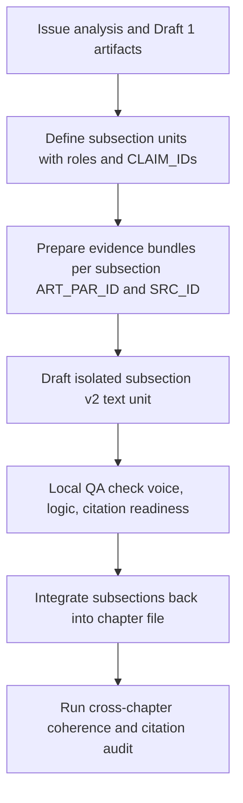

# Writing Plan — รายงานอนาคตเด็กและเยาวชนไทย พ.ศ. 2590 (Draft 2, post edited-draft diagnosis)

## 0) Purpose of Draft 2

- ใช้เป็น **แผนการเขียนร่างที่ 2** สำหรับบทที่ 1–3 ของรายงาน โดยแก้ปัญหาหลักตาม [plans/2026-04-02_foresight-report-edited-draft-issue-analysis.md](plans/2026-04-02_foresight-report-edited-draft-issue-analysis.md)
- เปลี่ยนโหมดจาก **structure-first** → **evidence-and-voice-stable**: ร่างที่ 2 ต้อง
  - ตัด meta-writing และตรรกะเชิงกระบวนการเขียนออกจากเนื้อหาสาธารณะ
  - เติมตรรกะเชิงเหตุและผล (causal bridges) ให้ครบตามกลุ่ม C
  - แก้ภาษาไทยให้เป็นธรรมชาติ (กลุ่ม B) โดยไม่ลด depth เชิงวิเคราะห์
  - ทำให้สถาปัตยกรรมฉากทัศน์บทที่ 3 เสถียรมากพอสำหรับการขัดเกลาเพิ่มเติม (กลุ่ม E)
- ทำให้ร่างที่ 2 พร้อมสำหรับการ **ผูกกับระบบอ้างอิง** ตามโครง [ψ/lab/foresight-report-wrting/citations/README-citation-workflow.md](ψ/lab/foresight-report-wrting/citations/archive/README-citation-workflow.md)
- เตรียมเนื้อหาให้สามารถแตกเป็น **unit การทำงานระดับ subsection** เพื่อให้เอเจนต์/LLM ทำงานแบบ semantic isolation ได้ในรอบถัดไป

---

## 1) Source and evidence hierarchy for Draft 2

### 1.1 Primary drafting base (ระดับยึดเป็นโครงร่าง)

1. Canonical outline + style pack
   - [ψ/lab/foresight-report-wrting/2026-03-29_foresight-2590-writing-plan.md](ψ/lab/foresight-report-wrting/2026-03-29_foresight-2590-writing-plan.md)
   - [ψ/inbox/Foresight report - output report reference.md](ψ/lab/foresight-report-wrting/artifacts/source/Foresight%20report%20-%20output%20report%20reference.md)
   - [ψ/inbox/Foresight Report - writing style reference.md](ψ/inbox/Foresight%20Report%20-%20writing%20style%20reference.md)

2. Integrated draft v3 (post issue-analysis rewrite target)
   - Current integrated review target: [ψ/lab/foresight-report-wrting/2026-04-02_foresight-2590-integrated-rewrite-v3.md](ψ/lab/foresight-report-wrting/2026-04-02_foresight-2590-integrated-rewrite-v3.md)
   - Previous integrated draft v1: [ψ/lab/foresight-report-wrting/2026-03-31_foresight-2590-integrated-rewrite-v1.md](ψ/lab/foresight-report-wrting/2026-03-31_foresight-2590-integrated-rewrite-v1.md)
   - Edited draft with comments (v1): [ψ/lab/foresight-report-wrting/2026-03-31_foresight-2590-integrated-rewrite-v1-edited.md](ψ/lab/foresight-report-wrting/2026-03-31_foresight-2590-integrated-rewrite-v1-edited.md)
   - Issue diagnosis: [plans/2026-04-02_foresight-report-edited-draft-issue-analysis.md](plans/2026-04-02_foresight-report-edited-draft-issue-analysis.md)

3. Chapter-level rewrite artifacts (round 1)
   - [ψ/lab/foresight-report-wrting/artifacts/2026-03-31_ch1-rewrite-v1.md](ψ/lab/foresight-report-wrting/artifacts/2026-03-31_ch1-rewrite-v1.md)
   - [ψ/lab/foresight-report-wrting/artifacts/2026-03-31_ch2-rewrite-v1.md](ψ/lab/foresight-report-wrting/artifacts/2026-03-31_ch2-rewrite-v1.md)
   - [ψ/lab/foresight-report-wrting/artifacts/2026-03-31_ch3-rewrite-v1.md](ψ/lab/foresight-report-wrting/artifacts/2026-03-31_ch3-rewrite-v1.md)

### 1.2 Evidence and research base (ระดับอธิบาย/พิสูจน์)

1. Round 1 evidence base
   - Claim-to-source base: [ψ/lab/foresight-report-wrting/2026-03-30_foresight-2590-evidence-base-round1.md](ψ/lab/foresight-report-wrting/2026-03-30_foresight-2590-evidence-base-round1.md)
   - Chapter evidence traces: 
     - [ψ/lab/foresight-report-wrting/artifacts/2026-03-29_ch2-round1-evidence-trace.md](ψ/lab/foresight-report-wrting/artifacts/2026-03-29_ch2-round1-evidence-trace.md)
     - [ψ/lab/foresight-report-wrting/artifacts/2026-03-29_ch3-round1-evidence-trace.md](ψ/lab/foresight-report-wrting/artifacts/2026-03-29_ch3-round1-evidence-trace.md)
     - [ψ/lab/foresight-report-wrting/artifacts/2026-03-29_ch4-round1-evidence-trace.md](ψ/lab/foresight-report-wrting/artifacts/2026-03-29_ch4-round1-evidence-trace.md)

2. Deep research and analytical memos
   - Conflict, vulnerability, access, trust: [ψ/lab/foresight-report-wrting/artifacts/Child and Youth Vulnerability in Thailand’s Southern Border Provinces.md](ψ/lab/foresight-report-wrting/artifacts/source/Child%20and%20Youth%20Vulnerability%20in%20Thailand’s%20Southern%20Border%20Provinces.md)
   - Learning pathways: [ψ/lab/foresight-report-wrting/artifacts/Learning Pathways.md](ψ/lab/foresight-report-wrting/artifacts/source/Fragmented%20Learning%20Pathways%20and%20Systemic%20Discontinuities%20in%20the%20Southern%20Border%20Provinces.md)
   - Youth livelihoods: [ψ/lab/foresight-report-wrting/artifacts/Livelihoods in the Deep South.md](ψ/lab/foresight-report-wrting/artifacts/source/Youth%20Livelihoods%20in%20the%20Deep%20South%20and%20Opportunity%20Structures.md)
   - Belonging and identity: [ψ/lab/foresight-report-wrting/artifacts/Belonging, identity, and cultural capital.md](ψ/lab/foresight-report-wrting/artifacts/source/Belonging,%20identity,%20and%20cultural%20capital.md)
   - Vulnerable children overview: [ψ/lab/foresight-report-wrting/artifacts/สถานการณ์พื้นฐานเด็กและเยาวชนกลุ่มเปราะบางในพื้นที่จังหวัดชายแดนภาคใต้.md](ψ/lab/foresight-report-wrting/artifacts/source/สถานการณ์พื้นฐานเด็กและเยาวชนกลุ่มเปราะบางในพื้นที่จังหวัดชายแดนภาคใต้.md)

3. Legal and policy base
   - Education laws: 
     - [ψ/lab/foresight-report-wrting/artifacts/พระราชบัญญัติการศึกษาแห่งชาติพ.ศ. ๒๕๔๒.md](ψ/lab/foresight-report-wrting/artifacts/%E0%B8%9E%E0%B8%A3%E0%B8%B0%E0%B8%A3%E0%B8%B2%E0%B8%8A%E0%B8%9A%E0%B8%B1%E0%B8%8D%E0%B8%8D%E0%B8%B1%E0%B8%95%E0%B8%B4%E0%B8%81%E0%B8%B2%E0%B8%A3%E0%B8%A8%E0%B8%B6%E0%B8%81%E0%B8%A9%E0%B8%B2%E0%B9%81%E0%B8%AB%E0%B9%88%E0%B8%87%E0%B8%8A%E0%B8%B2%E0%B8%95%E0%B8%B4%E0%B8%9E%E0%B8%A8.%20%E0%B9%92%E0%B9%95%E0%B9%94%E0%B9%92.md)
     - [ψ/lab/foresight-report-wrting/artifacts/พระราชบัญญัติพื้นที่นวัตกรรมการศึกษา พ.ศ. ๒๕๖๒.md](ψ/lab/foresight-report-wrting/artifacts/source/พระราชบัญญัติพื้นที่นวัตกรรมการศึกษา%20พ.ศ.%20๒๕๖๒.md)

### 1.3 Hierarchy rule for Draft 2

- **First anchor**: project-grounded artifacts and internal evidence under `ψ/lab/foresight-report-wrting/artifacts/`.
- **Second anchor**: deep research memos (Gemini/Perplexity-based) only where they can be matched to traceable sources via the citation system.
- **Third anchor**: external web findings *only after* they are registered into [ψ/lab/foresight-report-wrting/citations/citation-registry.md](ψ/lab/foresight-report-wrting/citations/archive/citation-registry.md) with a `SRC_ID`.
- No new claim in Draft 2 may rely **only** on generic foresight logic with no evidence anchor; such claims must be either:
  - downgraded to clearly marked synthesis with explicit uncertainty, or
  - held with a `[HOLD: ต้องเติมแหล่งอ้างอิงจริง]` note.

---

## 2) Citation workflow requirements for Draft 2

Draft 2 is the first pass that must be structurally compatible with the new citation system.

### 2.1 Required behaviours while drafting

- ทุก subsection ที่มีข้อกล่าวอ้างสำคัญต้อง:
  - ระบุ **`CLAIM_ID`** ใน [ψ/lab/foresight-report-wrting/citations/report-claim-evidence-map.md](ψ/lab/foresight-report-wrting/citations/archive/report-claim-evidence-map.md)
  - เชื่อมกับอย่างน้อยหนึ่ง **`ART_PAR_ID`** ใน [ψ/lab/foresight-report-wrting/citations/artifact-paragraph-source-map.md](ψ/lab/foresight-report-wrting/citations/archive/artifact-paragraph-source-map.md)
  - ดึง `SRC_ID` ตาม chain `CLAIM_ID → ART_PAR_ID → SRC_ID`
- เมื่อไม่พบหลักฐานเพียงพอ:
  - ใช้สถานะ `Evidence_Adequacy = none` หรือ `weak` ในตาราง claim map
  - ในเนื้อรายงาน ให้เหลือเพียงคำอธิบายอย่างระมัดระวัง หรือทำเครื่องหมาย `[HOLD: ต้องเติมแหล่งอ้างอิงจริง]`

### 2.2 Minimal viable filling for Draft 2

ก่อนปิด Draft 2 ต้องมีอย่างน้อย:

1. Registry
   - อย่างน้อย 10–20 แหล่งหลักที่ใช้บ่อยใน [ψ/lab/foresight-report-wrting/citations/citation-registry.md](ψ/lab/foresight-report-wrting/citations/archive/citation-registry.md)
2. Artifact mapping
   - Artifact registry: บันทึก `ART_ID` สำหรับ artifacts หลัก 5–10 ชิ้นแรกใน [ψ/lab/foresight-report-wrting/citations/artifact-paragraph-source-map.md](ψ/lab/foresight-report-wrting/citations/archive/artifact-paragraph-source-map.md)
   - Paragraph map: อย่างน้อย 2–3 `ART_PAR_ID` ต่อบท สำหรับบทที่ 1–3
3. Claim mapping
   - อย่างน้อย 3–5 `CLAIM_ID` ต่อบท ใน [ψ/lab/foresight-report-wrting/citations/report-claim-evidence-map.md](ψ/lab/foresight-report-wrting/citations/archive/report-claim-evidence-map.md)

### 2.3 Inline citation strategy

- ร่างที่ 2 ยังไม่จำเป็นต้องใส่ citation ในตัวเนื้อหาเต็มทุกจุด แต่ต้องออกแบบให้สามารถทำได้ง่ายภายหลัง:
  - ระบุ segment ที่ “พร้อมใส่ citation” ผ่านคอลัมน์ `Inline_Citation_Ready = yes` ใน claim map
  - ใช้คำเชื่อมที่รองรับการแทรกนาม-ปีได้ เช่น “ตามหลักฐานจาก…”, “รายงานของ…ชี้ว่า…”, “การศึกษาหลายฉบับพบว่า…”
- ห้ามเขียนคำว่า “จากการศึกษาก่อนหน้า” หรือ “มีงานวิจัยจำนวนมากชี้ว่า” หากยังไม่มี `SRC_ID` ที่รองรับใน registry

---

## 3) Chapter and subsection drafting order (Draft 2)

หลักคิด: เริ่มจากส่วนที่มีปัญหาเชิงตรรกะและเสียงมากที่สุด และส่วนที่ผูกกับสถาปัตยกรรมฉากทัศน์ ก่อนขัดเกลาเนื้อหาที่ดีอยู่แล้ว

### 3.1 Chapter-wise order

1. **บทที่ 2 – สัญญาณชีวิตเด็กและเยาวชนไทย**
   - เหตุผล: เป็นหัวใจของตรรกะ conflict–vulnerability–access–trust และเป็นพื้นที่ที่กลุ่ม C และ F ชี้ว่าต้องเสริมหลักฐานและสะพานตรรกะ
2. **บทที่ 1 – บทนำ**
   - เหตุผล: ต้องรีเฟรม vision opening, objectives และกรอบวิธีการให้ชัดและเป็นธรรมชาติ โดยไม่หลุดไปเล่ากระบวนการเขียน
3. **บทที่ 3 – ภาพอนาคต**
   - เหตุผล: ต้องทำให้แกนฉากทัศน์ เส้น indicator และ desirable future เสถียร สอดคล้องกับบทที่ 1–2 และพร้อมสำหรับการขัดเกลาเชิงภาษาในภายหลัง

### 3.2 Intra-chapter order (fix sequence)

**Chapter 2**
1. 2.1 บทนำบทที่ 2 + กรอบการอ่านสัญญาณ (แก้ภาษาที่ไม่เป็นธรรมชาติ, ลบ meta-writing)
2. 2.2 สัญญาณแนวโน้มหลักและปัจจัยขับเคลื่อนสำคัญ (เชื่อมกับ system map + evidence)
3. 2.3 เหตุไม่คาดฝัน (wild cards) (รักษาโครง แต่เสริมตัวอย่างและตรรกะ)
4. 2.4 สัญญาณอ่อน (weak signals) (ลดนามธรรม เพิ่มตัวอย่างเฉพาะพื้นที่)
5. 2.5 ผังระบบ + คอขวด + จุดคานงัด (เชื่อมกับ artifacts ระบบ)
6. 2.6 Cross-impact
7. 2.7 Impact × uncertainty และ future tensions → feed เข้าแกนฉากทัศน์บทที่ 3

**Chapter 1**
1. 1.1 ที่มาและความสำคัญ (reframe vision opening ให้เฉพาะเจาะจงกลุ่มเป้าหมาย)
2. 1.2 วัตถุประสงค์การศึกษา (แยก objectives เป็นข้อ ๆ ตามข้อเสนอในกลุ่ม D2)
3. 1.3 กรอบการคาดการณ์อนาคตและกระบวนการ (ตัด meta-writing, เสริมสะพานตรรกะ)
4. 1.4 ขอบเขตการศึกษา (พื้นที่, กลุ่มเป้าหมาย, เวลา, มิติการเปลี่ยนแปลง)

**Chapter 3**
1. 3.1 วิธีอ่านฉากทัศน์และหลักคิด (ลด meta, ทำให้ภาษาธรรมชาติ)
2. 3.2 ภาพอนาคตฐาน (base future)
3. 3.3 ฉากทัศน์ 4 แบบ (แกน, ชื่อฉาก, descriptors, indicator set)
4. 3.4 ภาพอนาคตที่พึงประสงค์ (แยก vision language ออกจาก policy mechanics)

---

## 4) Semantic isolation strategy for subsection drafting

### 4.1 Unit of work

Draft 2 จะใช้ **subsection** เป็นหน่วยงานหลัก เช่น `1.1`, `2.2.1`, `3.3.4` โดยแต่ละ unit ต้อง:

- มี input package ชัดเจน:
  - ตำแหน่งในโครงรายงาน (chapter, section, subsection)
  - สรุปบทบาทของ subsection นั้นในตรรกะของบทและทั้งเล่ม
  - รายการ `CLAIM_ID` ที่เป็นของ subsection นั้น
  - รายการ `ART_PAR_ID` และ `SRC_ID` ที่เกี่ยวข้อง
- มี output specification ชัดเจน:
  - ขอบเขตคำโดยประมาณ (ยืดหยุ่นได้)
  - โทนภาษาและคำหลักที่ต้องใช้/ต้องหลีกเลี่ยง
  - ระดับการใช้หลักฐาน (เชิงอธิบาย, เชิง causal, เชิง vision)

### 4.2 Isolation rules

1. ห้าม subsection ใด
   - อธิบายกลไกการเขียน, การเลือกแกนฉากทัศน์, หรือ logic เบื้องหลัง prompt ในตัวเนื้อหาสาธารณะ
2. ทุก subsection ต้องอ่านรู้เรื่อง **แม้ถูกนำออกมาอ่านเดี่ยว** โดย:
   - ใช้ประโยคเปิดที่ anchor ผู้อ่านกับหัวข้อและบริบทบท
   - ไม่อ้างถึง “ย่อหน้าข้างบน/ข้างล่าง” หรือ “ส่วนอื่นของรายงาน” อย่างกำกวม
3. การอ้างอิงข้ามส่วนให้ใช้โครงสร้างชัด เช่น “ในบทที่ 2 เราเห็นว่า… ในบทนี้จะ….” โดยหลีกเลี่ยง meta-writing

### 4.3 Mermaid overview of semantic-isolated workflow

---

## 5) No-go rules for Draft 2 (derived from issue analysis)

### 5.1 Voice and meta-writing

- ห้าม:
  - เล่า “วิธีเขียนรายงาน” หรือ “ตรรกะการจัดบท” ในตัวรายงาน (กลุ่ม A1, A2, A3).
  - ใช้ประโยคเช่น “บทนี้ยังไม่เล่า…”, “ในภายหลังเราจะ…”, “รายงานฉบับนี้ตั้งใจจะ….” นอกจากในส่วนแนะนำสั้น ๆ ที่จำเป็นจริง ๆ.
  - ใส่คอมเมนต์เกี่ยวกับ prompt, LLM, หรือกระบวนการ editor ลงในเนื้อความ.

### 5.2 Thai naturalness and vagueness

- หลีกเลี่ยงคำ/วลีที่ถูก flag ในกลุ่ม B และ F เช่น:
  - “โอกาสชีวิตเปิดออกหรือปิดลงในทางปฏิบัติ” (ให้เขียนใหม่เป็นภาษาไทยที่เป็นธรรมชาติและมีตัวอย่าง)
  - “ระบบ”, “real access”, “digital”, “equal meaning”, “connect” ถ้าไม่อธิบายเชิงปฏิบัติ
- ทุกคำหลักใน desirable future (บทที่ 3) ต้องมี **ตัวอย่างเชิงบริบทหรือ anchor เชิงนโยบาย** อย่างน้อย 1 ตัวอย่าง

### 5.3 Logic and causality

- ห้ามเขียน causal claim ที่คล้ายกับกลุ่ม C (เช่น access → trust, security → access, vulnerability → conflict) โดยไม่มี **bridge logic** อย่างน้อย 1–2 ประโยคที่อธิบายกลไกระดับชีวิตจริง.
- ทุก causal claim สำคัญต้องได้รับ `Claim_Type = causal-claim` และมี status ใน claim map.

### 5.4 Scenario architecture and indicators

- แกนฉากทัศน์ห้ามใช้คู่ที่ **mutually exclusive เกินจริง** หรือไม่สะท้อนโครงสร้างเศรษฐกิจจริง (กลุ่ม E1).
- ต้องแยก belonging/identity-security ออกจาก purely economic use of identity ใน indicator set (กลุ่ม E3).
- ภาพอนาคตที่พึงประสงค์ต้อง **ไม่** ผสม vision language กับรายละเอียดยุทธศาสตร์หรือมาตรการ.

### 5.5 Evidence and citations

- ห้ามสร้าง “รายงานวิจัยสมมติ” หรือแหล่งที่ไม่มีใน registry.
- ห้ามเขียนประโยคที่อ้างถึง “งานวิจัยจำนวนมาก” หรือ “ผู้เชี่ยวชาญส่วนใหญ่เห็นตรงกันว่า…” หากไม่มีรายการ `SRC_ID` ที่ระบุชัด.
- ระหว่างยังไม่เติมหลักฐาน ให้แสดงความไม่แน่นอนอย่างโปร่งใส (HOLD/GAP) แทนการเขียนให้ดูเหมือน fact.

---

## 6) Concrete subsection worklist for Draft 2

> หน่วยงาน = subsection ที่สามารถมอบหมายให้เอเจนต์/LLM ตัวอื่นไปทำได้โดยใช้แผนนี้เป็น contract

### 6.1 Chapter 1 – บทนำ

1. **1.1 Opening – Vision and why 2590 matters for this region**
   - Task: แทนที่ opening ตอนนี้ด้วยข้อความที่ระบุ “ภาพชีวิตที่ต้องการเห็น” ของเด็กและเยาวชนกลุ่มเป้าหมายในพื้นที่ 3 จชต. อย่างเฉพาะเจาะจง (เชื่อมกับ vulnerable children memo).
   - Constraints: ห้ามใช้ภาษาทั่วไป/นามธรรม, ห้าม reference ถึง writing process.

2. **1.2 Objectives – formal list**
   - Task: แตกย่อหน้าวัตถุประสงค์ปัจจุบันให้เป็นรายการอย่างน้อย 3 objective ที่ชัดเจน, แต่ละข้อมี verb และ object ชัด.
   - Constraints: จัดรูปแบบตามข้อเสนอในกลุ่ม D2, ระบุขอบเขตที่อิงกับ mandate จริงของโครงการ.

3. **1.3 Foresight framework and process**
   - Task: เขียนใหม่ให้เน้น “กรอบคิดและขั้นตอนหลัก” โดยตัด meta-writing ที่เล่ากระบวนการเขียนออกทั้งหมด.
   - Constraints: ต้อง align กับ evidence base และ outline canonical, ใส่ bridge logic ให้ชัดระหว่าง conflict–vulnerability–access–trust.

4. **1.4 Scope (space, people, time, dimensions)**
   - Task: ตรวจภาษาปัจจุบันและทำให้เป็นธรรมชาติ + explicitly align กับวิธีใช้ STEEPV และ trust/safety ในบทที่ 2.

### 6.2 Chapter 2 – สัญญาณชีวิตเด็กและเยาวชนไทย

5. **2.1 Chapter intro – role of signals chapter**
   - Task: เขียน intro ใหม่เพื่ออธิบายบทบาทของบทที่ 2 และความสัมพันธ์กับบทที่ 1 และ 3 โดยใช้ภาษาไทยธรรมชาติ.
   - Constraints: ตัดวลีที่ถูก flag ว่าเป็น meta-writing และ recompute key sentence about “โอกาสชีวิต” ให้ชัด.

6. **2.1.1 Method of scanning and data sources**
   - Task: แทนการเล่า abstract ด้วยคำอธิบายสั้น ๆ ว่าใช้แหล่งข้อมูลประเภทใด, มีข้อจำกัดอะไร, ใช้เพื่ออะไร.
   - Dependencies: evidence traces + research plan artifacts.

7. **2.1.2 Life-course trends and vulnerability patterns**
   - Task: ปรับโครงให้รวม conflict, identity, megatrends และ system map nodes ตามกลุ่ม C2–C4.
   - Output: narrative ที่เชื่อม bridge logic ระหว่าง violence / conflict / identity กับเส้นทางการเรียนรู้และโอกาสชีวิต.

8. **2.1.3–2.1.4 Wild cards and weak signals**
   - Task: ทำให้ภาษาน้อยลงในระดับ “ปรัชญา” และเพิ่มตัวอย่างเฉพาะพื้นที่อย่างน้อย 2–3 ตัว.

9. **2.2 System map narrative and feedback loops**
   - Task: ตรวจ narrative รอบผังระบบและวงจรป้อนกลับ ให้เชื่อมกับ artifacts system map + conflict/vulnerability memo.

10. **2.3–2.4 Cross-impact and impact × uncertainty**
    - Task: ปรับภาษาและกรอบให้รองรับการดึงแกนฉากทัศน์บทที่ 3 โดยไม่เริ่มเล่า scenario ในบทนี้.

### 6.3 Chapter 3 – ภาพอนาคต

11. **3.1 How to read the scenarios**
    - Task: เขียนใหม่ให้หลีกเลี่ยงการอธิบาย process ของการเขียน scenario, เน้นบทบาทของฉากทัศน์สำหรับผู้อ่าน.

12. **3.2 Baseline future**
    - Task: ตรวจและรีเฟรม base future ให้สอดคล้องกับบท 2 ที่ rewritten แล้ว และระบุข้อจำกัดหลักฐานชัด.

13. **3.3 Scenario matrix (axes and indicator set)**
    - Task: ทบทวนแกนที่สองของฉากทัศน์ (กลุ่ม E1) และปรับ indicator set ให้แยก belonging, identity-security, economic identity.

14. **3.3.x Scenario narratives (1–4)**
    - Task: ตรวจกลิ่นภาษาและตรรกะให้แต่ละฉาก
      - สะท้อนเงื่อนไขเชิงโครงสร้างจริง
      - ไม่ over-claim ศักยภาพของ sector ที่ยังไม่ grounded ใน evidence

15. **3.4 Desirable future**
    - Task: แยก vision statement, descriptive detail, และ policy mechanics ออกจากกัน; เขียน vision ภาษาไทยที่เป็นธรรมชาติและ anchored ใน evidence.

---

## 7) Handoff note

- ร่างแผนนี้ทำหน้าที่เป็น **contract สำหรับ Draft 2**:
  - บอกว่า Draft 2 ต้องทำอะไรให้เสร็จก่อนส่งต่อไปยังรอบ copyedit/citation เต็มรูปแบบ
  - ระบุ source hierarchy, citation workflow, semantic-isolation strategy, no-go rules, และ worklist ตาม subsection
- เมื่อ Draft 2 เสร็จ เอเจนต์ในรอบถัดไปควรอัปเดต:
  - ตาราง `citation-registry.md`, `artifact-paragraph-source-map.md`, `report-claim-evidence-map.md`
  - บันทึกใน plan ฉบับใหม่ (append-only) ว่าสถานะของแต่ละ subsection อยู่ที่จุดใดใน workflow

---

## 8) Session Style Pack Summary — Draft 2 isolated subsection 2.1.2

### Session Style Pack Summary (2026-04-02, mode report, subsection 2.1.2)

#### Primary reference
- Example report: [ψ/inbox/Foresight report - output report reference.md](ψ/lab/foresight-report-wrting/artifacts/source/Foresight%20report%20-%20output%20report%20reference.md)
- Canonical plan spine: [ψ/lab/foresight-report-wrting/2026-03-29_foresight-2590-writing-plan.md](ψ/lab/foresight-report-wrting/2026-03-29_foresight-2590-writing-plan.md)

#### Terminology (preferred for Chapter 2 signals section)
- ใช้ชุดคำหลักตามตัวอย่างในบทที่ 2 ของ example report เช่น การกวาดสัญญาณ, สัญญาณเชิงโครงสร้าง, สัญญาณเชิงพลวัต, สัญญาณที่กำลังปรากฏขึ้นใหม่, เหตุไม่คาดฝัน, สัญญาณอ่อน โดยคงคำไทยเป็นหลักและอธิบายหน้าที่มากกว่าการย้ำศัพท์เทคนิคภาษาอังกฤษ
- สำหรับ subsection 2.1.2 ให้ยึดคำว่า แนวโน้มชีวิตของเด็กและเยาวชนกลุ่มเป้าหมาย, แนวโน้มที่มีผลกระทบต่อการเปลี่ยนแปลงของชีวิตเด็กและเยาวชน, ปัจจัยขับเคลื่อน, โอกาส และ ความเสี่ยง เป็นคำหลัก เชื่อมกับคู่คำ conflict–vulnerability–access–trust ตาม issue analysis
- หลีกเลี่ยงคำกว้างและนามธรรม เช่น โลกดิจิทัล หรือ ระบบ หากไม่ได้เชื่อมกับประสบการณ์จริงในชีวิตประจำวันของเด็กในพื้นที่ 3 จังหวัดชายแดนภาคใต้ (การเรียน การทำงาน การใช้เวลาออนไลน์ ความปลอดภัย)

#### Section flow
- อ้างอิงโครงจาก example report หมวด สัญญาณแนวโน้มหลักและปัจจัยขับเคลื่อนสำคัญ และหัวข้อย่อย แนวโน้มชีวิตของเด็กและเยาวชนกลุ่มเป้าหมาย และ แนวโน้มที่มีผลกระทบต่อการเปลี่ยนแปลงของชีวิตเด็กและเยาวชน เป็นแกนหลัก
- โครง subsection 2.1.2 ในร่างที่ 2 ให้เดินจาก ภาพรวมแนวโน้มชีวิตของเด็กกลุ่มเป้าหมาย → ปัจจัยโครงสร้างและ drivers จากระบบ (ครอบครัว โรงเรียน เศรษฐกิจ ท้องถิ่น ความมั่นคงและความรุนแรง) → ลายเซ็นของรูปแบบความเปราะบาง (vulnerability patterns) ที่จะใช้ต่อใน system map และ scenario
- ระดับหัวข้อยังคงอยู่ภายใต้ 2.1 Signals introduction (2.1.1–2.1.4) แต่เนื้อหา 2.1.2 ต้องอ่านเดี่ยวรู้เรื่องโดยไม่ต้องพึ่งคำอธิบายวิธีอ่านทั้งบท

#### Voice + constraints (safety rails)
- ใช้โทนรายงานทางการตามคู่มือ [ψ/memory/resonance/writing-style-th.md](ψ/memory/resonance/writing-style-th.md): เป็นกลาง เชิงวิเคราะห์ เน้นการเชื่อมข้อมูลกับโครงสร้างและนัยเชิงปฏิบัติ ไม่ใช้ภาษาพูดหรือคำคุณศัพท์ที่วัดค่าไม่ได้
- ปฏิบัติตาม no-go rules หมวด 5.1–5.5 ในแผนนี้อย่างเคร่งครัด โดยเฉพาะการตัด meta-writing เกี่ยวกับกระบวนการเขียนและการเล่าตรรกะการจัดบทออกจากตัวเนื้อหารายงานสาธารณะ
- ทุก causal claim ที่เชื่อม conflict → vulnerability → access → trust ต้องมี bridge logic ระดับชีวิตจริงอย่างน้อย 1–2 ประโยค และต้องสามารถ map ไปยัง Claim_Type = causal-claim ใน claim map ได้
- ลดวลีเชิงปรัชญาและกลิ่นภาษาที่ถูก flag ใน issue analysis เช่น โอกาสชีวิตเปิดออกหรือปิดลงในทางปฏิบัติ ให้แทนด้วยประโยคที่อธิบายสถานการณ์และตัวอย่างเชิงบริบทที่ชัดเจน

#### Citations
- ยึดคู่มือ [ψ/memory/resonance/citation-style-th.md](ψ/memory/resonance/citation-style-th.md) เป็น baseline: หากต้องแทรกอ้างอิง ให้ใช้รูปแบบ APA ภาษาไทย ไม่ผสมสไตล์ภาษาอังกฤษในชื่อผู้แต่งไทย
- ระหว่างการร่าง subsection 2.1.2 ทุกข้อสรุปสำคัญเกี่ยวกับแนวโน้มชีวิตเด็กและปัจจัยขับเคลื่อนต้องสามารถเชื่อมไปยังรหัส CLAIM_ID, ART_PAR_ID และ SRC_ID ในระบบ citation ของโครงการ หากยังไม่กำหนดรหัส ให้ใช้ placeholder ชั่วคราว
- ห้ามสร้างแหล่งอ้างอิงสมมติ หากยังไม่พบหลักฐาน ให้ใช้ภาษาสังเคราะห์เชิงระมัดระวังและติดป้าย [HOLD: ต้องเติมแหล่งอ้างอิงจริง] แทนการเขียนให้ดูเหมือนข้อเท็จจริงสมบูรณ์

#### Placeholders
- ใช้ placeholder ภาษาไทยที่ชัดเจน เช่น [ต้องเติมตัวเลขประมาณการ], [ต้องเติมตัวอย่างจากพื้นที่ 3 จชต.], [HOLD: CLAIM_ID], [HOLD: ART_PAR_ID/SRC_ID] แทนการเขียนประโยคกว้าง ๆ ที่ไม่มีหลักฐานรองรับ

---

## 9) Learn-back records

- 2026-04-02 — writing-th-learn (mode: report), integrated draft v2 → v3, foresight 2590 report skeleton and meta-writing cleanup captured in [ψ/memory/learnings/2026-04-02_writing-th-report-learn.md](ψ/memory/learnings/2026-04-02_writing-th-report-learn.md)

---

## 10) Draft 2 outline — Subsection 2.1.2 Life-course trends and vulnerability patterns

> ขอบเขต: outline สำหรับร่างย่อย 2.1.2 เท่านั้น ยังไม่เข้าสู่การเขียนร่างเนื้อความ

### Outline TH Variant A — aligned with example report and Draft 2 issue analysis

1. บทนำสั้นของหัวข้อ 2.1.2
   1.1 ย้ำบทบาทของ 2.1.2 ในโครงบทที่ 2 ระหว่างการอธิบายวิธีการกวาดสัญญาณและการจัดหมวดสัญญาณ
   1.2 ระบุว่าหัวข้อนี้มุ่งอธิบายแนวโน้มชีวิตของเด็กและเยาวชนกลุ่มเป้าหมายในพื้นที่ 3 จชต. บนฐานสัญญาณที่กวาดมา

2. แนวโน้มชีวิตของเด็กและเยาวชนกลุ่มเป้าหมาย
   2.1 โครงสร้างชีวิตประจำวันของเด็กและเยาวชนในวันนี้ เช่น การเรียน การทำงาน การใช้เวลาในโลกดิจิทัล และพื้นที่ปลอดภัยทางกายภาพ
   2.2 รูปแบบครอบครัว เศรษฐกิจครัวเรือน และเครือข่ายชุมชนที่กำหนดโอกาสและข้อจำกัดของเด็ก
   2.3 สัญญาณเชิงโครงสร้างที่สะท้อนการเปลี่ยนแปลงระยะยาวของชีวิตเด็ก เช่น การเข้าถึงการศึกษา คุณภาพสุขภาวะ และความเหลื่อมล้ำเชิงพื้นที่

3. แนวโน้มที่มีผลกระทบต่อการเปลี่ยนแปลงของชีวิตเด็กและเยาวชน
   3.1 ปัจจัยขับเคลื่อนจากระบบเศรษฐกิจ การเมือง และสิ่งแวดล้อมที่กดดันหรือเปิดโอกาสใหม่ให้เด็กในพื้นที่เป้าหมาย
   3.2 ผลของเทคโนโลยีและโลกดิจิทัลต่อรูปแบบการเรียนรู้ การทำงาน และความสัมพันธ์ของเด็ก
   3.3 สถานการณ์ความมั่นคง ความรุนแรง และความปลอดภัยที่มีผลต่อความรู้สึกไว้วางใจและการเคลื่อนที่ของเด็ก

4. รูปแบบความเปราะบางและเส้นทางโอกาสชีวิต
   4.1 สรุปลายเซ็นของเส้นทางชีวิตที่มีความเปราะบางสูง เช่น เด็กในครอบครัวเปราะบาง เด็กที่ต้องทำงานควบคู่การเรียน เด็กที่อยู่กับความรุนแรงเรื้อรัง
   4.2 ตัวอย่างเส้นทางชีวิตที่สะท้อนทั้งโอกาสและความเสี่ยงควบคู่กัน เช่น เด็กที่เข้าถึงการเรียนรู้ออนไลน์แต่เผชิญความโดดเดี่ยวหรือความไม่ปลอดภัยทางดิจิทัล
   4.3 สะพานตรรกะที่เชื่อม conflict, identity, access และ trust เข้าด้วยกันในประสบการณ์ชีวิตของเด็กกลุ่มเป้าหมาย

5. นัยต่อส่วนถัดไปของบทที่ 2 และต่อฉากทัศน์ในบทที่ 3
   5.1 ระบุว่าลายเซ็นแนวโน้มและรูปแบบความเปราะบางในหัวข้อนี้จะถูกใช้เพื่อเลือกปัจจัยขับเคลื่อนหลักและความไม่แน่นอนสำคัญในส่วน cross impact และ impact × uncertainty
   5.2 ชี้ประเด็นที่ต้องติดตามหรือเติมหลักฐานเพิ่มเติม พร้อมจุดที่ควรทำเครื่องหมาย [HOLD: ต้องเติมแหล่งอ้างอิงจริง] สำหรับรอบ citation เต็มรูปแบบ
