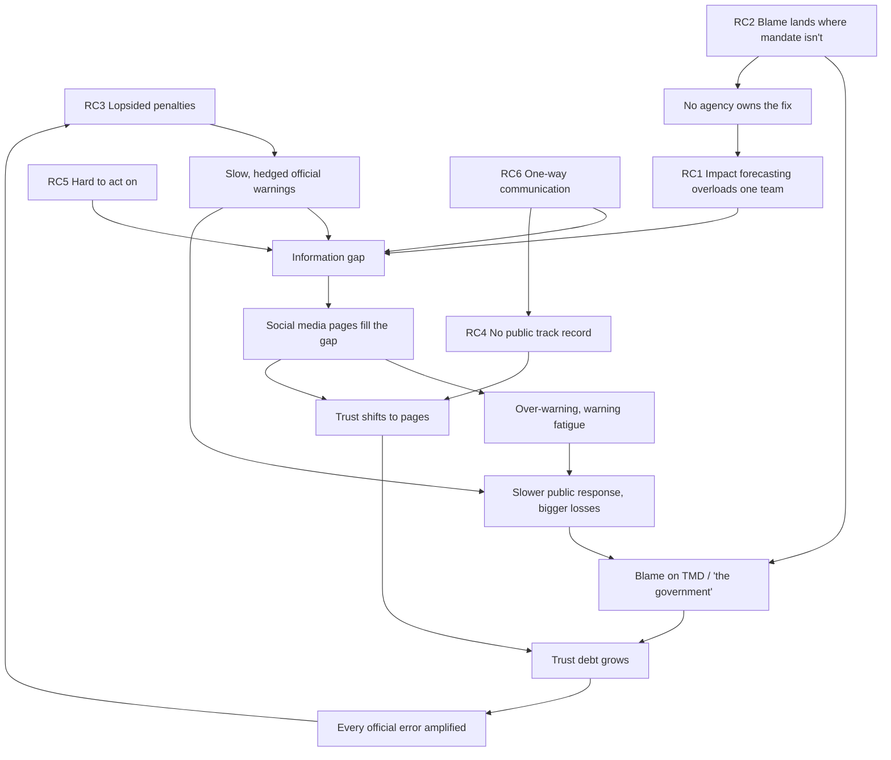

# Root causes of trust erosion in Thai weather warnings

## Why this note exists

The problem looks like a chicken-and-egg loop. Warnings are cautious because trust is low, since every error gets punished. Trust is low because warnings are cautious. As long as we describe it that way, there is no place to start.

This note separates three kinds of things.

1. **Symptoms** are what people see.
2. **Conditions** are facts we design around but cannot change in the short term.
3. **Root causes** are specific, nameable issues that someone can decide to change.

Each root cause is named so it can be handled on its own. The last section shows which ones sit outside the loop and can be fixed first, without waiting for trust to come back.

## Symptoms (what people see)

- The public says TMD warnings are late, soft, and insincere.
- Social media weather pages gain more trust than the official agency.
- Over-warning from these pages spreads fast and is rarely checked.
- After each event, blame goes to "the government" as a whole, and to TMD by name.

We cannot fix these directly. They are outputs of the root causes below.

## Conditions (design around them, don't try to fix first)

- **How people judge risk.** People remember dramatic hits and forget misses. They fear loss more than they value routine accuracy, and most don't think in probabilities. This is normal human behaviour, not a defect in the Thai public.
- **Trust debt from past events.** Past floods where warnings came late left a store of distrust. This is the *level* of trust, raised or drained by the root causes. It cannot be targeted directly.
- **The attention economy.** Platforms reward urgent, emotional, visual content. Any actor who posts that way will be amplified.

## Root causes

### RC1. Impact forecasting is assigned to one small team, not shared across the chain

*Research topics: multi-agency data governance & interoperability; institutional design for interagency coordination; hydrometeorological model coupling; technical workforce/capacity planning*

TMD's climate center is tasked with turning the meteorological forecast into hazard maps and impact forecasts, but this is only one link in a longer chain that also needs river/runoff forecasting (HII, RID, ONWR), inundation modelling (HII, RID), real-time flood extent (GISTDA), and exposure/vulnerability data (DCCE and others). A team of 10–15 staff, already carrying climate projection and research work, cannot absorb the rest of the chain without either rebuilding capability that other agencies already hold or staying dependent on their data with no clear working arrangement. That missing arrangement is the exact gap social media pages fill.

*NFCS link:* the action plan gives impact-based forecasting (4.2.1.2) and warning thresholds (4.2.1.1) to TMD for 2027–2030, and the UIP system admin is still split between DCCE and TMD. The job has been named, but the division of labour across the chain has not, and it is not yet funded at the scale it needs.

*See also:* [`2026-09-26_rc1-impact-forecasting-capacity.md`](2026-09-26_rc1-impact-forecasting-capacity.md) for the full chain breakdown and a possible division of work.

### RC2. Blame lands where the mandate isn't

*Research topics: blame-avoidance theory; disaster governance & accountability mapping; principal-agent problems across agencies*

The public holds TMD accountable for warnings. By law, the NDWC under DDPM issues disaster warnings and provincial governors order action. Each agency can honestly say the failure sits with another, so no one takes ownership of fixing it. The public sees no single face responsible for the warning it receives.

### RC3. Penalties are lopsided

*Research topics: incentive design under asymmetric loss (cost-loss / signal-detection theory); organizational risk-aversion in bureaucracies; behavioral economics of the "cry wolf" effect*

Official agencies are punished for false alarms (economic complaints, loss of face) and for misses (media blame). Their procedures and sign-off chains are designed mainly to avoid false alarms, which makes warnings slower and more hedged. Social media pages are punished for neither. So caution costs the agency trust, and boldness costs the influencer nothing.

### RC4. No public track record

*Research topics: forecast verification science (skill scores, verification metrics); open-data & transparency mechanisms; institutional trust-repair research*

Nobody publishes how often official or unofficial forecasts turned out right. Without a scorecard, trust follows memory, and memory favours the dramatic hit. The influencer's misses stay invisible. The agency's one late warning is remembered for years.

*NFCS link:* the EWS effectiveness review (4.2.1.4) is the nearest hook, but as written it evaluates dissemination, not forecast skill that the public can see.

### RC5. Warnings are hard to act on

*Research topics: risk communication (message design & framing); Protective Action Decision Model (behavioral response to warnings); plain-language/UX design for alerts*

Official products speak in millimetres, percentages, and regions, often as PDF bulletins in formal language, with no plain trigger for what to do and when. People want to know what will happen on their street and the moment to act. Social media pages answer that question (often wrongly) and the official channel does not. This is a message-design and delivery-format issue, separate from whether the underlying impact content (RC1) is any good — even a correct impact forecast can still be handed to the public as a jargon-heavy bulletin.

### RC6. Communication runs one way

*Research topics: crisis informatics; two-way/participatory risk communication; misinformation and rumor management*

Agencies send warnings but have no routine way to hear what people are asking, what rumours are spreading, or what actually happened on the ground. They cannot correct misinformation while it spreads, and they get no ground truth to improve thresholds. The validation workshop flagged this gap directly ("feedback loop" under the UIP goal).

## How the root causes feed each other

### The loops that keep the situation stuck

**Loop A. The caution spiral.** Lopsided penalties (RC3) lead to cautious warnings. Cautious warnings feel late, trust falls, and each official error gets amplified further. That raises the penalty for errors, so agencies get more cautious. This is the chicken-and-egg the team feels.

**Loop B. The vacuum loop.** An impact forecast that is under-resourced (RC1) and a message format that is hard to act on (RC5) both leave a gap, and slow warnings widen it. Pages fill the gap and gain followers. Their over-warning causes fatigue, so people respond more slowly to all warnings, losses grow, blame lands on the agency, and trust falls again. Lower trust means the next official warning reaches fewer people, which widens the gap further.

**Loop C. The blame loop.** Because blame and mandate don't line up (RC2), no agency takes ownership of the fix. The impact-forecasting chain (RC1) stays under-resourced and undivided, the same failure repeats, and blame lands on TMD again.

**Loop D. The memory loop.** With no track record (RC4), trust follows memory. Memory keeps the pages' hits and the agency's misses. That stable bias holds the trust reversal in place, even in a season where the agency outperforms the pages.

## Breaking the chicken-and-egg

Trust sits inside every loop, so it can't be the starting point. The way out is to start with root causes that lie *outside* the loops. These can be changed by a decision or a small build, and none of them need public trust first.

| Root cause | Inside or outside the loops? | Can start without trust? | What it unlocks |
|---|---|---|---|
| RC1 Impact forecasting overloads one team | Outside, since it's a capacity and division-of-labour decision | Yes | Shrinks the vacuum in Loop B, part of RC2 |
| RC5 Hard to act on | Outside, since it's a message-design choice | Yes, can start now | Shrinks the vacuum in Loop B |
| RC4 No public track record | Outside, since it's a measurement choice | Yes | Softens RC3, breaks Loop D |
| RC6 One-way communication | Outside, since it's a listening capability | Yes | Feeds RC4 with ground truth, shrinks the vacuum |
| RC2 Blame lands where mandate isn't | Partly outside, since it's an SOP and public-face decision | Yes, but needs two agencies to agree | Breaks Loop C |
| RC3 Lopsided penalties | Inside Loop A | No, it eases as the others land | Ends the caution spiral |

### Suggested order to tackle them one at a time

1. **RC1 first. Use the NFCS mandate matrix to divide the impact-forecasting chain across agencies.** TMD's climate center cannot absorb hydrology, satellite, and exposure work on top of its existing mandate. This is a decision the NFCS working group (TMD chair, TMD and DCCE secretariat) is already set up to broker, though making it binding on line agencies likely needs a joint SOP, an NDPMC decision, or an MoU behind it. See [`2026-09-26_rc1-impact-forecasting-capacity.md`](2026-09-26_rc1-impact-forecasting-capacity.md) for the proposed split.
2. **RC5 alongside RC1. Redesign the warning message itself.** Consequence-based, local, with plain probability words and clear "act now" triggers. This does not need RC1 solved first — today's hazard warnings can already be rewritten more plainly — but it becomes more powerful once RC1 supplies better impact content to put into that format.
3. **RC4 next. Publish a simple track record.** A season-level record of official warnings against what happened. Later, an open method so anyone can check any forecaster's record, including pages. This is cheap and needs no agency to admit fault. It also changes the pages' incentives without confronting them, because their misses become visible.
4. **RC6 alongside RC4. Start listening.** A small team watching social media and hotline questions during events, correcting rumours quickly, and logging what happened on the ground. The logs feed the track record in step 3.
5. **RC2 once RC1 has a division of labour. Give the public one face.** Agree through the TMD–DDPM SOP work who speaks to the public during a warning, and make sure the forecast and the action order reach people as one message.
6. **RC3 eases last.** Agreed thresholds (4.2.1.1) shift the blame for a false alarm from a person's judgement to a protocol that everyone signed. Together with a visible track record, this lowers the cost of warning early. Agencies can then afford to be less cautious, and Loop A starts running in reverse.

## Research topics, indexed by discipline

This note is organized by root cause (RC-led), because that keeps the causal chain and loop diagram intact and speaks directly to what a director needs to hear. Each RC above carries a `Research topics:` tag for this reason.

The table below re-indexes the same tags by discipline instead, for when the next step is commissioning research or bringing in a specialist rather than pitching a fix. Some disciplines serve more than one RC, which is exactly why the RC-led framing was kept as the primary structure rather than duplicating a research-led document in parallel.

| Research topic / discipline | RCs it serves |
|---|---|
| Multi-agency data governance & interoperability | RC1 |
| Institutional design for interagency coordination | RC1, RC2 |
| Hydrometeorological model coupling | RC1 |
| Technical workforce/capacity planning | RC1 |
| Blame-avoidance theory | RC2 |
| Disaster governance & accountability mapping | RC2 |
| Principal-agent problems across agencies | RC2 |
| Incentive design under asymmetric loss (cost-loss / signal-detection theory) | RC3 |
| Organizational risk-aversion in bureaucracies | RC3 |
| Behavioral economics of the "cry wolf" effect | RC3 |
| Forecast verification science | RC3, RC4 |
| Open-data & transparency mechanisms | RC4 |
| Institutional trust-repair research | RC4 |
| Risk communication (message design & framing) | RC5 |
| Protective Action Decision Model | RC5 |
| Plain-language/UX design for alerts | RC5 |
| Crisis informatics | RC6 |
| Two-way/participatory risk communication | RC5, RC6 |
| Misinformation and rumor management | RC6 |

## Open questions

- Does the NFCS working group have the authority to divide the RC1 chain across agencies, or does it need a decision from the National Climate Change Policy Committee (กนภ.) or the NDPMC?
- Is there any existing forecast verification at TMD that could be made public quickly (RC4)?
- Who inside DDPM or the NDWC would own a listening function (RC6), and does the LINE Safety Check project already collect usable feedback?
- Who owns message design and format for public warnings today (RC5), and could that be rewritten without waiting for the RC1 chain to be resolved?
