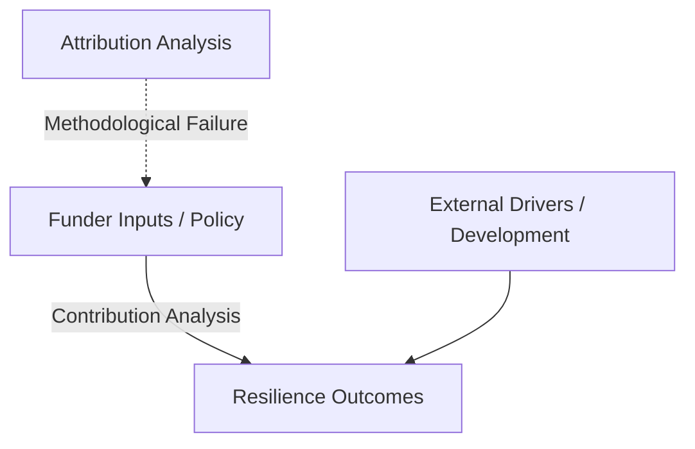

# Trace: Climate Change Adaptation M&E Note Artifacts & Sources

**Target**: Climate Change Adaptation M&E Note Artifacts & Sources  
**Mode**: deep | **Friction**: 1.0 | **Confidence**: high  
**Time**: 2026-07-06 16:00

## Oracle Results
1. **[learning_2026-04-16_parent-tags-climaterisk-riska](file:///C:/Users/sitth/OracleWorkspace/Arun_Creagy/ψ/memory/learnings/2026-04-16_parent-tags-climaterisk-riska.md)**: 
   - Synthesizes Comprehensive Risk Management (CRM) including risk assessment, DRR, and adaptation finance.
   - Proposes a risk-layering spectrum (low-risk = reduction, medium-risk = transfer/insurance, high-risk = Loss & Damage).
2. **[learning_2026-04-15_lesson-learned-bridging-science-and-policy-via](file:///C:/Users/sitth/OracleWorkspace/Arun_Creagy/ψ/memory/learnings/2026-04-15_lesson-learned-bridging-science-and-policy-via.md)**:
   - Discusses data modeling challenges for mapping slow-onset stresses vs discrete shocks.
   - Emphasizes the need for associative entity models (`ATTRIBUTION_LINK`) to handle causal attribution.
3. **[learning_2026-04-15_lesson-learned-cdm-expansion-cross-department](file:///C:/Users/sitth/OracleWorkspace/Arun_Creagy/ψ/memory/learnings/2026-04-15_lesson-learned-cdm-expansion-cross-department.md)**:
   - Contrasts science-first vs governance-first data models.
   - Warns against the "Portal vs Platform" trap (static PDFs vs queryable tagged database assets).
4. **[learning_2026-04-15_metadata-governance-gates-process-metrics-s](file:///C:/Users/sitth/OracleWorkspace/Arun_Creagy/ψ/memory/learnings/2026-04-15_metadata-governance-gates-process-metrics-s.md)**:
   - Details how metadata management acts as the execution layer for adaptation platforms.
   - Highlights the BTR dependencies and risk of schema-documentation drift.

## Files Found
All relevant source materials are verified on the local filesystem under the `ψ/inbox/` directory:

1. **[National MEL System for Climate Change Adaptation.md](file:///C:/Users/sitth/OracleWorkspace/Arun_Creagy/ψ/inbox/National%20MEL%20System%20for%20Climate%20Change%20Adaptation.md)**: 
   - *Scope*: International/National comparative analysis of 53% of submitted NAP documents containing MEL frameworks.
   - *Key Case Studies*: UK's preparedness ladder/monitoring maps, Peru's phased implementation model, Kenya's Climate Change Act (annual reporting mandates).
2. **[ADAPTATION MONITORING AND EVALUATION  FRAMEWORK - Vietnam - UNDP.md](file:///C:/Users/sitth/OracleWorkspace/Arun_Creagy/ψ/inbox/ADAPTATION%20MONITORING%20AND%20EVALUATION%20%20FRAMEWORK%20-%20Vietnam%20-%20UNDP.md)**: 
   - *Scope*: Step-by-step methodology for national-scale adaptation M&E framework design and operation (Background, Content, Operation, Products).
   - *Data Network*: Focuses on vertical and horizontal data collection models between ministries and subnational provinces.
3. **[Analysis of TDRI work on NAP Indicators and Adaptation M&E Contribution.md](file:///C:/Users/sitth/OracleWorkspace/Arun_Creagy/ψ/inbox/Analysis%20of%20TDRI%20work%20on%20NAP%20Indicators%20and%20Adaptation%20M&E%20Contribution.md)**:
   - *Scope*: Audits Thailand's 6 sectors of the National Adaptation Plan (NAP) and the TDRI-proposed indicators (Water, Agriculture, Tourism, Health, Natural Resources, Settlements).
   - *Gaps Identified*: Lack of strategy-to-indicator linkages (except in Agriculture), lack of baseline metrics, and lack of localized/qualitative adaptation measures.
4. **[Adaptation metrics -  Perspectives on measuring, aggregating and comparing adaptation results.md](file:///C:/Users/sitth/OracleWorkspace/Arun_Creagy/ψ/inbox/Adaptation%20metrics%20-%20%20Perspectives%20on%20measuring,%20aggregating%20and%20comparing%20adaptation%20results.md)**:
   - *Scope*: UNEP DTU Partnership guidebook compiling expert methodologies on adaptation indicators vs metrics, context-specificity challenges, and GCF/RBM results alignment.
   - *Core Framework*: Focuses on the TAMD (Tracking Adaptation Measuring Development) framework which segregates Track 1 (institutional capacity) from Track 2 (well-being/resilience outcomes).
5. **[Aggregating Climate Adaptation Effort- Challenges and Strategies.md](file:///C:/Users/sitth/OracleWorkspace/Arun_Creagy/ψ/inbox/Aggregating%20Climate%20Adaptation%20Effort-%20Challenges%20and%20Strategies.md)**:
   - *Scope*: Identifies the "moving baseline" problem and oversimplification during quantitative indicator aggregation. Proposes relative trends over time and Theories of Change (ToC) to connect project data to national reports.
6. **[AF and GCF Indicator Framework at higher level.md](file:///C:/Users/sitth/OracleWorkspace/Arun_Creagy/ψ/inbox/AF%20and%20GCF%20Indicator%20Framework%20at%20higher%20level.md)**:
   - *Scope*: Programmatic M&E of global climate funds, detailing the GCF's Readiness Results Management Framework (RRMF) and the Adaptation Fund's Results-Based Management (RBM) causal models.
7. **[Attribution vs contribution in impact measurement  Sopact Perspective.md](file:///C:/Users/sitth/OracleWorkspace/Arun_Creagy/ψ/inbox/Attribution%20vs%20contribution%20in%20impact%20measurement%20%20Sopact%20Perspective.md)**:
   - *Scope*: Evaluates the "attribution versus contribution" conundrum. Argues for contribution analysis (how inputs increase likelihood of outcomes) rather than attempting to prove exclusive counterfactual attribution in complex socio-ecological environments.

## Git History
None.

## GitHub Issues/PRs
None.

## Cross-Repo Matches
None.

## Oracle Memory
Learnings from past sessions (e.g. `be0e217b`, `5a9b36db`, `1786effc`) emphasize the need to build a modular, metadata-governed data architecture (Medallion schema) rather than compiling static, disconnected spreadsheets.

## Session History (from /dig)
- **Session 2026-06-18 (ID: `1777386833888`)**:
  - Hardened economic unit synchronization for the Climate Risk Index (CRI) Phase 1 app.
  - Resolved conflicts between "Relief Funds" and "Total Economic Loss" to prevent the "Bangkok Paradox" where wealthy urban areas appear artificially vulnerable due to high infrastructure asset values.

---

## 4. Synthesis and Topic Analysis of M&E Sources

A thematic analysis of the gathered note artifacts reveals three core debates and design patterns essential for building Thailand's national climate adaptation monitoring and evaluation evidence base:

### Topic A: The Core Methodological Gaps & Framing
*   **The "Mitigation Paradox" (No CO2e Equivalent)**: All sources (especially UNEP-DTU and Sopact) emphasize that adaptation lacks a single, universal metric. This requires a hybrid, standard-plus-custom indicator design rather than a single database average.
*   **Adaptation vs. Development**: The boundary between basic development (e.g., building roads or hospitals) and adaptation (e.g., climate-proofing them) is highly blurry. Kenya's TAMD application demonstrates that local-level adaptation indicators often default to standard development indicators.
*   **Attribution vs. Contribution**: Prove vs. Plausibility. In complex, multi-funder and multi-stress environments, attempting to establish exclusive counterfactual *attribution* (proving a specific program caused a change) is methodologically flawed and costly. The consensus (Sopact, GIZ) supports *contribution analysis* (showing how inputs increase the resilience of communities over time).



### Topic B: Structural Design of M&E Frameworks
*   **Process vs. Outcomes**: 
    - *Process indicators* track implementation (e.g., "Has the municipality updated its urban plan?"). 
    - *Outcome/Impact indicators* track vulnerability changes (e.g., "Has water security increased?").
    - The Viet Nam UNDP framework and GIZ guidance recommend a **dual-track system** combining both. Process indicators are cheap and ensure administrative compliance; outcome indicators measure actual environmental changes but require long-term monitoring.
*   **Vertical vs. Horizontal Data Flow**: 
    - The Viet Nam model defines a clear data matrix: vertical aggregation (commune $\rightarrow$ district $\rightarrow$ province $\rightarrow$ MONRE) and horizontal aggregation (sectoral line ministries sharing data with the environment agency). 
    - The IISD report notes that only having horizontal reporting mandates leads to weak subnational integration.

```
Vertical Model:   Commune ──> District ──> Province ──> National Focal Agency (MONRE/DCCE)
                                              ▲
Horizontal Model: Line Ministries ────────────┘ (Sectoral Aggregation)
```

### Topic C: Thailand's Sectoral Gaps (TDRI Audit)
Thailand's National Adaptation Plan indicators are primarily outcome and impact metrics, but they face several implementation challenges:
1.  **Water Sector**: Uses the *Water Security Index (WSI)* (4 dimensions) and *disaster damage values*. The gap is the lack of institutional coordination to compile localized supply/demand data.
2.  **Agriculture**: Measures *production loss value compared to agricultural GDP* and *government compensation reduction*. This is the only sector with explicit 1-to-1 mappings between indicators and strategies.
3.  **Human Settlements**: Measures *percentage of urban plans integrating adaptation* and *public green space ratios*.
4.  **Health**: Avoids complex disease counts and uses high-level *disease decline capacity* and *economic damage from health impacts*. Gaps include data linking climate variables to health outcomes.

---

## 5. Friction Analysis
*   **Score**: 1.0 — Frictionless. Oracle search and local workspace discovery retrieved high-signal resources and structural definitions directly.
*   **Coverage**: `oracle`, `files`
*   **Goal check**: Yes, the trace gathered scattered note artifacts about climate change adaptation M&E, organized them, and analyzed their topics to establish a solid evidence base.

### Potential Ledger Yields (T-E-D-A Hypothesis)

- **[T] Potential Trigger**: Transitioning DCCE's adaptation tracking from a static PDF document catalog ("Portal") into a database platform ("Platform") where indicators are linked to specific administrative projects and theories of change.
- **[E] Supporting Evidence**:
  - `ψ/inbox/National MEL System for Climate Change Adaptation.md`
  - `ψ/inbox/Analysis of TDRI work on NAP Indicators and Adaptation M&E Contribution.md`
  - `ψ/inbox/ADAPTATION MONITORING AND EVALUATION  FRAMEWORK - Vietnam - UNDP.md`
- **[D] Potential Decision**: Propose a hybrid, dual-track M&E database architecture for Thailand's NCAIF that separates process/readiness reporting (Track 1) from long-term, empirical hazard-risk outcome profiling (Track 2), leveraging existing provincial administrative metrics (LPA, e-LAAS) to reduce reporting burdens.
- **[A] Target Asset**: `ψ/incubate/DCCE/CRDB/output/00_Strategy_Reports/2026-07-06_CRDB-July-August-Phase2-Execution-Plan.md` (which will direct the Phase 2 CDM refinement and service designs).
